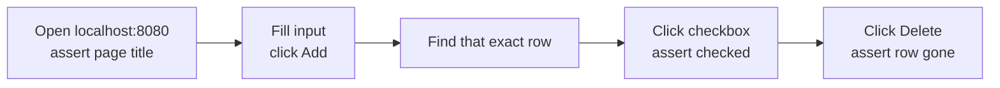

# Let GitHub Copilot Test Your Spring Boot App with Playwright

Your unit tests pass. Your integration tests pass. And you still open the browser
afterwards to check that the page actually works, because a green build has never proved
that a checkbox ticks.

That last manual check is the one nobody automates, because writing browser tests feels
like a project of its own.

In this chapter, we'll hand it to GitHub Copilot. Copilot gets browser-control tools,
you describe the journey in one sentence, and a real Chrome window drives your running
Spring Boot app while you watch.

Then — and this is the part that matters — you read the assertions it actually ran.

## What You Will Learn

Letting an assistant click around your app is a party trick. Letting it *prove* each step
is a test. This chapter is about the difference.

In this chapter, you will learn to:

- **Install an MCP server from the gallery:** Find the Playwright MCP server in the Extensions view and install it with trust confirmed.
- **Write markup that is testable:** Recognise the stable hooks that let a tool target one exact control.
- **Establish a baseline:** Run the existing Java tests so a browser failure means something.
- **Prompt for actions *and* assertions:** Phrase a request so Copilot verifies each state instead of just performing clicks.
- **Read the evidence:** Review the completed tool calls rather than trusting what you saw on screen.

Here is the journey Copilot will run.



Fig 1: Chapter 4 journey — five steps, each with an assertion attached.

## Problem Framing: The Layer Your Tests Do Not Cover

The sample already has unit tests for `TodoService` and an integration test for the Spring
web flow. Both are valuable, and neither clicks anything. They exercise the code beneath
the page, so a broken form attribute, a mislabelled control, or a row that renders but
cannot be selected passes every one of them.

Browser tests close that gap. Historically they cost enough to write that teams skipped
them, which is exactly the kind of cost an assistant with the right tools can absorb.

### Try this

Look at your own most recent UI change and ask what would have failed if the button had
rendered with the wrong handler. If the answer is "nothing until someone noticed", that is
the layer this chapter covers.

## Prerequisites

- **A cloned copy of the sample:** Clone [microsoft/github-copilot-java-mcp-demo](https://github.com/microsoft/github-copilot-java-mcp-demo) and open it in a current version of Visual Studio Code.
- **JDK 25 and both extension packs:** The **Extension Pack for Java** and the **Spring Boot Extension Pack**.
- **GitHub Copilot:** Installed and signed in, with Agent mode available in Copilot Chat.
- **A clean starting state:** The app stopped, port 8080 free, and the Playwright MCP server not yet installed, so the **Install** action is available.
- **Permission to install and run:** Allow MCP server installation and tool use when prompted.

> **If the gallery result is missing:** when `@mcp playwright` returns nothing in the
> Extensions view, add the server to `.vscode/mcp.json` and start it from there instead.
>
> **Browser warning:** Playwright opens a real Chrome window that shows an **unsupported
> command-line flag: --no-sandbox** infobar. Dismiss it with its **×**; it does not affect
> the run.

## What Is the Playwright MCP Server?

Playwright is Microsoft's browser automation library. The Playwright MCP server wraps it
as Model Context Protocol tools, so an assistant can navigate, inspect, and interact with
a page without you writing any test code.

It is worth being precise about what it gives the model:

- **Navigation:** Open a URL and wait for the page to settle.
- **Inspection:** Take an accessibility snapshot of the page, which is how it locates controls by role, label, and text rather than by pixel position.
- **Interaction:** Click, type, select, and press keys against a specific element.
- **Evaluation:** Run a snippet against the page to read state, such as whether a checkbox is checked.

Unlike an MCP server you build into your own application, this one is not part of your
project. It installs into your Visual Studio Code user profile and runs as a local
process, so it stays available in every workspace once installed.

### Markup that a tool can target

Automation is only as reliable as the hooks it aims at. `templates/index.html` carries
stable test ids on every control that matters:

| Hook | Control |
| ------ | --------- |
| `data-testid="new-todo-input"` | The title field |
| `data-testid="add-todo"` | The **Add** button |
| `data-testid="todo-item"` | Each row in the list |
| `data-testid="delete-todo"` | That row's **Delete** button |

The checkbox is handled differently, and deliberately so. It builds an accessible label
from the item's own title:

```html
<input type="checkbox" th:checked="${todo.completed}"
       th:attr="aria-label='Toggle ' + ${todo.title}"
       onchange="this.form.submit()" />
```

Every row's delete button shares one test id, but every row's checkbox has a *unique*
accessible name — `Toggle Verify the browser flow`, for instance. That is what lets the
assistant tick the row it just created rather than whichever row happens to be first, and
it improves the page for screen reader users at the same time.

## Exercise - install the tools and establish a baseline

1. Select the **Extensions** button in the Activity Bar and search **`@mcp playwright`**.
2. Open the Playwright MCP server result and review its publisher and command configuration before installing.
3. Select **Install**, confirm trust for the server, and wait for its running status.
4. Open `templates/index.html` and find the four `data-testid` values and the checkbox's `th:attr` label.
5. Select the **Testing** button in the Activity Bar, select **Run All Tests**, and wait until every Java test passes.


Fig 2: The Testing view aggregates the unit and integration tests across the project. A green baseline here means a later browser failure is a UI failure.

Reviewing the publisher and command before installing is not ceremony. An MCP server runs
a local process with your permissions, so it deserves the same scrutiny as any other
executable you choose to run.

## Exercise - let Copilot drive the browser

1. Select the **Spring Boot Dashboard** icon in the Activity Bar, find **springboot-mcp-demo**, select **Run**, and wait until the Dashboard shows it running on port 8080.
2. Open Copilot Chat, select **Agent** mode, select **Configure Tools...** in the chat input, confirm the Playwright tools are listed and enabled, and close the picker.
3. Enter the following prompt and select **Send**:

   ```text
   Use the Playwright tools to open http://localhost:8080 and verify the page title is 'Java TODO Demo'. Add a todo called 'Verify the browser flow', find that todo's row, complete it and verify it is checked, then delete it and verify it is gone.
   ```

4. If prompted, review the tool name and arguments before choosing **Allow Once**.
5. As Copilot works, watch the page at <http://localhost:8080>: the input filled with **Verify the browser flow**, the new row after **Add**, the checked checkbox after completion, and the row disappearing after deletion.


Fig 3: Playwright drives a real Chrome window against the running Spring Boot app. Here it has added the row and ticked its checkbox — the state the prompt asked it to verify before deleting.

The prompt is doing more work than it looks. Every action is paired with a check —
*verify the page title*, *verify it is checked*, *verify it is gone* — and it names the
exact title to add, so the assistant has something unambiguous to search for. Drop those
and you get a demo. Keep them and you get a test.

## Reading the Evidence

Watching the browser is satisfying and proves very little; a page can flash through a
state too quickly to see, and a human eye is a poor assertion engine.

Return to Chat and review the completed tool calls. The trace shows the page title that
was read, the exact text that was typed, the row that was located, the checked state that
was observed after the toggle, and the absence check that ran after the delete. Each of
those is a value the tool returned, not a claim in the summary.

That is the habit worth taking away: the final response is a summary, and the tool calls
are the test report.

## Exercise - shut down

1. Close the Playwright browser window.
2. Return to the Spring Boot Dashboard, select **Stop** for **springboot-mcp-demo**, and confirm it is no longer running.
3. Leave the Playwright MCP server installed in the Visual Studio Code user profile — it stays available for future Chat sessions in any workspace.

## Quick Question

The prompt names the todo `Verify the browser flow` rather than something short like
`test`. Why does the specific title matter to the reliability of this run?

## Answer

Because it is what makes the row uniquely addressable. The delete buttons all share one
test id, so "the delete button" is ambiguous the moment the list has more than one row.
The checkbox, by contrast, gets an accessible label built from the title — so a distinctive
title produces a distinctive label, and the assistant can target exactly the row it
created. A generic title risks colliding with existing data and turning a passing run into
a false positive, which is the worst outcome a test can have.

## What's Next

You have taken this sample from an unopened folder to a Spring Boot application that
Copilot can both call and test — a web UI, a debugger session, an MCP tool surface, and a
browser-driven test, all from Visual Studio Code.

The natural next step is your own project. The pattern transfers directly: put the logic
in a service, expose the operations you trust as MCP tools, keep stable hooks and
accessible labels in your markup, and describe journeys with assertions attached rather
than clicks.

## Learn more

- [Playwright MCP server](https://github.com/microsoft/playwright-mcp) — the server installed in this chapter, and its tool list.
- [Playwright documentation](https://playwright.dev/docs/intro) — locators, assertions, and the accessibility snapshot model.
- [MCP servers in Visual Studio Code](https://code.visualstudio.com/docs/copilot/chat/mcp-servers) — installing from the gallery and managing trust.
- [Testing Java in Visual Studio Code](https://code.visualstudio.com/docs/java/java-testing) — the Testing view and test discovery.
- [Demo source on GitHub](https://github.com/microsoft/github-copilot-java-mcp-demo) — the sample used in every chapter.

---

Chapter 4 of 4 · Previous: [Expose Your Java Operations to Copilot with MCP](3-expose-tools-with-mcp.md)
