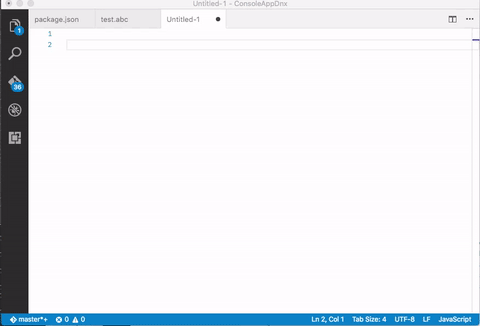
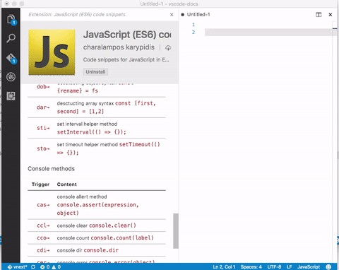
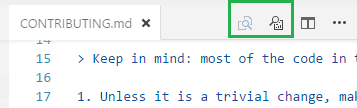
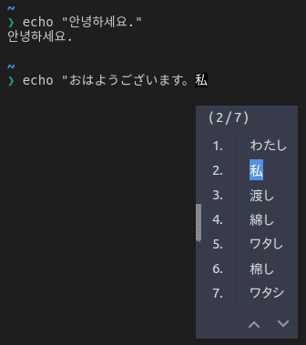
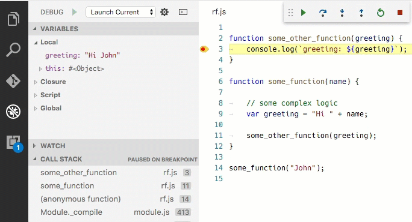

# July 2016 (version 1.4)

During July, we slowed down feature work in favor of reducing our bug backlog and removing engineering debt. However, we were still able to add some improvements.

Here are the highlights:

* **Workbench**: Editor actions such as **Open Preview** and **Switch to Changes View** are back on the title bar. IME and Copy/Paste support in the Integrated Terminal.
* **Editor**: Better snippet and suggestions control. New **Insert Snippet** command with dedicated UI.
* **Debugging**: **Restart Frame** action to rerun a specific stack frame.  'Variable paging' feature moved into VS Code and available to all debug extensions.
* **Extension Authoring**: New 'move' commands to better support VIM gestures. Custom link behavior with the `DocumentLinkProvider` API. Expanded Debug Protocol.

Downloads: [Windows](https://az764295.vo.msecnd.net/stable/6276dcb0ae497766056b4c09ea75be1d76a8b679/VSCodeSetup-stable.exe) |
[OS X](https://az764295.vo.msecnd.net/stable/6276dcb0ae497766056b4c09ea75be1d76a8b679/VSCode-darwin-stable.zip) | Linux 64-bit: [.zip](https://az764295.vo.msecnd.net/stable/6276dcb0ae497766056b4c09ea75be1d76a8b679/VSCode-linux-x64-stable.zip) [.deb](https://az764295.vo.msecnd.net/stable/6276dcb0ae497766056b4c09ea75be1d76a8b679/code_1.4.0-1470329130_amd64.deb) [.rpm](https://az764295.vo.msecnd.net/stable/6276dcb0ae497766056b4c09ea75be1d76a8b679/code-1.4.0-1470329130.el7.x86_64.rpm) | Linux 32-bit: [.zip](https://az764295.vo.msecnd.net/stable/6276dcb0ae497766056b4c09ea75be1d76a8b679/VSCode-linux-ia32-stable.zip) [.deb](https://az764295.vo.msecnd.net/stable/6276dcb0ae497766056b4c09ea75be1d76a8b679/code_1.4.0-1470328389_i386.deb) [.rpm](https://az764295.vo.msecnd.net/stable/6276dcb0ae497766056b4c09ea75be1d76a8b679/code-1.4.0-1470328389.el7.i386.rpm)

## Editor

### Snippets and Suggestions

By default, VS Code shows snippets and completion proposals in one widget. This is not always desirable so we added a new configuration setting called `editor.snippetSuggestions`. To remove snippets from the suggestions widget, set the value to `"none"`. If you'd like to see snippets, you can specify the order relative to suggestions; at the top (`"top"`), at the bottom (`"bottom`"), or inline ordered alphabetically (`"inline"`). The default is `"inline"`.

In addition, we added a new command to insert a snippet, **Insert Snippet**, which displays the available snippets in a drop down.



### Tab Completion

The editor now supports `kbstyle(Tab)` completions. You can enable it with the `editor.tabCompletion` setting. After typing the prefix of a snippet, press `kbstyle(Tab)` to insert it.



Note that quick suggestions and `kbstyle(Tab)` completion might interfere because the suggestions widget also reacts to `kbstyle(Tab)`.

Either disable quick suggestions:

```json
    "editor.quickSuggestions": false
```

or remove snippets from the suggest widget:

```json
    "editor.snippetSuggestions": "none"
```

## Workbench

### Editor Actions

When we added Tabs (tabbed headings), we put editor actions (**Switch to Changes View**, **Open Preview**) into the context menu to gain some space. User feedback was clear that this made the actions much harder to discover and so we have added them back to the title header.



### Drag and Drop

You can now drag and drop Tabs (tabbed headings) across windows. You can now also drop a folder into VS Code to open it.

### Git commit message template

If you have a message template configured in your Git settings, then the Git view in VS Code will show that message in the commit message box by default. Thanks to [William Raiford](https://github.com/bill-mybiz) for contributing this feature.

### Faster Quick Open

We made the first steps in improving the performance of **Quick Open**, particularly for large workspaces such as [Chromium](https://www.chromium.org). On Mac (`kbstyle(⌘+P)`) and on Linux (`kbstyle(Ctrl+P)`), **Quick Open** on a Chromium workspace now takes less than half the time it took before. On Windows (`kbstyle(Ctrl+P)`), it originally took twice as long as on Mac and now it is just as fast. We are not finished, expect more performance gains in the next iteration.

### Integrated Terminal

The integrated terminal had several changes related to polish and compatibility this release:

- **IME support**: Input Method Editor (IME) support has been implemented, allowing input of CJK and Indic characters.

  

- **Copy and paste support on Windows and Linux**: Proper copy and paste support has arrived for Windows and Linux within the terminal. The default keybindings are `kb(workbench.action.terminal.copySelection)` and `kb(workbench.action.terminal.paste)` respectively. Note that these command keybindings are not assigned by default on Mac but you can easily add [your own keybindings](/docs/getstarted/keybindings.md).
- **Context menu**: A right-click context menu has been added with the options **New Terminal**, **Copy** and **Paste**.
- **Accessibility**: It's now possible to escape focus in the terminal by pressing `kb(editor.action.toggleTabFocusMode)` to enable `kbstyle(Tab)` focus mode, just like in the editor. When this mode is enabled, `kbstyle(Tab)` and `kbstyle(Shift+Tab)` will not be passed to the terminal but instead change the element that is being focused.

## Languages

### JSON completions

There has been some small improvements for the JSON completions:

- In schema based JSON documents, we offer completions for empty arrays, objects and string if we know the type of a property but the schema doesn't describe any defaults.
- Completion support for the `$schema` property and values.

## Debugging

### Restart Frame

VS Code now supports restarting execution at a stack frame. This can be useful in situations where you have found a problem in your source code and you want to rerun a small portion of the code with modified input values. Stopping and then restarting the full debug session can be very time-consuming. The **Restart Frame** action allows you to re-enter the current function after you have changed variables with the **Set Value** action:



Note that **Restart Frame** won't unroll any state changes, so it may not always work as expected.

**Restart Frame** is only available if the underlying debug extension supports it and currently only VS Code's built-in Node.js debugging does. Make sure to use a Node.js version >= 5.11 since earlier versions do not work in all situations.

### Variable Paging

Previously VS Code expected that large data structures like arrays were broken into "chunks" in a debug extension and consequently only a few debug extensions supported this useful feature. With this release, we have moved this functionality into the VS Code debugger front-end so that all debug extensions can easily benefit from this in the future.


See section "Debug Protocol Changes" below for details of how a debug extension can make use of this.

### Double Click Debug Toolbar Centers

Double clicking on the Debug view toolbar drag icon will center the Debug toolbar. This makes it easy to restore the default state.

## Extension Authoring

### New settings to replace deprecated __characterPairSupport and __electricCharacterSupport.

The deprecated configuration settings can now both be replaced by the `autoClosingPairs` setting in the language-configuration.json file in your extension. See [#9281](https://github.com/Microsoft/vscode/issues/9281) for detailed instructions.

### Editor Commands

In order to allow the [VIM extension](https://marketplace.visualstudio.com/items?itemName=vscodevim.vim) to make good progress on their [roadmap](https://github.com/VSCodeVim/Vim/blob/master/ROADMAP.md) particularly on up-and-down motion and `kbstyle(Tab)` related commands, we added the following editor APIs:

- **Move cursor:** Moves the cursor to different logical positions in the editor - See [9143](https://github.com/Microsoft/vscode/issues/9143).

```javascript
commands.executeCommand('cursorMove', {to: 'up', by: 'wrappedLine', value: '2'})
```

- **Move active editor:** Moves the active editor across groups or across Tabs within a group - See [8234](https://github.com/Microsoft/vscode/issues/8234#issuecomment-234573410).

```javascript
commands.executeCommand('moveActiveEditor', {to: 'left', by: 'tab', value: '3'})
```

### Sorting of groups

Last milestone, we added support to contribute menu items to different places in the editor. This milestone we refined sorting of groups. They are now sorted in lexicographical order with the following defaults/rules.

The context menu of the editor has these default:

* `navigation` - The `navigation` group comes first in all cases.
* `1_modification` - This group comes next and contains commands that modify your code.
* `9_cutcopypaste` - The last default group with the basic editing commands.


You can add menu items to these groups or add new groups of menu items in between, below, or above. In this release, only the editor context menu allows this grouping control but it will soon be available for the editor title menu and the explorer context menu as well.

### DocumentLinkProvider API

VS Code has a built in link detector that finds `http`, `https`, and `file` links to make them clickable in the editor. We have added new API that allows extension writers to add custom link detection logic. Implement a `DocumentLinkProvider` and use the [`registerDocumentLinkProvider`](https://github.com/Microsoft/vscode/blob/master/src/vs/vscode.d.ts#L3814) function to register it with the editor.

### Debug Extension Authoring: Additions to the Debug Protocol

The [debug protocol](https://github.com/Microsoft/vscode-debugadapter-node/blob/master/protocol/src/debugProtocol.ts) has been extended in the following areas (and VS Code already provides the corresponding UI):

* **Restart Frame**: If a debug adapter returns the capability `supportsRestartFrame`, VS Code shows a **Restart Frame** action in the context menu of the **CALL STACK** view and calls the new `restartFrame` request upon execution of the **Restart Frame** action. The `restartFrame` request must result in a `StoppedEvent` so that the UI can be updated for the new location.
* **Variable Paging**: 'Variables paging' adds support for paging variables and their children. The debugger UI in VS Code 1.4 uses this to present variables with many children with a better scalable (paged) UI and fetches the children in a piecemeal way. A debug adapter can find out whether the client supports variable paging by checking the value of the `supportsVariablePaging` client capability passed as an argument to the `initializeRequest`.<br>
Through the optional attributes `indexedVariables` and `namedVariables`, the debug adapter can return both the number of indexed properties (e.g. array slots) and named properties of a variable. These two properties can be returned in all places where a `variablesReference` property is returned, that is in the `Variables` and `Scope` data types and in the `evaluateRequest` response.<br>
Additional optional attributes have been added to the `variablesRequest` to give the VS Code debugger UI better control over what children of a variable to fetch. An attribute `filter` is used to limit the fetched children to either `indexed` or `named` and the attributes `start` and `count` are used to further limit the children to a certain range.
* **Continued Event**: A debug adapter can now optionally send a `ContinueEvent` to the client to indicate that the execution of the debuggee has continued.
* **Source request supports MIME type**: A debug adapter can now set a `mimeType` attribute on the `SourceRequest` response which a client can use to find a suitable editor.
* **Variable Type client capability**: A debug adapter can find out whether the client shows the variable's type attribute in the UI by checking the value of
the `supportsVariableType` client capability passed as an argument to the `initializeRequest`.

## Notable Changes

* [4842](https://github.com/Microsoft/vscode/issues/4842): Allow to disable drag and drop in the files explorer
* [7839](https://github.com/Microsoft/vscode/issues/7839): Sometimes SVG icons do not show up on Windows 7
* [8788](https://github.com/Microsoft/vscode/issues/8788): Weird tabs auto scrolling behaviour
* [8704](https://github.com/Microsoft/vscode/issues/8704): Deleting folder containing dirty files closes dirty editors
* [8617](https://github.com/Microsoft/vscode/issues/8617): Run selected text in active terminal is not running the selected text on Windows
* [8219](https://github.com/Microsoft/vscode/issues/8219): Lines containing unicode characters in integrated terminal differ in height
* [9010](https://github.com/Microsoft/vscode/issues/9010): Global search and replace: Support regular expression variables in replace

These are the [closed bugs](https://github.com/Microsoft/vscode/issues?q=is%3Aissue+label%3Abug+milestone%3A%22July+2016%22+is%3Aclosed) and these are the [closed feature requests](https://github.com/Microsoft/vscode/issues?q=is%3Aissue+milestone%3A%22July+2016%22+is%3Aclosed+label%3Afeature-request) for the 1.4 update.

## Thank You

Last but certainly not least, a big *__Thank You!__* to the following folks that helped to make VS Code even better:

* [Lucian Wischik (@ljw1004)](https://github.com/ljw1004): Fix small typo [PR vscode-languageserver-node-example#17](https://github.com/Microsoft/vscode-languageserver-node-example/pull/17)
* [Markus Westerlind (@Marwes)](https://github.com/Marwes): DidOpenTextDocumentParams does not extend TextDocumentIdentifier [PR language-server-protocol#36](https://github.com/Microsoft/language-server-protocol/pull/36)
* [Eshwar Andhavarapu (@gontadu)](https://github.com/gontadu): Added more T-SQL keywords [PR #9469](https://github.com/Microsoft/vscode/pull/9469)
* [Pouya Kary (@pmkary)](https://github.com/pmkary): Added missing "rem" unit [PR #9497](https://github.com/Microsoft/vscode/pull/9497)
* [xzper (@f111fei)](https://github.com/f111fei):
  * Fix extracting zip file [PR #7599](https://github.com/Microsoft/vscode/pull/7599)
  * Fix installing extension by dropping [PR #8786](https://github.com/Microsoft/vscode/pull/8786)
  * Fix debounceEvent [PR #9186](https://github.com/Microsoft/vscode/pull/9186)
* [Sorin Iclanzan (@iclanzan)](https://github.com/iclanzan): Fix sensitivity not always being applied. [PR #9005](https://github.com/Microsoft/vscode/pull/9005)
* [Tamas Kiss (@kisstkondoros)](https://github.com/kisstkondoros):
  * Fixes invisible cursor in long editor lines [PR #8854](https://github.com/Microsoft/vscode/pull/8854)
  * Fixes mousewheel zoom in case of inline diff view [PR #8853](https://github.com/Microsoft/vscode/pull/8853)
  * New cursor animation styles implemented [PR #8153](https://github.com/Microsoft/vscode/pull/8153)
* [一丝 (@yisibl)](https://github.com/yisibl): Add Selection To Previous Find Match [PR #8677](https://github.com/Microsoft/vscode/pull/8677)
* [Giorgos Retsinas (@elemongw)](https://github.com/elemongw): [Mac] `kbstyle(Ctrl+P)` and `kbstyle(Ctrl+N)` for up and down navigation. [PR #7316](https://github.com/Microsoft/vscode/pull/7316)
* [William Raiford (@bill-mybiz)](https://github.com/bill-mybiz): Git commit message templates, restore previous message on undo. [PR #8933](https://github.com/Microsoft/vscode/pull/8933)
* [Georgios Kalpakas (@gkalpak)](https://github.com/gkalpak): docs(LanguageConfiguration): fix typo [PR #8703](https://github.com/Microsoft/vscode/pull/8703)
* [David Wilson (@daviwil)](https://github.com/daviwil):
  * Roll back PowerShell syntax definition [PR #9922](https://github.com/Microsoft/vscode/pull/9923)
  * Fixes for PowershellSyntax.tmLanguage [PR #9707](https://github.com/Microsoft/vscode/pull/9707)
* [David Hollinger III (@dhollinger)](https://github.com/dhollinger): Remove .pp from Ruby extension list [PR #8637](https://github.com/Microsoft/vscode/pull/8637)