---
Order:
TOCTitle: June 2016
PageTitle: Visual Studio Code June 2016 1.3
MetaDescription: See what is new in the Visual Studio Code June 2016 Release (1.3)
MetaSocialImage: June_2016/social.jpg
---
# June 2016 (version 1.3)

## 1.3.1 Recovery build

To fix several issues, we're releasing a 1.3.1 recovery build. You can view the resolved issues [here](https://github.com/Microsoft/vscode/milestone/24?closed=1).

Downloads: [Windows](https://az764295.vo.msecnd.net/stable/e6b4afa53e9c0f54edef1673de9001e9f0f547ae/VSCodeSetup-stable.exe) |
[OS X](https://az764295.vo.msecnd.net/stable/e6b4afa53e9c0f54edef1673de9001e9f0f547ae/VSCode-darwin-stable.zip) | Linux 64-bit [.zip](https://az764295.vo.msecnd.net/stable/e6b4afa53e9c0f54edef1673de9001e9f0f547ae/VSCode-linux-x64-stable.zip) [.deb](https://az764295.vo.msecnd.net/stable/e6b4afa53e9c0f54edef1673de9001e9f0f547ae/code_1.3.1-1468329898_amd64.deb) [.rpm](https://az764295.vo.msecnd.net/stable/e6b4afa53e9c0f54edef1673de9001e9f0f547ae/code-1.3.1-1468329898.el7.x86_64.rpm) | Linux 32-bit [.zip](https://az764295.vo.msecnd.net/stable/e6b4afa53e9c0f54edef1673de9001e9f0f547ae/VSCode-linux-ia32-stable.zip) [.deb](https://az764295.vo.msecnd.net/stable/e6b4afa53e9c0f54edef1673de9001e9f0f547ae/code_1.3.1-1468330706_i386.deb) [.rpm](https://az764295.vo.msecnd.net/stable/e6b4afa53e9c0f54edef1673de9001e9f0f547ae/code-1.3.1-1468330706.el7.i386.rpm)

## June Release Summary

We're really excited about the June release of VS Code. We've made some big changes to Extension management (dedicated Extensions View) and added Tabs (tabbed editor panes). Other new features include global Search and Replace, improved Drag and Drop and optional indentation guides. All of this along with enhancements to existing features like the Integrated Terminal and delivering a set of important bug fixes.

Here are the highlights:

* **Tabs**: Tabbed editor panes allow you to quickly navigate to your files and organize your workbench.
* **Extensions**: New in-product Extensions View to quickly find, install and manage your extensions.
* **Workbench**: Enhanced Drag and Drop, Preview Editors to conserve your editor panes, and multiple Integrated Terminals.
* **Editor**: Global Search and Replace, Indent Guides, Problems panel to view errors and warnings.
* **Languages**: Better, more complete Emmet support, Atom JavaScript grammar extension.
* **Debugging**: Lots of improvements including support for attaching to running Node.js processes and changing variable values during a debug session.
* **Extension Authoring**: A new contribution point for menu bars and context menus. New APIs to open non-text resources and add editor decorator attachments.

## Tabs

With this release, VS Code shows open files as Tabs in the title area above the editor. You can move Tabs around via Drag and Drop to organize your files or right-click on a Tab to perform useful file specific actions.

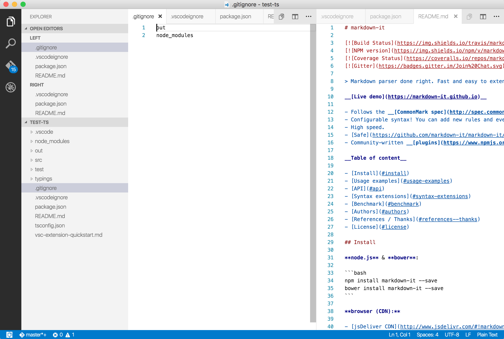

If you prefer not to use Tabs, you can disable them through the `workbench.editor.showTabs` setting.

When there is not enough available space to show all files, you will see Tabs overflowing to the left and right. You can always use the mouse to scroll left and right across all tabs. The little overflow icon (see image below) is enabled as soon as there are Tabs outside of the visible view. Clicking on the overflow icon shows a list of all Tabs opened in the group.

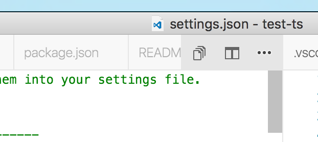

You can use the new `workbench.editor.openPositioning` setting to control where new editors should open. By default they open to the right of the active Tab, but you can change this to open to the left, or to the beginning or end of all editors.

### Open Editors View

The new **OPEN EDITORS** view in the Explorer is the replacement to the previous **WORKING FILES** view.

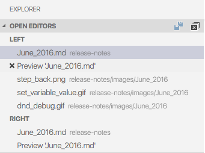

The **OPEN EDITORS** view is a visual representation of the editor (open file) stacks:

* Each editor group with the editors that belong to it is shown.
* Clicking on an editor will make it active and open it in the corresponding group.
* Top level actions to close all or save all open editors.
* Editor level actions to close or save an editor.
* Context menu actions provide more refined actions.
* It is possible to drag and drop editors between editor groups or from the Explorer

You can hide the **OPEN EDITORS** view by setting the number of visible items to 0, with `"explorer.openEditors.visible": 0`.

**Note:** Since the WORKING FILES view has been deleted, please refer to [this issue](https://github.com/Microsoft/vscode/issues/6605) to get an overview of the new or changed command identifiers.

### More on Editor Stacks

As a preparation for enabling Tabs in the workbench, we revisited how you can interact with editors in VS Code. Many users coming from other tools were confused by some of the editor (open file) behavior in VS Code.

For example:

* Closing a dirty editor (an editor with an unsaved file) did not prompt for saving.
* Closing an editor, closed the entire group without revealing the previous editor.
* The editor history showed a list of all editors ever opened and not a list of editors you opened in a group.
* **WORKING FILES** view in the Explorer was a confusing concept.

With editor **stacks**, we've tried to address these issues:

* You can open up to 3 **editor groups** side by side and each group contains a **stack of editors**.
* Every time you open an editor, it is added to the top of the stack.
* Closing an editor from a group reveals the editor that was previously opened in that group until the last editor closes and the group hides.
* You get prompted to save for dirty editors.

Use `kb(workbench.action.openPreviousRecentlyUsedEditorInGroup)` to bring up a list of most recently used editors of a group for navigation. Use the **View: Show All Editors** command to show a list of all open editors across all groups.

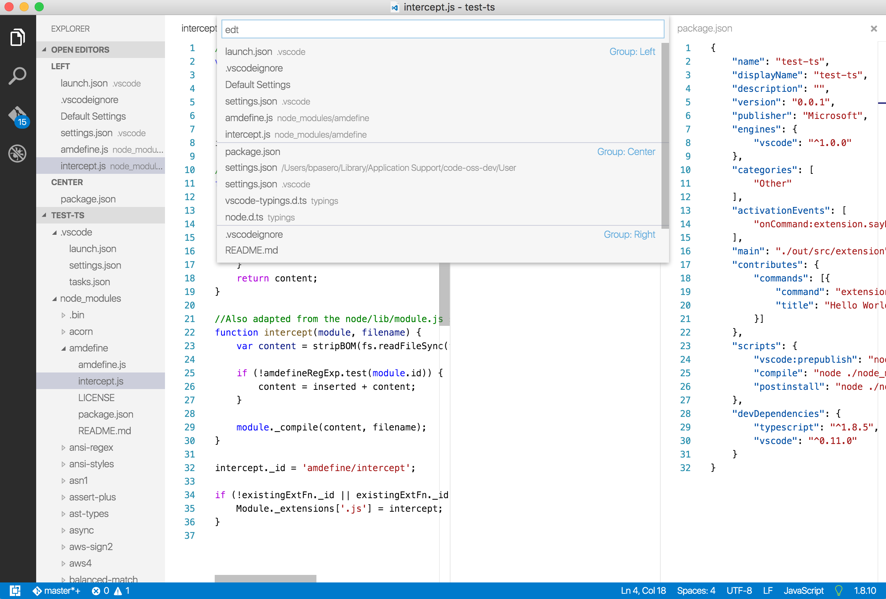

Note that the behavior of editor stacks is independent from having Tabs enabled or not. You will benefit from these changes even if you don't want to use Tabs.

**Note:** Due to the large conceptual impact of editor stacks, many command ids have been renamed and new commands introduced. Please refer to [this issue](https://github.com/Microsoft/vscode/issues/6605) that documents the changes. It also provides guidance if you liked the previous behavior and explains how to change key bindings back to the old behavior.

## Extension Management

We have introduced a new Extensions View to improve finding, installing, and updating VS Code [extensions](/docs/editor/extension-gallery.md).

To display the Extensions View, click the Extensions View icon or press `kb(workbench.view.extensions)`:


By clicking on the `...` **More Actions** button, it is possible to show:

* The list of currently installed extensions
* The list of outdated extensions that can be updated
* The list of recommended extensions based on your workspace
* The list of globally popular extensions

Clearing the search box, shows the list of installed extensions.

Browsing through a list of extensions, it is possible to install, uninstall or update them. Clicking on an extension will display the detailed description in the editor area.

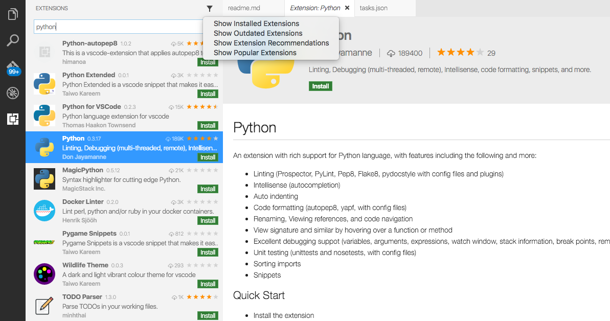

## Workbench

### Errors and Warning in the Problems panel

With the June release, we now offer a new **Problems** panel, docked at the bottom of VS Code, that shows errors, warnings and other information generated by different sources like language servers, linters and others. In previous releases, we showed the errors and warnings in the quick box at the top of the editor. We have received feedback from users that this made it difficult to review errors and warnings while editing files. The new panel makes it easy to navigate through your errors and warnings and fix them while the editor is still open.

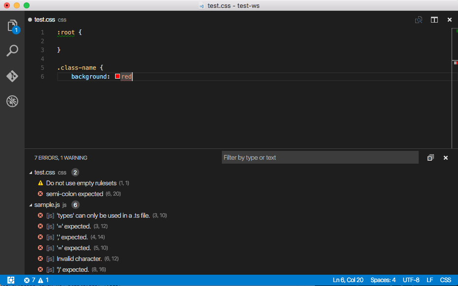

A filter box is provided to search and filter among the problems shown. You can either filter by type or by text.  For example, 'errors' will filter for all problems of type error. 'character' will filter for problems with messages containing the word 'character'.

You can open the **Problems** panel by:

* Using `kb(workbench.actions.view.problems)`
* From the **View** | **Problems** menu
* From the **View** > **Show Problems** command in the **Command Palette**

The key binding `kb(workbench.actions.view.problems)` that was used to show errors and warnings in the quick open/quick box will now open the **Problems** panel.

By default, the **Problems** panel scrolls and shows problems for your active file. If you don't want this automatic reveal behavior, you can disable it through a setting `problems.autoReveal`. Set `problems.autoReveal` to `false` to prevent your Problems view from changing as you switch between active files.

>**Note:** This view is just a representation of markers generated by the language servers or linters or build tasks or any external builders configured in or outside your workspace. You have to configure or customize them appropriately in order to see the expected problems.

### More powerful Drag and Drop

With all the work on Tabs, we also looked at improving the Drag & Drop support in the editor. We always allowed you to drop files from outside VS Code into the editor to open the files and now there is a lot more that you can do:

#### Drop to Split

Drag some files to the left or right area of an editor to open it to the side of that editor. You can either drag from the Explorer or a Tab if Tabs are enabled.

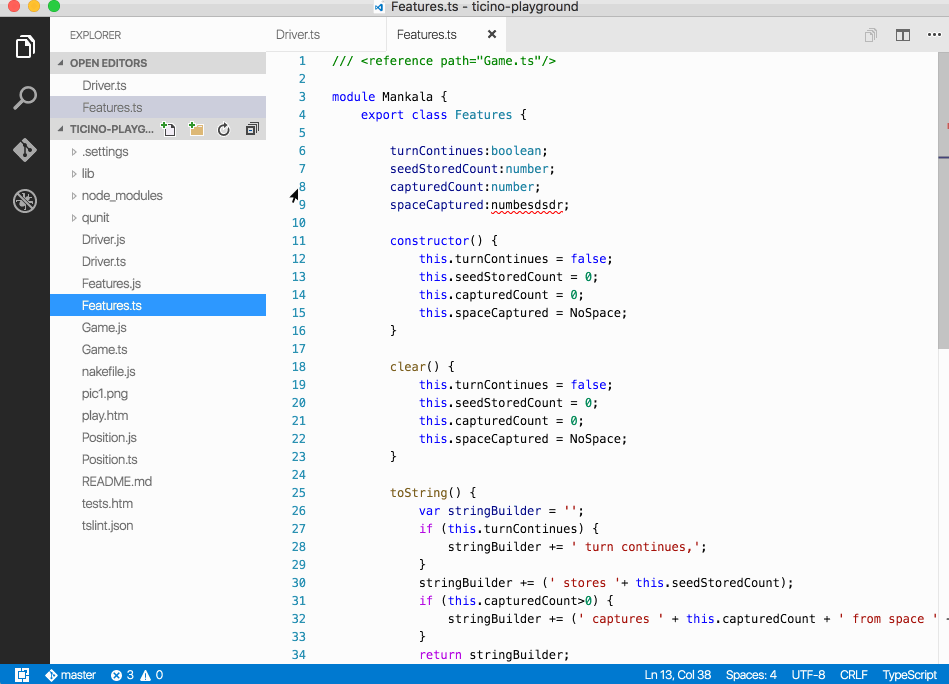

#### Drop Feedback

Whenever you are dragging files or a Tab over the editor area, you now get drop feedback to indicate the target position of the drop.

#### Drag from Explorer and Opened Editors view

You can now drag a file or editor from the Explorer and the **OPEN EDITORS** view to the editor space to open it at a specific location.

### Preview Editors

Closely related to editor stacks and Tabs are **preview editors**. If you are browsing many files, you might not want to see a Tab opened for each file you open. Preview editors help reduce the number of opened editors (and Tabs) by reusing the current editor. A file will open in preview mode if you open it by single clicking in the Explorer. As long as the editor stays in preview mode, other files will open in the same location as the preview editor.

Certain actions cause a preview editor to become a normal editor:

* When you modify the contents of a file, the editor will be kept open.
* The same is true for when you double-click on a file in the Explorer or inside a Tab or move a file to a specific editor group.

Preview editors are indicated using an italic font style.

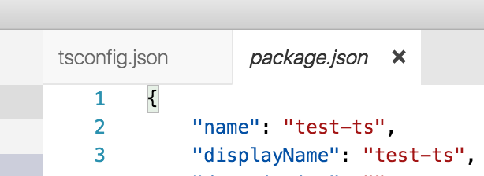

We introduced new settings to control the behavior of preview editors:

* `workbench.editor.enablePreview` to globally enable or disable preview editors.
* `workbench.editor.enablePreviewFromQuickOpen` to enable or disable preview editors when opened from quick box/quick open.

### Integrated Terminal

The integrated terminal that was introduced in VS Code 1.2.0 has seen many improvements this release, the primary one being the ability to launch and use multiple terminals at the same time. Terminal instances can be added by hitting the plus icon on the top-right of the **TERMINAL** panel or by triggering the `kb(workbench.action.terminal.new)` command. This creates another entry in the dropdown list that can be used to switch between them.


Several new commands were added to aid with management of the **TERMINAL** panel and its terminal instances.

They are:

* `workbench.action.terminal.focus`: Focus the terminal. This is like toggle but focuses the terminal instead of hides it, if it is visible.
* `workbench.action.terminal.focusNext`: Focuses the next terminal instance.
* `workbench.action.terminal.focusPrevious`: Focuses the previous terminal instance.
* `workbench.action.terminal.kill`: Remove the current terminal instance.

The ability to run selected text in the current terminal has been added through the `workbench.action.terminal.runSelectedText` command.

To use this command, select text in an editor and run the command via the **Command Palette**:

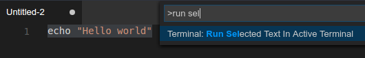

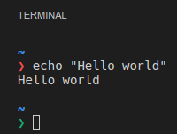

The following improvements were also added:

* Copy and paste on Linux and Windows is now available using `kbstyle(Ctrl+Insert)` and `kbstyle(Shift+Insert)` respectively. This is temporarily non-configurable until we can [route custom copy/paste keybindings](https://github.com/sourcelair/xterm.js/issues/118) to the xterm.js library.
* CJK characters should now use the correct width.  Credit for this goes to [@jerch](https://github.com/jerch) in [this PR](https://github.com/sourcelair/xterm.js/pull/144).
* Performance of the terminal has improved significantly and should no longer perform poorly when running commands that produce large output.
* `kbstyle(Ctrl+Left)` and `kbstyle(Ctrl+Right)` now tells the underlying shell to jump over words in the input.
* Terminal cursor blinking is now enabled by default. It shares the configuration value with the editor's `editor.cursorBlinking` setting.
* A hollow cursor is shown when the terminal is not focused.
* Terminal font size and line height can be customized via settings, thanks to a [PR](https://github.com/Microsoft/vscode/pull/6998) from [@kisstkondoros](https://github.com/kisstkondoros).
* Selection has been improved to now select the full line, contain no margin and also invert the text colors.
  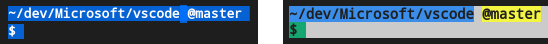
* Arguments can be passed to the terminal shell on Linux and OS X using the `terminal.integrated.shellArgs.*` settings.

### Command Palette: File: Open Recent in new Window

The command **File: Open Recent** from the **Command Palette** makes it very easy to quickly switch between previously opened folders or files. Usually the selected file or folder would open in the running instance. In this release, we added support to open into a new window if you select an entry while having the `kbstyle(Ctrl)` (`kbstyle('Cmd')` on Mac) key pressed.

### Restore Full screen

A new setting `window.restoreFullscreen` has been added to open VS Code in full screen if it was previously closed in full screen mode.

## Editor

### Global Search and Replace

[Global Search and Replace](https://github.com/Microsoft/vscode/issues/1690) was one of the most requested features from our users. With this release, we enhanced our Search view to include Replace functionality so that you can replace text across multiple files. You can replace in all files or pick file by file or result by result. You can also exclude results or files and then perform replace on the rest. The Search view gives you a nice preview and clicking on a pending change will bring up the Diff editor view showing the file before and after replace.

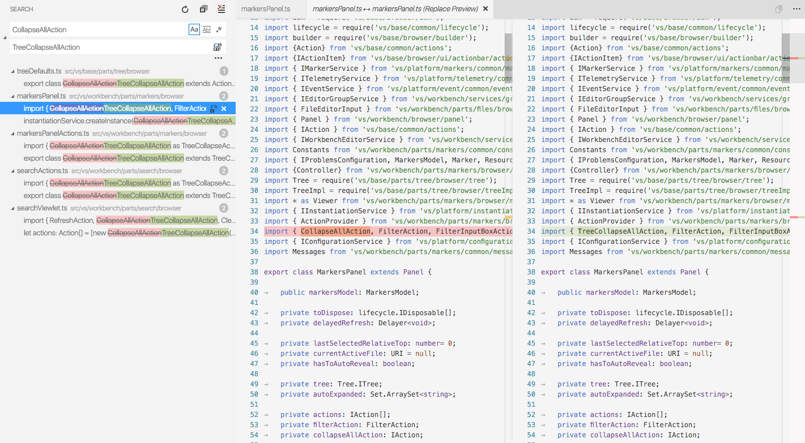

Replace functionality can be accessed:

* In the **Search View** by expanding the Search textbox
* Using `kb(workbench.action.replaceInFiles)`, from the **Edit** | **Replace in Files** menu
* Using **Replace in Files** command in the **Command Palette**

>**Note:** Since Search has a limitation of showing a maximum of 2048 results, Replace currently has the same limitation.

### Indent Guides

VS Code can now show indent guides, enabled with the `editor.renderIndentGuides` setting.

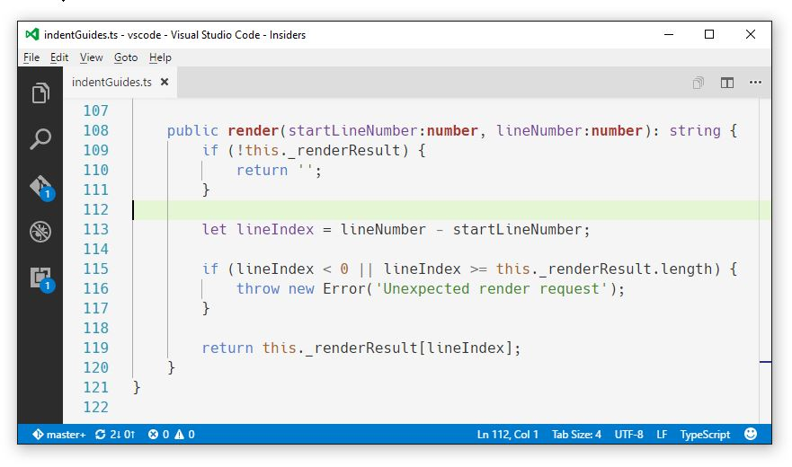

### Suggestions for command identifiers

When authoring the `keybindings.json` file, you now get completions for the available commands.


### Editor Font Zooming with mouse wheel

Thanks to [@kisstkondoros](https://github.com/kisstkondoros), with [PR #6990](https://github.com/Microsoft/vscode/pull/6990), after setting `editor.mouseWheelZoom: true`, it is possible to change the font size of the editors by pressing `kbstyle(Ctrl)` (`kbstyle('Cmd')` on Mac) and scrolling with the mouse wheel:

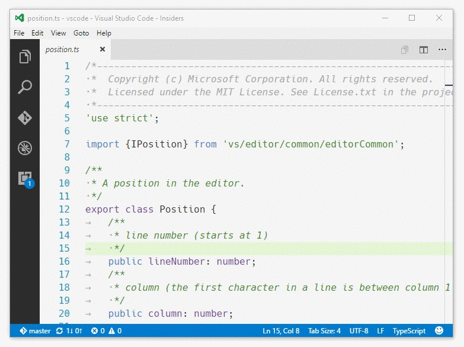

### Multiline Find

We have added support for multiline Find and Replace:

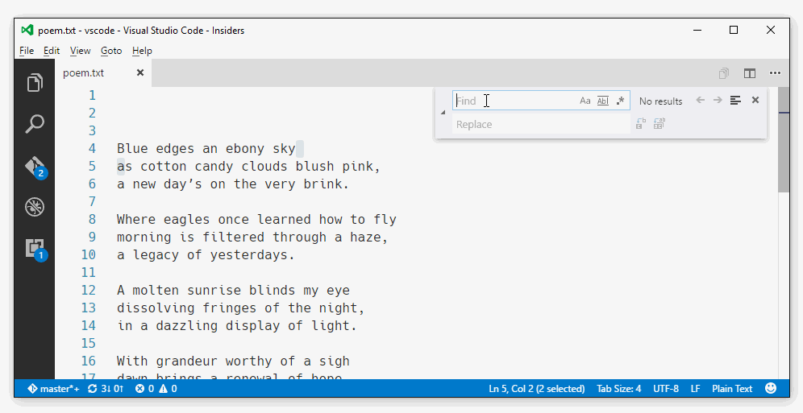

### Emmet

Thanks to some great support from Denis Malinochkin ([@mrmlnc](https://github.com/mrmlnc)) through Pull Requests and testing help, we are now covering many more Emmet features (Wrap with Abbreviation, Remove Tag, Update Tag, Balance, Toggle Comment, ...).

## Languages

### Extract CSS/LESS/SCSS and JSON into extensions

The CSS, LESS, and SCSS language support has been refactored to be regular VS Code extensions. As all these languages are based on the same code base, they share the same language server. The language server runs in a separate node process, using the [language server protocol](https://microsoft.github.io/language-server-protocol) to communicate with VS Code.

### Extract Markdown into an extension

The Markdown language support has been refactored to be a regular VS Code extension. It uses the Markdown TextMate grammar for syntax highlighting source and renders the Markdown as HTML using the [markdown-it library](https://github.com/markdown-it/markdown-it) which implements the [CommonMark Spec](http://spec.commonmark.org/0.25/).

### Atom JavaScript grammar

As an alternative to the built-in JavaScript grammar, you can now install the [Atom JavaScript grammar](https://marketplace.visualstudio.com/items?itemName=ms-vscode.js-atom-grammar). It differs from the built-in grammar in that it creates tokens for variable and function references which, if supported by the theme, can be colorized differently.

## Debugging

### Moveable Debug Toolbar

Initiated by this [user request](https://github.com/Microsoft/vscode/issues/4580), it is now possible to drag the debug toolbar horizontally:

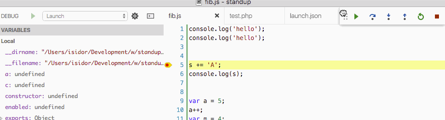

### Changing Variable Value

We now support changing the value of simple variables if a debug extension supports this.

Node Debug is the first extension to do so:

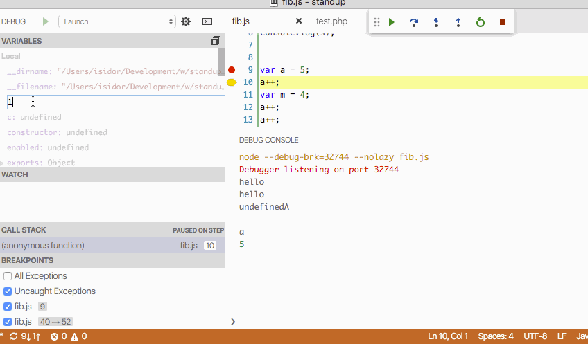

A simple variable is a leaf in the variables tree, e.g. a variable, an object property, or an array element.

### Show Variable Type on Hover

If a debug extension supports variable types, we now show the type when hovering over the variable name.

### Step Back

If a debug extension supports _step back_ we now expose a step back action and button:

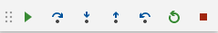

### OS specific launch configurations

Initiated by a [user request](https://github.com/Microsoft/vscode/issues/1873), it is now possible to specify OS specific configurations inside a `launch.json`:

```json
{
   "type": "node",
   "request": "launch",
   "runtimeExecutable": "mynode",
   "windows": {
     "runtimeExecutable": "mynode.exe"
   }
}
```

## Node.js Debugging

### Attach to Process

Node.js debugging now supports attaching to a Node.js process that has not been started in debug mode. This can be useful if you need to debug a production server that cannot always run in debug mode for performance reasons.

In order to attach to a Node.js process, you specify its _process id_ via a `processId` attribute in an `attach` launch configuration.

Since it is not very practical to always having to edit the launch configuration before starting a debug session, we've introduced a new type of variable that can bind to an interactive UI, e.g. to a process picker:

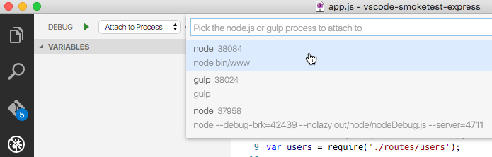

Here is a launch configuration that uses the `${command:PickProcess}` variable to let the user select a Node.js process before starting the debug session:

```json
{
   "name": "Attach to Process",
   "type": "node",
   "request": "attach",
   "processId": "${command:PickProcess}"
}
```

## Extension Authoring

### Menu Items and Context Menu Entries

We now allow extension writers to contribute to the Explorer context menu (`explorer/context`), the editor context menus (`editor/context`), and the editor title menu (`editor/title`).

It works in two steps:

1. Assign a title and an icon to a command using the enhanced `commands` contribution point.
2. Create menu items using the new `menus` contribution point.

A menu item is defined for a menu location like `editor/context` and must at least specify the `command` to run. To avoid overly cluttered menus, a menu item should also specify a condition under which it shows. Last, an alternative command and a group into which the item is sorted can be defined. Groups are visually separated and there is a special group called _navigation_ which is the most prominent.

```json
"commands": [{
    "command": "markdown.showPreview",
    "title": "Open Preview",
    "icon": {
        "light": "./media/Preview.svg",
        "dark": "./media/Preview_inverse.svg"
    }
}],
"menus": {
    "explorer/context": [
        {
            "when": "resourceLangId == markdown",
            "command": "markdown.showPreview",
            "group": "navigation"
        }
    ]
}
```

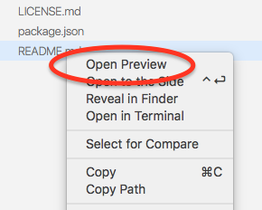

The snippet above adds an entry into the navigation group of the Explorer context menu **when** the resource is of the Markdown language. *Note* that the URI of the current resource is passed to the command when being executed from a menu item.

### Add decorations before and after text

New capabilities have been added to the decoration APIs. You can now add 'attachments' before and after a decoration. Attachments can be icons as well as text content that sticks to the decorated text.

An example are the CSS color decorators attached to color values in the text:

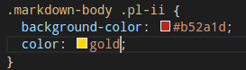

Decoration attachments can be defined on decoration types (see the `before` and `after` properties on `ThemableDecorationInstanceRenderOptions`) and fine-tuned on individual decorations (see the `before` and `after` properties on `ThemableDecorationRenderOptions`). You can review these properties in the `vscode` namespace API [reference](/docs/extensionAPI/vscode-api.md).

### API tweaks

* The Uri-class now allows you derive a Uri from an existing one: `someUri.with({scheme: 'newScheme', path: 'newPath'})`
* The `previewHtml` command now allows you to provide a `title`.
* When previewing html, we expose the style of the current theme via class names of the body element. Those are `vscode-light`, `vscode-dark`, and `vscode-high-contrast`.
* Last, there is a new command `vscode.open` to open non-textual resources like images.

### Debug Extension Authoring: Command Variables

VS Code has supported variable substitution in `launch.json` configurations for some time. This release introduces a new type of variable that is bound to a VS Code _command_. When a debug session is started, all command variables that occur in the underlying launch configuration are first collected and then executed. Multiple occurrences of a variable do not result in multiple execution. Before the launch configuration is passed to the debug adapter, all variables are substituted with the command results.

A command is implemented and registered in an extension and its return value is used as the variable's value. The implementation of a command can range from a simple expression with no UI, to some sophisticated functionality based on the UI features available in the extension API.

An example for this functionality can be found in `node-debug`. Here a variable `${command:PickProcess}` is bound to a process picker command. A new 'Attach to Process' launch configuration uses the variable to let the user pick a Node.js process when running the launch configuration.

Introducing a new command variable is simple:

* Implement and register the command in your extension (not in the debug adapter).
* Add a `variables` section to your `debuggers` contribution point.
* Add one name/command-binding per variable.

  For example:

  ```
    "debuggers": {
      ...
      "variables": {
        "RemoteHost": "askUserForRemoteHostCommand"
      },
    ...
    }
  ```

* The variable can now be used in any string typed value of a launch configuration as `${command:RemoteHost}`.
* To make the `RemoteHost` variable discoverable for the user consider adding it to the `configurationAttributes` or `initialConfigurations` sections of the `debuggers` contribution point.

### Debug Extension Authoring: Additions to the Debug Protocol

The debug protocol has been extended in three areas (and VS Code already provides the corresponding UI):

* **Editing variables**: If a debug adapter returns the [capability `supportsSetVariable`](https://github.com/Microsoft/vscode-debugadapter-node/blob/master/protocol/src/debugProtocol.ts#L594), VS Code supports setting the value of unstructured (leaf) variables in the Variables view by calling the [`setVariable` request](https://github.com/Microsoft/vscode-debugadapter-node/blob/master/protocol/src/debugProtocol.ts#L476).
* **Stepping backward**: If a debug adapter returns the [capability `supportsStepBack`](https://github.com/Microsoft/vscode-debugadapter-node/blob/master/protocol/src/debugProtocol.ts#L592), VS Code enables the UI for stepping back and will call the [`stepBack` request](https://github.com/Microsoft/vscode-debugadapter-node/blob/master/protocol/src/debugProtocol.ts#L476).
* **Show variable type on hover**: If a debug adapter returns the optional `type` attribute for the [`variable` type](https://github.com/Microsoft/vscode-debugadapter-node/blob/master/protocol/src/debugProtocol.ts#L741), VS Code will show  the value of this attribute when hovering over the variable's name.

### Creating Errors/Warnings from an Extension (Diagnostics)

With the introduction of the new **Problems** panel, we started to work on support for project wide builders and linters. As a first step, we eliminated the automatic clearing of problems when an document is closed. Otherwise opening and closing a document would change the problem set generated by a project wide builder. Due to this change, extensions like linters generating diagnostics are responsible for clearing them when a document is closed. All extension providers generating diagnostics need to adopt to this change.

In a linter that uses the `vscode-language-server` node module, this can be achieved as follows:

```typescript
documents.onDidClose((event) => {
  connection.sendDiagnostics({ uri: event.document.uri, diagnostics: [] });
});
```

## Monaco Editor

The Monaco Editor is now on [npm](https://www.npmjs.com/package/monaco-editor-core)! It is the VS Code source code editor extracted and packaged as a library that can be integrated in any web application to work in any modern browser. We have created a [playground](https://microsoft.github.io/monaco-editor/index.html) showcasing some of the APIs. You can get it via `npm install monaco-editor`.

All further Monaco Editor specific release notes will be available at its distribution [repository](https://github.com/Microsoft/monaco-editor/blob/master/CHANGELOG.md).

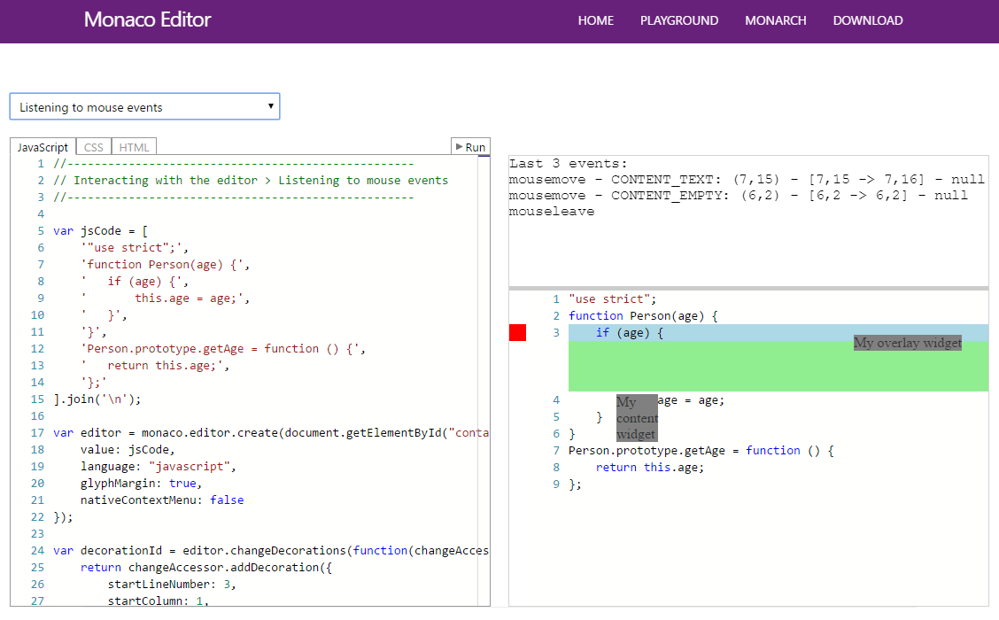

### CSS/LESS/SCSS and JSON language services are now available

Additionally, the CSS/LESS/SASS parser and language intelligence source code has been extracted to a separate node module [vscode-css-languageservice](https://github.com/Microsoft/vscode-css-languageservice) which is used by both the [Monaco editor](https://github.com/Microsoft/monaco-editor) as well as VS Code, bringing the same CSS editing experience to the web browser.

Same for JSON, where the language service, including the JSON schema validator, were extracted to [vscode-json-languageservice](https://github.com/Microsoft/vscode-json-languageservice) which again is shared with the [Monaco editor](https://github.com/Microsoft/monaco-editor).

## Notable Bug Fixes

The SASS mode language id has been renamed from 'sass' to 'scss'. If you have customized any linter settings for Sass, just rename the configuration keys from 'sass.' to 'scss.'.

* [6316](https://github.com/Microsoft/vscode/issues/6316): Update should reopen all last opened folders
* [1210](https://github.com/Microsoft/vscode/issues/1210): Open file dialog should start in the directory for the current active file
* [7391](https://github.com/Microsoft/vscode/issues/7391): editor becomes unresponsive all the time since last update
  * This fix improves the memory footprint of all colorizers through the use of immutable linked lists for representing colorizer states in-between lines in [vscode-textmate](https://github.com/Microsoft/vscode-textmate).
* [8173](https://github.com/Microsoft/vscode/issues/8173): Noticeable delay opening a Markdown file (source)
  * The implementation of a 10x faster hand-written plist parser for TextMate grammars improves the start-up time of all colorizers. We are looking into extracting this implementation to its own node module.

In addition, the following bugs were fixed with the Integrated Terminal:

* [#7911](https://github.com/Microsoft/vscode/issues/7911): Terminal lines appears to have margin
* [#7684](https://github.com/Microsoft/vscode/issues/7684): Clicking into editor does not properly take focus from Terminal view
* [#7458](https://github.com/Microsoft/vscode/issues/7458): Runaway terminalProcess processes
* [#6738](https://github.com/Microsoft/vscode/issues/6738), [#7442](https://github.com/Microsoft/vscode/issues/7442), [#7444](https://github.com/Microsoft/vscode/issues/7444): Several issues related to resizing the terminal
* [#6743](https://github.com/Microsoft/vscode/issues/6743): Mouse wheel scrolling in integrated terminal only works on filled areas
* [#7357](https://github.com/Microsoft/vscode/issues/7357): Invoking the terminal sometimes yields an error "Cannot set property 'innerHTML' of undefined"
* [#6457](https://github.com/Microsoft/vscode/issues/6457): vim overrides the terminal color scheme

These are the [closed bugs](https://github.com/Microsoft/vscode/issues?q=is%3Aissue+label%3Abug+milestone%3A%22June+2016%22+is%3Aclosed) and these are the [closed feature requests](https://github.com/Microsoft/vscode/issues?q=is%3Aissue+milestone%3A%22June+2016%22+is%3Aclosed+label%3Afeature-request) for the 1.3 update.

## Downloads

Downloads: [Windows](https://az764295.vo.msecnd.net/stable/e724f269ded347b49fcf1657fc576399354e6703/VSCodeSetup-stable.exe) |
[OS X](https://az764295.vo.msecnd.net/stable/e724f269ded347b49fcf1657fc576399354e6703/VSCode-darwin-stable.zip) | Linux 64-bit [.zip](https://az764295.vo.msecnd.net/stable/e724f269ded347b49fcf1657fc576399354e6703/VSCode-linux-x64-stable.zip) [.deb](https://az764295.vo.msecnd.net/stable/e724f269ded347b49fcf1657fc576399354e6703/code_1.3.0-1467909982_amd64.deb) [.rpm](https://az764295.vo.msecnd.net/stable/e724f269ded347b49fcf1657fc576399354e6703/code-1.3.0-1467909982.el7.x86_64.rpm) | Linux 32-bit [.zip](https://az764295.vo.msecnd.net/stable/e724f269ded347b49fcf1657fc576399354e6703/VSCode-linux-ia32-stable.zip) [.deb](https://az764295.vo.msecnd.net/stable/e724f269ded347b49fcf1657fc576399354e6703/code_1.3.0-1467910772_i386.deb) [.rpm](https://az764295.vo.msecnd.net/stable/e724f269ded347b49fcf1657fc576399354e6703/code-1.3.0-1467910772.el7.i386.rpm)

## Thank You

Last but certainly not least, a big *__Thank You!__* to the following folks that helped to make VS Code even better:

* [Denis Malinochkin (@mrmlnc)](https://github.com/mrmlnc): Emmet - support all the features [PR #7926](https://github.com/Microsoft/vscode/pull/7926), [PR #8155](https://github.com/Microsoft/vscode/pull/8155), [PR #8489](https://github.com/Microsoft/vscode/pull/8489)
* [Rob Lourens (roblourens)](https://github.com/roblourens): UI support for TimeTravel Debugging [PR #7734](https://github.com/Microsoft/vscode/pull/7734)
* [xzper (f111fei)](https://github.com/f111fei): Debug: Fix setConfiguration error when name is null or undefined  [PR #7636](https://github.com/Microsoft/vscode/pull/7636)
* [Thomas Stringer (tstringer)](https://github.com/tstringer): Added remove and disable all breakpoints actions [PR #7627](https://github.com/Microsoft/vscode/pull/7627)
* [Ed Munoz (edumunoz)](https://github.com/edumunoz):
  * Remove leaked breakpoint after stopping with run-to-cursor [PR #7367](https://github.com/Microsoft/vscode/pull/7367)
  * report RunToCursorAction as not supported when session not stopped [PR #7371](https://github.com/Microsoft/vscode/pull/7371)
* [Giorgos Retsinas (@elemongw)](https://github.com/elemongw): Open window on activate when all windows are closed [PR #7547](https://github.com/Microsoft/vscode/pull/7547)
* [Andrew Arnott (@AArnott)](https://github.com/AArnott): LS Protocol-Clarifications regarding JSON-RPC header [PR #15](https://github.com/Microsoft/language-server-protocol/pull/15)
* [Vaclav Pavlin (@vpavlin)](https://github.com/vpavlin): LS Protocol-Fix typos in protocol.md  [PR #20](https://github.com/Microsoft/language-server-protocol/pull/20)
* [Tamas Kiss (@kisstkondoros)](https://github.com/kisstkondoros):
  * Gutter icon background size limited [PR #6553](https://github.com/Microsoft/vscode/pull/6553)
  * Horizontal selection movement implemented [PR #6887](https://github.com/Microsoft/vscode/pull/6887)
  * Option to hide the status bar implement [PR #6942](https://github.com/Microsoft/vscode/pull/6942)
  * Allow zooming with ctrl+mousewheel combination [PR #6990](https://github.com/Microsoft/vscode/pull/6990)
  * Add an option to display control characters [PR #7578](https://github.com/Microsoft/vscode/pull/7578)
  * fix for "screen cheese with long error messages" [PR #8432](https://github.com/Microsoft/vscode/pull/8432)
* [Basarat Ali Syed (@basarat)](https://github.com/basarat): fix : Standalone Monaco text edit validation [PR #7864](https://github.com/Microsoft/vscode/pull/7864)
* [Christian Svensson (@csvn)](https://github.com/csvn): Added order to snippet tab stops [PR #7925](https://github.com/Microsoft/vscode/pull/7925)
* [Phill (@ph1ll)](https://github.com/ph1ll): fix 'shaddow' typo [PR #7981](https://github.com/Microsoft/vscode/pull/7981)
* [Huachao Mao (@Huachao)](https://github.com/Huachao): Add Productivity into extension categories  [PR #7304](https://github.com/Microsoft/vscode/pull/7304)
* [Sajjad Hashemian (@sijad)](https://github.com/sijad):
  * Improve 'Open in Terminal' on OS X. [PR #6136](https://github.com/Microsoft/vscode/pull/6136)
  * Show warning for a long commit message [PR #7399](https://github.com/Microsoft/vscode/pull/7399)
* [Eshwar Andhavarapu (@gontadu)](https://github.com/gontadu):
  * Addition of USE EXEC OPENQUERY syntax [PR #8046](https://github.com/Microsoft/vscode/pull/8046)
  * Added .dsql and .psql filetypes [PR #7491](https://github.com/Microsoft/vscode/pull/7491)
* [Cătălin Mariș (@alrra)](https://github.com/alrra): Treat `.webmanifest` files as JSON [PR #8019](https://github.com/Microsoft/vscode/pull/8019)
* [Øyvind Kallstad (@gravejester)](https://github.com/gravejester): Refactored PowerShell language definitions  [PR #7522](https://github.com/Microsoft/vscode/pull/7522)
* [Jan Niklas Hasse (@jhasse)](https://github.com/jhasse): Highlight .mk files as a Makefile  [PR #7328](https://github.com/Microsoft/vscode/pull/7328)
* [Christian Heilmann (@codepo8)](https://github.com/codepo8): Adding autocomplete values of to input/select/textarea  [PR #7152](https://github.com/Microsoft/vscode/pull/7152)
