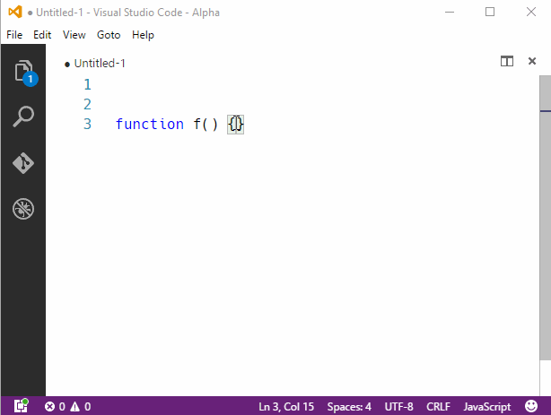
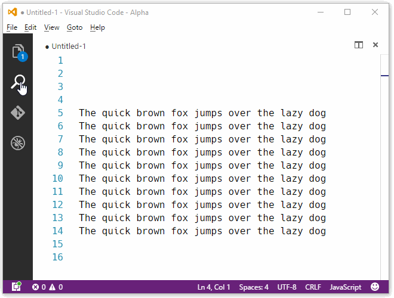
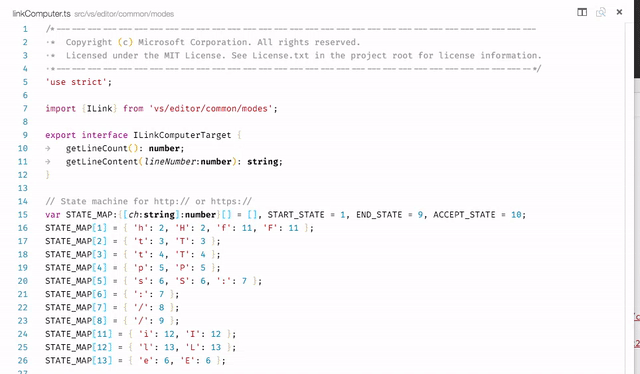
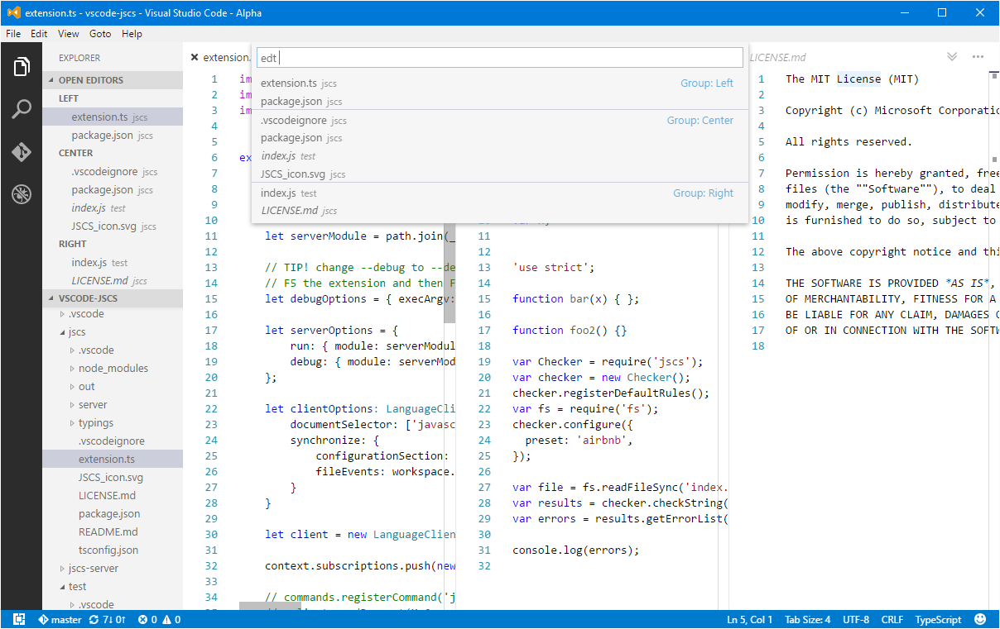
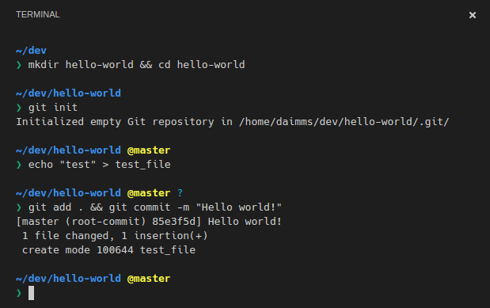
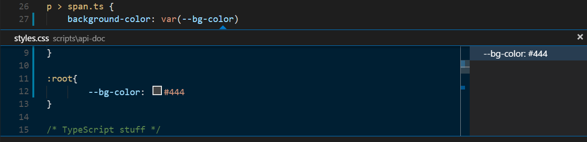
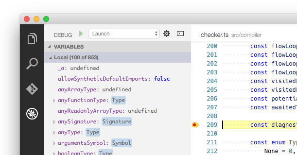

# May 2016 (version 1.2)

## 1.2.1 Recovery build

To fix several performance and Git integration issues, we're releasing a 1.2.1 recovery build. You can view the resolved issues [here](https://github.com/Microsoft/vscode/issues?q=milestone%3A%22June+13th+Stable+Recovery%22+is%3Aclosed).

Downloads: [Windows](https://az764295.vo.msecnd.net/stable/fe7f407b95b7f78405846188259504b34ef72761/VSCodeSetup-stable.exe) |
[OS X](https://az764295.vo.msecnd.net/stable/fe7f407b95b7f78405846188259504b34ef72761/VSCode-darwin-stable.zip) | Linux 64-bit [.zip](https://az764295.vo.msecnd.net/stable/fe7f407b95b7f78405846188259504b34ef72761/VSCode-linux-x64-stable.zip) [.deb](https://az764295.vo.msecnd.net/stable/fe7f407b95b7f78405846188259504b34ef72761/vscode-amd64.deb) [.rpm](https://az764295.vo.msecnd.net/stable/fe7f407b95b7f78405846188259504b34ef72761/vscode-x86_64.rpm) | Linux 32-bit [.zip](https://az764295.vo.msecnd.net/stable/fe7f407b95b7f78405846188259504b34ef72761/VSCode-linux-ia32-stable.zip) [.deb](https://az764295.vo.msecnd.net/stable/fe7f407b95b7f78405846188259504b34ef72761/vscode-i386.deb) [.rpm](https://az764295.vo.msecnd.net/stable/fe7f407b95b7f78405846188259504b34ef72761/vscode-i386.rpm)

## 1.2.0 May release

The May release of VS Code has some great new features, enhancements to existing features, and a set of important bug fixes.

Here are the highlights:

* [**Editor**](#editor): Ability to trim automatically inserted whitespace, a new key binding to select all find matches, and the Peek view is now resizable.
* [**Linting**](#linters): ESLint now supports the ability to fix all problems and TSLint supports quick fixes and file exclusion.
* [**Languages**](#languages): Code completion (IntelliSense), Go To and Peek Definition, and Find All Occurrences support for CSS variables in CSS, SCSS, and LESS files.
* [**Workbench**](#workbench): A new integrated Terminal allows you to stay in VS Code while using your platform's shell, we've added the ability to remove key bindings, and we've made *progress* on Tab support, which you can preview using the [Insiders Release](/insiders).
* [**Debugging**](#debugging): You can now control how the Debug Console is revealed and we've improved stepping performance for Node.js applications with large numbers of local variables.
* [**Extensions**](#extension-authoring): You can now list, install, and uninstall extensions from the command line. For extension authors, we've expanded our debug, TextMate grammar, and command APIs and we've improved the Language Server Protocol.

Please continue reading for more information on what's new in May.

## Editor

### Trim auto whitespace

The editor automatically inserts whitespace when you add a new line, based on indenting rules and the previous line's content. Over time, this can result in unnecessary whitespace being persisted in the file. Thanks to [PR #5423](https://github.com/Microsoft/vscode/pull/5423), the new `editor.trimAutoWhitespace` setting causes the editor to track the automatic whitespace it inserted and remove it if it no longer is needed, for example by typing somewhere else. Please note, this new setting is on by default.



### Select all find matches

You can now immediately select all find results by pressing `kb(editor.action.selectAllMatches)`. This is much quicker than doing a find and replace and leverages VS Code's multi-cursor support. Thanks for [PR #5715](https://github.com/Microsoft/vscode/pull/5715)!



### Configure Word Based Suggestion

When a language service isn't able to compute semantic completion (suggestions), VS Code defaults to word based completions. This is why for some languages you see an IntelliSense list with every word in the file. Some folks would prefer to not see this list at all so you can now disable word based completions with the `editor.wordBasedSuggestions` setting.

### Resizable Peek View

The Peek view editor that shows for reference search and for previewing declarations can now be resized!



## Workbench

### Tabs

> Note: Support for Tabs is **not** in the 1.2.0 (May 2016) Stable release. You can preview the experiences below by using the [Insiders Release](/insiders) of VS Code.

[Tab support](https://github.com/Microsoft/vscode/issues/224) is the number one [User Voice request](https://visualstudio.uservoice.com/forums/293070-visual-studio-code/suggestions/7752519-implement-tabs). While the full implementation will take multiple iterations to fully deliver, we wanted to share progress made during the May iteration.

During this milestone, we focused on managing *stacks* of open editors. In the picture below, you can see that the left pane has two editors open, the center pane has four, and the right pane has two more. Files listed in italics are *preview* files, they allow you to single click and browse files without cluttering the list of open editors and eventually tabs.



When you close an editor the last opened editor in the stack is restored, instead of closing the pane as it does today. In addition, we held a number of UX studies that have resulted in further improvements to the design, including:

* Redesign of the overflow icon
* Ability to specify if files from **Quick Open** are pinned or previewed
* Added a command to turn a previewed file into a pinned file

This work has been checked into master and you can preview it using the [Insiders Release](/insiders).

### Integrated terminal

[Number two](https://visualstudio.uservoice.com/forums/293070-visual-studio-code/suggestions/7752357-integrated-terminal) on User Voice is the request for an integrated terminal, [issue #143](https://github.com/Microsoft/vscode/issues/143). It can be convenient to have a terminal embedded directly in the tool, initially scoped to the workspace you are working in. You don't have to switch windows or alter the state of an existing terminal for a quick task.

With the May release, we are rolling out the initial version of an integrated terminal. You can open the terminal using `kb(workbench.action.terminal.toggleTerminal)`, from the **View** | **Integrated Terminal** menu, or from the **View** > **Toggle Integrated Terminal** command in the **Command Palette**.

The shell that is used defaults to `$SHELL` on Linux and OS X, and `%COMSPEC%` on Windows. These can be overridden manually by setting `terminal.integrated.shell.*` in settings. It should act just like the terminal you're familiar with.



Please note, this is an early version of what we want to deliver. Currently VS Code only supports a single terminal and there still are missing features like copying and pasting with the keyboard. Windows 10 users may experience problems getting `cmd.exe` to work. If so, please try enabling the legacy terminal as described in [#143](https://github.com/Microsoft/vscode/issues/143#issuecomment-221054202). The full list of current bugs and feature requests can be found [here](https://github.com/Microsoft/vscode/issues?q=is%3Aopen+is%3Aissue+label%3Aintegrated-terminal).

>**Note:** The **Toggle Integrated Terminal** key binding `kb(workbench.action.terminal.toggleTerminal)` had previously been bound to the **Cycle Between Open Editors** command. You can [customize](https://code.visualstudio.com/docs/getstarted/keybindings#_customizing-shortcuts) the key bindings and change the behavior back if desired.

### Removing a specific key binding rule

It is now possible to write a key binding rule that targets the removal of a specific default key binding. With the `keybindings.json`, it was always possible to redefine all the key bindings of VS Code, but it can be very difficult to make a small tweak, especially around overloaded keys, such as `kbstyle(Tab)` or `kbstyle(Escape)`. From now on, simply add a `-` to the `command` and the rule will be a removal rule.

Here is an example:

```json
// In Default Keyboard Shortcuts
...
{ "key": "tab", "command": "tab", "when": ... },
{ "key": "tab", "command": "jumpToNextSnippetPlaceholder", "when": ... },
{ "key": "tab", "command": "acceptSelectedSuggestion", "when": ... },
...

// To remove the second rule, for example, add in keybindings.json:
{ "key": "tab", "command": "-jumpToNextSnippetPlaceholder" }

```

## Languages

### CSS Variables

[Variable support in CSS](https://developer.mozilla.org/en-US/docs/Web/CSS/Using_CSS_variables) is a new standards proposal currently in [draft](https://drafts.csswg.org/css-variables/) form. VS Code now supports rich code completion (IntelliSense) for CSS variables as well as Go To Definition, Peek Definition, and Find All Occurrences for variables in the same file.

For example, here we Peek (`kb(editor.action.previewDeclaration)`) at the definition of `--bg-color`:



## Linters

### ESLint

The [ESLint extension](https://marketplace.visualstudio.com/items?itemName=dbaeumer.vscode-eslint) now supports a "fix all problems" command. You can bind the `eslint.fixAllProblems` command to a keyboard shortcut, such as:

```json
[
    { "key": "ctrl+shift+alt+f",   "command": "eslint.fixAllProblems",
                                     "when": "editorTextFocus" }
]
```

### TSLint

The [TSLint extension](https://marketplace.visualstudio.com/items?itemName=eg2.tslint) now supports excluding files from linting ([PR #47](https://github.com/Microsoft/vscode-tslint/pull/47)) as well as quick fixes for a set of TSLint warnings ([PR #40](https://github.com/Microsoft/vscode-tslint/pull/40)). Thanks for the pull requests!


## Debugging

### Control opening the Debug Console

To provide greater control over how the internal Debug Console is revealed VS Code, we are introducing the `internalConsoleOptions` setting in `launch.json` (see [#6159](https://github.com/Microsoft/vscode/issues/6159)). This is especially useful if you are using an external terminal while debugging and you want to keep VS Code focused on your code. The possible values are:

* `neverOpen` - VS Code will *never* open the debug console
* `openOnFirstSessionStart` - VS Code will open the debug console on the *first* debug session
* `openOnSessionStart` - VS Code will open the debug console on *every* debug session

### Node.js Improved Stepping Performance

We want VS Code to remain lightweight and fast so to improve the stepping experience for programs with a large number of local variables per scope, we've made the following adjustments for Node.js debugging:

* If a scope has **more than 100 local variables**, VS Code no longer automatically auto expands that scope
* After you expand the scope manually, only the **first 100** local variables are shown

The scope header will reflect that only the first 100 local variables are being displayed:



To track a variable that is not within the first 100 you must add it as a Watch expression or evaluate it in the Debug Console.

## Extension Authoring

### Debug extension API

We have exposed a `vscode.startDebug` command as an extension API for the VS Code debugger component. With this, a debug session can be started programmatically either by passing the name of a launch configuration file or a complete launch configuration object:

```javascript
    let launchConfig = {
        type: "node",
        request: "launch",
        program: "${workspaceRoot}/test.js",
        cwd: "${workspaceRoot}"
    };

    vscode.commands.executeCommand('vscode.startDebug', launchConfig).then(() => {
        vscode.window.showInformationMessage('Debug session started successfully');
    }, err => {
        vscode.window.showInformationMessage('Error: ' + err.message);
    });
```

More details can be found [here](https://github.com/microsoft/vscode/issues/4615).

### TextMate grammar injections

Extensions can now contribute TextMate grammars that inject new rules into the existing grammars used for syntax highlighting. This makes it possible to add colorization inside string literals or comments, such as highlighting of URLs or TODO markers across multiple languages.

```json
"grammars": [
  {
    "scopeName": "source.todo",
    "path": "./syntaxes/todo.tmLanguage",
    "injectTo": [  "source.js", "source.ts" ]
  }
]
```

### Comparing files

We have added a new API command that allows you to use the diff-editor on two arbitrary resources like so: `commands.executeCommand('vscode.diff', uri1, uri2)`

### Updated extension samples

There is a new rich extension sample that walks you through _virtual documents_, _eventing_, and using _language features as commands_. Also, the preview html sample was updated:

* [contentprovider-sample](https://github.com/Microsoft/vscode-extension-samples/tree/master/contentprovider-sample)
* [previewhtml-sample](https://github.com/Microsoft/vscode-extension-samples/tree/master/previewhtml-sample)

### Debug Adapter: Support a 'One' or 'All' mode of operation for controlling threads

In a previous revision of the VS Code Debug Protocol, we had introduced a `allThreadsStopped` attribute on the `StoppedEvent`. With this attribute, a debug adapter can report back to the frontend whether only a single thread or all threads have stopped. Thanks to developer feedback, we learned that a similar attribute is necessary for the `ContinueRequest` too.

In the version 1.9.0 of the [VS Code Debug Protocol](https://github.com/Microsoft/vscode-debugadapter-node), a boolean attribute `allThreadsContinued` has been added to the response from the `ContinueRequest`. Using this attribute, a debug adapter can report back to the UI whether only a single thread or all threads are continuing. More details can be found [here](https://github.com/Microsoft/vscode/issues/6400).

### Language Server Protocol

The [Language Service Protocol](https://github.com/Microsoft/vscode-languageserver-protocol) now offers support for telemetry notifications. Message tracing support has been implemented in the [node client library](https://www.npmjs.com/package/vscode-languageclient) to help tracking down problems in the server. It can be enabled via a settings `${clientName}.trace.server` where client name is the name passed when creating the `LanguageClient` instance. For example `eslint.trace.server` for the ESLint linter service.

### Command Line Extension Management

To make it easier to automate and configure VS Code, it is now possible to list, install, and uninstall extensions from the command line.

Example:

```
code --list-extensions
code --install-extension ms-vscode.cpptools
code --uninstall-extension ms-vscode.csharp
```

## The Monaco Editor

At the heart of VS Code is the "Monaco" code editor. You can find the "Monaco" editor across many Microsoft properties such as OneDrive, VSTS, Azure, the TypeScript playground, and even in the F12 tools in IE and Edge.

Our goal is to enable anyone to consume the "Monaco" editor and host it in any browser. The challenge we have today is that the editor is embedded in the `vscode` repository and the language service extensions have dependencies on client (non browser) technologies.

The first step towards releasing the editor is [an exploration](https://github.com/alexandrudima/monaco-typescript) where the TypeScript language service has been extracted from VS Code's sources and can run on top of the standalone editor API.

In the upcoming weeks we will continue to refine the API and automate the packaging with the goal of making the "Monaco" editor public with the June release of VS Code.

## Notable Bug Fixes

* [959](https://github.com/Microsoft/vscode/issues/959): Fonts become fuzzy after zooming and scrolling
* [1000](https://github.com/Microsoft/vscode/issues/1000): Slow response when system is offline
* [2717](https://github.com/Microsoft/vscode/issues/2717): "Define Keybindings" is invalidating keybindings.json
* [4541](https://github.com/Microsoft/vscode/issues/4541): Problem typing in Korean
* [5645](https://github.com/Microsoft/vscode/issues/5645): Slow call stack response for TS repository
* [5780](https://github.com/Microsoft/vscode/issues/5780): Come up with better external terminal defaults on Linux
* [6029](https://github.com/Microsoft/vscode/issues/6029): debug doesn't work on node v6
* [6151](https://github.com/Microsoft/vscode/issues/6151): The border of scroll bar is ugly, and unclear under high dpi
* [6432](https://github.com/Microsoft/vscode/issues/6432): Unity desktop entry not installed immediately after installation
* [6525](https://github.com/Microsoft/vscode/issues/6525): Linux CLI fails to open files with spaces in filename
* [6530](https://github.com/Microsoft/vscode/issues/6530): source maps don't work if drive letter case does not match
* [6593](https://github.com/Microsoft/vscode/issues/6593): Two desktop entries appear on Ubuntu sometimes
* [6609](https://github.com/Microsoft/vscode/issues/6609): Change keybinding for 'fold all' / 'unfold all'
* [6878](https://github.com/Microsoft/vscode/issues/6878), [6916](https://github.com/Microsoft/vscode/issues/6916): Freeze/Crash when dealing with minified js files


These are the [closed bugs](https://github.com/Microsoft/vscode/issues?q=is%3Aissue+label%3Abug+milestone%3A%22May+2016%22+is%3Aclosed) and these are the [closed feature requests](https://github.com/Microsoft/vscode/issues?q=is%3Aissue+milestone%3A%22May+2016%22+is%3Aclosed+label%3Afeature-request) for the 1.2.0 update.

## Downloads

Downloads: [Windows](https://az764295.vo.msecnd.net/stable/809e7b30e928e0c430141b3e6abf1f63aaf55589/VSCodeSetup-stable.exe) |
[OS X](https://az764295.vo.msecnd.net/stable/809e7b30e928e0c430141b3e6abf1f63aaf55589/VSCode-darwin-stable.zip) | Linux 64-bit [.zip](https://az764295.vo.msecnd.net/stable/809e7b30e928e0c430141b3e6abf1f63aaf55589/VSCode-linux-x64-stable.zip) [.deb](https://az764295.vo.msecnd.net/stable/809e7b30e928e0c430141b3e6abf1f63aaf55589/vscode-amd64.deb) [.rpm](https://az764295.vo.msecnd.net/stable/809e7b30e928e0c430141b3e6abf1f63aaf55589/vscode-x86_64.rpm) | Linux 32-bit [.zip](https://az764295.vo.msecnd.net/stable/809e7b30e928e0c430141b3e6abf1f63aaf55589/VSCode-linux-ia32-stable.zip) [.deb](https://az764295.vo.msecnd.net/stable/809e7b30e928e0c430141b3e6abf1f63aaf55589/vscode-i386.deb) [.rpm](https://az764295.vo.msecnd.net/stable/809e7b30e928e0c430141b3e6abf1f63aaf55589/vscode-i386.rpm)

## Thank You

Last but certainly not least, a big *__Thank You!__* to the following folks that helped to make VS Code even better:

* [Peng Lv (@rebornix)](https://github.com/rebornix): Add touch screen tap support for reference search. [PR #6386](https://github.com/Microsoft/vscode/pull/6386)
* [Yuki Ueda (@Ikuyadeu)](https://github.com/Ikuyadeu)
  * Debt reduction in suggest [PR #6035](https://github.com/Microsoft/vscode/pull/6035) and [PR #6057](https://github.com/Microsoft/vscode/pull/6057)
  * Delete the mention [PR #5786](https://github.com/Microsoft/vscode/pull/5786)
* [Richard Lasjunies (@rlasjunies)](https://github.com/rlasjunies): vscode-tslint - autofix some tslint warnings [PR #47](https://github.com/Microsoft/vscode-tslint/pull/47)
* [Gary Wilber (@Spacetech)](https://github.com/Spacetech): vscode-tslint - Ability to exclude files [PR #40](https://github.com/Microsoft/vscode-tslint/pull/40)
* [@dbillingham](https://github.com/dbillingham): [folding] Added fold and unfold recursively to foldings [PR #5721](https://github.com/Microsoft/vscode/pull/5721)
* [Brian Green (@briangreenery)](https://github.com/briangreenery): Fix small typos [PR #33](https://github.com/Microsoft/vscode-languageserver-node/pull/33)
* [Rui Lopes (@rgl)](https://github.com/rgl): Correct typos [PR #6](https://github.com/Microsoft/vscode-languageserver-protocol/pull/6)
* [Brett Cannon (@brettcannon)](https://github.com/brettcannon): Grammar tweak in a comment [PR #8](https://github.com/Microsoft/vscode-languageserver-node-example/pull/8)
* [Cody Hoover (@hoovercj)](https://github.com/hoovercj): Update launch.json [PR #10](https://github.com/Microsoft/vscode-languageserver-node-example/pull/10)
* [Yu-Hsin Hung (@hungys)](https://github.com/hungys): Fix link parsing for non-ASCII characters [PR #5293](https://github.com/Microsoft/vscode/pull/5293)
* [Denis Gladkikh (@outcoldman)](https://github.com/outcoldman): Editor improvements (Implement trim whitespaces on enter, Backspaces decreases indent) [PR #5423](https://github.com/Microsoft/vscode/pull/5423)
* [@ioklo](https://github.com/ioklo): fix Korean(and Chinese, Japanese) IME behavior [PR #5615](https://github.com/Microsoft/vscode/pull/5615)
* [aioute Gao (@aioutecism)](https://github.com/aioutecism): Fix validatePosition related bug [PR #5705](https://github.com/Microsoft/vscode/pull/5705)
* [Asuka (@Inori)](https://github.com/Inori): Add selectAllMatches command in column selection mode [PR #5715](https://github.com/Microsoft/vscode/pull/5715)


