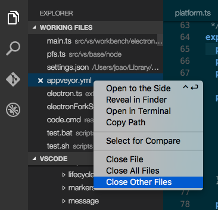

# 0.10.10 (February 2016)

February is our last full iteration before we start the end game for the Build 2016 milestone at the end of March. It comes with many improvements:

- Salsa is now the default JavaScript language service.
- Folding, the most requested feature, is now available.
- There is support for localization and accessiblity.

In addition, we continued to listen to your issues and feature requests.

## Languages - JavaScript

The [Salsa](https://github.com/Microsoft/TypeScript/issues/4789) JavaScript language service was available as preview in January and it is now the default language service for JavaScript in the February update.

### Improvements

The JSDoc comment format is now understood and used to improve IntelliSense proposals and parameter hints:


You now get IntelliSense proposals for properties in 'ECMAScript 3 style classes':


IntelliSense offers both *inferred* proposals and the global identifiers of the project. The inferred symbols are presented first, followed by the global identifiers (with the document icon), as you can see in the image above.

The `commonjs` support has been improved as well:


There is now support for JSX/React:


>**Tip:** To get IntelliSense for React/JSX, install the typings for `react-global` by running `tsd install react-global` or `typings install --ambient react-global` from the terminal.

There is now support for ReactNative:


>**Tip:** To get IntelliSense for ReactNative, install the typings for `react-native` by running `tsd install react-native` or `typings install --ambient react-native` from the terminal. Or even better... or if you also want
debugging support then install the preview of the [ReactNative extension](https://marketplace.visualstudio.com/items?itemName=vsmobile.vscode-react-native).

It is now possible to have mixed TypeScript and JavaScript projects. To enable JavaScript inside a TypeScript project, you can set the `allowJs` property to `true` in the `tsconfig.json`.

>**Tip:** The `tsc` compiler does not detect the presence of a `jsconfig.json` file automatically. Use the `–p` argument to make `tsc` use your `jsconfig.json` file, e.g. `tsc -p jsconfig.json`.

Finally, the TypeScript compiler `tsc` can down-level compile JavaScript files from ES6 to another language level.

### Migration Notes

The following sections describe a few of Code's features that have changed with the move to Salsa and provide information about maintaining previous behaviours.

### Linters
The existing JavaScript language support provided some linting options that could be enabled by the `javascript.validate.lint.*` settings. With `jshint` and `eslint` there are powerful linters for JavaScript available. Also, there are now extensions for VS Code available that integrate these linters. Therefore, we have decided to deprecate the built-in linter and Salsa now reports **syntax errors only**. We therefore **strongly recommend that you install and configure a JavaScript linter if your project hasn't done so already**.

In particular, the existing JavaScript infrastructure provided an implicit *lint rule* which warned about undeclared variables unless they are mentioned in a /\*global\*/ comment block. This rule is no longer active and needs to be configured in your linter of choice.

Here are the steps to setup `eslint`:

- `npm install -g eslint`
- install the VS Code [eslint extension](https://marketplace.visualstudio.com/items?itemName=dbaeumer.vscode-eslint).
- use `eslint --init` to create an initial eslint configuration by answering questions or by picking a popular configuration.

**Tip** If you use JSON as the format of the eslint config file, then VS Code can provide you with Intellisense when you edit the file.

Notice, if you answer `yes` to "Do you use React", then the setting `experimentalObjectRestSpread` is enabled. Support for ObjectRestSpread is not yet provided by Salsa (see [#2103](https://github.com/Microsoft/TypeScript/issues/2103)).

Finally, this [.eslintrc.json](https://gist.github.com/egamma/65c0e2a832393e3b625a) corresponds roughly to the lint settings of the old JavaScript infrastructure.

### Changes in `jsconfig.json`

#### `exclude` lists

The existing JavaScript language service had a built-in list for folders that should be excluded from the project context. This list included the folders: `node_modules`, `bower_components`, `jspm_packages`, `tmp`, and `temp`. This implicit behaviour has been changed in favor of an explicit list defined by the user. Therefore if you use...

- `node` exclude the `node_modules` folder
- `bower` exclude the `bower_components` folder
- `ember` exclude the `tmp` and `temp` folder
- `jspm` exclude the `jspm_packages` folder
- `webpack` then exclude the output folder, e.g., `dist`.

**Tip:** After editing the `jsconfig.json` do not forget to run the `Reload JavaScript` command to ensure that everything is up to date.

#### Defaults

If you do not have a `jsconfig.json` in your workspace then the following defaults are used:

- the `module` attribute is `commonjs`
- the `exclude` list includes the `node_modules` folder and the folder defined by the `out` attribute.

### `js-is-jsx` extension deprecation

The `js-is-jsx` extension is no longer needed since Salsa gives you coloring for JSX constructs inside `.js` files out of the box. We **recommend** to uninstall this extension.

### No longer supported

Salsa undoubtedly provides a much better experience writing JavaScript applications in VS Code. By moving to Salsa, we give up a few features previously available with our old JavaScript language service:

- The source language level is now always ECMAScript 6. Previously there was support to define a lower level using the `target` attribute inside `jsconfig.json`. This support has been removed and the `target` attribute is now only used by `tsc` to define the target version when a JavaScript file is compiled to a lower ECMAScript version.
- The existing JavaScript infrastructure attempted to resolve references for `AMD` modules. This hasn't worked in all cases and support for `AMD` to resolve references across files is currently no longer supported.
- There is no longer support for Intellisense in `script` sections inside HTML documents.
- The `javascript.validate.*` settings are no longer supported and are ignored (see above).

## Languages - TypeScript

VS Code now ships with the latest TypeScript 1.8.2 version.

## Languages - C#

C# language support is now an optional install. **TODO@chris**

## Editor

### Folding

The editor now contains a first implementation of code folding. You can turn the feature on and off with the `editor.folding` configuration setting (File > Preferences > User Settings or Workspace Settings). Once enabled, you you can collapse and expand code regions using the folding icons next to the line numbers. Regions that can be folded are shown with a `-` icon, regions that are already folded with the `+` icon. The `-` icon only shows when the mouse is over the gutter.


Additionally you can use the following commands from the commands menu (F1) or with keyboard shortcuts:

- Fold (`Ctrl+ Shift + [`) folds the innermost uncollapsed region at the cursor
- Unfold (`Ctrl+ Shift + ]`) unfolds the collapsed region at the cursor
- Fold All (`Ctrl+ Shift + Alt + [`) folds all region in the editor
- Unfold All (`Ctrl+ Shift + Alt + ]`) unfolds all regions in the editor

The folding regions are evaluated solely based on the indentation of each line. This first version does not yet support language agnostic folding regions, or folding markers. This is in discussion for an upcoming release. The issue for this is [#3422](https://github.com/Microsoft/vscode/issues/3422).

### Intellisense Performance

The intellisense widget underwent a full widget rewrite to address some performance problems head on. It now handles lists of 20.000 extensions in milliseconds, compared to the previous ~10 seconds of lag.

### Indentation

**TODO@Isidor**

### Ruler Settings

There is a new setting available, `editor.rulers`. For example, setting it to `[80, 120]` will render two vertical rulers, one after the 80th character and one after the 120th character.

### Default End of Line Sequence

A new setting `files.eol` controls the default new line character when creating new files. It defaults to `\r\n` on Windows and to `\n` on Linux and OS X.

### Screen reading

We have turned on by default a new strategy for screen readers in the editor, one that is based on paging the text. From our testing, this is the best option in terms of trade-off between good screen reader support and performance when dealing with very large files.

The Go to Next/Previous Error or Warning actions (`kb(editor.action.marker.next)` and `kb(editor.action.marker.prev)`) now allow screen readers to announce the error or warning messages.

We have added a keyboard shortcut for showing the hover (`kb(editor.action.showHover)`).

### Word navigation and word separators

Word navigation and word deletion commands have been refurbished and now honour a new setting, `editor.wordSeparators` when deciding what is a word, regardless of the current language of the file.

### Improved usage of web workers

With the adoption of the Salsa Javascript language service as the default, we could streamline our usage of web workers and we now have a dedicated web worker that is language agnostic, which we use for diff computation, link detection or simple textual completions. This reduces the latency of these computations and is memory friendly, as it automatically shuts down when not needed.

## Workbench

### Open Definition to the Side

There is now an action to open a definition to the side in the Command Pallette.


### Close Other Files

There is now an action to close all other files, in the Working Files' context menu.



### Support to switch to a working file from the quick box

It's now possible to open a file in the working files list from the quick box by
prefixing it with `~`.


## Debugging

### VS Code no longer 'fixes' Relative Paths in Launch Configurations

In the January milestone we've deprectated the use of relative paths in launch configurations (but still continued to convert relative in absolute paths).
With this milestone we've dropped this 'automagical' fixing in favor of a more transparent strategy: VS Code no longer modifies launch configuration paths in any way when sending them to the debug adapter. This is now in line with treatment of paths in task configurations.

If you haven't already fixed your launch configuration paths for the January release, then you will now see this (or similar) errors when starting a debug session:


Just prefixing the relative path with a `${workspaceRoot}/` should fix the problem.

### Function Breakpoints

**TODO@andre**

### Improved Accessibility

**TODO@Isidor**

### Pre Launch Task Improvements

**TODO@Isidor**

## Node.js Debugging

### Support for 'nodemon' Development Setup

The VS Code node debugger now supports an automatic restart mode for the 'attach' launch configuration.
This feature is useful if you use `nodemon` to restart node.js on file changes.
Setting the launch config attribute `restart` to `true` makes node-debug automatically try to re-attach to node.js after a debug session has ended.

On the command line start your node program `server.js`:

```shell
nodemon --debug server.js
```

In VS Code create an 'attach' launch config:

```json
{
    "name": "Attach",
    "type": "node",
    "request": "attach",
    "port": 5858,
    "restart": true
}
```

>**Tip:** Pressing the Stop button stops the debug session and disconnects from node, but nodemon (and node) will continue to run. So to stop nodemon you will have to kill it from the command line.

>**Tip:** In case of (temporary) syntax errors, nodemon will not be able to start node.js successfully until the error has been fixed. In this case VS Code will continue trying to attach to node.js but eventually give up (after 10 seconds). To avoid this you can increase the timeout by adding a `timeout` attribute with a larger value (in milli seconds).

## Mono debugging

### Mono Debugging is now an Optional Install

Since C# support in VS Code has been turned into an optional install, we have done the same with the Mono debugger.
The Mono debugger has now become ['Mono Debug'](https://marketplace.visualstudio.com/items?itemName=ms-vscode.mono-debug) on the Visual Studio Marketplace.

You can either install Mono Debug with the VS Code 'Install Extension' command or if you already have a Mono based project with a mono launch configuration simply by starting a debug session. VS Code will then suggest to download and install Mono Debug automatically:


## Tasks Support

is there anything new here?, or did we revert Dirk's change? **TODO**


## Localization

Support has been added to localize `package.json` files for extensions and CommonJS code. For localizing CommonJS code, we've published a new npm module [`vscode-nls`](https://www.npmjs.com/package/vscode-nls) which helps you with localizing strings in your VS Code extension.

## Linux Debian Package

A .deb package is now provided for easier installation on Debian-based distributions. To install simply download the .deb package from the [home page](code.visualstudio.com) and either double click to install through a GUI or install it via the command line with:

```bash
sudo dpkg -i vscode-amb64.deb
```

## CLI is now properly documented

The command line interface for code has been unified across platforms and now supports `--help` and `--version` arguments.


## Opt out for telemetry

User's now have the option of opting out of usage telemetry, for more information see [here](**TODO**).


## Extension Authoring

### Always install a compatible version of the extension if possible

**TODO@joao**

### Experimental support for recommending extensions based on usage/setup

**TODO**

### Debug Adapter

- more runtime options: 32-bit or 64-bit debug host **TODO@Isidor**

### Debug Protocol Changes

We have changed the debug protocol in the following (backward compatible) ways:

- *Feature negotiation*:

  - A boolean `supportsConditionalBreakpoints` in `Capabilities` indicates whether the debug adapter supports conditional breakpoints. If a debug adpter does not support conditional breakpoints, a breakpoint which has a condition set is shown with an exclamation mark:

    

  - A boolean `supportsFunctionBreakpoints` in `Capabilities` indicates whether the debug adapter implements function breakpoints. VS Code will only use the function breakpoint part of the debug protocol if this feature is enabled.

  - A boolean `supportEvaluateForHovers` indicates whether the debug adapter supports a side effect free `EvaluateRequest`. If this feature is enabled, VS Code will use the `evaluate` request to populate the hover with information about the object under the mouse pointer. If it is disabled, VS Code tries to find informaton about the object under the mouse pointer in the Variables viewlet.

  - An optional `exceptionBreakpointFilters` capability that lists the filters available for the `setExceptionBreakpoints` request. With this a debug adapter can contribute the options shown in the breakpoint viewlet:

    


- An optional `restart` attribute has been added to the `TerminatedEvent` which a debug adapter can use to request a session restart.


## Notable Bug Fixes

- [3127](https://github.com/Microsoft/vscode/issues/3127): `code .` opens the current directory, `code ..` also opens the current directory - not the parent

Here are the [closed bugs](https://github.com/Microsoft/vscode/issues?q=is%3Aissue+label%3Abug+milestone%3A%22Feb+2016%22+is%3Aclosed) and the [closed feature requests](https://github.com/Microsoft/vscode/issues?q=is%3Aissue+milestone%3A%22Feb+2016%22+is%3Aclosed+label%3Afeature-request) for the February update.


## Thank You

Last but certainly not least, a big *__Thank You!__* to the following folks that helped to make VS Code even better:

* [SamVerschueren](https://github.com/SamVerschueren): fix TextEditorOptions declaration [2935](https://github.com/Microsoft/vscode/pull/2935).
* [sparecycles](https://github.com/sparecycles): fix replacing end of line with newline [2587](https://github.com/Microsoft/vscode/pull/2587).
