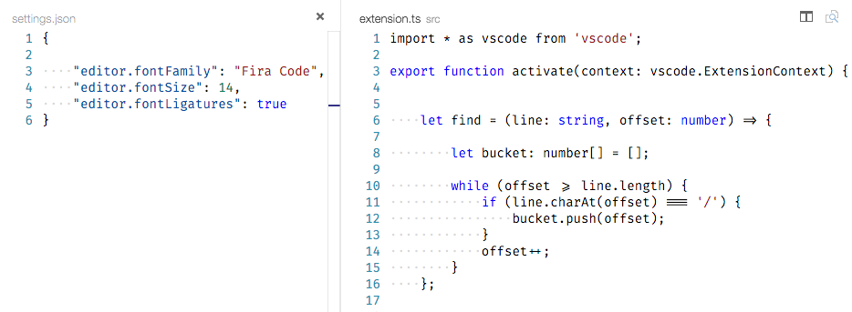
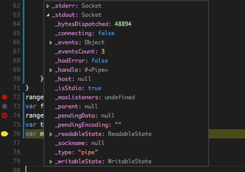
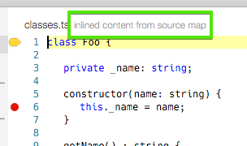
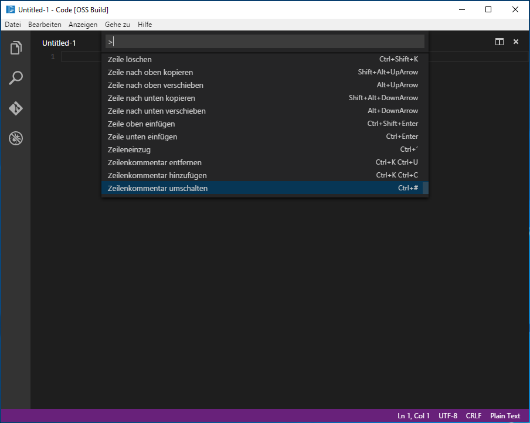
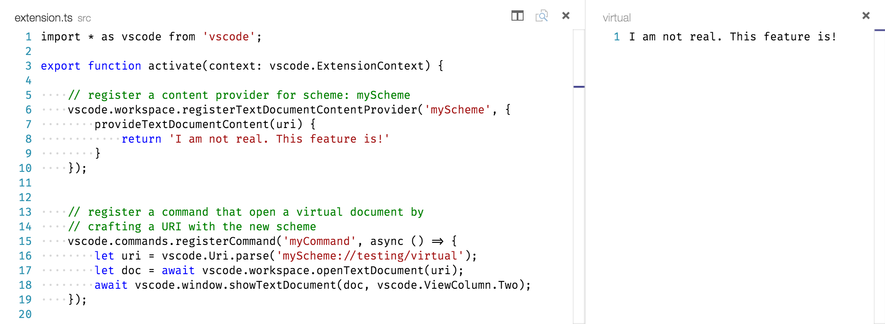

# 0.10.7 (January 2016)

Hi,

TO DO

These release notes only capture what's new in the core of Visual Studio Code. Do not forget to check out the [marketplace](https://marketplace.visualstudio.com/#VSCode) for new extensions.

## Editor

### Ligatures for Code

VS Code now supports fonts with programming ligatures, like [Hasklig](https://github.com/i-tu/Hasklig) and [Fira Code](https://github.com/tonsky/FiraCode). Those fonts provide compositions for character sequences commonly used
in programming, as `=>`, `>=`, `!=` etc. Enable ligatures with new `editor.fontLigatures`-setting and pick a font with programming ligatures. Special thanks to [@mattblagden](https://github.com/mattblagden) for initiating this.




### Auto Save

VS Code always supported automatically saving dirty files after one second (`File | Auto Save`). We received a lot of feedback that users want more control over
when VS Code should save dirty files. The setting is now in the `settings.json` configuration file and provides more options:

* `files.autoSave`: Can be `off` to disable auto save, `afterDelay` to save files after a configured delay and `onFocusChange` to save files when focus moves out of the editor of the dirty file.
* `files.autoSaveDelay`: Configures the delay in milliseconds when `files.autoSave` is configured to `afterDelay`.
* This setting can be configured either globally for the user or per workspace through the workspace settings (`Preferences | Workspace Settings`).

**Note:** If you had auto save enabled previously, we will migrate your setting into the `settings.json` file automatically.

**Note:**: You will not see any dirty indicators in the UI if you configure auto save for 1s or below. In all other cases you will see the dirty indicators throughout the UI.

### File Picker

Some useful changes around the file picker (`kb(workbench.action.quickOpen)`) include:

* Fuzzy matching is now enabled by default and the previously introduced setting `filePicker.alternateFileNameMatching` is no longer needed.
* You can open any file (including line/column pattern at the end) that exists on disk by typing the full path or full workspace relative path even if your exclude settings hide it otherwise.

### Keyboard Accessibility

You will find that VS Code provides an exhaustive list of commands in the Command Palette (`kb(workbench.action.showCommands)`) so that you can operate VS Code without using the mouse. However, some parts of the UI could not be operated without using the mouse. We made a pass over these locations and added support to use the `Tab` key to jump between UI controls that you can interact with. Using `Tab` or `Shift-Tab` to jump between elements with actions in the UI is a very common pattern for keyboard accessibility. In addition to that, we now also draw an indicator around the UI element once the element gains focus.

Some areas where you can now jump to using keyboard only:

* View switcher
* Header of collapsible sections in a view to expand/collapse
* Actions in views and sections
* Actions for items in the tree

This is just the beginning of our journey to become more keyboard accessible, expect more areas to follow in the future!

### Hide the Menu Bar (Windows, Linux)

We added a new action to hide the menu bar on Windows and Linux (`View | Toggle Menu Bar`). You can still access the menu pressing the `Alt` key.

## Debugging

### Rich Object Hover

We are now using a tree widget in the debug hover to allow better rich object inspection.



### Conditional Breakpoints

We now support adding conditions to breakpoints such that they will be only hit if the specified condition is true.

TODO@Isidor insert picture

### Changed Variable Indication

We now indicate in the debug view what variables have changed values between step events.

TODO@Isidor insert picture

## Node.js Debugging

### Source Maps with Inlined Source

Node.js debugging now supports source maps with "inlined source" (in addition to "inlined source maps" which were already supported).
To avoid confusion, here is a brief explanation of these two source map options. "Inlined source" and "inlined source maps" are orthogonal features (and VS Code supports both either alone or in combination):

* *inlined source maps:* The contents of the source map does not live in a file but is a data URL at the end of the generated file.
* *inlined source:* The contents of the original source file does not live in a file but is included in the source map.

The strategy for which situations VS Code will use "inlined source" is as follows:

* VS Code always tries to locate the source on disk first.
* If it cannot find the source (e.g. because there is none in the VS Code workspace or because the paths in the source maps are broken), VS Code will use the "inlined source" if available.
* If there is no inlined source, VS Code will fall back to get the file contents from Node.js itself.

Whenever the editor contents is not loaded from the file system but comes from the debugger backend, the editor will be in read-only mode and the "origin" of the editor contents is shown in the editor title like this:



### Remote Debugging

The followings improvements enable VS Code to support remote debugging (which includes debugging into a Docker container):

* The `attach` launch configuration now supports an `address` attribute where a remote host can be specified. Please note that remote debugging is only supported on recent versions of Node.js (>= 4.x).
* The `attach` launch configuration now supports a `localRoot` and a `remoteRoot` attribute that can be used to map paths between a local VS Code project and a (remote) Node.js folder. This works even locally on the same system or across different operating systems.
VS Code uses these paths in the following way: whenever a code path needs to be converted from the remote Node.js to a local VS Code path, the `remoteRoot` path is stripped off the path and replaced by `localRoot`. For the reverse conversion the `localRoot` path is replaced by the `remoteRoot`.

### "--nolazy" option not automatically added

In order to ensure that breakpoints are hit reliably, VS Code automatically adds the `--nolazy` option when launching Node.js. With the advent of Node.js alternatives that do not support this option (e.g. Chakra), we've removed this automatic behavior. So if you see that breakpoints are not hit reliably in Node.js, please verify that your launch config sets the `--nolazy` via the `runtimeArgs` attribute.

## Mono debugging

### Support for VS Code Debug Console

For VS Code Mono debugging support, we've added an `externalConsole` attribute, which controls whether the Mono target application is launched in an external console or in the built-in Debug Console (this is the default). Please note that the built-in Debug Console does not support keyboard input for your application.

## Localization

We also started work on localizing VS Code for different locales. We put tooling in place to externalize strings and to create language bundles. The screen shot below shows VS Code running under a German locale.



Please note that the translation effort for VS Code haven't been completed yet and it will still take a while until we ship VS Code for languages other than English.

## Extension Authoring

### API Consumption

When you write an extension for VS Code, you are developing it against a set of APIs that we define through a file called `vscode.d.ts`. You can see this file
in our repository [here](https://github.com/Microsoft/vscode/blob/master/src/vs/vscode.d.ts). This file is picked up from our TypeScript and JavaScript language
service to provide you with nice validation and IntelliSense while you develop your extension.

As we make changes to the VS Code API between versions, `vscode.d.ts` changes and is updated and tagged from release to release. Previously, we stored the `vscode.d.ts`
file within the `vscode` npm module that all extensions automatically depend on. So in order to update to our latest API, you would just install a newer version of
the `vscode` npm module in your extension by typing `npm update vscode`.

We found that this approach has many issues:

* The `vscode` npm module needs to be updated and versioned independent from VS Code versions because it contains API unrelated code (e.g. for test running)
* The `engine` field of the `package.json` in your extension should be the only place that drives the decision which API to develop against.

To solve these issues, we made the following changes:

* The `vscode.d.ts` is no longer shipping within the `vscode` npm module.
* The value of the `engine` field in your extension is used to determine which version of `vscode.d.ts` to use.
* It is still very easy to update to a newer API via basic `npm` commands.

Since this is a breaking change for existing extensions, we increased the `vscode` npm module version to `0.2.0`. We encourage all extension writers to
update their dependency to `vscode` in their `package.json` to this new version (`^0.2.0`) to benefit from future updates to tooling for extensions.

The process of installing a specific version of the API into your extension is still very simple:

* Set the minimal version of VS Code that your extension requires in the `engine` field of the `package.json`.
* Make sure your dependency to the `vscode` module is at least `0.2.0`.
* Type `npm install` from the root of your extension.
* The `vscode` module will download the appropiate version of `vscode.d.ts` based on the `engine` field you declared.
* Go back to VS Code and see how the API for the specific version you chose appears in IntelliSense and validation.

### Extension API additions

We added a few API additions that enable you to write even more awesome extensions.

Quick Pick and Input

You can now validate user input, get called when an item is focused in Quick Pick, and Quick Pick now has room for additional details. Also Quick Pick now supports [GitHub Octicons](https://octicons.github.com) like the Status Bar.

Virtual Documents

We have introduced the concept of virtual documents. These are textual documents that don't have a representation on disk, but are generated at runtime.  For example, HTML generated from Markdown or source code from debug symbols.



Combine virtual documents with the new `vscode.previewHtml` command and you can come up with some creative solutions.

New Extension APIs

* There is now support for glob-patterns when associating files with a language.
* You can determine the current editor `ViewColumn`.
* There is a new `MarkedString` to display Markdown content in various UI elements.

### Debug Protocol Enhancements

* Feature negotiation TODO@weinand
* new requests `ConfigurationDoneRequest` TODO@weinand
* `Source` type got an `origin` attribute TODO@weinand

### Test Suite for Debug Adapters

With the January release, we've started to simplify the process of writing automated tests for a debug adapter. The basic idea is to provide a toolkit with Promise-based building blocks for individual protocol requests (e.g. `stepInRequest`) and for common request sequences (e.g. `hitBreakpoint`). These building blocks can be easily configured for a specific adapter and combined to form complex scenarios.

Here are three example Mocha tests:

```js
var dc: DebugClient = ...;

test('should run program to the end', () => {
	return Promise.all([
		dc.configurationSequence(),
		dc.launch({ program: "main.js" }),
		dc.waitForEvent('terminated')
	]);
});

test('should stop on entry', () => {
	return Promise.all([
		dc.configurationSequence(),
		dc.launch({ program: "main.js", stopOnEntry: true }),
		dc.assertStoppedLocation('entry', 1)
	]);
});

test('should set a breakpoint and stop on it', () => {
	return dc.hitBreakpoint({ program: "main.js" }, "test.js", 15);
});
```

More examples can be found in these debug adapter projects on GitHub:

* [Microsoft/vscode-node-debug](https://github.com/Microsoft/vscode-node-debug)
* [Microsoft/vscode-mock-debug](https://github.com/Microsoft/vscode-mock-debug)
* [Microsoft/vscode-mono-debug](https://github.com/Microsoft/vscode-mono-debug)

You can see the Promise-based API in [DebugClient.ts](https://github.com/Microsoft/vscode-node-debug/blob/master/src/tests/DebugClient.ts) and an initial set of tests in [adapter.test.ts](https://github.com/Microsoft/vscode-node-debug/blob/master/src/tests/adapter.test.ts). We plan to make this API available as an npm module in February.

## Notable Bug Fixes

* [1485](https://github.com/Microsoft/vscode/issues/1485): Windows 7: Deleting always fails with error message
* [1687](https://github.com/Microsoft/vscode/issues/1687): VSC 10.6 does not allow to attach debugger to running Electron app
* [1923](https://github.com/Microsoft/vscode/issues/1923): IntelliSense filtering has become slow again in huge lists
* [1962](https://github.com/Microsoft/vscode/issues/1962): Debugger fails when offline
