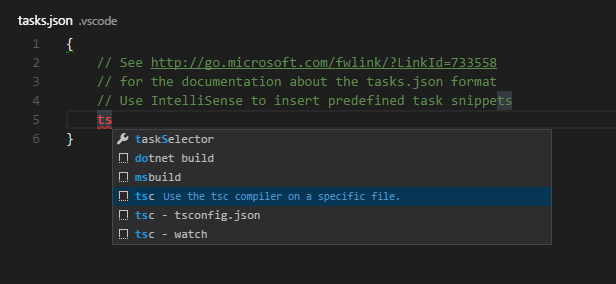

# 0.10.10 (February 2016)

** TO DO **

## Thank You

We received many contributions from the community that helped to make VS Code better.

A big Thank You goes out to:

**TO DO**

## JavaScript - Salsa

The JavaScript language service in VS Code has always been powered by TypeScript. We are now migrating to a new JavaScript language service implementation called [Salsa](https://github.com/Microsoft/TypeScript/issues/4789). Salsa will become available with TypeScript 1.8 but for the January update, we are providing way to preview Salsa in VS Code.

### Salsa Improvements

Salsa provides important improvements over the existing JavaScript language service.

The JSDoc comment format is now understood and used to improve IntelliSense proposals and parameter hints:

You now get IntelliSense proposals for properties in 'ECMAScript 3 style classes':

IntelliSense offers both *inferred* proposals and the global identifiers of the project. The inferred symbols are presented first, followed by the global identifiers (with the document icon), as you can see in the image above.

The `commonjs` support has been improved as well:

>**Tip:** When using `commonjs`, exclude the `node_modules` folder using the `exclude` property in `jsconfig.json`. This is due to [issue 6673](https://github.com/Microsoft/TypeScript/issues/6673) which is fixed but not yet in `typescript@next`.

There is now support for JSX:

>**Tip:** To get IntelliSense for React/JSX, install the typings for `react-global` by running `tsd install react-global` from the terminal.

Salsa also understands JSX constructs inside JavaScript (`.js`) files to support React Native development. We haven't updated the grammar for `.js` files yet but you can enable JSX syntax coloring for JS using the [`js-is-jsx` extension](https://marketplace.visualstudio.com/items?itemName=eg2.js-is-jsx). This extension tell VS Code to treat `.js` files as `.jsx` files so that the JSX syntax coloring is used.

It is now possible to have mixed TypeScript and JavaScript projects. To enable JavaScript inside a TypeScript project, you can set the `allowJs` property to `true` in the `tsconfig.json`.

>**Tip:** The `tsc` compiler does not detect the presence of a `jsconfig.json` file automatically. Use the `–p` argument to make `tsc` use your `jsconfig.json` file, e.g. `tsc -p jsconfig.json`.

Finally, the TypeScript compiler `tsc` can down-level compile JavaScript files from ES6 to another language level.

### Changes from the existing VS Code JavaScript support

Salsa will undoubtedly provide a much better experience writing JavaScript applications in VS Code. By moving to this new service, we give up a few features previously available with our custom JavaScript language service.

* When using Salsa, the language level is always ECMAScript 6. In the existing JavaScript language service, the default level was ES6 but there was support to define a lower level using the `target` attribute inside `jsconfig.json`. This support has been removed and the `target` attribute is now only used by `tsc` to define the target version when a JavaScript file is compiled to a lower ECMAScript version.
* The existing JavaScript language service implicitly excluded some folders from the project, see the [JavaScript topic](/docs/languages/javascript.md#javascript-projects-jsconfigjson). This is no longer the case and you must exclude these folders explicitly in your `jsconfig.json` file.
* Salsa flags syntax errors but the JavaScript linting options `javascript.validate.lint.*` defined in the user settings are no longer supported. To get these linting options back, we recommend that you use a linter combined with a VS Code linter extension like [ESLint](https://marketplace.visualstudio.com/items?itemName=dbaeumer.vscode-eslint) or [JSHint](https://marketplace.visualstudio.com/items?itemName=dbaeumer.jshint).
* Salsa doesn't support the `AMD` module system.

## Editor

### Item

bla

## Workbench

### Item

bla 

## Debugging

### Item

bla

## Node.js Debugging

### Item

bla

## Mono debugging

### Item

bla

## Tasks Support

The tasks.json editor has now snippet support to insert common tasks commands. As a result starting with a fresh tasks.json now results in an empty file with IntelliSense poplucated. No more uncommenting and commenting of sections.

## Localization

Support has been added to localize package.json files for extensions and commonJS code. For localizing commonJS code we publish a new npm module `vscode-nls` which helps you with externalizing strings.

## Extension Authoring

### Item

bla

## Notable Bug Fixes

* [999](https://github.com/Microsoft/vscode/issues/999): Issue Title

