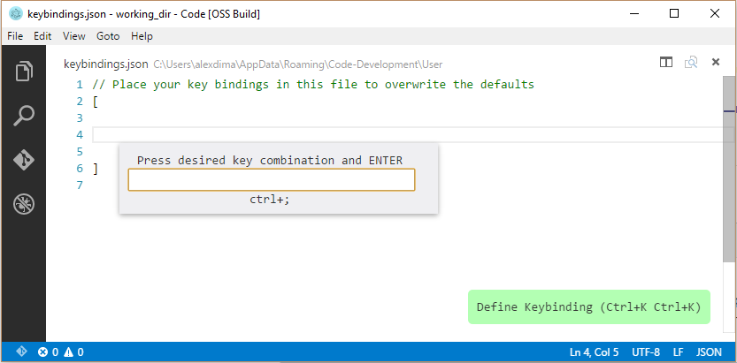

# 0.10.4 (December 2015)

Hi,

## Insider's Channel 

There is now a setting to subscribe to the Insider's channel to get prerelease VS Code builds automatically.

## Editor

 * Find/Replace improvements when in regex mode:
  * Can now search for `^`, `$` or `^$` due to [community contribution](https://github.com/Microsoft/vscode/pull/314)
  * Can now replace with `\n` or `\t`
 * New option to configure cursor blinking: `"editor.cursorBlinking"` with values `"blink"`, `"visible"` and `"hidden"` due to [community contribution](https://github.com/Microsoft/vscode/pull/500).
 * New select current line command (`Ctrl/Cmd+I`) due to [community contribution](https://github.com/Microsoft/vscode/pull/961)

## Key Bindings
 * Added a new widget that helps input the key binding rule when editing `keybindings.json`. This is especially helpful when using a non-US standard keyboard layout:

 * Created a new node module [`native-keymap`](https://www.npmjs.com/package/native-keymap) that is used in VS Code to render the key bindings with the actual user keyboard layout:
  * e.g. `Split Editor` when using a French (France) keyboard layout is now rendered as `Ctrl+*`:
  

## Notable Bug Fixes

As always we fixed many issues.

Here are a few of the notable ones:

 * Submitted [pull request](https://github.com/atom/node-oniguruma/pull/46) to `atom/node-oniguruma` in order to [improve performance](https://github.com/Microsoft/vscode/issues/94) when colorizing long lines with multi-byte characters.
 