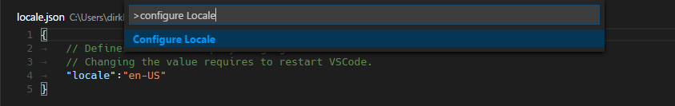

# 0.10.12 (March 2016)

## Insiders Release

Preliminary information on the new features and fixes coming with the 0.10.12 Insiders release can be found in our [March Iteration Plan](https://github.com/Microsoft/vscode/issues/3555) on GitHub.  There you will find brief feature descriptions and links to the feature test plans. As the milestone matures we'll expand upon the documentation here.

## Next Release

We're excited for the next release of Visual Studio Code at the [Build 2016 conference](http://build.microsoft.com/).

Downloads: [Windows](TBD) |
[OS X](TBD) | [Linux 32-bit](TBD) | [Linux 64-bit](TBD)

## Languages - JavaScript

**Please note**: If you have tested the [Salsa](https://github.com/Microsoft/TypeScript/issues/4789) preview in the past and have configured the `typescript.tsdk` setting, then please make sure to remove it. Otherwise you might use an old TypeScript version. When you have `typescript.tsdk` set, then the TypeScript version is shown in the bottom right of the Status Bar.

### Disable Syntax Validation when using ES7 constructs

Some users want to use syntax constructs like the proposed ES7 Object Rest/Spread Properties. However, these are currently not supported by Salsa and are flagged as errors. For users who still want to use these ES7 features, we have revived the `javascript.validate.enable` setting to disable all built-in syntax checking. If you do this, we recommend that you use a linter like `eslint` to validate your code. Since the JavaScript support doesn't understand ES7 constructs, features like IntelliSense might not be fully accurate.

### Guidance in creating a jsconfig.json file

The JavaScript experience is much better when you have a `jsconfig.json` file in your workspace that defines the project context. Without a `jsconfig.json`, each JavaScript file is treated as an island. Only the file itself and the JavaScript files it references are considered for features like IntelliSense. By adding a `jsconfig.json` file, you can the define the root of your project, the folders to exclude, etc. For this reason we now provide a hint to create a `jsonfing.json` file.


The hint creates a template for a `jsconfig.json`, with an exclusion list for you to edit:


Similarly when your JavaScript project is growing too large, esp. because of library folders like _node_modules_ et al, we ask you to edit the `exclude` list.

### Go To Symbol is back

During the transition to Salsa, the support for **Go to Symbol** was lost [Typescript#7134](https://github.com/Microsoft/TypeScript/issues/7134) for some JavaScript coding patterns. This feature is now back.

### No more "Reload JavaScript Project"

Previously you often had to run the **Reload JavaScript Project** command to ensure that the JavaScript information was up to date. Now VS Code keeps the information up to date as you edit the `jsconfig.json` file or when you add a typings (`.d.ts`) file.

### Source for Diagnostics

To make it easy to distinguish between diagnostics from external linters and the built-in syntax validation, errors and warnings from the built-in validator are now prefixed with `[JS]`.

### Validation

VSCode's Javascript validation can now be disabled using the setting `javascript.validate.enable`.
 
### Formatting options for JavaScript

The following formatter settings are now available for JavaScript:

```typescript
// Defines space handling after a comma delimiter
"javascript.format.insertSpaceAfterCommaDelimiter": boolean,

// Defines space handling after a semicolon in a for statement
"javascript.format.insertSpaceAfterSemicolonInForStatements": boolean,

// Defines space handling after a binary operator
"javascript.format.insertSpaceBeforeAndAfterBinaryOperators": boolean,

// Defines space handling after keywords in control flow statement
"javascript.format.insertSpaceAfterKeywordsInControlFlowStatements": boolean,

// Defines space handling after function keyword for anonymous functions
"javascript.format.insertSpaceAfterFunctionKeywordForAnonymousFunctions": boolean,

// Defines space handling after opening and before closing non empty parenthesis
"javascript.format.insertSpaceAfterOpeningAndBeforeClosingNonemptyParenthesis": boolean,

// Defines space handling after opening and before closing non empty brackets
"javascript.format.insertSpaceAfterOpeningAndBeforeClosingNonemptyBrackets": boolean,

// Defines whether an open brace is put onto a new line for functions or not
"javascript.format.placeOpenBraceOnNewLineForFunctions": boolean,

// Defines whether an open brace is put onto a new line for control blocks or not
"javascript.format.placeOpenBraceOnNewLineForControlBlocks": boolean,
```

New `javascript.format` settings

## Languages - TypeScript

### TypeScript Update

VS Code now ships with TypeScript 1.8.9, which includes some fixes over [TypeScript 1.8.2](https://blogs.msdn.microsoft.com/typescript/2016/02/22/announcing-typescript-1-8-2/).

### Validation

VSCode's Javascript validation can now be disabled using the setting `typescript.validate.enable`.

### Formatting options for TypeScript

The following formatter settings are now available for TypeScript:

```typescript
// Defines space handling after a comma delimiter
"typescript.format.insertSpaceAfterCommaDelimiter": boolean,

// Defines space handling after a semicolon in a for statement
"typescript.format.insertSpaceAfterSemicolonInForStatements": boolean,

// Defines space handling after a binary operator
"typescript.format.insertSpaceBeforeAndAfterBinaryOperators": boolean,

// Defines space handling after keywords in control flow statement
"typescript.format.insertSpaceAfterKeywordsInControlFlowStatements": boolean,

// Defines space handling after function keyword for anonymous functions
"typescript.format.insertSpaceAfterFunctionKeywordForAnonymousFunctions": boolean,

// Defines space handling after opening and before closing non empty parenthesis
"typescript.format.insertSpaceAfterOpeningAndBeforeClosingNonemptyParenthesis": boolean,

// Defines space handling after opening and before closing non empty brackets
"typescript.format.insertSpaceAfterOpeningAndBeforeClosingNonemptyBrackets": boolean,

// Defines whether an open brace is put onto a new line for functions or not
"typescript.format.placeOpenBraceOnNewLineForFunctions": boolean,

// Defines whether an open brace is put onto a new line for control blocks or not
"typescript.format.placeOpenBraceOnNewLineForControlBlocks": boolean,
```

## Languages - HTML

The HTML formatter is based on the **beautifyjs** library. The formatting options offered by that library are now surfaced in the VS Code settings:

* `html.format.wrapLineLength`: Maximum amount of characters per line.
* `html.format.unformatted`: List of tags that shouldn't be reformatted.
* `html.format.extraLiners`: List of tags that should have an extra newline before them.
* `html.format.preserveNewLines`: Whether existing line breaks before elements should be preserved.
* `html.format.maxPreserveNewLines`: Maximum number of line breaks to be preserved in one chunk.
* `html.format.endWithNewline`: End with a newline.
* `html.format.indentInnerHtml`: Indent `<head>` and `<body>` sections.

## Languages - C&#35;

## Editor

### Column Selection

TDODgif

### Source Code Folding Shortcuts

There are new folding actions to collapse source code regions based on their folding level.

There are actions to fold level 1 (`kbstyle(Ctrl + K, Ctrl + 1)`) to level 5 (`kbstyle(Ctrl + K, Ctrl + 5)`).
To unfold, use **Unfold All** ('kb(editor.unfoldAdd)`).

The level folding actions do not apply to region containing the current cursor.

### IntelliSense on Tab only

We have added an option to accept IntelliSense proposals only on Tab and not on Enter. Set the configuration option `editor.acceptSuggestionOnEnter` to `false` and avoid ambiguity when hitting `kbstyle(Enter)` while completions are shown.

### Indentation

We have improved our indentation handling in the editor. By default, the editor will now auto detect indentation based on file content. We have also added additional actions to the indentation status.


### File to language association

A very common request was having a configurable way to associate file names and paths to languages. We are happy to provide the new `files.associations` setting that allows you to make this association either globally or per workspace.

Here is an example that will associate more extensions to the PHP language:

```json
"files.associations": {
    "*.php4": "php",
    "*.php5": "php"
}
```

You can also configure full file paths to languages if needed. The following example associates all files in a folder `somefolder` to PHP:

```json
"files.associations": {
    "**/somefolder/*.*": "php"
}
```

Note that the pattern is a [glob pattern](https://en.wikipedia.org/wiki/Glob_%28programming%29) that will match on the full path of the file if it contains a `/` and will match on the file name otherwise.

### Toggle Whitespace

### UTF-8 BOM support

Some environments explicitly ask to include a BOM (Byte Order Mark) for UTF-8 encoded files. You can now save files with UTF-8 BOM encoding as well as convert existing files with or without BOM.

To save all new files with the UTF-8 BOM encoding, configure the `files.encoding` setting to this:

```json
"files.encoding": "utf8bom"
```

The Status Bar now distinguishes between files with UTF-8 and UTF-8 with BOM. You can convert the encoding from there.


### Wait support and git/patch/diff mode

When you run VS Code from the command line, there is a new argument you can pass to make the command wait until you have closed the current VS Code instance. This can be used with applications that can configure an external editor for file changes.

For example, Git allows you to configure an external editor and here are the steps to do so:

1. Make sure you can run `code --help` from the command line and you get help.
    * if you do not see help, please follow these steps:
        * Mac: Select **Shell Command: Install 'Code' command in path** from the **Command Palette**.
        * Windows: Make sure you selected **Add to PATH** during the installation.
        * Linux: Make sure you selected **Add to PATH** during the installation.
2. From the command line, run `git config --global core.editor "code --wait"`

Now you can run `git config --global -e` and use VS Code as editor for configuring Git.


Add the following to enable support for using VS Code as diff tool:

```bash
[diff]
    tool = default-difftool
[difftool "default-difftool"]
    cmd = code --wait --diff $LOCAL $REMOTE
```

This leverages the new `--diff` option you can pass to VS Code to compare 2 files side by side.

To summarize here are some examples of where you can use with VS Code:

* `git rebase HEAD~3 -i` allows to interactive rebase using VS Code
* `git commit` allows to use VS Code for the commit message
* `git add -p` followed by <kbd>E</kbd> for interactive add
* `git difftool <commit>^ <commit>` allows to use VS Code as diff editor for changes

## Workbench

### Extensions in Status Bar

There is now an Extensions icon in the bottom left corner of the workbench. This is not only a shortcut to reach into extension related actions but also the place for extension error and update notifications. It is also used to report progress during an extension's installation.


### Exclude files from watching

When you open VS Code on a folder, it installs a file watcher service on the folder and every file and folder contained within to be notified when something changes. If the folder is very large, this can consume many resources right at startup. A new setting, `files.watcherExclude`, now allows to explicitly exclude large directories from file watching.

This setting has the following defaults:

```json
"files.watcherExclude": {
    "**/.git/objects/**": true,
    "**/node_modules/**": true
}
```

We suggest you only exclude more folders if you see that VS Code is using lots of CPU when opening a folder. Typically you would not have to make any changes to this setting.

### Output handling improvements

Large amounts of output were the cause of multiple user issues. We have now addressed this and are handling large amounts of output in a more efficient way.

## Debugging

### Run action

With this release VS Code supports to 'Run' a program (in addition to 'Debug'). The **Run** action is triggered with `kbstyle(Ctrl + F5)` and uses the currently selected launch configuration. Many of the launch configuration attributes are supported in 'Run' mode too. VS Code maintains a debug session while the program is running and pressing the 'Stop' button terminates the program.

Please note: The 'Run' action is always available, but a debug extension has to 'opt-in' in order to support 'Run'. If a debug extension has not been updated, 'Run' will fall back to 'Debug' (the built-in Node Debug and [Mono Debug](https://marketplace.visualstudio.com/items?itemName=ms-vscode.mono-debug) already support 'Run').

### Improved thread handling

Thanks to this [pull request](https://github.com/Microsoft/vscode/pull/3990), VS Code debugger UI now supports multiple stopped threads and the call stack for each thread is now requested lazily. This improves the debugger's stepping performance in multi-threaded programs.

## Tasks

### Tasks.json Creation

Configuring the task runner now offers you a list of templates to choose from. Tasks defined for Gulp and Grunt are still auto detected.


TODOimage

## Setup

### Linux packages

.deb and .rpm packages are now being offered as the primary way to install and start using Code on Linux. The packages will install the program, a desktop entry, a bin command as well as integrating Code into the [Debian alternatives system](https://wiki.debian.org/DebianAlternatives).

Installing can be done through a package manager GUI by running the file through the file explorer or through the command line:

```bash
# For .deb
sudo dpkg -i <file>.deb

# For .rpm
sudo dnf install <file>.rpm
```

### Linux CLI

The new bin command installed with the package files brings Linux in line with the other platforms that had their command line interfaces improved in the [February release](http://code.visualstudio.com/Updates#_setup). Run `code --help` to see the command line args available for use.

## Accessibility

### Parameter hints

Parameter hints are now read out to the user.

## Localization

VSCode is now translated to the following 9 languages: Simplified Chinese, Traditional Chinese, French, German, Italian, Japanese, Korean, Russian and Spanish. By default VSCode picks up the operation system's language. If you want to configure a special language you can either use the command line switch --locale to specify a locale or use the Configure Locale action to specify a locale setting used whenever VSCode is started. Examples are `de` for German or `zh-TW` for Traditional Chinese.



## Extension Authoring

## Notable Bug Fixes

- [2116](https://github.com/Microsoft/vscode/issues/2116): Inconsistent de-indentation behavior while closing html tags using Autocomplete
- [2808](https://github.com/Microsoft/vscode/issues/2808): Make it easier to add more file extensions to an existing colorizer/language
- [2912](https://github.com/Microsoft/vscode/issues/2912) Html code returned from a TextDocumentContentProvider can now embed JavaScript code.

Here are the [closed bugs](https://github.com/Microsoft/vscode/issues?q=milestone%3A%22March+2016%22+is%3Aclosed) and the [closed feature requests](https://github.com/Microsoft/vscode/issues?q=is%3Aissue+milestone%3A%22March+2016%22+is%3Aclosed+label%3Afeature-request) for the March update.

## Thank You

Last but certainly not least, a big *__Thank You!__* to the following folks that helped to make VS Code even better:

- [todo](https://github.com/todo): TODO fixed something [todo](https://github.com/Microsoft/vscode/pull/todo).
