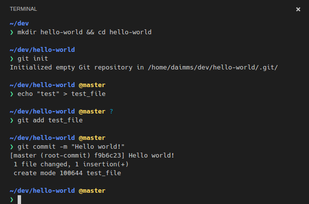

# 1.2.0 (May 2016)

Our May release has some great new features as well as important bug fixes and enhancements:

* Integrated Terminal - Stay in VS Code while using your platform's shell
* Smart CSS support - Now with IntelliSense, Go to Definition, Find all Occurrences
* TSLint Quick Fixes - Fix TSLint warning with Quick Fix lightbulbs

Add we've continued to expand our extensions support with new samples and new APIs to automatically start debug sessions and programmatically use our handy diff-editor.

Downloads: [Windows](https://az764295.vo.msecnd.net/stable/c212f0908f3d29933317bbc3233568fbca7944b1/VSCodeSetup-stable.exe) |
[OS X](https://az764295.vo.msecnd.net/stable/c212f0908f3d29933317bbc3233568fbca7944b1/VSCode-darwin-stable.zip) | Linux 64-bit [.zip](https://az764295.vo.msecnd.net/stable/c212f0908f3d29933317bbc3233568fbca7944b1/VSCode-linux-x64-stable.zip) [.deb](https://az764295.vo.msecnd.net/stable/c212f0908f3d29933317bbc3233568fbca7944b1/vscode-amd64.deb) [.rpm](https://az764295.vo.msecnd.net/stable/c212f0908f3d29933317bbc3233568fbca7944b1/vscode-x86_64.rpm) | Linux 32-bit [.zip](https://az764295.vo.msecnd.net/stable/c212f0908f3d29933317bbc3233568fbca7944b1/VSCode-linux-ia32-stable.zip) [.deb](https://az764295.vo.msecnd.net/stable/c212f0908f3d29933317bbc3233568fbca7944b1/vscode-i386.deb) [.rpm](https://az764295.vo.msecnd.net/stable/c212f0908f3d29933317bbc3233568fbca7944b1/vscode-i386.rpm)

## Editor

### Configure Word Based Suggestion

When a language service isn't able to compute semantic completion (suggestions), VS Code defaults to word based completions. Word based completions can be disabled with the `editor.wordBasedSuggestions`-setting.

### Resizable Peek View

The peek view editor that shows for reference search and for previewing declarations can now be resized.


## Workbench

### Integrated terminal

The initial version of the integrated terminal ([#143](https://github.com/Microsoft/vscode/issues/143)) has been implemented. The terminal can be triggered using `kb(workbench.action.terminal.toggleTerminal)` or by triggering the **View** > **Toggle Terminal** command in the **Command Palette**.

The shell that is used defaults to `$SHELL` on Linux and OS X, and `%COMSPEC%` on Windows. These can be overridden manually by setting `integratedTerminal.shell.*` in settings. It should act just like the terminal you're familiar with.



This is an early version of what we want to deliver, currently it only supports a single terminal and is still missing features like copying and pasting with the keyboard. We wanted to get it into your hands as soon as possible and continue iterating with your feedback.

Some Windows 10 users may experience problems getting cmd.exe to work, if so you can try enabling the legacy terminal as described in [#143](https://github.com/Microsoft/vscode/issues/143#issuecomment-221054202). 

If you experience any issues or think of possible improvements, please [file an issue](https://github.com/Microsoft/vscode/issues/new) against the GitHub repository. You can see a [list of current bugs and feature requests here](https://github.com/Microsoft/vscode/issues?q=is%3Aopen+is%3Aissue+label%3Aintegrated-terminal).

## Languages

### CSS

CSS / SASS / LESS editors can now identify CSS variables and provide IntelliSense, Go to and Peek Definition and Find All Occurrences support.

### vscode-tslint

There is now support for quick fixing some TSLint warnings.

## Debugging

### Control opening the Debug Console

We have introduced a setting `internalConsoleOptions` in `launch.json` to change the behavior of automatic revealing of the Debug Console.
`internalConsoleOptions` can have the following values: `neverOpen`, `openOnSessionStart` and `openOnFirstSessionStart`.

## Node.js Debugging

### Improved Stepping Performance

To improve the stepping experience for programs with a large number of local variables per scope, we've made the following adjustments:

* If a scope has more than 100 local variables, the VS Code Node.js debugger no longer auto expands that scope automatically.
* After the user has expanded the scope manually, only the first 100 local variables are shown.
* In both cases, the scope header reflects the fact that there are many locals and only a subset is shown:


If you need to track a variable that is not within the first hundred, you can add it as a Watch expression or evaluate it in the Debug Console.

## Extension Authoring

### Debug extension API

We have exposed a `vscode.startDebug` command as an extension API for the VS Code debugger component. With this, a debug session can be started programmatically either by passing the name of a launch configuration or a complete launch configuration object:

```js
    let launchConfig = {
        type: "node",
        request: "launch",
        program: "${workspaceRoot}/test.js",
        cwd: "${workspaceRoot}"
    };

    vscode.commands.executeCommand('vscode.startDebug', launchConfig).then(() => {
        vscode.window.showInformationMessage('Debug session started successfully');
    }, err => {
        vscode.window.showInformationMessage('Error: ' + err.message);
    });
```

More details can be found [here](https://github.com/microsoft/vscode/issues/4615).

### Comparing files

We have added a new API command that allows you to use the diff-editor on two arbitrary resources like so: `commands.executeCommand('vscode.diff', uri1, uri2)`

### Updated extension samples

There is a new rich extension sample that walks you through _virtual documents_, _eventing_, and using _language features as commands_. Also, the preview html sample was updated:

* [contentprovider-sample](https://github.com/Microsoft/vscode-extension-samples/tree/master/contentprovider-sample)
* [previewhtml-sample](https://github.com/Microsoft/vscode-extension-samples/tree/master/previewhtml-sample)

### Debug Adapter: Support a 'One' or 'All' mode of operation for controlling threads

In a previous revision of the VS Code Debug Protocol, we had introduced a `allThreadsStopped` attribute on the `StoppedEvent`. With this attribute, a debug adapter can report back to the frontend whether only a single thread or all threads have stopped. Thanks to developer feedback, we learned that a similar attribute is necessary for the `ContinueRequest` too.

In the version 1.9.0 of the [VS Code Debug Protocol](https://github.com/Microsoft/vscode-debugadapter-node), a boolean attribute `allThreadsContinued` has been added to the response from the `ContinueRequest`. Using this attribute, a debug adapter can report back to the UI whether only a single thread or all threads are continuing. More details can be found [here](https://github.com/Microsoft/vscode/issues/6400).

## Bug Fixes

This release has a number of notable bug fixes.

* [1000](https://github.com/Microsoft/vscode/issues/1000): Slow response when system is offline
* [5645](https://github.com/Microsoft/vscode/issues/5645): Slow call stack response for TS repository
* [5780](https://github.com/Microsoft/vscode/issues/5780): Come up with better external terminal defaults on Linux
* [6029](https://github.com/Microsoft/vscode/issues/6029): debug doesn't work on node v6
* [6432](https://github.com/Microsoft/vscode/issues/6432): Ubuntu scope not setup on installation
* [6530](https://github.com/Microsoft/vscode/issues/6530): source maps don't work if drive letter case does not match

These are the [closed bugs](https://github.com/Microsoft/vscode/issues?q=is%3Aissue+label%3Abug+milestone%3A%22May+2016%22+is%3Aclosed) and these are the [closed feature requests](https://github.com/Microsoft/vscode/issues?q=is%3Aissue+milestone%3A%22May+2016%22+is%3Aclosed+label%3Afeature-request) for the 1.2.0 update.

## Thank You

Last but certainly not least, a big *__Thank You!__* to the following folks that helped to make VS Code even better:


* [Peng Lv (@rebornix)](https://github.com/rebornix): add touch screen tap support for reference search. [PR #6386](https://github.com/Microsoft/vscode/pull/6386)
* [Yuki Ueda (@Ikuyadeu)](https://github.com/Ikuyadeu): debt reduction in suggest. [PR #6035](https://github.com/Microsoft/vscode/pull/6035) and [PR #6057](https://github.com/Microsoft/vscode/pull/6057)
* [Richard Lasjunies (@rlasjunies)](https://github.com/rlasjunies): vscode-tslint - autofix some tslint warnings [PR #47](https://github.com/Microsoft/vscode-tslint/pull/47)
* [Gary Wilber (@Spacetech)](https://github.com/Spacetech): vscode-tslint - Ability to exclude files [PR #40](https://github.com/Microsoft/vscode-tslint/pull/40)

