---
Order:
TOCTitle: June 2015
PageTitle: Visual Studio Code 0.3.0
MetaDescription: Visual Studio Code 0.3.0
---
# June 2015 (0.3.0)

Thank you for using Visual Studio Code and keep the feedback coming!  Based on your feedback, we added some frequently requested enhancements and provided over 300 minor improvements and bug fixes. This release is available now and is just the start - from this point on, you should expect to see an update roughly every month.

See [how to update](/docs/supporting/howtoupdate.md) to get the bits. Read on for details about the many changes in this release.

## Key Bindings

Based on user feedback (thanks!) we've decided to make some key binding changes. If you do not like our changes, you can always change key bindings as described in the [keybindings](/docs/getstarted/keybindings.md) documentation.

* The native File Open dialog has been restored to `kb(workbench.action.files.openFile)`. We received strong feedback that using this key for the Code File Open dialog is confusing.
* The Code File Open dialog is now accessible via `kb(workbench.action.quickOpen)`. We needed to find a new key for the Code File Open dialog. Since many editors are now using `kb(workbench.action.quickOpen)` for their enriched File Open dialog, we decided to go with this trend.
* Go To Definition is now `kb(editor.action.goToDeclaration)` (formerly `kbstyle(Ctrl+F12)` on Windows). Visual Studio users suggested to align Go To Definition with Visual Studio. This wasn’t an option in the past when the VS Code editor was running inside the browser, since F12 was opening the developer tools.
* `kbstyle(Cmd+Up)` and `kbstyle(Cmd+Down)` now work as expected on the Mac by jumping to the beginning and end of the file.
* Format code is now `kb(editor.action.format)`

## Command line args
You can now create a new file from the command line. For a file that doesn't exist yet, append the file path to create it. VS Code will open it as a dirty (modified but not yet saved) file in the editor.

`code mynewfile.js`

You can open multiple folders and/or files from the command line. Just append multiple folder and/or file paths to open multiple sessions of VS Code.

`code c:\myfolder1 c:\myfolder2 c:\myapp\program.cs`

You can also open a new session instead of restoring the previous session.  Use a new switch, `-n` or `--new-window`, if you want to start VS Code without restoring the previous session.

`code -n`

## Editing

### Multi-cursor
Here's multi-cursor improvements that we've made.

* `kb(editor.action.addSelectionToNextFindMatch)` selects the word at the cursor, or the next occurrence of the current selection.
* `kb(editor.action.moveSelectionToNextFindMatch)` moves the last added cursor to next occurrence of the current selection.
* The two actions pick up the **matchCase** and **matchWholeWord** settings of the find widget.
* `kb(cursorUndo)` undoes the last cursor action, so if you added one cursor too many or made a mistake, press `kb(cursorUndo)` to return to the previous cursor state.
* Insert cursor above (`kb(editor.action.insertCursorAbove)`) and insert cursor below (`kb(editor.action.insertCursorBelow)`) now reveals the last added cursor, making it easier to work with multi-cursors spanning more than one screen height (i.e., working with 300 lines while only 80 fit in the screen).

### Comment action
We added these changes for comment actions.

* `kb(editor.action.addCommentLine)` now forces adding line comments.
* `kb(editor.action.removeCommentLine)` now forces uncommenting lines. (If multiple lines are selected, and not all of them have a line comment, the line comments will still be removed).
* `kb(editor.action.commentLine)` toggles line comment as before, but now inserts the line comment tokens aligned with the indentation of the selected code. It also will leave empty or whitespace-only lines untouched. `kb(editor.action.commentLine)` is also more forgiving with regards to selection state when toggling comments in languages which only support block comments, such as CSS or HTML.
* Toggle block comment (`kb(editor.action.blockComment)`) is also more forgiving related to selection state when toggling block comments.

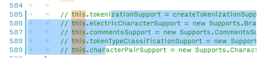

### Indentation
Pressing `kbstyle(Tab)` on an empty line will indent as much as needed to place the cursor at the correct starting position (i.e., not just insert a single indentation).

### Shrink/expand selection
Quickly shrink or expand the current selection (applies to all languages). Trigger it with `kb(editor.action.smartSelect.shrink)` and `kb(editor.action.smartSelect.grow)`

Here's an example of expanding the selection with `kb(editor.action.smartSelect.grow)`:

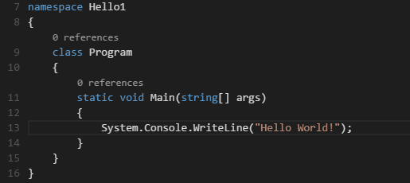

### Wrapping control
To improve readability, you can now control how long lines are wrapped and indented with a new setting, `editor.wrappingIndent`, in **settings.json**. The following values are available for `editor.wrappingIndent`:

* `none`: When a line wraps, subsequent lines start at column 1.

    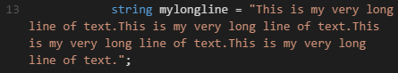

* `same`: (This is the default.) When a line wraps, subsequent lines start at the same column used by the original line.

    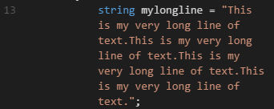

* `indent`: When a line wraps, subsequent lines are indented once relative to the original line.

    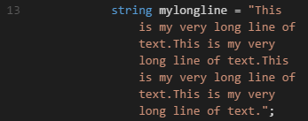

## Debugging
In launch configurations, you can now use the `runtimeArgs` attribute. This is useful if you need to pass command line arguments to Node or Mono (not to the program being debugged).

Starting a debug session on Linux now opens a terminal with support for input/output.

TypeScript  debugging now supports JavaScript source maps. Enable this by setting the `sourceMaps` attribute to `true` in the launch configuration. In addition, you can specify a TypeScript file with the `program` attribute. To generate source maps for your TypeScript files, compile with the `--sourcemap` option.

Debugging is now supported in folder-less workspaces
For example, you can debug when if a folder is not active (e.g., when you choose **File**, **Close Folder** or **File**, **New Window**). VS Code displays a purple status bar when you are in folder-less debug mode.

For exceptions thrown, via the code line marked in red, and for breakpoints, via the status bar.

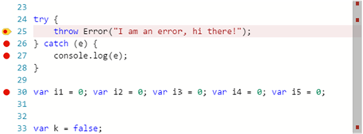

Here's other debugging changes we made for this release.

* A icon to collapse all variables has been added to the Variables tree.
* You can now copy a variable's value to the clipboard from the Variables tree.
* Environment variables now work on all platforms.
* VS Code no longer inadvertently hijacks an arbitrary terminal on OS X when starting a launch session. Only a terminal previously used for debugging is reused for a new session.
* Arguments passed to the runtime or program being debugged can now contain spaces.
* `kbstyle(F9)` and `kbstyle(F11)` work again.
* Debugging works with UNC paths.
* Better error messages are provided if Mono or Node is missing.
* Support has been added for F# debugging on Mono on OS X and Linux

## Tasks

We have defined three new problem matchers:

* `$jshint-stylish`: To detect jshint problems produced by the stylish reporter.
* `$eslint-compact`: To detect eslint problems produced by the compact reporter.
* `$eslint-stylish`: To detect eslint problems produced by the stylish reporter.

Multiline problem matchers have been added to the task system to capture stylish output from several linting tools. You can see an example in [Tasks](/docs/editor/tasks.md).

You can now consistently redefine global properties per operating system and per explicit task. See [operating specific values](/docs/editor/tasks.md#operating-system-specific-properties) and [task specific values](/docs/editor/tasks.md#task-specific-properties) for details.

A new property, `suppressTaskName`, can be specified globally, per operating system, or per task, to indicate whether the task name is added to the arguments when a task command is executed. See more details in the Appendix of [Tasks](/docs/editor/tasks.md).

## Languages

### Rust
[Rust](https://www.rust-lang.org/) has been added as a supported language for colorization and bracket matching.

### TypeScript
The TypeScript language service has been updated to TypeScript version 1.5.

### JavaScript
New options allow you to turn off *all* semantic and syntax checks, useful if you prefer JSHint instead of the VS Code JavaScript validator.

* `javascript.validate.semanticValidation=[true|false]` Use `true` to have VS Code report semantic errors (unassigned variables, etc. and *all* lint checks)
* `javascript.validate.syntaxValidation=[true|false]` Use `false` to have VS Code report syntaX errors (missing brackets, etc.).

### HTML
HTML auto closing of tags has now been removed and replaced with smarter IntelliSense on `</`.

## CJK wrapping:
To get a better approximation of the Chinese-Japanese-Korean (CJK) character widths, we now measure half-width **m** and full-width **m**. This result is text with CJK characters renders with a monospace font which shouldn't overflow the line and introduce horizontal scroll bars.

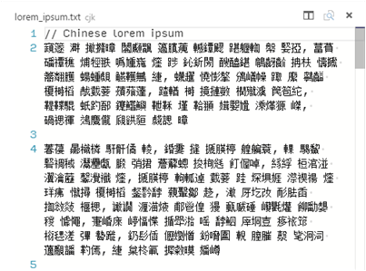

## File Compare
**File Compare** applies to files in **Working Files** now too. A new global action, **Files: Compare Opened File With**, has been added to the Command Palette.

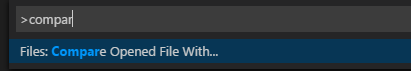

## Copy Path
To copy the path of any file or folder in the Explorer, right-click it and choose **Copy Path**.

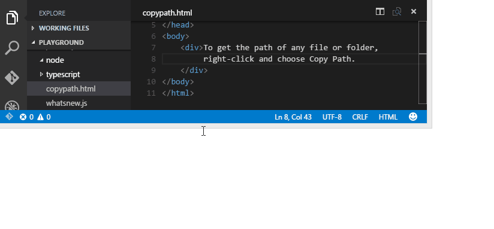

A new global action, **Files: Copy Path of the Active File**, has been added to the Command Palette.

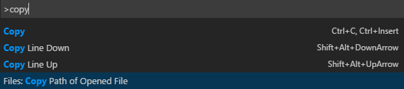

## Close Folder
The new menu item **File**, **Close Folder** will close the currently active folder and bring the workbench back into the "empty" state with a single, empty file opened. (If you haven't enabled Auto Save, you'll be prompted to save any pending changes in the active folder before it is closed.)

## File Encoding
Set the file encoding globally or per workspace by using the **files.encoding** setting in **User Settings** or **Workspace Settings**.

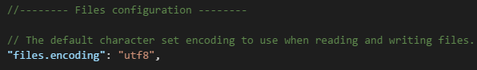

You can view the file encoding in the status bar.

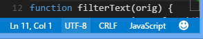

Click on the encoding in the status bar to reopen or save the active file with a different encoding.

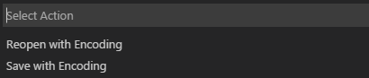

Then choose an encoding.

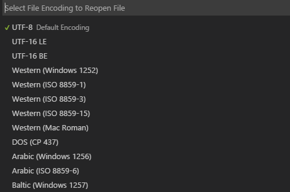

## Settings
The JSON parser is now more fault tolerant.  For example, if you have a trailing comma in **settings.json**, VS Code will no longer silently fail to apply your customized settings.  We'll still provide a visual indicator that there is an issue with the JSON. This example displays a red squiggly line on the last bracket, and a red box to the far right of Line 5.

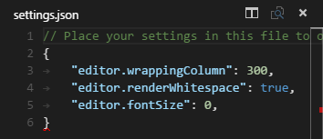

## UNC paths supported
With this release, you can now access Windows files and folders through UNC paths.

## Working files watched
Files not inside the opened folder but inside **Working Files** are now watched for changes and updated when changed.

## Linux 32-bit
VS Code is now available for 32-bit editions of Linux ([download](https://go.microsoft.com/fwlink/?LinkID=615206)).

## Other significant bug changes
We also fixed the following items.

* [16481](https://code.visualstudio.com/issues/Detail/16481): Opening files from a UNC folder
* [16457](https://code.visualstudio.com/issues/Detail/16457): Chinese characters not properly rendered on Linux
* [16574](https://code.visualstudio.com/issues/Detail/16574): Encoding issues
* [16500](https://code.visualstudio.com/issues/Detail/16500): $scope auto completes to $$scope
* [16514](https://code.visualstudio.com/issues/Detail/16514): HTML tags are incorrectly auto completed
* [16573](https://code.visualstudio.com/issues/Detail/16573): "CFBundleIdentifier" of "Visual Studio Code.app" should be changed from "com.github.atom-shell" to another unique identifier.

For a list of currently known issues, see our [FAQ](/docs/supporting/faq.md). You can view or report new issues [here](/issues).
