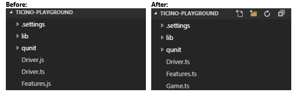
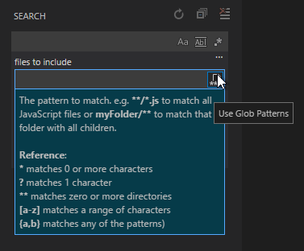
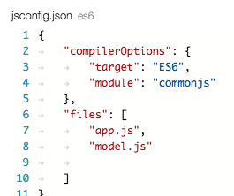
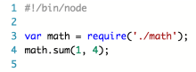
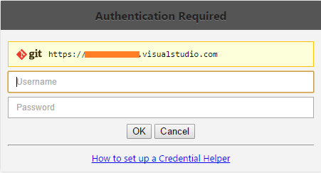
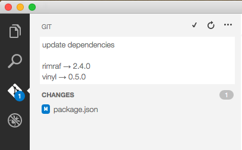
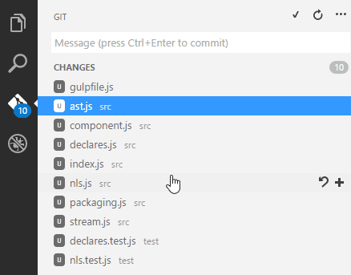
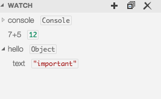
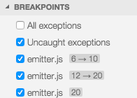
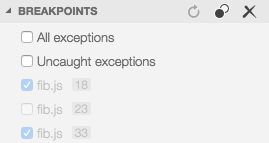

---
Order:
TOCTitle: July 2015
PageTitle: Visual Studio Code 0.5.0
MetaDescription: See what is new in Visual Studio Code 0.5.0
---
# July 2015 (0.5.0)

Thank you again for using Visual Studio Code! With our second update, we have lots to share with you, so much that we'll start with a quick summary for some of the key items:

* Several updates to how we handle files, including file and folder filtering in the explorer, opening files via the command line at a specific line number, re-using an existing instance when you open multiple files, ability to control the size of the working files list.
* Improved editor options that include support for removing trailing whitespace, improved search patterns with include/exclude filters.
* Significant JavaScript updates including ES6 support, jsconfig.json, improved `///` reference management, additional workspace settings
* Git enhancements, including an integrated credential prompt, multiline commit message support and improved control over auto-fetch
* User-defined snippets support, and more built-in snippets for common languages, i.e., Dockerfiles, Python, and Rust.
* Debugger enhancements including watch expressions, and improved Node.js breakpoint and source map support.
* Other Stuff: Proxy support, auto-update enabled for Mac and Windows, notable bug fixes

This release is available now - see [how to update](/docs/supporting/howtoupdate.md) to get the bits.

Read on to find out about the new features and learn how you can be more productive using VS Code.

## Files

New file-based enhancements make it easier to link VS Code into your workflow with other tools, e.g. Unity, as well as improve the overall experience.

>**Note:**  In the Editor Options section below, we show how you can hide derived resources in the Explorer, update the size of the Working Files area and exclude files from Search.

**New command-line options: -r and -g**

* The `-r` (or `--reuse-window`) command-line option forces opening a file or folder in the last active window. This is useful in cases where you want to quickly send a file from the command line into your workspace,  without having to manage new windows each time. This also works with files that don't exist - VS Code will simply open a new file as dirty in the last active window.

* The `-g` (or `--goto`) command-line option lets you open files at a specific line and column number. This is useful if you're using another tool in your workflow and want VS Code to open an exact position within a file.<br/>The syntax is:<br/>`code -g file1:<line>:<column?> file2:<line>:<column?> file3:<line>:<column?>`<br/>The `column` value is optional. As shown in the example, you can open multiple files in a single VS Code instance using the desired line and column position. Note that `"-g"` switch is mandatory for this feature, since `:` is a valid character in file names on some operating systems.<br/>
Here's how to open a file to line 10, column 17:<br/>`code -g c:\mycode\HelloWorld.ts:10:17`<br/>

>**Tip:** If you combine `-r` and `-g` you can configure an external tool to open files on a specific line and column into your running VS Code instance!  This was a popular request from the Unity user base.

**Additional command line changes**

When you pass multiple file paths to VS Code, they will all open in the same instance now. If some of the paths point to files that don't exist, VS Code will open new files as dirty.

When you pass in command-line arguments for the path to a folder, and also a file name, VS Code will open both the folder and file in a single VS Code instance. Previously we would open two (or more) VS Code instances. The usage case is that you want to open a specific file in a folder while still opening the folder in the side bar.

Note that you can use absolute paths or relative paths for the folder argument and the file argument. If you use a relative path for the file argument, it is relative to where you start VS Code (not relative to the folder argument).

This example opens the current folder and a specific file, HelloWorld.ts, in that folder (the file will be created as dirty if it doesn't exist).

`code . HelloWorld.ts`

**Mac dock support**

You can now open files and folders by dropping them to VS Code, even if it is not yet running. In addition, when you drop multiple files on the dock while VS Code is already running, VS Code will not start separate instances for each, but instead will try to open them in one instance.

## Editor options

We added more configuration options for files, explorer and search. Access them from **File** | **Preferences**.

**Patterns syntax**

To support several of the new Search and Editor options, we've introduced a lightweight pattern matcher.  With a simplified set of patterns we support for specifying match patterns, you can use:

* `*` to match one or more characters in a path segment
* `?` to match on one character in a path segment
* `**` to match any number of path segments ,including none
* `{}` to group conditions (e.g. `{**/*.html,**/*.txt}` matches all html and txt files)
* `[]` to declare a range of characters to match (e.g., `example.[0-9]` to match on `example.0`, `example.1`, …

**Automatically trim trailing whitespace**

By popular demand, we added the `files.trimTrailingWhitespace` setting that allows you to trim trailing whitespace whenever you save.  This also works with autosave enabled.

**Configure the size and behavior of Working Files**

Two new settings give you more control over how files appear in the Working Files area - ideal for larger monitors!

* The `explorer.workingFiles.maxVisible` setting allows you to configure the number of visible working files before a scrollbar appears (the default is 9).
* The `explorer.workingFiles.dynamicHeight` setting lets you configure whether working files should dynamically adjust its height based on the number of elements inside. Set this to `false` if you don’t want the explorer jumping down when you add new working files. The default is `true`.

**Hiding files and folders**

The `files.exclude` setting lets you define patterns to hide files and folders from several places in VS Code like the explorer and search. Once defined, files and folders matching any of the patterns will be hidden.

>**Tip:** This is really useful to hide derived resources files, like `\*.meta` in Unity, or `\*.js` in a TypeScript project. For Unity to exclude the `\*.cs.meta` files, the pattern to choose would be: `"**/*.cs.meta"`

**Hide derived resources**

If you use a language that compiles to another file at the same location of the source file, like TypeScript does to JavaScript, you often don’t want to see the files in the explorer or include them in search results. With the new filtering capabilities, you can easily set an expression to hide those derived files:

`"**/*.js": { "when": "$(basename).ts"}`

Such a pattern will match on any JavaScript file (`**/*.js`), but only if a sibling file with the same name and extension, `*.ts` in this example, is present. The result being Explorer will no longer show derived resources for JavaScript if they are compiled to the same location. All you have to do is configure this in the `files.exclude` setting. While we've used JavaScript for this example, the same technique can be used for other transpiled languages, like Coffee Script or Less/Sass, too.

Here's an example of how JavaScript files are hidden using the `"**/*.js": { "when": "$(basename).ts"}` expression.



**Exclude files and folders from search**

The `search.exclude` setting lets you configure additional files and folders to exclude from full text searches and from quick open, besides the `file.exclude` setting. This uses the patterns syntax (discussed below).

>**Note:** This is a **breaking change**, as it replaces `search.excludeFolders`, so be sure to update your settings!

**Search leveraging patterns**

To let you define powerful patterns for includes and excludes when you run searches, we added glob pattern support to the search box too. You can enable glob pattern search by clicking on the little icon in the include and exclude box.

Once you click on the pattern icon, you have access to the pattern reference.



>**Note:** You can still use wildcards without enabling glob pattern support. Things like `*.js` to search in all JavaScript files still work. Once you enable glob pattern syntax, keep in mind that you need to use `**/*.js` to search across all directories of your project!

## JavaScript

We've made a lot of changes for JavaScript development in this release.

**Breaking Changes**

A change like this comes with a few breaking changes: We deprecated some advanced configuration settings: `validate.scope`, `validate.baseUrl`, `validate.target`, `validate.module`, `validate.noLib`. We're providing support for  `jsconfig.json` to offset these settings no longer being supported.

**Support for ES6**

A popular request since our launch has been support for ES6 (ECMAScript 6, the latest update of JavaScript targeting ratification in June 2015). You can expect VS Code to understand the new ES6 syntax elements and their semantics.

Note that super-references in deriving object-literals is still on our plate; currently if you try this in VS Code you'll receive a faulty compile error, which you can suppress with the `_surpressSuperWithoutSuperTypeError: [true|false]` option.

>**Tip:** A good overview of the new ES6 features can be found here: <https://github.com/lukehoban/es6features>

**Projects - jsconfig.json**

You can create a JavaScript project by dropping in a `jsconfig.json` file. It's a subset of [tsconfig.json](https://github.com/microsoft/TypeScript/wiki/tsconfig.json), and it allows you to define what files are part of a project, and what compiler options to use.
Same as in `tsconfig.json` if no "files" property is present in a `jsconfig.json`, we default to including all files in the containing directory and subdirectories. When a "files" property is specified, only those files are included.



This means you don’t need to use `///` references anymore. As the project defines the file set, VS Code just knows what files and symbols are part of your project. As an example, you can just drop a new `.d.ts` file into your project folder and VS Code will pick it up automatically.

>**Note:** In the Editor Options section, we discuss how you can hide derived files in the Explorer window, e.g. `*.js` files generated from `*.ts` sources.  In the Debugging section, we discuss support for JavaScript Source Maps and minified/uglified JavaScript debugging.

**Shebang coloring**

We improved colorization for shebang `#!`, as shown in the first line here:



## Snippets

VS Code launched with [snippet support](/docs/editor/userdefinedsnippets.md), and we've added some notable enhancements in this release.

**User-defined snippets**

To add your own code snippets, use the newly added User Snippet action available by **File** | **Preferences**. This action opens a language selection dialog. Selecting a language will open the snippets for the file language. Enter your snippets directly in the editor.

>**Tip:** Changes are picked up on save (there's no need to restart VS Code).

This is an example of a snippet file:

```
{
	"Node Require" : {
		"prefix": "require",
		"body": [
			"var ${module} = require('${module}');",
			"$0"
		],
		"description": "Node require statement"
	}
}
```

Each property in the object represents a snippet.

* `body` is what is inserted when the snippet is selected.
* `description` is shown as additional information.
* `prefix` is what IntelliSense will use as a label and to filter against.

The body format follows the TextMate template syntax (https://manual.macromates.com/en/snippets), with the following constructs supported:

* plain text
* placeholders with identifiers `${id: text}`
* simple tab placeholders `$0, $1, …`
* nested placeholders `${id1:  some text ${id2: nested text} }`

We have also added some more snippets out of the box for Dockerfiles, Python, and Rust.

## Git

We updated our Git support by delivering several of the most requested features.

**Credential prompt**

Many users have reported that the Git tools can be non-responsive.  This is typically a result of the Git action being blocked by an authentication prompt.  With this update, when Git requires credentials you will see a pop-up, prompting you to enter the required credentials.



>**Tip:** If you don’t want to always enter your credentials, consider using a [credential helper](https://docs.github.com/get-started/getting-started-with-git/caching-your-github-credentials-in-git).

**Multiline commit**

Previously, commit messages in VS Code supported only a single line of text.  We now support multiple lines of text in your commit message. (Type `kbstyle(Ctrl+Enter)` to finish the commit message, or `kbstyle(Enter)` to add a new line to the message.)



**Multiple file selection**

Multiple selection is now enabled in the Git view, meaning you can stage/unstage or commit multiple files at the same time.



**Auto fetch control**

There is now an action to enable/disable Git auto fetch in the dropdown menu of the Git view. This is handy if you don’t have a credential helper and don’t want to get prompted for authentication all the time.

## Debugging

Debugging is core to the workflow enabled by VS Code, and with this release we support several additional scenarios.

**Improved launch.json generation**

We are now consulting package.json for a main attribute when generating launch.json. The result is the generated launch.json is more precise.

**Watch expressions**

We added a new debug pane for watch expressions. You are able to add, rename or remove watch expressions from the Debug view. Based on the focused stack frame, watch expressions are reevaluated whenever the debug target has stopped. It is also possible to add an expression to watch using the editor context menu.



**Ability to edit during debug**

The workbench is no longer in read-only mode when debugging.
However, VS Code does not yet support 'hot code replacement', so edited code is not automatically picked up by the debugger
but a new 'Restart Session' action helps to improve the experience.

**Improved Node breakpoint handling**

Node does not parse source files completely on load, rather it delays parsing of closures (e.g. callbacks) until their code is first hit. As a consequence, breakpoints set on callbacks are sometimes not registered for the line requested but instead  register for the next possible line in already-parsed code. To avoid confusion, we now show breakpoints at the location where node thinks the breakpoint is. In the breakpoint view, these breakpoints are shown with this notation:

*request line* → *actual line*

Here's an example:



This breakpoint validation occurs when a session starts and the breakpoints are registered with node, or when a session is already running and a new breakpoint is set. In this case, the breakpoint may "jump" to a different location.After node.js has parsed all the code (e.g,. by running through it), breakpoints can be easily re-applied to the requested locations with the Reapply button in the breakpoint view's header. This should make the breakpoints "jump back" to the requested location.


**Activate / deactivate breakpoints**

You can now toggle the active breakpoints.



**JavaScript source maps**

If generated (transpiled) JavaScript files do not live next to their source, you can help the VS Code debugger locate them by specifying the outDir directory in the launch configuration. Whenever you set a breakpoint in the original source, VS Code tries to find the generated source, and the associated source map, in the outDir directory.

In-lined source maps (a source map where the content is stored as a data url instead of a separate file) are now supported, although in-lined source is not yet supported.

**Minified debugging**

Debugging minified/uglified JavaScript is now supported.

## Other stuff

**Output toggling**

A new action was added that allows to toggle the output window. When output is not showing, it will just show output. But when output is showing, it will restore the previous editor you'd been using. This allows to quickly check the output and then quickly return to the work you did before. The action replaces the previous "Show Output" action, so by default the keybinding for output toggling is Ctrl+Shift+U (Cmd+Shift+U on Mac).

**Auto-update enabled for OS X and Windows**

With this update, future updates will be automatic for OS X and Windows users (we don't support auto-updates for Linux). If you want to opt out of auto-updates, see instructions [here](https://go.microsoft.com/fwlink/?LinkID=616397).

**Proxy Support**

Http requests for package/project/bower.json IntelliSense as well as fetching schemas and for Send-a-Smile now can go through a proxy server.

To configure a proxy either:

* Set the `http_proxy` and the `https_proxy` environment variables before starting VS Code.
* Set the `http.proxy` user setting.

>**Note:** VS Code supports http and https proxies, but not SOCKS proxies.

**Notable Bug Fixes**

* [16480](https://code.visualstudio.com/issues/Detail/16480): Git push/pull not working
* [16782](https://code.visualstudio.com/issues/Detail/16782): Fonts Are Blurry
* [17223](https://code.visualstudio.com/issues/Detail/17223): SourceMap debugging doesn't work with inlined source map
* [17079](https://code.visualstudio.com/issues/Detail/17079): OS X Poor Scrolling in Explore Sidebar


For a list of currently known issues, see our [FAQ](/docs/supporting/faq.md). You can view or report new issues [here](/issues).
