---
Order:
TOCTitle: February 2017
PageTitle: Visual Studio Code February 2017
MetaDescription: See what is new in the Visual Studio Code February 2017 Release (1.10)
MetaSocialImage: 1_10/release-highlights.png
---
# February 2017 (version 1.10)

**Update 1.10.2**: Adds the 1.10 translations and addresses a handful of [issues](https://github.com/Microsoft/vscode/milestone/38?closed=1).

Downloads: [Windows](https://vscode-update.azurewebsites.net/1.10.2/win32/stable) | [Mac](https://vscode-update.azurewebsites.net/1.10.2/darwin/stable) | Linux 64-bit: [.tar.gz](https://vscode-update.azurewebsites.net/1.10.2/linux-x64/stable) [.deb](https://vscode-update.azurewebsites.net/1.10.2/linux-deb-x64/stable) [.rpm](https://vscode-update.azurewebsites.net/1.10.2/linux-rpm-x64/stable) | Linux 32-bit: [.tar.gz](https://vscode-update.azurewebsites.net/1.10.2/linux-ia32/stable) [.deb](https://vscode-update.azurewebsites.net/1.10.2/linux-deb-ia32/stable) [.rpm](https://vscode-update.azurewebsites.net/1.10.2/linux-rpm-ia32/stable)

---

## February Release Summary

Welcome to the February 2017 release of Visual Studio Code. There are a number of significant updates in this version that we hope you will like, some of the key highlights include:

* **[Preview: Minimap](#preview-minimap)** - Get a 10,000 foot view of your code with Minimap.
* **[Preview: Drag and Drop in the editor](#preview-drag-and-drop-selected-text)** - Easily drag and drop text around the editor.
* **[Copy text with formatting](#copy-with-syntax-highlighting)** - Copy code examples with full syntax highlighting.
* **[Auto generate JSDoc](#auto-jsdoc-comments)** - Simply type `/**` to generate JSDoc comments for your functions.
* **[File Explorer key bindings](#configurable-explorer-key-bindings)** - You can now create shortcuts for the Explorer and other list/tree UI.
* **[Official Linux repositories](#official-signed-repositories-for-linux)** - VS Code supports auto-updating packages on Linux.
* **[Improved Exception view](#improved-exception-experience)** - Easily view exception details in the debugger.
* **[Column breakpoints](#column-breakpoints)** - Set multiple breakpoints on the same line of source code.
* **[Links in the Terminal](#links-in-the-terminal)** - Integrated Terminal output links streamline the workflow between editor and commands.
* **[Keybinding support for tasks](#key-bindings-per-task)** - Assign keyboard shortcuts to commonly used tasks.
* **[HTML DOM navigation](#html)** - Quickly navigate to DOM elements by id and class name.
* **[Language specific default settings](#go-make-yaml-markdown)** - Appropriate default settings for Go, Make, YAML and Markdown.

The release notes are arranged in the following sections related to VS Code focus areas. Here are some further updates:

* **[Editor](#editor)** - Word wrap settings simplification, manually trigger Save actions, new cursor styles.
* **[Workbench](#workbench)** - Configurable window title, run either selected text or entire file from the Integrated Terminal.
* **[Languages](#languages)** - TypeScript 2.2, disable color preview decorators, better link navigation in Markdown.
* **[Debugging](#debugging)** - Launch debugger using just the keyboard, new variable syntax.
* **[Tasks](#task-support)** - Run tasks in separate terminals, new ${lineNumber} variable.
* **[Extension Authoring](#extension-authoring)** - Pluggable SCM provider, Modal message dialogs, provide language specific settings.

>**Tip:** Want to see new features as soon as possible? You can download the nightly Insiders [build](https://code.visualstudio.com/insiders) and try the latest updates as soon as they are available.

## Editor

### Preview: Minimap

A Minimap gives you a high level overview of your source code which is very useful for quick navigation and code understanding. To enable VS Code's Minimap, set  `"editor.minimap.enabled": true` to turn on the rendering of a Minimap for the current file.

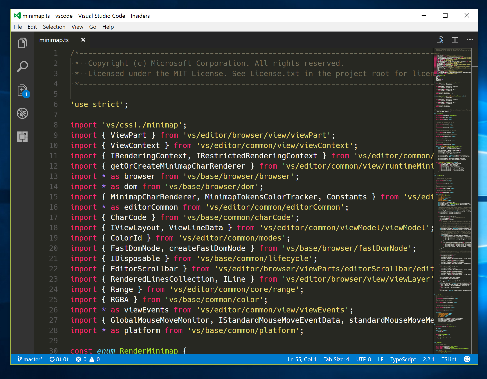

The screenshot above is on a Surface Book (high DPI display). Based on the `devicePixelRatio` (for example, regular or retina/high DPI displays), the Minimap will render characters either at 4x2 pixels or at 2x1 pixels.

For those that would prefer a more schematic representation for the current file, there is `editor.minimap.renderCharacters` that can be set to `false` to render blocks instead of characters in the Minimap.

Here it is on a regular display:

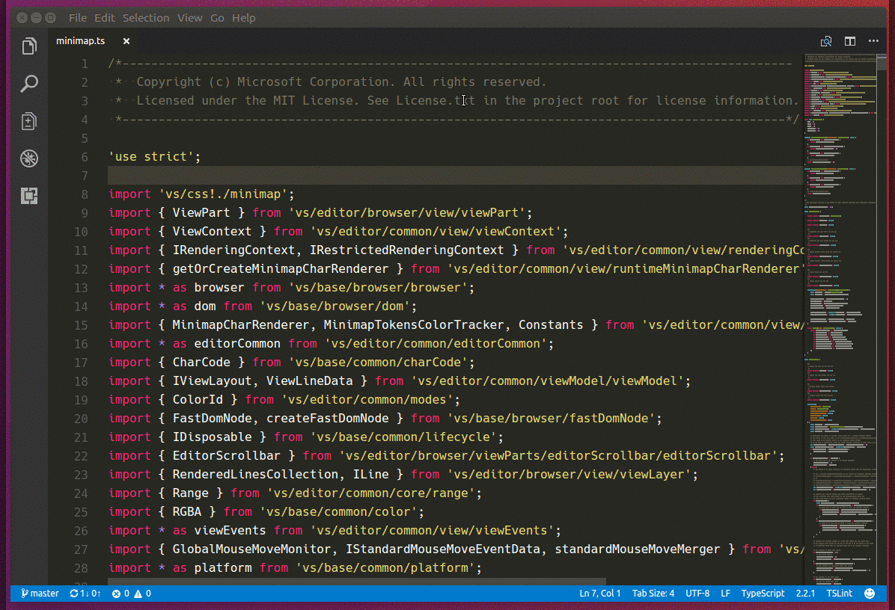

This milestone we have focused on rendering the characters in a fast, incremental way (we reuse as many pixels as possible from the previous frame when rendering a new frame). We plan to add more useful information to the Minimap in the future, for example current selection, find matches, Git diff annotations, etc.

### Preview: Drag and Drop selected text

You can now use the mouse to drag and drop selected text inside the editor. This feature is disabled by default and you can turn it on by set `editor.dragAndDrop` to `true`.

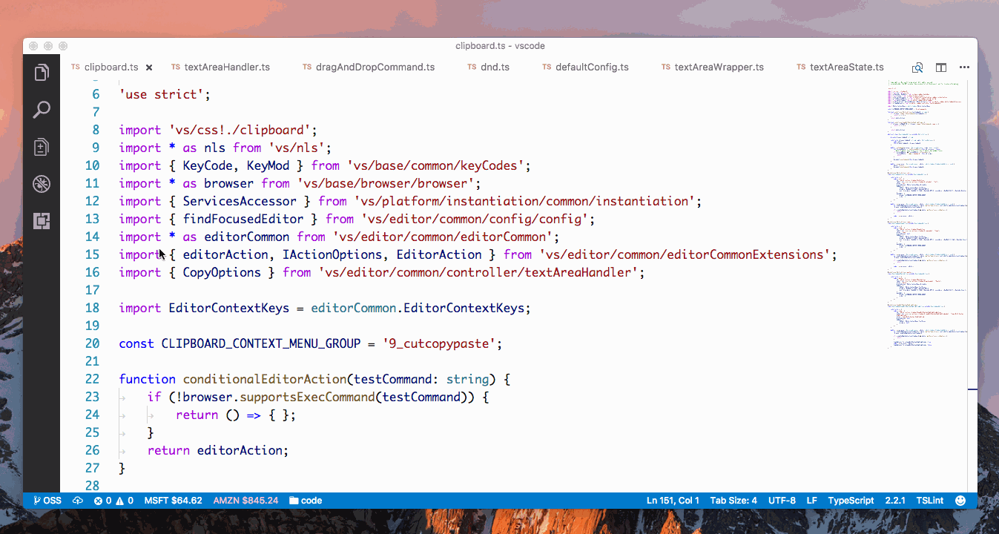

Please note we don't support drag-and-drop across editors or across different applications at the moment.

### Copy with syntax highlighting

You can now copy selected text to the Clipboard with syntax highlighting. It can be very useful when you paste the content into another application, for example, Outlook, and the content pasted into the application still has the correct formatting and colorization.

Technically, we add a new entry for HTML content into the Clipboard so even if the target application doesn't support pasting rich text, the pasting will still work.

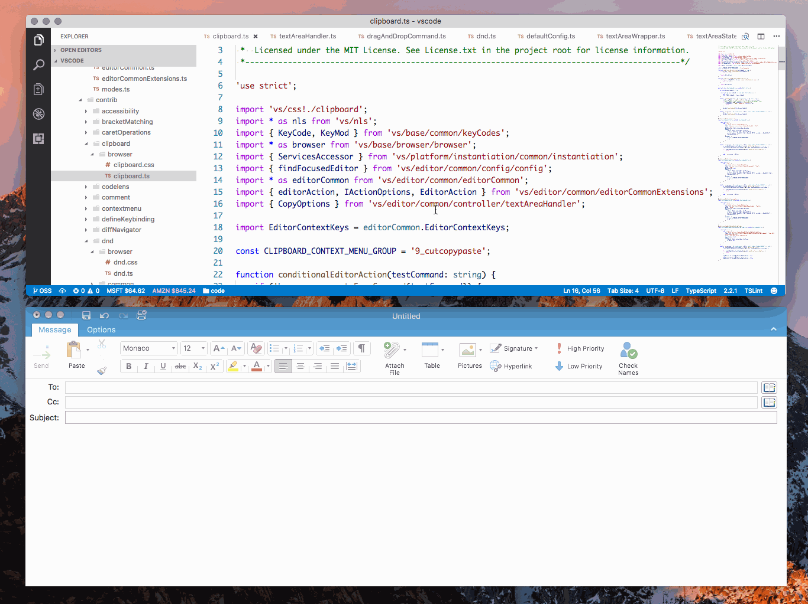

Copying plain text to the Clipboard is easy and straight-forward but copying text with syntax highlighting has to pay the price of rendering based on the Theme you are using, so in order to make sure this feature doesn't slow down VS Code noticeably, we turn it off if you are copying a selection which contains more than 65536 characters.

If Copy and Paste with correct format and colors is your top priority, so you can always manually run the new command `editor.action.clipboardCopyWithSyntaxHighlightingAction` or even bind it to `kbstyle(ctrl/cmd+c)` so you don't need to worry if the selection length reaches the limit.

### Word wrap settings redesign

In VS Code 1.9, we've changed the **Toggle Word Wrap** action to persist to User settings. The change was received with mixed feelings by our community, so for VS Code 1.10 we have rolled back that change and the action will only temporarily affect the current focused editor.

The change also started a healthy discussion around the difficulty of configuring the editor's wrapping behavior. We therefore decided to deprecate `editor.wrappingColumn` (with its -1, 0, >0 cases) in favor of `editor.wordWrap`.

Here are the new word wrap options:

* `editor.wordWrap: "off"` - Lines will never wrap.
* `editor.wordWrap: "on"` - Lines will wrap at viewport width.
* `editor.wordWrap: "wordWrapColumn"` - Lines will wrap at the value of `editor.wordWrapColumn`.
* `editor.wordWrap: "bounded"` - Lines will wrap at the minimum of viewport width and the value of `editor.wordWrapColumn`.

We also changed the default and now VS Code ships with `editor.wordWrap: "off"`.

In this release, we added support for [language specific default settings](#language-specific-editor-settings) and we now turn on word wrap by default for Markdown files.

### Manually trigger save actions

You can now save an editor via `kb(workbench.action.files.save)` even if the file is not dirty and extensions which perform actions on save will be triggered. This allows you to trigger Format on Save even if the file is not dirty.

### New cursor styles

Thanks to [PR #14237](https://github.com/Microsoft/vscode/pull/14237), there are three more cursor styles available: `'line-thin'`, `'underline-thin'` and `'block-outline'`.

## Workbench


### Configurable Explorer key bindings

By popular demand, you can now configure the key bindings for most of the commands in the File Explorer and OPEN EDITORS view.

The following commands could already be assigned prior to version 1.10 in the File Explorer:

* `explorer.newFile` - Create a new file
* `explorer.newFolder`-  Create a new folder

New commands that work in both the File Explorer and OPEN EDITORS view

* `explorer.openToSide` - Open to the side
* `copyFilePath` - Copy path of file/folder
* `revealFileInOS` - Reveal file in OS

New commands that only work in the File Explorer:

* `filesExplorer.copy` - Copy a file from the File Explorer
* `filesExplorer.paste` - Paste a file that was copied from the File Explorer
* `renameFile` - Rename a file/folder in the File Explorer
* `moveFileToTrash` - Move a file/folder to trash from the File Explorer
* `deleteFile` - Bypass trash and delete a file/folder from the File Explorer
* `filesExplorer.findInFolder` - Find inside a folder from the File Explorer

In addition to these commands, the following contexts are introduced for key bindings:

* `filesExplorerFocus` - Keyboard focus is inside the File Explorer
* `openEditorsFocus` - Keyboard focus is inside the OPEN EDITORS view
* `explorerViewletFocus` - Keyboard focus is in either the File Explorer or OPEN EDITORS view

### Configurable tree/list key bindings

We introduced new commands (see below) to make working with trees and lists UI elements in VS Code more configurable for keyboard centric users.

Here is a list of new commands that will work in every tree and list:

|Command|Keyboard shortcut|
|---|---|
|`list.focusUp`|`kbstyle(Up Arrow)` (additionally on macOS: `kbstyle(Ctrl+P)`)|
|`list.focusDown`|`kbstyle(Down Arrow)` (additionally on macOS: `kbstyle(Ctrl+N)`)|
|`list.focusFirst`|`kbstyle(Home)`|
|`list.focusLast`|`kbstyle(End)`|
|`list.focusPageDown`|`kbstyle(PageDown)`|
|`list.focusPageUp`|`kbstyle(PageUp)`|
|`list.collapse`|`kbstyle(Left Arrow)` (additionally on macOS: `kbstyle(Cmd+Up Arrow)`)|
|`list.expand`|`kbstyle(Right Arrow)`|
|`list.clear`|`kbstyle(Escape)`|
|`list.select`|`kbstyle(Enter)` (additionally on macOS: `kbstyle(Cmd+Enter)`)|
|`list.toggleExpand`|`kbstyle(Space)`|

With these new commands, we now consistently support `kbstyle(Ctrl+P)` and `kbstyle(Ctrl+N)` to navigate up and down in trees and lists on macOS.

For example, on macOS to change the command to open from the File Explorer to be `kbstyle(Enter)` (which normally brings you into rename mode), configure:

```json
{
    "key": "enter",
    "command": "list.select",
    "when": "filesExplorerFocus"
}
```

### Configurable window title

We introduced a new setting `window.title` that can be used to change the window title based on the active editor opened.

You can compose the title with the following variables (shown here for `/Users/Development/myProject/myFolder/myFile.txt`):

* `${activeEditorLong}` - /Users/Development/myProject/myFolder/myFile.txt
* `${activeEditorMedium}` - myFolder/myFile.txt
* `${activeEditorShort}` - myFile.txt
* `${rootName}` - myProject
* `${rootPath}` - /Users/Development/myProject
* `${appName}` - Visual Studio Code
* `${dirty}` - a dirty indicator if the active editor is dirty
* `${separator}` - a conditional separator (" - ") that only shows when surrounded by variables with values

The `window.title` has the following defaults:

* Windows/Linux: `${dirty}${activeEditorShort}${separator}${rootName}${separator}${appName}`
* macOS: `${activeEditorShort}${separator}${rootName}`

>**Note:** We no longer support `window.showFullPath` in favor of the `window.title` setting. The variable `${activeEditorLong}` will give you the full path.

### Restore Zen Mode

Per [user request](https://github.com/Microsoft/vscode/issues/19431), we have added a `zenMode.restore` setting to control if a window should restore to Zen Mode if it was exited in Zen Mode.

### Theme configurations in settings

New settings have been added that define the currently active Color and File Icon theme:

```json
{
  // Specifies the color theme used in the workbench.
  "workbench.colorTheme": "Default Dark+",

  // Specifies the icon theme used in the workbench.
  "workbench.iconTheme": null
}
```

By placing the options in the workspace settings, you can now have a different theme per workspace. These used to be stored in a separate location but now they are in your settings files.

To change a theme, you can still use the theme selection dialog in the **Preferences** menu with the **Preferences: Color Theme** and **Preferences: File Icon Theme** commands.

### Links in the terminal

The terminal now creates links for URLs and text that looks like a path. These links will either be opened in a browser or the editor when triggered respectively.

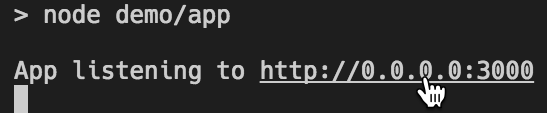

### Run in terminal commands

In previous releases, there was the single command `workbench.action.terminal.runSelectedText` which sent text to the terminal. This would send either the selection if there was one, or the entire file if not. This caused some issues as users would accidentally run entire files when they were expecting to run the current *line* if there was no selection. Running a file would also not work in some shells as the shell would interpret the text in chunks, not as a whole. To improve these scenarios, there are now two commands with distinct behaviors:

- `workbench.action.terminal.runSelectedText`: Sends the selection if there is one to the terminal, otherwise sends the current line.
- `workbench.action.terminal.runActiveFile`: Sends the *file path* of the active file to the terminal (in most shells this will execute the file).

### Display chord key bindings in menus

In previous releases, you might have noticed that a menu entry would not show a keyboard shortcut even though you had a key binding assigned. The reason was that some key bindings (for example multiple key chords) cannot be displayed as keyboard shortcuts in menus (including context menus).

As a workaround, we now show those key bindings as part of the menu label:

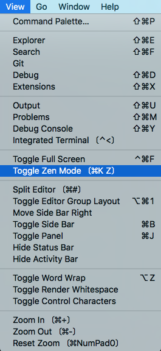

### Search results count

We now show the total number of files and matches for a search in the Search View.

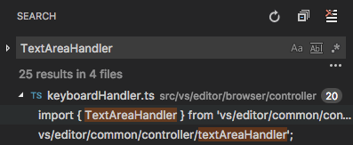

### Improving search speed going forward

We've been looking into how to make our file search even faster. We explored two alternatives: [Silver Searcher](https://github.com/ggreer/the_silver_searcher) and [ripgrep](https://github.com/BurntSushi/ripgrep). If your are interested in our findings, have a look at our [write-up](https://github.com/Microsoft/vscode/issues/19983#issuecomment-282581996). It's a good read.

## Languages

### TypeScript

VS Code now ships with [TypeScript 2.2](https://devblogs.microsoft.com/typescript/announcing-typescript-2-2/). This release includes a number of [new language features](https://github.com/Microsoft/TypeScript/wiki/What's-new-in-TypeScript#typescript-22), bug fixes, and other enhancements.

TypeScript 2.2 also brings support for a number of new quick fixes, including:

* Add missing import
* Add missing property
* Add forgotten this to variable
* Remove unused declaration
* Implement interface or abstract class

### Auto JSDoc comments

VS Code will now provide a [JSDoc](http://jsdoc.app) comment template for JavaScript and TypeScript functions when you type `/**`:

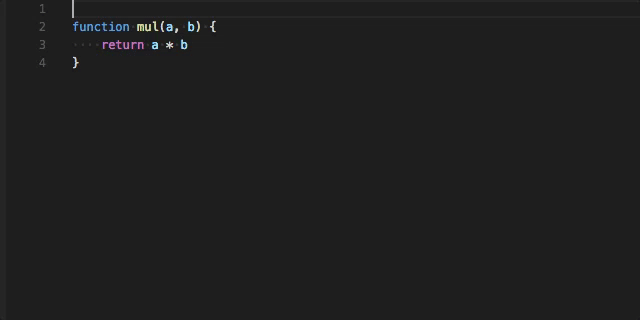

### HTML

Document symbols are now available also for HTML, allowing you to quickly navigate to DOM nodes by id and class name.

Press `kb(workbench.action.gotoSymbol)` to bring up the symbol in file.

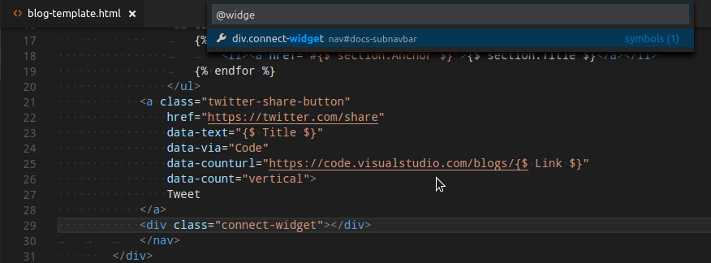

Thanks to [Cody Hoover](https://github.com/hoovercj) for the contribution.

### CSS

The CSS, LESS and SCSS color preview decorators can now be disabled in the settings:

```json
  "css.colorDecorators.enable": true,
  "scss.colorDecorators.enable": true,
  "less.colorDecorators.enable": true
```

### Jade

Jade is now known as [Pug](https://github.com/pugjs/pug/issues/2184). Nothing has changed but the language label. The language id is still `jade` and the `.jade` file extension is still served.

### Vue

While [Vue.js](https://vuejs.org) files may look like HTML files, they are much more than that. For that reason, the `.vue` file extension is no longer associated with HTML by default. However we do recommend you use a Vue.js specific extension for language support and the [vetur](https://marketplace.visualstudio.com/items?itemName=octref.vetur) extension is a good choice.

### Go, Make, YAML, Markdown

These languages are now using the new support for default configuration settings per language (see Default Language specific editor settings below). For Go, Make, and YAML, the default settings configure `kbstyle(Tab)` behavior as defined by these languages. For Markdown, the default enables word wrapping and disables quick suggestions.

### Fragment link navigation for Markdown

Links to Markdown files that include a fragment will now try to open the file at the corresponding header:

```markdown
* [Section](#header)
* [Another file](./other_file.md#header)

# Header
...
```

This allows quickly navigating documentation directly within the VS Code editor.

## Debugging

### Column breakpoints

As per [popular request](https://github.com/Microsoft/vscode/issues/14784), we now support setting breakpoints on an editor column.
This helps debugging code that contains multiple statements on a single line which typically occurs with heavily chained promises or minified source.
A column breakpoint can be set using `kb(editor.debug.action.toggleInlineBreakpoint)` or via the context menu during a debug session.

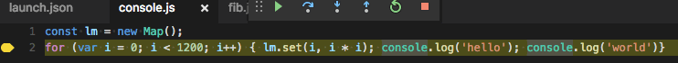

**Note**: A debug extension backend will adjust the location of breakpoints to 'possible' locations. This might cause breakpoints to move when starting a debug session or when setting a column breakpoint while a session is active.

### Improved Exception experience

To improve the visibility of exceptions as they occur during debugging, we now show the exception directly in the editor with a peek UI:

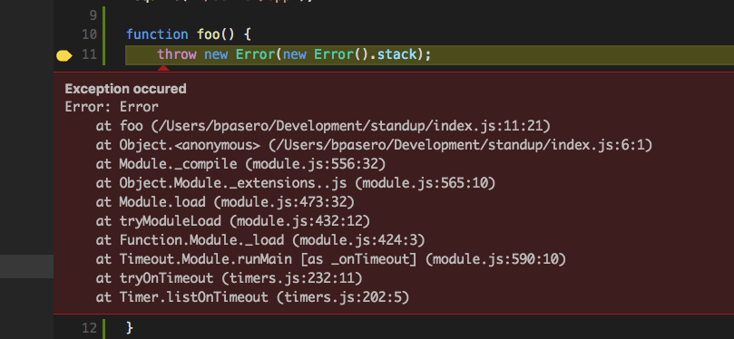

[This issue](https://github.com/OmniSharp/omnisharp-vscode/issues/1007) was raised because sometimes users were not aware that an exception was raised (especially in library code). Another motivation for the introduction of the peek UI was to make it easy to show many more exception details.

### Ability to select and start a launch using keyboard

The option to launch debug configurations using just the keyboard (no mouse gesture necessary) was added, as per [this request](https://github.com/Microsoft/vscode/issues/16613). It works similarly to running tasks, with an ability to launch a debugging session from the **Command Palette**. The keyword `'debug '` or the command **Debug: Select and Start Debugging** from the **Command Palette** is used to select and launch a configuration from `launch.json`.

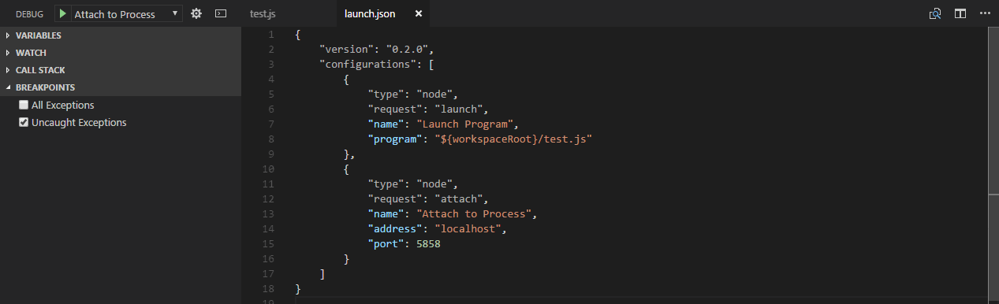

### New variable syntax

Starting with this release, we now support the colon character ':' as a prefix separator in variable names (and we have deprecated the '.'). With this change, the new (and preferred) syntax for 'env', 'command', and 'config' variables becomes `${prefix:id}`.

This makes command variables (where the command ID itself uses '.') much more readable:

```json
"processID": "${command:extension.node-debug.pickProcess}"
```

### Precondition based on debugger type

It is now possible to have a precondition based on the current debug type. Preconditions can be used when defining keyboard shortcuts or when registering new commands as an extension.

Here's an example of a shortcut that will only be enabled while you are debugging with `type` 'node':

```json
{ "key": "f6", "command": "workbench.action.debug.continue", "when": "debugType == 'node'" }
```

### Debug views sizes

We have fine-tuned the default sizes of Debug views. Also once the size is changed by the user, we preserve it across different VS Code sessions.

## Node Debugging

### Node2 transitioning

In this milestone, we've started to fold the two node debuggers ('node' and 'node2') into a single node debugging experience (behind the debug type 'node'). The goal of this is to detect the supported debugging protocol(s) of the targeted Node.js runtime automatically and to select the best debugger implementation based on that protocol. We call the [new protocol](https://developer.chrome.com/devtools/docs/debugger-protocol) 'inspector' and the (now obsolete) v8-debugger protocol 'legacy'.

Starting with this release, we recommend that you only use the 'node' debug type and we've deprecated the 'node2' type ('node2' is still available but its use in launch configurations will be flagged with a deprecation warning).

Since we still want to give you control over what debugger implementation to use, we've introduced a new attribute `protocol` with the following values:

- **`auto`**: tries to automatically detect the protocol used by the targeted runtime. For configurations of request type `launch` and if no `runtimeExecutable` is specified, we try to determine the version by running Node.js from the PATH with an `--version` argument. If the version is >= 6.9, the new 'inspector' protocol is used. For configurations of request type 'attach', we try to connect with the new protocol and if that works, we use the 'inspector' protocol. We only switch to the new inspector protocol for versions >= 6.9 because of problems in earlier versions.
- **`inspector`**: forces the node debugger to use the 'inspector' protocol based implementation (aka 'node2'). This is supported by Node.js versions >= 6.3, but not (yet) by Electron.
- **`legacy`**: forces the node debugger to use the 'legacy' protocol based implementation. This is supported by Node.js versions < v8.0).

In the future `auto` will be the default, however since the transition to the new node debugging experience hasn't been finished yet (and we were not brave enough to enable it by default), we continue to use `legacy` for the time being.

But we would like to encourage you to use `'protocol': 'auto'` in your launch configurations and provide feedback if you experience problems.

## Task support

### Key bindings per task

You can now bind a keyboard shortcut to any task you want.

Simply add a key binding like this:

```json
{
    "key": "ctrl+h",
    "command": "workbench.action.tasks.runTask",
    "args": "tsc"
}
```

This binds `ctrl+h` to the task named `tsc`.

### More work on Terminal Runner

As announced in the previous release, we are working on running tasks in the Integrated Terminal instead of the Output panel. In this release, we added support to compose tasks out of simpler tasks. If, for example, you have a workspace with a client and server folder and both contain a build script, you can now have one task that starts both build scripts in separate terminals.

The `tasks.json` file looks like this:

```json
{
    "version": "2.0.0",
    "tasks": [
        {
            "taskName": "Client Build",
            "command": "gulp",
            "args": ["build"],
            "isShellCommand": true,
            "options": {
                "cwd": "${workspaceRoot}/client"
            }
        },
        {
            "taskName": "Server Build",
            "command": "gulp",
            "args": ["build"],
            "isShellCommand": true,
            "options": {
                "cwd": "${workspaceRoot}/server"
            }
        },
        {
            "taskName": "Build",
            "dependsOn": ["Client Build", "Server Build"]
        }
    ]
}
```

Please note the following things:

- This support is preliminary and subject to change.
- The terminal task runner can now also be enabled by using the `"version": "2.0.0"` property.

### Facilitating automation with `${lineNumber}`

As requested by the [community](https://github.com/Microsoft/vscode/issues/12714), we added a new variable `${lineNumber}` for `tasks.json` and `launch.json`. It resolves to the selected line in the currently opened file. This new variable facilitates automation (e.g. running tests) under cursor selection.

## Extension Authoring

### Contributable SCM providers

We made further progress in February on creating a pluggable Source Control feature set for VS Code. Namely, all Git features were ported over to a [Git extension](https://github.com/Microsoft/vscode/issues/18615).

All VS Code Insiders will get this new interface and we'll use the March milestone to tune and tweak the experience. You can try this out via the `SCM: Enable Preview SCM` command, which will replace the legacy Git functionality with the experimental one (run `SCM: Disable Preview SCM` to undo).

### Modal messages

The `window.showInformationMessage` and similar API calls have been [updated to allow the use of modal message dialogs](https://github.com/Microsoft/vscode/pull/19717).

Here's an example using the `modal` parameter:

```typescript
window.showInformationMessage('Do you want to continue?', { modal: true }, 'Yes', 'No');
```

### Context specific visibility of Command Palette menu items

When registering commands in `package.json`, they will automatically be shown in the **Command Palette** (`kb(workbench.action.showCommands)`). To allow more control over command visibility, we have added the `commandPalette` menu item. It allows you to define a `when` condition to control if a command should be visible in the **Command Palette** or not.

The snippet below makes the 'Hello World' command only visible in the **Command Palette** when something is selected in the editor:

```json
"commands": [{
    "command": "extension.sayHello",
    "title": "Hello World"
}],
"menus": {
    "commandPalette": [{
        "command": "extension.sayHello",
        "when": "editorHasSelection"
    }]
}
```

### Language specific editor settings

In this release, we added support for following language specific editor settings:

```
editor.tabSize
editor.insertSpaces
editor.detectIndentation
editor.trimAutoWhitespace
```

**Default language specific editor settings:** Extension authors can now contribute default language specific editor settings using the newly introduced extension point `configurationDefaults` in `package.json`.

Following example contributes default editor settings for the `markdown` language.

```json
contributes": {
    "configurationDefaults": {
        "[markdown]": {
            "editor.wordWrap": "on",
            "editor.quickSuggestions": false
        }
    }
}
```

### Debug Adapter Protocol

A new optional attribute `clientID` has been added to the `InitializeRequestArguments`. With this addition, a debug adapter can identify the client (frontend). We maintain a list of client IDs [here](https://github.com/Microsoft/vscode-debugadapter-node/wiki/Client-IDs).

For obtaining more information about thrown exceptions, we've introduced a new `ExceptionInfoRequest` and a corresponding type `ExceptionDetails`.


## Miscellaneous

### Official signed repositories for Linux

For Debian-based distributions, we now ship both Stable and Insiders in a signed `apt` repository that is automatically installed when you install the .deb package. This enables automatic updates using the platform's update mechanism.

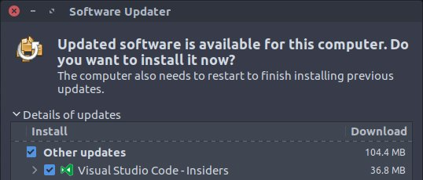

For Red Hat-based distributions, we ship Stable in a signed `yum` repository. You can install the repository by following [these instructions](https://code.visualstudio.com/docs/setup/linux#_installation).

### Monitoring startup performance

Startup performance is important and we continuously try to improve it. Sometimes startup performance gets slower, mostly because of changes with unintended effects or because of changes in our dependencies. To ensure we see this early and to fix performance regressions, we have started to monitor the startup performance of a dedicated machine. We took a slightly outdated and dusty laptop and set it up as a build machine. Its 'build result' involves starting VS Code a couple of times and sending the startup timings to our telemetry stores. We also created a dashboard with visualizations of that data (PowerBI) and a slack bot (Azure Functions) that tells us once a day what the numbers are.

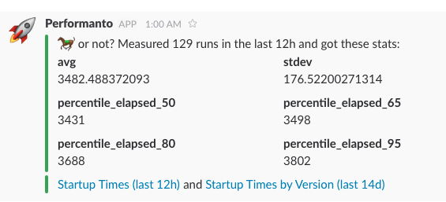

## Notable Changes

* [1426](https://github.com/Microsoft/vscode/issues/1426): macOS: file events are not reported when using workspace path with different casing
* [12000](https://github.com/Microsoft/vscode/issues/12000): Terminals created in the background by the API will not display/retain any output until the terminal panel is initialized
* [15364](https://github.com/Microsoft/vscode/issues/15364): Make tabs smaller when workbench.editor.showTabCloseButton: false
* [16820](https://github.com/Microsoft/vscode/issues/16820): Hot Exit: Opens the same file twice in two separate windows
* [19625](https://github.com/Microsoft/vscode/issues/19625): API doesn't update settings if there are trailing commas in settings.json.
* [19526](https://github.com/Microsoft/vscode/issues/19526): Filter installed extensions.
* [10610](https://github.com/Microsoft/vscode/issues/10610): When I hit a breakpoint VS Code opens a new readonly version of the file, breakpoints not shown in gutter.
* [19840](https://github.com/Microsoft/vscode/issues/19840): IntelliSense freezes at random instances
* [19993](https://github.com/Microsoft/vscode/issues/19993): Search perf regression in 1.9

These are the [closed bugs](https://github.com/Microsoft/vscode/issues?q=is%3Aissue+label%3Abug+milestone%3A%22February+2017%22+is%3Aclosed) and these are the [closed feature requests](https://github.com/Microsoft/vscode/issues?q=is%3Aissue+milestone%3A%22February+2017%22+is%3Aclosed+label%3Afeature-request) for the 1.10 update.

## Known Issues

* [Duplicate errors and warnings](https://github.com/Microsoft/vscode/issues/19627) - This issue may surface more often if the [Preview SCM](#contributable-scm-providers) feature is enabled.

## Contributions to Extensions

Our team maintains or contributes to a number of VS Code extensions. Most notably:

* [Go](https://marketplace.visualstudio.com/items?itemName=ms-vscode.Go)
* [TSLint](https://marketplace.visualstudio.com/items?itemName=eg2.tslint)
* [ESLint](https://marketplace.visualstudio.com/items?itemName=dbaeumer.vscode-eslint)
* [Docker](https://marketplace.visualstudio.com/items?itemName=ms-azuretools.vscode-docker)
* [Debugger for Chrome](https://marketplace.visualstudio.com/items?itemName=msjsdiag.debugger-for-chrome)
* [Mono Debug](https://marketplace.visualstudio.com/items?itemName=ms-vscode.mono-debug)
* [VSCodeVim](https://marketplace.visualstudio.com/items?itemName=vscodevim.vim)

We also continued the work on our [PHP parser](https://github.com/Microsoft/tolerant-php-parser). We designed it to help extension authors provide better tooling support for PHP. To verify our design and to help the PHP community with concrete first steps, we started to adopt the parser in the [PHP language server](https://github.com/felixfbecker/php-language-server).

## Thank You

Last but certainly not least, a big *__Thank You!__* to the following folks that helped to make VS Code even better:

Contributions to `vscode`:

* [Chirag Bhatia (@chirag64)](https://github.com/chirag64)
  *  Fixes #17701 - Integrated Terminal Context Menu is triggered via contextmenu event instead of mousedown [PR #18980](https://github.com/Microsoft/vscode/pull/18980)
  *  Fixes #18999 - Added .npmignore as a known file type [PR #19387](https://github.com/Microsoft/vscode/pull/19387)
  *  Fixes #16424 - Added option to toggle matching brackets highlighter [PR #19978](https://github.com/Microsoft/vscode/pull/19978)
* [Collin Grimm (@collinsnji)](https://github.com/collinsnji):  Fix #20897 [PR #20899](https://github.com/Microsoft/vscode/pull/20899)
* [Dan Silver (@dan-silver)](https://github.com/dan-silver):  Callback parameter for TestEditorService() is optional [PR #20967](https://github.com/Microsoft/vscode/pull/20967)
* [Dustin Campbell (@DustinCampbell)](https://github.com/DustinCampbell):  Update to latest C# TextMate grammar [PR #20831](https://github.com/Microsoft/vscode/pull/20831)
* [Joshua Wester (@elemeht)](https://github.com/elemeht):  Jenkinsfile are groovy too [PR #16339](https://github.com/Microsoft/vscode/pull/16339)
* [Fred Bricon (@fbricon)](https://github.com/fbricon):  Auto-close javadoc [PR #19076](https://github.com/Microsoft/vscode/pull/19076)
* [Gama11 (@Gama11)](https://github.com/Gama11):  Some typo fixes [PR #19928](https://github.com/Microsoft/vscode/pull/19928)
* [Anton Vildyaev (@hun1ahpu)](https://github.com/hun1ahpu)
  *  Fix for issue 12040 [PR #18279](https://github.com/Microsoft/vscode/pull/18279)
* [Ong Heng Le (@initialshl)](https://github.com/initialshl)
  *  Fix explorer selection state when drag ends [PR #19667](https://github.com/Microsoft/vscode/pull/19667)
  *  Display one decimal place for extensions downloads in Millions [PR #18702](https://github.com/Microsoft/vscode/pull/18702)
* [Kai Wood (@kaiwood)](https://github.com/kaiwood)
  *  Include newline when expanding line selection [PR #15564](https://github.com/Microsoft/vscode/pull/15564)
  *  Enable "Find in selection" within single lines [PR #15566](https://github.com/Microsoft/vscode/pull/15566)
* [katainaka (@katainaka0503)](https://github.com/katainaka0503):  Fix colorization of nested list. [PR #19596](https://github.com/Microsoft/vscode/pull/19596)
* [Krzysztof Cieślak (@Krzysztof-Cieslak)](https://github.com/Krzysztof-Cieslak):  Fix #15343 - Add `git commit --amend` [PR #17755](https://github.com/Microsoft/vscode/pull/17755)
* [Matheus Cruz Rocha (@matheusrocha89)](https://github.com/matheusrocha89):  Terminal encoding problem related to issue #14586 [PR #20932](https://github.com/Microsoft/vscode/pull/20932)
* [Marek Lewandowski (@mlewand)](https://github.com/mlewand):  Hotkey for Windows shell context menu [PR #17710](https://github.com/Microsoft/vscode/pull/17710)
* [Marcel Miranda Ackerman (@reaktivo)](https://github.com/reaktivo):  Resizes the tab size when dirty file state changes, fixes #15364 [PR #19976](https://github.com/Microsoft/vscode/pull/19976)
* [Ryan Fitzgerald (@rf-)](https://github.com/rf-):  Remove dependency on window.event in ListView [PR #20966](https://github.com/Microsoft/vscode/pull/20966)
* [Kazuyuki Sato (@satokaz)](https://github.com/satokaz):  markdown-it-named-header custom slugify for non-latin characters [PR #20628](https://github.com/Microsoft/vscode/pull/20628)
* [Alex (@soncodi)](https://github.com/soncodi):  Add syntax highlighting for JS/TS template string interpolation (Monokai built-in theme) [PR #17841](https://github.com/Microsoft/vscode/pull/17841)
* [Hugo Duthil (@Swiiip)](https://github.com/Swiiip):  Add new cursor styles [PR #14237](https://github.com/Microsoft/vscode/pull/14237)
* [Tim Jones (@tgjones)](https://github.com/tgjones):  HLSL syntax highlighting, use HLSL grammar to highlight Cg blocks in ShaderLab files [PR #20129](https://github.com/Microsoft/vscode/pull/20129)
* [Treri Liu (@Treri)](https://github.com/Treri):  git clone nvm with --depth 1, to make clone faster [PR #19967](https://github.com/Microsoft/vscode/pull/19967)
* [@typicode](https://github.com/typicode):  Update ghooks (deprecated) devDependency [PR #19434](https://github.com/Microsoft/vscode/pull/19434)

Contributions to `vscode-eslint`:

* [darkred (@darkred)](https://github.com/darkred): Move the 'Release Notes' from inside 'eslint/README.md' to a separate 'eslint/CHANGELOG.md' [PR #205](https://github.com/Microsoft/vscode-eslint/pull/205)

Contributions to `language-server-protocol`:

* [Anton Kosyakov (@akosyakov)](https://github.com/akosyakov): Remove notion of the next tag of the node implementation [PR #171](https://github.com/Microsoft/language-server-protocol/pull/171)
* [bolinfest (@bolinfest)](https://github.com/bolinfest): Contributions to `vscode-languageserver-node`: Introduce DocumentUri concept [PR #170](https://github.com/Microsoft/language-server-protocol/pull/170)
* [Olivier Thomann (@othomann)](https://github.com/othomann): Fix typos [PR #159](https://github.com/Microsoft/language-server-protocol/pull/159)

Contributions to `vscode-languageserver-node`:

* [Tobias Bieniek (@Turbo87)](https://github.com/Turbo87): Cleanup "installServerIntoExtension" script [PR #150](https://github.com/Microsoft/vscode-languageserver-node/pull/150)
* [David Greisen (@dgreisen)](https://github.com/dgreisen): MessageBuffer.append: length of string in bytes [PR #163](https://github.com/Microsoft/vscode-languageserver-node/pull/163)

Contributions to `vscode-languageserver-node-example`:

* [Leo (@clinyong)](https://github.com/clinyong): fix typo [PR #30](https://github.com/Microsoft/vscode-languageserver-node-example/pull/30)

Contributions to `vscode-html-languageservice`:

* [Cody Hoover (@hoovercj)](https://github.com/hoovercj):  Add findDocumentSymbols [PR #7](https://github.com/Microsoft/vscode-html-languageservice/pull/7)

<!-- In-product release notes styles.  Do not modify without also modifying regex in gulpfile.common.js -->
<a id="scroll-to-top" role="button" aria-label="scroll to top" href="#"><span class="icon"></span></a>
<link rel="stylesheet" type="text/css" href="css/inproduct_releasenotes.css"/>
