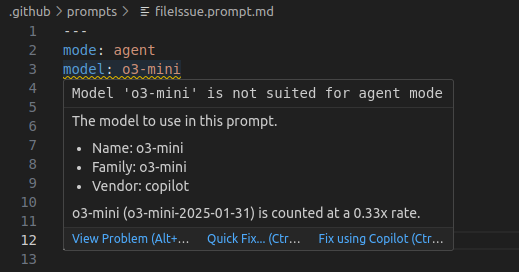
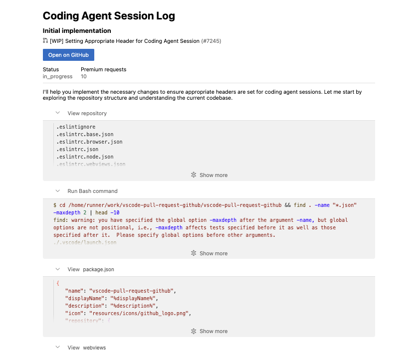

# June 2025 (version 1.102)

_Release date: July 9, 2025_

<!-- DOWNLOAD_LINKS_PLACEHOLDER -->

---

Welcome to the June 2025 release of Visual Studio Code. There are many updates in this version that we hope you'll like, some of the key highlights include:

* **Chat**
  * Explore and contribute to the open sourced GitHub Copilot Chat extension ([Read our blog post](https://code.visualstudio.com/blogs/2025/06/30/openSourceAIEditorFirstMilestone)).
  * Generate custom instructions that reflect your project's conventions ([Show more](#generate-custom-instructions)).
  * Use custom modes to tailor chat for tasks like planning or research ([Show more](#chat-mode-improvements)).
  * Automatically approve selected terminal commands ([Show more](#terminal-auto-approval-experimental)).
  * Edit and resubmit previous chat requests ([Show more](#edit-previous-requests-experimental)).

* **MCP**
  * MCP support is now generally available in VS Code ([Show more](#mcp-support-in-vs-code-is-generally-available)).
  * Easily install and manage MCP servers with the MCP view and gallery ([Show more](#mcp-server-discovery-and-installation)).
  * MCP servers as first-class resources in profiles and Settings Sync ([Show more](#mcp-servers-as-first-class-resources)).

* **Editor experience**
  * Delegate tasks to Copilot coding agent and let it handle them in the background ([Show more](#start-a-coding-agent-session-preview)).
  * Scroll the editor on middle click ([Show more](#scroll-on-middle-click)).

>If you'd like to read these release notes online, go to [Updates](https://code.visualstudio.com/updates) on [code.visualstudio.com](https://code.visualstudio.com).
**Insiders:** Want to try new features as soon as possible? You can download the nightly [Insiders](https://code.visualstudio.com/insiders) build and try the latest updates as soon as they are available.

## Chat

### Copilot Chat is open source

We're excited to announce that we've open sourced the GitHub Copilot Chat extension! The source code is now available at [`microsoft/vscode-copilot-chat`](https://github.com/microsoft/vscode-copilot-chat) under the MIT license.

This marks a significant milestone in our commitment to transparency and community collaboration. By open sourcing the extension, we're enabling the community to:

* **Contribute directly** to the development of AI-powered chat experiences in VS Code
* **Understand the implementation** of chat modes, custom instructions, and AI integrations
* **Build upon our work** to create even better AI developer tools
* **Participate in shaping the future** of AI-assisted coding

You can explore the repository to see how features like [agent mode](https://github.com/microsoft/vscode-copilot-chat/blob/e1222084830244174e6aa64683286561fa7e7607/src/extension/prompts/node/agent/agentPrompt.tsx), [inline chat](https://github.com/microsoft/vscode-copilot-chat/blob/e1222084830244174e6aa64683286561fa7e7607/src/extension/prompts/node/inline/inlineChatEditCodePrompt.tsx), and [MCP integration](https://github.com/microsoft/vscode-copilot-chat/blob/e1222084830244174e6aa64683286561fa7e7607/src/extension/mcp/vscode-node/mcpToolCallingLoop.tsx) are implemented. We welcome contributions, feedback, and collaboration from the community.

To learn more about this milestone and our broader vision for open source AI editor tooling, read our detailed blog post: [Open Source AI Editor - First Milestone](https://code.visualstudio.com/blogs/2025/06/30/openSourceAIEditorFirstMilestone).

### Chat mode improvements

Last milestone, we previewed [custom chat modes](https://code.visualstudio.com/docs/copilot/chat/chat-modes#_custom-chat-modes). In addition to the built-in chat modes 'Ask', 'Edit' and 'Agent', you can define your own chat modes with specific instructions and a set of allowed tools that you want the LLM to follow when replying to a request.

This milestone, we have made several improvements and bug fixes in this area.

#### Configure language model

Upon popular request, you can now also specify which language model should be used for a chat mode. Add the `model` metadata property to your `chatmode.md` file and provide the model identifier (we provide IntelliSense for the model info).


#### Improved editing support

The editor for [chat modes](https://code.visualstudio.com/docs/copilot/chat/chat-modes), [prompts](https://code.visualstudio.com/docs/copilot/copilot-customization#_prompt-files-experimental), and [instruction files](https://code.visualstudio.com/docs/copilot/copilot-customization#_custom-instructions) now supports completions, validation, and hovers for all supported metadata properties.




#### Gear menu in the chat view

The **Configure Chat** action in the Chat view toolbar lets you manage custom modes as well as reusable instructions, prompts, and tool sets:


Selecting **Modes** shows all currently installed custom modes and enables you to open, create new, or delete modes.

#### Import modes, prompts and instructions via a `vscode` link

You can now import chat mode, reusable prompt and instruction files from external links, such as a gist or our [awesome-copilot](https://github.com/github/awesome-copilot) community repository. For example, the following link will import the chat mode file for Burke's GPT 4.1 Beast Mode:

[Add GPT 4.1 Beast Mode to VS Code](vscode:chat-mode/install?url=https://raw.githubusercontent.com/github/awesome-copilot/refs/heads/main/chatmodes/4.1-Beast.chatmode.md)

This will prompt for a destination, either your current workspace or your user settings, and confirm the name before importing the mode file from the URL.

Try it out on the 100+ community-contributed instructions, prompts, and chat modes at [awesome-copilot](https://github.com/github/awesome-copilot).

### Generate custom instructions

Setting up [custom instructions](https://code.visualstudio.com/docs/copilot/copilot-customization) for your project can significantly improve AI suggestions by providing context about your coding standards and project conventions. However, creating effective instructions from scratch might be challenging.

This milestone, we're introducing the **Chat: Generate Instructions** command to help you bootstrap custom instructions for your workspace. Run this command from the Command Palette or the Configure menu in the Chat view, and agent mode will analyze your codebase to generate tailored instructions that reflect your project's structure, technologies, and patterns.

The command creates a `copilot-instructions.md` file in your `.github` folder or suggests improvements to existing instruction files. You can then review and customize the generated instructions to match your team's specific needs.

Learn more about [customizing AI responses with instructions](https://code.visualstudio.com/docs/copilot/copilot-customization).


### Load instruction files on demand

Instruction files can be used to describe coding practices and project requirements. Instructions can be manually or automatically included as context to chat requests.

There are various mechanisms supported, see the [Custom Instructions](https://code.visualstudio.com/docs/copilot/copilot-customization#_custom-instructions) section in our documentation.

For larger instructions that you want to include conditionally, you can use `.instructions.md` files in combination with glob patterns defined in the `applyTo` header. The file is automatically added when the glob pattern matches one or more of the files in the context of the chat.

New in this release, the large language model can load instructions on demand. Each request gets a list of all instruction files, along with glob pattern and description. In this example, the LLM has no instructions for TypeScript files explicitly added in the context. So, it looks for code style rules before creating a TypeScript file:


### Edit previous requests (Experimental)

You can now click on previous requests to modify the text content, attached context, mode, and model. Upon submitting this change, this will remove all subsequent requests, undo any edits made, and send the new request in chat.

There will be a controlled rollout of different entry points to editing requests, which will help us gather feedback on preferential edit and undo flows. However, users can set their preferred mode with the experimental `setting(chat.editRequests)` setting:

* `setting(chat.editRequests.inline)`: Hover a request and select the text to begin an edit inline with the request.
* `setting(chat.editRequests.hover)`: Hover a request to reveal a toolbar with a button to begin an edit inline with the request.
* `setting(chat.editRequests.input)`: Hover a request to reveal a toolbar, which will start edits in the input box at the bottom of chat.

<video src="images/1_102/edit-previous-requests.mp4" title="Video showing the process of editing a previous request in the Chat view." autoplay loop controls muted></video>

### Terminal auto approval (Experimental)

Agent mode now has a mechanism for auto approving commands in the terminal. Here's a demo of it using the defaults:

<video src="images/1_102/terminal-auto-approve.mp4" title="Video showing terminal commands like 'echo' and 'ls' being auto-approved in the Chat view." autoplay loop controls muted></video>

There are currently two settings: the allow list and the deny list. The allow list is a list of command _prefixes_ or regular expressions that when matched allows the command to be run without explicit approval. For example, the following will allow any command starting with `npm run test` to be run, as well as _exactly_ `git status` or `git log`:

```json
"github.copilot.chat.agent.terminal.allowList": {
  "npm run test": true,
  "/^git (status|log)$/": true
}
```

These settings are merged across setting scopes, such that you can have a set of user-approved commands, as well as workspace-specific approved commands.

As for chained commands, we try to detect these cases based on the shell and require all sub-commands to be approved. So `foo && bar` we check that both `foo` and `bar` are allowed, only at that point will it run without approval. We also try to detect inline commands such as `echo $(pwd)`, which would check both `echo $(pwd)` and `pwd`.

The deny list has the same format as the allow list but will override it and force approval. For now this is mostly of use if you have a broad entry in the allow list and want to block certain commands that it may include. For example the following will allow all commands starting with `npm run` except if it starts with `npm run danger`:

```json
"github.copilot.chat.agent.terminal.allowList": {
  "npm run": true
},
"github.copilot.chat.agent.terminal.denyList": {
  "npm run danger": true
}
```

Thanks to the protections that we gain against prompt injection from [workspace trust](https://code.visualstudio.com/docs/editing/workspaces/workspace-trust), the philosophy we've approached when implementing this feature with regards to security is to include a small set of innocuous commands in the allow list, and a set of particularly dangerous ones in the deny list just in case they manage to slip through. The allow list is empty by default as we're still considering what the defaults should be, but here is what we're thinking:

* Allow list: `echo`, `cd`, `ls`, `cat`, `pwd`, `Write-Host`, `Set-Location`, `Get-ChildItem`, `Get-Content`, `Get-Location`
* Deny list: `rm`, `rmdir`, `del`, `kill`, `curl`, `wget`, `eval`, `chmod`, `chown`, `Remove-Item`

The two major parts we want to add to this feature are a UI entry point to more easily add new commands to the list ([#253268](https://github.com/microsoft/vscode/issues/253268)) and an opt-in option to allow an LLM to evaluate the command(s) safety ([#253267](https://github.com/microsoft/vscode/issues/253267)). We are also planning on both removing the `github.copilot.` prefix of these settings ([#253314](https://github.com/microsoft/vscode/issues/253314)) as well as merging them together ([#253472](https://github.com/microsoft/vscode/issues/253472)) in the next release before it becomes a preview setting.

### Terminal command simplification

Agent mode sometimes wants to run commands with a `cd` statement, just in case. We now detect this case when it matches the current working directory and simplify the command that is run.


### Agent awareness of tasks and terminals

Agent mode now understands which background terminals it has created and which tasks are actively running. The agent can read task output by using the new `GetTaskOutput` tool, which helps prevent running duplicate tasks and improves workspace context.


### Maximized chat view

You can now maximize the Secondary Side Bar to span the editor area and hide the Primary Side Bar and panel area. VS Code will remember this state between restarts and will restore the Chat view when you open an editor or view.

<video src="images/1_102/auxmax.mp4" title="Video showing maximizing the Secondary Side Bar." autoplay loop controls muted></video>

You can toggle in and out of the maximized state by using the new icon next to the close button, or use the new command `workbench.action.toggleMaximizedAuxiliaryBar` from the Command Palette.

### Agent mode badge indicator

We now show a badge over the application icon in the dock when the window is not focused and the agent needs user confirmation to continue. The badge will disappear as soon as the related window that triggered it receives focus.


You can enable or disable this badge via the `setting(chat.notifyWindowOnConfirmation)` setting.

### Start chat from the command line

A new subcommand `chat` is added to the VS Code CLI that enables you to start a chat session in the current working directory with the prompt provided.

<video src="images/1_102/chatcli.mp4" title="Video showing the Chat CLI in action to open the Chat view from the command line and run a prompt." autoplay loop controls muted></video>

The basic syntax is `code chat [options] [prompt]` and options can be any of:

* `-m --mode <mode>`: The mode to use for the chat session. Available options: 'ask', 'edit', 'agent', or the identifier of a custom mode. Defaults to 'agent'
* `-a --add-file <path>`: Add files as context to the chat session
* `--maximize`: Maximize the chat session view
* `-r --reuse-window`: Force to use the last active window for the chat session
* `-n --new-window`: Force to open an empty window for the chat session

Reading from stdin is supported, provided you pass in `-` at the end, for example `ps aux | grep code | code chat <prompt> -`

### Fetch tool supports non-HTTP URLs

We've seen that, on occasion, models want to call the Fetch tool with non-HTTP URLs, such as `file://` URLs. Rather than disallowing this, the Fetch tool now supports these URLs and returns the content of the file or resource at the URL. Images are also supported.

### Clearer language model access management

We've reworked the UX around managing extension access to language models provided by extensions. Previously, you saw an item in the Account menu that said **AccountName (GitHub Copilot Chat)**, which had nothing to do with what account GitHub Copilot Chat was using. Rather, it allowed you to manage which extensions had access to the language models provided by Copilot Chat.

To make this clearer, we've removed the **AccountName (GitHub Copilot Chat)** item and replaced it with a new item called **Manage Language Model Access...**. This item opens a Quick Pick that enables you to manage which extensions have access to the language models provided by GitHub Copilot Chat.


We think this is clearer... That said, in a future release we will explore more granular access control for language models (for example, only allowing specific models rather than _all_ models provided by an extension), so stay tuned for that.

### Reading chat requests

Since the chat extension itself is open source, you now get access to one of the debugging tools that we've been using internally for awhile. To easily see the details of all requests made by Copilot Chat, run the command "Show Chat Debug View". This will show a treeview with an entry for each request made. You can see the full prompt that was sent to the model, the tools that were enabled, the response, and other key details. You can save the request log with right click > "Export As...".

The view also has entries for tool calls on their own, and a prompt-tsx debug view that opens in the Simple Browser.

> 🚨 **Note**: This log is very helpful in troubleshooting issues, and we will appreciate if you share it when filing an issue about the agent's behavior. But, this log may contain personal information such as the contents of your files or terminal output. Please review the contents carefully before sharing it with anyone else.

### Edit Tool Improvements

This release includes several changes to the predictability and reliability of the edit tools used for GPT-4 models and Sonnet models. You should see more reliable editing behavior in this release and we will continue to improve these tools in future releases.

## MCP

### MCP support in VS Code is generally available

We've have been working on expanding MCP support in VS Code for the past few months, and [support the full range of MCP features in the specification](https://code.visualstudio.com/blogs/2025/06/12/full-mcp-spec-support). As of this release, MCP support is now generally available in VS Code!

In addition, organizations can now control the availability of MCP servers with a GitHub Copilot policy. Learn more about [Managing policies and features for Copilot in your enterprise](https://docs.github.com/en/enterprise-cloud@latest/copilot/how-tos/administer/enterprises/managing-policies-and-features-for-copilot-in-your-enterprise) in the GitHub Copilot documentation.

You can get started by installing some of the [popular MCP servers from our curated list](https://code.visualstudio.com/mcp). Learn more about [using MCP servers in VS Code](https://code.visualstudio.com/docs/copilot/chat/mcp-servers) and how you can use them to extend agent mode.


If you want to build your own MCP server, check our [MCP developer guide](https://code.visualstudio.com/api/extension-guides/ai/mcp) for more details about how to take advantage of the MCP capabilities in VS Code.

### Support for elicitations

The latest MCP specification added support for [Elicitations](https://modelcontextprotocol.io/specification/2025-06-18/client/elicitation) as a way for MCP servers to request input from MCP clients. The latest version of VS Code adopts this specification and includes support for elicitations.

<video src="images/1_102/mcp-server-elicit.mp4" autoplay loop controls muted></video>

### MCP server discovery and installation

The new **MCP Servers** section in the Extensions view includes welcome content that links directly to the [popular MCP servers from our curated list](https://code.visualstudio.com/mcp). Visit the website to explore available MCP servers and select **Install** on any MCP server. This automatically launches VS Code and opens the MCP server editor that displays the server's readme and manifest information. You can review the server details and select **Install** to add the server to your VS Code instance.

Once installed, MCP servers automatically appear in your Extensions view under the **MCP SERVERS - INSTALLED** section, and their tools become available in the Chat view's tools Quick Pick. This makes it easy to verify that your MCP server is working correctly and access its capabilities immediately.

<video src="images/1_102/mcp-servers-discovery-install.mp4" title="Video showing installing an MCP server from the MCP page on the VS Code website." autoplay loop controls muted></video>

### MCP server management view

The new **MCP SERVERS - INSTALLED** view in the Extensions view makes it easy to monitor, configure, and control your installed MCP servers.


The view lists the installed MCP servers and provides several management actions through the context menu:


* **Start Server** / **Stop Server** / **Restart Server**: Control the server's running state
* **Disconnect Account**: Remove account access from the server
* **Show Output**: View the server's output logs for troubleshooting
* **Show Configuration**: Open the server's runtime configuration
* **Configure Model Access**: Manage which language models the server can access
* **Show Sampling Requests**: View sampling requests for debugging
* **Browse Resources**: Explore resources provided by the server
* **Uninstall**: Remove the server from your VS Code instance

When you select an installed MCP server, VS Code opens the MCP server editor displaying the server's readme details, manifest, and its runtime configuration. This provides an overview of the server's capabilities and current settings, making it easy to understand what the server does and how it's configured.


The **MCP SERVERS - INSTALLED** view also provides a **Browse MCP Servers...** action that takes you directly to the community website, making server discovery always accessible from within VS Code.


### MCP servers as first class resources

MCP servers are now treated as first-class resources in VS Code, similar to user tasks and other profile-specific configurations. This represents a significant architectural improvement from the previous approach where MCP servers were stored in user settings. This change makes MCP server management more robust and provides better separation of concerns between your general VS Code settings and your MCP server configurations. When you install or configure MCP servers, they're automatically stored in the appropriate [profile](https://code.visualstudio.com/docs/configure/profiles)-specific location to ensure that your main settings file stays clean and focused.

* **Dedicated storage**: MCP servers are now stored in a dedicated `mcp.json` file within each profile, rather than cluttering your user settings file
* **Profile-specific**: Each VS Code profile maintains its own set of MCP servers, enabling you to have different server configurations for different workflows or projects
* **Settings Sync integration**: MCP servers sync seamlessly across your devices through [Settings Sync](https://code.visualstudio.com/docs/configure/settings-sync), with granular control over what gets synchronized

#### MCP migration support

With MCP servers being first-class resources and the associated change to their configuration, VS Code provides comprehensive migration support for users upgrading from the previous MCP server configuration format:

* **Automatic detection**: Existing MCP servers in `settings.json` are automatically detected and migrated to the new profile-specific `mcp.json` format
* **Real-time migration**: When you add MCP servers to user settings, VS Code immediately migrates them with a helpful notification explaining the change
* **Cross-platform support**: Migration works seamlessly across all development scenarios including local, remote, WSL, and Codespaces environments

This migration ensures that your existing MCP server configurations continue to work without any manual intervention while providing the enhanced management capabilities of the new architecture.

#### Dev Container support for MCP configuration

The Dev Container configuration `devcontainer.json` and the Dev Container Feature configuration `devcontainer-feature.json` support MCP server configurations at the path `customizations.vscode.mcp`. When a Dev Container is created the collected MCP server configurations are written to the remote MCP configuration file `mcp.json`.

Sample `devcontainer.json` configuring the Playwright MCP server:
```json
{
	"image": "mcr.microsoft.com/devcontainers/typescript-node:latest",

	"customizations": {
		"vscode": {
			"mcp": {
				"servers": {
					"playwright": {
						"command": "npx",
						"args": [
							"@playwright/mcp@latest"
						]
					}
				}
			}
		}
	}
}
```

#### Commands to access MCP resources

To make working with MCP servers more accessible, we've added commands to help you manage and access your MCP configuration files:

* **MCP: Open User Configuration** - Direct access to your user-level `mcp.json` file
* **MCP: Open Remote User Configuration** - Direct access to your remote user-level `mcp.json` file

These commands provide quick access to your MCP configuration files, making it easy to view and manage your server configurations directly.

### Quick management of MCP authentication

You are now able to sign out or disconnect accounts from the MCP gear menu and quick picks.

* MCP view gear menu:
    

* MCP editor gear menu:
    

* MCP quick pick:
    

The **Disconnect** action is shown when the account is used by either other MCP servers or extensions, while **Sign Out** is shown when the account is only used by the MCP server. The sign out action completely removes the account from VS Code, while disconnect only removes access to the account from the MCP server.

## Accessibility

### Keep all edits from within the editor

Formerly, to accept all edits, focus would need to be in the Chat view. Now, with focus in the editor, you can run the command **Keep All Edits** (`kb(chatEditor.action.acceptAllEdits)`).

### User action required sound

We’ve fine-tuned the accessibility signal to indicate when chat requires user action and set the default value to `auto`, so screen reader users will hear this signal. You can configure this behavior with the `setting(accessibility.signals.chatUserActionRequired)` setting.

### Alert when rendering errors occur in chat

Previously, screen reader users were not alerted when a chat rendering error occurred . Users are now alerted with this information and can also focus it via keyboard.

## Code Editing

### Scroll on middle click

**Setting**: `setting(editor.scrollOnMiddleClick:true)`

Scroll the editor by simply clicking, or holding down your middle mouse button (the scroll wheel) and moving around.

Once activated, the cursor changes to a panning icon and moving the mouse up or down then smoothly scrolls the editor in that direction. The scrolling speed is determined by how far you move the mouse from the initial click point. Release the middle mouse button or click it again to stop scrolling and return to the standard cursor.

<video src="images/1_102/middle-scroll.mp4" title="Screenrecording of the editor scrolling when the middle mouse button is clicked." autoplay loop controls muted></video>

**Known Conflicts**

Enabling this feature might interfere with other actions tied to the middle mouse button. For example, if you have column selection (`setting(editor.columnSelection)`) enabled, holding down the middle mouse button selects text. Similarly, on Linux, selection clipboard (`setting(editor.selectionClipboard)`) pastes content from your clipboard when the middle mouse button is clicked.

To avoid these conflicts, please enable only one of these settings at a time.

### Snooze code completions

You can now temporarily pause inline suggestions and next edit suggestions (NES) by using the new **Snooze** feature. This is helpful when you want to focus without distraction from suggestions.

To snooze suggestions, select the Copilot dashboard in the Status Bar, or run the **Snooze Inline Suggestions** command from the Command Palette and select a duration from the dropdown menu. During the snooze period, no inline suggestions or NES will appear.


You can also assign a custom keybinding to quickly snooze suggestions for a specific duration by passing the desired duration as an argument to the command. For example:

```json
{
  "key": "...",
  "command": "editor.action.inlineSuggest.snooze",
  "args": 10
}
```

## Editor Experience

### Windows accent color

**Setting**: `setting(window.border)`

VS Code on Windows now supports using the accent color as the window frame border if that is enabled in Windows settings ("Show accent color on title bars and window borders").


The new `setting(window.border)` setting enables you to control the color of the window border. Use `default` to use the Windows accent color, `off` to disable the border, or provide a specific color value to use a custom color.

**Note**: the border is only visible when the related Windows setting is enabled. It can not yet be set per workspace, but we are working on that support.

### Settings search suggestions (Preview)

**Setting**: `setting(workbench.settings.showAISearchToggle:true)`

This milestone, we modified the sparkle toggle in the Settings editor, so that it acts as a toggle between the AI and non-AI search results. The AI settings search results are semantically similar results instead of results that are based on string matching. For example, `editor.fontSize` appears as an AI settings search result when you search for "increase text size".

The toggle is enabled only when there are AI results available. We welcome feedback on when the AI settings search did not find an expected setting, and we plan to enable the setting by default over the next iteration.

<video src="images/1_102/settings-search-toggle-stable.mp4" title="Switching between AI and non-AI results using the AI results toggle in the Settings editor" autoplay loop controls muted></video>

## Tasks

### Rerun all running tasks

You can now quickly rerun all currently running tasks with the new `Tasks: Rerun All Running Tasks command`. This is useful for workflows that involve multiple concurrent tasks, allowing you to restart them all at once without stopping and rerunning each individually.

### Restart task reloads updated tasks.json

The **Restart Task** command now reloads your `tasks.json` before restarting, ensuring that any recent changes are respected. Previously, task configuration changes were not picked up when restarting a task, which could lead to confusion or outdated task behavior.

## Terminal

### Terminal Suggest (Preview)

We've made significant improvements to the terminal suggest feature.

#### Selection mode

A new setting, `terminal.integrated.suggest.selectionMode`, helps you understand that by default, `kbStyle(Tab)` (not `kbStyle(Enter)`) accepts suggestions. You can choose between `partial`, `always`, and `never` modes to control how suggestions are selected and accepted.

The default value is `partial`, which means that `kbStyle(Tab)` accepts the suggestion until navigation has occurred.


#### Learn more

The **Learn More** action `(kb(workbench.action.terminal.suggestLearnMore))` in the terminal suggest control's status bar is now highlighted for the first 10 times or if the control is shown for 10 seconds. This helps you discover how to configure, disable, and read about the suggest control.


#### Multi-command support

Terminal suggest now supports multi-command lines. You can link commands with `;`, `&&`, and other shell operators, and receive suggestions for all commands on the line.


#### Symlink information

We now display a symlink's realpath in the suggest details control and have unique icons for symlink files and folders to help distinguish them from other suggestions.


#### Improved sorting

We've improved sorting in many ways to give you the most relevant suggestions first. For example, giving `main` and `master` priority over other branches.


#### Git bash improvements

We now properly support Git Bash path completions for folders and files. Additionally, we source the built-in commands and present them as suggestions.


## Contributions to extensions

### GitHub Pull Requests

There has been more progress on the [GitHub Pull Requests](https://marketplace.visualstudio.com/items?itemName=GitHub.vscode-pull-request-github) extension, which enables you to work on, create, and manage pull requests and issues.

Deeper integration has been made between the [GitHub Pull Requests](https://marketplace.visualstudio.com/items?itemName=GitHub.vscode-pull-request-github) extension and the [Copilot coding agent](https://docs.github.com/en/copilot/how-tos/agents/copilot-coding-agent), allowing you to begin, view, and manage coding agent sessions directly from VS Code.

These features require your workspace is open to a repository that has [the Copilot coding agent enabled](https://docs.github.com/en/copilot/how-tos/agents/copilot-coding-agent/enabling-copilot-coding-agent).

Review the [changelog for the 0.114.0](https://github.com/microsoft/vscode-pull-request-github/blob/main/CHANGELOG.md#01140) release of the extension to learn about everything in the release.

#### Status tracking

We have made improvements to notify and prominently display the status of coding agent pull requests in the **Copilot on my behalf** query. A numeric badge now indicates new coding agent changes.


#### Session log

You can now view the session log of a coding agent session directly in VS Code. This enables you to see the history of actions taken by the coding agent, including code changes and tool usage.



#### Enhancements on `#activePullRequest` tool

The `#activePullRequest` tool returns information about the pull request, such as its title, description, and status for use in chat, and now you can also use it to get the coding agent session information.

This tool is automatically attached to chat when opening a pull request created through the coding agent experience, so you can maintain the context and keep working on the pull request if needed to.

#### Start a coding agent session (Preview)

Delegate the remainder of a local change to coding agent by invoking the `#copilotCodingAgent` tool in chat.

This tool automatically pushes pending changes to a remote branch and initiates a coding agent session from that branch along with the user's instruction.


**Experimental:** Deeper UI integration can be enabled with the `setting(githubPullRequests.codingAgent.uiIntegration)` setting.  Once enabled, a new **Delegate to coding agent** button appears in the Chat view for repositories that have the coding agent enabled.

### Python

#### Python Environments extension improvements

The [Python Environments extension](https://marketplace.visualstudio.com/items?itemName=ms-python.vscode-python-envs) received several improvements this release:

* We've polished terminal activation support for Poetry versions greater than 2.0.0
* You can now use the Quick Create environment creation option to set up multiple virtual environments which are uniquely named within the same workspace
* The generated `.venv` folders are now git-ignored by default
* We've improved the environment deletion process

#### Python Environments included as part of the Python extension

We're starting to roll-out the [Python Environments extension](https://marketplace.visualstudio.com/items?itemName=ms-python.vscode-python-envs) as an optional dependency with the Python extension. What this means is that you might now begin to see the Python Environments extension automatically installed alongside the Python extension, similar to the Python Debugger and Pylance extensions. This controlled roll-out allows us to gather early feedback and ensure reliability before general availability.

The Python Environments extension includes all the core capabilities we've introduced so far including: [one-click environment setup using Quick Create](https://devblogs.microsoft.com/python/python-in-visual-studio-code-may-2025-release/#python-environments-quick-create-command), automatic terminal activation (via "python-envs.terminal.autoActivationType" setting), and all supported [UI for environment and package management](https://devblogs.microsoft.com/python/python-in-visual-studio-code-december-2024-release/).

To use the Python Environments extension during the roll-out, make sure the extension is installed and add the following to your VS Code settings.json file:

```json
"python.useEnvironmentsExtension": true
```

#### Disabled PyREPL for Python 3.13

We have disabled PyREPL for Python 3.13 and above to address indentation and cursor issues in the interactive terminal. For more details, see [Disable PyREPL for >= 3.13](https://github.com/microsoft/vscode-python/issues/25164).

#### Pylance MCP tools (Experimental)

The [Pylance extension](https://marketplace.visualstudio.com/items?itemName=ms-python.vscode-pylance) now includes several experimental MCP tools, which offer access to Pylance's documentation, import analysis, environment management, and more. These tools are currently available in the Pylance prerelease version and are still early in development. While they offer new capabilities, we know it can be challenging to call them directly today. We are actively working to make these tools easier to use and more valuable in future updates. Your feedback in the [pylance-release](https://github.com/microsoft/pylance-release/) repository is welcome as we continue to improve the experience.

### GitHub authentication

#### Revamped GitHub sign-in flow

This iteration, we have revamped the GitHub sign-in flow by defaulting to a loopback URL flow, rather than a flow that uses a `vscode://` protocol URL. This change is to improve the reliability of the sign-in flow and to ensure that it works across all platforms, including those that do not support custom URL schemes.

When you sign in with GitHub, you are now redirected to a loopback URL that looks like `http://localhost:PORT/`. This allows the sign-in flow to complete successfully without relying on custom URL schemes. That said, once you land on the loopback URL, you are still redirected to a `vscode://` URL to return to VS Code, however this doesn't need to resolve for the sign-in flow to complete successfully.

In other words, we get the best of both worlds: a reliable sign-in flow that works across all platforms and a return to VS Code that uses the `vscode://` URL scheme.

While we were at it, we also gave this [landing page a fresh coat of paint](#revamped-github-sign-in-flow). In future iterations, we'll apply this new design to other sign-in experiences.


## Extension Authoring

### Allow opening files when using `vscode.openFolder` command

Extensions that call the `vscode.openFolder` command can now pass `filesToOpen?: UriComponents[]` as options to select files to open in the workspace window that opens.

Example:

```ts
vscode.commands.executeCommand('vscode.openFolder', <folder uri>, { filesToOpen: [ /* files to open */]});
```

## Proposed APIs


## Engineering

### CSS minification using `esbuild`

VS Code has been using `esbuild` for bundling and minifying the JavaScript sources for a long time. We now also use `esbuild` to bundle and minify our CSS files.

### Strict layer checks using `tsconfig.json`

We now use multiple `tsconfig.json` files to ensure our source code adheres to our [target environment rules](https://github.com/microsoft/vscode/wiki/Source-Code-Organization#target-environments). Our CI runs `npm run valid-layers-check` and will fail the build if for example a type was added into a `browser` layer that only exists in the `node` runtime.

### `vscode-bisect` for sanity testing

The [`vscode-bisect`](https://github.com/Microsoft/vscode-bisect) project has been around for a long time allowing to find regressions in VS Code builds (what `git bisect` does for `git`). We added a new `--sanity` option that allows us to quickly go through our [sanity check](https://github.com/microsoft/vscode/wiki/Sanity-Check) that is mandatory before we release a new build.

## Notable fixes

* [vscode-copilot-release#6073](https://github.com/microsoft/vscode-copilot-release/issues/6073) - Agent should not suggest `&&` in Windows PowerShell

## Thank you

Last but certainly not least, a big _**Thank You**_ to the contributors of VS Code.

### Issue tracking

Contributions to our issue tracking:

* [@albertosantini (Alberto Santini)](https://github.com/albertosantini)
* [@gjsjohnmurray (John Murray)](https://github.com/gjsjohnmurray)
* [@RedCMD (RedCMD)](https://github.com/RedCMD)
* [@IllusionMH (Andrii Dieiev)](https://github.com/IllusionMH)
* [@tamuratak (Takashi Tamura)](https://github.com/tamuratak)

### Pull requests

Contributions to `vscode`:

* [@a-stewart (Anthony Stewart)](https://github.com/a-stewart): Fix typing in asyncDataTree.test.ts [PR #209394](https://github.com/microsoft/vscode/pull/209394)
* [@charles7668 (charles)](https://github.com/charles7668): Fix #215925 [PR #219321](https://github.com/microsoft/vscode/pull/219321)
* [@chengluyu (Luyu Cheng)](https://github.com/chengluyu): Apply `font-variation-settings` to the suggestion widget (fix #199954) [PR #200000](https://github.com/microsoft/vscode/pull/200000)
* [@DrSergei](https://github.com/DrSergei): Improve debug adapter capabilities checking [PR #250779](https://github.com/microsoft/vscode/pull/250779)
* [@emmanuel-ferdman (Emmanuel Ferdman)](https://github.com/emmanuel-ferdman): Fix launch.json reference [PR #250187](https://github.com/microsoft/vscode/pull/250187)
* [@Enzo-Nunes (Enzo Nunes)](https://github.com/Enzo-Nunes): Fix line comment action for makefiles (Fixes #234464) [PR #243283](https://github.com/microsoft/vscode/pull/243283)
* [@Gallaecio (Adrián Chaves)](https://github.com/Gallaecio): Fix typo (an language model call → a language model call) [PR #252202](https://github.com/microsoft/vscode/pull/252202)
* [@ghLcd9dG (Liu)](https://github.com/ghLcd9dG): Update copyFiles.ts [PR #250773](https://github.com/microsoft/vscode/pull/250773)
* [@heoh (HeoHeo)](https://github.com/heoh): Fix markdown preview scroll crawls at EOF (fix #249278) [PR #251228](https://github.com/microsoft/vscode/pull/251228)
* [@hyrious (hyrious)](https://github.com/hyrious): fix: missing translations of remote built-in extensions [PR #249430](https://github.com/microsoft/vscode/pull/249430)
* [@jeanp413 (Jean Pierre)](https://github.com/jeanp413)
  * Do not check for navigator to detect web environment in built-in extensions [PR #251688](https://github.com/microsoft/vscode/pull/251688)
  * Fix "Assertion Failed: Argument is undefined or null" when renaming custom editor [PR #252071](https://github.com/microsoft/vscode/pull/252071)
* [@JJJJJJ-git](https://github.com/JJJJJJ-git): Fixing ChatService undo bug [PR #253478](https://github.com/microsoft/vscode/pull/253478)
* [@liuxingbaoyu](https://github.com/liuxingbaoyu): fix: PowerShell not working with username having Unicode [PR #251534](https://github.com/microsoft/vscode/pull/251534)
* [@matthew-godin](https://github.com/matthew-godin): fix patternIndices typo [PR #250085](https://github.com/microsoft/vscode/pull/250085)
* [@mohiuddin-khan-shiam (S. M. Mohiuddin Khan Shiam)](https://github.com/mohiuddin-khan-shiam): Fix incorrect SHA-1 commit regex in [version_manager.rs](cci:7://file:///d:/Github/vscode/cli/src/desktop/version_manager.rs:0:0-0:0) [PR #251329](https://github.com/microsoft/vscode/pull/251329)
* [@notoriousmango (Seong Min Park)](https://github.com/notoriousmango)
  * feat: add font ligatures to webview theme [PR #250998](https://github.com/microsoft/vscode/pull/250998)
  * feat: add rerun and debug actions for failed tests from last run [PR #251679](https://github.com/microsoft/vscode/pull/251679)
* [@raffaeu (Raffaele Garofalo)](https://github.com/raffaeu): Refactoring editor sticky scroll [PR #248131](https://github.com/microsoft/vscode/pull/248131)
* [@RedCMD (RedCMD)](https://github.com/RedCMD)
  * Disable `installation folder` banner warning when debugging extensions [PR #244305](https://github.com/microsoft/vscode/pull/244305)
  * TypeScript restrict Comment onEnterRules inside comment body [PR #251692](https://github.com/microsoft/vscode/pull/251692)
* [@ssigwart (Stephen Sigwart)](https://github.com/ssigwart): Update indentation for PHP, JS, and TS [PR #251465](https://github.com/microsoft/vscode/pull/251465)
* [@Sublimeful (Jian Qiang Wu)](https://github.com/Sublimeful): Implements Terminal: Run Recent Command when there are no terminals [PR #250799](https://github.com/microsoft/vscode/pull/250799)
* [@tmm1 (Aman Karmani)](https://github.com/tmm1): [engineering] remove dead references to Swc transpile [PR #252375](https://github.com/microsoft/vscode/pull/252375)
* [@UziTech (Tony Brix)](https://github.com/UziTech): feat: add middle mouse button scrolling [PR #245882](https://github.com/microsoft/vscode/pull/245882)
* [@yiliang114 (易良)](https://github.com/yiliang114): Fix #250737,  Match count result overflow in Notebook findWidget [PR #250738](https://github.com/microsoft/vscode/pull/250738)

Contributions to `vscode-copilot-chat`:

* [@caohy1988 (Hai-Yuan Cao)](https://github.com/caohy1988): update the summary prompt for agent mode [PR #13](https://github.com/microsoft/vscode-copilot-chat/pull/13)
* [@CharlesCNorton](https://github.com/CharlesCNorton): Update README.md [PR #54](https://github.com/microsoft/vscode-copilot-chat/pull/54)
* [@gmacario (Gianpaolo Macario)](https://github.com/gmacario): docs(CONTRIBUTING): sync Table of Contents [PR #79](https://github.com/microsoft/vscode-copilot-chat/pull/79)
* [@moonboxing (ASSEMAR MOHAMED)](https://github.com/moonboxing): update devcontainer-lock after pylint removal [PR #76](https://github.com/microsoft/vscode-copilot-chat/pull/76)

Contributions to `vscode-json-languageservice`:

* [@aedenmurray (Aeden Murray)](https://github.com/aedenmurray): feat: Notify Invalid RegExp Patterns [PR #261](https://github.com/microsoft/vscode-json-languageservice/pull/261)

Contributions to `vscode-pull-request-github`:

* [@dyhagho (Dyhagho Briceño)](https://github.com/dyhagho): fix: Allow Github.com auth when `github-enterprise.uri` is set [PR #7002](https://github.com/microsoft/vscode-pull-request-github/pull/7002)

Contributions to `vscode-ripgrep`:

* [@benz0li (Olivier Benz)](https://github.com/benz0li): Add linux riscv64 target [PR #73](https://github.com/microsoft/vscode-ripgrep/pull/73)
* [@Vector341](https://github.com/Vector341): Fix invalid download crash install [PR #66](https://github.com/microsoft/vscode-ripgrep/pull/66)

Contributions to `vscode-test`:

* [@coliff (Christian Oliff)](https://github.com/coliff): Update .npmignore [PR #312](https://github.com/microsoft/vscode-test/pull/312)

Contributions to `language-server-protocol`:

* [@billybonks (Sebastien Stettler)](https://github.com/billybonks): fix: improve readability of comment, [PR #2155](https://github.com/microsoft/language-server-protocol/pull/2155)
* [@rcjsuen (Remy Suen)](https://github.com/rcjsuen): Add the Docker Language Server to the list [PR #2153](https://github.com/microsoft/language-server-protocol/pull/2153)
* [@yangdanny97 (Danny Yang)](https://github.com/yangdanny97): Add Pyrefly to language servers list  [PR #2160](https://github.com/microsoft/language-server-protocol/pull/2160)

Contributions to `monaco-editor`:

* [@Ho1yShif (Shifra Williams)](https://github.com/Ho1yShif): Add snowflake sql keywords [PR #4915](https://github.com/microsoft/monaco-editor/pull/4915)

Contributions to `ripgrep-prebuilt`:

* [@kxxt (Levi Zim)](https://github.com/kxxt)
  * Build binaries for riscv64 [PR #41](https://github.com/microsoft/ripgrep-prebuilt/pull/41)
  * Publish binary for riscv64 linux [PR #51](https://github.com/microsoft/ripgrep-prebuilt/pull/51)

<a id="scroll-to-top" role="button" title="Scroll to top" aria-label="scroll to top" href="#"><span class="icon"></span></a>
<link rel="stylesheet" type="text/css" href="css/inproduct_releasenotes.css"/>
