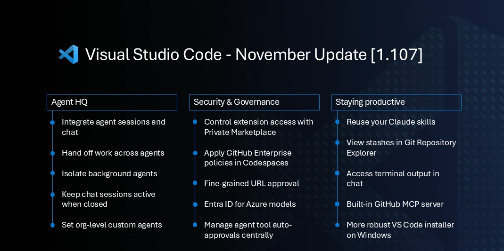

# November 2025 (version 1.107)

_Release date: December 10, 2025_

<!-- DOWNLOAD_LINKS_PLACEHOLDER -->

---

Welcome to the November 2025 release of Visual Studio Code.



This release brings significant updates across these key areas:

* **Agent HQ** removes the boundaries between local, background, and cloud agents, seamlessly delegating tasks to the best-suited agent.
* **Security and Governance** let you keep agents in check and stay in control with enterprise policies
* **Stay productive** by giving you the information and tools you need, with the least friction

Happy Coding!

<br>

>If you'd like to read these release notes online, go to [Updates](https://code.visualstudio.com/updates) on [code.visualstudio.com](https://code.visualstudio.com).<br>

> **Insiders: Want to try new features as soon as possible?**<br>
> You can download the nightly Insiders build and try the latest updates as soon as they are available.<br>
> [Download Insiders](https://code.visualstudio.com/insiders)<br>

---

<!-- TOC
<div class="toc-nav-layout">
  <nav id="toc-nav">
    <div>In this update</div>
    <ul>
      <li><a href="#agents">Agents</a></li>
      <li><a href="#chat">Chat</a></li>
      <li><a href="#mcp">MCP</a></li>
      <li><a href="#accessibility">Accessibility</a></li>
      <li><a href="#editor-experience">Editor Experience</a></li>
      <li><a href="#code-editing">Code Editing</a></li>
      <li><a href="#source-control">Source Control</a></li>
      <li><a href="#debugging">Debugging</a></li>
      <li><a href="#terminal">Terminal</a></li>
      <li><a href="#authentication">Authentication</a></li>
      <li><a href="#languages">Languages</a></li>
      <li><a href="#remote-development">Remote Development</a></li>
      <li><a href="#enterprise">Enterprise</a></li>
      <li><a href="#contributions-to-extensions">Contributions to extensions</a></li>
      <li><a href="#proposed-apis">Proposed APIs</a></li>
      <li><a href="#engineering">Engineering</a></li>
      <li><a href="#notable-fixes">Notable fixes</a></li>
      <li><a href="#thank-you">Thank you</a></li>
    </ul>
  </nav>
  <div class="notes-main">
Navigation End -->

## Agents

### Integrating agent sessions and chat

**Setting**: `setting(chat.viewSessions.enabled)`

Agents are key to autonomously performing coding tasks on your behalf. The chat interface is the main way to interact with agents, regardless of where they are running: locally in VS Code, in the background using a CLI, in the cloud, or from 3rd party extensions. Learn more about [using agents in VS Code](https://code.visualstudio.com/docs/copilot/agents/overview) in our documentation.

This iteration, we integrated the agent sessions into the Chat view to give you a unified experience when working with agents. At a glance, you can see the session's status, progress, and file change statistics. You can archive or unarchive sessions to keep the sessions list manageable.

<video src="images/1_107/agent-sessions.mp4" title="Video demonstrating the use agent sessions in Chat view." autoplay loop controls muted></video>

If you are working in a workspace, the session list only shows sessions related to the current workspace. If you are in an empty window, all sessions across workspaces are shown.

When you select a session from the list, it opens the session in the Chat view in the Side Bar, allowing you to see the full conversation history. If you prefer, you can also open a session as an editor tab or in a new window. Right-click a session to see the context menu with these options.


You can disable the sessions list in the Chat view by configuring `setting(chat.viewSessions.enabled)`.

As a consequence of this change, we're disabling the standalone **Agent Sessions** view by default. If you prefer to keep using the standalone view, you can re-enable it via `setting(chat.agentSessionsViewLocation)`. In a future release, we plan to remove the standalone view entirely.

#### Compact view

When the Chat view is narrow, the list of sessions is shown inside the Chat view when you start a new chat session. By default, the list shows the three most recent sessions that are not archived.


Select **Show All Sessions** to view the full list of sessions with options to search and filter.


You can use the action to toggle the agent sessions sidebar for a wider experience of all sessions.

#### Side-by-side view

Once the Chat view is wide enough (for example, when you maximize it), the list of agent sessions is automatically shown side-by-side with the Chat view. This view lets you quickly navigate between sessions without losing context. You can also manually toggle this side-by-side view using the corresponding control.


To limit the sessions list, you can filter sessions by provider or state. VS Code persists this filter.

### Local agent sessions remain active when closed

Previously, when you closed a local chat session, a running agent request was cancelled. This limited the usefulness of local agents for long-running tasks or for running multiple tasks simultaneously.

Now, the local agent continues running in the background, even when not open in a chat editor or the Chat view. You are able to see the status of the running agent in the sessions list and can switch back to the session at any time to see the detailed progress.

<video src="images/1_107/local-agent-active-when-closed.mp4" title="Video showing local agent running in background." autoplay loop controls muted></video>

Learn more about [using local agent in chat](https://code.visualstudio.com/docs/copilot/chat/copilot-chat#_switch-between-agents).

### Continue tasks in background or cloud agents

Local agents are great for interactive sessions inside VS Code where you can go back and forth with the agent. This can be useful for brainstorming, performing exploratory tasks, or to work out an implementation plan. Once you have a clear plan, you can then hand the task off to a background or cloud agent to execute it autonomously.

This iteration, we have improved the experience to continue a local chat with a background or cloud agent. Across the UI, you can now continue a task seamlessly using the new **Continue in** option.

When you continue a local chat to background or cloud agent, the current chat context is passed along and the original session is archived after handoff.

* Chat view:

    

* Plan agent:

    

* Untitled prompt file:

    

### Isolate background agents with Git worktrees

Background agents (previously called CLI agents) are designed to run autonomously in the background, allowing you to offload tasks while you focus on other work. Running multiple background agents simultaneously can lead to conflicts if they modify the same files in your workspace.

This iteration, we enhanced the isolation of background agents by introducing support for [Git worktrees](https://code.visualstudio.com/docs/sourcecontrol/branches-worktrees#_working-with-git-worktrees). When you create a new background agent, you can choose to either run it on the current workspace or to run it in a dedicated Git worktree.


When you run a background agent in a worktree, the agent automatically creates a new Git worktree for the session, isolating its changes in a separate folder. This lets you run multiple background agents simultaneously without conflicts.

You can easily review and merge the changes made by the background agent in the worktree back into your main workspace when the agent completes its task. We've also added a new action to directly apply the changes from a worktree directly into your workspace.


Learn more about using [background agents in VS Code](https://code.visualstudio.com/docs/copilot/agents/background-agents).

### Adding context to background agents

Background agents now support multiple context attachment types. You can attach selections, problems, symbols, search results, git commits, and more to any prompt. This makes it possible to build richer, more precise prompts, unlocking more complex and flexible workflows. For example, attach a reported problem and ask the agent to fix it without manually specifying file paths and line numbers.


### Share custom agents across your GitHub organization (Experimental)

**Setting**: `setting(github.copilot.chat.customAgents.showOrganizationAndEnterpriseAgents)`

Previously, you could only define custom agents at a workspace or user level. If you wanted to share custom agents across your organization, you had to manually distribute the agent files to each user.

In this release, you can now define custom agents at the organization level for your GitHub account. This experimental feature enables you to use organization-specific agents alongside your personal agents in chat.

To enable this feature, set `setting(github.copilot.chat.customAgents.showOrganizationAndEnterpriseAgents)` to `true`. Once enabled, custom agents created by your organization appear in the Agents dropdown in VS Code.

To learn more about creating custom agents for your organization, see [Create custom agents](https://docs.github.com/en/copilot/how-tos/use-copilot-agents/coding-agent/create-custom-agents) in the GitHub documentation.

### Use custom agents with background agents (Experimental)

**Setting**: `setting(github.copilot.chat.cli.customAgents.enabled)`

You can now bring your own custom agents into Background Agents. Once enabled, custom agents defined in your `.github/agents` folder will appear in your agent list, allowing you to leverage agents tailored to your workflows and requirements.

This experimental functionality can be enabled with the `setting(github.copilot.chat.cli.customAgents.enabled)` setting.


Learn more about [defining custom agents](https://code.visualstudio.com/docs/copilot/customization/custom-agents) in our documentation.

### Agent tooling reorganization

We've reorganized the agent tooling structure to enable better compatibility with GitHub custom agents. This lets you more easily reuse custom agents across VS Code and GitHub environments without requiring separate configurations.

As part of this change, we've renamed certain existing tool references and the toolsets they belong to. Existing tool references in your agent files will continue to work, but you'll see a Code Action for renaming them to the latest recommended format. This ensures that your agent configurations follow the current best practices and maintain compatibility across platforms.

### Run agents as subagents (Experimental)

**Setting**: `setting(chat.customAgentInSubagent.enabled)`

When an agent needs to solve a complex issue, it can delegate tasks to [subagents](https://code.visualstudio.com/docs/copilot/chat/chat-sessions#_contextisolated-subagents). Subagents work independently from the main chat session and have their own context window. This helps the main conversation to stay focused on the high-level objective and helps to manage context window limitations.

With this release, you can customize subagents via [custom agents](https://code.visualstudio.com/docs/copilot/customization/custom-agents). Custom agents let you define specialized personas for the AI, tailoring their behavior to specific tasks or domains. For example, a code reviewer agent focuses on reviewing code rather than make code changes.

To use custom agents as subagents, follow these steps:

1. Enable `setting(chat.customAgentInSubagent.enabled)`

1. Create a custom agent with the **Chat: New Custom Agent** command, if you don't have one yet.

1. In chat, ask the model "what subagents can you use?" to see the list of available subagents. Your custom agent should appear in the list.

1. Enter a prompt that meets the requirements for your custom agent. The language model uses the custom agent description and arguments to determine if it should be used for your request.

    

To prevent a custom agent from being used as a subagent, set the metadata property `infer` to `false` in the `*.agent.md` file.

Learn more about [using subagents in chat](https://code.visualstudio.com/docs/copilot/chat/chat-sessions#_contextisolated-subagents).

### Reuse your Claude skills (Experimental)

**Setting**: `setting(chat.useClaudeSkills)`

Skills were introduced by [Claude Code](https://code.claude.com/docs/en/skills) and are capabilities that an agent can load on-demand. Each skill comes with a short description that advertizes the skill. If useful, the agent can decide to read the full skill instructions. Skill instructions can come with supporting files like scripts and templates.
Once loaded, skills instructions and supporting files are part of the context of the main conversation.

VS Code can now reuse your existing skills. Enable the `setting(chat.useClaudeSkills)` setting to allow agents to discover and use your skills.


VS Code supports personal skills found at `~/.claude/skills/skill-name/SKILL.md` and project skills found in workspace folders at `${workspaceFolder}.claude/skills/skill-name/SKILL.md`.

Check that the `SKILL.md` file has a `description` attribute in the header that advertizes the skill. Note that the `allowed-tools` attribute is not supported in VS Code.

In agent mode, make sure you have the read-file tool enabled and ask "What skills do you have" to find out if skills are found. Next, make a request that can be answered with a skill. If the agent doesn't use the skill, improve the skill description or nudge the model to use skills.

## Chat

### Inline chat UX

**Setting**: `setting(inlineChat.enableV2:true)`

We continue to improve the inline chat experience to align it with the other chat experiences in VS Code and to optimize it for quick, single-file code changes.

<video src="images/1_107/inline_chat_edit.mp4" title="Video showing the updated UX for inline chat in action." autoplay loop controls muted></video>

Previously, you could also use inline chat for general questions and discussions. Now, inline chat is optimized for code changes within the current file. For tasks that inline chat cannot handle, you are automatically upgraded to the Chat view where your prompt is being replayed, using the same model and the same context

<video src="images/1_107/inline_chat_exit.mp4" title="Video showing inline chat exit to Chat view flow." autoplay loop controls muted></video>
The `setting(inlineChat.enableV2:true)` setting (preview) now only controls how the extension handles your prompt. This is still under development but can be tried with confidence.

### Language Models editor

Chat in VS Code supports multiple language models, either provided by GitHub Copilot, third-party extensions, or via bring your own key (BYOK) providers. Managing all these models can be challenging, especially when you have access to many models across different providers. Learn more about [using language models in VS Code](https://code.visualstudio.com/docs/copilot/customization/language-models).

The **Language Models** editor provides a centralized place to view and manage all available language models for chat in VS Code. You can open it from the model picker in chat or via the Command Palette with **Chat: Manage Language Models**.

<video src="images/1_107/language-models-editor.mp4" title="Video showing the Language Models editor" autoplay loop controls muted></video>

The editor lists all models available to you, showing key information such as the model capabilities, context size, billing details, and visibility status. By default, models are grouped by provider, but you can also group them by visibility.

Hover over model names or context sizes to see detailed information including model ID, version, status, and token breakdown.

You can search and filter models using:

* Text search with highlighting
* Provider filter: `@provider:"OpenAI"`
* Capability filters: `@capability:tools`, `@capability:vision`, `@capability:agent`
* Visibility filter: `@visible:true/false`

#### Manage model visibility

As more models are available to you, the model picker can become overwhelming and difficult to navigate. In the Language Models editor, you can toggle the visibility of each model to control which models appear in the model picker. Hover over a model and select the eye icon to toggle its visibility.

#### Add models from installed providers

From the Language Models editor, you can add more models with **Add Models...**. This shows a dropdown list of all installed model providers. Select a provider to configure it and add its models to chat in VS Code.

This makes it easy to activate additional model providers you've installed without needing to navigate away from the Language Models editor. Access provider management by selecting the gear icon on provider rows.

### URL and domain auto approval

This iteration, we enhanced the security and user experience of auto-approving URLs for the fetch tool. When the model decides to fetch content from a URL that you did not explicitly ask for, you'll see the new two-step approval experience:

* **Approve the initial request to fetch the URL**

    This step ensures that you trust the domain being contacted and can prevent sensitive data to be sent to untrusted sites.

    

    You have options for one-time approval or automatically approving future requests to the specific URL or domain.

    The pre-approval respects the ["Trusted Domains" feature](https://code.visualstudio.com/docs/editing/editingevolved#_outgoing-link-protection). If a domain is listed there, you are automatically approved to make requests to that domain and are deferred to the response reviewing step.

* **Approve to use the fetched content in chat and follow-up tool calls**

    This step ensures that you review the fetched content before it is added to the chat or passed to other tools, preventing potential prompt injection attacks.

    For example, you might approve a request to fetch content from a well-known site, like GitHub.com. But because the content, such as issue description or comments, is user-generated, it could contain harmful content that might manipulate the model's behavior.

Learn more about [URL and domain approval](https://code.visualstudio.com/docs/copilot/chat/chat-tools#url-approval) in VS Code chat.

### More robust fetch tool

The `#fetch` agent tool now handles dynamic web content more effectively. It can retrieve dynamic content, in addition to static HTML. Websites that rely on JavaScript to load their content, such as Single-Page Applications (SPAs), modern documentation sites, or issue tracking systems like Jira, no longer return incomplete or empty results.

The fetch tool waits for JavaScript to execute and content to load before retrieving the page, ensuring that dynamically-rendered content is captured. This improvement makes the tool significantly more useful in real-life scenarios.

When you use `#fetch` followed by a URL, the model accesses the actual content you'd see in the browser, not just the initial HTML skeleton. This means more accurate and complete information when asking questions about web pages or requesting the model to analyze online content.

### Text Search tool can search ignored files

The `#textSearch` tool now supports searching in ignored files/folders specified by `files.exclude` or `search.exclude` settings or `.gitignore` files, such as the `node_modules` folder. It also returns hints to the agent about the ignored files/folders when there are no results, allowing agents to turn around and enable searching in those ignored files/folders.

### Rich terminal output in chat

Using **Toggle Output** on a **Run in Terminal** response now renders output in a full, read-only `xterm.js` terminal inside chat. A nice benefit of this approach is that VS Code preserves captured output even after the backing terminal has exited, so you can reopen previous runs at any time and see the terminal output as it was when the command ran.

The chat terminal now adopts the integrated terminal's color theme for improved ANSI color contrast. Screen reader users can open the accessible view `kb(editor.action.accessibleView)` when the output has focus, enabling easy review and navigation.

Learn more about [using terminal commands in chat](https://code.visualstudio.com/docs/copilot/chat/chat-tools#_terminal-commands).

### Command status details in chat terminals

Chat terminal messages now display command start time, duration, and exit code on hover of the command decoration.


### Keyboard shortcuts for chat terminal actions

You can now focus the most recent chat terminal `kb(workbench.action.terminal.chat.focusMostRecentChatTerminal)` or toggle its expansion state `kb(workbench.action.terminal.chat.focusMostRecentChatTerminalOutput)` via dedicated keyboard shortcuts.

### Keyboard shortcuts for custom agents

Each custom agent now has a separate action in the command list for them and you can bind keyboard shortcuts to them individually. For example, if you define a "Code Reviewer" custom agent, there will be a **Chat: Open Chat (Code Reviewer Agent)** command in the Command Palette to bind a keyboard shortcut to.


### Azure model provider: Entra ID as the default authentication

**Setting**: `setting(github.copilot.chat.azureAuthType)`

By default, the Azure model provider now uses Entra ID authentication when connecting to Bring-Your-Own-Key (BYOK) models, providing improved security and a more streamlined sign-in experience.

If you prefer to authenticate using an API key, set `setting(github.copilot.chat.azureAuthType)` to `apiKey` instead of `entraId` (default).

### Chat view appearance improvements

We've made several improvements to the Chat view's appearance to enhance readability and usability:

* **Chat title**:

    When you open a chat, a new title control appears to the top showing you the title of the chat as well as giving you a quick way to get back to an empty chat. Configure this behavior via the `setting(chat.viewTitle.enabled)` setting.

    <video src="images/1_107/chat-title.mp4" title="Video showing chat titles and returning back to the session list." autoplay loop controls muted></video>

* **Welcome banner**:

    If you prefer a more minimal experience when opening a new chat, the new setting `setting(chat.viewWelcome.enabled)` lets you hide the icon and welcome text.

    

* **Restore previous chat session**:

    When you open chat after restarting or opening a different workspace, the previous session is now restored by default. You can change this behavior via the `setting(chat.viewRestorePreviousSession)` setting and choose to always start with an empty chat.

### Diffs for edits to sensitive files

When chat attempts to edit sensitive files, such as the `settings.json` or `package.json`, you get a notification and are asked to approve the changes before they are applied. You can configure which files are considered sensitive via the `setting(chat.tools.edits.autoApprove)` setting.

Previously, you would see the raw edit that the model proposed, which could be difficult to understand. Now, we show you a diff of the proposed changes, making it easier to review and approve the edits.


Learn more about editing [sensitive files in chat](https://code.visualstudio.com/docs/copilot/chat/review-code-edits#_edit-sensitive-files).

### Collapsible reasoning and tools output (Experimental)

**Setting**: `setting(chat.agent.thinkingStyle)`, `setting(chat.agent.thinking.collapsedTools)`

With language model reasoning and agent tools output, a chat conversation can quickly become long and difficult to follow. Last iteration, we already worked on improving how we display thinking tokens in chat with the `setting(chat.agent.thinkingStyle)` setting.

This iteration, we're further optimizing the chat experience by introducing collapsible chat sections for non-reasoning chat output, such as tool calls. By default, successive tool calls are now collapsed to reduce visual noise.

Collapsible items (most tools and reasoning text) will be summarized and an AI generated title will be given to each collapsible section.


## MCP

### Support for the latest MCP specification

VS Code supports the latest revision of the MCP specification, `2025-11-25`. This includes, among other things:

* [URL mode elicitation](https://modelcontextprotocol.io/specification/2025-11-25/client/elicitation#url-elicitation-requests)
* [Tasks](https://modelcontextprotocol.io/specification/2025-11-25/basic/utilities/tasks) for long-running, resilient tool calls and client work.
* [Enhancements](https://github.com/modelcontextprotocol/modelcontextprotocol/issues/1330) to enum choices in elicitation

These improvements come in addition to the `2025-11-25` draft features VS Code already supported, such as `WWW-Authenticate` scope consent, the Client ID Metadata Document authentication flow, and icons for tools, resources, and servers. You can view the changelog for the 2025-11-25 draft on the [MCP website](https://modelcontextprotocol.io/specification/2025-11-25/changelog#major-changes).

Learn more about [using MCP servers in VS Code](https://code.visualstudio.com/docs/copilot/customization/mcp-servers).

### GitHub MCP Server provided by GitHub Copilot Chat (Preview)

**Setting**: `setting(github.copilot.chat.githubMcpServer.enabled)`

The GitHub remote MCP Server is now provided as a built-in MCP server in the GitHub Copilot Chat extension, providing seamless integration with GitHub repositories and services. This integration offers several benefits:

* Alignment with other Copilot agent harnesses like Copilot CLI and Copilot Cloud Agent that already use the GitHub MCP Server
* Reuse of existing GitHub authentication state, eliminating additional authentication prompts
* Transparent support for different GitHub MCP endpoints including GHE.com

To enable the GitHub MCP Server, set the `setting(github.copilot.chat.githubMcpServer.enabled)` setting to `true`. Once enabled, the server automatically appears in the tool picker when using agents. This enables you to ask questions about GitHub issues, pull requests, and other repository information without additional configuration and setup.

The GitHub MCP Server supports customization through several settings:

* `setting(github.copilot.chat.githubMcpServer.toolsets)`: Configure which tools are available. By default, the `default` toolset is used, but you can extend it by adding `workflows` or other toolsets as documented in the [GitHub MCP Server documentation](https://github.com/github/github-mcp-server/blob/main/docs/remote-server.md#remote-mcp-toolsets). **Note:** Adding certain toolsets may require additional permissions and re-authentication is not yet supported. Please see [this GitHub issue](https://github.com/microsoft/vscode/issues/280640) to track progress.
* `setting(github.copilot.chat.githubMcpServer.readonly)`: Force the server to return only read-only tools, preventing any write operations.
* `setting(github.copilot.chat.githubMcpServer.lockdown)`: Additional security control for tool behavior.

> **Note**: This feature is currently in Preview and requires explicit opt-in through the setting mentioned above. We are planning to enable it by default in a future release in a way that makes it available when wanted, but not intrusive when not needed.

## Accessibility

### Keyboard approval for chat confirmations

When an agent prompts for confirmation, you can now approve via keyboard using `kb(workbench.action.chat.acceptTool)`.

## Editor Experience

### More support to indicate opened windows in pickers

We added an indicator to the **Open Recent** picker for when a workspace is already open in a VS Code window.


The currently active window is indicated slightly differently from other opened windows to make that distinction clearer. Entries that are not opened in any window have no icon.

The indicator of which window is active has also been applied to the window picker.

### macOS: Mouse swipe to navigate

**Setting**: `setting(workbench.editor.swipeToNavigate)`

On macOS you can now navigate between editors using 3-finger-swipe gesture with the trackpad. Swiping left or right navigates across recently used editors in any editor group. Enable this with the `setting(workbench.editor.swipeToNavigate)` setting.

> **Note**: We currently only support 3-finger-swipe gesture. Make sure that your trackpad settings for swiping are configured like the following to make this work:
>
> * Swipe between pages: Scroll left or right with three fingers.
> * Swipe between full-screen apps: Swipe left or right with four fingers.

### On-demand editor hover popups

**Setting**: `setting(editor.hover.enabled)`

You can now disable automatic hover popups in the editor, while retaining the ability to trigger hover information on-demand using a keyboard modifier. The `setting(editor.hover.enabled)` setting now supports three values: `on`, `off`, and `onKeyboardModifier`.

When set to `onKeyboardModifier`, hover information only appears when you hold the opposite modifier key from your `setting(editor.multiCursorModifier)` setting while hovering over code. This reduces visual distractions during text selection while preserving quick access to contextual information when needed.

For example, if your `setting(editor.multiCursorModifier)` is set to `ctrlCmd`, hover appears when you hold `kbstyle(Alt)` while hovering. If set to `alt`, hover appears when you hold `kbstyle(Ctrl)` (or `kbstyle(Cmd)` on macOS).

## Code Editing

### Rename suggestions for TypeScript

Rename suggestions predict when a symbol rename should happen instead of a regular text suggestion. When predicted, an additional indicator is shown together with the normal textual edit. You can then apply the symbol rename by using `kbstyle(Shift+Tab)`.

In the following video, property `a` is renamed to `width`. The rename suggestion then suggests to rename `b` to `height`, as well as renaming the two parameters `a` and `b` accordingly. Next rename suggestion works best when it predicts related renames to other symbols.

<video src="images/1_107/next-rename-suggestion.mp4" title="Video showing next rename suggestion in the editor." autoplay loop controls muted></video>

> **Note**: this feature is currently rolled out to our user base using an experiment and is only available for TypeScript for now. Support for other programming languages is planned.

### New model for next edit suggestions

We have released a new model for next edit suggestions that is smarter and more in-tune with your latest edits. It delivers significantly better acceptance and dismissal performance. Learn more about the [model and its development](https://github.blog/ai-and-ml/github-copilot/evolving-github-copilots-next-edit-suggestions-through-custom-model-training/#h-continuous-improvements-nbsp) in our GitHub blog post.

### Preview next edit suggestions outside the viewport

When you receive a next edit suggestion that is outside the current viewport, it can be difficult to know what the suggestion is without scrolling away from your current position. We improved this experience by rendering a preview of the next edit suggestion where your cursor is currently located. This helps reduce the impact on your flow when reviewing suggestions.

<video src="images/1_107/nes-outside-viewport.mp4" title="Video of next edit suggestion preview." autoplay loop controls muted></video>

> **Note**: Our current language model focuses on next edit suggestions close to the cursor, so you might not often see suggestions outside the viewport. However, we are actively working on models which can give you suggestions much further away!

Learn more about [inline suggestions in VS Code](https://code.visualstudio.com/docs/copilot/ai-powered-suggestions).

## Source Control

### Stashes in the Source Control Repositories view (Experimental)

**Settings**: `setting(scm.repositories.explorer:true)`, `setting(scm.repositories.selectionMode:single)`

This milestone, we continued to expand the list of repository artifacts shown in the Source Control Repositories view by adding a Stashes node. Under this node, you can see the complete list of stashes, view, apply, and pop each stash. The context menu also contains an action to drop each stash.


You can enable the experimental repository explorer by setting the `setting(scm.repositories.selectionMode:single)` and `setting(scm.repositories.explorer:true)` settings. Please give it a try and let us know what other repository artifacts you would like to see in the repositories explorer.

Learn more about [using source control in VS Code](https://code.visualstudio.com/docs/sourcecontrol/overview).

## Debugging

### Attach variables to chat

You can now attach variables, scopes, and expressions to your chat context in VS Code. You can do this by right clicking on data in the **Variables** and **Watch** views, or by using the **Add Context** button in chat.

## Terminal

### Terminal suggest rolled out to stable

Terminal Suggest is now enabled for stable users, offering inline completions and contextual hints while you type shell commands. Suggestions now group related argument values together, so option flags and their parameters stay organized in the list.

## Authentication

### Cross-platform native broker support for Microsoft Authentication

**Setting**: `setting(microsoft-authentication.implementation)`

This milestone, we adopted the latest MSAL libraries, enabling you to sign in through a native experience on:

* Intel Macs
* Linux x64 (just certain distros that are Debian-based)


This is in addition to the existing support for:

* Windows x64
* macOS M-series (ARM)

macOS and Linux support requires your machine to be Intune enrolled and be opted in to using the native broker.

This enables nice single sign-on flows and is the recommended way of acquiring a Microsoft authentication session. The MSAL team will enable this up for the remaining platforms (Windows ARM, Linux ARM and additional distros) over time, so stay tuned!

> NOTE: If you have trouble authenticating via the broker, you can change the `setting(microsoft-authentication.implementation)` to `msal-no-broker`, which will use your browser to authenticate instead.

### `classic` Microsoft authentication no longer available

As mentioned last month, we have removed the `classic` option for `setting(microsoft-authentication.implementation)` due to low usage and it not being recommended by the Entra ID team.

Reminder: The `setting(microsoft-authentication.implementation)` setting has been around to let users opt-out of native brokered authentication for Microsoft accounts if they experienced issues. The values for this setting are:

* `msal` - Use MSAL with brokered authentication when available (default)
* `msal-no-broker` - Use MSAL without brokered authentication

## Languages

### TypeScript 7.0 preview

We continued to work with the TypeScript team to improve VS Code's support for the [upcoming TypeScript 7 release](https://devblogs.microsoft.com/typescript/progress-on-typescript-7-december-2025/). TypeScript 7 is a complete rewrite in native code and offers dramatically better performance.

The TypeScript 7 preview has almost complete type checking support, and the TypeScript team has been busy adding editor features too. Recent highlights include auto import completions, rename support, and references code lenses.

You can try out TypeScript 7.0 today by installing the [`TypeScript (Native Preview` extension](https://marketplace.visualstudio.com/items?itemName=TypeScriptTeam.native-preview). Then run the `TypeScript (Native Preview): Enable (Experimental)` command in a JavaScript or TypeScript file to switch all IntelliSense to use the native preview. Checkout the [most recent TypeScript 7 blog post](https://devblogs.microsoft.com/typescript/progress-on-typescript-7-december-2025/) for a full update on TypeScript 7 and the general direction of the TypeScript project.

We plan to continue working closely with the TypeScript team to improve TypeScript 7's VS Code support. Once TypeScript 7 is ready, our longer term plan is to switch to it as the default experience powering VS Code's JavaScript and TypeScript IntelliSense. If you need to use an older TS version or need editor features like TypeScript service plugins that can't be easily ported to TypeScript 7, we're planning to continue supporting existing TypeScript versions for the foreseeable future alongside TypeScript 7.0+.

## Remote Development

The [Remote Development extensions](https://marketplace.visualstudio.com/items?itemName=ms-vscode-remote.vscode-remote-extensionpack), allow you to use a [Dev Container](https://code.visualstudio.com/docs/devcontainers/containers), remote machine via SSH or [Remote Tunnels](https://code.visualstudio.com/docs/remote/tunnels), or the [Windows Subsystem for Linux](https://learn.microsoft.com/windows/wsl) (WSL) as a full-featured development environment.

Highlights include:

* SSH reconnection grace time control

You can learn more about these features in the [Remote Development release notes](https://github.com/microsoft/vscode-docs/blob/main/remote-release-notes/v1_107.md).

## Enterprise

Learn more about the [enterprise capabilities of VS Code](https://code.visualstudio.com/docs/setup/enterprise) in our documentation.

### Control auto approval for agent tools

**Setting**: `setting(chat.tools.eligibleForAutoApproval)`

Specific agent tools can be risky to use without explicit user approval, especially those that can perform destructive actions, access sensitive data, or run arbitrary code in the background (for example, `runTask`).

You can now define which tools are eligible for auto-approval with the new `setting(chat.tools.eligibleForAutoApproval)` setting. When a tool is denied from auto-approval, users won't have the option to always approve this tool in chat and must explicitly approve each use.

Organizations can enforce this behavior via an enterprise policy across their users to enhance security when using agents.

### Disable the use of agents by policy

When an enterprise policy disables the use of agents in chat, the Agents picker now better communicates why they're not available.


## Contributions to extensions

### GitHub Pull Requests

There has been more progress on the [GitHub Pull Requests](https://marketplace.visualstudio.com/items?itemName=GitHub.vscode-pull-request-github) extension, which enables you to work on, create, and manage pull requests and issues. New features include:

* Pull request and issue implicit context when a pull request or issue webview is active.
* Pull requests and issues can be added explicitly as context to chat sessions through "Add Context".
* Copilot pull requests can be marked ready for review, approved, and auto-merge set with a single button.

Review the [changelog for the 0.124.0](https://github.com/microsoft/vscode-pull-request-github/blob/main/CHANGELOG.md#01240) release of the extension to learn about everything in the release.

## Proposed APIs

### Contributed Chat Context

We have a new API proposal to let extensions contribute context providers for chat. This enables extensions to provide rich context from their own domain to be used in chat sessions. For example, the GitHub Pull Request extension provides the following context:

* Workspace context, with information about the current repository, branch, and pull request.
* Implicit pull request and issue context when a pull request or issue webview is active.
* Explicit pull request and issue context when the user adds them via "Add Context".

The API is still in the early stages, so expect changes to come. We'd love to get feedback on what parts of the proposal will solve extension authors' needs. You can find the proposal here: [vscode.proposed.chatContextProvider.d.ts](https://github.com/microsoft/vscode/blob/615abcc4ae680ef1950fe607c3b3532d3ee0a576/src/vscode-dts/vscode.proposed.chatContextProvider.d.ts).

## Engineering

### Insider builds rollout

We've started progressively rolling out Insiders build releases over a 4 hour time window. This means that, as an Insiders user, you might get that update notification a bit later than usual. If you're in a hurry, you can always run `Check for Updates...` to force the update to be applied, despite the rollout window.

### Improved website search functionality

We've improved [our website](https://code.visualstudio.com) with fast, client-side search that allows you to easily and quickly navigate across our documentation.

<video src="images/1_107/website-search.mp4" title="Video showing the website search functionality with search result suggestions showing in a dropdown list." autoplay loop controls muted></video>

We've open-sourced the library behind this functionality: you can download [docfind](https://github.com/microsoft/docfind) and use it for your projects today! We'll follow up with a blog post on the innovations behind this tech.

### Updated build scripts run directly as TypeScript

This iteration, we cleaned up our build scripts to make them easier to work with and maintain. These build scripts were a mix of compiled TypeScript, TypeScript files run using `ts-node`, and JavaScript. Many of these scripts were not type checked and were using commonjs (`require`) instead of modern modules with `import` and `export`. Even worse, many of the TypeScript build scripts required checking in the compiled JS output to our source control. What a mess!

Thankfully Node 22.18+ now allows [running scripts directly as TypeScript](https://nodejs.org/en/learn/typescript/run-natively). This lets us incrementally convert our build scripts to modern TypeScript. We used the follow tsconfig options to make sure our new TypeScript code could be run directly by Node:

```json
{
  "compilerOptions": {
     "target": "esnext",
     "module": "nodenext",
     "noEmit": true, // Don't generate .js files
     "erasableSyntaxOnly": true, // Only allow TypeScript syntax that node can strip out. Enums and namespaces for example are not allowed
     "allowImportingTsExtensions": true, // Allow importing of .ts files
     "verbatimModuleSyntax": true // Make sure imports will be valid when the script is run by node directly
  }
}
```

GitHub Copilot helped automate many of the required changes, such as converting old commonjs files to modules and adding type annotations.

One thing to keep in mind is that while Node can run TypeScript code, it doesn't actually type check it. You still need to use `tsc` for that. For vscode, we're actuall using [`ts-go`](https://devblogs.microsoft.com/typescript/progress-on-typescript-7-december-2025/), which can fully type check all of our build scripts in well under a second.

It's pretty amazing to be able to run `node build/hygiene.ts` directly. Switching fully to TypeScript also lets us modernize and bring type safety to our build scripts, which will make it much easier to understand and make changes to them. Plus it enabled us to delete around 15,000 lines of compiled JS code that we previously had to keep checked in!

### Copilot extensions unification

**Setting**: `setting(chat.extensionUnification.enabled)`

We have fully rolled out inline suggestions to be served from the GitHub Copilot Chat extension. As part of this change, the GitHub Copilot extension will be disabled by default for all users.

If you run into any issues with inline suggestions, please report them. You can temporarily revert to the previous behavior by setting `setting(chat.extensionUnification.enabled)` to `false`, which reenables the GitHub Copilot extension.

Note that we are planning to fully deprecate the GitHub Copilot extension in January 2026, at which point the `setting(chat.extensionUnification.enabled)` setting will also be removed.

## Notable fixes

* [vscode#233635](https://github.com/microsoft/vscode/issues/233635) - Add an action to close other windows
* [vscode#262817](https://github.com/microsoft/vscode/issues/262817) - Running "Move Editor into Previous Group" from the left-most group should create a new group to the left
* [vscode#264569](https://github.com/microsoft/vscode/issues/264569) - Setting and removing window.activeBorder color does not reset the window border color
* [vscode#140186](https://github.com/microsoft/vscode/issues/140186) - Cannot open local terminal when remote container is opened as a workspace
* [vscode#228359](https://github.com/microsoft/vscode/issues/228359) - Relaunching the terminal will often just close the terminal
* [vscode#232420](https://github.com/microsoft/vscode/issues/232420) - Terminal Cursor is at the wrong place with Python3.13
* [vscode#247568](https://github.com/microsoft/vscode/issues/247568) - Terminal Ctrl+Click on a file with colon in filename does not open the file, preceding zeroes are deleted
* [vscode#275011](https://github.com/microsoft/vscode/issues/275011) - Getting strange terminal message when opening VS Code in WSL on a trusted workspace
* [vscode#275417](https://github.com/microsoft/vscode/issues/275417) - Tasks with reveal:never, close:true no longer work on WSL
* [vscode#277311](https://github.com/microsoft/vscode/issues/277311) - Add "X" button to remove command from "recently used" list in Command Palette
* [vscode#282222](https://github.com/microsoft/vscode/issues/282222) - SCM - improve git blame/timeline/graph hover rendering. Thanks to Stanislav Fort (Aisle Research)
* [vscode-python-environments#1000](https://github.com/microsoft/vscode-python-environments/issues/1000) - Environment activation is not working reliably with "Command Prompt"

## Thank you

### Issue tracking

Contributions to our issue tracking:

* [@gjsjohnmurray (John Murray)](https://github.com/gjsjohnmurray)
* [@RedCMD (RedCMD)](https://github.com/RedCMD)
* [@tamuratak (Takashi Tamura)](https://github.com/tamuratak)
* [@IllusionMH (Andrii Dieiev)](https://github.com/IllusionMH)
* [@albertosantini (Alberto Santini)](https://github.com/albertosantini)

Contributions to `vscode`:

* [@Abrifq (Arda Aydın)](https://github.com/Abrifq)
  * Fix terminal tab prompt input breaking when backticks are included [PR #272425](https://github.com/microsoft/vscode/pull/272425)
  * Cleanup microsoft#272425 [PR #277406](https://github.com/microsoft/vscode/pull/277406)
* [@bilogic](https://github.com/bilogic): also recognize `// #region ...` as valid markers [PR #278943](https://github.com/microsoft/vscode/pull/278943)
* [@busorgin (Artem Busorgin)](https://github.com/busorgin): Set TextDecoder.ignoreBOM to true in VSBuffer [PR #272389](https://github.com/microsoft/vscode/pull/272389)
* [@cannona (Aaron Cannon)](https://github.com/cannona): Allow "Move Editor into Previous Group" to create new group [PR #275968](https://github.com/microsoft/vscode/pull/275968)
* [@DrSergei (Sergei Druzhkov)](https://github.com/DrSergei): Fix breakpoint range calculation [PR #280263](https://github.com/microsoft/vscode/pull/280263)
* [@gjsjohnmurray (John Murray)](https://github.com/gjsjohnmurray): Correct non-standard capitalization of term 'status bar' in some settings (fix #277376) [PR #277383](https://github.com/microsoft/vscode/pull/277383)
* [@jakebailey (Jake Bailey)](https://github.com/jakebailey): Update `@types/vscode` package.json too [PR #277972](https://github.com/microsoft/vscode/pull/277972)
* [@JeffreyCA](https://github.com/JeffreyCA): Terminal suggest - include persistent options in suggestions and improve suggestion grouping [PR #276409](https://github.com/microsoft/vscode/pull/276409)
* [@joelverhagen (Joel Verhagen)](https://github.com/joelverhagen): Expect runtime config from NuGet MCP install [PR #271770](https://github.com/microsoft/vscode/pull/271770)
* [@Josbleuet (Eric Fortin)](https://github.com/Josbleuet): Fix illegal characters in Dynamic Auth Provider logger filename [PR #280217](https://github.com/microsoft/vscode/pull/280217)
* [@nikdmello (Nik D'Mello)](https://github.com/nikdmello): Update katex regex for jQuery expressions in KaTeX matching [PR #269635](https://github.com/microsoft/vscode/pull/269635)
* [@ramanverse (Raman)](https://github.com/ramanverse): Remove obsolete maybeMigrateCurrentSession method [PR #280042](https://github.com/microsoft/vscode/pull/280042)
* [@remcohaszing (Remco Haszing)](https://github.com/remcohaszing): Mark Cursor mdc files as markdown [PR #276518](https://github.com/microsoft/vscode/pull/276518)
* [@SalerSimo](https://github.com/SalerSimo): Fix settings boolean widget object overflow [PR #278884](https://github.com/microsoft/vscode/pull/278884)
* [@SimonSiefke (Simon Siefke)](https://github.com/SimonSiefke)
  * fix: memory leak in breadcrumbs [PR #276597](https://github.com/microsoft/vscode/pull/276597)
  * fix: memory leak in quick diff model [PR #276914](https://github.com/microsoft/vscode/pull/276914)
  * fix: memory leak in breadcrumbs [PR #276915](https://github.com/microsoft/vscode/pull/276915)
  * fix: memory leak in terminal process (partially) [PR #276962](https://github.com/microsoft/vscode/pull/276962)
  * fix: memory leak in startup page [PR #277199](https://github.com/microsoft/vscode/pull/277199)
  * fix: memory leak in terminal tabs list [PR #277225](https://github.com/microsoft/vscode/pull/277225)
  * fix: memory leak with subdecorations not being disposed [PR #278328](https://github.com/microsoft/vscode/pull/278328)
  * fix: possible memory leak with decoration registration [PR #278331](https://github.com/microsoft/vscode/pull/278331)
  * fix: memory leak in task problem monitor [PR #279093](https://github.com/microsoft/vscode/pull/279093)
  * fix: memory leak in history service [PR #279246](https://github.com/microsoft/vscode/pull/279246)
  * fix: memory leak in composite bar [PR #280659](https://github.com/microsoft/vscode/pull/280659)
* [@tamuratak (Takashi Tamura)](https://github.com/tamuratak)
  * Fire onDidChangeHeight after code block editor render completes. Fix #265031 [PR #274691](https://github.com/microsoft/vscode/pull/274691)
  * fix: use childNodes instead of children in DOM.reset for markdown rendering. Fix #266103 [PR #276890](https://github.com/microsoft/vscode/pull/276890)
  * fix: update mathInlineRegExp to correctly handle $(a+b)^2$ [PR #280021](https://github.com/microsoft/vscode/pull/280021)
* [@yavanosta (Dmitry Guketlev)](https://github.com/yavanosta): Improve performance of UriIdentityService (#273108) [PR #273111](https://github.com/microsoft/vscode/pull/273111)
* [@yaxiaoliu](https://github.com/yaxiaoliu): fix(process-explorer): find name regexp error [PR #280273](https://github.com/microsoft/vscode/pull/280273)

Contributions to `vscode-copilot-chat`:

* [@AbdelrahmanAbouelenin (ababouelenin)](https://github.com/AbdelrahmanAbouelenin)
  * Adding VSC hidden family [PR #1996](https://github.com/microsoft/vscode-copilot-chat/pull/1996)
  * Merging hashes [PR #2181](https://github.com/microsoft/vscode-copilot-chat/pull/2181)
  * Enable Replace String Tool For VSC Model C. [PR #2344](https://github.com/microsoft/vscode-copilot-chat/pull/2344)
* [@cuining](https://github.com/cuining): Update ESLint configuration to use Node's built-in modules instead of a hard-coded restricted imports list [PR #2107](https://github.com/microsoft/vscode-copilot-chat/pull/2107)
* [@IanMatthewHuff (Ian Huff)](https://github.com/IanMatthewHuff)
  * fix any types in nullWorkspaceFileIndex [PR #1964](https://github.com/microsoft/vscode-copilot-chat/pull/1964)
  * Fix up for the GitDiffService [PR #2116](https://github.com/microsoft/vscode-copilot-chat/pull/2116)
* [@jeffreyhunter77 (Jeff Hunter)](https://github.com/jeffreyhunter77)
  * Inline completions in @vscode/chat-lib [PR #2131](https://github.com/microsoft/vscode-copilot-chat/pull/2131)
  * Fix @vscode/chat-lib install script and package [PR #2134](https://github.com/microsoft/vscode-copilot-chat/pull/2134)
  * Make capi client optional for completions in chat-lib [PR #2369](https://github.com/microsoft/vscode-copilot-chat/pull/2369)
  * Update completions fallback model id [PR #2370](https://github.com/microsoft/vscode-copilot-chat/pull/2370)
* [@joelverhagen (Joel Verhagen)](https://github.com/joelverhagen): Decouple server.json formatting from VS Code core [PR #1373](https://github.com/microsoft/vscode-copilot-chat/pull/1373)

Contributions to `vscode-js-debug`:

* [@marat-gainullin](https://github.com/marat-gainullin): Dereferences of undefined at various places [PR #2297](https://github.com/microsoft/vscode-js-debug/pull/2297)

Contributions to `vscode-pull-request-github`:

* [@vicky1999 (Vignesh)](https://github.com/vicky1999)
  * fix: message wrapping in narrow editor panes [PR #8121](https://github.com/microsoft/vscode-pull-request-github/pull/8121)
  * feat: Display commit status icon for each commit [PR #8142](https://github.com/microsoft/vscode-pull-request-github/pull/8142)
  * feat: Add copy comment link button in PR overview [PR #8150](https://github.com/microsoft/vscode-pull-request-github/pull/8150)

Contributions to `vscode-python-debugger`:

* [@rchiodo (Rich Chiodo)](https://github.com/rchiodo): Update to latest debugpy [PR #877](https://github.com/microsoft/vscode-python-debugger/pull/877)

Contributions to `vscode-python-environments`:

* [@zsol (Zsolt Dollenstein)](https://github.com/zsol): Support UvWorkspace envs too [PR #1022](https://github.com/microsoft/vscode-python-environments/pull/1022)

Contributions to `language-server-protocol`:

* [@arshadrr (Arshad Riyaz)](https://github.com/arshadrr): add slang-server [PR #2200](https://github.com/microsoft/language-server-protocol/pull/2200)

Contributions to `node-native-keymap`:

* [@tmm1 (Aman Karmani)](https://github.com/tmm1): Fix casing of msctf.h header [PR #64](https://github.com/microsoft/node-native-keymap/pull/64)
* [@yonas (Yonas Yanfa)](https://github.com/yonas): Update README.md - add libxkbfile as a dependency on FreeBSD [PR #61](https://github.com/microsoft/node-native-keymap/pull/61)

Contributions to `node-pty`:

* [@42lizard (Oliver Gassner)](https://github.com/42lizard): Add OpenBSD includes for termios and util [PR #817](https://github.com/microsoft/node-pty/pull/817)
* [@huangcs427 (huangcs)](https://github.com/huangcs427): add "Enjoy Git" Real-world Uses [PR #818](https://github.com/microsoft/node-pty/pull/818)

Contributions to `python-environment-tools`:

* [@reflectronic (John Tur)](https://github.com/reflectronic): Run commands without creating a console window on Windows [PR #266](https://github.com/microsoft/python-environment-tools/pull/266)
* [@zsol (Zsolt Dollenstein)](https://github.com/zsol): Discover uv workspaces [PR #263](https://github.com/microsoft/python-environment-tools/pull/263)


---

We really appreciate people trying our new features as soon as they are ready, so check back here often and learn what's new.

<a id="scroll-to-top" role="button" title="Scroll to top" aria-label="scroll to top" href="#"><span class="icon"></span></a>
<link rel="stylesheet" type="text/css" href="css/inproduct_releasenotes.css"/>
