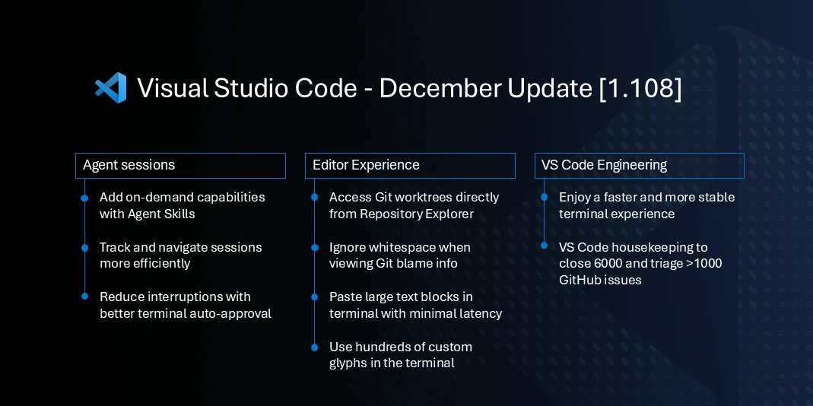

# December 2025 (version 1.108)

_Release date: January 08, 2026_

<!-- DOWNLOAD_LINKS_PLACEHOLDER -->

---

Welcome to the December 2025 release of Visual Studio Code.



Traditionally, the month of December is a time where our team focuses on cleaning up GitHub issues and pull requests across our repositories. This year, we managed to reduce our open issues by nearly 6,000 and triaged over a thousand more.

In addition to our housekeeping efforts, we have also made several improvements and feature updates across various areas of VS Code.

Happy Coding!

<br>

>If you'd like to read these release notes online, go to [Updates](https://code.visualstudio.com/updates) on [code.visualstudio.com](https://code.visualstudio.com).<br>

> **Insiders: Want to try new features as soon as possible?**<br>
> You can download the nightly Insiders build and try the latest updates as soon as they are available.<br>
> [Download Insiders](https://code.visualstudio.com/insiders)<br>

<!-- TOC
<div class="toc-nav-layout">
  <nav id="toc-nav">
    <div>In this update</div>
    <ul>
      <li><a href="#agents">Agents</a></li>
      <li><a href="#chat">Chat</a></li>
      <li><a href="#mcp">MCP</a></li>
      <li><a href="#accessibility">Accessibility</a></li>
      <li><a href="#editor-experience">Editor Experience</a></li>
      <li><a href="#code-editing">Code Editing</a></li>
      <li><a href="#notebooks">Notebooks</a></li>
      <li><a href="#source-control">Source Control</a></li>
      <li><a href="#debugging">Debugging</a></li>
      <li><a href="#tasks">Tasks</a></li>
      <li><a href="#terminal">Terminal</a></li>
      <li><a href="#authentication">Authentication</a></li>
      <li><a href="#languages">Languages</a></li>
      <li><a href="#remote-development">Remote Development</a></li>
      <li><a href="#contributions-to-extensions">Contributions to extensions</a></li>
      <li><a href="#extension-authoring">Extension Authoring</a></li>
      <li><a href="#proposed-apis">Proposed APIs</a></li>
      <li><a href="#engineering">Engineering</a></li>
      <li><a href="#notable-fixes">Notable fixes</a></li>
      <li><a href="#thank-you">Thank you</a></li>
    </ul>
  </nav>
  <div class="notes-main">
Navigation End -->

## Agents

### Agent Skills (Experimental)

**Setting**: `setting(chat.useAgentSkills:true)`

VS Code now supports **Agent Skills**, allowing you to teach the coding agent new capabilities and provide domain-specific knowledge. Agent Skills are folders of instructions, scripts, and resources that GitHub Copilot can load when relevant to perform specialized tasks.

Skills are stored in directories with a `SKILL.md` file that defines the skill's behavior. VS Code automatically detects skills from the `.github/skills` folder in your workspace (or `.claude/skills/` for backwards compatibility). They are then loaded on-demand into the chat context when relevant for your request.

Enable support for Agent Skills by enabling the `setting(chat.useAgentSkills)` setting.

Learn more about creating and using skills in the [Agent Skills documentation](https://code.visualstudio.com/docs/copilot/customization/agent-skills).

### Improvements to Agent Sessions view

This iteration, we further improved the Agent Sessions view with several enhancements:

* Keyboard access support for actions such as archive, read state, opening a session
* Grouping of sessions based on state and age when showing side-by-side
* Provide information on changed files and associated PRs for a session
* Support for archiving multiple sessions at once from the new group sections
* General accessibility improvements


> **Note**: `setting(chat.viewSessions.orientation)` no longer provides the `auto` option. Use `sideBySide` as alternative.

## Chat

### Chat picker is based on agent sessions

The Quick Pick for chat sessions is now based on the same information that drives the Agent Sessions view. You can access any previous chat session from there and perform actions like archiving, renaming or deletion.


> **Note**: Agent sessions can also be accessed by typing `agent ` in the Quick Open control (`kb(workbench.action.quickOpen)`).

### Chat title improvements

The Chat view title control is now showing up, irrespective of how the Activity Bar is configured. Previously, it only showed up in the default Activity Bar configuration.

To quickly jump from one session to another, select the chat title to open the sessions Quick Pick and choose another session.


### Open empty Chat on restart

**Setting**: `setting(chat.viewRestorePreviousSession)`

From now on, previous chat sessions are not automatically restored when VS Code is restarted. Instead, an empty Chat view is shown where you can then access previous sessions from the Agent Sessions control.

Modify this behavior with the `setting(chat.viewRestorePreviousSession)` setting.

### Terminal tool auto approve default rules

**Settings**: `setting(chat.tools.terminal.enableAutoApprove)`, `setting(chat.tools.terminal.autoApproveWorkspaceNpmScripts)`

The following commands are now auto approved by default when terminal auto approve is enabled (`setting(chat.tools.terminal.enableAutoApprove)`):

* `git ls-files`
* `git --no-pager <safe_subcommand>`
* `git -C <dir> <safe_subcommand>`
* `rg` (excluding `--pre` and `--hostname-bin`)
* `sed` (excluding some args and usage patterns)
* `Out-String`

In addition, npm scripts run through `npm`, `pnpm` or `yarn` are now auto approved by default when they are included within the `package.json`. We do this because using agents already requires Workspace Trust, and we protect agents from editing sensitive files like `package.json`. This can be disabled with `setting(chat.tools.terminal.autoApproveWorkspaceNpmScripts)`.

To improve transparency around auto approve, there is now an informational message when a rule was explicitly denied by either default or custom rules:


### Add session and workspace rules for future terminal tool commands

The allowed commands or command line entries in the Allow dropdown now have options a corresponding action to allow them for the current session or for the workspace.


### Terminal tool preventing adding to shell history

**Setting**: `setting(chat.tools.terminal.preventShellHistory)`

When shell integration is enabled and working, commands that are run by the terminal tool are no longer included in shell history for bash, zsh, pwsh and fish. The method this uses differs for each shell, for bash for example `HISTCONTROL=ignorespace` is set and a space is added to the start of the command being run.

If you prefer to keep terminal tool commands in the shell history, configure this with the `setting(chat.tools.terminal.preventShellHistory)` setting.

## MCP


## Accessibility

### Streaming chat responses in Accessible View

The Accessible View now dynamically streams chat responses as they are generated. Previously, you needed to close and reopen the Accessible View to see updated content. Now, you can stay in the Accessible View and monitor output as it comes in, making it much easier to follow along with AI responses in real-time.

### MCP server output excluded from Accessible View

To reduce noise, MCP (Model Context Protocol) server output is now excluded from the Accessible View by default. The standard chat output remains fully accessible, as it's presented in a text area that works well with screen readers.

### Language ID variable in window title

A new `${activeEditorLanguageId}` variable is now available for the `setting(window.title)` setting. This variable displays the language identifier of the currently active editor, which is useful for accessibility tools like Talon that need to determine the current programming language to enable appropriate voice commands.

```json
"window.title": "${activeEditorLanguageId} - ${activeEditorShort}"
```

## Editor Experience

### Import profile by drag and drop

You can now import a settings profile by dragging and dropping a `.code-profile` file into VS Code. This makes it easier to share profiles with teammates or quickly set up a new environment.

When you drop the file, the Profiles editor opens and lets you preview and import the profile. This provides a similar experience to dragging and dropping a `.code-workspace` file to open a workspace.

### Copy breadcrumbs path

**Setting**: `setting(breadcrumbs.symbolPathSeparator)`

You can now copy the breadcrumbs path to the clipboard by using the **Copy Breadcrumbs Path** command. This is useful when you need to share the exact location of a symbol with your team or for documentation purposes.


The `setting(breadcrumbs.symbolPathSeparator)` setting enables you to customize the separator character used to join breadcrumb segments.

### Go to Symbol in Workspace supports special characters in query

The **Go to Symbol in Workspace** (`kb(workbench.action.showAllSymbols)`) feature no longer incorrectly filters out all results when the search query contains a `#` character.

This fix enables language extensions like rust-analyzer to use `#` as a modifier in symbol searches. For example, in rust-analyzer, appending `#` to a query like `main#` searches for functions in current workspace only.

## Code Editing

### New snippet tranformations

There are two new snippet transformations available: `snakecase` and `kebabcase`. This is how you can use them:

For snake_case transformation:

```text
${TM_FILENAME/(.*)/${1:/snakecase}/}
```

This transforms the filename to snake-case format. For example, from `MyFileName.txt` it makes `my_file_name.txt`. The kebab-case transformation would be `my-file-name.txt`.

## Notebooks


## Source Control

### Git blame information settings

**Settings**: `setting(git.blame.ignoreWhitespace:true)`, `setting(git.blame.editorDecoration.disableHover:true)`

The new `setting(git.blame.ignoreWhitespace)` setting enables you to configure Git blame to ignore whitespace changes when determining which commit last modified a line. This is particularly useful when working with code that has been reformatted, as it helps you identify the commit that made the actual functional change rather than just whitespace adjustments.

Additionally, the `setting(git.blame.editorDecoration.disableHover)` setting lets you disable the hover tooltip that appears when you hover over a Git blame editor decoration. This can be useful if you prefer a cleaner editing experience and only want to see the inline blame annotations without the additional hover information.

### Authoring commit messages using the editor

Some time ago we added the capability to use the full editor to [author a commit message](https://code.visualstudio.com/docs/sourcecontrol/staging-commits#_use-the-editor-for-commit-messages) but the actions to commit or cancel were difficult to discover in the editor title toolbar. We improved the editor overlay control in the lower right-hand corner of the editor and moved these actions there to make them easier to use.

### Worktrees in the Source Control Repositories view (Experimental)

**Settings**: `setting(scm.repositories.explorer:true)`, `setting(scm.repositories.selectionMode:single)`

This milestone, we have added a **Worktrees** node to the Source Control Repositories view. Under this node, you can see the list of the repository worktrees with an inline action to open the worktree in a new window. The context menu also contains an action to open the worktree in the current window, as well as an action to delete the worktree.


You can enable the experimental repository explorer by setting the `setting(scm.repositories.selectionMode:single)` and `setting(scm.repositories.explorer:true)` settings. Give it a try and let us know what other repository artifacts you would like to see in the Repositories explorer.

Learn more about [using source control in VS Code](https://code.visualstudio.com/docs/sourcecontrol/overview).

## Debugging


## Tasks


## Terminal

### Terminal IntelliSense default UX rework

During the past two releases, we rolled out terminal IntelliSense to all VS Code Stable users. While much of the feedback was positive, there was a segment of users (mostly terminal power users) that did not like the feature breaking their muscle memory. After a lot of discussion, we decided to switch some defaults, improve discoverability and allow easier inline configuration of the feature.

The feature itself is still enabled by default, but instead of showing the control automatically when typing (quick suggestions and suggest on trigger characters), it now needs to be explicitly triggered via `kbstyle(Ctrl+Space)`.

We also improved the "status bar" on the bottom. Previously, it showed insert on the left and Learn more/Configure on the right with their associated keybindings. We got feedback that it's not clear that these can be interacted with, so we now show icons on the right and no longer show the keybindings. The left action now allows rotating through the options for "selection mode", which determines how `kbstyle(Tab)` and `kbstyle(Enter)` react when it's brought up. There's a new eye icon on the right, which enables quick suggestions and suggest on trigger characters again.


Finally, to still make this powerful feature relatively discoverable without being overbearing, a hint shows when opening a terminal that explains how to show suggestions. The lifecycle of the hint is simplified and it's as easy as clicking "don't show" to get rid of it permanently, just like the similar feature in the editor.


Beyond this UX rework, these improvements were also done to terminal IntelliSense:

* We now show files with the executable bit on macOS/Linux
* Improved completions for `npm` and `git`
* Several fixes to the feature

### Performance and stability improvements

The terminal saw several important performance and stability improvements this release:

* [node-pty#831](https://github.com/microsoft/node-pty/pull/831): On macOS and Linux, pasting more than 50 characters at once or having Copilot run a large command is no longer throttled and should apply essentially instantly, scaling similarly to other terminals with KBs/MBs of data. This also fixed a crash that could happen on macOS when doing the same thing.
* [vscode#285031](https://github.com/microsoft/vscode/issues/285031), [vscode#285032](https://github.com/microsoft/vscode/issues/285032), [xterm.js#5548](https://github.com/xtermjs/xterm.js/issues/5548): Fixed several layout thrashing issues that could cause the editor to get laggy.
* [vscode#239541](https://github.com/microsoft/vscode/issues/239541): Fixed a crash that could occur when fonts such as CommitMono were configured in the terminal.

### More comprehensive custom glyphs

The terminal's GPU accelerated renderer (on by default) has supported custom glyphs for some time for box drawing, block element, and a subset of powerline symbols. This means that you can see these characters without needing to configure a font and they also scale with line height, letter spacing, and should align with each other perfectly.

In this release, we expanded the number of characters supported to almost 800 by including the majority of custom glyphs supported by any other terminal. This includes ranges that are generally useful in a terminal, specifically these ranges:

* Box Drawing (`U+2500`-`U+257F`)
* Block Elements (`U+2580`-`U+259F`)
* Braille Patterns (`U+2800`-`U+28FF`)
* Powerline Symbols (`U+E0A0`-`U+E0D4`, Private Use Area)
* Progress Indicators (`U+EE00`-`U+EE0B`, Private Use Area)
* Git Branch Symbols (`U+F5D0`-`U+F60D`, Private Use Area)
* Symbols for Legacy Computing (`U+1FB00`-`U+1FBFF`)

Here's a visual of the complete set of glyphs:


### Improved rendering of curly underlines

VS Code has been able to parse and display [colored and styled underlines](https://sw.kovidgoyal.net/kitty/underlines/) for some time now, but the curly underline's rendering always left something to be desired. The curly underlines should now look very close to how they look in the editor.


You can try this out for yourself by running this command in bash: `echo -e '\x1b[4:3mCurly\x1b[0m \x1b[4:3m\x1b[58;5;1mRed\x1b[0m'`

### Dimensions visual overlay on resize

Inspired by a feature in [ghostty](https://github.com/ghostty-org/ghostty), we added a brief overlay that shows the current terminal dimensions (columns x rows) when you resize the terminal. This is useful if you want to resize your terminal to a specific size for testing or other purposes.


### New VT features

The terminal now supports the follow VT features/sequences:

* [Synchronized output](https://github.com/microsoft/vscode/issues/284592): can be used by applications to pause rendering and batch updates in the terminal, which is particularly useful to prevent tearing when rewriting the buffer.

    * DECRQM (`CSI ? 2026 $ p`)
    * BSU (`CSI ? 2026 h`)
    * ESU (`CSI ? 2026 l`)

* [XTVERSION](https://github.com/microsoft/vscode/issues/285138) (`CSI > 0 q`): allows applications to query details about the terminal, the response VS Code will give currently is the "xterm.js" and its version

## Authentication


## Languages


## Contributions to extensions

### GitHub Pull Requests

There has been more progress on the [GitHub Pull Requests](https://marketplace.visualstudio.com/items?itemName=GitHub.vscode-pull-request-github) extension, which enables you to work on, create, and manage pull requests and issues. New features include:

* Change a pull request's base branch from the pull request description webview.
* Convert open pull requests to draft from the pull request description webview.
* Generate a pull request description for an existing PR, not just new ones.

Review the [changelog for the 0.126.0](https://github.com/microsoft/vscode-pull-request-github/blob/main/CHANGELOG.md#01260) release of the extension to learn about everything in the release.

## Extension Authoring

### New Quick Pick properties for prompts and resource URIs

The Quick Pick API includes two new properties for creating interactive selection interfaces.

Use the `prompt` property on `QuickPick` to display persistent instructional text beneath the input box. The text remains visible while users type, which helps provide guidance or context.

```typescript
const quickPick = vscode.window.createQuickPick();
quickPick.prompt = 'Select a file to open';
quickPick.items = items;
quickPick.show();
```

Use the `resourceUri` property on `QuickPickItem` to automatically derive item properties from a resource URI. When provided, VS Code derives:

* The `label` from the file name (when set to an empty string)
* The `description` from the file path (when set to `undefined` or an empty string)
* The `icon` from the current file icon theme (when `iconPath` is set to `ThemeIcon.File` or `ThemeIcon.Folder`)

This is useful when building file or folder selection interfaces.

```typescript
const items: vscode.QuickPickItem[] = [
  {
    label: '',
    resourceUri: vscode.Uri.file('/path/to/app.ts'),
    iconPath: vscode.ThemeIcon.File
  },
  {
    label: '',
    resourceUri: vscode.Uri.file('/path/to/src'),
    iconPath: vscode.ThemeIcon.Folder
  }
];
```

## Proposed APIs


## Engineering

### Housekeeping

As part of our annual December housekeeping, we spent a majority of time cleaning up GitHub issues and pull requests across all our maintained repositories. This year, we managed to **reduce our open issues by 5,951 and triaged another 1,203 issues**.


By using improved triage tooling and deduplication processes, we were able to close a significant number of stale and resolved issues. This has left us with a more manageble project, enabling us to move forward and develop the features that have the most impact for our users. In our core VS Code repository alone, we closed 2,872 issues and triaged another 1,697!


In June of 2025, we also announced that Copilot had become Open Source! This meant that all related issues would also be filed in the microsoft/vscode repo, and that we had a backlog of issues remaining in microsoft/vscode-copilot-release to take care of. This month, we triaged every issue in the repository and closed 1,659 issues, leaving only 175 open to be migrated.


Below is a graph that shows how our core vscode repository has grown over the years, and how many issues our amazing community has contributed over time. We appreciate everyone who has contributed issues to our repositories over the years and continued to engage with us. Your feedback is what has made VS Code the product that it is today! 🚀


## Notable fixes

* [vscode#283356](https://github.com/microsoft/vscode/issues/283356) - Fixed regression causing jumping around while scrolling past some chat output

## Thank you

### Issue tracking

Contributions to our issue tracking:

* [@gjsjohnmurray (John Murray)](https://github.com/gjsjohnmurray)
* [@RedCMD (RedCMD)](https://github.com/RedCMD)
* [@tamuratak (Takashi Tamura)](https://github.com/tamuratak)
* [@IllusionMH (Andrii Dieiev)](https://github.com/IllusionMH)
* [@albertosantini (Alberto Santini)](https://github.com/albertosantini)

---

We really appreciate people trying our new features as soon as they are ready, so check back here often and learn what's new.

>If you'd like to read release notes for previous VS Code versions, go to [Updates](https://code.visualstudio.com/updates) on [code.visualstudio.com](https://code.visualstudio.com).

<a id="scroll-to-top" role="button" title="Scroll to top" aria-label="scroll to top" href="#"><span class="icon"></span></a>
<link rel="stylesheet" type="text/css" href="css/inproduct_releasenotes.css"/>
