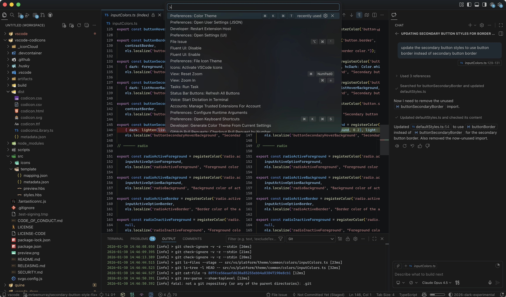
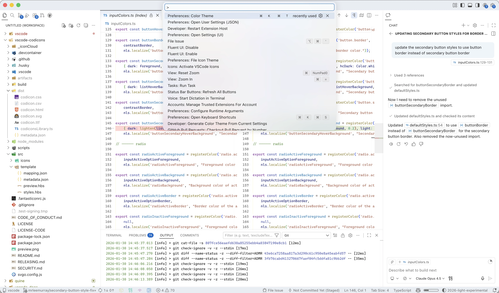

# January 2026 (version 1.109)

_Release date: February 4, 2026_

**Update 1.109.1**: The update addresses these [security issues](https://github.com/microsoft/vscode/issues?q=is%3Aissue+is%3Aclosed+milestone%3A%22January+2026+Recovery+1%22+).

**Update 1.109.2**: The update addresses these [issues](https://github.com/microsoft/vscode/issues?q=is%3Aissue+is%3Aclosed+milestone%3A%22January+2026+Chat+Recovery+2%22+)

**Update 1.109.3**: The update addresses these [issues](https://github.com/microsoft/vscode/issues?q=is%3Aissue+is%3Aclosed+milestone%3A%22January+2026+Recovery+3%22+) and introduces several notable features:

* [Message steering and queueing](#message-steering-and-queueing-experimental): send follow-up messages while a request is still running
* [Agent hooks](#agent-hooks-preview): run custom shell commands at key agent lifecycle points
* [Claude compatibility](#claude-compatibility): reuse your Claude configuration files directly in VS Code
* [Use skills as slash commands](#use-skills-as-slash-commands): invoke agent skills on demand from chat

<!-- DOWNLOAD_LINKS_PLACEHOLDER -->

---

Welcome to the January 2026 release of Visual Studio Code. In this release, we are further evolving VS Code to make it the **home for multi-agent development**.

* [Chat UX](#chat-ux) - chat just feels better and snappier with faster streaming, improved reasoning results, and a revamped editor inline chat

* [Agent Session Management](#agent-session-management) - it's now easier to delegate tasks to agents across local, background, and cloud and jump in when needed

* [Agent Customization](#agent-customization) - build your own workflows using agent orchestrations, and have consistent results with Agent Skills and organization-wide customizations

* [Agent Extensibility](#agent-extensibility) - reuse your knowledge with Claude agent support and new Anthropic model capabilities, and enjoy rich chat interactions with MCP Apps

* [Agent Optimizations](#agent-optimizations) - agents work smarter with Copilot Memory and experience faster code search with external indexing

* [Agent Security & Trust](#agent-security-and-trust) - feel confident running terminal commands with sandboxing and effective auto-approval rules

* [Workbench & productivity](#workbench-and-productivity) - test your apps without leaving the editor with the new integrated browser

* [Terminal Enhancements](#terminal-enhancements) - quality-of-life improvements to make your terminal experience smoother and more reliable

* [Coding & Editor](#coding-and-editor) - several impactful improvements to make everyday coding smoother

* [Extensions & API](#extensions-and-api) - new capabilities for extension authors to build richer experiences

Happy Coding!

Watch our [VS Code 1.109 release highlights video](https://youtu.be/LGx8YieBjIA) to hear about these features!

---

<br>

>If you'd like to read these release notes online, go to [Updates](https://code.visualstudio.com/updates) on [code.visualstudio.com](https://code.visualstudio.com).<br>

> **Insiders: Want to try new features as soon as possible?**<br>
> You can download the nightly Insiders build and try the latest updates as soon as they are available.<br>
> [Download Insiders](https://code.visualstudio.com/insiders)<br>

---

<!-- TOC
<div class="toc-nav-layout">
  <nav id="toc-nav">
    <div>In this update</div>
    <ul>
      <li><a href="#chat-ux">Chat UX</a></li>
      <li><a href="#agent-session-management">Agent Session Management</a></li>
      <li><a href="#agent-customization">Agent Customization</a></li>
      <li><a href="#agent-extensibility">Agent Extensibility</a></li>
      <li><a href="#agent-optimizations">Agent Optimizations</a></li>
      <li><a href="#agent-security-and-trust">Agent Security & Trust</a></li>
      <li><a href="#terminal-enhancements">Terminal enhancements</a></li>
      <li><a href="#coding-and-editor">Coding & editor</a></li>
      <li><a href="#workbench-and-productivity">Workbench & productivity</a></li>
      <li><a href="#extensions-and-api">Extensions & API</a></li>
      <li><a href="#engineering">Engineering</a></li>
      <li><a href="#notable-fixes">Notable fixes</a></li>
      <li><a href="#thank-you">Thank you</a></li>
    </ul>
  </nav>
  <div class="notes-main">
Navigation End -->

## Upcoming events

### Agent Sessions Day

Join us for [Agent Sessions Day](https://youtube.com/live/tAezuMSJuFs) on Feb 19th to see these latest updates demoed live! Discover how VS Code has evolved into a unified agent UX, while staying true to its core values of openness, extensibility, and developer choice.


## Chat UX

Faster responses, clearer reasoning, and less friction. This release brings streaming improvements that show progress as it happens, a revamped inline chat that stays out of your way, and better visibility into what the model is thinking, so you can stay in flow while the AI works.

### Message steering and queueing (Experimental)

**Setting**: `setting(chat.requestQueuing.enabled)`, `setting(chat.requestQueuing.defaultAction)`

**Update 1.109.3**: When working on longer tasks, you often think of the next task before the current or notice the agent heading in the wrong direction. Previously, you had to wait for a response to complete or cancel it entirely. Now you can send follow-up messages while a request is still running.


While a request is in progress, the **Send** button changes to a dropdown with three options:

* **Add to Queue**: your message waits and sends automatically after the current response completes.
* **Steer with Message**: signals the current request to yield after finishing the active tool execution, then processes your new message immediately. Use this to redirect the agent when it's heading in the wrong direction.
* **Stop and Send**: cancels the current request entirely and sends your new message immediately.

When you have multiple pending messages, drag and drop them to change the order in which they are processed.

Use `setting(chat.requestQueuing.defaultAction)` to set the default action of the Send button to `steer` (default) or `queue`.

Learn more about [message steering and queueing](https://code.visualstudio.com/docs/copilot/chat/chat-sessions#_send-messages-while-a-request-is-running) in the documentation.

### Anthropic models now show thinking tokens

**Settings**: `setting(chat.thinking.style)`, `setting(chat.agent.thinking.collapsedTools)`, `setting(chat.agent.thinking.terminalTools)`, `setting(chat.tools.autoExpandFailures)`

Many of you are using Anthropic's Claude models in VS Code. These models now support thinking tokens to give you more visibility into the model's reasoning process.

In this release, we've enhanced the chat UX to surface thinking tokens more effectively. More information, less noise!

* Choose between detailed or compact thinking styles to suit your preference (`setting(chat.thinking.style)`).

* You'll see the model's thought process interleaved with tool calls and responses (`setting(chat.agent.thinking.terminalTools)`).

* Failing tool calls automatically expand to show more context (`setting(chat.tools.autoExpandFailures)`).

* Various visual enhancements to make following model activity more intuitive, like scrollable thinking content and shimmer animations.

<video src="images/1_109/thinking-scrolling-shimmer.mp4" title="Video showing scrollable thinking content and shimmer animations in chat." autoplay loop controls muted></video>

### Mermaid diagrams in chat responses

Chat responses can now render interactive [Mermaid diagrams](https://mermaid.js.org) with the `renderMermaidDiagram` tool. This lets models use flowcharts, sequence diagrams, and other visualizations to visually break down complex concepts. The diagrams are interactive, so you can pan and zoom to explore them in detail, or open them in a full-sized editor for easier viewing.

Interact with Mermaid diagrams using the following controls:

* **Pan and zoom** - Hold `kbstyle(Alt/Option)` and use the mouse wheel to zoom, or pinch to zoom on a trackpad. Hold `kbstyle(Alt/Option)` and drag to pan around the diagram.
* **Click to zoom** - Hold `kbstyle(Alt/Option)` and click to zoom in. Add `kbstyle(Shift)` to zoom out.
* **Open in editor** - Use the button to open the diagram in a full-sized editor for better viewing of larger diagrams.
* **Copy source** - Right-click on a diagram and select `Copy diagram source` to copy its Mermaid source code.


### Ask Questions tool (Experimental)

**Setting**: `setting(chat.askQuestions.enabled)`

Instead of making assumptions when something is unclear, the agent can now use the `askQuestions` tool to ask clarifying questions during chat conversations. It presents one or more questions directly in chat with single/multi-select options, free text input, and recommended answers highlighted for quick decisions.


Use the keyboard to navigate between answers with `kbstyle(Up)` and `kbstyle(Down)`, or type the number that matches the corresponding answer (use `kbstyle(Escape)` to skip remaining questions).

We have revamped our Plan agent to also take advantage of the `askQuestions` tool to make sure your implementation plans align with your expectations and beyond!

### Plan agent

The built-in [Plan agent](https://code.visualstudio.com/docs/copilot/chat/chat-planning) lets you create a structured implementation plan before starting to code. This helps ensure that the AI understands the task requirements and produces high-quality code that meets your expectations.

* The Plan agent now follows a structured 4-phase iterative workflow that produces higher-quality implementation plans:

    1. **Discovery** - Autonomously explores your codebase, searching for relevant files and understanding project structure.
    2. **Alignment** - Pauses to ask clarifying questions before committing to a plan, catching ambiguities early.
    3. **Design** - Drafts a comprehensive implementation plan with clear steps, file locations, and code snippets.
    4. **Refinement** - Adds verification criteria and documents decisions made during planning.

* You can now invoke the Plan agent by typing `/plan` in chat, followed by your task description. This provides a quick entry point for planning complex tasks before switching to implementation.

### Context window details

To keep track of how the model is using its context window, you can now see a context window indicator in the chat input area. Hover over the indicator to see a breakdown of token usage by category.


### Inline chat UX revamp (Preview)

**Settings**: `setting(inlineChat.affordance)`, `setting(inlineChat.renderMode)`

We continue to revamp the inline chat experience and have two preview features:

* An affordance that makes it easier to trigger inline chat when selecting text (`setting(inlineChat.affordance)`)
* A lightweight and easier-to-use contextual rendering (`setting(inlineChat.renderMode)`)

<video src="images/1_109/inline-chat.mp4" title="Video showing inline chat affordance and contextual input." autoplay loop controls muted></video>

### Model descriptions in the model picker

On hover or keyboard focus of a model in the model picker, you can now see its details at a glance.


### Terminal command output

#### Richer command details

To make it clearer what command is being run, the terminal tool now shows additional details:

* **Syntax highlighting for inline Node, Python, and Ruby**

    

* **Working directory**

    

* **Description of the command's intent**

    

#### Output streaming

Terminal output now automatically expands when a command takes time to execute, giving you immediate visibility into what's happening. Quick commands stay collapsed to reduce visual noise.

<video src="images/1_109/embedded-terminal-streaming.mp4" title="Video showing terminal output auto-expanding for long-running commands." autoplay loop controls muted></video>

#### Interactive input

Embedded terminals are now fully interactive. You can focus the terminal and type directly, which is useful when a command prompts for confirmation or requires user input. The cursor is now visible, making it clear when a terminal is ready for input.

<video src="images/1_109/embedded-terminal-input.mp4" title="Video showing typing input directly into an embedded terminal in chat." autoplay loop controls muted></video>

#### Delete all hidden terminals

The **Hidden Terminals** item in the terminal panel now includes a delete icon to clear all hidden terminals with one action.


### Tell us what you think about our new themes (Experimental)

We are developing new experimental `VS Code Light` and `VS Code Dark` themes to increase focus and bring a sense of elevation and lightness to the UI, through the use of shadows and transparency. These themes are a work-in-progress.

Let us know what works and where we can improve by giving feedback in the [vscode repository](https://github.com/microsoft/vscode/issues).

**VS Code Dark (Experimental)**:



**VS Code Light (Experimental)**:



## Agent Session Management

Delegate, monitor, and switch without losing focus. You can now run multiple agent sessions in parallel across local, background, and cloud environments, all from a single unified view. Jump between sessions, track progress at a glance, and let agents work independently while you stay productive.

### Switching and delegating between agent types

VS Code makes it easy to start agent sessions across [different environments](https://code.visualstudio.com/docs/copilot/agents/overview#_types-of-agents): locally in VS Code, in the background, in the cloud, or with other agent providers. We've made it easier to switch between these different agent types by introducing a new session type picker in the chat input area.

The picker serves two main purposes:

* Choose the type of agent session you want to start
* Hand off an ongoing session to a different agent type (for example, plan a task locally and implement in the cloud)


> **Tip:** We've added a new `workbench.action.chat.newLocalChat` command for creating a new local chat session. Bind this command to a keyboard shortcut for even faster access.

### Keeping track of agent sessions

Keeping track of your active agent sessions is essential when working with multiple agents, especially when you have multiple parallel session across different environments.

#### Agent Sessions view

We've further improved the Agent Sessions view in VS Code to make this task easier:

* Resize the sessions list when showing side-by-side
* Multi-select sessions to perform operations in bulk
* Better stacked view to improve navigating sessions and applying filters

<video src="images/1_109/agent-sessions-viewer.mp4" title="Video showing agent sessions in the Chat view." autoplay loop controls muted></video>

#### Agent status indicator

**Settings**: `setting(chat.agentsControl.enabled)`, `setting(chat.agentsControl.clickBehavior)`

In situations where you have multiple active sessions, it's important to quickly see which sessions need your attention. We added an agent status indicator (`setting(chat.agentsControl.enabled)`) in the VS Code command center to provide visibility into agent session updates.

The indicator shows different types of status information: in-progress, unread, and sessions that need your attention. Select the indicator to quickly open and filter the sessions list.


We have also updated the chat button in the command center to let you configure its behavior when clicked (`setting(chat.agentsControl.clickBehavior)`). By default, it now cycles through the different Chat view states: sidebar, maximized, or hidden.

### Subagents

**Setting**: `setting(chat.customAgentInSubagent.enabled)`

Agents can run subtasks using [subagents](https://code.visualstudio.com/docs/copilot/agents/subagents) to break down complex tasks into smaller parts. The nice thing about subagents is that they operate in their own dedicated context window and don't add up to the main agent's context window.

Subagents can now run in parallel, which can significantly speed up tasks that can be split into independent tasks.


To provide more visibility into what the different subagents are doing, the chat conversation now shows details such as what tasks it's doing, the custom agent used for the subagent, and whichever tool is currently used. You can expand the subagent information to show the full details of what it's doing, including the full initial prompt it was provided with and the result it returned.

#### Search subagent (Experimental)

**Setting**: `setting(github.copilot.chat.searchSubagent.enabled)`

Searching your codebase is typically a task that can involve multiple iterations and which can quickly add up to your context window limit. We added support for a search subagent that runs in an isolated agent loop, enabling it to iteratively refine searches, try multiple queries, and explore different parts of your workspace.

This improves the quality of search results for complex queries where a single search isn't sufficient. It also preserves the main agent's context window and enables it to continue working while the search subagent does its job.

### Cloud agents

When you start a new [cloud agent](https://code.visualstudio.com/docs/copilot/agents/cloud-agents) session, you now have more options to configure your session. Choose from different models, use one of your custom agents, or select from available partner agents (where available).

* **Model selection for cloud agents**

    

* **Third-party coding agents** (Preview)

    If you have third-party coding agents, such as Claude and Codex, configured as part of your GitHub Copilot subscription, VS Code will show these options after selecting the cloud agent type.

    

    Learn more about [availability and enabling of third-party coding agents](https://github.blog/changelog/2026-02-04-claude-and-codex-are-now-available-in-public-preview-on-github/) in the GitHub Changelog.

* **Custom agents for cloud agents**

    Choose from [custom Agents](https://code.visualstudio.com/docs/copilot/customization/custom-agents) available in your target GitHub repository default branch.

    

* **Multi-root workspace and empty workspace improvements**

    When in a multi-root workspace window or empty workspace window, you can now select the folder to be used for the cloud agents.

    

* **Checkout always shows**

    The **Checkout** option for agent sessions now shows even when the GitHub Pull Requests extension is not installed. When you select this action, it installs GitHub Pull Requests if needed, and then hands off to it to perform the checkout.

### Background agents

Aligning with local and cloud agents, we have added several improvements to [background agents](https://code.visualstudio.com/docs/copilot/agents/background-agents):

* **Custom agents for background agents**

    

* **Attach images as context**

    

* **Multi-root workspace improvements**

    When in a multi-root workspace, you can now select the folder to be used in background agents.

    

* **Auto-commit at the end of each turn**

    We have updated the background agent loop to commit the changes to the Git worktree at the end of each turn. This enabled us to remove the Keep/Undo actions for background sessions and simplify how changed files are shown in the working set.

#### Agent sessions welcome page (Experimental)

**Setting**: `setting(workbench.startupEditor:agentSessionsWelcomePage)`

Last but not least, we're experimenting with a new welcome page and need your help to make it great. When you have multiple agents working in parallel, keeping track of recent sessions matters. The new welcome page surfaces your agent sessions front and center.


Enable the welcome page as your startup editor by setting `setting(workbench.startupEditor)` to `agentSessionsWelcomePage`. Let us know what you think and send us feedback in the [vscode repository](https://github.com/microsoft/vscode/issues)!

## Agent Customization

Shape how AI works with your codebase and share it across your team. Agent Skills now let you package domain expertise into reusable workflows, organization-wide instructions ensure consistency, and new controls give you fine-grained control over how and when agents get invoked.

### Agent hooks (Preview)

**Setting**: `setting(chat.hooks.enabled)`

**Update 1.109.3**: Hooks let you execute custom shell commands at key lifecycle points during agent sessions. Unlike instructions or custom prompts that guide agent behavior, hooks run your code deterministically with guaranteed outcomes. Use them to enforce security policies, automate code quality checks, create audit trails, or inject project-specific context.

VS Code supports eight hook events that fire at specific points during a session, including `PreToolUse` and `PostToolUse` for intercepting tool calls, `SessionStart` and `Stop` for session lifecycle, and `SubagentStart` and `SubagentStop` for tracking nested agent usage.


VS Code uses the same hook format as Claude Code and Copilot CLI, so you can reuse existing hook configurations across tools.

To get started, use the `/hooks` slash command in chat to configure a new hook, or create a hook file manually. For example, you can create a `PreToolUse` hook that runs a linter after every file edit, or block dangerous terminal commands before they execute.

Learn more about [agent hooks](https://code.visualstudio.com/docs/copilot/customization/hooks) in the documentation.

### Use skills as slash commands

Agent Skills are now available as slash commands in chat, alongside [prompt files](https://code.visualstudio.com/docs/copilot/customization/reusable-prompts). Type `/` in the chat input to see all available skills and prompts, and select a skill to invoke it immediately. You can add extra context after the command, for example `/webapp-testing for the login page` or `/github-actions-debugging PR #42`.

<video src="images/1_109/skills-as-slash-command.mp4" title="Video showing using skills as slash commands in chat." autoplay loop controls muted></video>

By default, all skills appear in the `/` menu. Use the `user-invokable` and `disable-model-invocation` frontmatter properties in your skill files to control how each skill is accessed:

* Set `user-invokable: false` to hide a skill from the menu while still letting the model load it automatically.
* Set `disable-model-invocation: true` to show the skill in the menu but prevent the model from loading it on its own.

Learn more about [using skills as slash commands](https://code.visualstudio.com/docs/copilot/customization/agent-skills#_use-skills-as-slash-commands) in the documentation.

### Set up your workspace for AI with `/init`

With [always-on custom instructions](https://code.visualstudio.com/docs/copilot/customization/overview#_custom-instructions) like `copilot-instructions.md` or `AGENTS.md`, you can ensure that the AI uses your project's conventions for generating code.

To prime your project with an initial set of instructions based on your codebase, you can now use the `/init` slash command in chat to generate or update your workspace instructions.

When you run `/init`, the agent discovers existing AI conventions in your workspace (such as `copilot-instructions.md` or `AGENTS.md`), analyzes your project structure and coding patterns, and generates comprehensive workspace instructions tailored to your project. The `/init` command is implemented as a contributed prompt file, so you can customize its behavior by modifying the underlying prompt.

### Agent Skills are generally available

**Settings**: `setting(chat.useAgentSkills)`, `setting(chat.agentSkillsLocations)`

[Agent Skills](https://code.visualstudio.com/docs/copilot/customization/agent-skills) are now generally available and enabled by default. Skills provide specialized capabilities, domain knowledge, and refined workflows to help the AI produce high-quality outputs. Each skill folder contains tested instructions for specific domains like testing strategies, API design, or performance optimization.

You can now manage skills in VS Code in the same way you manage prompt files, instructions, or custom agents. Use the **Chat: Configure Skills** command to view all available skills, or **Chat: New Skill File** to create a new skill in your workspace or user home.


By default, VS Code looks for skills definitions in the `.github/skills` and `.claude/skills` folder of your workspace, or in the `~/.copilot/skills` or `~/.claude/skills` folder in your user home. You can specify custom paths where VS Code should look for skills by using the `setting(chat.agentSkillsLocations)` setting.

If you're an extension author, you can also package and distribute skills with your extension by including them in the extension and registering them using the `chatSkills` contribution point in the `package.json`:

```json
{
  "contributes": {
    "chatSkills": [
      {
        "path": "./skills/my-skill"
      }
    ]
  }
}
```

The `path` must point to a directory that contains a `SKILL.md` file, and the `name` field in the `SKILL.md` frontmatter must match the parent directory name. For example, if the path is `./skills/my-skill`, the directory must contain a `SKILL.md` with `name: my-skill` in its frontmatter. Learn more about the required folder structure in the [Agent Skills documentation](https://code.visualstudio.com/docs/copilot/customization/agent-skills#_contribute-skills-from-extensions).

### Organization-wide instructions

**Setting**: `setting(github.copilot.chat.organizationInstructions.enabled)`

Previously, VS Code already added support for organization-level custom agents. In this release, VS Code now also supports organization-level custom instructions. If your GitHub organization has configured custom instructions for Copilot, they are automatically applied to your chat sessions, ensuring consistent guidance across your team.

This feature is enabled by default. You can disable organization instructions by setting `setting(github.copilot.chat.organizationInstructions.enabled)` to `false`.

Learn more about [Custom Instructions](https://code.visualstudio.com/docs/copilot/customization/custom-instructions) in the documentation.

### Custom agent file locations

**Setting**: `setting(chat.agentFilesLocations)`

Like for other customization files, such as prompt files, instructions, and skills, you can now configure where VS Code looks for [custom agent definitions](https://code.visualstudio.com/docs/copilot/customization/custom-agents) (`.agent.md`).

By default, VS Code searches for agent files in your workspace's `.github/agents` folder. With the new `setting(chat.agentFilesLocations)` setting, you can add additional directories to search, making it easier to organize and share agents across projects or keep them in a central location outside your workspace.

```json
{
    "chat.agentFilesLocations": {
        "~/.vscode/agents": true,
        "shared/team-agents": true
    }
}
```

### Control how custom agents are invoked

**Settings**: `setting(chat.customAgentInSubagent.enabled)`

[Custom agents](https://code.visualstudio.com/docs/copilot/customization/custom-agents) now support additional attributes in the frontmatter header that give you more control over how agents can be invoked. This is particularly useful for setting up [agent orchestrations](#agent-orchestration) to handle complex tasks with confidence.

* `user-invokable`: controls whether the agent can be selected from the agents dropdown in chat. Set to `false` to create agents that are only accessible programmatically or as [subagents](https://code.visualstudio.com/docs/copilot/agents/subagents).

* `disable-model-invocation`: prevents the agent from being invoked as a subagent by other agents when enabled. This is useful for agents that should only be triggered explicitly by users.

* `agents`: limits which subagents the current agent can invoke. When specified, the agent can only hand off work to the listed agents. Use the `agent` tool to enable subagent invocation.

The use of custom agents as subagents is currently still behind a setting. Enable `setting(chat.customAgentInSubagent.enabled)` to enable custom agents as subagents.

```Markdown
---
name: my-internal-agent
user-invokable: false
---

This agent can only be invoked as a subagent
```

The following example shows an agent that can only invoke the `Modify` and `Search` subagents:

```Markdown
---
name: Foo
tools: ['agent']
agents: ['Modify', 'Search']
---

This agent can only use the Modify and Search subagents.
```

### Multiple model support for custom agents

[Custom agents](https://code.visualstudio.com/docs/copilot/customization/custom-agents) can now specify more than one model in the frontmatter header. The first available model in the list is used, providing fallback options if a preferred model is unavailable.

```Markdown
---
name: my-agent
model: ['Claude Sonnet 4.5 (copilot)', 'GPT-5 (copilot)']
---

This agent prefers Claude Sonnet 4.5 but falls back to GPT-5 if unavailable.
```

### Chat customization diagnostics

Chat customization files can originate from various locations, including your user profile, workspace, extensions, and your GitHub organization. When troubleshooting issues with custom agents, prompts, instructions, or skills, it can be challenging to determine which files are currently loaded and whether any errors occurred during loading.

A new diagnostics view helps you troubleshoot chat customization issues by showing all currently loaded custom agents, prompt files, instruction files, and skills. To access it, right-click in the Chat view and select **Diagnostics**. This opens a Markdown document listing all active customization files, their load status, and any errors that occurred during loading.


### Language Models editor

The Language Models editor in VS Code provides a centralized interface for managing and configuring language models used in chat. This iteration, we further enhanced this experience:

* **Multiple configurations per provider**:  create multiple configurations for the same model provider, each with a different API key. This is useful for separating personal and work accounts, or using different API keys for different projects. For example, you might have one Gemini configuration with your personal API key and another with your team's API key.

    

* **Configuring models from Azure provider**: when configuring Azure models, VS Code opens the `chatLanguageModels.json` configuration file and inserts a snippet template. This snippet includes the required properties such as model ID, name, endpoint URL, and token limits. You can then fill in the values for each model you want to add.

    <video src="images/1_109/chat-lm-editor-azure-config.mp4" title="Video showing Azure model configuration in the Language Models editor." autoplay loop controls muted></video>

* **Manage provider groups**: configure an existing provider group by selecting the configure action, for example to update the API key. You can also remove a provider group entirely by using the remove action.

* **Additional UI improvements**: several usability improvements, such as keyboard access for toggling model visibility, context menu actions, and multi-select for bulk actions.

    <video src="images/1_109/chat-lm-editor-improv.mp4" title="Video showing additional UI improvements in the Language Models editor." autoplay loop controls muted></video>

* **Language-model configuration file**: model configurations are now stored in a dedicated `chatLanguageModels.json` file. Open this file directly by selecting the file icon in the top-right corner of the Language Models editor. This makes it easy to view, edit, or share your model configurations.

    

* **Model provider configuration UI**: model providers can declare their configuration schema, and VS Code provides the UI for users to enter their configuration. See [Chat Model Provider Configuration](#chat-model-provider-configuration) for details on this new proposed API. Existing model configurations from the GitHub Copilot Chat extension are automatically migrated.

### Language model configuration

**Settings**: `setting(github.copilot.chat.implementAgent.model)`, `setting(inlineChat.defaultModel)`

* **Default model for plan implementation (Experimental)**

    You can now configure a default language model for the implementation step of the Plan agent (`setting(github.copilot.chat.implementAgent.model)`). Leave the setting empty to use the default model. The model value should be a qualified model name in the format `Model Name (vendor)`, for example `GPT-5 (copilot)` or `Claude Sonnet 4.5 (copilot)`.

    

* **Default model for inline chat**

    By default, editor inline chat uses the default model of the selected vendor. This enables extensions to provide a model that's specifically tailored for inline chat scenarios.

    If you prefer to use a different model, you can configure this with the `setting(inlineChat.defaultModel)` setting. This setting lets you choose a consistent default language model for inline chat, so your preferred model is used automatically whenever you start an inline chat session, without needing to select it manually each time.

    

* **Specify language model for agent handoffs**

    Agent handoffs now support an optional `model` parameter that lets you specify which language model to use when the handoff executes. This enables you to control the model that is used for specific agent workflows directly from your `.agent.md` file.

    The model value should be a qualified model name in the format `Model Name (vendor)`, for example `GPT-5 (copilot)` or `Claude Sonnet 4.5 (copilot)`.

    

### Agent customization skill (Experimental)

**Setting**: `setting(chat.agentCustomizationSkill.enabled)`

A new **agent-customization** skill teaches the agent how to help you customize your AI coding experience. When you ask about creating custom agents, instructions, prompts, or skills, the agent automatically loads this skill to provide accurate guidance.

The skill covers:

* **[Custom Agents](https://code.visualstudio.com/docs/copilot/customization/custom-agents)** - Creating `.agent.md` files with frontmatter configuration for tools, models, and behavior
* **[Custom Instructions](https://code.visualstudio.com/docs/copilot/customization/custom-instructions)** - Writing `.instructions.md` files with `applyTo` patterns for context-specific guidance
* **[Prompt Files](https://code.visualstudio.com/docs/copilot/customization/reusable-prompts)** - Building reusable `.prompt.md` templates for common tasks
* **[Skills](https://code.visualstudio.com/docs/copilot/customization/agent-skills)** - Packaging domain expertise in `SKILL.md` files
* **Workspace Instructions** - Setting up project-wide conventions in `copilot-instructions.md` and `AGENTS.md`

## Agent Extensibility

This release adds Claude Agent support so you can leverage Anthropic's agent SDK directly, MCP Apps that render interactive visualizations in chat, and new provider capabilities are giving you more ways to extend what agents can do.

### Claude compatibility

If you use both VS Code and Claude, you no longer need to maintain separate configuration files. VS Code now reads Claude configuration files directly, so your agents, skills, instructions, and hooks work across both tools without duplication.

VS Code detects the following Claude file locations:

* **Instructions**: `CLAUDE.md` files in your workspace root, `.claude/CLAUDE.md`, and `~/.claude/CLAUDE.md`. VS Code also reads instruction files from the `.claude/rules` folder. See [Custom Instructions](https://code.visualstudio.com/docs/copilot/customization/custom-instructions#_use-a-claudemd-file) for details.
* **Agents**: `.md` files in the `.claude/agents` folder, following the Claude sub-agents format. See [Custom agent file locations](#custom-agent-file-locations) for details.
* **Skills**: Skill definitions in `.claude/skills` and `~/.claude/skills` folders. See [Agent Skills](#agent-skills-are-generally-available) for details.
* **Hooks**: Hook configurations in `.claude/settings.json` and `~/.claude/settings.json`. See [Agent hooks](#agent-hooks-preview) for details.

This compatibility extends across instructions, agents, skills, and hooks so that teams using multiple AI tools can share a single set of configuration files.

### Agent orchestration

Agent orchestration is a powerful pattern for building complex AI workflows where multiple specialized agents collaborate to achieve a common goal. Instead of relying on a single agent to handle everything, orchestration distributes work across purpose-built agents, each optimized for a specific role like planning, implementation, code review, or research.

This approach provides several key benefits:

* **Context efficiency**: Each subagent operates in its own dedicated context window, preventing context overflow
* **Specialization**: Different agents can use different models optimized for their task
* **Parallel execution**: Independent tasks can run in parallel across multiple subagents


_Image source <https://github.com/ShepAlderson/copilot-orchestra> by [@ShepAlderson](https://github.com/ShepAlderson)_

VS Code has all the building blocks for setting up your agent orchestration flow with [custom agents](https://code.visualstudio.com/docs/copilot/customization/custom-agents), [subagents](https://code.visualstudio.com/docs/copilot/agents/subagents), and extra control over [how agents are invoked](#control-how-custom-agents-are-invoked).

The community has created excellent examples of agent orchestration systems that you can use directly or adapt to your needs:

* [Copilot Orchestra](https://github.com/ShepAlderson/copilot-orchestra) - A multi-agent system with a "Conductor" that orchestrates planning, implementation, and code review subagents through a complete development cycle

* [GitHub Copilot Atlas](https://github.com/bigguy345/Github-Copilot-Atlas) - An extended orchestration system with specialized agents like "Prometheus" for planning, "Oracle" for research, "Sisyphus" for implementation, and "Explorer" for rapid codebase discovery

### Claude Agent (Preview)

This release, we are introducing Claude Agent support, now in preview. This gives you the power to delegate tasks to the Claude Agent SDK using the Claude models included in your GitHub Copilot subscription.


This integration uses the official Claude Agent harness by Anthropic, which means it shares the same prompts, tools, and overall architecture as other Claude Agent implementations. You can learn more about the Claude Agent SDK in the [Anthropic documentation](https://platform.claude.com/docs/en/agent-sdk/overview).

This integration is in active development and we plan to add more features and improvements over the coming months. In the meantime, we would love to hear your feedback on how you are using Claude Agents in VS Code and what features you would like to see next. Don't hesitate to provide feedback [on GitHub](https://github.com/microsoft/vscode)!

### Anthropic models

**Settings**: `setting(github.copilot.chat.anthropic.thinking.budgetTokens)`, `setting(github.copilot.chat.anthropic.toolSearchTool.enabled)`, `setting(github.copilot.chat.anthropic.contextEditing.enabled)`

We've made several improvements to Anthropic model support in VS Code:

* **Messages API with interleaved thinking**: Anthropic models now use the [Messages API](https://docs.anthropic.com/en/api/messages), which includes support for interleaved thinking. This enables Claude to reason between tool calls, providing more thoughtful and contextual responses during complex multi-step tasks. Configure the thinking budget with the `setting(github.copilot.chat.anthropic.thinking.budgetTokens)` setting, or set it to `0` to disable extended thinking entirely.

* **Tool search tool**: We enabled the [tool search tool](https://platform.claude.com/docs/en/agents-and-tools/tool-use/tool-search-tool) to help Claude discover and select the most relevant tools for your task from a larger pool of available tools. This feature can be toggled with the `setting(github.copilot.chat.anthropic.toolSearchTool.enabled)` setting.

* **Context editing (Experimental)**: We added support for [context editing](https://platform.claude.com/docs/en/build-with-claude/context-editing) to help manage longer conversations more efficiently. This feature clears tool results and thinking tokens from previous turns, helping to defer summarization and maintain more context in chat sessions. Try it out by enabling the `setting(github.copilot.chat.anthropic.contextEditing.enabled)` setting.

### Support for MCP Apps

In this release VS Code has added support for [MCP Apps](https://blog.modelcontextprotocol.io/posts/2026-01-26-mcp-apps/). MCP Apps allow servers to display rich, interactive UI in the client.

Apps are displayed automatically when servers return them. If you're an MCP server developer you can learn more about MCP Apps by checking out:

* [MCP Apps demo repository](https://github.com/digitarald/mcp-apps-playground)
* [MCP Apps SDK and examples](https://github.com/modelcontextprotocol/ext-apps/)
* [VS Code MCP documentation](https://code.visualstudio.com/docs/copilot/customization/mcp-servers)
* [MCP server development guide](https://code.visualstudio.com/docs/copilot/guides/mcp-developer-guide)


### Support for custom registry base URLs for MCP packages

VS Code now supports the `registryBaseUrl` property in MCP server manifest files. This enables organizations to deploy MCP servers from private or alternative package registries, such as internal Azure DevOps feeds or custom PyPI repositories.

## Agent Optimizations

Smarter context, faster search, better results. With Copilot Memory, agents remember what matters across sessions. External indexing brings fast semantic search to non-GitHub workspaces. And agents can now read files outside your workspace when needed, with your permission.

### Copilot Memory (Preview)

**Setting**: `setting(github.copilot.chat.copilotMemory.enabled)`

If you find yourself repeatedly providing the same context to the AI, you can now use [Copilot Memory](https://docs.github.com/en/copilot/how-tos/use-copilot-agents/copilot-memory) to store and recall important information across sessions.

With the new memory tool, your chat can now access and update Copilot Memory directly. This enables the agent to retrieve relevant context from your stored memories and save new learnings as you work. Enable the memory tool by setting `setting(github.copilot.chat.copilotMemory.enabled)` to `true`.

The memory tool should recognize when to store a particular piece of information as a memory ("always ask clarifying questions when in doubt") and when to retrieve relevant memories to inform its responses.


You can view and manage all your memories from [GitHub's Copilot settings](https://docs.github.com/en/copilot/how-tos/use-copilot-agents/copilot-memory).

### External indexing for non-GitHub workspaces (Preview)

**Setting**: `setting(github.copilot.chat.advanced.workspace.codeSearchExternalIngest.enabled)`

Workspaces that are _not_ hosted on GitHub can now be remotely indexed for faster code search when using agents. When you use `#codebase` in a non-GitHub workspace, VS Code builds an index of your codebase that enables quick semantic search, providing the same powerful code search capabilities that are available for GitHub-hosted repositories.

The index is built on the first request and might take a few minutes depending on the repository size and your network connection. Subsequent requests are much faster, as they use the cached index. The index automatically updates when you modify and save files.

We'll be rolling out external indexing gradually over the next few weeks. Note that any workspaces that are hosted on GitHub already support remote indexing and do not require a more expensive call to build up the index on first request.

### Read files outside workspace

Agents can now read files and list directories outside your current workspace with your permission. Previously, access attempts were automatically denied. Now, when an agent needs to access external files or folders, VS Code prompts you to allow or deny the request.

You can also allow access for the entire session to avoid repeated prompts for future reads under the same folder.


### Performance improvements

This iteration, we've made numerous performance improvements:

* **Large chats**: Long chat conversations should now feel smoother to open and scroll around in. We've also optimized how conversations are persisted to make them more reliable overall.

* **Parallel dependent tasks**: When running tasks via agents, dependent tasks are now processed in parallel instead of sequentially. This can significantly improve build times for projects with multiple independent build steps. Check our [`microsoft/vscode` repo](https://github.com/microsoft/vscode) to notice the difference!

## Agent Security and Trust

Run agent commands with confidence. New terminal sandboxing restricts file and network access for agent-executed commands, auto-approval rules skip confirmation for safe operations, and improved presentation shows exactly what's running and why, so you're always in control.

### Terminal sandboxing (Experimental)

**Settings**: `setting(chat.tools.terminal.sandbox.enabled)`, `setting(chat.tools.terminal.sandbox.linuxFileSystem)`, `setting(chat.tools.terminal.sandbox.macFileSystem)`, `setting(chat.tools.terminal.sandbox.network)`

Agents have the same permissions as your user account. To help mitigate risks associated with terminal commands executed by agents, we have introduced experimental terminal sandboxing capabilities. Terminal sandboxing restricts file system access to only your workspace folder and also lets you restrict network access to trusted domains only.

> **Note**: terminal sandboxing is currently supported on macOS and Linux only. On Windows, the sandbox settings have no effect.

To enable terminal sandboxing, set the `setting(chat.tools.terminal.sandbox.enabled)` setting to `true`.

When sandboxing is enabled:

* Commands have read and write access to the current working directory by default
* Commands run without the standard confirmation dialog because they operate in a controlled environment
* Network access is blocked for all domains by default

Learn more about configuring [terminal sandboxing](https://code.visualstudio.com/docs/copilot/chat/chat-tools#_sandbox-terminal-commands-experimental) in our documentation.

### Terminal tool lifecycle improvements

Several changes were made in this release to help solve problems around incorrect background terminal behavior:

* You can now manually push a terminal tool call to the background, freeing up the agent to continue with other work.

    

* A new `timeout` property is required to be filled in by the agent when a call to the terminal tool is made, where 0 means no timeout. This gives an extra escape to return control back to the agent when something unexpected happens.
* The new `awaitTerminal` tool gives the agent the ability to wait for background terminals to complete, this also requires the `timeout` property. Provided the model leverages this tool, the expectation is that it prevents `echo "successful"` and `sleep n` calls that were previously used to wait for background commands to finish.
* The new `killTerminal` tool gives the agent the ability to kill background terminals to clean up after itself. This aims to prevent how the agent would sometimes kill processes to achieve the same thing in a roundabout way, for example when it wants to stop an old in-progress server command.
* Several instruction changes around how the current working directory works since the active non-background terminal always persists the current working directory, whereas background terminals always start in the workspace directory.

### Terminal auto-approval

**Settings**: `setting(chat.tools.terminal.enableAutoApprove)`

The following commands are now auto approved by default when terminal auto approve is enabled (`setting(chat.tools.terminal.enableAutoApprove)`):

* `Set-Location`
* `dir`
* `od`
* `xxd` - flags and a single input file
* `docker` - All safe sub-commands
* `npm`, `yarn`, `pnpm` - All safe sub-commands

## Terminal enhancements

A smoother, more capable terminal. Terminal commands in chat now show richer details including syntax highlighting and working directory. Kitty keyboard protocol support improves key handling in terminal apps, and new options let you customize sticky scroll and use terminals in restricted workspaces.

### Selectively ignore sticky scroll

**Setting**: `setting(terminal.integrated.stickyScroll.ignoredCommands)`

Some commands previously appeared in sticky scroll when that behavior was undesirable, for example commands like `clear`. From this release, you can customize which commands are ignored, and it already includes some common agentic CLIs (that run in the normal buffer) such as `copilot`, `claude`, `codex`, and `gemini`.

### Removal of winpty support

Support for winpty has been removed from [node-pty](https://github.com/microsoft/node-pty), which means terminals will no longer work in Windows versions before Windows 10 version 1809 (Fall 2018). [ConPTY](https://devblogs.microsoft.com/commandline/windows-command-line-introducing-the-windows-pseudo-console-conpty/) is the modern mechanism for terminals so we recommend upgrading to a newer version of Windows 10 or move to Windows 11. You may be able to get terminals to work by setting `"terminal.integrated.windowsUseConptyDll": true`, but note that this is currently experimental.

### Allow terminals to be opened in restricted workspaces

**Setting**: `setting(terminal.integrated.allowInUntrustedWorkspace)`

When workspace trust is not granted, opening the terminal is blocked to protect the user from attacks where the shell may execute code such as by setting variables via an `.env` file. Security conscious users often configure their shells to prevent this from being a possibility, so there is a new opt-in setting that allows opening terminals in restricted workspaces.

### New VT features

**Setting**: `setting(terminal.integrated.enableKittyKeyboardProtocol)` (Experimental)

The [Kitty keyboard protocol](https://sw.kovidgoyal.net/kitty/keyboard-protocol/) has been implemented and will be rolling out to stable this release. This feature aims to fix a bunch of limitations around how keystrokes are traditionally encoded, specifically:

* Allows the terminal to encode more modifiers and multiple modifiers, not just alt and ctrl
* Handle both press and release events as well as repeated pressed (holding a key down)
* Disambiguates many keystrokes, such as `kbstyle(Escape)` which normally sends the `ESC` (`\x1b`) sequence which also happens to be the start of all escape sequences.

This requires the program running in the terminal to support the protocol and request to enable it when it runs. A big benefit you will see immediately is shift+enter should work in some agentic CLIs without the need to run something like `/terminalSetup`.

**Setting**: `setting(terminal.integrated.enableWin32InputMode)` (Experimental)

Similar to the above, there's an experimental version of the [win32 input mode](https://github.com/microsoft/vscode/issues/286896) which accomplishes similar but is tuned specifically for Windows and its pseudoterminal backend ConPTY. This will remain off for this release, let us know if you have any problems with it.

Other:

* [Independent control of bold and faint SGR properties](https://sw.kovidgoyal.net/kitty/misc-protocol/#independent-control-of-bold-and-faint-sgr-properties) (`SGR 222`, `SGR 221`). This sequence is rarely used, but it's unambiguous and can corrupt output when used, so we decided to support it.

## Coding and editor

Small refinements that add up. Double-click to select bracket or string contents. Customize bracket matching colors. Scope snippets to specific files. Detect TypeScript shebangs correctly. These focused improvements make everyday editing just a bit smoother.

### Bracket matching foreground color

You can now customize the text color of matching brackets using the new `editorBracketMatch.foreground` color theme token. Previously, you could only customize the background (`editorBracketMatch.background`) and border (`editorBracketMatch.border`) colors. The new color token lets you make matching brackets stand out more clearly by changing the actual bracket characters' color.

The setting defaults to `null`, meaning brackets inherit their normal text color. Configure it in your `settings.json` under `workbench.colorCustomizations`:

```json
{
    "workbench.colorCustomizations": {
        "editorBracketMatch.foreground": "#ff0000"
    }
}
```

### Select bracket and string content with double-click

You can now double-click immediately after an opening bracket or immediately before a closing bracket to select all the content inside. This also works for strings - double-click right after an opening quote or right before a closing quote to select the string contents. This provides a quick way to select, copy, or replace the content within brackets or strings without manually positioning your cursor.

<video src="images/1_109/editor-double-click.mp4" title="Video showing new double-click behavior in the editor." autoplay loop controls muted></video>

### Rename suggestions for TypeScript

Rename suggestions for TypeScript now also work when typing over an existing declaration. In the following video the user changes the declaration `let index = 0;` into `let chunkIndex = 0;` by typing the new identifier name instead of using the rename refactoring. Next edit suggestions still proposes to rename `index` to `chunkIndex` using `kbstyle(Shift+Tab)`.

<video src="images/1_109/post-rename.mp4" title="Video showing post rename suggestion in the editor." autoplay loop controls muted></video>

> **Note**: this feature is only available for TypeScript for now.

### Improved ghost text visibility

Inline suggestions (ghost text) now display a dotted underline when showing short suggestions of fewer than three continuous non-whitespace characters. This visual indicator makes it easier to distinguish ghost text from actual code in your editor. This is particularly useful when the suggestion is a single character like `)` that might be confused with existing code.


### Snippet file patterns

You can now control which files a snippet appears in using `include` and `exclude` [glob patterns](https://code.visualstudio.com/docs/editor/glob-patterns). Use this to restrict snippets to specific files or project contexts, preventing them from appearing in unrelated files.

For example, to create a snippet that only appears in Travis CI configuration files:

```json
{
    "Travis CI node_js": {
        "include": ".travis.yml",
        "prefix": "node",
        "body": ["language: node_js", "node_js:", "  - $1"],
        "description": "Node.js configuration for Travis CI"
    }
}
```

Patterns match the absolute file path if they contain a path separator, otherwise they match just the file name. Both `include` and `exclude` can be a single pattern or an array of patterns. Use `exclude` to prevent snippets from appearing in specific files, even when they would otherwise match the snippet's language scope.

### Improved shebang language detection

VS Code now has improved shebang language detection support, particularly for files using `/usr/bin/env` with additional flags. Files with shebangs like `#!/usr/bin/env -S deno -A` are now correctly detected as TypeScript. This enables better language support for scripts written in TypeScript using runtimes like Deno or Bun, even without a `.ts` file extension.

## Workbench and productivity

Test, debug, and ship without switching windows. A new integrated browser lets you preview and inspect localhost sites directly in VS Code, complete with DevTools and authentication support.

### Integrated browser (Preview)

**Settings**: `setting(workbench.browser.openLocalhostLinks)`, `setting(simpleBrowser.useIntegratedBrowser)`, `setting(livePreview.useIntegratedBrowser)`

VS Code has long included the Simple Browser for opening basic web pages, such as localhost sites during development. However, because it relied on iframes, there were several limitations: website authentication wasn't possible, and common sites like Google, GitHub, and Stack Overflow couldn't be opened.

This release introduces a new integrated browser for VS Code desktop that overcomes these restrictions. You can now sign into websites and browse any page, just as you would in a regular browser.

Highlights include:

* **Persistent data storage** with configurable scope (global, workspace, or in-memory / ephemeral)
* **Add element to chat**: select an element and send it to an agent for assistance
* **Fully-featured DevTools**
* **Keyboard shortcuts**
* **Find in page**

And more...

<video src="images/1_109/integrated-browser.mp4" title="Video showing the integrated browser features." autoplay loop controls muted></video>

To try it out, run the **Browser: Open Integrated Browser** command. If you'd like to use the integrated browser more broadly, you can enable `setting(workbench.browser.openLocalhostLinks)` to open localhost links directly in the new browser (as shown above).

You can also configure the integrated browser to replace the Simple Browser with the `setting(simpleBrowser.useIntegratedBrowser)` setting, or to be used by the Live Preview extension using the `setting(livePreview.useIntegratedBrowser)` setting.

### Restore editors on workspace open

**Setting**: `setting(workbench.editor.restoreEditors)`

Previously, VS Code would always restore all open editors when reopening a workspace. With the new `setting(workbench.editor.restoreEditors)` setting, you can control whether editors should restore when opening a workspace or not. When the setting is disabled, VS Code starts with a clean editor area instead of reopening the tabs from your previous session.

> **Note**: Dirty (unsaved) editors always restore regardless of this setting to prevent data loss.

### Advanced settings

**Setting**: `setting(workbench.settings.alwaysShowAdvancedSettings)`

You can now configure VS Code to always show advanced settings in the Settings editor without having to apply the `@tag:advanced` filter each time. Enable the `setting(workbench.settings.alwaysShowAdvancedSettings)` setting to have advanced settings visible by default.

### Import profiles via drag and drop

You can now import a settings profile by dragging and dropping a `.code-profile` file onto the VS Code window. This provides a similar experience to dragging and dropping a `.code-workspace` file, making it easier to share and apply profiles.

### Output channel filter improvements

The Output panel filter now supports negative patterns and multiple filters. Use `!` to exclude specific lines from the output, for example `!debug` hides all lines containing "debug". You can also combine multiple patterns with commas for more precise filtering.

### Filter problems by source

The Problems panel now supports filtering by the source or owner of diagnostics. This is useful when you want to focus on specific types of issues, such as build errors, while temporarily hiding diagnostics from other sources like spell checkers or linters. For example, type `source:ts` in the filter box to show only TypeScript diagnostics, or use `!source:cSpell` to hide all spell checker warnings.

### Extension editor shows configuration defaults

The Feature Contributions tab in the extension editor now displays configuration defaults contributed by extensions. This makes it easier to see what default settings an extension provides, such as language-specific editor configurations.

### Include additional files in git worktrees (Experimental)

**Setting**: `setting(git.worktreeIncludeFiles)`

When using background agents, a git worktree is created in order to isolate the changes. With the new `setting(git.worktreeIncludeFiles)` setting, you can specify additional files or glob patterns that are copied to the worktree folder after the worktree is created. This is useful when your project depends on files that are git ignored and are not part of the git repository (ex: local configuration files or build artifacts).

### Collapse All action in SCM view

When viewing files as trees in the Changes section of the Source Control view, you can now use the **Collapse All** action in the context menu of a root node to collapse all expanded directory structures at once, making it easier to navigate large sets of changes.

### Git: Delete command

A new **Git: Delete** command lets you run `git rm` on the currently open file directly from the Command Palette. This removes the file from both the working directory and the Git index, then closes the editor. This provides a safer alternative to regular file deletion because `git rm` only succeeds for committed files without uncommitted changes.

### Disable blame editor decoration hover

**Setting**: `setting(git.blame.editorDecoration.hoverEnabled)`

You can now disable the hover popup that appears when you move the mouse over the inline Git blame decoration in the editor. Set `setting(git.blame.editorDecoration.hoverEnabled)` to `false` to keep the inline blame annotation visible while preventing the hover popup from appearing. This is useful if you find the popup distracting but still want to see the blame information at a glance.

### Automatic tasks disabled by default

**Setting**: `setting(task.allowAutomaticTasks)`

To improve security and prevent unintended execution of tasks defined in `tasks.json` when opening a workspace, the `setting(task.allowAutomaticTasks)` setting now defaults to `off` instead of `on`.

To restore the previous behavior, set `setting(task.allowAutomaticTasks)` to `on` in your user settings.

### Accessibility improvements

#### Dynamically streamed chat responses and thinking in the accessible view

The accessible view now dynamically streams chat response content as the AI model generates it. Screen reader users can follow the response in real time without needing to manually refresh or reopen the accessible view. This now includes thinking content, aligning the screen reader experience with the visual display.

### Stable cursor position in the accessible view

When content updates in the accessible view (such as during streaming chat responses or when using the terminal), the cursor position now remains stable. This prevents focus changes that could disrupt screen reader navigation, letting you read at your own pace while new content is appended.

### ARIA alert for new chat sessions

When a new chat session is created, screen reader users now receive an ARIA alert notification to inform them of the new chat context.

### Improved tool call information in accessible view

Tool calls in the accessible view now include more complete information, making it easier for screen reader users to understand what actions are being performed by AI agents.

#### Announce cursor position command

Screen reader users can now quickly access and listen to their current line and column position using the new `Announce Cursor Position` using `kbstyle(Ctrl/Cmd+Alt+Shift+G)`.

### Enterprise improvements

Learn more about the [enterprise capabilities of VS Code](https://code.visualstudio.com/docs/setup/enterprise) in our documentation.

#### Improved GitHub organization policy enforcement

This release includes improvements to the reliability of GitHub organization policy enforcement. Policies now correctly apply based on the preferred GitHub Copilot account when multiple accounts are signed in. Additionally, organization policies are now consistently enforced even during temporary network unavailability at startup, ensuring that managed restrictions remain effective regardless of connectivity state.

## Extensions and API

New building blocks for extension authors. Finalized Quick Input button APIs give you more control over input placement and toggle states. Proposed APIs enable chat model providers to declare configuration schemas, and new chat resource providers let extensions contribute dynamic prompts, agents, and skills.

### GitHub Pull Requests

There has been more progress on the [GitHub Pull Requests](https://marketplace.visualstudio.com/items?itemName=GitHub.vscode-pull-request-github) extension, which enables you to work on, create, and manage pull requests and issues.

Review the [changelog for the 0.128.0](https://github.com/microsoft/vscode-pull-request-github/blob/main/CHANGELOG.md#01280) release of the extension to learn about everything in the release.

### Finalized Quick Input Button Location APIs

When you set the `buttons` property on a `QuickPick` or `InputBox`, you can now specify the location of each button using the new `location` property. This allows you to place buttons in either:

* `Title`: the top title area of the quick input (default if not specified)
* `Inline`: rendered to the right of the input box
* `Input`: rendered inside the input box on the right side

### Finalized Quick Input Button Toggle APIs

You can now create toggle buttons in quick inputs by setting the `toggle` property to `{ checked: boolean }` on a `QuickInputButton`. Toggle buttons maintain an on/off state, which you can read and update using the new `checked` property. This is useful for actions that have two states, such as enabling or disabling a feature, applying filters, or switching modes.

### Proposed APIs

### Chat Model Provider Configuration

We've introduced a new proposed API that enables chat model provider extensions to declare their configuration requirements through the `languageModelChatProviders` contribution point. With this API, VS Code provides a built-in UI for users to enter their configuration (such as API keys and model settings), and passes this configuration to the extension via the API.

This approach will replace the existing `managementCommand` property in future releases. Instead of extensions implementing their own configuration UI through a command, they can now declare their configuration schema and let VS Code handle the user experience.

VS Code provides native UI controls for primitive property types such as `string`, `number`, and `boolean`. For complex types like `array` and `object`, VS Code opens the corresponding configuration file and allows users to enter the configuration directly in the JSON editor with full schema validation and IntelliSense support. See [Language Models editor](#language-models-editor) for details on the configuration experience.

#### Simple configuration

For providers that only need an API key, the configuration is straightforward:

```json
{
  "contributes": {
    "languageModelChatProviders": [
      {
        "vendor": "my-provider",
        "displayName": "My Provider",
        "configuration": {
          "properties": {
            "apiKey": {
              "type": "string",
              "secret": true,
              "description": "API key for My Provider",
              "title": "API Key"
            }
          },
          "required": ["apiKey"]
        }
      }
    ]
  }
}
```

#### Advanced configuration with custom models

For providers that support user-defined models with custom endpoints, you can define a more complex schema:

```json
{
  "contributes": {
    "languageModelChatProviders": [
      {
        "vendor": "my-provider",
        "displayName": "My Provider",
        "configuration": {
          "properties": {
            "apiKey": {
              "type": "string",
              "secret": true,
              "description": "API key for authentication",
              "title": "API Key"
            },
            "models": {
              "type": "array",
              "items": {
                "type": "object",
                "properties": {
                  "id": {
                    "type": "string",
                    "description": "Unique model identifier"
                  },
                  "name": {
                    "type": "string",
                    "description": "Display name for the model"
                  },
                  "url": {
                    "type": "string",
                    "description": "Model endpoint URL"
                  },
                  "maxInputTokens": {
                    "type": "number",
                    "description": "Maximum input tokens supported by the model"
                  },
                  "maxOutputTokens": {
                    "type": "number",
                    "description": "Maximum output tokens supported by the model"
                  },
                  "toolCalling": {
                    "type": "boolean",
                    "description": "Whether the model supports tool calling"
                  },
                  "vision": {
                    "type": "boolean",
                    "description": "Whether the model supports vision capabilities"
                  }
                },
                "required": ["id", "name", "url", "maxInputTokens", "maxOutputTokens"]
              }
            }
          },
          "required": ["apiKey"]
        }
      }
    ]
  }
}
```

When registering the language model chat provider, the extension receives the user-provided configuration:

```ts
vscode.lm.registerLanguageModelChatProvider('my-provider', {
  provideLanguageModelResponse: (messages, options, extensionToken, configuration, token) => {
    // configuration contains the values the user entered in VS Code's UI
    const apiKey = configuration.apiKey;
    const models = configuration.models;
    // Use configuration to make API calls...
  }
});
```

The `secret` property in the configuration schema indicates that a field should be stored securely and masked in the UI. VS Code handles secure storage automatically for these fields.

This API is still in proposal stage. You can find the proposal here: [vscode.proposed.lmConfiguration.d.ts](https://github.com/microsoft/vscode/blob/main/src/vscode-dts/vscode.proposed.lmConfiguration.d.ts).

### Chat prompt files API

We've introduced a new proposed API that enables extensions to contribute dynamic chat resources. With this API, extensions can programmatically provide prompt files, custom agents, instructions, and skills that appear alongside user-defined files, enabling scenarios like generating prompts based on project context or pulling resources from external sources.

The API introduces a `ChatResource` interface and provider registration methods for each resource type:

```ts
// Register a provider for skills
vscode.chat.registerSkillProvider({
  onDidChangeSkills: onDidChangeEvent,
  provideSkills(context, token): ChatResource[] {
    return [{ uri: vscode.Uri.parse('my-extension:/skills/debugging/SKILL.md') }];
  }
});

// Similar methods exist for other resource types:
// - registerCustomAgentProvider() for .agent.md files
// - registerInstructionsProvider() for .instructions.md files
// - registerPromptFileProvider() for .prompt.md files
```

This API is still in proposal stage. You can find the proposal here: [vscode.proposed.chatPromptFiles.d.ts](https://github.com/microsoft/vscode/blob/main/src/vscode-dts/vscode.proposed.chatPromptFiles.d.ts).

### Chat item controller API

We've continued iterating on the [chat session item API](https://github.com/microsoft/vscode/blob/cffc62ce7dccbe06956514a88e7a52973c631b12/src/vscode-dts/vscode.proposed.chatSessionsProvider.d.ts#L6). This API lets extensions contribute items to VS Code's built-in chat sessions view.

This iteration, we introduced a new controller-based API that replaces the previous provider-based model. The controller API lets extensions push changes to VS Code instead of having VS Code pull them from the extension. It also makes the `ChatSessionItems` into managed objects, so you can push changes to them just by updating their properties.

Here's a short example showing how this API can be used:

```ts
import * as vscode from 'vscode';

export function activate(context: vscode.ExtensionContext) {
    // Create a new controller with a unique id
    const controller = vscode.chat.createChatSessionItemController(
        'myExtension.chatSessions',

        // Refresh function. This is invoked when the controller is registered and
        // when the user presses the refresh button.
        async (token: vscode.CancellationToken) => {
            // Fetch sessions from your backend/storage
            const sessions = await fetchSessionsFromBackend();

            // Create managed chat session items
            const items = sessions.map(session =>
                controller.createChatSessionItem(
                    vscode.Uri.parse(`my-scheme://session/${session.id}`),
                    session.title
                )
            );

            // Tell VS Code about these items by updating `controller.items`. They will now show
            // in the chat sessions UI
            controller.items.replace(items);

            // The chat session items are live. This means you can update them just by updating properties on them
            setTimeout(() => {
                const currentTime = new Date().toLocaleTimeString();
                for (const item of controller.items) {
                    item.label = `${item.label} - ${currentTime}`;
                }
            }, 10000);
        }
    );

    // We can also listen for changes in a chat session item's archived state
    controller.onDidChangeChatSessionItemState(item => {
        console.log(`Session ${item.label} archived: ${item.archived}`);
    });
}
```

### Chat output renderer API updates

We've continued working on the chat output renderer API. This API lets extensions render custom interactive content in chat responses using webviews.

In addition to a number of bug fixes, we now also pass renderers as `ChatOutputWebview` instead of only passing a `Webview` directly. This lets extensions monitor when the webview is disposed of, so they can clean up any associated resources. The webview will be recreated by VS Code when it becomes visible again.

Check out the [chat output renderer sample extension](https://github.com/microsoft/vscode-extension-samples/tree/main/chat-output-renderer-sample) for details on how to use this API.

### Portable mode detection

A new `env.isAppPortable` property lets extensions detect whether VS Code is running in [portable mode](https://code.visualstudio.com/docs/editor/portable). Portable mode is enabled when the application runs from a folder containing a `data` directory, allowing for self-contained installations that don't leave traces on the host system.

```ts
if (vscode.env.isAppPortable) {
    // Running in portable mode - adjust behavior accordingly
}
```

This API is still in proposal stage. You can find the proposal here: [vscode.proposed.envIsAppPortable.d.ts](https://github.com/microsoft/vscode/blob/main/src/vscode-dts/vscode.proposed.envIsAppPortable.d.ts).

---

## Engineering

### DMG image for macOS

VS Code now offers DMG images for macOS to provide a native drag-and-drop installation experience. The images are available for all supported architectures from the [VS Code website](https://code.visualstudio.com/download).


### Windows 11 context menu integration

When installing VS Code with context menu support, right-click on a file or folder in Windows 11 File Explorer will now add an entry in the top level context menu, eliminating the need to select `Show more options` to access VS Code. Both user and system installers support this new entry.


### Redesigned installation layout for Windows

We redesigned the installation layout on Windows to address long-standing reliability issues related to in-app updates. Most notably, the previous version performed atomic file replacement operations that could fail if they were interrupted by system shutdown, user intervention, or other unexpected events, sometimes leaving VS Code in a broken state. The new implementation takes inspiration from [Chromium's update client](https://github.com/microsoft/vscode/issues/249239) and uses versioned package paths.

### Avoid consecutive updates for macOS

If a new update becomes available while the previous update is still pending to be applied, VS Code now invalidates the previous update and proceeds with applying the new one, instead of forcing the user to restart the application twice.

### Copilot extension deprecated

The GitHub Copilot extension has been deprecated. All AI functionality is now fully served by the GitHub Copilot Chat extension. When you update VS Code, the deprecated Copilot extension is automatically uninstalled, while the Copilot Chat extension remains installed and provides the complete Copilot experience.


### Consume codicons from npm package

Codicons are now consumed through the `@vscode/codicons` npm package instead of being bundled directly in the VS Code repository and are incorporated as part of the build process.

## Notable fixes

* [vscode#276558](https://github.com/microsoft/vscode/issues/276558) - Fixed hover not triggering immediately when pressing modifier key with `editor.hover.enabled` set to `onModifierKeyPressed`
* [vscode#58814](https://github.com/microsoft/vscode/issues/58814) - Leaking file descriptors into terminal process

## Thank you

### Issue tracking

Contributions to our issue tracking:

* [@gjsjohnmurray (John Murray)](https://github.com/gjsjohnmurray)
* [@RedCMD (RedCMD)](https://github.com/RedCMD)
* [@IllusionMH (Andrii Dieiev)](https://github.com/IllusionMH)
* [@albertosantini (Alberto Santini)](https://github.com/albertosantini)

### Pull Requests

Contributions to `vscode`:

* [@ChaseKnowlden](https://github.com/ChaseKnowlden): Hover on keyboard modifier should trigger instantly [PR #276582](https://github.com/microsoft/vscode/pull/276582)
* [@dalisoft (Davlatjon Sh)](https://github.com/dalisoft): fix(typescript): `tsserver.useSyntaxServer.always` description [PR #286476](https://github.com/microsoft/vscode/pull/286476)
* [@hkleungai (Jimmy Leung)](https://github.com/hkleungai): vscode-dts: Fix typedoc for WebviewPanel.dispose() [PR #289071](https://github.com/microsoft/vscode/pull/289071)
* [@Infro (John Heilman)](https://github.com/Infro): If the users selects a language, let's have it actually choose the language they selected. (Yaml vs yaml) [PR #288153](https://github.com/microsoft/vscode/pull/288153)
* [@Ishiezz (Isha Singh)](https://github.com/Ishiezz): Fix: Do not suggest implicit activation message when engine does not support it [PR #281302](https://github.com/microsoft/vscode/pull/281302)
* [@KanishkRanjan (Kanishk Ranjan)](https://github.com/KanishkRanjan): fix: stabilize settings tree and also fixes during startup to stop ghost scrolls from early extension registrations. [PR #278931](https://github.com/microsoft/vscode/pull/278931)
* [@kiofaw (kiofaw)](https://github.com/kiofaw): fix: replace AsyncIterableObject with AsyncIterableProducer [PR #288079](https://github.com/microsoft/vscode/pull/288079)
* [@lucas-gomes-santana (Lucas Gomes Santana)](https://github.com/lucas-gomes-santana): Improve snippet case transforms suport for non-Latin scripts (fix: #286165) [PR #287150](https://github.com/microsoft/vscode/pull/287150)
* [@newminkyung (minkyung)](https://github.com/newminkyung): fix: Screencast Mode - keyboard overlay timeout [PR #238860](https://github.com/microsoft/vscode/pull/238860)
* [@RedCMD (RedCMD)](https://github.com/RedCMD): fix: VB `increaseIndentPattern` [PR #291176](https://github.com/microsoft/vscode/pull/291176)
* [@SimonSiefke (Simon Siefke)](https://github.com/SimonSiefke)
  * fix: memory leak in folder configuration [PR #279230](https://github.com/microsoft/vscode/pull/279230)
  * fix: memory leak in abstract task service [PR #289863](https://github.com/microsoft/vscode/pull/289863)
* [@tamuratak (Takashi Tamura)](https://github.com/tamuratak)
  * Optimize rendering performance by scheduling DOM updates at the next animation frame in NativeEditContext and TextAreaEditContext [PR #285906](https://github.com/microsoft/vscode/pull/285906)
  * fix: prevent rendering thinking part for final answer in chat list [PR #288178](https://github.com/microsoft/vscode/pull/288178)
* [@vedbhadani (Ved BHadani)](https://github.com/vedbhadani): Automatic activation event for chat context provider [PR #280677](https://github.com/microsoft/vscode/pull/280677)
* [@daviddossett (David Dossett)](https://github.com/daviddossett): Polish buttons and input [PR #280457](https://github.com/microsoft/vscode/pull/280457)

Contributions to `vscode-copilot-chat`:

* [@24anisha (Anisha Agarwal)](https://github.com/24anisha): Search subagent - set configurable exp variables [PR #3205](https://github.com/microsoft/vscode-copilot-chat/pull/3205)
* [@alexandear (Oleksandr Redko)](https://github.com/alexandear): tools: update message about issue reporting for validation failures [PR #3113](https://github.com/microsoft/vscode-copilot-chat/pull/3113)
* [@bstee615 (Benjamin Steenhoek)](https://github.com/bstee615): Log aggressiveness level and user happiness score to telemetry [PR #2897](https://github.com/microsoft/vscode-copilot-chat/pull/2897)
* [@DanielFabian (Daniel Fabian)](https://github.com/DanielFabian): Add short-lived cache for documents and filter by language in linkifier. [PR #2211](https://github.com/microsoft/vscode-copilot-chat/pull/2211)
* [@kevin-m-kent](https://github.com/kevin-m-kent): Fix prompttypes measure [PR #2799](https://github.com/microsoft/vscode-copilot-chat/pull/2799)

Contributions to `vscode-explorer-command`:

* [@ArcticLampyrid (ArcticLampyrid)](https://github.com/ArcticLampyrid): fix: use ShellExecuteW instead of CreateProcessW, allowing UAC dialog [PR #17](https://github.com/microsoft/vscode-explorer-command/pull/17)

Contributions to `vscode-js-debug`:

* [@nayeemrmn (Nayeem Rahman)](https://github.com/nayeemrmn): fix: don't duplicate --allow-all for deno debug configuration [PR #2308](https://github.com/microsoft/vscode-js-debug/pull/2308)

Contributions to `vscode-python-environments`:

* [@renan-r-santos (Renan Santos)](https://github.com/renan-r-santos): Fix activation icon state when using `shellStartup` [PR #837](https://github.com/microsoft/vscode-python-environments/pull/837)
* [@StellaHuang95 (Stella Huang)](https://github.com/StellaHuang95)
  * Fix `python.defaultInterpreterPath` setting not being applied to new workspaces [PR #1110](https://github.com/microsoft/vscode-python-environments/pull/1110)
  * Add deprecation notes to some settings [PR #1100](https://github.com/microsoft/vscode-python-environments/pull/1100)

Contributions to `vscode-windows-registry`:

* [@thegecko (Rob Moran)](https://github.com/thegecko): Minor code example fix [PR #33](https://github.com/microsoft/vscode-windows-registry/pull/33)

Contributions to `language-server-protocol`:

* [@asukaminato0721 (Asuka Minato)](https://github.com/asukaminato0721): Add harper [PR #2222](https://github.com/microsoft/language-server-protocol/pull/2222)

Contributions to `python-environment-tools`:

* [@elprans (Elvis Pranskevichus)](https://github.com/elprans): Fix env duplication on merged-usr systems [PR #200](https://github.com/microsoft/python-environment-tools/pull/200)


---

We really appreciate people trying our new features as soon as they are ready, so check back here often and learn what's new.

>If you'd like to read release notes for previous VS Code versions, go to [Updates](https://code.visualstudio.com/updates) on [code.visualstudio.com](https://code.visualstudio.com).

<a id="scroll-to-top" role="button" title="Scroll to top" aria-label="scroll to top" href="#"><span class="icon"></span></a>
<link rel="stylesheet" type="text/css" href="css/inproduct_releasenotes.css"/>
