---
Order:
TOCTitle: March 2017
PageTitle: Visual Studio Code March 2017
MetaDescription: See what is new in the Visual Studio Code March 2017 Release (1.11)
MetaSocialImage: 1_11/release-highlights.png
---
# March 2017 (version 1.11)

**Update 1.11.2**: Adds the 1.11 translations and addresses these [issues](https://github.com/Microsoft/vscode/milestone/41?closed=1).

**Update 1.11.1**: Fixes these [issues](https://github.com/Microsoft/vscode/milestone/40?closed=1).

Downloads: [Windows](https://vscode-update.azurewebsites.net/1.11.2/win32/stable) | [Mac](https://vscode-update.azurewebsites.net/1.11.2/darwin/stable) | Linux 64-bit: [.tar.gz](https://vscode-update.azurewebsites.net/1.11.2/linux-x64/stable) [.deb](https://vscode-update.azurewebsites.net/1.11.2/linux-deb-x64/stable) [.rpm](https://vscode-update.azurewebsites.net/1.11.2/linux-rpm-x64/stable) | Linux 32-bit: [.tar.gz](https://vscode-update.azurewebsites.net/1.11.2/linux-ia32/stable) [.deb](https://vscode-update.azurewebsites.net/1.11.2/linux-deb-ia32/stable) [.rpm](https://vscode-update.azurewebsites.net/1.11.2/linux-rpm-ia32/stable)

---

### Troubleshooting

Some users are reporting issues with the new [Git integration](#git-extension-enabled) and the [keyboard layout support](#improved-keyboard-layout-support).

If you like to go back to the previous behavior, you can apply the following workarounds:

* Git integration - Run the **SCM: Disable Preview SCM** command.
* Keyboard layout - Use the setting `"keyboard.dispatch": "keyCode"`.

## March Release Summary

Welcome to the March 2017 release of Visual Studio Code. There are a number of significant updates in this version that we hope you will like, some of the key highlights include:

* **[Preview: Workbench theming](#preview-workbench-theming)** - We're working to make the entire VS Code workbench colors customizable.
* **[Keyboard shortcuts editor](#keyboard-shortcuts-editor)** - New keyboard shortcut editor to easily rebind commands to your preferred shortcuts.
* **[Faster search](#text-search-improvements)** - Faster text search as well as respecting `.gitignore` files.
* **[Panel maximize and restore](#maximize-and-restore-the-panel-size)** - Quickly open panels (Output, Terminal, Debug Console) to full size.
* **[Copy with drag and drop](#drag-and-drop-improvements)** - Choose whether to copy or cut when you drag and drop in the editor.
* **[Terminal link validation](#integrated-terminal)** - Integrated Terminal link validation and new customization settings.
* **[Implementer CodeLens for TypeScript](#implementation-codelens-for-typescript)** - See who implements an interface or abstract class in a CodeLens window.
* **[New Debug menu](#debug-menu)** - Run Debug commands directly from the main menu.
* **[Async call stacks](#async-call-stacks)** - Async JavaScript call stacks now displayed in the debugger.
* **[Source Control API released](#source-control)** - The Source Control API is now public, opening up VS Code to new SCM providers.

The release notes are arranged in the following sections related to VS Code focus areas. Here are some further updates:

* **[Editor](#editor)** - New Git SCM provider enabled by default, better file encoding detection, set the default language mode.
* **[Workbench](#workbench)** - Quickly navigate between and resize views, reveal editor if already open.
* **[Languages](#languages)** -  TypeScript 2.2.2, simplified TypeScript server log collection, Objective-C++ support.
* **[Debugging](#debugging)** - Column breakpoints improvements, additional exception information.
* **[Node.js Debugging](#node-debugging)** -  Call stacks show async frames, access loaded scripts.
* **[Tasks](#tasks)** - Extensions can now provide custom tasks and problem matchers.
* **[Extension Authoring](#extension-authoring)** - Debug extension improvements, increased extension size limit.

>**Tip:** Want to see new features as soon as possible? You can download the nightly Insiders [build](https://code.visualstudio.com/insiders) and try the latest updates as soon as they are available.

## Workbench

### Preview: Workbench theming

The first results of the effort on workbench theming are now visible. The built-in themes **Abyss**, **Quiet Light**, and **Solarized Dark** take advantage of new color theming capabilities.

 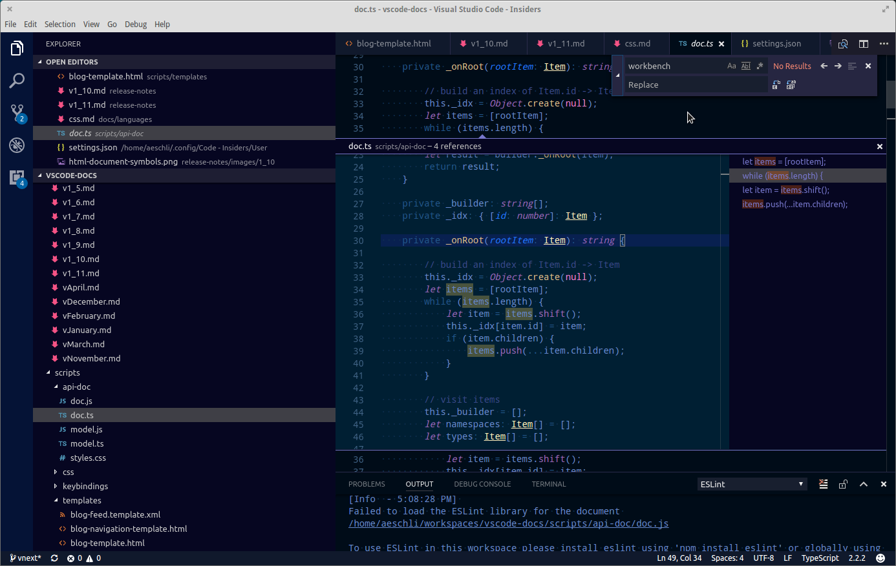

There are still several gaps and we have not finalized the new theme file format. For that reason, there's no documentation and we ask theme authors to not use the new theme format yet.

However, if you want to play around with new colors, use the setting `workbench.experimental.colorCustomizations` to customize the currently selected theme.

 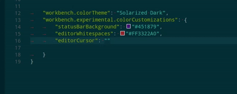

### Keyboard shortcuts editor

With this release, VS Code provides a rich and easy keyboard shortcuts editing experience using a new **Keyboard Shortcuts** editor. You can now find a command and change/remove/reset its key binding easily. Most importantly, you can see key bindings according to your keyboard layout, instead of mapping keys in the earlier json-based key bindings editor to your keyboard layout. The dialog to enter key bindings will assign the correct and desired key binding as per your keyboard layout.

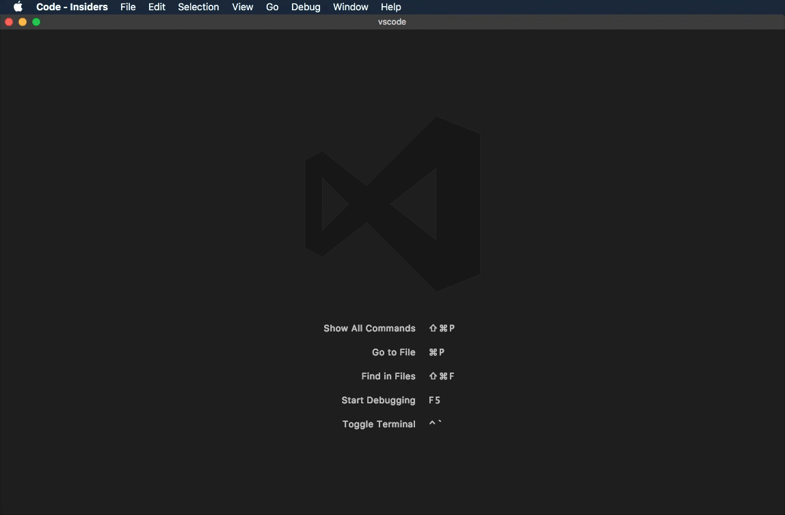

**NOTE:** For more advanced customizations like editing `when` clause context of a key binding, you can open the `keybindings.json` file just like before and edit.

### Improved keyboard layout support

On Windows and macOS, we now detect when the keyboard layout has been switched while VS Code is running and will update all keyboard shortcuts appropriately.

On Linux and macOS, we have made significant changes in how keyboard shortcuts are dispatched; we have switched to using the brand new [`KeyboardEvent.code`](https://developer.mozilla.org/en-US/docs/Web/API/KeyboardEvent/code). This new dispatching logic will result in changes in default keyboard shortcuts for non-US standard keyboard layouts. Unfortunately, due to the indeterminate nature of `KeyboardEvent.keyCode` on these platforms, we cannot be sure in each case the exact changed keybindings and present a list. In most cases, we expect the impact to be limited to the following built-in actions:

* `Toggle Integrated Terminal`
* `Create New Integrated Terminal`
* `Zoom in`, `Zoom out`
* `Indent Line`, `Outdent Line`
* `Fold`, `Unfold`
* `Split Editor`
* `Toggle Line Comment`

You can read more in [our wiki](https://github.com/Microsoft/vscode/wiki/Keybinding-Issues) or in the [plan item](https://github.com/Microsoft/vscode/issues/17521).

> Note: If you experience issues with `KeyboardEvent.code` based dispatching on macOS or Linux, you can use the setting `"keyboard.dispatch": "keyCode"` to force VS Code to dispatch on `KeyboardEvent.keyCode`.

### Text search improvements

Search is now powered by the excellent tool [ripgrep](https://github.com/BurntSushi/ripgrep), from Andrew Gallant ([@BurntSushi](https://github.com/BurntSushi)), and searching should now be significantly faster. If you encounter an issue and need to revert to the previous search experience, you can set the option `"search.useRipgrep": false`.

Our ripgrep-based search can now respect `.gitignore` files as well. Enable it with the new **Use Ignore Files** button in the Search view, or by default with `"search.useIgnoreFilesByDefault": true`.

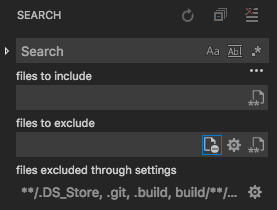

The gear icon next to it is also new, and toggles whether search will ignore the patterns specified in the `files.exclude` and `search.exclude` settings.

### Maximize and restore the panel size

We have added a maximize/restore button to the panel title area:

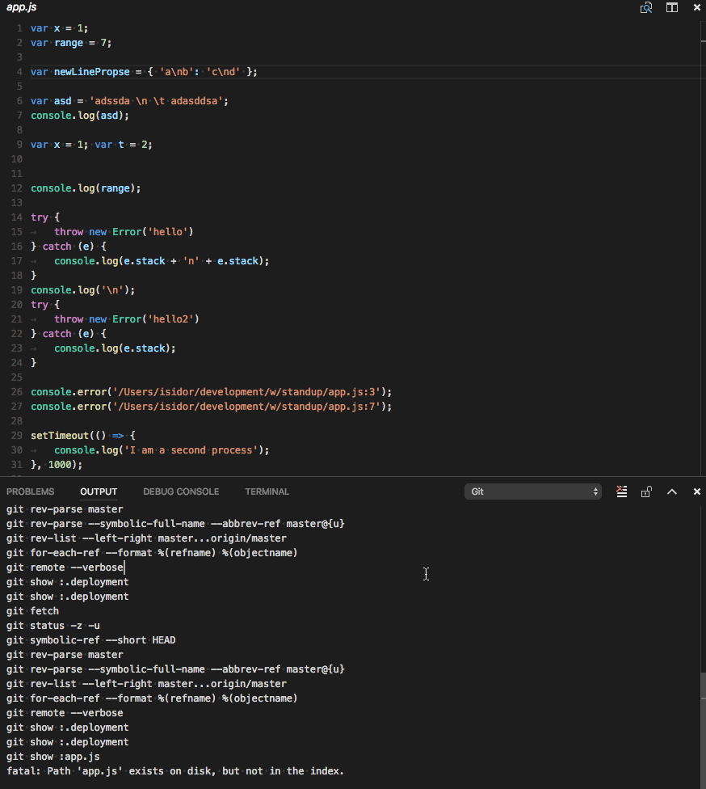

### New setting to keep editor open even when file is deleted

There is a new setting `workbench.editor.closeOnFileDelete` that can be set to `false` to keep editors open even if the file was deleted on disk. Editors will indicate if the file was deleted on disk with their label.

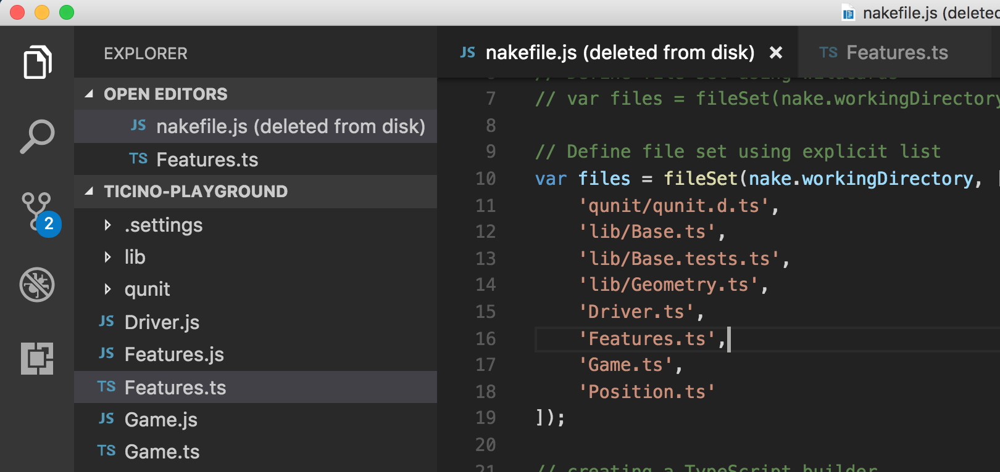

**Note**: Files that get deleted via the Explorer will still cause the editor to close.

### Join editors of two groups

A new command (`workbench.action.joinTwoGroups`) was added to join the editors of one group with the one to the left. This allows to quickly reduce the number of opened editor groups without losing any of the editors inside.

### Navigate between views

New commands have been added to navigate between the visible views of the application. For example, when focus is inside the first editor group, `workbench.action.navigateLeft` will bring you to the Side Bar. Similar, `workbench.action.navigateDown` would move focus to the panel.

### Resize a view with keyboard

New commands are available to resize the currently focused view with the keyboard. Use `workbench.action.increaseViewSize` and `workbench.action.decreaseViewSize` to change the view size in increments.

### New setting to reveal editor if opened

A new setting `workbench.editor.revealIfOpen` can be enabled to prevent opening the same file in another group if the file was already opened. One common scenario is the file picker (Quick Open): by default, it will open a file in the current active Editor Group. Changing this setting will prefer to open the file in any of the other groups in case the file is already opened there.

**Note**: There are still ways that the same editor will open in multiple groups, for example when you click the split editor action.

## Editor

### Drag and drop improvements

You can now copy selected text instead of moving it when you drag and drop. The experience is the same as you have on your platform. On macOS, press and hold the `Option` key while you drag and drop. Press the `kbstyle(Ctrl)` key on Windows and press the `kbstyle(Alt)` key on Linux.

When you drag and drop with or without copying the text, the style of the mouse pointer will change accordingly. You will see a `+` (plus) image when copying.

 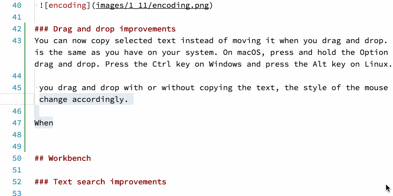

### Git extension enabled

The [new Git source control extension](https://code.visualstudio.com/updates/v1_10#_contributable-scm-providers) is now enabled by default. This Git integration goes through the same [extension points](#source-control) as third-party SCM providers. We're still working on the Git extension and if you'd like to go back to the previous version, you can run the **SCM: Disable Preview SCM** command to switch back.

You can quickly tell if the Git extension is enabled by looking at the **Activity Bar** icon. The new SCM provider integration will show a merge icon instead of the Git icon:


### Turn off occurrences highlight

There is a new option, `editor.occurrencesHighlight` that can be set to `false` to turn off highlighting of the selected word or word under cursor in cases where these highlights are computed by a rich language service.

### Auto guess encoding of files

You can now let VS Code guess the encoding of a file automatically via the new `files.autoGuessEncoding` setting which is disabled by default. Once enabled, we will do an attempt at guessing the encoding from the file and use that information if there is a suitable encoding detected.

**Note**: there are cases where the encoding is detected wrongly or not at all. To have full control over the encoding in the workspace, use the `files.encoding` setting instead.

On top of that, if you select the encoding picker on a file to change its encoding, we will now present you the guessed encoding (if any) to the top of that list, making it very easy to pick the right encoding in case the file contents are not showing correctly and we can detect the encoding from the contents:

 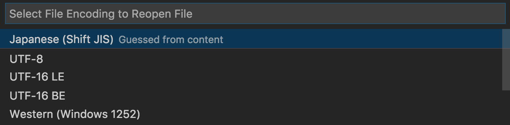

 **Note**: The encoding is guessed, and can be wrong. There is no 100% accurate way to find the encoding from the contents of a file. The only exception is using a BOM (byte order mark) for UTF-8 or UTF-16 files.

### More Fuzzy Matching

We have improved the filtering and scoring of suggestions. In addition to prefix and camel-case matching continuous substring matching is supported.

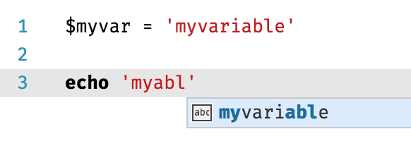

### IntelliSense in comments

There is no more eager IntelliSense when typing in comments or strings! You can still request completions with `kbstyle(Ctrl+Space)` but quick suggestions, AKA "24x7 IntelliSense", are disabled by default in comments and strings. To tune the suggestions behavior to your needs, we now allow more control over the `editor.quickSuggestions` setting:

```json
"editor.quickSuggestions": {
    "comments": false, // <- no 24x7 IntelliSense in comments
    "strings": true, // but in strings and the other parts of source files
    "other": true,
}
```

### Set the default language for new files

A new setting `files.defaultLanguage` can be used to set the language mode for new files that are untitled and not saved yet. This setting avoids having to pick the language each time you open a new file if you are often working on the same file type.

## Integrated Terminal

### Link improvements

The terminal links feature that was introduced last month got some more polish this version. The experience is now aligned with the editor, requiring `kbstyle(Ctrl)` or `kbstyle(Cmd)` to be held depending on your platform.

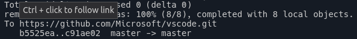

Also all links are now validated so only links that actually go somewhere will react to user action.

### Improved start experience on Windows

Unlike on macOS and Linux with their `SHELL` environment variable, Windows doesn't really have a reliable alternative. There is `COMSPEC` but unfortunately it always defaults to the 32-bit variant of Command Prompt and it's seldom modified. To work around this, we've introduced a message when the terminal is first launched on Windows that allows users to select from a set of shells detected on the machine.

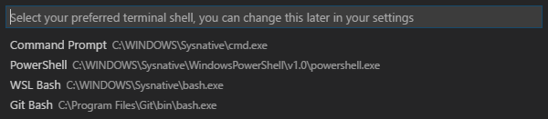

### Custom workspace shell settings

In VS Code v1.9, we disallowed workspace settings from configuring the terminal shell as it could have potentially been exploited maliciously. We are now re-allowing this but requiring an explicit user opt-in for each workspace before the settings will be picked up.


### Warn when closing window with active terminal sessions

The new setting `terminal.integrated.confirmOnExit` has been added that presents a confirmation dialog when the window is closing with active terminal sessions. This is disabled by default.

### Resizing horizontally no longer discards data

Thanks to an [upstream PR](https://github.com/sourcelair/xterm.js/pull/616) from [Lucian Buzzo](https://github.com/LucianBuzzo), data is no longer discarded when resizing the terminal prompt horizontally.

## Tasks

In this release, we opened up tasks for contributions from extensions. They can contribute problem patterns and problem matchers via the extension's `package.json` file. These contributions work in both the output panel runner and in the new (not yet the default) terminal runner. Below an example to contribute a problem matcher for the gcc compiler in an extension:

```ts
{
  "contributes": {
    "problemMatchers": [
      {
          // the name of the problem matcher
          "name": "gcc",
          // The problem is owned by the cpp language service.
          "owner": "cpp",
          // The file name for reported problems is relative to the opened folder.
          "fileLocation": ["relative", "${workspaceRoot}"],
          // The actual pattern to match problems in the output.
          "pattern": {
              // The regular expression. Example to match: helloWorld.c:5:3: warning: implicit declaration of function ‘prinft’ [-Wimplicit-function-declaration]
              "regexp": "^(.*):(\\d+):(\\d+):\\s+(warning|error):\\s+(.*)$",
              // The first match group matches the file name which is relative.
              "file": 1,
              // The second match group matches the line on which the problem occurred.
              "line": 2,
              // The third match group matches the column at which the problem occurred.
              "column": 3,
              // The fourth match group matches the problem's severity. Can be ignored. Then all problems are captured as errors.
              "severity": 4,
              // The fifth match group matches the message.
              "message": 5
          }
      }
    ]
  }
}
```

This problem matcher can now be used in a tasks.json via a name reference `$gcc`. An example looks like this:

```ts
{
    "version": "0.1.0",
    "command": "gcc",
    "args": ["-Wall", "helloWorld.c", "-o", "helloWorld"],
    "problemMatcher": "$gcc"
}
```

We also now allow extensions to contribute tasks to the `Run Task` Quick Pick list programmatically. This opens VS Code up for use cases where an extension wants to add support for a specific build system and wants to contribute corresponding tasks. An example is the npm extension that can now contribute scripts defined in the `package.json` as tasks to VS Code programmatically.

Please note the following limitations:

- Contributed tasks can only be executed in the new terminal runner. To enable the terminal runner, add `"version": "2.0.0"` to your `tasks.json` file.
- The task API is currently in proposed state.

For an example of how to use the API, please refer to VS Code's [gulp extension](https://github.com/Microsoft/vscode/tree/master/extensions/gulp) or the proposed API [file](https://github.com/Microsoft/vscode/blob/master/src/vs/vscode.proposed.d.ts)

## Languages

### TypeScript 2.2.2

VS Code now ships with TypeScript 2.2.2. This release includes a number of important bug fixes and performance improvements. You can find a complete list of changes [here](https://github.com/Microsoft/TypeScript/milestone/40?closed=1).

### Implementation CodeLens for TypeScript

We now include a CodeLens that shows the number of implementers of interfaces and abstract classes in TypeScript code.

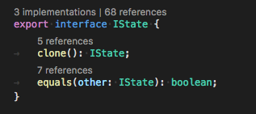

Clicking on the CodeLens will display a list of all implementations.

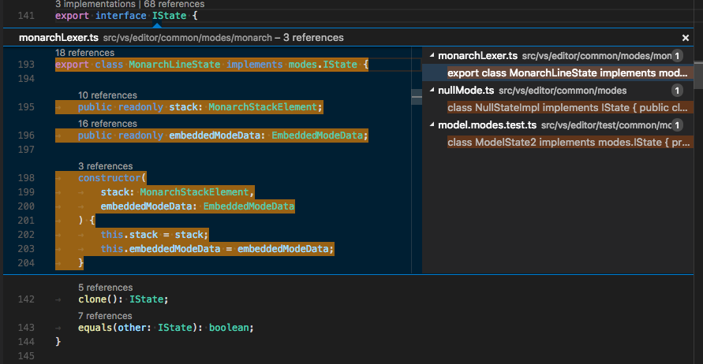

This feature is disabled by default and requires TypeScript 2.2.1+. To enable it, add `"typescript.implementationsCodeLens.enabled": true` to your settings.

### Simplified TypeScript server log collection

Added a new `"typescript.tsserver.log"` setting to simplify the collection of logs from the TypeScript server that powers VS Code's TypeScript and JavaScript language support. These logs can be used to debug issues with JS and TS language support, and make it easier for users to provide these logs during issue investigations.

The new logging experience is supported with TypeScript 2.2.2+. Set `"typescript.tsserver.log": "verbose"` and reload VS Code to enable logging to a file. Use the `"TypeScript: Open TS Server log"` command to open the log file in the editor.

### Improved support for Objective C++

VS Code now includes an `objective-cpp` language mode for working with Objective-C++. Previously, `.mm` files were treated as regular C++. This release also improves syntax coloring of Objective-C++ files.

## Debugging

### Debug Menu

We have added a top level debug menu with the most common debug commands:

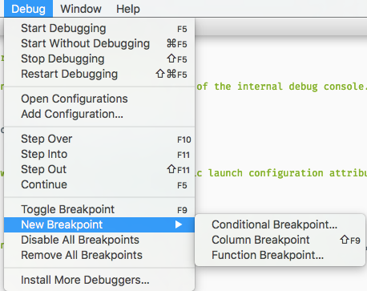

**Note**: There is a new command (**Install Additional Debuggers...**) to bring up the Extension view to search for debugger extensions.

### Column Breakpoints Improvements

It is now possible to edit multiple breakpoints on a line directly from the glyph margin context menu. Apart from this, there were issues with multiple breakpoints on a line which are now fixed.

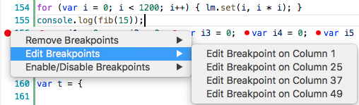

### More detailed exception experience

The editor's "Peek UI" has been enhanced to show additional information for thrown exceptions, For example, VS Code's built-in Node.js debugging now shows the stack trace:

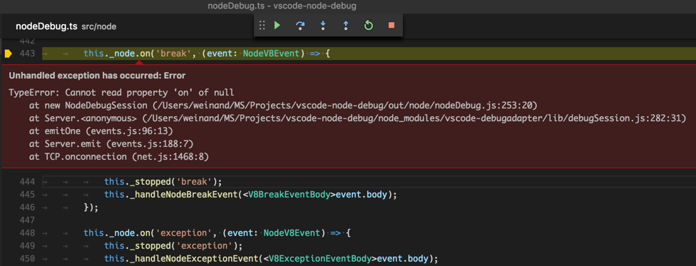

Since this feature requires some adoption effort by debugger extensions, do not expect to see additional exception information in other debugger extensions immediately.

## Node Debugging

### Transitioning to the "inspector" protocol

In the February milestone, we folded the two Node.js debuggers ('node' and 'node2') into a single Node.js debugging experience and introduced a new launch configuration attribute `protocol` to control which protocol to use (for details see the [section in the February release notes](https://code.visualstudio.com/updates/v1_10#_node2-transitioning).

In this milestone, we've changed the default value for `protocol` from `legacy` to `auto`. So if you don't specify the `protocol` explicitly in your launch configuration, VS Code Node.js debugging will now try to detect the protocol used by the targeted runtime automatically. Since we do not want to switch users to the new "inspector" protocol too aggressively, we will use the new protocol only for 8.x versions of Node.js.

If you experience problems with this automatic protocol switching, you can get back to the old behavior by explicitly setting `protocol` to `legacy`.

### Async call stacks

When debugging async JavaScript in Node.js or Chrome, we now show the async frames that led to the current call stack across async calls. This is currently only supported when debugging with the [inspector protocol](https://code.visualstudio.com/updates/v1_10#_node2-transitioning) via `"protocol": "inspector"`. It can be disabled by setting `"showAsyncStacks": false` in the launch config.

Example:

In this code snippet, `fetchData` is an async function that returns a Promise. Without async stacks, we can't see the calls that happened before the Promise was resolved:

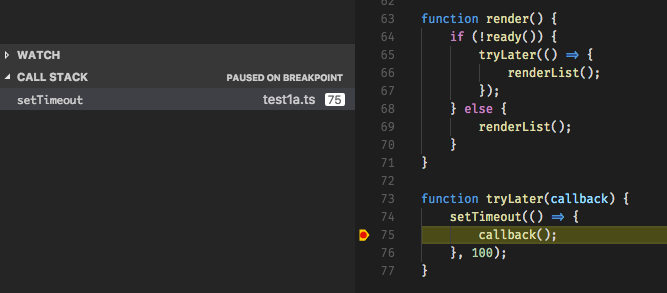


But with the async call stacks, we can see the full call stack that produced the async call:

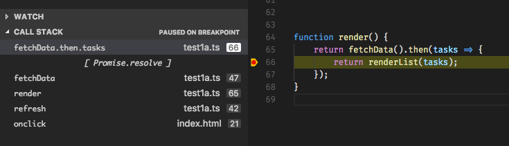

### Access Loaded Scripts

It is now possible to access the loaded scripts of a JavaScript runtime. This is useful if you need to set a breakpoint in a script that is not part of your workspace and therefore cannot be easily located and opened through normal VS Code file browsing. A typical scenario for this is a remote debugging session: you attach to a remote Node.js program and have no code available locally. See issue [#20355](https://github.com/Microsoft/vscode/issues/20355) for other scenarios that drove this enhancement.

The **Debug: Open Loaded Script** action (`kb(extension.node-debug.pickLoadedScript)`) gives you access to loaded scripts while a debug session is active. In the Quick Pick, you can filter and select the script to open. The script is then loaded into a read-only editor where you can set breakpoints. These breakpoints are remembered across debug sessions but you only have access to the script content while a debug session is running.


## Extension Authoring

### Source Control

A stable Source Control API was released this month which lets you create source control extensions integrated within VS Code. You can learn all about it in the [Source Control in VS Code](https://code.visualstudio.com/docs/extensionAPI/api-scm) documentation page.

Some extension developers have already started adopting it:

- [vscode-perforce](https://github.com/stef-levesque/vscode-perforce)

### API Improvements

* The end of line sequence a document uses (`crlf` or `lf`) is now exposed via `TextDocument#eol`. Also, the `TextEdit` allows you to change EOL-sequence of a document.
* We added these new completion item kinds: `Constant`, `Struct`, and `EnumMember` completing the existing `Enum` kind.

### Debug Extensions

* **ExceptionInfoRequest now used by VS Code**

If a debug adapter returns a non-falsy `supportsExceptionInfoRequest` capability, VS Code will now use the `ExceptionInfoRequest` to obtain additional information for the exception. Currently the attributes `exceptionId`, `exception`, `breakMode`, and `details.stackTrace` are displayed in VS Code's exception Peek UI.

* **Server mode for debug adapters**

VS Code always supported running debug adapters in server mode. However this was only officially supported for developing debug adapters, not for running them in production. With this release, we are starting to support the "server mode" as an official "run mode" for debug adapters. Please find the details for how to use this feature in the original [feature request](https://github.com/Microsoft/vscode/issues/22080#issuecomment-286068943).

* **Changed semantics of `StoppedEvent.reason`**

The semantics of the `reason` attribute of `StoppedEvent` has been changed slightly. Previously, it was specified that the reason attribute is shown in the UI (which has the consequence that the value needs to be translated to different languages). This makes it impossible for VS Code to interpret the `reason` attribute in a robust way. Starting with this release, VS Code uses the new attribute `description` when the "stopped" reason needs to be shown in the UI and uses the `reason` attribute to interpret the reason. If `description` is missing, VS Code falls back to the previous behavior.

* **New attribute `presentationHint` for `StackFrame` type**

A new optional attribute `presentationHint` has been added to the `StackFrame` type which can be used to control how the client renders a stack frame in the UI.

* **Usage example for exception configuration API**

The VS Code [Mono debugger extension](https://marketplace.visualstudio.com/items?itemName=ms-vscode.mono-debug) has been enhanced to use the recently introduced `exceptionOptions` attribute on the `SetExceptionBreakpointsRequest` for configuring exception catchpoints.


The [implementation](https://github.com/Microsoft/vscode-mono-debug/blob/master/src/typescript/extension.ts#L90) can serve as an example for how to use the debug adapter protocol (DAP) from an extension to add specific functionality that is not provided by the generic VS Code debugger UI.

### Increase Extension Size Limit

In a collaboration with the Visual Studio Marketplace, we've increased the size limit of extensions in the Marketplace from 20MB to 100MB. You'll need to update to `vsce@1.20.0` to benefit from this.

## Miscellaneous

### Startup profiling for everyone

We have added a new command-line option that allows you to profile the startup of VS Code. Run code like this `code --prof-startup` and it will create profiles for the main and renderer process. These profiles are stored in your home directory and we encourage you to share them with us. Often performance out in the wild is vastly different from our machines and getting more insights from you will help us improve VS Code.

### Coming Soon: Support for community localization

VS Code currently ships with support for [9 languages](https://code.visualstudio.com/docs/getstarted/locales): French, Italian, German, Spanish, Russian, Traditional and Simplified Chinese, Japanese, and Korean. In the March release, we started moving the current internal localization process to support the open translation platform called [Transifex](https://www.transifex.com/).

Once this work is done, we will be able to accept translations from the community directly instead of having to [submit a bug](https://github.com/Microsoft/vscode/issues/5405) and wait for us to localize the string(s).  Even more exciting though, this work enables VS Code to be localized by the community into additional languages such as [Portuguese](https://github.com/Microsoft/vscode/issues/15077) and [Polish](https://github.com/Microsoft/vscode/issues/14241). In fact, we're opening up translations into 8 additional languages: Czech, Dutch, Hungarian, Polish, Portuguese (Brazil and Portugal), Swedish, and Turkish.

If you are passionate about having a high quality VS Code in your native language, please come and help us!  Learn more at the [Visual Studio Code Community Localization Project](https://github.com/Microsoft/Localization/wiki/Visual-Studio-Code-Community-Localization-Project).

## New Commands

Key|Command|Command id
---|-------|----------
`kb(workbench.action.openSettings)`|Open Settings|`workbench.action.openSettings`
`kb(workbench.action.revertAndCloseActiveEditor)`|Revert and Close Active Editor|`workbench.action.revertAndCloseActiveEditor`
`kb(workbench.action.joinTwoGroups)`|Join Editors of Two Groups|`workbench.action.joinTwoGroups`
`kb(workbench.action.navigateUp)`|Move to the View Part Above|`workbench.action.navigateUp`
`kb(workbench.action.navigateDown)`|Move to the View Part Below|`workbench.action.navigateDown`
`kb(workbench.action.navigateLeft)`|Move to the View Part to the Left|`workbench.action.navigateLeft`
`kb(workbench.action.navigateRight)`|Move to the View Part to the Right|`workbench.action.navigateRight`
`kb(workbench.action.increaseViewSize)`|Increase View Size|`workbench.action.increaseViewSize`
`kb(workbench.action.decreaseViewSize)`|Decrease View Size|`workbench.action.decreaseViewSize`

## Notable Changes

* [12077](https://github.com/Microsoft/vscode/issues/12077): File does not reload in editor when quickly changed externally after making modifications
* [13001](https://github.com/Microsoft/vscode/issues/13001): Keep scroll position stable when closing a tab
* [13665](https://github.com/Microsoft/vscode/issues/13665): Improve VS Code when working with network drives
* [19841](https://github.com/Microsoft/vscode/issues/19841): Node debug Step Over/Into hangs in 1.9
* [20074](https://github.com/Microsoft/vscode/issues/20074): VS Code default language extensions override custom language extensions
* [21948](https://github.com/Microsoft/vscode/issues/21948): Auto save no longer works
* [22900](https://github.com/Microsoft/vscode/issues/22900): CPU usage even when idle (due to cursor rendering)
* [22971](https://github.com/Microsoft/vscode/issues/22971): Run the terminal as a login shell by default on macOS
* [22997](https://github.com/Microsoft/vscode/issues/22997): Execute Node.js application in external terminal throws error
* [23494](https://github.com/Microsoft/vscode/issues/23494): Debugger does not work with electron v1.6.x

These are the [closed bugs](https://github.com/Microsoft/vscode/issues?q=is%3Aissue+label%3Abug+milestone%3A%22March+2017%22+is%3Aclosed) and these are the [closed feature requests](https://github.com/Microsoft/vscode/issues?q=is%3Aissue+milestone%3A%22March+2017%22+is%3Aclosed+label%3Afeature-request) for the 1.11 update.

## Contributions to Extensions

Our team maintains or contributes to a number of VS Code extensions. Most notably:

* [Go](https://marketplace.visualstudio.com/items?itemName=ms-vscode.Go)
* [TSLint](https://marketplace.visualstudio.com/items?itemName=eg2.tslint)
* [ESLint](https://marketplace.visualstudio.com/items?itemName=dbaeumer.vscode-eslint)
* [Docker](https://marketplace.visualstudio.com/items?itemName=ms-azuretools.vscode-docker)
* [Debugger for Chrome](https://marketplace.visualstudio.com/items?itemName=msjsdiag.debugger-for-chrome)
* [Mono Debug](https://marketplace.visualstudio.com/items?itemName=ms-vscode.mono-debug)
* [VSCodeVim](https://marketplace.visualstudio.com/items?itemName=vscodevim.vim)

## Thank You

Last but certainly not least, a big *__Thank You!__* to the following folks that helped to make VS Code even better:

Contributions to `vscode`:

* [David Wilson (@daviwil)](https://github.com/daviwil):  Add new "files.defaultLanguage" configuration setting. [PR #23220](https://github.com/Microsoft/vscode/pull/23220)
* [Mackenzie McClane (@Aarilight)](https://github.com/Aarilight):  Add typescript and javascript format.insertSpaceBeforeFunctionParenthesis [PR #21712](https://github.com/Microsoft/vscode/pull/21712)
* [Anand Dyavanapalli (@adyavanapalli)](https://github.com/adyavanapalli):  TypeScript should use double quotes for string in import snippet. [PR #22255](https://github.com/Microsoft/vscode/pull/22255)
* [Adrian Perez (@aperezdc)](https://github.com/aperezdc):  Make more descriptive appdata summary field [PR #22965](https://github.com/Microsoft/vscode/pull/22965)
* [Christopher Leidigh (@cleidigh)](https://github.com/cleidigh):  Feature/part resize: Add key bindings to resize focused view [PR #22861](https://github.com/Microsoft/vscode/pull/22861)
(https://github.com/Microsoft/vscode/pull/10676)
* [@cristianhosu](https://github.com/cristianhosu):  Feature #22768 [PR #23049](https://github.com/Microsoft/vscode/pull/23049)
* [Drazen Dotlic (@ddotlic)](https://github.com/ddotlic):  Add option to always reuse open editors [PR #21815](https://github.com/Microsoft/vscode/pull/21815)
* [Dustin Campbell (@DustinCampbell)](https://github.com/DustinCampbell):  Update to latest C# TextMate grammar [PR #23179](https://github.com/Microsoft/vscode/pull/23179)
* [Felipe Sateler (@fsateler)](https://github.com/fsateler):  Add gnupg and apt to depends [PR #20988](https://github.com/Microsoft/vscode/pull/20988)
* [Cody Hoover (@hoovercj)](https://github.com/hoovercj)
  *  quickopen and quickoutline will now show the field icon for field symbols [PR #21318](https://github.com/Microsoft/vscode/pull/21318)
  *  Add backwards search to preferences view [PR #22556](https://github.com/Microsoft/vscode/pull/22556)
  *  Follow up to PR #22021 to respond to feedback [PR #22178](https://github.com/Microsoft/vscode/pull/22178)
  *  Add ability to open untitled document with initial content [PR #22021](https://github.com/Microsoft/vscode/pull/22021)
* [Anton Vildyaev (@hun1ahpu)](https://github.com/hun1ahpu):  Add 'Focus to terminal X' action [PR #20862](https://github.com/Microsoft/vscode/pull/20862)
* [Ong Heng Le (@initialshl)](https://github.com/initialshl):  Implement join editors command [PR #22389](https://github.com/Microsoft/vscode/pull/22389)
* [katainaka (@katainaka0503)](https://github.com/katainaka0503)
  *  Refactor to fix compile error with noImplicitAny [PR #22460](https://github.com/Microsoft/vscode/pull/22460)
  *  Auto guess encoding [PR #21416](https://github.com/Microsoft/vscode/pull/21416)
  *  Refactor to use Promise [PR #21582](https://github.com/Microsoft/vscode/pull/21582)
* [Phawin Khongkhasawan (@lifez)](https://github.com/lifez):  Provide "terminal.integrated.enableBold" setting connected to #22422 [PR #22465](https://github.com/Microsoft/vscode/pull/22465)
* [Mark Pearce (@markwpearce)](https://github.com/markwpearce):  Checks integrated terminal output for more types of relative paths [PR #22602](https://github.com/Microsoft/vscode/pull/22602)
* [Soo Jae Hwang (@misoguy)](https://github.com/misoguy)
  *  Add Command for navigating around visible editors/viewlets/repl [PR #22005](https://github.com/Microsoft/vscode/pull/22005)
  *  Add API to force quit with the ability to revert changes silently [PR #21593](https://github.com/Microsoft/vscode/pull/21593)
* [Paul Daniel Faria (@Nashenas88)](https://github.com/Nashenas88):  Fix borderRadius for decorations [PR #22186](https://github.com/Microsoft/vscode/pull/22186)
* [Nick Snyder (@nicksnyder)](https://github.com/nicksnyder)
  *  Remove duplicate calls to URI.toString() [PR #21283](https://github.com/Microsoft/vscode/pull/21283)
  *  Avoid request id collisions in pendingRPCReplies [PR #21406](https://github.com/Microsoft/vscode/pull/21406)
* [Jonas Luebbers (@nonphoto)](https://github.com/nonphoto):  Make overview ruler border less obtrusive [PR #21459](https://github.com/Microsoft/vscode/pull/21459)
* [Richard Min (@richardmin)](https://github.com/richardmin):  Support `...` terminating Yaml FrontMatter [PR #23195](https://github.com/Microsoft/vscode/pull/23195)
* [@rpjproost](https://github.com/rpjproost):  Fixed keybinding json for backslash [PR #21969](https://github.com/Microsoft/vscode/pull/21969)
* [Naveen Kumar (@timbanaveen)](https://github.com/timbanaveen):  Adding check of full folder name instead of suffix [PR #22532](https://github.com/Microsoft/vscode/pull/22532)
* [Peter V (@vp2177)](https://github.com/vp2177):  Exclude CVS directories [PR #22024](https://github.com/Microsoft/vscode/pull/22024)
* [@vsobotka](https://github.com/vsobotka):  Fixed typo - fourth instead if forth [PR #22967](https://github.com/Microsoft/vscode/pull/22967)
* [Wissam Abirached (@wabirached)](https://github.com/wabirached):  Correctly duplicate files with numbers in filename [PR #22907](https://github.com/Microsoft/vscode/pull/22907)
* [Nicolas Ramz (@warpdesign)](https://github.com/warpdesign):  Fixed typo [PR #22921](https://github.com/Microsoft/vscode/pull/22921)
* [Wim Spaargaren (@wimspaargaren)](https://github.com/wimspaargaren):  proposal to fix issue 21600 [PR #21859](https://github.com/Microsoft/vscode/pull/21859)

Contributions to `vscode-chrome-debug-core`:

* [Manoj Patel (@nojek)](https://github.com/nojvek)
  * Support source mapping of stack traces in the Debug Console (and exception widget) [PR #190](https://github.com/Microsoft/vscode-chrome-debug-core/pull/190)
  * Nicer error messages when a source map fails to parse [PR #188](https://github.com/Microsoft/vscode-chrome-debug-core/pull/188)
* [Daniel Lebu (@dlebu)](https://github.com/dlebu): Allowing upper case drive letters when handling script URLs. [PR #176](https://github.com/Microsoft/vscode-chrome-debug-core/pull/176)

Contributions to `language-server-protocol`:

* [Lucian Wischik (@ljw1004)](https://github.com/ljw1004): DidChange might only have new text [PR #168](https://github.com/Microsoft/language-server-protocol/pull/198)

Contributions to `vscode-languageserver-node`:

* [Guillaume Martres (@smarter)](https://github.com/smarter): client: Pass all arguments to ExecuteCommandRequest [PR #172](https://github.com/Microsoft/vscode-languageserver-node/pull/172)
* [Hyo Jeong (@asiandrummer)](https://github.com/asiandrummer): export SocketMessage reader/writer [PR #185](https://github.com/Microsoft/vscode-languageserver-node/pull/185)

Contributions to `vscode-generator-code`:

* [@rakkarage](https://github.com/rakkarage):  Update vsc-extension-quickstart.md [PR #67](https://github.com/Microsoft/vscode-generator-code/pull/67)
* [John Lianoglou (@prometheas)](https://github.com/prometheas):  Making 'Folder name' prompt optional [PR #70](https://github.com/Microsoft/vscode-generator-code/pull/70)

<!-- In-product release notes styles.  Do not modify without also modifying regex in gulpfile.common.js -->
<a id="scroll-to-top" role="button" aria-label="scroll to top" href="#"><span class="icon"></span></a>
<link rel="stylesheet" type="text/css" href="css/inproduct_releasenotes.css"/>
