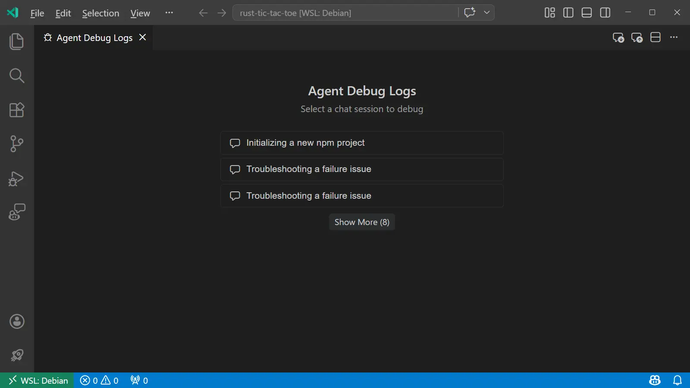
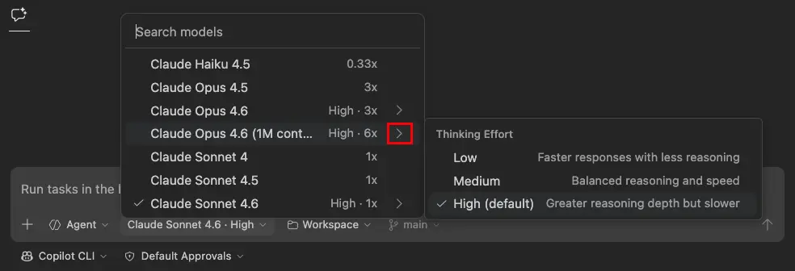
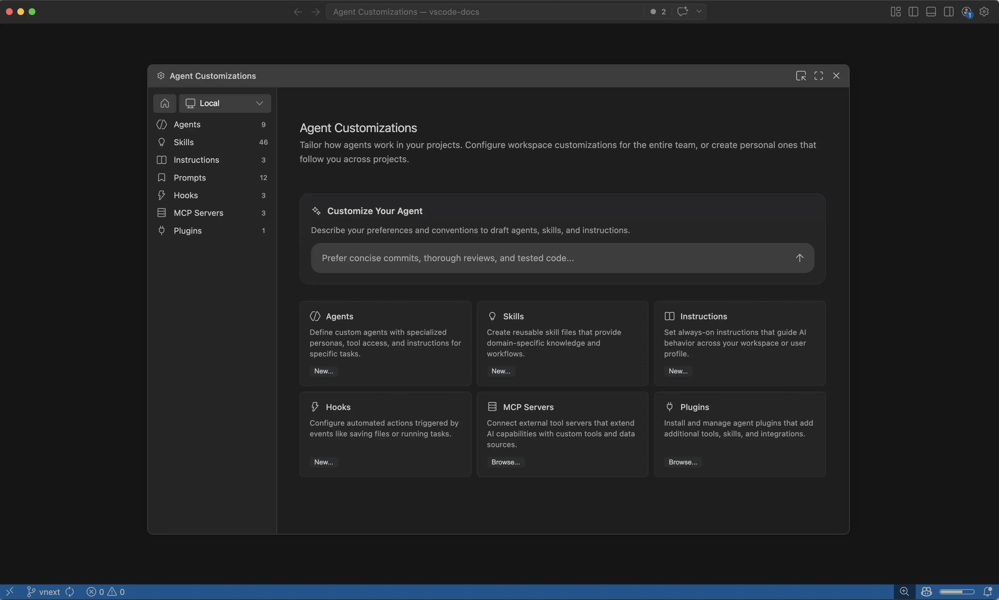
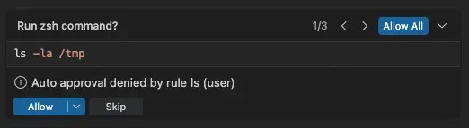
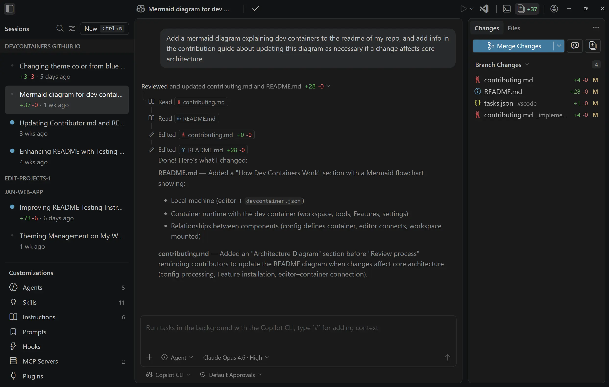
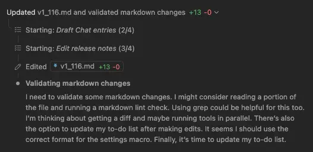

# Visual Studio Code 1.116

Follow us on [LinkedIn](https://www.linkedin.com/showcase/vs-code), [X](https://go.microsoft.com/fwlink/?LinkID=533687), [Bluesky](https://bsky.app/profile/vscode.dev) | <!-- %IF INSIDERS % Follow Insiders Changelog on [X](https://x.com/VSCodeChangelog) or [Bluesky](https://bsky.app/profile/vscodechangelog.bsky.social) | %ENDIF % --> <!-- %IF IN_PRODUCT % [View online](https://code.visualstudio.com/updates)&nbsp;|&nbsp;%ENDIF % -->

---

_Release date: April 15, 2026_

<!-- DOWNLOAD_LINKS_PLACEHOLDER -->

---

Welcome to the 1.116 release of Visual Studio Code. This release continues to make working with chat and agents more powerful and efficient. Here are some highlights of what's new:

* [Agent Debug Logs](#debug-previous-agent-sessions): view logs from previous agent sessions to understand and debug agent interactions.

* [Copilot CLI thinking effort](#configure-thinking-effort-in-copilot-cli): configure model thinking effort in Copilot CLI to balance response quality and latency.

* [Terminal agent tools](#terminal-tools): interact with any terminal session from your agent sessions.

* [GitHub Copilot built-in](#github-copilot-is-now-built-in): start using AI without having to install the GitHub Copilot Chat extension.

Happy Coding!

---

<!-- %IF STABLE %
VS Code is rolling out gradually to all users. Use **Check for Updates** in VS Code to get the latest version immediately.

To try new features as soon as possible, [**download the nightly Insiders build**](https://code.visualstudio.com/insiders), which includes the latest updates as soon as they are available.

---
%ENDIF % -->

<!-- TOC

  <nav id="toc-nav">
    
In this update

    <ul>
      <li><a href="#agent-experience">Agent experience</a></li>
      <li><a href="#terminal-tools">Terminal tools</a></li>
      <li><a href="#chat-ux">Chat UX</a></li>
      <li><a href="#accessibility">Accessibility</a></li>
      <li><a href="#integrated-browser">Integrated browser</a></li>
      <li><a href="#languages">Languages</a></li>
      <li><a href="#engineering">Engineering</a></li>
      <li><a href="#contributions-to-extensions">Contributions to extensions</a></li>
      <li><a href="#deprecated-features-and-settings">Deprecated features and settings</a></li>
      <li><a href="#thank-you">Thank you</a></li>
    </ul>
  </nav>
  

Navigation End -->

## Agent experience

### Debug previous agent sessions

**Setting**: `setting(github.copilot.chat.agentDebugLog.fileLogging.enabled)`

The Agent Debug Log panel shows a chronological event log of agent interactions during a chat session, which is useful for understanding what happens when you send a prompt and to debug chat customizations.

You can now view the log for the current session as well as previous sessions, with logs persisted locally on disk. This enables you to review and debug past agent interactions even after the session has ended.

The setting to enable the Agent Debug Logs panel is now merged into the troubleshooting setting `setting(github.copilot.chat.agentDebugLog.fileLogging.enabled)`.

Learn more about the [Agent Debug Logs panel](https://code.visualstudio.com/docs/copilot/chat/chat-debug-view#_agent-debug-log-panel) in the documentation.

### Configure thinking effort in Copilot CLI

Similar to local agent sessions, you can now configure the thinking effort for reasoning models in Copilot CLI sessions with the language model picker. Thinking effort controls how much reasoning the model applies to each request, which can help balance response quality and latency based on your needs.

Choose a reasoning model in the picker and select the arrow to reveal the available effort levels. The available effort levels might vary by model. Non-reasoning models do not show the submenu.

Learn more about [thinking effort and reasoning](https://code.visualstudio.com/docs/copilot/concepts/language-models#_thinking-and-reasoning) in the documentation.

### Customizations welcome page

The Chat Customizations dialog, available via the **Chat: Open Customizations** command or the gear icon in the Chat view, now has a welcome page that gives you an overview of all your agent customizations.

Creating customizations might be daunting at first, so you can now use the **Customize Your Agent** input on the welcome page to let VS Code draft customizations like agents, skills, and instructions based on a natural language description.

<video src="images/1_116/customize-agent-welcome-page.mp4" title="Video showing the Chat Customizations welcome page and the Customize Your Agent input." autoplay loop controls muted></video>

Learn more about customizing agents in the [agent customization documentation](https://code.visualstudio.com/docs/copilot/customization/overview).

### Tool confirmation carousel (Experimental)

**Setting**: `setting(chat.tools.confirmationCarousel.enabled)`

To make approving or rejecting multiple tool calls more efficient, chat now shows a carousel control for tool confirmations. The carousel gives you a compact and navigable way to review and approve multiple tool calls in sequence without scrolling through the conversation.

This feature is experimental and controlled by the `setting(chat.tools.confirmationCarousel.enabled)` setting. It is enabled by default in VS Code Insiders and is gradually rolling out to Stable as we collect feedback.

### Visual Studio Code Agents (Insiders)

> **Note**: The Visual Studio Code Agents app is currently in preview and only available when installing VS Code Insiders.

In the last release, we shared the **Visual Studio Code Agents** app, a new preview companion app that ships alongside VS Code Insiders and is built for agent-native development.

Since introducing the app in 1.115, we've continued to iterate with features and fixes based on feedback, to deliver a great agent-first experience.

Some of the latest updates include:

* **Reasoning level selection**: as mentioned above, you can now configure thinking effort for reasoning models in Copilot CLI sessions.
* **Plan mode handling**: for CLI sessions involving planning, plan mode will automatically kick in.
* **Files tab shown by default in Changes**: the **Files** tab now shows by default in the Changes panel.
* **Session response, theming, and rendering improvements**: a range of refinements to response handling, visual consistency, and rendering performance.
* **App name**: We've renamed the app to **Visual Studio Code Agents - Insiders**.

We've added a new entry point to `Try out the new Agents app` from the VS Code welcome page:

You can also still open the app via the same methods as in 1.115:

* Launch **Visual Studio Code Agents - Insiders** from your Start menu or Applications folder in the OS.
* Run **Chat: Open Agents Application** from the Command Palette.

## Terminal tools

### Foreground terminal support for agent tools

The `send_to_terminal` and `get_terminal_output` agent tools now also work with foreground terminals and not just background terminals that were created by the agent. This means that the agent can read output from and send input to any terminal visible in the terminal panel, such as a running REPL or an interactive script.

### Terminal input improvements

This release includes several improvements to the experience for terminal input in agent sessions:

* **Detect terminal input**: The LLM-based prompt-for-input detection is removed. Previously, every terminal output chunk triggered an extra LLM call to classify whether the terminal was waiting for input, which added latency and used extra tokens. The agent now handles terminal input directly via `send_to_terminal` and uses the question carousel to defer to you when needed.

* **Progress messages**: When the agent sends answers to the terminal, the progress message now shows which question is being answered, for example: `Sending "my-project" to terminal (replying to: What is your project name?)`.

* **Focus Terminal**: When the agent needs terminal input, like when prompting for a password or an interactive installer like `npm init`, the question carousel now includes a **Focus Terminal** button. Select it to focus the relevant terminal and type your response directly. If you start typing in the terminal while the carousel is open, it automatically dismisses and informs the agent that you are handling the input directly.

<video src="images/1_116/terminal-prompt-for-input.mp4" title="Video showing the question carousel for terminal input with a Focus Terminal button." autoplay loop controls muted></video>

### Background terminal notifications enabled by default

**Setting**: `setting(chat.tools.terminal.backgroundNotifications)`

Background terminal notifications are now enabled by default. When the agent runs a command in a background terminal, it automatically receives notifications when the command completes, times out, or requires input. This enables the agent to respond more quickly and accurately without needing to poll for terminal output.

## Chat UX

This release includes a few UX improvements to chat:

* **Diffs in the top level**: Code diffs now render directly in the chat conversation, so you can review proposed changes without switching context to a separate diff view.

    

* **Rendering performance**: Chat responses should now render faster, with added improvements including reduced layout thrashing and more efficient incremental updates during streaming.
Also fixes an issue where rapid bursts of tool invocation updates cause brief hangs in the extension host.

* **Chat send performance**: Fixes an issue where chat message sending is blocked by loading chat customizations. The message now visually appears in the chat conversation immediately even if prompts are still loading.

* **Subagent progress**: The expanded view for subagent progress is now more visually distinct, making it easier to follow when a subagent is in progress.

## Accessibility

### Agents app accessibility

The Agents app, available in VS Code Insiders, now includes comprehensive accessibility support for keyboard and screen reader users.

* **Accessibility help dialog**: Press `kbstyle(Alt+F1)` (`kbstyle(Option+F1)` on macOS) while the chat input is focused to open the accessibility help dialog. It provides an overview of what the Agents app is, lists available views, and shows keybindings for navigating between them.

* **Keyboard navigation commands**: New keybindings let you quickly focus key views in the Agents app:
    * `Focus Changes View` (`kb(workbench.action.agentSessions.focusChangesView)`)
    * `Focus Chat Customizations View` (`kb(aiCustomization.focusView)`)
    * `Focus Files Explorer View` (`kb(workbench.action.agentSessions.focusChangesFileView)`)

    These keybindings are scoped to the Agents window and do not override their standard VS Code counterparts.

* **Verbosity setting**: The `setting(accessibility.verbosity.sessionsChat)` setting controls whether the chat input announces an ARIA hint about opening accessibility help. Disable it to suppress the announcement.

* **ARIA labels and landmarks**: The auxiliary bar is now marked as a complementary landmark with a descriptive label, workspace picker buttons have meaningful ARIA labels, and session list items include creation time context.

### Screen reader instructions for keyboard shortcuts search results

When searching in the Keyboard Shortcuts editor, the screen reader now announces instructions for navigating to the search results. NVDA and other screen readers announce "Use Ctrl+Down Arrow to access the searched shortcut details", so you can quickly navigate to the results table. You can disable this announcement with the `setting(accessibility.verbosity.keyboardShortcuts)` setting.

## Integrated browser

The [integrated browser](https://code.visualstudio.com/docs/debugtest/integrated-browser) is now easier to access thanks to two new entry points:

* The **View** menu, under **View** > **Browser**
* The keyboard shortcut `kb(workbench.action.browser.openFromViewMenu)`
<!-- shortcut `Ctrl+Alt+/` (`⌥⌘/` on macOS) -->

These actions open the integrated browser if no tabs are open, or let you quickly see and jump to existing tabs.

These new entry points are in addition to the previously existing ones:

* The **Browser: Open Integrated Browser** command
* Link clicks to localhost sites (`setting(workbench.browser.openLocalhostLinks)`)
* The title bar icon (`setting(workbench.browser.showInTitleBar)`)
* Ask an agent to open or interact with the browser (`setting(workbench.browser.enableChatTools)`)

## Languages

### JS/TS Chat Features extension (Preview)

**Setting**: `setting(jsts-chat-features.skills.enabled:true)`

The new builtin JS/TS Chat Features extension enhances Copilot's skills to work with TypeScript and JavaScript. For this first release, the extension contributes skills for setting up modern TypeScript projects. We plan to enhance and expand its functionality in a future release.

To try these skills today, enable the `setting(jsts-chat-features.skills.enabled:true)` setting.

## Engineering

### GitHub Copilot is now built-in

GitHub Copilot Chat is now a built-in extension in VS Code. New users no longer need to install any extension to start using Copilot features such as chat, inline suggestions, and agents. Copilot is available out of the box as part of the standard VS Code installation.

This change is part of our ongoing effort to make VS Code the open source AI code editor. By shipping Copilot as a built-in extension, we reduce friction for new users and ensure that AI-powered features are seamlessly integrated from the first launch.

Existing users are not affected by this change. If you already have the Copilot extension installed, it continues to work as before.

As before, if you prefer not to use AI features, you can disable them with the `setting(chat.disableAIFeatures)` setting.

## Contributions to extensions

### GitHub Pull Requests

There has been more progress on the [GitHub Pull Requests](https://marketplace.visualstudio.com/items?itemName=GitHub.vscode-pull-request-github) extension, which enables you to work on, create, and manage pull requests and issues. New features include:

* Add a chat tool for creating pull requests.
* Worktrees can also be deleted from the "Delete Local Branches and Remotes" command.

Review the [changelog for the 0.136.0](https://github.com/microsoft/vscode-pull-request-github/blob/main/CHANGELOG.md#01360) release of the extension to learn about everything in the release.

## Deprecated features and settings

### New deprecations in this release

None

### Upcoming deprecations

* **Edit Mode** is officially deprecated as of VS Code version 1.110. Users can temporarily re-enable Edit Mode via VS Code setting `setting(chat.editMode.hidden)`. This setting will remain supported through version 1.125. Beginning with version 1.125, Edit Mode will be fully removed and can no longer be enabled via settings.

## Thank you

Contributions to our issue tracking:

* [@gjsjohnmurray (John Murray)](https://github.com/gjsjohnmurray)
* [@RedCMD (RedCMD)](https://github.com/RedCMD)
* [@IllusionMH (Andrii Dieiev)](https://github.com/IllusionMH)
* [@albertosantini (Alberto Santini)](https://github.com/albertosantini)

Contributions to `vscode`:

* [@AndreasArvidsson (Andreas Arvidsson)](https://github.com/AndreasArvidsson): Fix TextmateSnippet clone method to correctly assign _children [PR #295555](https://github.com/microsoft/vscode/pull/295555)
* [@gryan11 (Gabriel Ryan)](https://github.com/gryan11): Fix: add missing override modifiers in test mock class [PR #308558](https://github.com/microsoft/vscode/pull/308558)
* [@maruthang (Maruthan G)](https://github.com/maruthang)
  * fix: preserve code block toolbar visibility during chat streaming [PR #307978](https://github.com/microsoft/vscode/pull/307978)
  * fix: strip ANSI escape codes from inline test output messages [PR #308161](https://github.com/microsoft/vscode/pull/308161)
  * fix: resolve default view for markdown files on first startup [PR #308739](https://github.com/microsoft/vscode/pull/308739)
* [@romalpani (Rohan Malpani)](https://github.com/romalpani): feat: enhance sessions view with find widget and header actions [PR #307679](https://github.com/microsoft/vscode/pull/307679)
* [@winstliu (Winston Liu)](https://github.com/winstliu): Fix --prof-startup never being able to profile renderer/extension host [PR #307849](https://github.com/microsoft/vscode/pull/307849)
* [@yogeshwaran-c (Yogeshwaran C)](https://github.com/yogeshwaran-c)
  * Add scrollbar indicators for failing tests [PR #307996](https://github.com/microsoft/vscode/pull/307996)
  * fix: check message location visibility for failureInVisibleDocument peek [PR #308697](https://github.com/microsoft/vscode/pull/308697)
  * Show breakpoint widget on Alt+click in gutter [PR #308687](https://github.com/microsoft/vscode/pull/308687)
  * fix: exclude source annotations from text selection in debug console [PR #308925](https://github.com/microsoft/vscode/pull/308925)
* [@zackbach (Zack Eisbach)](https://github.com/zackbach): Add support for `regex` in `tokenTypes` [PR #304885](https://github.com/microsoft/vscode/pull/304885)

---

We really appreciate people trying our new features as soon as they are ready, so check back here often and learn what's new.

>If you'd like to read release notes for previous VS Code versions, go to [Updates](https://code.visualstudio.com/updates) on [code.visualstudio.com](https://code.visualstudio.com).

<a id="scroll-to-top" role="button" title="Scroll to top" aria-label="scroll to top" href="#"></a>
<link rel="stylesheet" type="text/css" href="css/inproduct_releasenotes.css"/>
