# April 2017 (version 1.12)

**Update 1.12.2**: Adds the 1.12 translations and addresses a handful of [issues](https://github.com/Microsoft/vscode/milestone/43?closed=1).

**Update 1.12.1**: Fixes an [issue](https://github.com/Microsoft/vscode/issues/25918) with .NET debugging.

**[Workaround for macOS flickering](#macos-flickering)** when running on high DPI external monitors.

**[Workaround for macOS blurry icons](#macos-blurry-icons)** if certain environment variables are set.

Downloads: [Windows](https://vscode-update.azurewebsites.net/1.12.2/win32/stable) | [Mac](https://vscode-update.azurewebsites.net/1.12.2/darwin/stable) | Linux 64-bit: [.tar.gz](https://vscode-update.azurewebsites.net/1.12.2/linux-x64/stable) [.deb](https://vscode-update.azurewebsites.net/1.12.2/linux-deb-x64/stable) [.rpm](https://vscode-update.azurewebsites.net/1.12.2/linux-rpm-x64/stable) | Linux 32-bit: [.tar.gz](https://vscode-update.azurewebsites.net/1.12.2/linux-ia32/stable) [.deb](https://vscode-update.azurewebsites.net/1.12.2/linux-deb-ia32/stable) [.rpm](https://vscode-update.azurewebsites.net/1.12.2/linux-rpm-ia32/stable)

---

Welcome to the April 2017 release of Visual Studio Code. For this iteration, we shifted from our usual focus on new features to improving our processes and code base. We reviewed and triaged all our open issues, fixed bugs, and reduced engineering debt. We still think you'll find plenty to be excited about in this release.

During this milestone, we closed 2199 issues across all VS Code repositories. However, while we were busy closing issues, you were busy opening them. 1925 new issues, to be exact, and we decreased our total issue count by 274. By comparison, in March we closed 1719 issues while we gained 2221 issues, and our total issue count grew by 369. Overall, April looks pretty good.

And in case you are wondering, out of the 3775 issues that we currently track in [github.com/Microsoft/vscode](https://github.com/Microsoft/vscode/issues), 2368 are feature requests. We won't run out of work anytime soon :-).

Having this out of the way, we promised the release notes would not be empty:

* **[Workbench theming ready for authors](#workbench-theming)** - Create and share your own custom VS Code themes.
* **[New source control providers available](#source-control)** - SCM extensions for TFVC, Perforce and Mercurial.
* **[Type checking in JavaScript](#type-checking-for-javascript-files)** - Catch JavaScript programming mistakes early with type checking.
* **[Improved China download speed](#china-downloads)** - Users should see faster downloads (as much as 300x).
* **[Keyboard shortcuts editor](#keyboard-shortcuts-editor)** - Improved keyboard shortcut search and conflict detection.

>If you'd like to read these release notes online, you can go to [Updates](https://code.visualstudio.com/updates) on [code.visualstudio.com](https://code.visualstudio.com).

The release notes are arranged in the following sections related to VS Code focus areas. Here are some further updates:

* **[Workbench](#workbench)** - macOS native Tabs and swipe gestures, terminal link line and column support.
* **[Languages](#languages)** -  TypeScript 2.3, apply Markdown snippets on selections.
* **[Debugging](#debugging)** - Context menu to edit watch expressions, better column breakpoints.
* **[Extension Authoring](#extension-authoring)** - Progress UI for long running operations, new completion item types.


**Insiders:** Want to see new features as soon as possible? You can download the nightly Insiders [build](https://code.visualstudio.com/insiders) and try the latest updates as soon as they are available.

## Workbench

### Workbench theming

The workbench theming work [started in the March release](https://code.visualstudio.com/updates/v1_11#_preview-workbench-theming) has been continued at full steam. Most gaps are now closed and we are happy to declare the currently available state as 'ready to use' for theme authors.

Theming support for list & trees (in particular the File Explorer and suggestions widget), diff editor, activity bar, notifications, scrollbar, splitview, buttons and more.

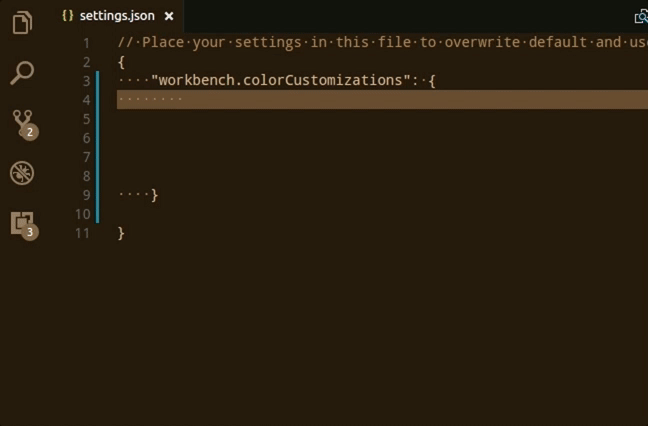

All built-in themes have been updated to take advantage of the new colors. You can find the full list of all colors in the [Theme Color Reference](https://code.visualstudio.com/docs/getstarted/theme-color-reference).

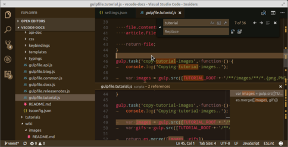

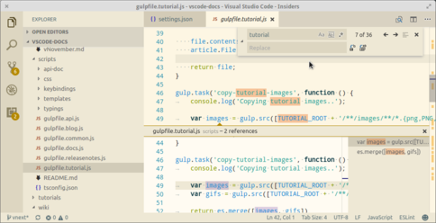

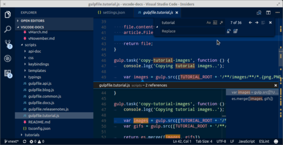

The new user settings `workbench.colorCustomization` replaces the setting `workbench.experimental.colorCustomization` and lets users change colors on top of the active theme. If you have already used the experimental settings, use the [color id mapping table](https://github.com/Microsoft/vscode/wiki/Color-customization-color-id-changes) to map the ids to the new format.

The Yeoman generator has been updated to create themes using the new color theme format. In addition, a new command **Developer: Generate Color Theme From Current Settings** is available in the **Command Palette** to help you turn your custom colors to a theme that you can share on the Marketplace.

We're also looking into ways to make theme creation easier in the [vscode-theme-generator](https://github.com/Tyriar/vscode-theme-generator) project on GitHub. The goal of the generator is to allow generation of good looking themes with as little effort as possible, hiding away the complexities of tweaking the individual workbench color keys and TextMate scopes.

With the `vscode-theme-generator`, you can create a theme that looks like this by defining only 6 colors:

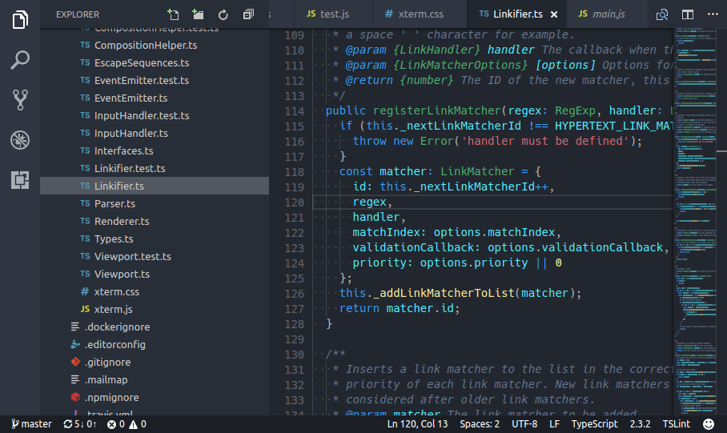

### Keyboard Shortcuts editor

Search in **Keyboard Shortcuts** editor is improved to support all possible terms for modifier keys in corresponding platforms.

* `meta`, `cmd`, `command`, `windows`
* `ctrl`, `control`
* `alt`, `option`
* `shift`

You can now also see the conflicts in the order of precedence.

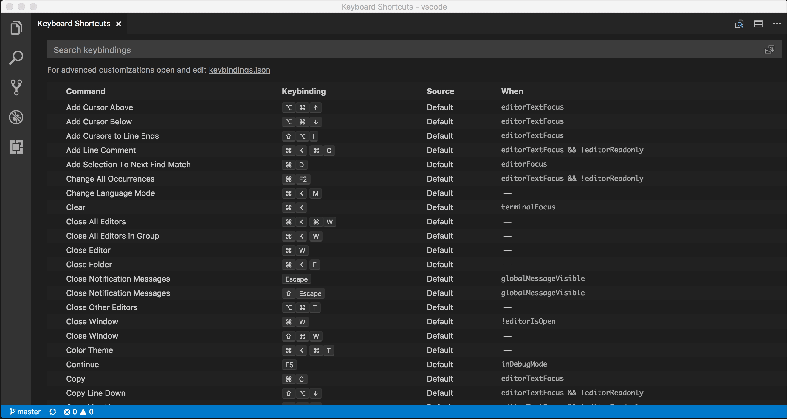

### Source control

Since the SCM API was released, there has been good progress in source control extensions around the community. Here are some of the SCM extensions already published in the Marketplace:

* [Perforce for VS Code](https://marketplace.visualstudio.com/items?itemName=slevesque.perforce) - Perforce integration.
* [Hg](https://marketplace.visualstudio.com/items?itemName=mrcrowl.hg) - for Mercurial repositories.

We are very excited about the possibilities of this API and expect more extensions to come out in the near future!

### Git

There has been a lot of progress improving the [Git extension](https://github.com/Microsoft/vscode/tree/master/extensions/git) inside VS Code. This Git integration goes through the same [extension points](https://code.visualstudio.com/docs/extensionAPI/api-scm) as third-party SCM providers.

**Note:** Starting in June, the legacy git integration will be completely removed. Until then, you can still revert back to it using the **SCM: Enable Legacy Git** command.

### macOS: Sierra Tabs

With the help of the [Electron update](#electron-update), we can bring back basic support for native macOS Sierra tabs for window management. You can enable them via the `window.nativeTabs` setting after a restart. Once enabled, depending on your OS settings, new tabs will open when you open new windows. Make sure to show the tab bar (**View** > **Show Tab Bar**) to access tabs.


**Note**: Native tabs cannot be used with a custom title. When you enable native tabs, the title bar will change to native styling too.

### macOS: Mouse swipe to navigate

We added a new setting `workbench.editor.swipeToNavigate` that allows you to navigate between editors using 3-finger-swipe gesture with the trackpad on macOS. Swiping left or right will navigate across recently used editors in any editor group. This is similar to the **Go** > **Back** and **Go** > **Forward** commands we already had but will skip navigation from occurring within documents.

**Note**: The same commands that swiping triggers can also be executed via key bindings from the new commands `workbench.action.openPreviousRecentlyUsedEditor` and `workbench.action.openNextRecentlyUsedEditor`.

**Note**: We currently only support 3-finger-swipe gesture. Make sure that your trackpad settings for swiping are configured like the following to make this work:

* Swipe between pages: Scroll left or right with three fingers.
* Swipe between full-screen apps: Swipe left or right with four fingers.

### Integrated Terminal link line and column ranges

Links to files with line and column ranges are now supported.

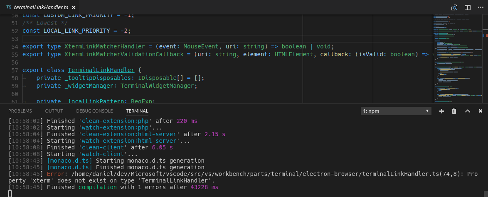

## Languages

### TypeScript 2.3

VS Code now ships with [TypeScript 2.3.2](https://devblogs.microsoft.com/typescript/announcing-typescript-2-3/). This update brings some [new language features](https://github.com/Microsoft/TypeScript/wiki/What's-new-in-TypeScript#typescript-23) and fixes a number of important bugs.

### Type checking for JavaScript files

TypeScript 2.3 also brings type checking to plain JavaScript files. This is a great way to catch common programming mistakes and these type checks also enable some exciting quick fixes for JavaScript.


TypeScript can infer types in `.js` files same as in `.ts` files. When types cannot be inferred, they can be specified using JSDoc comments. You can read more about how TypeScript uses JSDoc for JavaScript type checking [here](https://github.com/Microsoft/TypeScript/wiki/Type-Checking-JavaScript-Files).

Type checking of JavaScript is optional and opt-in. Existing JavaScript validation tools such as ESLint can be used alongside the new built-in type checking functionality.

You can get started with type checking a few different ways depending on your needs.

**Per file**

The easiest way to enable type checking in a JavaScript file is by adding `// @ts-check` to the top of a file.

```js
// @ts-check
let easy = 'abc'
easy = 123 // Error: Type '123' is not assignable to type 'string'
```

Using `// @ts-check` is a good approach if you just want to try type checking in a few files but not yet enable it for an entire codebase.

**Using a Setting**

To enable type checking for all JavaScript files without changing any code, just add `"javascript.implicitProjectConfig.checkJs": true` to your workspace or user settings. This enables type checking for any JavaScript file that is not part of a `jsconfig.json` or `tsconfig.json` project.

You can opt individual files out of type checking with a `// @ts-nocheck` comment at the top of the file:

```js
// @ts-nocheck
let easy = 'abc'
easy = 123 // No error
```

You can also disable individual errors in a JavaScript file using a `// @ts-ignore` comment on the line before the error:

```js
let easy = 'abc'
// @ts-ignore
easy = 123 // No error
```

**Using a JSConfig or TSConfig**

To enable type checking for JavaScript files that are part of a `jsconfig.json` or `tsconfig.json`, simply add `"checkJs": true` to the project's compiler options:

`jsconfig.json`:

```json
{
    "compilerOptions": {
        "checkJs": true
    },
    "exclude": [
        "node_modules"
    ]
}
```

`tsconfig.json`:

```json
{
    "compilerOptions": {
        "allowJs": true,
        "checkJs": true
    },
    "exclude": [
        "node_modules"
    ]
}
```

This enables type checking for all JavaScript files in the project. You can use `// @ts-nocheck` to disable type checking per file.

JavaScript type checking requires TypeScript 2.3. If you are unsure what version of TypeScript is currently active in your workspace, simply run the **TypeScript: Select TypeScript Version** command to check.

### Change TypeScript versions without reloading VS Code

Changing the active version of TypeScript no longer requires VS Code to be reloaded.

### Markdown Preview and Zoom

With the [update of the Electron](#electron-update) shell, we fixed the issue with clipping of Markdown previews and the in-product release notes when using Zoom.

### Surround snippets for Markdown

You can now more quickly bold or italicize text in a Markdown document using snippets. Simply select some text and run the `insert snippet` command. The bold, italic, and quote snippets for Markdown have all been updated to operate on selected text.

You can also setup a key binding to use these snippets:

```json
{
    "key": "cmd+k 8",
    "command": "editor.action.insertSnippet",
    "when": "resourceLangId == 'markdown'",
    "args": {
        "name": "Insert bold text"
    }
}
```

## Editor

### Dynamic IntelliSense sorting

The editor now re-sorts the completions list while you type. That ensures that the completions you need are always on top and easy to select.

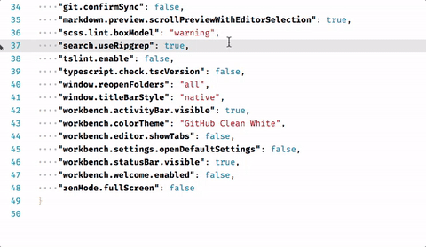

## Tasks

### Grunt task auto-detection

Grunt auto-detection has been implemented for the new terminal task runner. With the new terminal runner, tasks are now detected for both [Grunt](https://gruntjs.com) and [Gulp](http://gulpjs.com/) if both corresponding files (`Gruntfile.js`, `gulpfile.js`) are present in a workspace.

In addition, the proposed task API has been polished. If you had already started to use it, you might encounter some minor breaking changes.

## Debugging

### Editing Watch expressions

It is now possible to edit Watch expressions using the context menu.

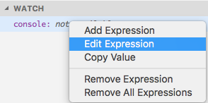

## Node Debugging

### Just My Code improvements

Skipping files when stepping has been available for the `inspector` protocol of the Node.js debugger for three releases. With this release, it is now available for the `legacy` protocol as well. To control a file for skipping, use the context menu command **Toggle skipping this file** on a stack frame in the **CALL STACK** view.

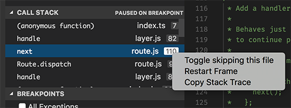

### Column breakpoints improvements

Setting breakpoints on a particular column is now supported by the [Debugger for Chrome](https://marketplace.visualstudio.com/items?itemName=msjsdiag.debugger-for-chrome) extension, and by the `inspector` protocol of the Node.js debugger, when debugging (yet to be released) Node 8. A column breakpoint can be set using `kb(editor.debug.action.toggleInlineBreakpoint)` or via the context menu during a debug session.


## Extension Authoring

### New APIs

We have added some new APIs:

* More completion and symbol item kinds: `Event`, `Operator`, and `TypeParameter`.
* You can now open a text document as a preview editor. This means its tab will be reused when opening another document. This can be done like so: `vscode.window.showTextDocument(doc, { preview: true})`.
* We have added functions to show progress for a long running operation. For now, we have defined two locations for progress in the UI: the **Source Control** view and a window-global progress indication in the Status Bar.

Take a look at the following sample:

```ts
vscode.window.withProgress({
    location: vscode.ProgressLocation.Window,
    title: 'My long running operation'
}, async (progress) => {
    // Progress is shown while this function runs.
    // It can also return a promise which is then awaited
    progress.report({ message: 'Doing this' });
    await step1();

    progress.report({ message: 'Doing that' });
    await step2();
})
```

### Node.js update (6.x to 7.x)

With the update of Electron to 1.6.6, the Node.js version that is used to run all extensions updated from 6.4.0 to 7.4.0. There are some breaking changes coming with this major update of Node.js, though in general the impact should be minor. Please refer to [this overview](https://github.com/nodejs/node/wiki/Breaking-changes-between-v6-and-v7) for a complete list of breaking changes from Node.js 6 to 7.

One consequence of the Electron update is that promise rejections are now treated as uncaught exceptions by the Node.js runtime even if the reject is caught later. Since this behavior is annoying when debugging an extension, we've introduced a new exception option to control promise rejections independent from regular exceptions:

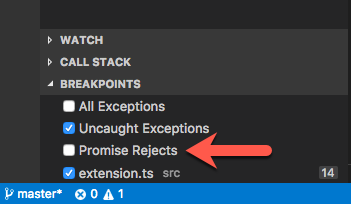

### Debugger extensions

**`evaluateName` attribute will become mandatory for `Add to Watch` and `Copy Value` actions**

VS Code tries to implement the **Add to Watch** and **Copy Value** actions by using the data from the **VARIABLES** view and a JavaScript-biased heuristic for building expressions that can be used with the evaluate request.

Since this approach does not work for all languages, we've introduced the `evaluateName` attribute for variables some time ago. If the `evaluateName` attribute is available for a variable VS Code will use it 'as is' for the evaluate request. If `evaluateName` is missing, VS Code falls back to the old approach.

Since we plan to remove the fallback completely in the May release, debug adapters must support the `evaluateName` attribute if they want to have the **Add to Watch** and **Copy Value** actions available in the future.

**New argument `terminateDebuggee` for `disconnect` request**

An optional argument, `terminateDebuggee`, has been added to the `disconnect` request. If a debug adapter has opted into this feature with the `supportTerminateDebuggee` capability, a client can use this to control whether the debuggee should be terminated when the debugger is disconnected.

## Miscellaneous

### Electron update

In this release, we updated from Electron 1.4.x to 1.6.6. This brings a Chrome update from version 53 to 56 and Node.js from 6.4 to 7.4. Among other things, this update enabled us to bring back native macOS Sierra tabs for window management (behind a setting `window.nativeTabs`) as well as better crash reporting for the processes we spawn. This update also avoids some graphic glitches we have seen on macOS (background artifacts) as well as improved scaling of all UI elements when running with scaling enabled on Windows.

Unfortunately, we are also seeing some regressions with this update and we ask for your patience until we can move forward to a newer Electron version that fix these issues.

Specifically:

* [24981](https://github.com/Microsoft/vscode/issues/24981): Backspace can not erase the last character during Chinese/Japanese IME conversion (macOS)
* [24633](https://github.com/Microsoft/vscode/issues/24633): Unconfirmed text of CJK IME collapse to one character in Integrated Terminal
* [24643](https://github.com/Microsoft/vscode/issues/24643): Webview Flickering on Resize
* [24707](https://github.com/Microsoft/vscode/issues/24707): 1.6.2 update (<1.5) Completely breaks Dragon menu/submenu voice control (updated)
* [25700](https://github.com/Microsoft/vscode/issues/25700): Windows: dropdown selector empty after reload of window

**Note:** If you are an extension author, please review the impact of this Electron update under the [Extension Authoring](#extension-authoring) section.

### China downloads

We've improved the install and update experience for Chinese users, who have always reported slow download speeds when fetching releases of VS Code. We now publish and distribute our releases to network servers located within China so you should start getting much faster speeds in that territory. Some of our test scenarios witnessed a speedup of `300x` ⚡️!

These improvements are available when downloading VS Code directly from our website as well as when receiving automatic updates.

## New Commands

Key|Command|Command id
---|-------|----------
`kb(workbench.action.openPreviousRecentlyUsedEditor)`|Open Previous Recently Used Editor|`workbench.action.openPreviousRecentlyUsedEditor`
`kb(workbench.action.openNextRecentlyUsedEditor)`|Open Next Recently Used Editor|`workbench.action.openNextRecentlyUsedEditor`
`kb(workbench.action.openGlobalKeybindingsFile)`|Open Keyboard Shortcuts File|`workbench.action.openGlobalKeybindingsFile`

## Notable Changes

* [5745](https://github.com/Microsoft/vscode/issues/5745): Webview: apply window.zoomLevel too
* [12473](https://github.com/Microsoft/vscode/issues/12473): macOS Sierra: background artifacts
* [24482](https://github.com/Microsoft/vscode/issues/24482): New Uncaught Exception when starting an extension debugging session
* [24979](https://github.com/Microsoft/vscode/issues/24979): Compound debug configurations not shown after first breakpoint is hit
* [13306](https://github.com/Microsoft/vscode/issues/13306): stepping over breakpoint appears to resume execution fully, vs stepping
* [24126](https://github.com/Microsoft/vscode/issues/24126): Quickly blinking cursor in terminal if you open and quit external app
* [24302](https://github.com/Microsoft/vscode/issues/24302): Use ctrl key as the modifier to enable copy when drag and drop on Linux
* [18351](https://github.com/Microsoft/vscode/issues/18351): Support navigation of problems by keyboard similar to search results.

These are the [closed bugs](https://github.com/Microsoft/vscode/issues?q=is%3Aissue+label%3Abug+milestone%3A%22April+2017%22+is%3Aclosed) and these are the [closed feature requests](https://github.com/Microsoft/vscode/issues?q=is%3Aissue+milestone%3A%22April+2017%22+is%3Aclosed+label%3Afeature-request) for the 1.12 update.

## Contributions to Extensions

Our team maintains or contributes to a number of VS Code extensions. Most notably:

* [Go](https://marketplace.visualstudio.com/items?itemName=ms-vscode.Go)
* [TSLint](https://marketplace.visualstudio.com/items?itemName=eg2.tslint) : We contributed to the [tslint language server plugin](https://github.com/angelozerr/tslint-language-service) and there is now a [preview](https://github.com/angelozerr/tslint-language-service#vscode) available to try out for VS Code.
* [ESLint](https://marketplace.visualstudio.com/items?itemName=dbaeumer.vscode-eslint)
* [Docker](https://marketplace.visualstudio.com/items?itemName=ms-azuretools.vscode-docker)
* [Debugger for Chrome](https://marketplace.visualstudio.com/items?itemName=msjsdiag.debugger-for-chrome)
* [Mono Debug](https://marketplace.visualstudio.com/items?itemName=ms-vscode.mono-debug)
* [VSCodeVim](https://marketplace.visualstudio.com/items?itemName=vscodevim.vim)

## Thank You

Last but certainly not least, a big *__Thank You!__* to the following folks that helped to make VS Code even better:

Contributions to `vscode`:

* [Gordon Mckeown(@gmckeown)](https://github.com/gmckeown): Improved rendering of Seti icons [#22667](https://github.com/Microsoft/vscode/issues/22667)
* [@admosity](https://github.com/admosity):  Fix typo in inspectKeybindings.ts [PR #25262](https://github.com/Microsoft/vscode/pull/25262)
* [Brian Schlenker (@bschlenk)](https://github.com/bschlenk):  Add noValuePreselect option to showInputBox [PR #23827](https://github.com/Microsoft/vscode/pull/23827)
* [Burak Can (@burakcan)](https://github.com/burakcan):  Suggestion widget: Fix overflowing text problem (fixes #20679) [PR #20857](https://github.com/Microsoft/vscode/pull/20857)
* [Christopher Leidigh (@cleidigh)](https://github.com/cleidigh)
  *  Scm css fix for keyboard navigation and actions Issue [PR #23967](https://github.com/Microsoft/vscode/pull/23967)
  *  Monokai UI theme - first pass for #25327 [PR #25599](https://github.com/Microsoft/vscode/pull/25599)
* [Dick van den Brink (@DickvdBrink)](https://github.com/DickvdBrink):  Fixed typo in terminal.contribution description [PR #23784](https://github.com/Microsoft/vscode/pull/23784)
* [David Hewson (@dten)](https://github.com/dten):  OK capitalisation fix [PR #25005](https://github.com/Microsoft/vscode/pull/25005)
* [Eric Amodio (@eamodio)](https://github.com/eamodio):  Adds editor options overloads to showTextDocument & vscode.diff [PR #23641](https://github.com/Microsoft/vscode/pull/23641)
* [Elias Winberg (@elias-winberg)](https://github.com/elias-winberg):  Remove class snippet comment [PR #23209](https://github.com/Microsoft/vscode/pull/23209)
* [William Esz (@flagello)](https://github.com/flagello)
  *  Escape paths in npm.sh to fix #20907 [PR #21010](https://github.com/Microsoft/vscode/pull/21010)
  *  Escape paths in code.sh [PR #21016](https://github.com/Microsoft/vscode/pull/21016)
* [@gauss1314](https://github.com/gauss1314):  Update typescriptMain.ts [PR #24892](https://github.com/Microsoft/vscode/pull/24892)
* [Vakhurin Sergey (@igelbox)](https://github.com/igelbox):  Added support for encodings for Git. [PR #24911](https://github.com/Microsoft/vscode/pull/24911)
* [Ilie Halip (@ihalip)](https://github.com/ihalip):  Small comment fix [PR #25558](https://github.com/Microsoft/vscode/pull/25558)
* [Yuki Ueda (@Ikuyadeu)](https://github.com/Ikuyadeu):  fix Solarized Light theme highlighting  #24040 [PR #24292](https://github.com/Microsoft/vscode/pull/24292)
* [Jordan Menard (@jordanmkasla2009)](https://github.com/jordanmkasla2009)
  *  Open vscode://file/path/to/project/ URLs properly on Windows - fixes #20290 [PR #20469](https://github.com/Microsoft/vscode/pull/20469)
  *  Implement #12910 [PR #20881](https://github.com/Microsoft/vscode/pull/20881)
* [Jakub Synowiec (@jsynowiec)](https://github.com/jsynowiec):  Add an option to enable/disable JSDoc autocomplete [PR #23704](https://github.com/Microsoft/vscode/pull/23704)
* [Dominic Valenciana (@Kiricon)](https://github.com/Kiricon)
  *  Added missing . to hc-black so that it displays the correct scm actio… [PR #24385](https://github.com/Microsoft/vscode/pull/24385)
  *  Changed git renamed icon to orange color [PR #24567](https://github.com/Microsoft/vscode/pull/24567)
  *  Nested code lines now no longer display the hover border left. [PR #24686](https://github.com/Microsoft/vscode/pull/24686)
* [Phawin Khongkhasawan (@lifez)](https://github.com/lifez):  Add zenMode.hideActivityBar option [PR #24499](https://github.com/Microsoft/vscode/pull/24499)
* [Magnus Hiie (@magnushiie)](https://github.com/magnushiie):  Expose insert..Braces rule in VS Code settings [PR #21649](https://github.com/Microsoft/vscode/pull/21649)
* [Marek Lewandowski (@mlewand)](https://github.com/mlewand):  Added support for home/end key in IntelliSense [PR #20156](https://github.com/Microsoft/vscode/pull/20156)
* [Peter Juras (@peterjuras)](https://github.com/peterjuras):  Remove "JOAO" from Readme title [PR #24491](https://github.com/Microsoft/vscode/pull/24491)
* [@QwertyZW](https://github.com/QwertyZW):  Let the widgetactions debug UI reflect the state of a focused thread [PR #23878](https://github.com/Microsoft/vscode/pull/23878)
* [Rishii7 (@rishii7)](https://github.com/rishii7)
  *  Fix #24240 [PR #24371](https://github.com/Microsoft/vscode/pull/24371)
  *  Fix #24817 - Prevent overflow of the message in define keybinding widget. [PR #24925](https://github.com/Microsoft/vscode/pull/24925)
* [Rômulo Guimarães (@romulo1984)](https://github.com/romulo1984):  Update Exec param at code.desktop [PR #24523](https://github.com/Microsoft/vscode/pull/24523)
* [Seivan Heidari (@seivan)](https://github.com/seivan):  Fixes #4803: Adding support for swipe gestures on macOS. [PR #23663](https://github.com/Microsoft/vscode/pull/23663)
* [Tereza Tomcova (@the-ress)](https://github.com/the-ress):  Fixes #13905: Set relaunch command for window [PR #15407](https://github.com/Microsoft/vscode/pull/15407)
* [Thomas Rayner (@ThmsRynr)](https://github.com/ThmsRynr):  Fix #24971. PowerShell Extension .bat & .exe Syntax Highlighting Error [PR #24973](https://github.com/Microsoft/vscode/pull/24973)
* [Naveen Kumar (@timbanaveen)](https://github.com/timbanaveen)
  *  Adding 'never show again' in Git Extension [PR #24654](https://github.com/Microsoft/vscode/pull/24654)
  *  Adding line and column support for terminal [PR #24832](https://github.com/Microsoft/vscode/pull/24832)

Contributions to `language-server-protocol`:

* [Damien Guard (@damieng)](https://github.com/damieng): Correct log message heading in protocol v1 [PR 186](https://github.com/Microsoft/language-server-protocol/pull/186)
* [Lucian Wischik (@ljw1004)](https://github.com/ljw1004): Change "utf8" to "utf-8" with a hyphen [PR 199](https://github.com/Microsoft/language-server-protocol/pull/199)
* [cxxxr (@cxxxr)](https://github.com/cxxxr): small corrections [PR 205](https://github.com/Microsoft/language-server-protocol/pull/205)
* [Vlad Dumitrescu (@vladdu)](https://github.com/vladdu): small corrections [PR 207](https://github.com/Microsoft/language-server-protocol/pull/207)

Contributions to `vscode-languageserver-node`:

* [Cam (@trixnz)](https://github.com/trixnz): Add return value to getEnvironment(). [PR #189](https://github.com/Microsoft/vscode-languageserver-node/pull/189)
* [Guillaume Martres (@smarter)](https://github.com/smarter): Fix a single typo [PR #196](https://github.com/Microsoft/vscode-languageserver-node/pull/196)
* [Hyo Jeong (@asiandrummer)](https://github.com/asiandrummer): fix typo [PR #200](https://github.com/Microsoft/vscode-languageserver-node/pull/200)

Contributions to `vscode-css-languageservice`

* [Dominic Valenciana (@Kiricon)](https://github.com/Kiricon):  Added @error support for sass [PR #24](https://github.com/Microsoft/vscode-css-languageservice/pull/24)
* [Ryan O'Connor (@rocifier)](https://github.com/rocifier):  added unit tests for real selector formatter and fixed indentation [PR #26](https://github.com/Microsoft/vscode-css-languageservice/pull/26)

## Thank you to our localization contributors

We opened [community localization](https://code.visualstudio.com/updates/v1_11#_coming-soon-support-for-community-localization) this release and there was a lot of excitement from international users. We now have more than 100 members in the Transifex [VS Code project](https://aka.ms/vscodeloc) team. We appreciate your contributions, either by providing new translations, voting on translations, or suggesting process improvements.

Here is a snapshot of top contributors for this release. For details about the project including the contributor name list, visit the project site at [https://aka.ms/vscodeloc.](https://aka.ms/vscodeloc)

* **French:** Vincent Biret.
* **Italian:** Piero Azi, Alessandro Burato, Giuliano Latini, Gianluca Bertelli.
* **German:** Sascha Corti, Jens Suessmeyer, Christian Gräfe, Markus Weber.
* **Spanish:** German Sak, Santiago Porras Rodríguez, José M. Aguilar, Alberto Poblacion.
* **Russian:** Aleksey Nemiro,  Kirill Moskvichev, Anton Afonin, Артем Мельниченко, Serge Rodionov, Andrei Pryymak.
* **Japanese:** Yuichi Nukiyama, EbXpJ6bp.
* **Chinese (Simplified):** Joel Yang, Ying Feng, YF.
* **Chinese (Traditional):** Alan Tsai.

Although the languages below are not yet in VS Code, work is going on there as well. In the May iteration, we will review whether these languages meet the criteria for language integration into VS Code.

* **Portuguese (Brazil):** Bruno Sonnino, Felipe Caputo, Rodrigo Crespi, Roberto Fonseca, Marcelo Fernandes, Roberto Nunes, Rodrigo Romano, Luan Moreno Medeiros Maciel, Ilton Sequeira, Douglas Eccker.
* **Dutch:** Jeroen Hermans, Gerjan.
* **Polish:** KarbonKitty, Lukasz Korowicki, Paweł Sołtysiak, Jakub Drozdek.
* **Swedish:** Joakim Olsson.
* **Turkish:** Adem Coşkuner, Serkan Inci, Sertac Ozercan.

## Workarounds

### macOS flickering

Some users are seeing VS Code flicker when running on high DPI external monitors [#25934](https://github.com/Microsoft/vscode/issues/25934). The workaround is to set: `"editor.disableTranslate3d": true` in user settings (this produces a warning, but that is fine as VS Code still accepts the setting).

### macOS blurry icons

This issue appears if certain environment variables are set when VS Code launches [#24820](https://github.com/Microsoft/vscode/issues/24820). The workaround is to either launch VS Code from the macOS Dock or clear the `LC_ALL` environment variable (`export LC_ALL=`) before launching from the terminal. The [Insiders](https://code.visualstudio.com/insiders) build applies this workaround and clears `LC_ALL`.

<!-- In-product release notes styles.  Do not modify without also modifying regex in gulpfile.common.js -->
<a id="scroll-to-top" role="button" aria-label="scroll to top" href="#"><span class="icon"></span></a>
<link rel="stylesheet" type="text/css" href="css/inproduct_releasenotes.css"/>
