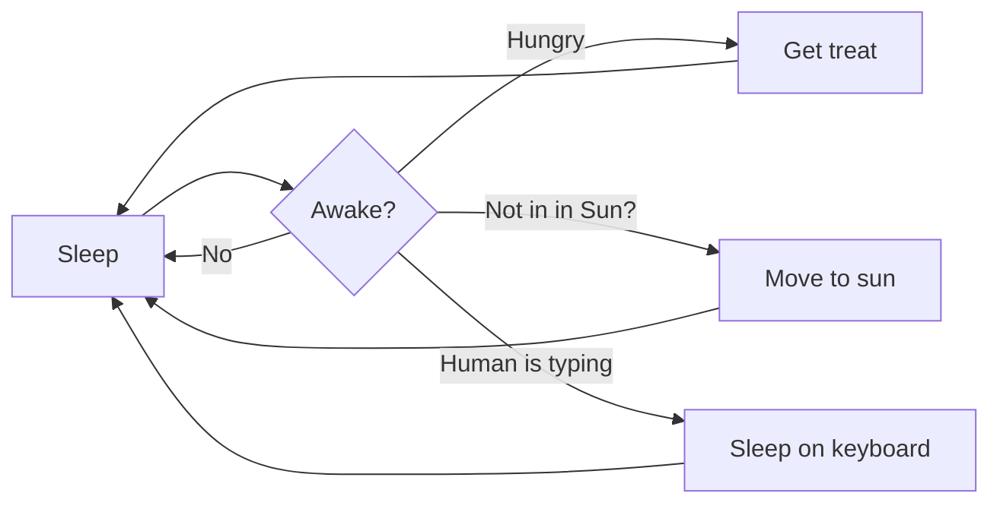

# Visual Studio Code 1.121

Follow us on [LinkedIn](https://www.linkedin.com/showcase/vs-code), [X](https://go.microsoft.com/fwlink/?LinkID=533687), [Bluesky](https://bsky.app/profile/vscode.dev) <!-- %IF INSIDERS % | Follow Insiders Changelog on [X](https://x.com/VSCodeChangelog) or [Bluesky](https://bsky.app/profile/vscodechangelog.bsky.social) %ENDIF % --> <!-- %IF IN_PRODUCT % | [View online](https://code.visualstudio.com/updates)%ENDIF % -->

---

_Release date: May 20, 2026_

<!-- DOWNLOAD_LINKS_PLACEHOLDER -->

---

Welcome to the 1.121 release of Visual Studio Code. This release ... <TODO @ntrogh>

* [highlight](#bookmark): <highlight description>

Happy Coding!

---

<!-- %IF STABLE %
VS Code is rolling out gradually to all users. Use **Check for Updates** in VS Code to get the latest version immediately.

To try new features as soon as possible, [**download the nightly Insiders build**](https://code.visualstudio.com/insiders), which includes the latest updates as soon as they are available.

---
%ENDIF % -->

<!-- TOC

  <nav id="toc-nav">
    
In this update

    <ul>
      <li><a href="#agents">Agents</a></li>
      <li><a href="#chat">Chat</a></li>
      <li><a href="#mcp">MCP</a></li>
      <li><a href="#accessibility">Accessibility</a></li>
      <li><a href="#editor-experience">Editor Experience</a></li>
      <li><a href="#code-editing">Code Editing</a></li>
      <li><a href="#notebooks">Notebooks</a></li>
      <li><a href="#source-control">Source Control</a></li>
      <li><a href="#debugging">Debugging</a></li>
      <li><a href="#tasks">Tasks</a></li>
      <li><a href="#terminal">Terminal</a></li>
      <li><a href="#authentication">Authentication</a></li>
      <li><a href="#languages">Languages</a></li>
      <li><a href="#remote-development">Remote Development</a></li>
      <li><a href="#contributions-to-extensions">Contributions to extensions</a></li>
      <li><a href="#extension-authoring">Extension Authoring</a></li>
      <li><a href="#proposed-apis">Proposed APIs</a></li>
      <li><a href="#engineering">Engineering</a></li>
      <li><a href="#deprecated-features-and-settings">Deprecated features and settings</a></li>
      <li><a href="#notable-fixes">Notable fixes</a></li>
      <li><a href="#thank-you">Thank you</a></li>
    </ul>
  </nav>
  

Navigation End -->

## Agents

### Agents Window (Preview)

We continue improvement to the Agents window, which is the agent-driven companion window brought as a preview to VS Code Stable in our last release.

You can open the Agents window in several ways, including the "Open in Agents" button in the VS Code title bar. To learn more about how it works and what you can do with it, visit the [Agents window documentation](https://aka.ms/VSCode/Agents/docs).

Your feedback continues to be a great help in shaping Agents. If you've already been using it and providing feedback, thank you! Please continue to [file issues on GitHub](https://github.com/microsoft/vscode/issues) or browse [existing issues](https://github.com/microsoft/vscode/issues?q=state%3Aopen%20label%3A%22agents-window%22).

We're also continuing to work on the broader extension story in the Agents window, including what extension enablement unlocks and how various extensions should behave in this environment. Whether you'd like to ideate on new scenarios that take advantage of running agents across projects, or share feedback on how your existing extension behaves in the Agents window, we'd love to collaborate with you through [GitHub issues](https://github.com/microsoft/vscode/issues?q=state%3Aopen%20label%3A%22agents-window%22).

### Agents observability with OpenTelemetry and Grafana

In collaboration with the Azure Managed Grafana team, there is now a prebuilt Azure Managed Grafana dashboard for the OpenTelemetry signals that agents in VS Code emit. Point VS Code at an OTel Collector that forwards to Azure Application Insights, then import the Azure Managed Grafana dashboard to visualize agent operations, token usage, chat sessions, tool calls, and per-model response time and TTFT.

See [Monitor AI coding agents with Grafana](https://learn.microsoft.com/azure/managed-grafana/grafana-opentelemetry-app-insights#github-copilot) for the end-to-end setup, and [Monitor agent usage with OpenTelemetry](https://code.visualstudio.com/docs/copilot/guides/monitoring-agents) for enabling export from VS Code.

### Remote agents (Preview)

The Agents window has experimental support for running agent sessions on a remote machine that you own and can connect to via SSH or dev tunnels.

#### Connecting to a remote

You can connect the Agents window to a remote machine in two ways:

- **SSH** — pick from your existing `~/.ssh/config` entries, or type a `user@host`.
- **Dev Tunnels** — pick from tunnels you've already created by running `code tunnel` on the target machine.

#### How it works

This feature is similar to, but not the same as, VS Code's remote development extensions. The Agents window connects to the remote, and either downloads and installs the VS Code CLI (SSH) or connects to the running CLI server via a dev tunnel that you started. It starts a lightweight process called the "agent host" which hosts a new agent loop built on the [Copilot SDK](https://www.npmjs.com/package/@github/copilot-sdk).

An important point to note is that the remote agent host is a long-lived process. Running sessions continue to run on the remote even if your client disconnects, so feel free to close that laptop lid while your remote agent vibes.

#### The Agent Host Protocol

The connection between the Agents window and the agent host is a new open protocol called the **[Agent Host Protocol (AHP)](https://microsoft.github.io/agent-host-protocol/)**. We're developing it in the open as a standalone spec.

The key design principle of AHP is that it enables coordination of agent sessions across multiple clients simultaneously. This is how it differs from other protocols like ACP. An agent host manages authoritative state, synchronizes it to every connected client, and sequences all mutations through pure reducers.

And being an open protocol means that anyone can build an AHP client that can connect to the VS Code CLI's agent host- or anyone can build an AHP agent host that VS Code can connect to.

## Chat

## MCP

## Accessibility

## Editor Experience

### Improved 'Add Element to Chat' experience in the Integrated Browser

We have reworked the element selection UI to enable richer functionality and theming support.

#### Press and hold to select a range

You can now click and drag to select a range, making it easier to target shared container elements.

<video src="images/1_121/browser-drag-select.mp4" title="a clip demonstrating click-and-drag to select ancestor elements of items in a menu" autoplay loop controls muted></video>

#### Attach elements from context menus

You can now right-click anywhere in a page to quickly attach elements to the chat.

### Quickly open HTML files in the Integrated Browser

Local HTML files can now be quickly opened via file context menus or the editor title bar when an HTML file is open.

## Code Editing

## Notebooks

## Source Control

## Debugging

## Tasks

## Terminal

### Agent-aware terminal commands

When chat runs a command in the terminal, command-line tools can now tell that the command came from VS Code's agent flow. VS Code sets a `VSCODE_AGENT` environment variable for agent-initiated terminal commands, which lets CLIs switch to machine-readable output, suppress progress animations, or skip prompts that would otherwise block the session.

This makes terminal-based tools easier for the agent to work with and can reduce noisy output that wastes tokens. If you maintain scripts or CLIs that already adjust behavior for CI or other agents, you can use the same pattern for commands launched from Copilot Chat.

### Running in background indicator for terminal tools

When a chat terminal command keeps running after the tool call returns, the chat UI now makes that state visible instead of looking finished. Tool invocations show **Running `<command>` in background - Show** while the terminal is still active, and the **Show** action reveals and focuses the underlying terminal.

This makes it much clearer when a command is still consuming work in the background, especially for async runs or commands that were promoted to background execution after a timeout. Once the command finishes, the header returns to the normal completed state.

### Cleanup for background agent terminals

Long-running chat sessions no longer accumulate hidden background terminals after each command finishes. VS Code now automatically disposes background terminals created by the chat agent when their command completes, while still preserving the command output in the chat UI.

This keeps terminal lists from filling up with stale entries and reduces resource usage over multi-turn sessions. If you reveal a background terminal with **Show**, it stays open so you can continue inspecting or interacting with it.

### Broader compression for terminal tool output

**Setting**: `setting(chat.tools.compressOutput.enabled)`

Chat terminal tools can compress more kinds of verbose command output before sending it back to the model. The expanded coverage includes common test runners, build tools, linters, Docker commands, and package managers, so repetitive progress output and other low-value noise are trimmed more often.

The result is that long terminal runs are easier for the model to interpret and less likely to spend tokens on boilerplate output. This is especially useful for commands such as `pytest`, `jest`, `cargo test`, `tsc`, and package installation workflows that produce large volumes of text before surfacing the important result.

### Sensitive terminal prompts stay in the terminal

When a chat terminal command reaches a password, passphrase, PIN, or verification-code prompt, VS Code now treats that as sensitive input. In default permissions mode, chat shows a confirmation dialog that can focus the terminal so you can enter the secret directly there. In auto-approve flows, VS Code cancels the command and tells the model not to retry or request the secret.

## Authentication

## Languages

### Built-in Mermaid diagrams in Markdown preview and Notebooks

We've merged Matt Bierner's [Markdown Preview Mermaid Support](https://marketplace.visualstudio.com/items?itemName=bierner.markdown-mermaid) extension into VS Code as a new built-in extension called `Mermaid Markdown Features`. This extension add [Mermaid diagram](https://mermaid.js.org) rendering to VS Code's built-in Markdown preview, to Markdown cells in notebooks, and to chats.

Mermaid diagrams can be created using a `mermaid` [fenced code block](https://docs.github.com/en/get-started/writing-on-github/working-with-advanced-formatting/creating-and-highlighting-code-blocks#fenced-code-blocks) in your Markdown:

~~~md

~~~

Here's what the diagram looks like in the Markdown preview:

Rendered Mermaid diagrams also support panning and zooming, which makes larger diagrams easier to inspect without leaving the preview. You can also right-click a diagram to copy its Mermaid source.

### YAML frontmatter in Markdown preview

**Setting**: `setting(markdown.preview.frontMatter)`

We've added options that control how [YAML front matter](https://docs.github.com/en/contributing/writing-for-github-docs/using-yaml-frontmatter) is rendered in the Markdown preview. By default, instead of hiding the preamble, VS Code displays front matter as a table at the top of the preview.

You can use the `setting(markdown.preview.frontMatter)` setting to choose how front matter appears:

* `table` (default): Render front matter as a table.
* `codeBlock`: Render front matter as a YAML code block.
* `hide`: Hide front matter from the preview.

The rendered frontmatter also has a context menu entry for quickly opening this setting from the preview.

## Remote Development

The [Remote Development extensions](https://marketplace.visualstudio.com/items?itemName=ms-vscode-remote.vscode-remote-extensionpack), allow you to use a [Dev Container](https://code.visualstudio.com/docs/devcontainers/containers), remote machine via SSH or [Remote Tunnels](https://code.visualstudio.com/docs/remote/tunnels), or the [Windows Subsystem for Linux](https://learn.microsoft.com/windows/wsl) (WSL) as a full-featured development environment.

Highlights include:

* TODO: @ntrogh

You can learn more about these features in the [Remote Development release notes](https://github.com/microsoft/vscode-docs/blob/main/remote-release-notes/v1_121.md).

## Contributions to extensions

## Extension Authoring

## Proposed APIs

## Engineering

## Deprecated features and settings

### New deprecations in this release

### Upcoming deprecations

## Notable fixes

## Thank you

---

We really appreciate people trying our new features as soon as they are ready, so check back here often and learn what's new.

>If you'd like to read release notes for previous VS Code versions, go to [Updates](https://code.visualstudio.com/updates) on [code.visualstudio.com](https://code.visualstudio.com).

<a id="scroll-to-top" role="button" title="Scroll to top" aria-label="scroll to top" href="#"></a>
<link rel="stylesheet" type="text/css" href="css/inproduct_releasenotes.css"/>
