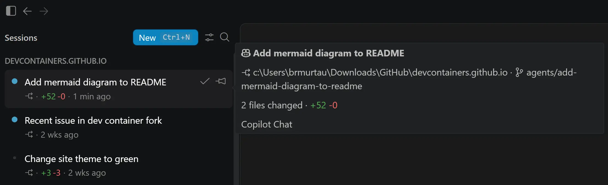

# Visual Studio Code 1.122

Follow us on [LinkedIn](https://www.linkedin.com/showcase/vs-code), [X](https://go.microsoft.com/fwlink/?LinkID=533687), [Bluesky](https://bsky.app/profile/vscode.dev) <!-- %IF INSIDERS % | Follow Insiders Changelog on [X](https://x.com/VSCodeChangelog) or [Bluesky](https://bsky.app/profile/vscodechangelog.bsky.social) %ENDIF % --> <!-- %IF IN_PRODUCT % | [View online](https://code.visualstudio.com/updates)%ENDIF % -->

---

_Release date: May 28, 2026_

<!-- DOWNLOAD_LINKS_PLACEHOLDER -->

---

Welcome to the 1.122 release of Visual Studio Code. This release further enhances the agent experience and makes BYOK more flexible, while adding new capabilities for testing web apps across different devices.

* [Air-gapped BYOK](#use-byok-without-a-github-sign-in): Use your own language models, even when you're not connected.

* [Browser device emulation](#emulate-devices): Test your website's responsiveness across different devices directly in the integrated browser.

* [Rich issue reporting](#improved-issue-reporting-flow): Create rich VS Code issue reports, including screenshots and video recordings.

Happy Coding!

---

<!-- %IF STABLE %
VS Code is rolling out gradually to all users. Use **Check for Updates** in VS Code to get the latest version immediately.

To try new features as soon as possible, [**download the nightly Insiders build**](https://code.visualstudio.com/insiders), which includes the latest updates as soon as they are available.

---
%ENDIF % -->

<!-- TOC

  <nav id="toc-nav">
    
In this update

    <ul>
      <li><a href="#agents">Agents</a></li>
      <li><a href="#language-models">Language Models</a></li>
      <li><a href="#integrated-browser">Integrated browser</a></li>
      <li><a href="#editor-experience">Editor Experience</a></li>
      <li><a href="#deprecated-features-and-settings">Deprecated features and settings</a></li>
      <li><a href="#notable-fixes">Notable fixes</a></li>
      <li><a href="#thank-you">Thank you</a></li>
    </ul>
  </nav>
  

Navigation End -->

## Agents

### Agents Window (Preview)

The [Agents window](https://aka.ms/VSCode/Agents/docs) is a dedicated companion window optimized for exploring, iterating on, and reviewing agent sessions across projects, harnesses, and machines. We keep improving it and the updates for this release include:

* **Session hover details**: Hover over a session in the session list to see its details at a glance. The hover shows the session title with an icon indicating the harness used, along with the project, worktree, and files changed.

* **Local VS Code harness (Insiders only)**: We're continuing to iterate on the ability to use the local harness in the Agents window, such as improvements to the custom agent picker. The availability of the local harness is an early, experimental feature available only in VS Code Insiders. To try it out, you can enable the `setting(sessions.chat.localAgent.enabled)` setting in Insiders.

You can open the Agents window in several ways, including the **Open in Agents** button in the VS Code title bar. To learn more about how it works and what you can do with it, visit the [Agents window documentation](https://aka.ms/VSCode/Agents/docs). You can also check out our new [VS Code Insiders podcast episode](https://www.youtube.com/watch?v=45DA9KP38po) about how the Agents window fits into agent-first development workflows.

Your feedback continues to be a great help in shaping Agents. If you've already been using it and providing feedback, thank you! Please continue to [file issues on GitHub](https://github.com/microsoft/vscode/issues) or browse [existing issues](https://github.com/microsoft/vscode/issues?q=state%3Aopen%20label%3A%22agents-window%22).

### Richer OpenTelemetry signals for agents

Local agent sessions now emit a canonical `github.copilot.*` attribute namespace to OpenTelemetry, matching the [GitHub Copilot CLI OpenTelemetry conventions](https://docs.github.com/en/copilot/reference/copilot-cli-reference/cli-command-reference#opentelemetry-monitoring). New signals add repository context, agent type, structured tool parameters, and hook outcomes to each session.

For the full attribute reference, see [Monitor agent usage with OpenTelemetry](https://code.visualstudio.com/docs/copilot/guides/monitoring-agents).

### Sandboxing

**Setting**: `setting(chat.agent.sandbox.enabled)`

Previously, when you ran commands with **Bypass Approvals** or **Autopilot** mode, they were first attempted in the sandbox. If the command failed with a non-zero exit code, it was automatically retried outside the sandbox. Since approvals were bypassed anyway, this did not provide a meaningful safety benefit and could make the behavior harder to reason about.

Based on feedback from Insiders users, terminal sandboxing now only applies when you use **Default Approvals**, where it provides a clearer balance between safety and usefulness.

## Language Models

### Use BYOK without a GitHub sign in

Previously, using your own language model API key in VS Code required signing in to GitHub. Now, [Bring Your Own Key (BYOK)](https://code.visualstudio.com/docs/copilot/customization/language-models#_bring-your-own-language-model-key) works without signing in, so you can use chat, tools, and MCP servers in air-gapped or restricted environments where GitHub sign-in isn't possible. This also enables fully offline workflows with local models like Ollama.

To get started, run **Manage Language Models** from the Command Palette and add a provider such as Anthropic, Azure, Gemini, OpenAI, Ollama, OpenRouter, or a [custom endpoint](https://code.visualstudio.com/docs/copilot/customization/language-models#_add-a-custom-endpoint-model). Once at least one BYOK model is configured, the Chat view becomes available and sign-in prompts are suppressed.

Built-in tools and any configured MCP servers continue to work. Requests go directly to your provider.

> **Note**: Inline suggestions and next edit suggestions (NES) still require a GitHub sign-in. BYOK powers chat, tools, and MCP servers only.

#### Utility model notification

**Settings**: `setting(chat.utilityModel)`, `setting(chat.utilitySmallModel)`

A few flows in VS Code, such as chat title generation, commit message generation, and feedback, use a smaller [utility model](https://code.visualstudio.com/docs/copilot/customization/language-models#_change-the-model-for-utility-tasks) that normally comes from your Copilot subscription. When you use BYOK while signed out, the default utility models are unreachable, so a notification in the chat input prompts you to point them at one of your BYOK models.

You have two options:

* Select **Configure** to open settings and pick a BYOK model for `setting(chat.utilityModel)` and `setting(chat.utilitySmallModel)`. This unlocks the full set of AI features using your own language model.

* Dismiss the notification if you only need to use chat. The utility-driven features remain inactive until you configure a model.

The notification hides automatically once you configure both utility settings, sign in to GitHub, or remove all BYOK models.

### Custom Endpoint provider in Stable

The Custom Endpoint provider lets you connect models that implement Chat Completions, Responses, or Messages APIs, so you can use chat with your own endpoint and API key. You can use it to connect to self-hosted, enterprise, or other compatible AI endpoints.

The Custom Endpoint provider is now available in VS Code Stable.

To learn how to set it up, see [Add a custom endpoint model](https://code.visualstudio.com/docs/copilot/customization/language-models#_add-a-custom-endpoint-model).

### Manage models in Agents window

You can now run the command **Chat: Manage Language Models** directly from the Agents window to configure the language models you want to use while working there.

This works with local sessions, and you can use BYOK models through the same flow. Model configuration is shared with the editor window, so changes you make in either place are reflected in both.

### Granular BYOK provider group actions in Manage Language Models

Managing BYOK providers often means making small updates, such as rotating an API key or renaming a provider group without opening and editing the full JSON configuration by hand.

In the Language Model editor, supported provider groups now expose targeted actions based on the provider schema: **Update API Key**, **Add Model**, **Rename Group**, and **Delete**. This makes common provider maintenance tasks faster while keeping you in the same flow.

## Remote Development

The [Remote Development extensions](https://marketplace.visualstudio.com/items?itemName=ms-vscode-remote.vscode-remote-extensionpack), allow you to use a [Dev Container](https://code.visualstudio.com/docs/devcontainers/containers), remote machine via SSH or [Remote Tunnels](https://code.visualstudio.com/docs/remote/tunnels), or the [Windows Subsystem for Linux](https://learn.microsoft.com/windows/wsl) (WSL) as a full-featured development environment.

Highlights include:

* EOL for 32-bit ARM Linux hosts

You can learn more about these features in the [Remote Development release notes](https://github.com/microsoft/vscode-docs/blob/main/remote-release-notes/v1_122.md).

## Integrated browser

### Emulate devices

The integrated browser now includes out-of-the-box support for device emulation including screen sizes, mobile / touch emulation, custom user-agents, and more. This is especially useful for web development and debugging, allowing you to quickly test your website's responsiveness and behavior across different devices directly from VS Code without needing to switch to a separate browser or use external tools.

To get started from a browser tab, select the **Show Emulation Toolbar** command from the overflow menu.

<video src="images/1_122/browser-emulation-open.mp4" title="Opening the emulation toolbar" autoplay loop controls muted></video>

Agents can also trigger device emulation via Playwright code, for example to catch mobile responsiveness issues:

<video src="images/1_122/browser-emulation-agentic.mp4" title="Mobile responsiveness testing using the integrated browser" autoplay loop controls muted></video>

### Add browser screenshot as chat context

The new **Add Screenshot to Chat** feature lets you attach a screenshot of the current browser viewport to the chat as context. This is especially useful for UI-related tasks, such as debugging a layout issue.

<video src="images/1_122/browser-add-screenshot-to-chat.mp4" title="Using the 'Add Element to Screenshot' feature in the integrated browser to snap a screenshot of the active website's viewport, immediately attaching it to the chat" autoplay loop controls muted></video>

## Editor Experience

### Improved issue reporting flow

**Setting**: `setting(issueReporter.wizard.enabled)`

To help us better understand and fix any problems you might run into in VS Code, we've improved the issue reporting flow with a new issue reporting wizard. The wizard guides you through creating high quality issues directly from VS Code, including adding relevant details, screenshots, and video recordings.

Enable the `setting(issueReporter.wizard.enabled)` setting to opt in to the new issue reporter.

<video src="images/1_122/issue-reporting-wizard.mp4" autoplay loop controls muted title="Improved Issue Reporting Flow"></video>

## Deprecated features and settings

### New deprecations in this release

### Upcoming deprecations

## Notable fixes

## Thank you

Contributions to our issue tracking:

* [@gjsjohnmurray (John Murray)](https://github.com/gjsjohnmurray)
* [@RedCMD (RedCMD)](https://github.com/RedCMD)
* [@IllusionMH (Andrii Dieiev)](https://github.com/IllusionMH)
* [@albertosantini (Alberto Santini)](https://github.com/albertosantini)

Contributions to `vscode`:

* [@aaronpowell (Aaron Powell)](https://github.com/aaronpowell): Add marketplace ref support for plugin marketplaces [PR #317901](https://github.com/microsoft/vscode/pull/317901)
* [@oded-ist (Oded S)](https://github.com/oded-ist): Fix read_cell_output incorrectly reporting all outputs as too large [PR #318148](https://github.com/microsoft/vscode/pull/318148)
* [@PenguinDOOM (Penguin)](https://github.com/PenguinDOOM): Fix BYOK invalid stateful marker retries [PR #317292](https://github.com/microsoft/vscode/pull/317292)
* [@SLdragon (rentu)](https://github.com/SLdragon): feat: add languageDiagnosticsService option for nes/inline completion provider [PR #317678](https://github.com/microsoft/vscode/pull/317678)

---

We really appreciate people trying our new features as soon as they are ready, so check back here often and learn what's new.

>If you'd like to read release notes for previous VS Code versions, go to [Updates](https://code.visualstudio.com/updates) on [code.visualstudio.com](https://code.visualstudio.com).

<a id="scroll-to-top" role="button" title="Scroll to top" aria-label="scroll to top" href="#"></a>
<link rel="stylesheet" type="text/css" href="css/inproduct_releasenotes.css"/>
