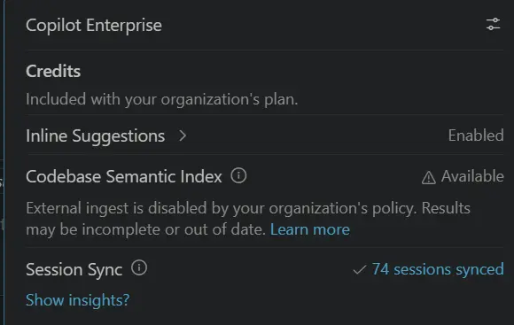
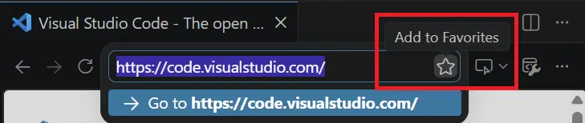
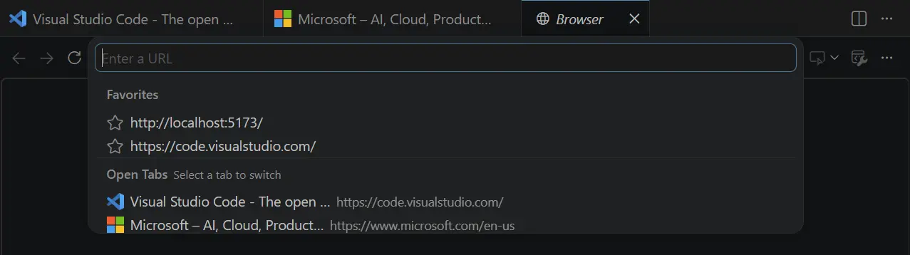
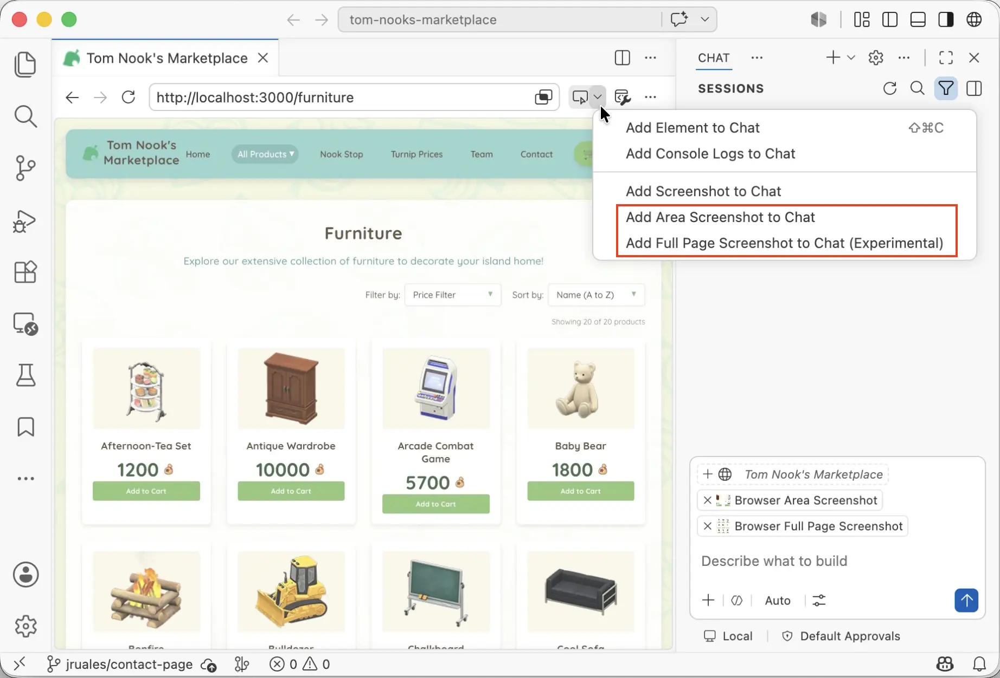
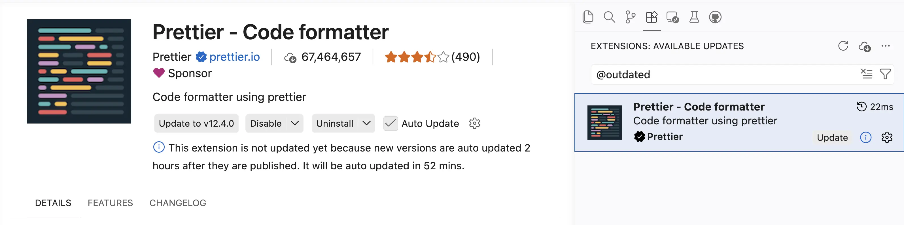

# Visual Studio Code 1.123

Follow us on [LinkedIn](https://www.linkedin.com/showcase/vs-code), [X](https://go.microsoft.com/fwlink/?LinkID=533687), [Bluesky](https://bsky.app/profile/vscode.dev) <!-- %IF INSIDERS % | Follow Insiders Changelog on [X](https://x.com/VSCodeChangelog) or [Bluesky](https://bsky.app/profile/vscodechangelog.bsky.social) %ENDIF % --> <!-- %IF IN_PRODUCT % | [View online](https://code.visualstudio.com/updates)%ENDIF % -->

---

_Release date: June 3, 2026_

<!-- DOWNLOAD_LINKS_PLACEHOLDER -->

---

Welcome to the 1.123 release of Visual Studio Code. This release improves how you work with agents and the integrated browser.

* [Larger context windows](#1m-context-window-for-anthropic-and-openai-models): Support for 1M context windows for Anthropic and OpenAI models.
* [Session sync](#session-sync-and-chronicle): Automatically sync your chat sessions across machines and search your coding history.
* [Agents window](#agents-window-preview): Open multiple agent sessions side-by-side to compare or review work in parallel.
* [Research agent](#research-agent-preview): Run deep research on a topic and get a thorough, well-cited Markdown report.
* [Integrated browser updates](#integrated-browser): Favorite pages for quick access and more options to capture browser screenshots.

> Make sure to join [VS Code Live at Build 2026](https://aka.ms/VSCode/Livestage) on June 3!

Happy Coding!

---

<!-- %IF STABLE %
VS Code is rolling out gradually to all users. Use **Check for Updates** in VS Code to get the latest version immediately.

To try new features as soon as possible, [**download the nightly Insiders build**](https://code.visualstudio.com/insiders), which includes the latest updates as soon as they are available.

---
%ENDIF % -->

<!-- TOC

  <nav id="toc-nav">
    
In this update

    <ul>
      <li><a href="#agents">Agents</a></li>
      <li><a href="#language-models">Language Models</a></li>
      <li><a href="#integrated-browser">Integrated Browser</a></li>
      <li><a href="#editor-experience">Editor Experience</a></li>
      <li><a href="#thank-you">Thank you</a></li>
    </ul>
  </nav>
  

Navigation End -->

## Agents

### Session sync and chronicle

**Setting**: `setting(chat.sessionSync.enabled)`

Your chat sessions now sync automatically to your GitHub account, giving you a personal, searchable history of your work across machines and workspaces.

Each session captures the conversation, the files you touched, repository context (repo, branch, timestamps), and any pull requests, issues, or commits referenced along the way.

With the new chronicle commands (`/chronicle`) in chat, you can put that history to work:

* Ask natural-language questions about past sessions
* Generate standup reports
* Get personalized productivity tips
* Search your coding history by topic, file, or PR

To enable session sync, turn on `setting(chat.sessionSync.enabled)`. You can view the status of session sync in the Copilot status dashboard in the VS Code Status Bar.

For more details, see the [Session Sync](https://code.visualstudio.com/docs/agents/sessions/session-sync) and [Chronicle](https://code.visualstudio.com/docs/agents/sessions/session-insights) documentation.

### Retry network-dependent commands in the sandbox

**Setting**: `setting(chat.agent.sandbox.retryWithAllowNetworkRequests)`

When a terminal command that is run by a _local_ agent requires access to domains that are not configured as allowed domains, the command is automatically retried inside the sandbox with unrestricted network access. After that, if it still fails, it falls back to unsandboxed execution. This allows network-dependent operations such as `git fetch` to finish, while keeping filesystem protections in place.

### Agents window (Preview)

The [Agents window](https://aka.ms/VSCode/Agents/docs) is a dedicated companion window optimized for exploring, iterating on, and reviewing agent sessions across projects and machines. This release, we focused on letting you work with multiple sessions side by side.

#### Multiple open sessions

You can now have more than one session open at the same time in the Agents window. In addition to the active session, open another session next to it by:

* Selecting **Open to the Side** in the context menu of a session in the sessions list.
* Dragging and dropping a session from the sessions list into the sessions view area.
* Holding `kbstyle(Alt)` and selecting a session in the sessions list.

<video src="images/1_123/sessions-grid.mp4" title="Video showing multiple agent sessions open side by side in the Agents window." autoplay loop controls muted></video>

Even though multiple sessions can be visible at once, only one is the active session at any time. The **Terminal**, **Files**, and **Changes** views all operate on the currently active session, so switching the active session updates these views to reflect its state.

By default, selecting a session in the sessions list replaces the active session view with the selected one. To keep a session view from being replaced, pin it with the pin action in the top right of the view. Pinned session views are never replaced—selecting another session opens it in an unpinned view instead. If every session view is pinned, the selected session opens to the side.

Use the maximize action in the top right of a session view to expand it across all open session views, giving you a focused view of a single session without closing the others.

For more details, see the [Agents window documentation](https://aka.ms/VSCode/Agents/docs).

### Research agent (Preview)

> **Note**: The research agent is currently in preview and available only in Copilot CLI (local) sessions in Insiders.

When you need to understand unfamiliar code, compare approaches, or learn how a library or API works, a quick chat answer isn't always enough. The research agent runs deep research on a topic and produces a thorough, well-cited Markdown report by gathering and synthesizing information from your codebase, relevant GitHub repositories, and the web.

The research agent is optimized for depth rather than speed and has read-only access, so it investigates and reports instead of changing your code. To run it, type `/research` followed by your topic in the chat input of a Copilot CLI (local) session.

For more details, see [Run deep research with the research agent](https://code.visualstudio.com/docs/agents/agent-types/copilot-cli#run-deep-research-with-the-research-agent).

## Language Models

### 1M context window for Anthropic and OpenAI models

VS Code now supports 1 million token context windows for compatible Anthropic and OpenAI models. This expanded context window enables you to work with significantly larger codebases and longer conversations without losing important context. The expanded context window is available when using supported models, such as Claude Opus 4.7 and GPT-5.5.

> **Note**: Larger context windows may consume more tokens per interaction, which increases AI credits usage under usage-based billing.

## Integrated Browser

### Favorite pages

We've remodeled the address bar in the integrated browser into a more versatile experience where you can not only enter URLs but also favorite pages and easily access your favorites and open tabs.

To add a page to your favorites, select the star icon in the browser URL bar.

When you select the URL bar, you can see your list of favorite pages and open tabs.

### More ways to capture screenshots

**Setting**: `setting(workbench.browser.experimentalUserTools.enabled)`

The previous release introduced **Add Screenshot to Chat**, which lets you attach a screenshot of the current browser viewport to chat as context. This is especially useful for UI-related tasks, such as debugging a layout issue.

This release, we added two related features:

* **Add Area Screenshot to Chat**: Take a screenshot of a rectangular area that you select, and add that screenshot as chat context.
* **Add Full Page Screenshot to Chat (Experimental)**: Take a screenshot of the entire web page, even beyond what is shown in the current viewport, and add that screenshot as chat context. This experimental feature requires enabling the `setting(workbench.browser.experimentalUserTools.enabled)` setting.

## Editor Experience

### Delayed extension auto-updates

VS Code now applies a two-hour delay before automatically updating extensions to a newly published version. When automatic updates are enabled, new versions are auto-updated two hours after they are published, adding an extra layer of protection against problematic or potentially compromised releases.

This never gets in your way, as you can still update any extension immediately at any time by using the **Update** button. While an update is waiting, the extension's details view explains why it hasn't updated yet and when the automatic update will happen.

> **Note**: This delay does not apply to extensions from trusted publishers such as Microsoft, GitHub, and OpenAI. These extensions continue to update immediately.

## Thank you

Contributions to our issue tracking:

* [@gjsjohnmurray (John Murray)](https://github.com/gjsjohnmurray)
* [@RedCMD (RedCMD)](https://github.com/RedCMD)
* [@IllusionMH (Andrii Dieiev)](https://github.com/IllusionMH)
* [@albertosantini (Alberto Santini)](https://github.com/albertosantini)

Contributions to `vscode`:

* [@aaronpowell (Aaron Powell)](https://github.com/aaronpowell): Add marketplace ref support for plugin marketplaces [PR #317901](https://github.com/microsoft/vscode/pull/317901)
* [@goingforstudying-ctrl](https://github.com/goingforstudying-ctrl): fix: add white-space: nowrap to browser-emulation-toolbar-label [PR #318935](https://github.com/microsoft/vscode/pull/318935)
* [@guomaggie](https://github.com/guomaggie): [Search Subagent] Handle context window limit exceeded error [PR #316529](https://github.com/microsoft/vscode/pull/316529)
* [@maruthang (Maruthan G)](https://github.com/maruthang): fix: combine URI flags to prevent Electron argument filtering on Windows [PR #308150](https://github.com/microsoft/vscode/pull/308150)
* [@oded-ist (Oded S)](https://github.com/oded-ist): Fix read_cell_output incorrectly reporting all outputs as too large [PR #318148](https://github.com/microsoft/vscode/pull/318148)
* [@PenguinDOOM (Penguin)](https://github.com/PenguinDOOM): Fix BYOK invalid stateful marker retries [PR #317292](https://github.com/microsoft/vscode/pull/317292)
* [@rebornix (Peng Lyu)](https://github.com/rebornix): Add mobile multi-diff view [PR #318081](https://github.com/microsoft/vscode/pull/318081)
* [@SimonSiefke (Simon Siefke)](https://github.com/SimonSiefke)
  * fix: memory leak extension actions [PR #315054](https://github.com/microsoft/vscode/pull/315054)
  * fix: memory leak in ipc.electron.ts [PR #317846](https://github.com/microsoft/vscode/pull/317846)
  * fix: memory leak in search results [PR #282309](https://github.com/microsoft/vscode/pull/282309)
* [@SLdragon (rentu)](https://github.com/SLdragon): feat: add languageDiagnosticsService option for nes/inline completion provider [PR #317678](https://github.com/microsoft/vscode/pull/317678)
* [@Tyriar (Daniel Imms)](https://github.com/Tyriar): fix: remove awaits inside Promise.race in shell integration test [PR #319068](https://github.com/microsoft/vscode/pull/319068)

---

We really appreciate people trying our new features as soon as they are ready, so check back here often and learn what's new.

>If you'd like to read release notes for previous VS Code versions, go to [Updates](https://code.visualstudio.com/updates) on [code.visualstudio.com](https://code.visualstudio.com).

<a id="scroll-to-top" role="button" title="Scroll to top" aria-label="scroll to top" href="#"></a>
<link rel="stylesheet" type="text/css" href="css/inproduct_releasenotes.css"/>
