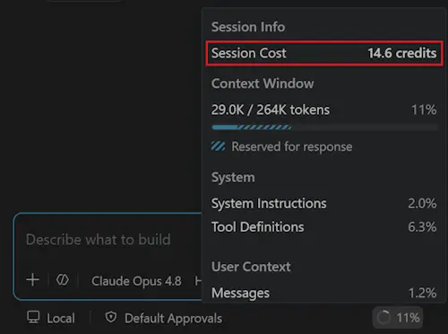
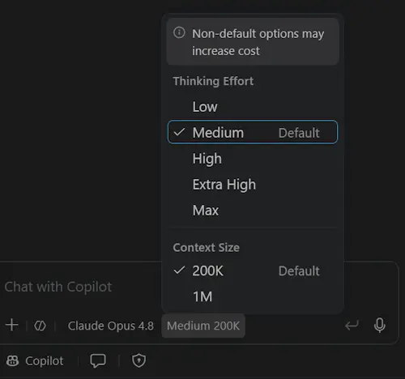
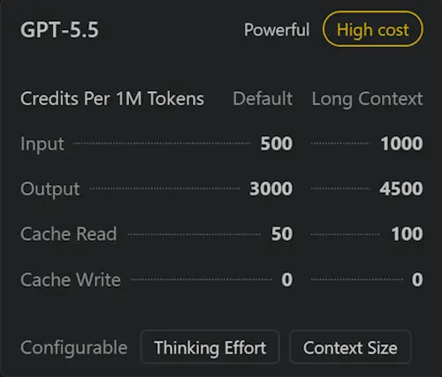
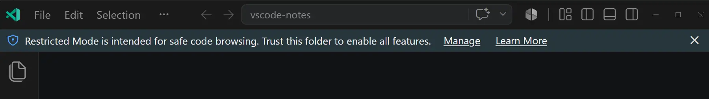
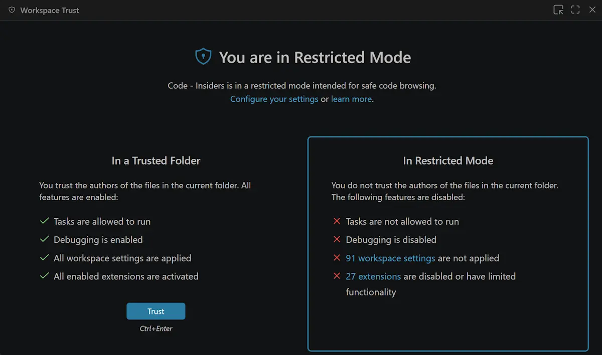
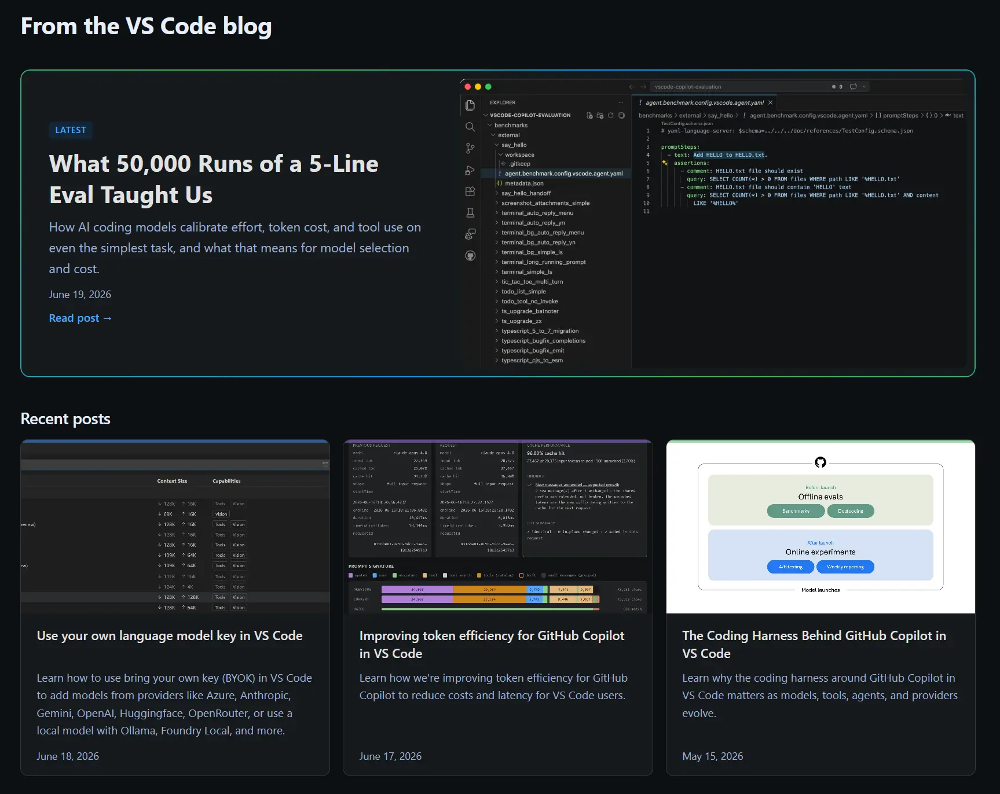

# Visual Studio Code 1.126

Follow us on [LinkedIn](https://www.linkedin.com/showcase/vs-code), [X](https://go.microsoft.com/fwlink/?LinkID=533687), [Bluesky](https://bsky.app/profile/vscode.dev) <!-- %IF INSIDERS % | Follow Insiders Changelog on [X](https://x.com/VSCodeChangelog) or [Bluesky](https://bsky.app/profile/vscodechangelog.bsky.social) %ENDIF % --> <!-- %IF IN_PRODUCT % | [View online](https://code.visualstudio.com/updates)%ENDIF % -->

---

_Release date: June 24, 2026_

<!-- DOWNLOAD_LINKS_PLACEHOLDER -->

---

Welcome to the 1.126 release of Visual Studio Code. This release brings clearer cost transparency, simpler model tuning, and safer browsing of unfamiliar code.

* [Session-level cost](#session-level-cost-information): See the total cost of a chat session to spot expensive conversations.

* [Multiple chats per session](#multiple-chats-in-an-agent-host-copilot-session): Run several chats side by side in one agent host Copilot session.

* [Workspace trust](#open-new-folders-in-restricted-mode): Browse new folders safely in restricted mode.

Happy Coding!

---

<!-- %IF STABLE %
VS Code is rolling out gradually to all users. Use **Check for Updates** in VS Code to get the latest version immediately.

To try new features as soon as possible, [**download the nightly Insiders build**](https://code.visualstudio.com/insiders), which includes the latest updates as soon as they are available.

---
%ENDIF % -->

<!-- TOC

  <nav id="toc-nav">
    
In this update

    <ul>
      <li><a href="#cost-management">Cost management</a></li>
      <li><a href="#language-models">Language models</a></li>
      <li><a href="#agents-window-preview">Agents window</a></li>
      <li><a href="#editor-experience">Editor experience</a></li>
      <li><a href="#website">Website</a></li>
      <li><a href="#deprecated-features-and-settings">Deprecated features and settings</a></li>
      <li><a href="#thank-you">Thank you</a></li>
    </ul>
  </nav>
  

Navigation End -->

## Cost management

### Session-level cost information

You can now see the cost for an entire chat session, not just for individual turns. This gives you better transparency into which sessions consume the most credits, making it easier to spot expensive conversations and manage your usage over time.

## Language models

### Unified model customization picker

To simplify language model configuration, we have combined the context size and reasoning (thinking) effort controls into a single model customization picker. From one place, you can adjust both settings when tuning a model, instead of working with two separate dropdowns.

### Simplified model hover

We cleaned up the model hover to make it easier to scan. It now shows a concise one-word descriptor of the model's capabilities and includes deep link buttons that take you directly to the relevant configuration.

## Agents window (Preview)

The [Agents window](https://aka.ms/VSCode/Agents/docs) is a dedicated companion window optimized for exploring, iterating on, and reviewing agent sessions across projects and machines.

### Multiple chats in an agent host Copilot session

The Agents window lets you run and manage multiple agent sessions side by side. In this release, a Copilot session started from an agent host can hold several chats at once. Because the chats share the same session and working context, you can keep more than one conversation going in the same workspace at the same time.

Say your primary chat is busy implementing a feature. Instead of waiting or interrupting it, select **New Chat** (`+`) in the session toolbar to open a second chat in the same session, then use it to review the changes so far, draft tests, or write the documentation. Both run at once, and each chat keeps its own conversation. You can switch between tabs and pick up right where you left off.

Chats are persisted and restored across a window reload. Step away and come back to every conversation in the session, not just the first one.

You can rename a chat directly in its tab to keep track of what each one is for, just like renaming a session from the session header:

* **Double-click** a tab, or select **Rename** from its context menu, to edit the title in place.
* Press **Enter** to commit the rename, or **Escape** to cancel. Selecting another tab while editing also cancels the edit and switches to that tab.

A chat's title is independent of the session title, so renaming the session does not overwrite a chat you renamed.

<video src="images/1_126/multi-chat-sessions.mp4" title="Video showing multiple chats running in a single agent host Copilot session, with new chats added from the session toolbar and switching between chat tabs." autoplay loop controls muted></video>

### Agentic code feedback with agent host harnesses

In the Agents window, comments you leave on generated code are now stored on the agent host, so the agent can interact with your feedback by using server-side tools such as `listComments` and `resolveComments`. This works even when you disconnect the client, since the comments live on the server rather than in your local session.

The agent can also create the comments for you by using the `addComment` tool. When you run a review skill such as `/code-review`, it reviews your code and adds comments inline, which you can then accept or delete before submitting them to an agent to address.

Pull request review comments work the same way. You can accept the PR review comments and submit them to the agent, or ask the agent to resolve all PR comments. When you ask the agent to resolve PR comments that you haven't accepted yet, it first requests your permission to view them, and once you grant access, it addresses the PR review items.

## Editor experience

### Open new folders in Restricted Mode

**Setting**: `setting(security.workspace.trust.startupPrompt)`

[Workspace Trust](https://code.visualstudio.com/docs/editing/workspaces/workspace-trust) lets you decide whether your project folders can automatically run code, which adds a layer of security when you work with unfamiliar code.

Previously, opening a new folder immediately interrupted you with a dialog asking whether to trust the folder before you could look at its contents. Now, new folders open in [Restricted Mode](https://code.visualstudio.com/docs/editing/workspaces/workspace-trust#_restricted-mode) and only show the trust banner. This lets you browse the code safely first and trust the folder when you're ready.

This changes the default value of the `setting(security.workspace.trust.startupPrompt)` setting from `once` to `never`. To restore the previous behavior and be prompted the first time you open a folder, set the value back to `once`.

### Removed trust parent from the Workspace Trust editor

The Workspace Trust editor previously showed a **Trust Parent** button next to the **Trust** button. Because it looked just like **Trust** but trusted the entire parent folder, it was easy to select by mistake and trust more folders than you intended.

To reduce that risk, the **Trust Parent** button is removed. You can still trust a parent folder by adding its path to the **Trusted Folders & Workspaces** list in the Workspace Trust editor.

## Website

### VS Code blog

As the team has been writing more and more blog posts, in quick succession, we realized that our blogs section could use some love. Previously, when you open the blog section, you were directly taken to the last blog post, leaving previous posts often overlooked. We have now added a [blog landing page](https://code.visualstudio.com/blogs) that highlights the several recent posts.

And if you are looking for the full list of all blog posts, you can now find it in the [blog archive](https://code.visualstudio.com/blogs/archive).

### VS Code documentation

We've restructured our documentation table of contents to make it more scannable and easier to navigate. All our agentic documentation is now grouped under a single "Agents" section, and anything related to editing code and configuring VS Code is grouped under "Editor".

Previously, the documentation for supported languages and specific extensions was individually listed in the table of contents. We have now moved them under "Languages and Runtimes" and "Extension Docs" respectively, so you can find all the information you need in one place.

Let us know what you think of the new structure by [submitting feedback](https://github.com/microsoft/vscode-docs/issues) in the microsoft/vscode-docs repository.

## Deprecated features and settings

### Edit mode

We've deprecated the `chat.editMode.hidden` setting, so the built-in Edit mode is no longer supported in most scenarios. We recommend using [Agent mode](https://code.visualstudio.com/docs/copilot/chat/chat-agent-mode) instead, which covers the same editing scenarios while also being able to run tasks and tools on your behalf.

You might still encounter Edit mode in some scenarios, because it remains in the codebase for compatibility and fallback purposes:

* The built-in Edit mode (`ChatMode.Edit`) is still registered for backward compatibility.
* It is intentionally shown when `chat.agent.enabled` is disabled by policy. When Agent mode is disabled by policy, the mode picker falls back to the built-in Edit mode.
* Old or restored sessions and certain command paths can still select it. For example, `setChatMode('edit')` still resolves, and `workbench.action.chat.newEditSession` remains as an alias path.

## Thank you

Contributions to `vscode`:

* [@bikeshgyawali (Bikesh)](https://github.com/bikeshgyawali):  Add missing unit test coverage for prefixedUuid in uuid.ts [PR #322146](https://github.com/microsoft/vscode/pull/322146)
* [@Bryan2333 (BryanLiang)](https://github.com/Bryan2333): fix issue 300307 [PR #322104](https://github.com/microsoft/vscode/pull/322104)
* [@carlbrochu (Carl Brochu)](https://github.com/carlbrochu): Add SKU to enhance GH telemetry events [PR #321046](https://github.com/microsoft/vscode/pull/321046)
* [@cavalloJustinEmery (Justin Emery)](https://github.com/cavalloJustinEmery): fix: plugin skill files not accessible when connected to remote [PR #309465](https://github.com/microsoft/vscode/pull/309465)
* [@guomaggie](https://github.com/guomaggie): select correct subagent model [PR #321061](https://github.com/microsoft/vscode/pull/321061)
* [@mjbvz (Matt Bierner)](https://github.com/mjbvz)
  * Update contribution names [PR #321503](https://github.com/microsoft/vscode/pull/321503)
  * Fully switch normal `npm run compile` to use tsgo too [PR #321646](https://github.com/microsoft/vscode/pull/321646)
  * Kill and restart esbuild instances during watch mode [PR #321219](https://github.com/microsoft/vscode/pull/321219)
* [@rfeltis (Ralph Feltis)](https://github.com/rfeltis): Add telemetry for chat quota notification banners [PR #321793](https://github.com/microsoft/vscode/pull/321793)
* [@romalpani (Rohan Malpani)](https://github.com/romalpani): Update new chat in session tip text [PR #321965](https://github.com/microsoft/vscode/pull/321965)
* [@wszgrcy (chen)](https://github.com/wszgrcy): fix: registerToolDefinition loss tags [PR #319922](https://github.com/microsoft/vscode/pull/319922)

### Issue tracking

Contributions to our issue tracking:

* [@gjsjohnmurray (John Murray)](https://github.com/gjsjohnmurray)
* [@RedCMD (RedCMD)](https://github.com/RedCMD)
* [@IllusionMH (Andrii Dieiev)](https://github.com/IllusionMH)
* [@albertosantini (Alberto Santini)](https://github.com/albertosantini)

---

We really appreciate people trying our new features as soon as they are ready, so check back here often and learn what's new.

>If you'd like to read release notes for previous VS Code versions, go to [Updates](https://code.visualstudio.com/updates) on [code.visualstudio.com](https://code.visualstudio.com).

<a id="scroll-to-top" role="button" title="Scroll to top" aria-label="scroll to top" href="#"></a>
<link rel="stylesheet" type="text/css" href="css/inproduct_releasenotes.css"/>
