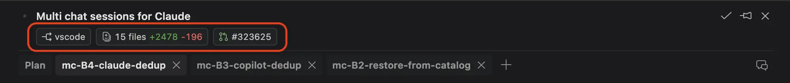
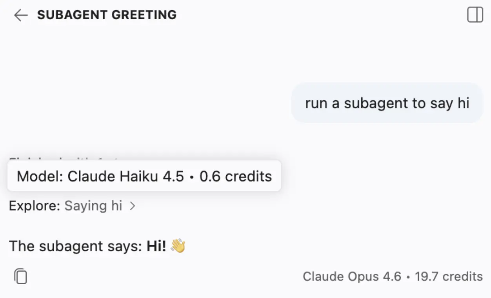
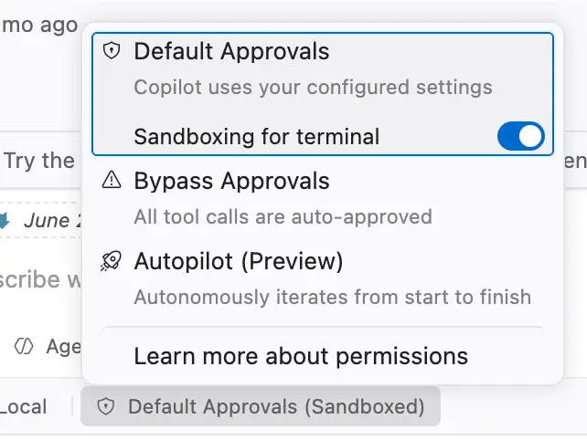
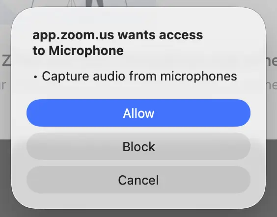

# Visual Studio Code 1.127

Follow us on [LinkedIn](https://www.linkedin.com/showcase/vs-code), [X](https://go.microsoft.com/fwlink/?LinkID=533687), [Bluesky](https://bsky.app/profile/vscode.dev) <!-- %IF INSIDERS % | Follow Insiders Changelog on [X](https://x.com/VSCodeChangelog) or [Bluesky](https://bsky.app/profile/vscodechangelog.bsky.social) %ENDIF % --> <!-- %IF IN_PRODUCT % | [View online](https://code.visualstudio.com/updates)%ENDIF % -->

---

_Release date: July 1, 2026_

<!-- DOWNLOAD_LINKS_PLACEHOLDER -->

---

Welcome to the 1.127 release of Visual Studio Code. This release brings agents that can build and test web apps in the browser, safer per-site browsing, and new ways to keep busy agent sessions organized.

* [Browser tools for agents](#agent-tools-are-generally-available): Let agents open pages, take screenshots, and click through to validate their own work, now generally available.

* [Per-site browser permissions](#camera-location-devices-and-more): Grant pages access to the camera, location, devices, and more, with a prompt for each site.

* [Organize the sessions list](#session-list-grouping): Group related sessions and drag and drop to arrange a busy Agents window.

* [Chat input banners](#stay-on-top-of-your-agent-sessions-with-chat-input-banners): Act on failing CI checks and incoming pull request comments without leaving the conversation.

* [Subagent credits](#subagent-credits): Hover over a subagent to see the cost of the work it handled.

Happy Coding!

---

<!-- %IF STABLE %
VS Code is rolling out gradually to all users. Use **Check for Updates** in VS Code to get the latest version immediately.

To try new features as soon as possible, [**download the nightly Insiders build**](https://code.visualstudio.com/insiders), which includes the latest updates as soon as they are available.

---
%ENDIF % -->

<!-- TOC
<div class="toc-nav-layout">
  <nav id="toc-nav">
    <div>In this update</div>
    <ul>
      <li><a href="#agents">Agents</a></li>
      <li><a href="#cost-management">Cost management</a></li>
      <li><a href="#chat">Chat</a></li>
      <li><a href="#language-models">Language models</a></li>
      <li><a href="#integrated-browser">Integrated browser</a></li>
      <li><a href="#enterprise">Enterprise</a></li>
      <li><a href="#deprecated-features-and-settings">Deprecated features and settings</a></li>
      <li><a href="#thank-you">Thank you</a></li>
    </ul>
  </nav>
  <div class="notes-main">
Navigation End -->

## Agents

### Agents window (Preview)

The [Agents window](https://code.visualstudio.com/docs/agents/agents-window) is a dedicated companion window optimized for exploring, iterating on, and reviewing agent sessions across projects and machines. This release brings new ways to organize the sessions list and keep a busy list of sessions manageable.

#### Use groups to organize sessions

When you run several agent sessions at once, the sessions list can grow quickly and become hard to scan. You can now organize the sessions list into groups to keep related sessions together. Create your own custom groups, and collapse group headers to tidy up the list and focus on what matters.

Each group also offers quick actions: you can start a new session directly in a group, or mark all of its sessions as done with one action.

<video src="images/1_127/sessions-group.mp4" title="Video showing how to group sessions in the Agents window. The user creates a new group and drags sessions into it." autoplay controls muted></video>

#### Drag and drop in the sessions list

The sessions list now supports drag and drop to further organize your sessions:

* Reorder sessions by dragging them up or down
* Drag session group and workspace headers to rearrange the list
* Drag a session onto a group to add it to that group
* Drop a session onto the **Pinned** section to pin it
* Select multiple sessions to move them together as a block

<video src="images/1_127/sessions-dnd.mp4" title="Video showing how to drag and drop sessions in the Agents window." autoplay controls muted></video>

#### Chat input banners

When a coding agent session has an open pull request, the Agents window displays a banner directly above the chat input, letting you act on failing checks and incoming feedback right where you're working. Each banner provides a single action to fix or view the issue without leaving your conversation:

* **CI failures:** When checks on the pull request fail, a banner shows how many checks failed (for example, "2 of 5 checks failed") with quick actions: **Fix Checks** starts an agent fix, and **Reveal Checks** opens the failing checks in the Changes view.

<video src="images/1_127/input-banner-ci.mp4" title="Video showing a banner above the chat input with the text '8 out of 22 checks failed, 7 pending', with actions to reveal and fix failed checks." autoplay controls muted></video>

* **Pull request comments:** When new review comments come in, a banner shows the comment count with actions: **Address Comments** hands them to the agent, and **Reveal Comments** opens them in the editor.

<video src="images/1_127/input-banner-pr.mp4" title="Video showing a banner above the chat input with two pull request comments, with actions to reveal and address the comments." autoplay controls muted></video>

#### Onboarding tours (Experimental)

Getting started with agents can be daunting if you're not sure what they can do for you. Onboarding tours are now available in the Agents window to help you get up to speed quickly. These guided walkthroughs highlight key capabilities and show you how to make the most of working with agents, helping you discover the best ways to delegate tasks and stay productive from day one.

We're experimenting with these tours to find the most helpful way to introduce new users to the experience.

<video src="images/1_127/onboarding.mp4" title="Video showing an onboarding example in the Agents window. The user sends a message, sees a pulse animation on the new session button, and reviews spotlighted workspace and isolation pickers." autoplay controls muted></video>

#### Editor gutter feedback when reviewing agent changes

When reviewing an agent's changes, pointing it at the exact code you want changed should be effortless. You can now leave feedback directly from the editor gutter: hovering over a line reveals an **Add Feedback** glyph in the gutter, and selecting it drops a comment on that line, making it quicker to direct an agent to a specific spot in the code.

This release also brings a round of polish to the agent feedback experience, with refinements to the feedback input, hover behavior, and overall visual consistency.

<video src="images/1_127/agent-feedback-add-action.mp4" title="Video showing how to add feedback to an agent's changes. The user hovers over a line, selects the add feedback glyph, and enters a comment." autoplay controls muted></video>

#### Better pull request titles and descriptions from session context

Creating a pull request from the Agents window used to produce generic titles and descriptions that often needed manual editing. The **Create Pull Request** button now uses the session context to generate the pull request title and description, resulting in more accurate and descriptive pull requests that better reflect the work done in the session.

#### Multi-chat sessions

Multi-chat sessions let you run several chats within a single agent host Copilot session. This release builds on that foundation with the following improvements.

##### Close, reopen, and delete chats

Create new chats from the **+ New Chat** button in the session header. Once more than one chat is open, a tab strip appears with a trailing **+** to add more. Closing a chat with the **X** on its tab hides it rather than discarding it—bring it back from the **Conversations** dropdown, where each chat has a checkbox to show or hide it. To permanently remove a chat, open its tab context menu and select **Delete Chat**.

<video src="images/1_127/multi-chat-session-chat-actions.mp4" title="Video showing the multi-chat session tab strip with the trailing + button to add chats and the Conversations dropdown to show or hide chats." autoplay loop controls muted></video>

##### Progress and changes across all chats

Previously, the session only reflected the active chat's activity, making it hard to tell whether peer chats were still working or what they had changed. Progress and file changes are now aggregated across all chats: the session shows as in-progress whenever any chat is working, each tab surfaces its own progress, and the session header Changes pill reflects the combined edits from every peer chat.

##### Fork a conversation into a peer chat

When you fork a conversation in a multi-chat session, the fork now creates a new peer chat in the same session instead of a brand-new top-level session. The forked chat inherits the conversation up to the fork point, runs independently from its siblings, and gets an auto-generated title. Single-chat and non-agent-host sessions keep the existing behavior of forking into a new session.

<video src="images/1_127/sessions-fork-chat.mp4" title="Video showing forking a conversation in a multi-chat session, which creates a new peer chat in the same session." autoplay loop controls muted></video>

#### Session layout

##### Consistent pills in the session header

The row of actions under the session title now renders consistently as uniform, compact secondary button pills. A **Workspace pill** shows the workspace icon (cloud, folder, or worktree depending on the workspace kind) and label, with long names truncated. The **Changes pill** (`N files +X -Y`) reads and opens the session's default changeset, keeping its count and the multi-file diff it opens in agreement for both Copilot and agent-host providers.



##### Focus moves to the chat input when switching sessions

When you open a session in the Agents window, keyboard focus now lands in the chat input, ready for you to start typing immediately, even when the session has editors open or a Changes view that loads. Highlighting entries in the sessions list with the keyboard does not move focus until you actually open a session.

<video src="images/1_127/sessions-focus-management.mp4" title="Video showing keyboard focus landing in the chat input when switching to a session in the Agents window." autoplay loop controls muted></video>

##### Responsive sessions sidebar (Experimental)

**Setting**: `setting(sessions.layout.autoCollapseSessionsSidebar)`

On a narrow window, showing the editor, side panel, and sessions sidebar at once leaves little room to work. When enabled, the Agents window automatically hides the sessions sidebar when the window is narrow and both the editor and side panel are open, and shows it again when there is room. It respects a manual close and suspends the behavior when multiple sessions are shown at once.

<video src="images/1_127/sessions-adaptive-layout.mp4" title="Video showing the Agents window automatically hiding the sessions sidebar when the window becomes narrow and showing it again when there is room." autoplay loop controls muted></video>

### Troubleshoot agent behavior with /troubleshoot

The troubleshoot skill, invoked with the `/troubleshoot` command, helps diagnose chat issues by analyzing chat session logs and surfacing insights into the agent's behavior. Use it to investigate why custom instructions are ignored or why responses are slow.

In this release, you can use `/troubleshoot` to diagnose agent host sessions, including local and remote sessions. In the Agents window, type `/troubleshoot` in the chat input followed by `#session`, select the session you want to troubleshoot, and add a question or description of the issue you're experiencing.


## Cost management

### Subagent credits

When an agent delegates work to a subagent, it can be difficult to know the cost of the delegated work. To make this more transparent, you can now hover over a subagent section in the chat response to see the AI credits used by that subagent.



## Chat

### Sandboxing for terminal commands on macOS and Linux

Approving every agent-invoked terminal command quickly becomes tedious. Starting with this release, we're rolling out sandboxing for terminal commands on macOS and Linux: commands run with network access blocked and filesystem access restricted, letting the agent work with fewer prompts.

The agent only asks for approval when a command needs to elevate and run outside the sandbox. To learn more, see [Agent sandboxing](https://code.visualstudio.com/docs/agents/concepts/trust-and-safety#_agent-sandboxing).

You can turn this off via the Permissions drop-down:



## Language models

### Deprecation of the built-in Ollama provider

Model providers can contribute models for the VS Code chat experience via an extension. By using an extension, providers can give you faster support for new models and capabilities than a built-in provider could offer.

Ollama now has an [official VS Code extension](https://marketplace.visualstudio.com/publishers/Ollama), which is the recommended way to use local Ollama models in chat.

As a result, the built-in Ollama provider is now deprecated. If you're using the built-in provider to run local models with [Bring Your Own Key (BYOK)](https://code.visualstudio.com/docs/copilot/customization/language-models#_bring-your-own-language-model-key), install the official extension and remove the built-in provider to continue using your Ollama models without interruption. The following video shows how to remove the deprecated provider.

<video src="images/1_127/ollama-deprecation.mp4" title="Video showing how to remove the deprecated built-in Ollama provider." autoplay controls muted></video>

## Integrated browser

### Camera, location, devices, and more

The integrated browser now supports per-site permissions. This enables pages to use more web APIs, including:

* Geolocation
* Camera and microphone
* Sensors, such as accelerometer and gyroscope
* Clipboard
* Devices, such as Bluetooth, USB, serial, and HID

When a page requests a permission, VS Code prompts you to allow or deny the request, as you would expect in a traditional browser.



Manage permissions for the current site from the **Site Permissions** browser menu item.

### Agent tools are generally available

**Setting**: `setting(workbench.browser.enableChatTools)`

Browser tools let an agent open pages in the integrated browser, read content and console errors, take screenshots, and select, type, and navigate to verify its own work, all without an external MCP server. After several milestones in preview, browser tools are generally available and enabled by default.

A big thank you to everyone who ran the preview, filed issues, and shared feedback. Your testing directly shaped the per-session tab isolation, the explicit page-sharing controls, and the permission model that ship in this release.

Ask an agent to build and validate a web app, or follow the step-by-step [Build and test web apps with browser agent tools](https://code.visualstudio.com/docs/agents/guides/browser-agent-testing-guide) guide to see the closed build-test-fix loop in action. For the full reference, see [Browser tools for agents](https://code.visualstudio.com/docs/debugtest/integrated-browser#_browser-tools-for-agents).

Administrators can govern browser tools through enterprise policy: disable them entirely with the `BrowserChatTools` policy, or restrict which domains agent tools can reach with agent network filtering (`ChatAgentNetworkFilter` plus allow and deny domain lists). See [Configure AI settings for your organization](https://code.visualstudio.com/docs/enterprise/ai-settings#_configure-agent-network-filtering).

## Enterprise

### File-based delivery for managed Copilot settings

Administrators can now deliver managed GitHub Copilot settings from a JSON file on disk, in addition to the [native MDM channels](https://code.visualstudio.com/updates/v1_125#_native-mdm-delivery-for-managed-copilot-settings) and the account-based enterprise settings file.

This gives organizations a straightforward way to apply policies on machines that aren't enrolled in a device management solution, or where provisioning a file through existing tooling (such as a configuration management system or imaging pipeline) is simpler than authoring native MDM payloads.

VS Code reads a `managed-settings.json` file from a well-known per-OS location.  This file is honored only when MDM or account-based enterprise settings are not present.

* **macOS**: `/Library/Application Support/GitHubCopilot/managed-settings.json`
* **Linux**: `/etc/github-copilot/managed-settings.json`
* **Windows**: `%ProgramFiles%\GitHubCopilot\managed-settings.json`

The file contains a JSON object using the same schema an administrator authors through GitHub.com, for example:

```json
{
  "permissions": {
    "disableBypassPermissionsMode": "disable"
  },
  "enabledPlugins": {
    "plugin@marketplace": false
  }
}
```

To learn more, see GitHub's documentation on [Enterprise managed client settings](https://docs.github.com/en/copilot/how-tos/administer-copilot/manage-for-enterprise/manage-agents/configure-enterprise-plugin-standards).

## Deprecated features and settings

None

## Thank you

Contributions to `vscode`:

* [@aaronpowell (Aaron Powell)](https://github.com/aaronpowell): Handle plugin marketplace pull recovery [PR #318270](https://github.com/microsoft/vscode/pull/318270)
* [@gjsjohnmurray (John Murray)](https://github.com/gjsjohnmurray)
  * Allow disabling AuthenticationProvider extension for workspace if not used by Settings Sync [PR #320415](https://github.com/microsoft/vscode/pull/320415)
  * :lipstick: correct command capitalization in /causedByExtension response [PR #298925](https://github.com/microsoft/vscode/pull/298925)
* [@rfeltis (Ralph Feltis)](https://github.com/rfeltis)
  * Add quota checkpoint to notification telemetry [PR #322767](https://github.com/microsoft/vscode/pull/322767)
  * Add chat quota trajectory nudge [PR #320683](https://github.com/microsoft/vscode/pull/320683)
* [@romalpani (Rohan Malpani)](https://github.com/romalpani): Give ask-questions carousel a visible box in the Agents window [PR #322188](https://github.com/microsoft/vscode/pull/322188)
* [@Sid200026 (Siddharth Singha Roy)](https://github.com/Sid200026): Add chatSessionId to chat.modelChange telemetry [PR #322579](https://github.com/microsoft/vscode/pull/322579)
* [@tamuratak (Takashi Tamura)](https://github.com/tamuratak): Fix: CancellationToken not propagating to `provideLanguageModelChatResponse` on chat stop [PR #319098](https://github.com/microsoft/vscode/pull/319098)
* [@yavanosta (Dmitry Guketlev)](https://github.com/yavanosta): Fix `handleEndOfLifetime` `supersededBy` tracking for inline completions [PR #320143](https://github.com/microsoft/vscode/pull/320143)
* [@yulia-vasyura](https://github.com/yulia-vasyura): Renamed "Apply Update..." command to "Apply Update from File...". [PR #322504](https://github.com/microsoft/vscode/pull/322504)

Contributions to `node-pty`:

* [@codebytere-ant (Shelley Vohr)](https://github.com/codebytere-ant)
  * fix: close kqueue fd in SetupExitCallback on macOS [PR #931](https://github.com/microsoft/node-pty/pull/931)
  * fix: surface CreateProcessW failures as 'exit' instead of uncaughtException on Windows [PR #934](https://github.com/microsoft/node-pty/pull/934)
  * fix: close pipe handles and free attribute list when conpty spawn fails [PR #935](https://github.com/microsoft/node-pty/pull/935)

### Issue tracking

Contributions to our issue tracking:


* [@RedCMD (RedCMD)](https://github.com/RedCMD)
* [@gjsjohnmurray (John Murray)](https://github.com/gjsjohnmurray)
* [@mantasu (Mantas)](https://github.com/mantasu)
* [@davemcom (DaveM.)](https://github.com/davemcom)

---

We really appreciate people trying our new features as soon as they are ready, so check back here often and learn what's new.

>If you'd like to read release notes for previous VS Code versions, go to [Updates](https://code.visualstudio.com/updates) on [code.visualstudio.com](https://code.visualstudio.com).

<a id="scroll-to-top" role="button" title="Scroll to top" aria-label="scroll to top" href="#"><span class="icon"></span></a>
<link rel="stylesheet" type="text/css" href="css/inproduct_releasenotes.css"/>
