---
Order:
TOCTitle: May 2017
PageTitle: Visual Studio Code May 2017
MetaDescription: See what is new in the Visual Studio Code May 2017 Release (1.13)
MetaSocialImage: 1_13/release-highlights.png
---
# May 2017 (version 1.13)

**Update 1.13.1**: The update addresses these [issues](https://github.com/microsoft/vscode/milestone/45?closed=1).

Downloads: [Windows](https://vscode-update.azurewebsites.net/1.13.1/win32/stable) | [Mac](https://vscode-update.azurewebsites.net/1.13.1/darwin/stable) | Linux 64-bit: [.tar.gz](https://vscode-update.azurewebsites.net/1.13.1/linux-x64/stable) [.deb](https://vscode-update.azurewebsites.net/1.13.1/linux-deb-x64/stable) [.rpm](https://vscode-update.azurewebsites.net/1.13.1/linux-rpm-x64/stable) | Linux 32-bit: [.tar.gz](https://vscode-update.azurewebsites.net/1.13.1/linux-ia32/stable) [.deb](https://vscode-update.azurewebsites.net/1.13.1/linux-deb-ia32/stable) [.rpm](https://vscode-update.azurewebsites.net/1.13.1/linux-rpm-ia32/stable)

---

Welcome to the May 2017 release of Visual Studio Code. There are a number of significant updates in this version that we hope you will like, some of the key highlights include:

* **[Changes to settings defaults](#changed-setting-defaults)** - Enabled by default: extensions auto-update, editor drag and drop, and minimap (outline view).
* **[Set multiple cursors with Ctrl/Cmd + Click](#add-multiple-cursors-with-ctrl-cmd-click)** - Add multi-cursors just like Sublime Text and Atom.
* **[Improved Git merge](#merge-conflict-coloring-and-actions)** - Inline merge actions with Accept Changes CodeLens.
* **[Better IntelliSense details](#suggestion-list-and-documentation-side-by-side)** - Easily toggle full suggestion documentation.
* **[Emmet abbreviations display](#emmet-abbreviation-expansion-in-suggestion-list)** - Preview Emmet expansions as you type.
* **[Enhanced snippets](#multi-cursor-snippets)** - Increase your productivity with multi-cursor and nested snippets.
* **[Faster debugger performance](#improved-stepping-performance)** - Stepping through source code is significantly faster.
* **[File links in exception stack traces](#file-link-detection-in-exception-peek-ui)** - Jump directly to source code from exception stack traces.
* **[Docker debugging recipe](#recipes-for-nonstandard-debugging-scenarios)** - Debug configuration example for Docker projects.
* **[More workbench theming colors](#new-theming-colors)** - We've added more VS Code customizable colors.
* **[Better NVDA support](#better-nvda-support)** - Accessibility improvements for the NVDA screen reader.

>If you'd like to read these release notes online, you can go to [Updates](https://code.visualstudio.com/updates) on [code.visualstudio.com](https://code.visualstudio.com).

The release notes are arranged in the following sections related to VS Code focus areas. Here are some further updates:

* **[Workbench](#workbench)** - Filenames in symbol search, disable menu bar mnemonics.
* **[Editor](#editor)** - Resizable Find widget, new folding control settings.
* **[Languages](#languages)** - JSX/TSX component highlighting, Markdown headers in symbol search.
* **[Debugging](#debugging)** - Copy All from Debug Console, local/remote paths in launch configurations.
* **[Tasks](#tasks)** - Auto-detect and customize Gulp and Grunt tasks to run in VS Code.
* **[Extension Authoring](#extension-authoring)** - Custom views in the Explorer, reference theme colors.

**Insiders:** Want to see new features as soon as possible? You can download the nightly [Insiders](https://code.visualstudio.com/insiders) build and try the latest updates as soon as they are available.

## Setting changes

### Changed setting defaults

One thing you may notice right away in the May release is that we've changed the default value of several settings. Features such as minimap (outline view), icon themes, and indent guides have been off by default and we think they are so useful, we want to showcase them.

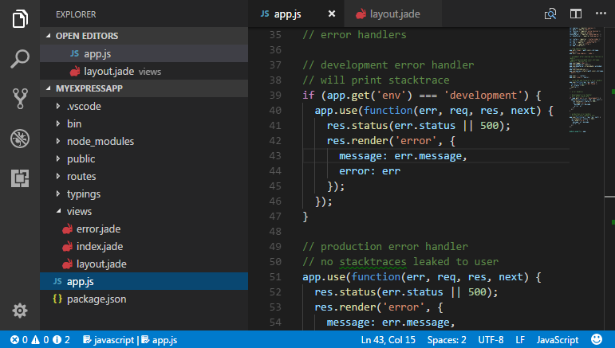

Here are the new default settings:

Setting | New Default | Description
------- | ------- | ----
`editor.minimap.enabled` | true | Show file minimap (outline view) in the right gutter
`workbench.iconTheme` | "vs-seti" | Use `vs-seti` file icon theme
`editor.renderIndentGuides` | true | Display editor indentation guides
`editor.dragAndDrop` | true | Move editor selections with drag and drop
`extensions.autoUpdate` | true | Automatically update extensions
`window.openFilesInNewWindow` | "off" | Open files in the running VS Code instance

Of course, you can still configure VS Code to your preference with user or workspace [settings](https://code.visualstudio.com/docs/getstarted/settings) (**File** > **Preferences** > **Settings** or keyboard shortcut `kb(workbench.action.openSettings)`).

### Add multiple cursors with Ctrl / Cmd + Click

We have introduced a new setting, `editor.multiCursorModifier`, to change the modifier key for applying multiple cursors to `Cmd+Click` on macOS and `Ctrl+Click` on Windows and Linux. This lets users coming from other editors such as Sublime Text or Atom continue to use the keyboard modifier they are familiar with.

The setting can be set to:

* `ctrlCmd` - Maps to `Ctrl` on Windows and `Cmd` on macOS.
* `alt` - The existing default `Alt`.

There's also a new menu item **Use Ctrl+Click for Multi-Cursor** in the **Selection** menu to quickly toggle this setting.

The **Go To Definition** and **Open Link** gestures will also respect this setting and adapt such that they do not conflict. For example, when the setting is `ctrlCmd`, multiple cursors can be added with `Ctrl/Cmd+Click`, and opening links or going to definition can be invoked with `Alt+Click`.

With fixing [Issue #2106](https://github.com/microsoft/vscode/issues/2106), it is now possible to also remove a cursor by using the same gesture on top of an existing selection.

## Workbench

### Filenames in symbol search results

You can use workspace symbol search (`kb(workbench.action.showAllSymbols)`) to quickly find symbols in your workspace. The list of results now includes the filename of each symbol:


### Disable menu bar mnemonics

A new setting `window.enableMenuBarMnemonics` was added to disable all mnemonics (hot keys) in the menu bar (on Windows and Linux). This frees up some `Alt+` keyboard shortcuts to bind to other commands.

### Go to Implementation and Go to Type Definition added to the Go menu

The **Go** menu now includes the **Go to Implementation** and **Go to Type Definition** commands:

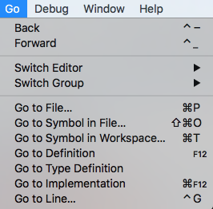

### Preserving view state for resource editors

We are now preserving the view state for resource editors when you switch between them. This comes in handy when debugging internal modules since we now preserve the scroll position and all other view data for internal module editors. However, we always clear the view state when a user closes the editor.

### High Contrast theme

We have improved the High Contrast theme to include more token colors and to use selection and Status Bar colors for clearer contrast.

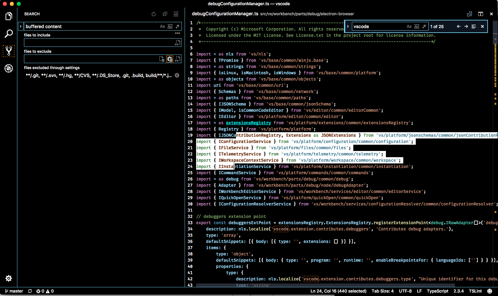

### New theming colors

We received a lot of feedback for our workbench theming support and are happy to see more and more themes adopting the workbench colors! During this milestone, we added almost 50 new colors as well as did some tweaks to existing colors. These colors can be set by themes or directly by the user with the `workbench.colorCustomizations` setting.

You can review the new colors in the updated [Theme Color Reference](https://code.visualstudio.com/docs/getstarted/theme-color-reference).

Below are the existing color behavior changes:

Key|Description
---|-------
`panel.border`|Now overwrites the value of `contrastBorder`, allowing a more specific color if `contrastBorder` is set.
`tab.border`|Now overwrites the value of `contrastBorder`, allowing a more specific color if `contrastBorder` is set.
`editorGroup.border`|Now overwrites the value of `contrastBorder`, allowing a more specific color if `contrastBorder` is set.
`list.*`|All list colors can now be set even in the presence of `contrastBorder` and `contrastActiveBorder`.

### Multi-root workspaces

During this milestone, we made some significant steps towards supporting multi-root (multiple project folder) workspaces in VS Code. In case you are wondering why it is taking us a little bit longer to tackle this feature request, please read [Daniel's excellent explanation](https://github.com/microsoft/vscode/issues/396#issuecomment-301842430).

We focused on UX and sketched up how we could provide this feature with our current architecture without introducing too many new concepts. After sharing the designs with the engineering team, we ran 2 user studies to validate our assumptions. We encourage you to watch the recordings of these studies if you are interested and provide feedback:

* group 1: [https://youtu.be/48Y6tB3DN1g](https://youtu.be/48Y6tB3DN1g)
* group 2: [https://youtu.be/kHL6Rt-dLm0](https://youtu.be/kHL6Rt-dLm0)

With the UX work behind us, we feel that we can finally start implementing this feature request. Thanks for your patience!

## Editor

### Merge conflict coloring and actions

Inline merge conflicts are now colored and come with actions to accept either or both of the changes. Previously available as the popular Better Merge extension, this functionality is now built-in. Thanks to [Phil Price (@pprice)](https://github.com/pprice), the author of Better Merge, for the PR.

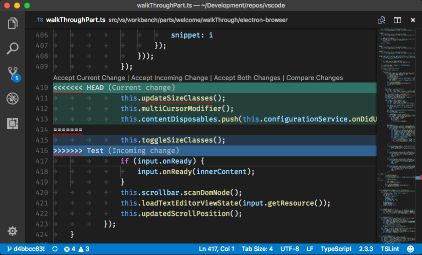

### Suggestion list and documentation side by side

When IntelliSense autocomplete/suggestions are triggered, press `kb(toggleSuggestionDetails)` to view the documentation for the suggestion item in focus as before. The documentation will now expand to the side instead of being overlaid on the suggest widget, enabling you to read the documentation and navigate the list at the same time.

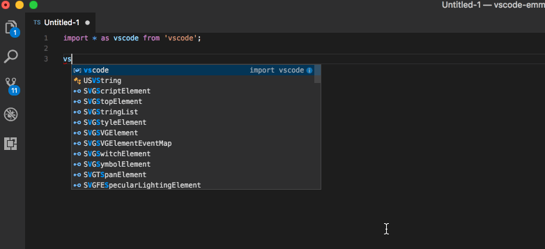

When the documentation fly-out is expanded, it will stay expanded (across VS Code windows, sessions and updates) every time autocomplete/suggestions is triggered, until you explicitly close it either using the close button or by pressing `kb(editor.action.triggerSuggest)` again.

For keyboard centric users who want to navigate up and down long documentation, press `kb(toggleSuggestionFocus)` to move the focus to the documentation fly-out such that it can now receive keyboard shortcuts for Page Up/Down actions.

For screen reader users, once the documentation fly-out is expanded, navigating the suggestion list will read out the label and documentation (if any) of the item in focus.

### Emmet abbreviation expansion in suggestion list

Until now, the default behavior for expanding an Emmet expansion has been to use the `kbstyle(Tab)` key. There were two issues with this design:

* Many unexpected Emmet expansions occurred when the user wanted to just add an indent.
* On the other hand, items from the suggestion list got inserted when the user was expecting the Emmet abbreviation to be expanded.

Both of these issues can be now solved by having the expanded Emmet abbreviations show up in the suggestion list and freeing up the `kbstyle(Tab)` key for what it was meant to do, indenting.

Set `emmet.useNewEmmet` to `true` to start using this new feature. This feature is best used with the suggestion documentation fly-out expanded where you can preview the expanded abbreviation as you type. Note that `kbstyle(Tab)` key will no longer expand the abbreviation by default.

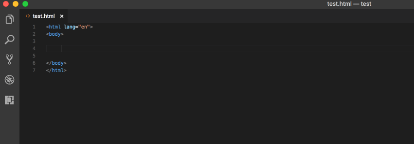

If you have `editor.quickSuggestions` turned off, you can use one of the methods below to get Emmet expansion:

* Manually trigger the suggestion by pressing `kb(editor.action.triggerSuggest)` and then choose the expansion from the suggestion list.
* Run the command **Emmet: Expand Abbreviation** explicity from the **Command Palette**.
* Bind your own keyboard [shortcut](https://code.visualstudio.com/docs/getstarted/keybindings) to **Emmet: Expand Abbreviation** (command id `editor.emmet.action.expandAbbreviation`).

You will see two kinds of suggestions in HTML-like files:

* The expansion for the abbreviation that has been typed (you can turn this off by setting `emmet.showExpandedAbbreviation` to `false`).
* All possible abbreviations whose prefix is the text that has been typed (you can turn this off by setting `emmet.showAbbreviationSuggestions` to `false`). For example, `a`, `a:link`, `a:mail`, `area` are suggested when you type `a`. This is helpful for discovering Emmet abbreviations.

In CSS/LESS/SCSS files, you will only see the single abbreviation you have typed.

To implement this feature, we replaced the single monolithic [Emmet library](https://github.com/emmetio/emmet) with smaller re-usable [Emmet modules](https://www.npmjs.com/%7Eemmetio). In doing so, most of the Emmet commands were re-implemented. If you see any changes in the behavior of any Emmet commands, please create an issue. We hope to complete this work in the next milestone, after which the setting `emmet.useNewEmmet` will be deprecated and the new model will be made default.

### Multi cursor snippets

You can now combine snippets and multiple cursors.

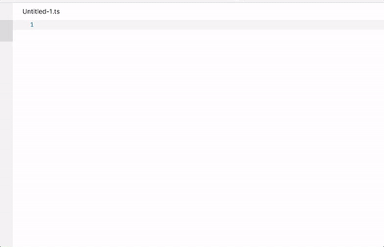

In addition, you also now nest snippets, meaning you can add a placeholder of a snippet within another snippet and their placeholders will be merged.

### Strict snippets

Snippets can have placeholders and variables. The snippet syntax is defined [here](https://code.visualstudio.com/docs/editor/userdefinedsnippets#_snippet-syntax) where `$1, $2...` are tabstops and `$varName1, $varName2...` are variables. Note that they can only differ by what follows the `$`-sign, numbers are tabstops and words refer to variables. Prior to this milestone, VS Code was using an internal syntax for snippets. Textmate-style snippets were rewritten to the internal syntax and there was an unfortunate bug that caused variables to be turned into tabstops. This is what we have done to ensure a smooth transition:

* When we encounter snippets that use variables we don't [know](https://code.visualstudio.com/docs/editor/userdefinedsnippets#_variables), we turn them into placeholders and warn the extension author (not the user).
* Also, we log a telemetry event so can make issues/PRs against extensions that are using this unfortunate construct.

In the future, you can expect us to continue to support these types of snippets for a little longer. Snippets fall into two categories; those that the user created and those that come from an extension. We will be strict on extension snippets while keeping support for user created snippets.

### Find widget

You can now resize the Find widget horizontally. You can review the full text easily if it's longer than the original width of the Find widget.

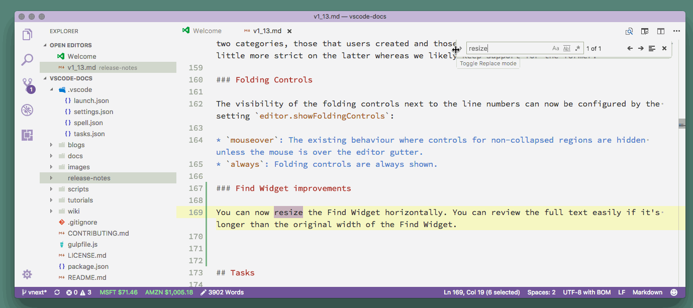

Also you can now scroll beyond the first line when the Find widget is visible and the Find widget won't cover the matched results. We'll automatically scroll the window a little bit to make sure the matched results are not covered by the Find widget when you are navigating between them.

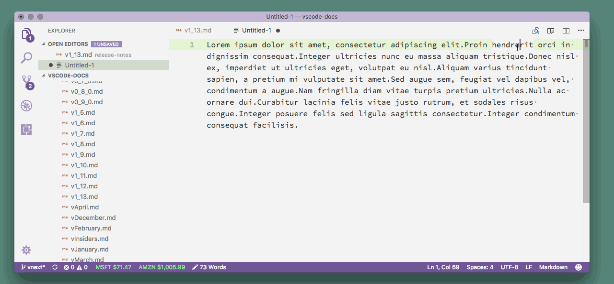

We introduced two settings to help you customize the Find widget behaviors:

* You can now set `editor.find.seedSearchStringFromSelection` to `false` if you don't want to seed the search string in Find widget from current editor selection.
* You can set `editor.find.autoFindInSelection` to `true` and then Find in Selection flag is turned on when multiple characters or lines of text are selected in the editor.

We also added a new command `toggleFindInSelection` (`kb(toggleFindInSelection)`) to toggle Find In Selection so you can keep your hands on the keyboard when switching all Find options.

### Folding controls

The visibility of the folding controls next to the line numbers can now be configured by the setting `editor.showFoldingControls`:

* `mouseover` - The existing behavior where controls for non-collapsed regions are hidden unless the mouse cursor is over the editor gutter.
* `always`- Folding controls are always shown.

### Letter spacing

Thanks to [@hoovercj](https://github.com/hoovercj) in [PR #22979](https://github.com/microsoft/vscode/pull/22979), there is a new editor setting, `editor.letterSpacing`, similar to the CSS letter-spacing property:

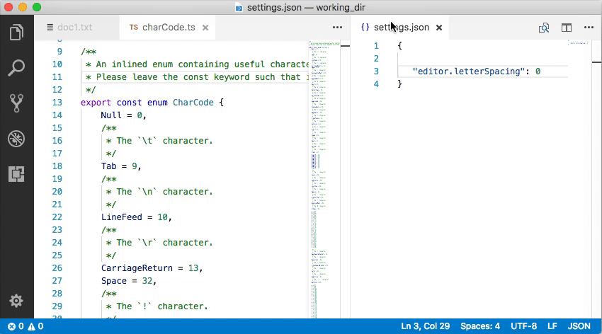

## Integrated Terminal

### Dragging files to the terminal to paste path

You can now drag files and folder from the File Explorer and files from your OS file manager to paste the path name into the terminal.

### Unicode character width improvements

Unicode characters in the Integrated Terminal are now sized explicitly which means that applications like [vtop](https://www.npmjs.com/package/vtop) which make extensive use of these characters should now render correctly.

Before:


After:

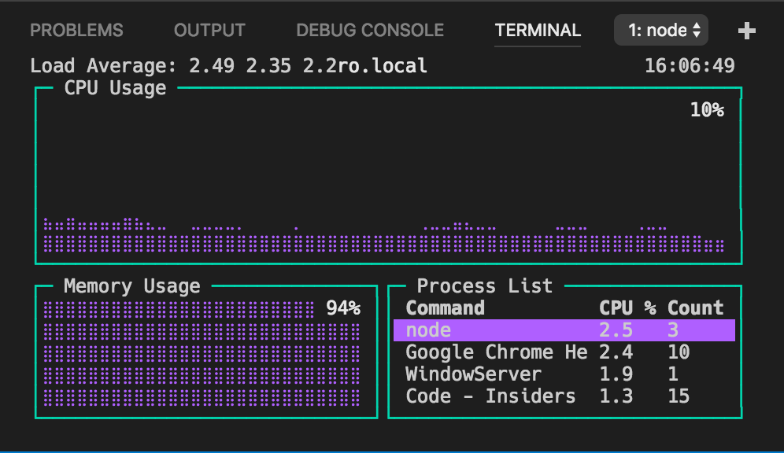

## Tasks

### Run tasks in the Integrated Terminal

You can now configure tasks so that they are executed inside the Integrated Terminal. By adding a `runner` property to the `tasks.json` file as shown below you enable the Integrated Terminal.

```ts
{
  "version": "0.1.0",
  "runner": "terminal",
  ...
}
```

If you want to switch back to the old runner, remove the property or set its value to `"process"`.

### Preview: Tasks version 2.0

You can opt into the new tasks version 2.0.0 but please note that this version is currently a preview and still under active development. We make it available in order to get early feedback.

To enable the tasks preview, set the `version` attribute to `"2.0.0"` :

```json
{
  "version": "2.0.0"
}
```

With version 2.0.0 enabled, the tasks from different task runners like Gulp or Grunt are automatically detected and you can run them with the `Run Task` command. Tasks are currently auto detected from the task runners Gulp, Grunt, Jake, and from the scripts section in `package.json` files. We will provide an API so that you can contribute task detection for other task runners. This API has been further polished during this iteration, but we left in the proposed state for this release (see [vscode.proposed.d.ts](https://github.com/microsoft/vscode/blob/main/src/vs/vscode.proposed.d.ts#L13)).

The task selection dialog now shows you both tasks that you have configured in the `tasks.json` file and tasks that where automatically detected. For example, in a workspace with a gulp file defining a `build` and a `watch` task and a `tasks.json` file that defines a `Deploy` task, the task selection dialog looks as follows:

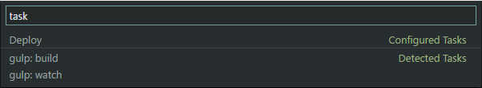

When the system detects a task (for example, a build task provided through a gulp file), it usually doesn't know which problem matchers to associate with the task. You can customize a detected task inside the `tasks.json` file. To do so, press the gear icon to the right of a detected task. This will insert a section into the `tasks.json` file where you can customize the detected task.

The video below illustrates how to customize the gulp `build` task by adding the TypeScript problem matcher (named `$tsc`) to it and by renaming it to `My Main Build`.

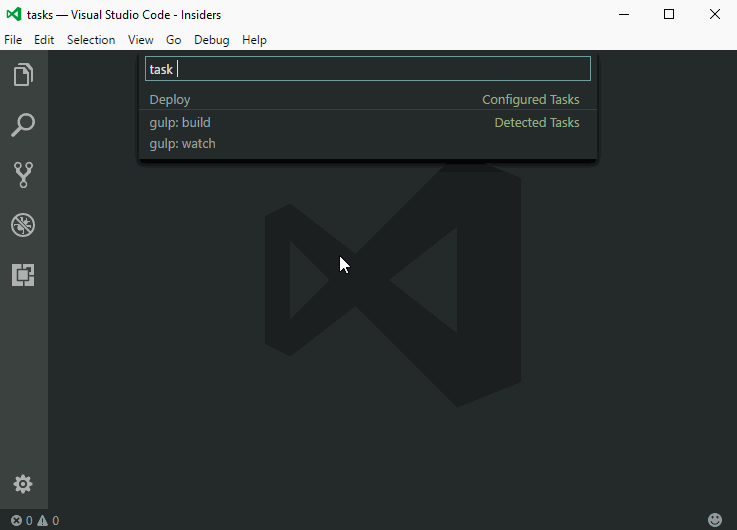

## Debugging

### Improved stepping performance

Per a [user recommendation](https://github.com/microsoft/vscode/issues/25605), we've improved stepping performance by fetching parts of the call stack and the corresponding variables lazily, only if the user has not already requested the next "step" operation. With this change, VS Code will always fetch the top frame of the stack in order to be able to show the correct source for the current location. The rest of the stack will be updated only if the user has not continued stepping for 0.4 seconds.

This improves stepping performance considerably as you can see in the following screen recordings of the (rather large) [Typescript compiler](https://github.com/microsoft/TypeScript).

Old behavior - Always fetch full call stack:

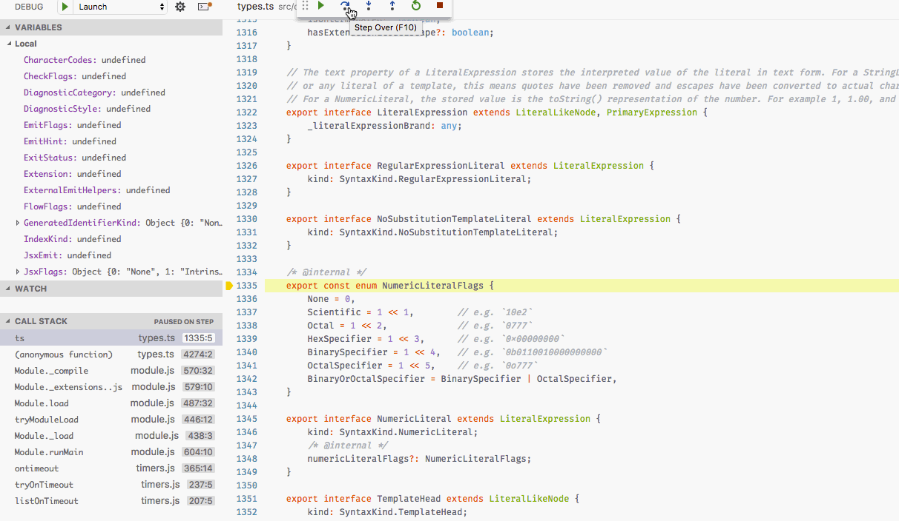

New behavior - Fetch rest of the call stack lazily:

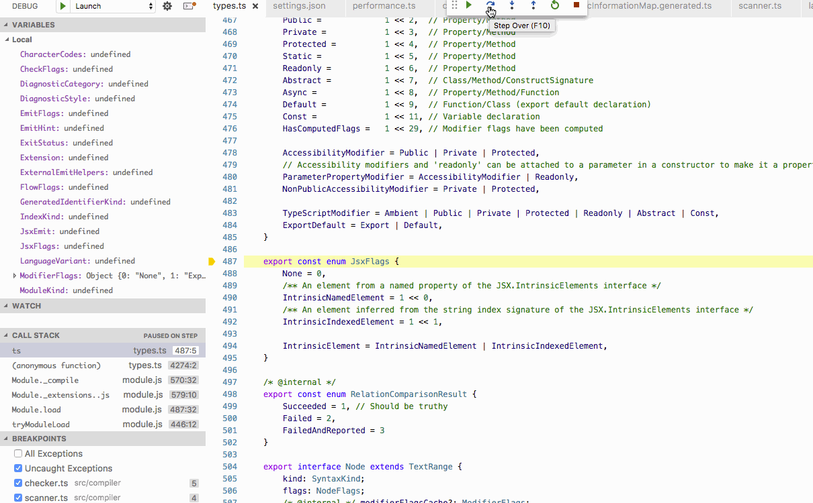

### File link detection in Exception Peek UI

When an exception occurs, developers commonly follow through the exception stack trace to understand what caused it. We added a mechanism to detect links in the stack trace returned by the debug adapter. This allows you to jump to your source code straight from the exception UI. Moreover, it also improved existing link detection in a Debug Console, fixing several the user reported issues.

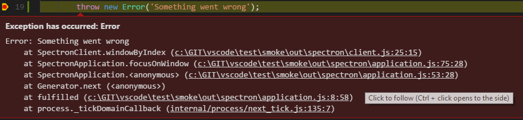

### Recipes for nonstandard debugging scenarios

Setting up Node.js debugging can be challenging for some non-standard or complex scenarios. With this release, we've started to collect recipes for these scenarios in a new [repository](https://github.com/microsoft/vscode-recipes).

For example, there is a recipe for [Debugging TypeScript in a Docker Container](https://github.com/microsoft/vscode-recipes/tree/fc84ccc87a2f6248f7bc1a367d56045b8b1ed738/Docker-TypeScript).

### Copy All action in Debug Console

It is now possible to copy all the content from the Debug Console using the **Copy All** context menu action. More details about what motivated this change can be found [here](https://github.com/microsoft/vscode/issues/2163).

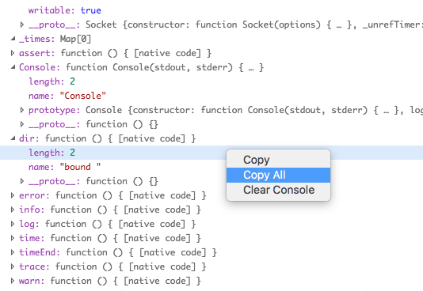

### New setting `debug.internalConsoleOptions`

It is now possible to control the behavior of the Debug Console using the setting `debug.internalConsoleOptions`. Previously this setting was only available in `launch.json`, however by [user request](https://github.com/microsoft/vscode/issues/18398), it is now possible to also specify this in user and workspace settings. The setting in `launch.json` takes precedence if both are provided.

## Node Debugging

### Local/remote path mapping now supported for "launch" configurations

To facilitate remote debugging, VS Code already supports mapping JavaScript paths between a local VS Code project and a (remote) location by means of the `localRoot` and `remoteRoot` attributes. Because remote debugging typically involves "attaching" to a remote target, the `localRoot` and `remoteRoot` attributes were only available for launch configurations of request type `"attach"`.

Recently we've opened up launch configurations of request type `"launch"` to launch arbitrary programs and scripts (and not just the local Node.js target to debug). With this, it becomes possible to launch a remote Node.js target (for example in a Docker container) and have the VS Code Node.js Debugger attach to it. This feature diminishes the difference between "launching" and "attaching" even further and it makes sense to support `localRoot` and `remoteRoot` attributes for launch configurations of request type `"launch"` as well (in addition to request type `"attach"`).

You can find an example for this in the [Debugging TypeScript in a Docker Container](https://github.com/microsoft/vscode-recipes/tree/fc84ccc87a2f6248f7bc1a367d56045b8b1ed738/Docker-TypeScript#further-simplifying-the-debugging-setup) recipe.

## Extensions

### Enable / Disable commands

There are two new commands in the **Extensions** view context menu to help quickly manage your extensions:

* Enable / Disable All Installed Extensions
* Enable / Disable Auto Updating Extensions

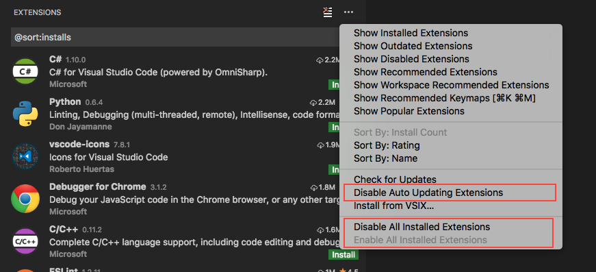

## Languages

### Syntax coloring for JSX/TSX components

In React JSX and TSX files, component classes are now colored differently than normal HTML elements:

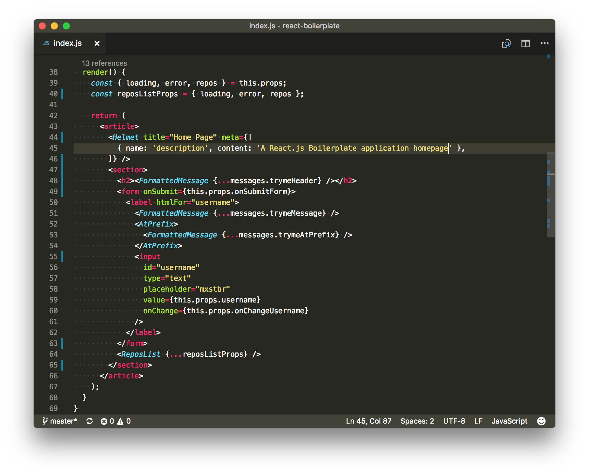

### Additional JSDoc tags in hover and suggestions

JSDoc tags such as `@deprecated` and `@private` are now displayed in hover and suggestions documentation.


### Open TS Server Log reveals log folder

The **TypeScript: Open TS Server Log** command now reveals the TypeScript log directory on your operating system instead of trying to open the log file in VS Code. This is useful for collecting the additional Type Declaration (typings) installer log files generated alongside the main `tsserver.log` file.

### Markdown preview preserves scroll position

The Markdown preview, along with other webview based views such as the release notes, will now preserve the scroll position when switching between editors. Previously, navigating away from the Markdown Preview and then returning to it caused the scroll position to be reset.

### Warnings for missing Markdown preview styles

We now display a warning message if any of the stylesheets from `markdown.styles` used in the preview cannot be found.

### Markdown symbol search includes heading levels

You can quickly jump to a heading in a Markdown file using **Go to Symbol in File...** (`kb(workbench.action.gotoSymbol)`). This list now includes the heading level of each symbol, which allows you to quickly filter results by heading level.

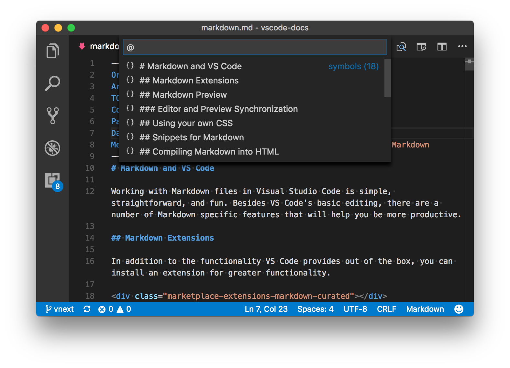

## Extension Authoring

### Custom views

There has been a popular request to customize VS Code to show custom data views, for example a `Node Dependencies` view. With this release, you can now write extensions to VS Code contributing such views. Currently custom views are shown only in Explorer. In future, we will support displaying them in other places too.

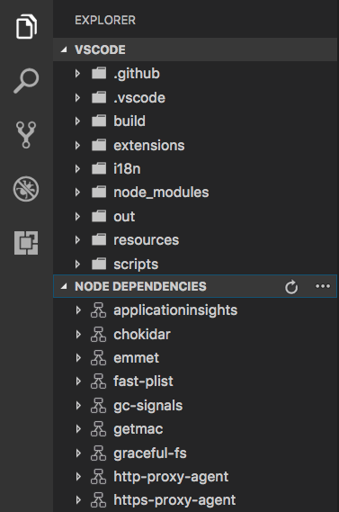

Contributing a view is as simple as follows:

* Contribute a view using the [views](https://code.visualstudio.com/docs/extensionAPI/extension-points#_contributesviews) extension point.
* Register a data provider for the view using the [TreeDataProvider](https://code.visualstudio.com/docs/extensionAPI/vscode-api#_TreeDataProvider) API.
* Contribute actions to the view using `view/title` and `view/item/context` locations in [menus](https://code.visualstudio.com/docs/extensionAPI/extension-points#_contributesmenus) extension point.

You can refer to examples in our [extension samples repository](https://github.com/microsoft/vscode-extension-samples/tree/main/tree-view-sample).

### Debugger extensions

**New enum value `subtle` for the `presentationHint` attribute of type `StackFrame`**

A debug adapter can flag a stack frame with the presentation hint `subtle` in order to receive an alternative "subtle" rendering.

**Extended type for `TerminatedEvent.body.restart` attribute**

The type of the `TerminatedEvent.body.restart` attribute has been extended from `boolean` to `any`. This makes it possible to loop arbitrary data from one debug session to the next (restarted) debug session.

**`evaluateName` attribute mandatory for `Add to Watch` and `Copy Value` actions**

VS Code previously tried to implement the **Add to Watch** and **Copy Value** actions by using the data from the **VARIABLES** view and a JavaScript-biased heuristic for building expressions that can be used with the evaluate request.

Since this approach does not work for all languages, we've introduced the `evaluateName` attribute for variables some time ago. It is now mandatory for debug adapters to support the `evaluateName` attribute if they want that **Add to Watch** and **Copy Value** actions work properly.

### Glob patterns for `workspaceContains` activation event

Thanks to [@eamodio](https://github.com/eamodio), with [PR #24570](https://github.com/microsoft/vscode/pull/24570), it is now possible to activate an extension when a folder is opened that contains at least one file that matches a glob pattern.

For example, an extension with the `package.json`:

```json
{
  ...
  "activationEvents": [
    "workspaceContains:**/.editorconfig"
  ]
}
```

will be activated when a folder is opened and any of its sub-folders contains a file named `.editorconfig`.

### Defining a language's word pattern in the language configuration file

Thanks to [@hoovercj](https://github.com/hoovercj), with [PR #22478](https://github.com/microsoft/vscode/pull/22478), it is possible to specify a language's word pattern using `wordPattern` in the language configuration file. This used to be possible before only by invoking `vscode.languages.setLanguageConfiguration(...)`.

### Better control decorations in the editor

Thanks to [@CoenraadS](https://github.com/CoenraadS), with [PR #25776](https://github.com/microsoft/vscode/pull/25776), it is now possible to configure the behavior of decorations when typing/editing at their edges. This can be configured with the `DecorationRenderOptions.rangeBehaviour` field.

### Reference theme colors from extensions

You can now use theme colors in decorators and for the Status Bar foreground. Using theme colors instead of actual color values is the preferred way as it lets themes and users customize the colors.

```typescript
  var decorationType = vscode.window.createTextEditorDecorationType({
      before: {
          contentText: "\u26A0",
          color: new vscode.ThemeColor('editorWarning.foreground')
      }
  });
```

You will find the list of theme colors [here](https://code.visualstudio.com/docs/getstarted/theme-color-reference).

## Accessibility

### Better NVDA support

Sometimes, when using arrow keys, some lines or characters would be repeated by NVDA (see [Issue #26730](https://github.com/microsoft/vscode/issues/26730)). Thanks to [James Teh](https://github.com/jcsteh), one of the co-founders of [NV Access](https://www.nvaccess.org/), we now understand the root cause (a timeout of 30ms, which we sometimes miss). James has a [PR on NVDA](https://github.com/nvaccess/nvda/pull/7201) where he is changing the default timeout to 100ms and making it configurable. Until a new NVDA version is shipped, thanks to [Derek Riemer](https://github.com/derekriemer), there is an [NVDA plugin](https://files.derekriemer.com/globalEditorTimer-1.0.nvda-addon) that increases the timeout from 30ms to 200ms. We have also done some changes on our side to reduce the likelihood that we miss the 30ms timeout.

### "Screen Reader Detected"

We are now leveraging [Electron APIs](https://github.com/electron/electron/blob/master/docs/api/app.md#event-accessibility-support-changed-macos-windows) to react and optimize VS Code when working with a screen reader. Whenever Electron identifies that a screen reader is attached, we will display a message in the Status Bar and:

* Remove the Line Number and Column indicator from the Status Bar, as we have found updating these indicators causes a myriad of accessibility events that end up confusing screen readers.
* Disable word wrapping, as when pressing arrow down for example, screen readers expect the cursor to move to the next line and not to a column to the right on the same line.
* Mirror the current page of text in the editor synchronously to the `textarea` element we use for input events.
* Disable certain stylistic features to increase the likelihood that we make it within the 30ms accessibility event timeout. We typically do not spend more than ~4-5ms processing the arrow keys, but with these features disabled, the time spent is reduced to ~1-2ms. The rest of the time is spent by our platform in *figuring out* what happened and emitting the correct accessibility events.

> Detecting screen readers is non-trivial, so, if you notice the "Screen Reader Detected" Status Bar message and do not have a screen reader attached, you can change the setting `editor.accessibilitySupport` from `"auto"` to `"off"`.

## Engineering

### New crash report handling

We have improved the VS Code crash reporting. VS Code uses Electron's built-in crash reporter to capture and analyze crash data to make VS Code and Electron itself better. If VS Code crashes, a dump is collected and sent to us, though [you can always turn this off](https://code.visualstudio.com/docs/supporting/faq#_how-to-disable-crash-reporting).

This worked well, but it was a time consuming task for us to analyze and understand a crash. Microsoft has a good crash reporting service called [HockeyApp](https://hockeyapp.net/) and we now have enabled HockeyApp for crash reporting. To enable it, we had to produce our own build of Electron because the built-in crash reporter sends data in a format HockeyApp does not understand. The changes are on top of Electron 1.6.6 where the crash reporter talks to the HockeyApp service.

If you build VS Code from source, you will continue to pull in the GitHub version of Electron. We will continue collaborating with the other Electron contributors to make the crash reporting service pluggable, so that anyone can easily use HockeyApp (or any other service).

### Issue management automation

We have deployed a [Probot](https://github.com/probot/probot) instance to automate some of our issue management. You will see `VSCodeBot` add labels to issues on GitHub and sometimes close issues when they have gone stale. We are looking for feedback from the community and will add more automation as we go.

Adding an `insiders` label to an issue reported against an [Insiders](https://code.visualstudio.com/insiders) build:

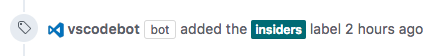

Closing a stale `needs more info` issue after we haven't heard back for more than week:


## New Commands

Key|Command|Command id
---|-------|----------
`kb(list.focusFirstChild)`|Select first child of currently selected item's parent in tree/lists|`list.focusFirstChild`
`kb(list.focusLastChild)`|Select last child of currently selected item's parent in tree/lists|`list.focusLastChild`
`kb(merge-conflict.next)`|Next Merge Conflict|`merge-conflict.next`
`kb(merge-conflict.previous)`|Previous Merge Conflict|`merge-conflict.previous`
`kb(merge-conflict.accept.selection)`|Accept Selection|`merge-conflict.accept.selection`
`kb(merge-conflict.accept.current)`|Accept Current|`merge-conflict.accept.current`
`kb(merge-conflict.accept.incoming)`|Accept Incoming|`merge-conflict.accept.incoming`
`kb(merge-conflict.accept.both)`|Accept Both|`merge-conflict.accept.both`
`kb(merge-conflict.accept.all-both)`|Accept All Both|`merge-conflict.accept.all-both`
`kb(merge-conflict.accept.all-current)`|Accept All Current|`merge-conflict.accept.all-current`
`kb(merge-conflict.accept.all-incoming)`|Accept All Incoming|`merge-conflict.accept.all-incoming`
`kb(merge-conflict.compare)`|Compare|`merge-conflict.compare`

## Contributions to Extensions

Our team maintains or contributes to a number of VS Code extensions. Most notably this month:

* [ESLint](https://marketplace.visualstudio.com/items?itemName=dbaeumer.vscode-eslint): Performance improvements to lower CPU load when linting large JavaScript files with lots of code actions.
* [VSCodeVim](https://marketplace.visualstudio.com/items?itemName=vscodevim.vim): We [refactored](https://github.com/VSCodeVim/Vim/pull/1642) the source code to make it easier to contribute to the project.
* [PHP language server](https://github.com/felixfbecker/php-language-server): We are getting close to merging the [pull request](https://github.com/felixfbecker/php-language-server/pull/357) to adopt the [tolerant PHP parser](https://github.com/microsoft/tolerant-php-parser).

## Notable Changes

* [25789](https://github.com/microsoft/vscode/issues/25789): Can't split file when dragging from Explorer
* [19644](https://github.com/microsoft/vscode/issues/19644): Cursor does not go to the maximum line column when pressing "End" twice with word wrap enabled
* [6661](https://github.com/microsoft/vscode/issues/6661): Ctrl+D/Cmd+D merges adjacent selections.
* [4271](https://github.com/microsoft/vscode/issues/4271): Mac Insert Emoji Duplicates Text
* [3623](https://github.com/microsoft/vscode/issues/3623): Match whole word does not work for not latin characters (at least for cyrillic)
* [17534](https://github.com/microsoft/vscode/issues/17534): Search: not possible to remove individual search results in a file
* [16580](https://github.com/microsoft/vscode/issues/16580): Unable to write to settings should offer an action to open settings
* [17609](https://github.com/microsoft/vscode/issues/17609): Line wrapping problem in bash on ubuntu on windows
* [23484](https://github.com/microsoft/vscode/issues/23484): "Ctrl +click to follow link" hover appears only on the last link in the terminal
* [25664](https://github.com/microsoft/vscode/issues/25664): Terminal panel is not properly restored after restarting

## Thank You

Last but certainly not least, a big *__Thank You!__* to the following folks that helped to make VS Code even better:

Contributions to `vscode`:

* [actboy168 (@actboy168)](https://github.com/actboy168): Fix lua function colorizing error [PR #26880](https://github.com/microsoft/vscode/pull/26880)
* [Andy (@andy-ms)](https://github.com/andy-ms):  Remove unnecessary parentheses [PR #25573](https://github.com/microsoft/vscode/pull/25573)
* [@ashirley](https://github.com/ashirley): Add git.commitType configuration [PR #25855](https://github.com/microsoft/vscode/pull/25855)
* [Bradley Meck (@bmeck)](https://github.com/bmeck):  Add .mjs to known JavaScript file extensions [PR #25747](https://github.com/microsoft/vscode/pull/25747)
* [Bugra Cuhadaroglu (@BugraC)](https://github.com/BugraC):  Fix - #24242 #24550 [PR #25756](https://github.com/microsoft/vscode/pull/25756)
* [@CoenraadS](https://github.com/CoenraadS):  Expose Stickiness API #15758 [PR #25776](https://github.com/microsoft/vscode/pull/25776)
* [David Lechner (@dlech)](https://github.com/dlech):  Add .git/subtree-cache/ to files.watcherExclude [PR #26665](https://github.com/microsoft/vscode/pull/26665)
* [Eric Amodio (@eamodio)](https://github.com/eamodio):  Fixes #944 - Support wildcards on activationEvents.workspaceContains [PR #24570](https://github.com/microsoft/vscode/pull/24570)
* [Cody Hoover (@hoovercj)](https://github.com/hoovercj)
  *  Add letterSpacing to config to address #18715 [PR #22979](https://github.com/microsoft/vscode/pull/22979)
  *  Addresses #14221 by reading wordPattern from language-configuration.json [PR #22478](https://github.com/microsoft/vscode/pull/22478)
* [Yu-Hsin Hung (@hungys)](https://github.com/hungys):  Fix for terminal.foreground not working [PR #26788](https://github.com/microsoft/vscode/pull/26788)
* [Ilie Halip (@ihalip)](https://github.com/ihalip)
  *  added config option git.cloneDirectory, defaulting to os.homedir() [PR #24950](https://github.com/microsoft/vscode/pull/24950)
  *  Allow changing a SourceControlResourceGroup's label [PR #25983](https://github.com/microsoft/vscode/pull/25983)
* [Yuki Ueda (@Ikuyadeu)](https://github.com/Ikuyadeu):  [bat] support %%(fix #26825) [PR #27325](https://github.com/microsoft/vscode/pull/27325)
* [Jeremy Loy (@JeremyLoy)](https://github.com/JeremyLoy):  Added Services Submenu for MacOS [PR #26248](https://github.com/microsoft/vscode/pull/26248)
* [Jan Niklas Hasse (@jhasse)](https://github.com/jhasse)
  *  Use Chromium's new system-ui font alias [PR #25570](https://github.com/microsoft/vscode/pull/25570)
  *  Use Tahoma font as a fallback for system-ui [PR #26912](https://github.com/microsoft/vscode/pull/26912)
* [João Portela (@jportela)](https://github.com/jportela)
  *  Preventing duplicate tab close when doing a middle click [PR #25697](https://github.com/microsoft/vscode/pull/25697)
  *  Inserting file path on the terminal, when dragging a file to it [PR #24951](https://github.com/microsoft/vscode/pull/24951)
* [Kaide Mu (@kdmu)](https://github.com/kdmu):  Markdown: Capture right parenthesis as part of url [PR #26449](https://github.com/microsoft/vscode/pull/26449)
* [Maik Riechert (@letmaik)](https://github.com/letmaik)
  *  Show ahead/behind indicator while git syncing [PR #26008](https://github.com/microsoft/vscode/pull/26008)
  *  Add git delete branch command [PR #25862](https://github.com/microsoft/vscode/pull/25862)
* [Florent Viel (@luxifer)](https://github.com/luxifer)
  *  Fix php function highlight [PR #26543](https://github.com/microsoft/vscode/pull/26543)
  *  Add more tests to PHP grammar [PR #26992](https://github.com/microsoft/vscode/pull/26992)
* [@mappu](https://github.com/mappu):  extension/php: detect language via shebang [PR #26581](https://github.com/microsoft/vscode/pull/26581)
* [Soo Jae Hwang (@misoguy)](https://github.com/misoguy):  Change behavior of home/end button [PR #21338](https://github.com/microsoft/vscode/pull/21338)
* [Nick Snyder (@nicksnyder)](https://github.com/nicksnyder)
  *  Do not unregister themingParticipantChangeListener. [PR #27098](https://github.com/microsoft/vscode/pull/27098)
  *  Fix typo [PR #25584](https://github.com/microsoft/vscode/pull/25584)
  *  Make SearchWidget dependencies injectable [PR #26969](https://github.com/microsoft/vscode/pull/26969)
* [Phil Price (@pprice)](https://github.com/pprice):  Add better merge extension [PR #27150](https://github.com/microsoft/vscode/pull/27150)
* [Rishii7 (@rishii7)](https://github.com/rishii7):  Add a new user configuration `extensions.ignoreRecommendations` [PR #25038](https://github.com/microsoft/vscode/pull/25038)
* [Youngrok Kim (@rokoroku)](https://github.com/rokoroku):  Add feature to close TMScope inspector [PR #26980](https://github.com/microsoft/vscode/pull/26980)
* [Mike Seese (@seesemichaelj)](https://github.com/seesemichaelj):  Issue 15613 all files committed [PR #25364](https://github.com/microsoft/vscode/pull/25364)
* [Dan Balasescu (@smoogipooo)](https://github.com/smoogipooo): Expose status bar debugging and no-folder foreground colors. [PR #27052](https://github.com/microsoft/vscode/pull/27052)
* [Tereza Tomcova (@the-ress)](https://github.com/the-ress):  Fixes #4370: Set default icon for file associations [PR #25497](https://github.com/microsoft/vscode/pull/25497)
* [Fernando Tolentino (@thr0w)](https://github.com/thr0w):  IntelliSense in extensions file [PR #26564](https://github.com/microsoft/vscode/pull/26564)
* [MaruyamaTomoki (@tomoki1207)](https://github.com/tomoki1207):  Markdown preview support the UNC path files. [PR #26710](https://github.com/microsoft/vscode/pull/26710)
* [Nikita Prokopov (@tonsky)](https://github.com/tonsky)
  * Detect more def* forms in Clojure syntax [PR #25546](https://github.com/microsoft/vscode/pull/25546)
  * Capture regexp begin/end as punctuation in Clojure syntax [PR #25550](https://github.com/microsoft/vscode/pull/25550)
* [Wagner Riffel (@wgrriffel)](https://github.com/wgrriffel):  Lua syntax extension is missing 'goto' keyword [PR #26350](https://github.com/microsoft/vscode/pull/26350)

Contributions to `language-server-protocol`:

* [Keith (@ktec)](https://github.com/ktec): Update protocol-1-x.md [PR #244](https://github.com/microsoft/language-server-protocol/pull/244)
* [Rainer Klute (@RainerKlute)](https://github.com/RainerKlute)
  * Various minor editorial changes [PR #242](https://github.com/microsoft/language-server-protocol/pull/242)
  * Typo fixed [PR #239](https://github.com/microsoft/language-server-protocol/pull/239)
* [Chen (@CXuesong)](https://github.com/CXuesong): Fix typo in summary of `interface Registration`. [PR #231](https://github.com/microsoft/language-server-protocol/pull/231)
* [Miro Spönemann (@spoenemann)](https://github.com/spoenemann): Fixed typo in WorkspaceClientCapabilities [PR #225](https://github.com/microsoft/language-server-protocol/pull/225)

Contributions to `vscode-languageserver-node`:

* [Vincenzo Chianese (@XVincentX)](https://github.com/XVincentX): Detect and copy npm-shirkwrap file if present [PR #193](https://github.com/microsoft/vscode-languageserver-node/pull/193)

Contributions to `vscode-tslint`:

* [Prashant Tiwari (@prashaantt)](https://github.com/prashaantt): Fix error message [PR #207](https://github.com/microsoft/vscode-tslint/pull/207)
* [Stewart Rand (@stewx)](https://github.com/stewx):  Typo fixes and grammar improvements in readme [PR #203](https://github.com/microsoft/vscode-tslint/pull/203)

Contributions to `vscode-css-languageservice`:

* [Aleksandr Andrienko (@AndrienkoAleksandr)](https://github.com/AndrienkoAleksandr):  Clean up duplicate word. [PR #27](https://github.com/microsoft/vscode-css-languageservice/pull/27)
* [Benjamin Lannon (@lannonbr)](https://github.com/lannonbr):  Update css-schema.xml to support CSS Grid [PR #28](https://github.com/microsoft/vscode-css-languageservice/pull/28)

Contributions to `vscode-chrome-debug-core`:

* [@llgcode](https://github.com/llgcode): Enhance path matching. [PR #202](https://github.com/microsoft/vscode-chrome-debug-core/pull/202)

Contributions to `localization`:

This is second month since we opened community localization in Transifex. We now have more 200 members in the Transifex [VS Code project](https://aka.ms/vscodeloc) team. We appreciate your contributions, either by providing new translations, voting on translations, or suggesting process improvements.

Here is a snapshot of top contributors for this release. For details about the project including the contributor name list, visit the project site at [https://aka.ms/vscodeloc.](https://aka.ms/vscodeloc)

* **French:** Vincent Biret, JP Gouigoux, Julien Brochet.
* **Italian:** Aldo Donetti, Piero Azi, Luca Nardi, Giuseppe Pignataro.
* **German:** Levin Rickert, Ingo Bleile, Carsten Kneip, Christian Gräfe, Markus Weber.
* **Spanish:** Andy Gonzalez, Alberto Poblacion, José M. Aguilar, Juan Carlos Gonzalez Martin.
* **Russian:** Al Fes, Aleksey Nemiro, Orrchy, Serge Rodionov.
* **Japanese:** EbXpJ6bp, Yuichi Nukiyama, Yosuke Sano, Yuki Ueda, Takayoshi Tanaka, Tetsuya Fukuda, Takashi Kawasaki.
* **Korean:** Ian Y. Choi.
* **Chinese (Simplified):** Joel Yang, YF, Alan Tsai, 王韦煊, Jianfeng Fang, kui li.
* **Chinese (Traditional):** Alan Liu, Alan Tsai, Duran Hsieh, Wei-Ting(DM), JJJ.

We would also like to congratulate and thank the Brazilian Portuguese community localization team! Due to their efforts, localization is now completed in Transifex and the translations have been integrated into the [Insiders](https://code.visualstudio.com/insiders) build for testing. Depending on validation progress, we hope to soon integrate the translations into the stable builds for Brazilian customers.

* **Portuguese (Brazil):** Roberto Fonseca, Bruno Sonnino, Alessandro Fragnani, Douglas Eccker, Bruno Ochotorena, Rodrigo Crespi, Anderson Santos, Felipe Caputo, Marcelo Fernandes, Roberto Nunes, Rodrigo Romano, Luan Moreno Medeiros Maciel, Ilton Sequeira.

<!-- In-product release notes styles.  Do not modify without also modifying regex in gulpfile.common.js -->
<a id="scroll-to-top" role="button" aria-label="scroll to top" href="#"><span class="icon"></span></a>
<link rel="stylesheet" type="text/css" href="css/inproduct_releasenotes.css"/>
