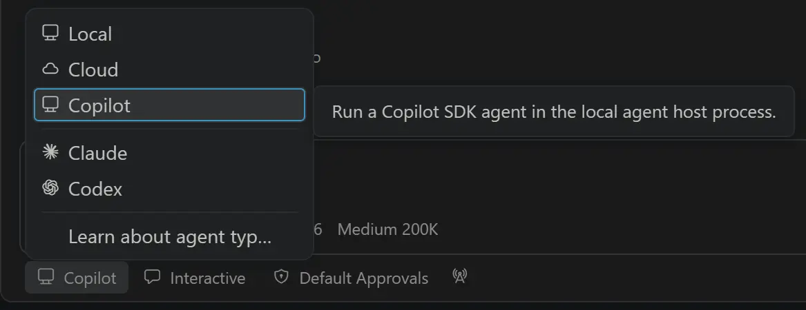

# Visual Studio Code 1.130

Follow us on [LinkedIn](https://www.linkedin.com/showcase/vs-code), [X](https://go.microsoft.com/fwlink/?LinkID=533687), [Bluesky](https://bsky.app/profile/vscode.dev) <!-- %IF INSIDERS % | Follow Insiders Changelog on [X](https://x.com/VSCodeChangelog) or [Bluesky](https://bsky.app/profile/vscodechangelog.bsky.social) %ENDIF % --> <!-- %IF IN_PRODUCT % | [View online](https://code.visualstudio.com/updates)%ENDIF % -->

---

_Release date: July 22, 2026_

<!-- DOWNLOAD_LINKS_PLACEHOLDER -->

---

Welcome to the 1.130 release of Visual Studio Code. This release ... <TODO @ntrogh>

* [highlight](#bookmark): <highlight description>

Happy Coding!

---

<!-- %IF STABLE %
VS Code is rolling out gradually to all users. Use **Check for Updates** in VS Code to get the latest version immediately.

To try new features as soon as possible, [**download the nightly Insiders build**](https://code.visualstudio.com/insiders), which includes the latest updates as soon as they are available.

---
%ENDIF % -->

<!-- TOC

  <nav id="toc-nav">
    
In this update

    <ul>
      <li><a href="#agents">Agents</a></li>
      <li><a href="#chat">Chat</a></li>
      <li><a href="#mcp">MCP</a></li>
      <li><a href="#accessibility">Accessibility</a></li>
      <li><a href="#editor-experience">Editor Experience</a></li>
      <li><a href="#code-editing">Code Editing</a></li>
      <li><a href="#notebooks">Notebooks</a></li>
      <li><a href="#source-control">Source Control</a></li>
      <li><a href="#debugging">Debugging</a></li>
      <li><a href="#tasks">Tasks</a></li>
      <li><a href="#terminal">Terminal</a></li>
      <li><a href="#authentication">Authentication</a></li>
      <li><a href="#languages">Languages</a></li>
      <li><a href="#remote-development">Remote Development</a></li>
      <li><a href="#contributions-to-extensions">Contributions to extensions</a></li>
      <li><a href="#extension-authoring">Extension Authoring</a></li>
      <li><a href="#proposed-apis">Proposed APIs</a></li>
      <li><a href="#engineering">Engineering</a></li>
      <li><a href="#deprecated-features-and-settings">Deprecated features and settings</a></li>
      <li><a href="#notable-fixes">Notable fixes</a></li>
      <li><a href="#thank-you">Thank you</a></li>
    </ul>
  </nav>
  

Navigation End -->

## Agents

### The agent host

As mentioned in our last release, we're rearchitecting how agent sessions work in VS Code around the agent host - a dedicated process that runs agent harnesses such as Copilot, Claude, and Codex, based on the [Agent Host Protocol](https://microsoft.github.io/agent-host-protocol/) (AHP). Because a session lives in its own process, the same session can be connected to and rendered from multiple VS Code windows at once. The agent host's Copilot agent is powered by the [Copilot SDK](https://www.npmjs.com/package/@github/copilot-sdk), which means that its behavior and functionality is aligned with the Copilot CLI, the standalone GitHub Copilot app, and other Copilot products.

Learn more about the [VS Code Agent Host architecture](https://code.visualstudio.com/docs/agents/concepts/agent-host).

We're actively developing the agent host and rolling it out to users in both the editor window and the [Agents window](https://code.visualstudio.com/docs/agents/agents-window). To opt in, enable `setting(chat.agentHost.enabled)` and then pick an agent host harness from the harness dropdown. The screenshot below shows how to select the `Copilot` harness on the agent host in the editor window:

As we continue to invest in the agent host, some features may only be available when an agent runs on it. Those features link back to this section and, where relevant, note any additional settings that enable them (for example, `setting(chat.agents.claude.preferAgentHost)` to enable the Claude agent on the agent host).

## Chat

### Aggregate AI credit usage for Copilot Business and Enterprise

Copilot Business and Copilot Enterprise users can now see their aggregate AI credit usage for the current billing cycle directly in the Copilot status menu. Previously, credit usage was only surfaced when a user-level budget was configured, leaving many organization-managed users without visibility into how many credits they had consumed.

Now, when no user-level budget is set, the status menu displays the total number of credits used so far in the billing cycle. This gives you an at-a-glance view of your consumption, so you can better understand your usage patterns without leaving the editor.

## MCP

## Accessibility

## Editor Experience

## Code Editing

## Notebooks

## Source Control

## Debugging

## Tasks

## Terminal

## Authentication

## Languages

## Remote Development

The [Remote Development extensions](https://marketplace.visualstudio.com/items?itemName=ms-vscode-remote.vscode-remote-extensionpack), allow you to use a [Dev Container](https://code.visualstudio.com/docs/devcontainers/containers), remote machine via SSH or [Remote Tunnels](https://code.visualstudio.com/docs/remote/tunnels), or the [Windows Subsystem for Linux](https://learn.microsoft.com/windows/wsl) (WSL) as a full-featured development environment.

Highlights include:

* TODO: @ntrogh

You can learn more about these features in the [Remote Development release notes](https://github.com/microsoft/vscode-docs/blob/main/remote-release-notes/v1_130.md).

## Contributions to extensions

## Extension Authoring

## Proposed APIs

## Engineering

The VS Code repository is now compiled using the release version of TypeScript 7. We also switched to the release version of the TypeScript 7 extension. The official release announcement from the TypeScript team can be found [here](https://devblogs.microsoft.com/typescript/announcing-typescript-7-0/).

## Deprecated features and settings

### New deprecations in this release

### Upcoming deprecations

## Notable fixes

## Thank you

---

We really appreciate people trying our new features as soon as they are ready, so check back here often and learn what's new.

>If you'd like to read release notes for previous VS Code versions, go to [Updates](https://code.visualstudio.com/updates) on [code.visualstudio.com](https://code.visualstudio.com).

<a id="scroll-to-top" role="button" title="Scroll to top" aria-label="scroll to top" href="#"></a>
<link rel="stylesheet" type="text/css" href="css/inproduct_releasenotes.css"/>
