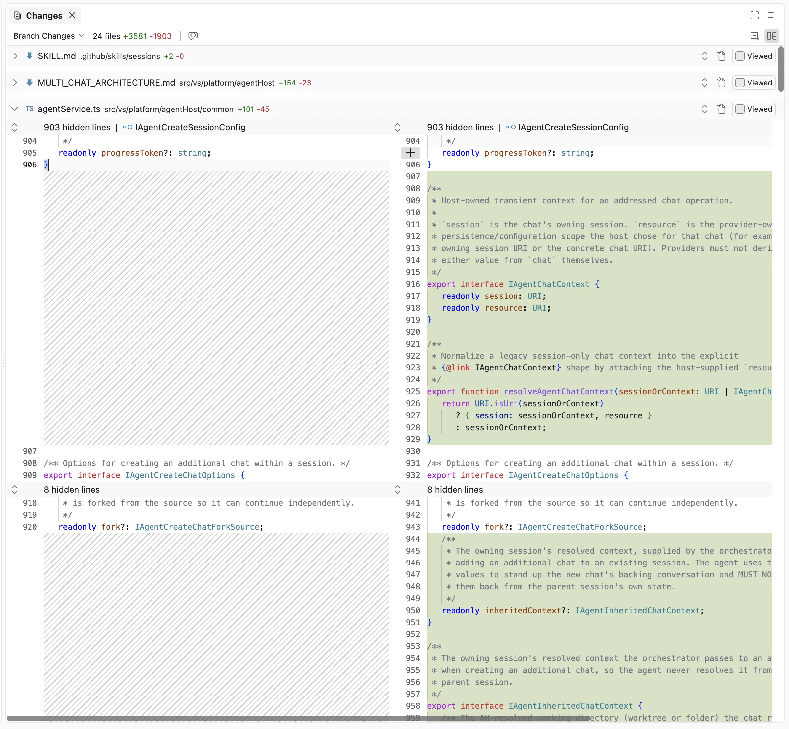
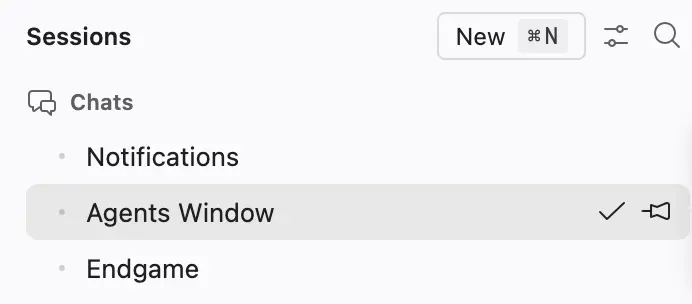
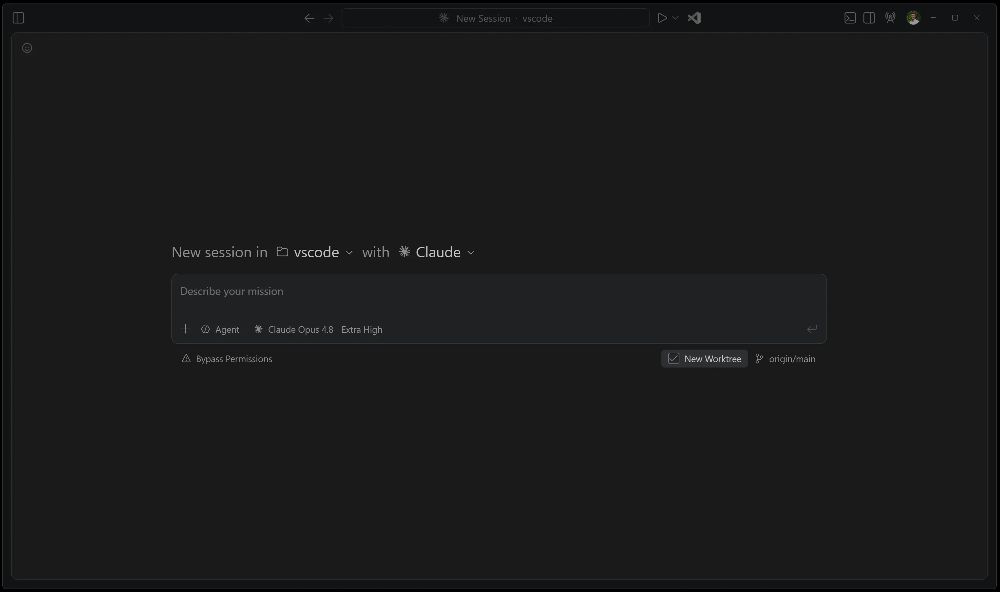
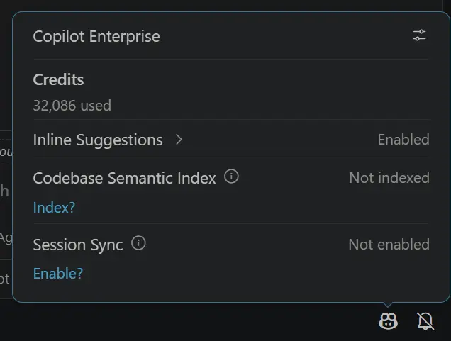

# Visual Studio Code 1.130

Follow us on [LinkedIn](https://www.linkedin.com/showcase/vs-code), [X](https://go.microsoft.com/fwlink/?LinkID=533687), [Bluesky](https://bsky.app/profile/vscode.dev) <!-- %IF INSIDERS % | Follow Insiders Changelog on [X](https://x.com/VSCodeChangelog) or [Bluesky](https://bsky.app/profile/vscodechangelog.bsky.social) %ENDIF % --> <!-- %IF IN_PRODUCT % | [View online](https://code.visualstudio.com/updates)%ENDIF % -->

---

_Release date: July 22, 2026_

<!-- DOWNLOAD_LINKS_PLACEHOLDER -->

---

Welcome to the 1.130 release of Visual Studio Code. This release brings agent host improvements, faster review workflows in the Agents window, better chat visibility, and smarter terminal link handling.

* [The agent host](#the-agent-host): Run sessions in a dedicated process that you can connect to from multiple VS Code windows.

* [Agents window improvements (Preview)](#agents-window-improvements-preview): Review multi-file changes faster with compact diffs, file-level stats, and worktree support across harnesses.

* [Assisted tool approvals](#assisted-tool-approvals): Reduce approval interruptions by letting the model evaluate tool-call risk during agent tasks.

* [Clickable file links in Git diffs with mnemonic prefixes](#clickable-file-links-in-git-diffs-with-mnemonic-prefixes): Open files directly from diff output when mnemonic prefixes are enabled.

Happy Coding!

---

<!-- %IF STABLE %
VS Code is rolling out gradually to all users. Use **Check for Updates** in VS Code to get the latest version immediately.

To try new features as soon as possible, [**download the nightly Insiders build**](https://code.visualstudio.com/insiders), which includes the latest updates as soon as they are available.

---
%ENDIF % -->

<!-- TOC

  <nav id="toc-nav">
    
In this update

    <ul>
      <li><a href="#agents">Agents</a></li>
      <li><a href="#chat">Chat</a></li>
      <li><a href="#terminal">Terminal</a></li>
      <li><a href="#engineering">Engineering</a></li>
      <li><a href="#thank-you">Thank you</a></li>
    </ul>
  </nav>
  

Navigation End -->

## Agents

### The agent host

As mentioned in our last release, we're rearchitecting how agent sessions work in VS Code around the agent host - a dedicated process that runs agent harnesses such as Copilot, Claude, and Codex, based on the [Agent Host Protocol](https://microsoft.github.io/agent-host-protocol/) (AHP). Because a session lives in its own process, the same session can be connected to and rendered from multiple VS Code windows at once. The agent host's Copilot agent is powered by the [Copilot SDK](https://www.npmjs.com/package/@github/copilot-sdk), which means that its behavior and functionality is aligned with the Copilot CLI, the standalone GitHub Copilot app, and other Copilot products.

Learn more about the [VS Code Agent Host architecture](https://code.visualstudio.com/docs/agents/concepts/agent-host).

We're actively developing the agent host and progressively rolling it out to users in both the editor window and the [Agents window](https://code.visualstudio.com/docs/agents/agents-window). To opt in, enable `setting(chat.agentHost.enabled)` and then pick an agent host harness from the harness dropdown. The screenshot below shows how to select the `Copilot` harness on the agent host in the editor window:

As we continue to invest in the agent host, some features might only be available when an agent runs on it. Those features link back to this section and, where relevant, note any additional settings that enable them (for example, `setting(chat.agents.claude.preferAgentHost)` to enable the Claude agent on the agent host).

If you have any feedback or requests while using the agent host, please let us know by [filing an issue](https://github.com/microsoft/vscode/issues).

#### Assisted tool approvals

**Setting**: `setting(chat.assistedPermissions.enabled)`

Repeated tool approval prompts can interrupt long-running agent tasks. With assisted permissions, the language model evaluates the risk of each tool call and decides whether the tool can run or should require your approval.

Enable the setting to add **Assisted permissions** to the permissions picker for agents that run on the agent host. The following video compares default approvals with assisted permissions:

<video src="images/1_130/assisted-approvals-v-default.mp4" title="Video showing how assisted permissions evaluate tool calls compared with default approvals."controls muted></video>

### Agents window improvements (Preview)

The [Agents window](https://code.visualstudio.com/docs/agents/agents-window) includes several updates that make it easier to review changes and manage chats. Updates that require a session running on [the agent host](#the-agent-host) are called out below.

#### File-level diff statistics

Each file header in the **Changes** editor shows live insertion and deletion counts next to the file path. You can quickly assess the size of each file's changes while scanning a multi-file diff.

#### Compact multi-file diff view

The multi-file diff uses a more compact gutter that removes empty space before the code. File headers, line numbers, and unchanged-region controls share a consistent alignment, which leaves more room for reviewing changes in a narrow editor.

#### Compact quick chats

Quick chats, which run on [the agent host](#the-agent-host), use compact, single-line rows in the sessions list. Regular sessions retain a second line with change statistics, status, and timestamps, making quick chats easier to distinguish and leaving more room for project sessions.

#### Worktree support for all agent harnesses

Agent harnesses running on [the agent host](#the-agent-host) support worktree isolation. The **New Worktree** checkbox in the Agents window was previously only supported by the Copilot harness. Claude and Codex sessions also run in a Git worktree, making it easier to spin up parallel sessions for different features in the same workspace regardless of harness.

## Chat

### Chat timestamps

**Setting**: `setting(chat.verbose)`

Timestamps are shown for chat requests and responses. Hover over the message toolbar to view the timestamp and elapsed time for a chat interaction. You can disable this with `setting(chat.verbose)`.

<video src="images/1_130/timestamps-in-chat.mov" title="Video showing timestamps and elapsed time in a chat message toolbar."controls muted></video>

### Aggregate AI credit usage for Copilot Business and Enterprise

Copilot Business and Copilot Enterprise users can now see their aggregate AI credit usage for the current billing cycle directly in the Copilot status menu. Previously, credit usage was only surfaced when a user-level budget was configured, leaving many organization-managed users without visibility into how many credits they had consumed.

Now, when no user-level budget is set, the status menu displays the total number of credits used so far in the billing cycle. This gives you an at-a-glance view of your consumption, so you can better understand your usage patterns without leaving the editor.

## Terminal

### Clickable file links in Git diffs with mnemonic prefixes

You can open file links directly from Git diff output in the terminal when Git's [`diff.mnemonicPrefix`](https://git-scm.com/docs/diff-config#Documentation/diff-config.txt-diffmnemonicPrefix) option is enabled. VS Code recognizes prefixes such as `i/` for the index and `w/` for the working tree, and removes the prefix from the link target so the correct file opens.

When mnemonic prefixes are enabled, VS Code also recognizes the numeric `1/` and `2/` prefixes produced by `git diff --no-index`.

## Engineering

The VS Code repository is compiled using the release version of TypeScript 7. We also switched to the release version of the TypeScript 7 extension. Read the [TypeScript 7.0 release announcement](https://devblogs.microsoft.com/typescript/announcing-typescript-7-0/) from the TypeScript team.

## Thank you

Contributions to `vscode`:

* [@accnops (Arthur Cnops)](https://github.com/accnops)
  * Voice: opt out of backend auto-narration (auto_narrate: false) [PR #325799](https://github.com/microsoft/vscode/pull/325799)
  * voice: send request_narration only after session context is sent [PR #325928](https://github.com/microsoft/vscode/pull/325928)
  * voice: NACK + client revalidation for dropped narration [PR #325966](https://github.com/microsoft/vscode/pull/325966)
* [@ahmadawais (Ahmad Awais)](https://github.com/ahmadawais): Detect Command Code as an agent CLI for terminal tab titles [PR #324417](https://github.com/microsoft/vscode/pull/324417)
* [@AntonioLujanoLuna (Antonio Lujano Luna)](https://github.com/AntonioLujanoLuna): Fix BYOK Anthropic endpoints sending PDFs as image blocks [PR #324960](https://github.com/microsoft/vscode/pull/324960)
* [@arham766 (Shahrier Islam Arham)](https://github.com/arham766): chore: bump windows-process-tree to 0.8.0 to fix UTF-8 command lines in Process Explorer [PR #324283](https://github.com/microsoft/vscode/pull/324283)
* [@clintharrison (Clint Harrison)](https://github.com/clintharrison): Support mnemonic prefixes in git diff parsing for terminal links [PR #298490](https://github.com/microsoft/vscode/pull/298490)
* [@justjavac (迷渡)](https://github.com/justjavac): Decorations: fall back to lower-priority colors [PR #325422](https://github.com/microsoft/vscode/pull/325422)
* [@kobihikri (Kobi Hikri)](https://github.com/kobihikri): Remove dead CODEOWNERS rules for deleted no-package-lock / no-yarn-lock workflows [PR #325932](https://github.com/microsoft/vscode/pull/325932)
* [@mirimadahmed (Mir)](https://github.com/mirimadahmed)
  * Handle voice barge-in playback [PR #325808](https://github.com/microsoft/vscode/pull/325808)
  * Fix voice barge-in protocol [PR #326159](https://github.com/microsoft/vscode/pull/326159)
  * Voice agent send voice language locale from the client [PR #325931](https://github.com/microsoft/vscode/pull/325931)
  * Voice agent always on streaming mode to support barge in [PR #326165](https://github.com/microsoft/vscode/pull/326165)
  * Add scoped live Voice transcripts [PR #326134](https://github.com/microsoft/vscode/pull/326134)
* [@pony-maggie (Lucas Ma)](https://github.com/pony-maggie)
  * Avoid stale simple dialog folder updates [PR #321357](https://github.com/microsoft/vscode/pull/321357)
  * Allow simple file dialog to create nested folders [PR #321355](https://github.com/microsoft/vscode/pull/321355)
* [@rfeltis (Ralph Feltis)](https://github.com/rfeltis): Fix quota trajectory billing period calculation [PR #325895](https://github.com/microsoft/vscode/pull/325895)
* [@smorimoto (Sora Morimoto)](https://github.com/smorimoto): Recognise OCaml in settings labels [PR #325457](https://github.com/microsoft/vscode/pull/325457)
* [@spokodev](https://github.com/spokodev): fix: match uppercase query characters in fuzzyContains [PR #324047](https://github.com/microsoft/vscode/pull/324047)
* [@UditDewan (udit)](https://github.com/UditDewan): Fix tunnelProtocol context key always resolving to https on focus [PR #325445](https://github.com/microsoft/vscode/pull/325445)

### Issue tracking

Contributions to our issue tracking:

* [@gjsjohnmurray (John Murray)](https://github.com/gjsjohnmurray)
* [@RedCMD (RedCMD)](https://github.com/RedCMD)
* [@IllusionMH (Andrii Dieiev)](https://github.com/IllusionMH)
* [@albertosantini (Alberto Santini)](https://github.com/albertosantini)

---

We really appreciate people trying our new features as soon as they are ready, so check back here often and learn what's new.

>If you'd like to read release notes for previous VS Code versions, go to [Updates](https://code.visualstudio.com/updates) on [code.visualstudio.com](https://code.visualstudio.com).

<a id="scroll-to-top" role="button" title="Scroll to top" aria-label="scroll to top" href="#"></a>
<link rel="stylesheet" type="text/css" href="css/inproduct_releasenotes.css"/>
