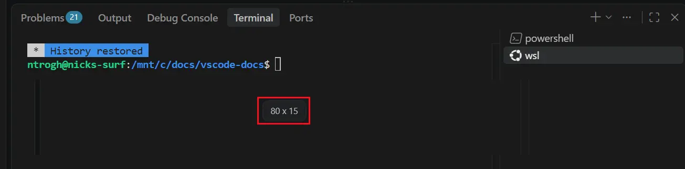

# Visual Studio Code 1.131

Follow us on [LinkedIn](https://www.linkedin.com/showcase/vs-code), [X](https://go.microsoft.com/fwlink/?LinkID=533687), [Bluesky](https://bsky.app/profile/vscode.dev) <!-- %IF INSIDERS % | Follow Insiders Changelog on [X](https://x.com/VSCodeChangelog) or [Bluesky](https://bsky.app/profile/vscodechangelog.bsky.social) %ENDIF % --> <!-- %IF IN_PRODUCT % | [View online](https://code.visualstudio.com/updates)%ENDIF % -->

---

_Release date: July 29, 2026_

<!-- DOWNLOAD_LINKS_PLACEHOLDER -->

---

Welcome to the 1.131 release of Visual Studio Code. This release brings more visibility into running subagents, built-in dictation across the workbench, and a new hybrid Markdown editor.

* [Subagents](#more-information-about-running-subagents-agents-window): See a running subagent's model, elapsed time, and active tool call without opening its conversation.

* [Built-in dictation (Experimental)](#built-in-dictation-across-vs-code-experimental): Dictate in chat, editors, and the terminal without installing the Speech extension.

* [Hybrid Markdown editor (Experimental)](#hybrid-markdown-editor-experimental): View, edit, and add agent-actionable comments to Markdown files in the Agents window.

Happy Coding!

---

<!-- %IF STABLE %
VS Code is rolling out gradually to all users. Use **Check for Updates** in VS Code to get the latest version immediately.

To try new features as soon as possible, [**download the nightly Insiders build**](https://code.visualstudio.com/insiders), which includes the latest updates as soon as they are available.

---
%ENDIF % -->

<!-- TOC

  <nav id="toc-nav">
    
In this update

    <ul>
      <li><a href="#agents">Agents</a></li>
      <li><a href="#chat">Chat</a></li>
      <li><a href="#editor-experience">Editor Experience</a></li>
      <li><a href="#accessibility">Accessibility</a></li>
      <li><a href="#terminal">Terminal</a></li>
      <li><a href="#languages">Languages</a></li>
      <li><a href="#deprecated-features-and-settings">Deprecated features and settings</a></li>
      <li><a href="#thank-you">Thank you</a></li>
    </ul>
  </nav>
  

Navigation End -->

## Agents

### Agent host

As mentioned in our last few releases, we're rearchitecting how agent sessions work in VS Code around the agent host - a dedicated process that runs agent harnesses such as Copilot, Claude, and Codex, based on the [Agent Host Protocol](https://microsoft.github.io/agent-host-protocol/) (AHP). Because a session lives in its own process, the same session can be connected to and rendered from multiple VS Code windows at once. The agent host's Copilot agent is powered by the [Copilot SDK](https://www.npmjs.com/package/@github/copilot-sdk), which means that its behavior and functionality is aligned with the Copilot CLI, the standalone GitHub Copilot app, and other Copilot products.

We're actively developing the agent host and progressively rolling it out to users. To opt in, enable `setting(chat.agentHost.enabled)` and then select an agent host harness from the harness dropdown. The screenshot below shows how to select the `Copilot` harness on the agent host in the editor window:

You can learn more in our [VS Code Agent Host architecture documentation](https://code.visualstudio.com/docs/agents/concepts/agent-host). If you have any feedback or requests, please let us know by [filing an issue](https://github.com/microsoft/vscode/issues).

### More information about running subagents (Agents window)

When working on complex tasks, the agent can delegate tasks to [subagents](https://code.visualstudio.com/docs/agents/concepts/agents#_subagents) to run them in parallel in its own context window. You can now quickly see what a running subagent is doing without opening its conversation. In the Agents window, the main conversation shows the following information for each running subagent:

* The model used by the subagent
* How long the subagent has been running
* The tool that the subagent is actively calling

Select a running subagent to open its conversation in another chat, where you can review its full progress while the parent conversation remains available.

<video src="images/1_131/subagent-acitve-toolcall.mp4" title="Video showing a running subagent's model, elapsed time, active tool call, and conversation opening in another chat in the Agents window." autoplay loop controls muted></video>

## Chat

### VS Code pet (Experimental)

A new highly experimental pet has been discovered in VS Code! Enter `/vscode-pet` in chat to meet your new companion.

<video src="images/1_131/pet.mp4" title="Video showing the experimental VS Code pet appearing in chat." autoplay loop controls muted></video>

## Editor Experience

### Built-in dictation across VS Code (Experimental)

**Setting**: `setting(dictation.enabled)`, `setting(dictation.showTranscript)` ([VS Code Insiders](https://code.visualstudio.com/insiders)), `setting(dictation.experimental.llmCleanup)`

To use dictation in VS Code, you no longer need to install the VS Code Speech extension. The built-in transcription service works in chat inputs, text editors, and the integrated terminal, with live text and controls suited to each surface. A single speech session and microphone selection are shared across all three surfaces, which prevents overlapping recordings and keeps dictated text in the intended location.

<video src="images/1_131/built-in-dictation.mp4" title="Video showing built-in dictation entering and refining text in VS Code." autoplay loop controls muted></video>

Built-in dictation uses the private, offline Nemotron model. The model downloads on first use and keeps audio on your device.

With `setting(dictation.experimental.llmCleanup)` enabled, Copilot refines your transcript as you speak by adding formatting and removing filler words. Transcript text is sent to a language model for cleanup. If cleanup is unavailable, VS Code keeps the raw transcript. In VS Code Insiders, use `setting(dictation.showTranscript)` to control whether the live transcript appears while you dictate.

#### Platform support

The following platforms are supported for built-in dictation:

* Windows x64 and Arm64
* macOS on Apple silicon
* Linux x64 and Arm64 with glibc 2.34 or later
* Remote workspaces (because transcription runs on the local VS Code client)

The following platforms are not currently supported for built-in dictation:

* VS Code for the Web
* Intel-based Macs, 32-bit systems, and Arm32 systems

Support for more platforms and languages is a work in progress.

### Hybrid Markdown editor (Experimental)

**Setting**: `setting(workbench.editor.markdownDefaultEditorInAgentsWindow)`

In this release, we introduce a new hybrid Markdown editor in the agents window. It lets you view Markdown files, edit them in-place, and add comments that an agent can act on.

By using **Reopen Editor With** you can switch between the text editor and this new Markdown editor, both in the Agents window and editor windows.

<video src="images/1_131/agents-markdown-editor.mp4" title="Markdown editor demo" autoplay loop controls muted></video>

## Accessibility

### More control over terminal screen reader updates

**Setting**: `setting(terminal.integrated.accessibleViewPreserveCursorPosition)`

Screen reader users can read terminal output at their own pace while commands continue to produce output. Set `setting(terminal.integrated.accessibleViewPreserveCursorPosition)` to `always` to preserve the cursor position in the terminal [Accessible View](https://code.visualstudio.com/docs/configure/accessibility/accessibility#_accessible-view), including when new content arrives. Existing `true` and `false` values continue to work.

Terminal live updates also use a non-interrupting ARIA status announcement instead of an assertive alert. Output remains available to screen readers without repeatedly interrupting other speech.

## Terminal

### Control the terminal resize dimensions overlay

**Setting**: `setting(terminal.integrated.resizeDimensionsOverlay.enabled)`

If you find the columns-by-rows overlay distracting when resizing the terminal, you can disable it with the `setting(terminal.integrated.resizeDimensionsOverlay.enabled)` setting. The overlay remains enabled by default, and setting changes apply immediately to open terminals without a restart.

## Languages

### Python

Python Environments is the default environment-management experience in VS Code Stable and Insiders after its rollout reached 100% of users. Review the [Python Environments rollout details and tracking](https://github.com/microsoft/vscode-python-environments/issues/581).

Python projects start faster and spend less time refreshing environments. Conda discovery is deferred until needed, concurrent environment scans are consolidated, and Pylance can use the last-known interpreter while a full refresh continues. _[#1600: Lazy-register Conda manager](https://github.com/microsoft/vscode-python-environments/pull/1600), [#1598: Coalesce concurrent native finder refreshes with the same key](https://github.com/microsoft/vscode-python-environments/pull/1598), [#1607: Return last-known environment when getEnvironment times out](https://github.com/microsoft/vscode-python-environments/pull/1607)_

## Deprecated features and settings

None

## Thank you

Contributions to `vscode`:

* [@accnops (Arthur Cnops)](https://github.com/accnops): voice: make passive ptt_start the canonical hands-free narration fix [PR #326405](https://github.com/microsoft/vscode/pull/326405)
* [@bwateratmsft (Brandon Waterloo [MSFT])](https://github.com/bwateratmsft): Add a when clause context key for detecting if an extension is installed+enabled [PR #326814](https://github.com/microsoft/vscode/pull/326814)
* [@Kaidesuyoo (Kaidesuyo)](https://github.com/Kaidesuyoo): fix performance regression caused by modern UI styles [PR #325985](https://github.com/microsoft/vscode/pull/325985)
* [@mirimadahmed (Mir)](https://github.com/mirimadahmed): Fix voice barge in regression [PR #326611](https://github.com/microsoft/vscode/pull/326611)
* [@piyushmadan (Piyush Madan)](https://github.com/piyushmadan): Resolve execution subagent model by exact CAPI id before family fallback [PR #324859](https://github.com/microsoft/vscode/pull/324859)
* [@SimonSiefke (Simon Siefke)](https://github.com/SimonSiefke)
  * fix: memory leak in abstractTaskService [PR #326934](https://github.com/microsoft/vscode/pull/326934)
  * fix: memory leak in abstractRuntimeExtensionsEditor [PR #326890](https://github.com/microsoft/vscode/pull/326890)
  * fix: memory leak in terminalProcessManager [PR #326930](https://github.com/microsoft/vscode/pull/326930)
  * fix: memory leak in debugModel [PR #327047](https://github.com/microsoft/vscode/pull/327047)
  * fix: memory leak in terminalService [PR #327156](https://github.com/microsoft/vscode/pull/327156)
  * fix: memory leak in mainThreadTerminalService [PR #327155](https://github.com/microsoft/vscode/pull/327155)
* [@SixFive7 (Jori Huisman)](https://github.com/SixFive7): Honor Explorer's `minItems` for the Windows taskbar jump list [PR #318117](https://github.com/microsoft/vscode/pull/318117)
* [@soreavis](https://github.com/soreavis): Git - resolve the active notebook for Open Changes / Open File [PR #326468](https://github.com/microsoft/vscode/pull/326468)

### Issue tracking

Contributions to our issue tracking:

* [@gjsjohnmurray (John Murray)](https://github.com/gjsjohnmurray)
* [@RedCMD (RedCMD)](https://github.com/RedCMD)
* [@IllusionMH (Andrii Dieiev)](https://github.com/IllusionMH)
* [@albertosantini (Alberto Santini)](https://github.com/albertosantini)

---

We really appreciate people trying our new features as soon as they are ready, so check back here often and learn what's new.

>If you'd like to read release notes for previous VS Code versions, go to [Updates](https://code.visualstudio.com/updates) on [code.visualstudio.com](https://code.visualstudio.com).

<a id="scroll-to-top" role="button" title="Scroll to top" aria-label="scroll to top" href="#"></a>
<link rel="stylesheet" type="text/css" href="css/inproduct_releasenotes.css"/>
