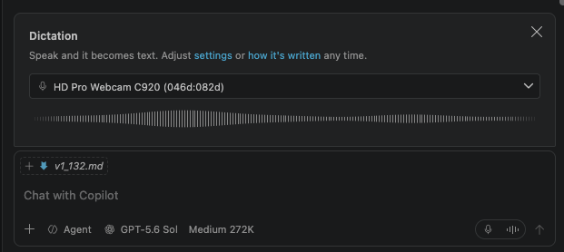

# Visual Studio Code 1.132

Follow us on [LinkedIn](https://www.linkedin.com/showcase/vs-code), [X](https://go.microsoft.com/fwlink/?LinkID=533687), [Bluesky](https://bsky.app/profile/vscode.dev) <!-- %IF INSIDERS % | Follow Insiders Changelog on [X](https://x.com/VSCodeChangelog) or [Bluesky](https://bsky.app/profile/vscodechangelog.bsky.social) %ENDIF % --> <!-- %IF IN_PRODUCT % | [View online](https://code.visualstudio.com/updates)%ENDIF % -->

---

_Release date: August 5, 2026_

<!-- DOWNLOAD_LINKS_PLACEHOLDER -->

---

Welcome to the 1.132 release of Visual Studio Code. This release ... <TODO @ntrogh>

* [highlight](#bookmark): <highlight description>

Happy Coding!

---

<!-- %IF STABLE %
VS Code is rolling out gradually to all users. Use **Check for Updates** in VS Code to get the latest version immediately.

To try new features as soon as possible, [**download the nightly Insiders build**](https://code.visualstudio.com/insiders), which includes the latest updates as soon as they are available.

---
%ENDIF % -->

<!-- TOC

  <nav id="toc-nav">
    
In this update

    <ul>
      <li><a href="#agents">Agents</a></li>
      <li><a href="#chat">Chat</a></li>
      <li><a href="#editor-experience">Editor Experience</a></li>
      <li><a href="#terminal">Terminal</a></li>
      <li><a href="#proposed-apis">Proposed APIs</a></li>
      <li><a href="#deprecated-features-and-settings">Deprecated features and settings</a></li>
      <li><a href="#notable-fixes">Notable fixes</a></li>
      <li><a href="#thank-you">Thank you</a></li>
    </ul>
  </nav>
  

Navigation End -->

## Agents

### Agent host

As mentioned in our last few releases, we're rearchitecting how agent sessions work in VS Code around the agent host - a dedicated process that runs agent harnesses such as Copilot, Claude, and Codex, based on the [Agent Host Protocol](https://microsoft.github.io/agent-host-protocol/) (AHP). Because a session lives in its own process, the same session can be connected to and rendered from multiple VS Code windows at once. The agent host's Copilot agent is powered by the [Copilot SDK](https://www.npmjs.com/package/@github/copilot-sdk), which means that its behavior and functionality is aligned with the Copilot CLI, the standalone GitHub Copilot app, and other Copilot products.

We're actively developing the agent host and progressively rolling it out to users. The screenshot below shows how to select the `Copilot` harness on the agent host in the editor window:

You can learn more in our [VS Code Agent Host documentation](https://code.visualstudio.com/docs/agents/concepts/agent-host). If you have any feedback or requests, please let us know by [filing an issue](https://github.com/microsoft/vscode/issues).

### Agents window

The [Agents window](https://code.visualstudio.com/docs/agents/agents-window) gives you a dedicated space to start and monitor multiple agent sessions.

#### Track session activity from the chat input

When an agent works across files, subagents, previews, and browsers, you can use live status pills above the chat input to follow its progress and quickly return to related work. The pills update with the activity for the session you are viewing:

* **Changes** summarizes the number of changes. Select it to view the changes for the current turn in a multi-file diff that updates live.
* **Previews** provides access to Markdown previews for files the agent creates or edits.
* **Subagents** lets you follow what the agent is doing in a subagent by opening its work in a separate chat.
* **Browsers** lets you follow along while the agent interacts with an integrated browser.

<video src="images/1_132/chat-pills.mp4" title="Video showing chat pills above the chat input in the agents window." autoplay loop controls muted></video>

#### Switch editor types in the Agents window

When multiple editor types are available, an editor type dropdown in the Agents window shows the current editor. Use it to switch between available editors, including different diff editors, or set the default without using **Reopen Editor With**. The dropdown uses the right side of the breadcrumb bar, which also provides file navigation in the Agents window.

To show the editor type dropdown in editor windows, enable `setting(breadcrumbs.showEditorType)`.

<video src="images/1_132/editorTypeDropdown.mp4" title="Video showing the editor type dropdown switching between available editors in the Agents window." autoplay loop controls muted></video>

### Support for side chats and `/btw`

You can now use `/btw` to ask a question in another chat. This chat shares the context and prompt cache of your primary chat, and you can ask questions without interrupting the current turn. You can similarly select text to ask contextual questions about the response.

<video src="images/1_132/ask-question.mp4" autoplay loop controls muted></video>

You can also share context by referencing chats in other chats, either by dragging the chat tabs into the input box, or typing `#chat:` and then picking the title of the chat to include/

## Chat

### Terminal output reflows to the available width

Expanded terminal output in Chat reflows to the available width as the view is resized. Previously, output used a fixed width, which caused lines to wrap too early and left unused space in wider views.

<video src="images/1_132/terminal-output-reflow.mp4" title="Video showing terminal output in Chat reflowing to the available width as the view is resized." autoplay loop controls muted></video>

This improvement applies to terminal output from both the Local agent harness and the Copilot harness running on the [agent host](#agent-host).

## Editor Experience

### Dictation onboarding and customization

**Setting**: `setting(agents.voice.language)`

The built-in dictation converts speech to text in chat inputs, editors, and terminals. When you use dictation for the first time, an onboarding experience helps you verify the selected microphone before you start. It shows a live microphone waveform, provides a device picker when multiple microphones are available, and links to dictation settings and customization. You can reopen this experience with **Voice: Show Dictation Introduction** from the Command Palette.

<video src="images/1_132/dictation-ux-improvements.mp4" title="Video showing Dictation UX improvements in the chat input." autoplay loop controls muted></video>

Dictation now uses multilingual Nemotron 3.5 as its default on-device model. The model keeps audio on your device and follows `setting(agents.voice.language)`. With automatic language selection, dictation uses your system or browser locale when supported and otherwise lets the model detect the language.

To adapt the final transcript to project terminology or formatting preferences, run **Voice: Configure Dictation Instructions**. VS Code combines instructions from `~/.copilot/dictation.md` and `.github/dictation.md` in trusted workspaces. These instructions supplement the built-in cleanup rules, which preserve the meaning of your speech and prefer numerals where appropriate.

If network restrictions prevent the on-device model from downloading, the error notification provides an action to import an official Foundry Local model package from disk. During a normal first-use download, the microphone button shows progress instead of placing download text in the input.

### Markdown diffs in the hybrid Markdown editor (Experimental)

The hybrid Markdown editor combines rendered Markdown with in-place editing and agent-actionable comments. In this release, Markdown diffs can open in the hybrid Markdown editor. The modified document remains editable, while gutter indicators highlight added, changed, and deleted content. You can use the editor type dropdown to switch between text diff and the markdown editor with diff annotations.

## Terminal

### Better dictation for terminal commands

Terminal dictation applies shell-aware cleanup, so spoken commands preserve shell syntax. For example, saying "git commit dash m hello world" produces `git commit -m "Hello World"` instead of inserting the words literally.

Select the active microphone button to stop recording.

## Proposed APIs

### Configure custom editor priorities by editor mode

The proposed `customEditors.priority` feature lets extensions choose different priorities for text and diff editors. For example, an extension can use its custom editor by default for regular files while keeping the built-in editor as the default for diffs and vice versa.

Existing single priority values continue to work, and diff editors use `explicit` by default. Extension authors can learn more about [configuring custom editor priorities](https://github.com/microsoft/vscode/issues/292379). We plan to promote this feature to stable in the next release.

## Deprecated features and settings

### New deprecations in this release

* Agent host policy

  The `ChatAgentHostEnabled` policy is removed, so administrators can no longer disable the agent host through policy. You can continue to use `setting(chat.agentHost.enabled)` to control whether agents run in the separate agent host process.

### Upcoming deprecations

## Notable fixes

## Thank you

Contributions to `vscode`:

* [@accnops (Arthur Cnops)](https://github.com/accnops)
  * Voice: answer question carousels by voice [PR #327899](https://github.com/microsoft/vscode/pull/327899)
  * Voice: queue concurrent question forms instead of swapping them [PR #328205](https://github.com/microsoft/vscode/pull/328205)
* [@alexander-zw (Alexander Wu)](https://github.com/alexander-zw): [trivial] Add example sources to docstrings in cursorEvents.ts [PR #241250](https://github.com/microsoft/vscode/pull/241250)
* [@AndyBodnar (Andy )](https://github.com/AndyBodnar): customEditor: fix stale cache after file deletion [PR #287966](https://github.com/microsoft/vscode/pull/287966)
* [@AntonioLujanoLuna (Antonio Lujano Luna)](https://github.com/AntonioLujanoLuna): Preserve inbound Anthropic PDF documents [PR #325833](https://github.com/microsoft/vscode/pull/325833)
* [@Bestra (Chris Westra)](https://github.com/Bestra): Log organization resource cache creation failures [PR #326958](https://github.com/microsoft/vscode/pull/326958)
* [@bstee615 (Benjamin Steenhoek)](https://github.com/bstee615): Set default NES aggressiveness to medium [PR #327049](https://github.com/microsoft/vscode/pull/327049)
* [@denizguney (Deniz Güney Yıldırım)](https://github.com/denizguney): feat: add getAccessibilityStatus [PR #328018](https://github.com/microsoft/vscode/pull/328018)
* [@dsavy4 (Dmitry Savy)](https://github.com/dsavy4)
  * Fix stableStringify treating shared references as circular [PR #327398](https://github.com/microsoft/vscode/pull/327398)
  * Fix BidirectionalMap leaving a stale reverse entry on key update [PR #327403](https://github.com/microsoft/vscode/pull/327403)
* [@EmrecanKaracayir (Emrecan Karaçayır)](https://github.com/EmrecanKaracayir): Fix for missing terminal suggest symbol icon css mappings [PR #293158](https://github.com/microsoft/vscode/pull/293158)
* [@jdanbrown (Dan Brown)](https://github.com/jdanbrown): Terminal tab title: Show "~" instead of "$HOME" [PR #275378](https://github.com/microsoft/vscode/pull/275378)
* [@KevinWang-wpq](https://github.com/KevinWang-wpq): Remove stale secrets after decryption failure [PR #324014](https://github.com/microsoft/vscode/pull/324014)
* [@mirimadahmed (Mir)](https://github.com/mirimadahmed)
  * Voice: warm capture before hands-free playback [PR #328225](https://github.com/microsoft/vscode/pull/328225)
  * Make coding agent voice aware for better voice experience [PR #328217](https://github.com/microsoft/vscode/pull/328217)
* [@Moli13337 (Moli)](https://github.com/Moli13337): docs: Fix incorrect directory paths in CONTRIBUTING.md files [PR #325810](https://github.com/microsoft/vscode/pull/325810)
* [@Mr-Nilarnab (MR NILARNAB GITHUB)](https://github.com/Mr-Nilarnab): docs: fix minor typos and grammar in README [PR #325006](https://github.com/microsoft/vscode/pull/325006)
* [@Muszic (Sangeet)](https://github.com/Muszic): fix: correct ArrayQueue boundaries in takeWhile and takeFromEndWhile [PR #301119](https://github.com/microsoft/vscode/pull/301119)
* [@ohah (ohah)](https://github.com/ohah): fix: file-found Badge vertical [PR #273098](https://github.com/microsoft/vscode/pull/273098)
* [@peterdanwan (Peter Wan)](https://github.com/peterdanwan): fix: signature help's active overload not updating [PR #320980](https://github.com/microsoft/vscode/pull/320980)
* [@praneethhere (Praneeth Kodumagulla)](https://github.com/praneethhere): Support COPILOT_HOME for Copilot CLI state [PR #314917](https://github.com/microsoft/vscode/pull/314917)
* [@RedCMD (RedCMD)](https://github.com/RedCMD): fix: bug in Restrict continue comment [PR #322668](https://github.com/microsoft/vscode/pull/322668)
* [@rushil-b-patel (Rushil Patel (rusp))](https://github.com/rushil-b-patel): feat: add copy button to code blocks in markdown preview [PR #323609](https://github.com/microsoft/vscode/pull/323609)
* [@samir-nimbly](https://github.com/samir-nimbly): Fix chat image attachments silently dropped when signed out of GitHub [PR #323856](https://github.com/microsoft/vscode/pull/323856)
* [@SimonSiefke (Simon Siefke)](https://github.com/SimonSiefke)
  * fix: memory leak in titleBarPart [PR #327552](https://github.com/microsoft/vscode/pull/327552)
  * fix: memory leak in notebook view model [PR #328208](https://github.com/microsoft/vscode/pull/328208)
  * fix: memory leak in decorationAddon._decorations [PR #326933](https://github.com/microsoft/vscode/pull/326933)
  * fix: memory leak in chatServiceImpl [PR #327128](https://github.com/microsoft/vscode/pull/327128)
  * fix: memory leak in settings-tree [PR #327909](https://github.com/microsoft/vscode/pull/327909)
  * fix: memory leak in historyService [PR #327518](https://github.com/microsoft/vscode/pull/327518)
* [@sricursion (Sriraj)](https://github.com/sricursion): Escape dynamic values in the customizations index [PR #327475](https://github.com/microsoft/vscode/pull/327475)
* [@thernstig (Tobias Hernstig)](https://github.com/thernstig): Fix forwarded ports status bar item to toggle the ports view [PR #320090](https://github.com/microsoft/vscode/pull/320090)
* [@Vector341](https://github.com/Vector341): [html] fix validation error on JavaScript block comment (for #171153) [PR #240932](https://github.com/microsoft/vscode/pull/240932)
* [@yogeshwaran-c (Yogeshwaran C)](https://github.com/yogeshwaran-c)
  * fix(javascript): sync JSDoc continuation patterns with TypeScript language config [PR #308433](https://github.com/microsoft/vscode/pull/308433)
  * [json] add #region folding markers to language configuration [PR #318515](https://github.com/microsoft/vscode/pull/318515)
  * Add package.json catalog support for npm completions and hover [PR #307989](https://github.com/microsoft/vscode/pull/307989)
  * Show keybinding in Toggle Search Details tooltip [PR #311859](https://github.com/microsoft/vscode/pull/311859)
  * fix(server): propagate --enable-proposed-api in serve-web [PR #310207](https://github.com/microsoft/vscode/pull/310207)
  * fix: remove all manual folding ranges when selection is empty [PR #304793](https://github.com/microsoft/vscode/pull/304793)
  * fix: detect interrupted commands in terminal exit code hack [PR #307256](https://github.com/microsoft/vscode/pull/307256)
  * fix: wrap module script content in block scope to prevent false redeclaration errors [PR #308027](https://github.com/microsoft/vscode/pull/308027)
* [@zmr-233](https://github.com/zmr-233): Avoid :has() selectors that trigger workbench-wide style invalidation [PR #327052](https://github.com/microsoft/vscode/pull/327052)

### Issue tracking

Contributions to our issue tracking:

* [@gjsjohnmurray (John Murray)](https://github.com/gjsjohnmurray)
* [@MominRaza (Momin Ahmad)](https://github.com/MominRaza)
* [@palinkasnorbert (Norbert Palinkas)](https://github.com/palinkasnorbert)
* [@IllusionMH (Andrii Dieiev)](https://github.com/IllusionMH)
* [@ganlvtech (Ganlv)](https://github.com/ganlvtech)

---

We really appreciate people trying our new features as soon as they are ready, so check back here often and learn what's new.

>If you'd like to read release notes for previous VS Code versions, go to [Updates](https://code.visualstudio.com/updates) on [code.visualstudio.com](https://code.visualstudio.com).

<a id="scroll-to-top" role="button" title="Scroll to top" aria-label="scroll to top" href="#"></a>
<link rel="stylesheet" type="text/css" href="css/inproduct_releasenotes.css"/>
