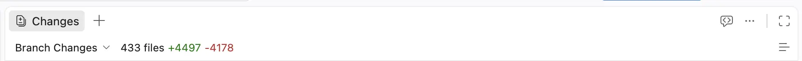
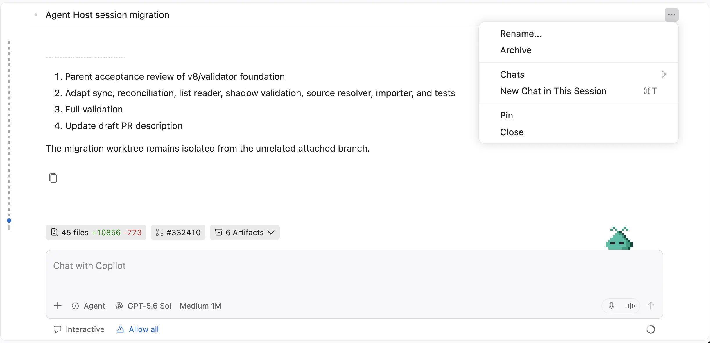
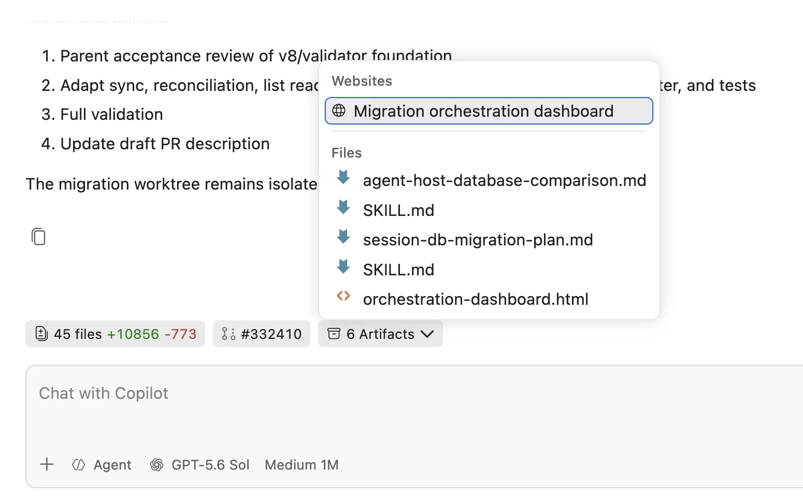
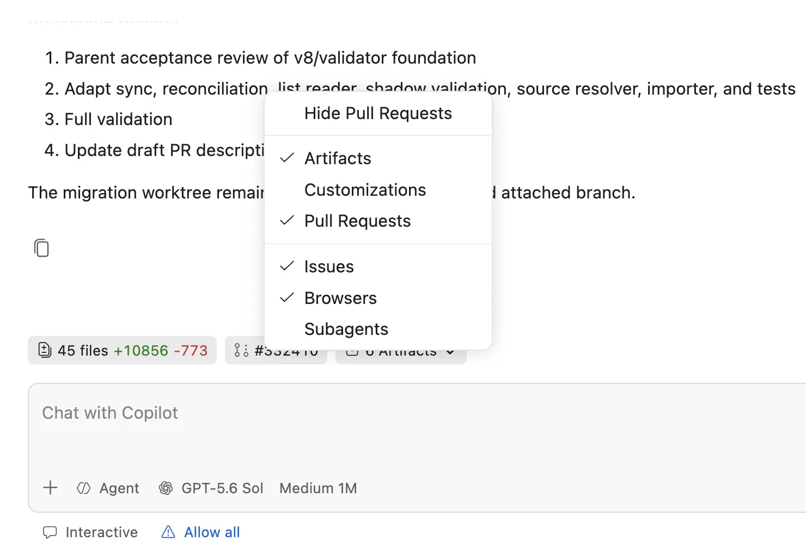
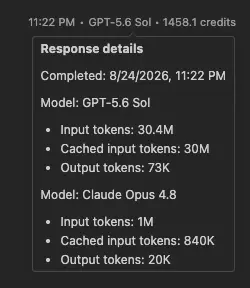

# Visual Studio Code 1.135

Follow us on [LinkedIn](https://www.linkedin.com/showcase/vs-code), [X](https://go.microsoft.com/fwlink/?LinkID=533687), [Bluesky](https://bsky.app/profile/vscode.dev), [Instagram](https://www.instagram.com/vscode.ig) <!-- %IF INSIDERS % | Follow Insiders Changelog on [X](https://x.com/VSCodeChangelog) or [Bluesky](https://bsky.app/profile/vscodechangelog.bsky.social) %ENDIF % --> <!-- %IF IN_PRODUCT % | [View online](https://code.visualstudio.com/updates)%ENDIF % -->

---

_Release date: August 26, 2026_

<!-- DOWNLOAD_LINKS_PLACEHOLDER -->

---

Welcome to the 1.135 release of Visual Studio Code. This release helps you continue agent sessions across applications, get a second opinion on agent work, and understand chat usage while working in a more streamlined Agents window.

* [External agent sessions](#continue-external-agent-sessions-in-vs-code): Continue recent Copilot or Claude agent sessions from other applications in VS Code.

* [Rubber Duck (Experimental)](#rubber-duck-experimental): Get a second opinion from a complementary model to surface missed details and edge cases.

* [Agents window UX improvements](#single-pane-side-layout-is-now-the-default): Work with a streamlined side layout, simplified session controls, and session information that is easier to find.

* [Detailed chat usage](#view-detailed-chat-turn-usage): View a per-model breakdown of input, cached input, and output tokens for each chat turn.

Happy Coding!

---

<!-- %IF STABLE %
VS Code is rolling out gradually to all users. Use **Check for Updates** in VS Code to get the latest version immediately.

To try new features as soon as possible, [**download the nightly Insiders build**](https://code.visualstudio.com/insiders), which includes the latest updates as soon as they are available.

---
%ENDIF % -->

<!-- TOC

  <nav id="toc-nav">
    
In this update

    <ul>
      <li><a href="#agents">Agents</a></li>
      <li><a href="#chat">Chat</a></li>
      <li><a href="#deprecated-features-and-settings">Deprecated features and settings</a></li>
      <li><a href="#thank-you">Thank you</a></li>
    </ul>
  </nav>
  

Navigation End -->

## Agents

### Agent host

The agent host lets you connect to the same agent session from multiple VS Code windows. It runs agent harnesses in a dedicated process based on the [Agent Host Protocol](https://microsoft.github.io/agent-host-protocol/) (AHP). The agent host's Copilot agent is powered by the [Copilot SDK](https://www.npmjs.com/package/@github/copilot-sdk), which aligns the agent's behavior and functionality with the Copilot CLI, the standalone GitHub Copilot app, and other Copilot products.

We're actively developing the agent host. The following screenshot shows the `Copilot` harness selected for an agent host in an editor window:

Learn more from our [VS Code Agent Host documentation](https://code.visualstudio.com/docs/agents/concepts/agent-host) and the video below. If you have any feedback or requests, please let us know by [filing an issue](https://github.com/microsoft/vscode/issues).

See it in action in our [Agent Host introduction YouTube video](https://www.youtube.com/watch?v=k91ejc3G1YM).

### Continue external agent sessions in VS Code

**Setting**: `setting(chat.agentSessions.showExternal)`

The Sessions list in VS Code can now show recent Copilot or Claude agent sessions that you created in other applications. By default, VS Code shows up to two recently updated external sessions. Select a session from the Sessions list to view the conversation and continue it in VS Code with your Copilot subscription.

When you open an external session, a banner at the top of the chat lets you configure how many external sessions appear in the Sessions list. You can also use the **External** submenu in the Sessions list filter to choose which external sessions are shown. Change this preference at any time with the `setting(chat.agentSessions.showExternal)` setting.

### Rubber Duck (Experimental)

Rubber Duck is an experimental feature that allows you to get a second opinion from a complementary model on the agent's work. It helps surface missed details or edge cases. You can use Rubber Duck by invoking the `/rubber-duck` command in a Copilot agent host session.

Learn more about [Rubber Duck in GitHub Copilot CLI](https://github.blog/ai-and-ml/github-copilot/github-copilot-cli-combines-model-families-for-a-second-opinion/).

### Single-pane side layout is now the default

**Setting**: `setting(sessions.layout.singlePaneDetailPanel)`

In the previous release, we introduced the single-pane layout. In this layout, session details and editors are located in a single side pane, with a shared tab bar next to chat. The single-pane layout is now enabled by default for the Agents window on desktop.

This release also improves the layout:

* Diffs use a side-by-side view when space permits and switch to an inline view when the side pane becomes too narrow. Use **Always Show Inline Diff** from the editor title menu to keep diffs inline at every width.
* The action bar is less crowded. Editor-specific actions for diffs, view modes, code review, and attachments move to the editor title area, while the shared header focuses on showing or hiding Details.

To use the classic layout, disable `setting(sessions.layout.singlePaneDetailPanel)` and reload the window.

### Simplified session controls and information

The session header is less crowded, so you can identify the active session more easily and focus on the conversation.

The session title has a prominent position, while an overflow menu next to the title groups actions for creating a chat and pinning the session. Search remains available in the Sessions list. When a session contains multiple chats, chat tabs replace the single-chat header.

Session information moves directly above the chat input, where it is easier to find while you work. Pills can show changes, pull requests, issues, browsers the agent is interacting with, and artifacts from the session. For example, the **Changes** pill shows live file and diff counts and opens the complete set of session changes.

Right-click an individual pill to open a context menu and choose which pill types are visible. The **Changes** pill remains visible whenever the session has changes.

## Chat

### Editor-style sticky scroll for chat (Experimental)

**Settings**: `setting(chat.stickyScroll.enabled)`, `setting(chat.experimental.stickyScroll.enabled)`

Chat sticky scroll lets you keep the current prompt visible as you scroll through and review long responses. We've further refined the behavior to make it more consistent with sticky scroll in the editor. Enable both settings to try the redesigned experience.

<video src="images/1_135/chat_sticky_scroll.mp4" title="Video showing the current chat prompt remaining visible while scrolling through a response." autoplay loop controls muted></video>

### View detailed chat turn usage

To give you better insight into your chat usage, we've redesigned the chat response footer. When you hover over it, the footer shows a per-model breakdown of the input, cached input, and output tokens used in that chat turn.

### Sandboxing for the local agent harness

We previously rolled out sandboxing to 50% of users to validate it on a larger scale and in real-world use cases. While we didn't identify a specific blocking issue, continuing the rollout would likely require more support and follow-up work at a time when we want to preserve focus on higher-priority investments, especially in the area of the agent host and the Copilot harness. We've therefore returned the default rollout to 0% for now.

Sandboxing for the local agent harness remains available as an opt-in feature through the UI, so users who want to try it can still enable it.

## Deprecated features and settings

None

## Thank you

Contributions to `vscode`:

* [@a-stewart (Anthony Stewart)](https://github.com/a-stewart): Rename leftover respectAutoSaveConfig variable to isRefactoring [PR #160703](https://github.com/microsoft/vscode/pull/160703)
* [@bstee615 (Benjamin Steenhoek)](https://github.com/bstee615): Add eagerness option for diffpatch prompt [PR #327544](https://github.com/microsoft/vscode/pull/327544)
* [@cipheraxat (Akshat Anand)](https://github.com/cipheraxat): fix: center Modern UI panel title tabs in the 32px header [PR #331612](https://github.com/microsoft/vscode/pull/331612)
* [@danyalahmed1995 (Danyal Ahmed)](https://github.com/danyalahmed1995): Fix case-insensitive aggregated basename glob matching [PR #316387](https://github.com/microsoft/vscode/pull/316387)
* [@dzsquared (Drew Skwiers-Koballa)](https://github.com/dzsquared): add mcp server key as description in tool picker [PR #325003](https://github.com/microsoft/vscode/pull/325003)
* [@guimmd2 (Guilherme Menezes Magalhães)](https://github.com/guimmd2): Fix package.json hover metadata broken in npm 12+ [PR #327951](https://github.com/microsoft/vscode/pull/327951)
* [@jachinsamuel (Jachin Samuel)](https://github.com/jachinsamuel): docs: remove dead Gitter badge (service shut down June 2023) [PR #322702](https://github.com/microsoft/vscode/pull/322702)
* [@jadefr (Jade Ferreira Vieira)](https://github.com/jadefr): Fix file URL to path conversion in html-language-features esbuild script [PR #328557](https://github.com/microsoft/vscode/pull/328557)
* [@jainampatel27 (Jainam Patel)](https://github.com/jainampatel27): Fix typo in selectionHighlightMaxLength description [PR #296427](https://github.com/microsoft/vscode/pull/296427)
* [@juliagongms (Julia Gong)](https://github.com/juliagongms): nes: add optimized PatchBased02 prompt strategy [PR #332018](https://github.com/microsoft/vscode/pull/332018)
* [@n-gist (n-gist)](https://github.com/n-gist): fix languages.getDiagnostics() problem-matchers diagnostics duplication [PR #290278](https://github.com/microsoft/vscode/pull/290278)
* [@rfeltis (Ralph Feltis)](https://github.com/rfeltis)
  * Remove Agents window startup A/A experiment trigger [PR #331559](https://github.com/microsoft/vscode/pull/331559)
  * Revert chat quota trajectory nudge [PR #331401](https://github.com/microsoft/vscode/pull/331401)
* [@RyanEwen (Ryan Ewen)](https://github.com/RyanEwen): Do not present a failed tool call as a successful one [PR #330707](https://github.com/microsoft/vscode/pull/330707)
* [@SimonSiefke (Simon Siefke)](https://github.com/SimonSiefke)
  * fix: memory leak in markersTable [PR #327885](https://github.com/microsoft/vscode/pull/327885)
  * fix: memory leak in mainThreadDocumentsAndEditors [PR #331170](https://github.com/microsoft/vscode/pull/331170)
  * fix: memory leak in settings preview indicator [PR #331990](https://github.com/microsoft/vscode/pull/331990)
* [@srikanthananthula63053 (srikanthananthula)](https://github.com/srikanthananthula63053)
  * fix: use fresh service accessor when lazily initializing chat attachment context (fixes #329610) [PR #331416](https://github.com/microsoft/vscode/pull/331416)
  * Fix section checkbox state when all items are unchecked [PR #331419](https://github.com/microsoft/vscode/pull/331419)
* [@TheRealAlexxx (alexxx)](https://github.com/TheRealAlexxx): Fix typo in Settings UI description for editor.selectionHighlightMaxLength [PR #332162](https://github.com/microsoft/vscode/pull/332162)
* [@zainnadeem786 (Zain Nadeem)](https://github.com/zainnadeem786)
  * Await Workspace Trust transition completion in setUrisTrust() [PR #328626](https://github.com/microsoft/vscode/pull/328626)
  * Fix PowerShell quoting for runInTerminal environment values [PR #331753](https://github.com/microsoft/vscode/pull/331753)

Contributions to `vscode-windows-process-tree`:

* [@danfiedler-msft (Dan Fiedler)](https://github.com/danfiedler-msft): Pin GitHub Actions to full-length commit SHAs [PR #91](https://github.com/microsoft/vscode-windows-process-tree/pull/91)

### Issue tracking

Contributions to our issue tracking:

* [@gjsjohnmurray (John Murray)](https://github.com/gjsjohnmurray)
* [@xguarch (Xavier Guarch)](https://github.com/xguarch)
* [@homeworld614 (homeworld614)](https://github.com/homeworld614)
* [@johnnydecimal (Johnny Noble)](https://github.com/johnnydecimal)
* [@wenma531 (noreply)](https://github.com/wenma531)

---

We really appreciate people trying our new features as soon as they are ready, so check back here often and learn what's new.

>If you'd like to read release notes for previous VS Code versions, go to [Updates](https://code.visualstudio.com/updates) on [code.visualstudio.com](https://code.visualstudio.com).

<a id="scroll-to-top" role="button" title="Scroll to top" aria-label="scroll to top" href="#"></a>
<link rel="stylesheet" type="text/css" href="css/inproduct_releasenotes.css"/>
