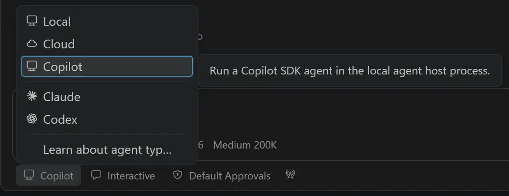

# Visual Studio Code 1.135

Follow us on [LinkedIn](https://www.linkedin.com/showcase/vs-code), [X](https://go.microsoft.com/fwlink/?LinkID=533687), [Bluesky](https://bsky.app/profile/vscode.dev), [Instagram](https://www.instagram.com/vscode.ig) <!-- %IF INSIDERS % | Follow Insiders Changelog on [X](https://x.com/VSCodeChangelog) or [Bluesky](https://bsky.app/profile/vscodechangelog.bsky.social) %ENDIF % --> <!-- %IF IN_PRODUCT % | [View online](https://code.visualstudio.com/updates)%ENDIF % -->

---

_Release date: August 26, 2026_

<!-- DOWNLOAD_LINKS_PLACEHOLDER -->

---

Welcome to the 1.135 release of Visual Studio Code. This release ... <TODO @ntrogh>

* [highlight](#bookmark): <highlight description>

Happy Coding!

---

<!-- %IF STABLE %
VS Code is rolling out gradually to all users. Use **Check for Updates** in VS Code to get the latest version immediately.

To try new features as soon as possible, [**download the nightly Insiders build**](https://code.visualstudio.com/insiders), which includes the latest updates as soon as they are available.

---
%ENDIF % -->

<!-- TOC

  <nav id="toc-nav">
    
In this update

    <ul>
      <li><a href="#agents">Agents</a></li>
      <li><a href="#chat">Chat</a></li>
      <li><a href="#mcp">MCP</a></li>
      <li><a href="#accessibility">Accessibility</a></li>
      <li><a href="#editor-experience">Editor Experience</a></li>
      <li><a href="#code-editing">Code Editing</a></li>
      <li><a href="#notebooks">Notebooks</a></li>
      <li><a href="#source-control">Source Control</a></li>
      <li><a href="#debugging">Debugging</a></li>
      <li><a href="#tasks">Tasks</a></li>
      <li><a href="#terminal">Terminal</a></li>
      <li><a href="#authentication">Authentication</a></li>
      <li><a href="#languages">Languages</a></li>
      <li><a href="#remote-development">Remote Development</a></li>
      <li><a href="#contributions-to-extensions">Contributions to extensions</a></li>
      <li><a href="#extension-authoring">Extension Authoring</a></li>
      <li><a href="#proposed-apis">Proposed APIs</a></li>
      <li><a href="#engineering">Engineering</a></li>
      <li><a href="#deprecated-features-and-settings">Deprecated features and settings</a></li>
      <li><a href="#notable-fixes">Notable fixes</a></li>
      <li><a href="#thank-you">Thank you</a></li>
    </ul>
  </nav>
  

Navigation End -->

## Agents

### Agent host

The agent host lets you connect to the same agent session from multiple VS Code windows. It runs agent harnesses in a dedicated process based on the [Agent Host Protocol](https://microsoft.github.io/agent-host-protocol/) (AHP). The agent host's Copilot agent is powered by the [Copilot SDK](https://www.npmjs.com/package/@github/copilot-sdk), which aligns the agent's behavior and functionality with the Copilot CLI, the standalone GitHub Copilot app, and other Copilot products.

We're actively developing the agent host. The following screenshot shows the `Copilot` harness selected for an agent host in an editor window:

You can learn more in our [VS Code Agent Host documentation](https://code.visualstudio.com/docs/agents/concepts/agent-host) and the video below. If you have any feedback or requests, please let us know by [filing an issue](https://github.com/microsoft/vscode/issues).

<video src="images/1_135/agent-host-vscode.mp4" title="Video showing the Agent Host feature in VS Code, demonstrating how agent sessions persist and sync across different projects, web interfaces, and machines." autoplay loop controls muted></video>

### Rubber Duck (Experimental)

The Copilot agent host enables `/rubber-duck` by default. Use it to ask a complementary model for a second opinion on the agent's work and surface missed details or edge cases. Learn more about [Rubber Duck in GitHub Copilot CLI](https://github.blog/ai-and-ml/github-copilot/github-copilot-cli-combines-model-families-for-a-second-opinion/).

## Chat

### Editor-style sticky scroll for chat (Experimental)

**Setting**: `setting(chat.stickyScroll.enabled)`, `setting(chat.experimental.stickyScroll.enabled)`

Chat sticky scroll already keeps the current prompt visible as you review long responses. Enable both settings to try a redesigned experience that behaves more like editor sticky scroll.

<video src="images/1_135/chat_sticky_scroll.mp4" title="Video showing the current chat prompt remaining visible while scrolling through a response." autoplay loop controls muted></video>

### View detailed chat turn usage

Chat turn usage is easier to understand with a redesigned response footer hover. It shows when the turn completed and breaks down input, cached input, and output tokens by model.

## MCP

## Accessibility

## Editor Experience

## Code Editing

## Notebooks

## Source Control

## Debugging

## Tasks

## Terminal

## Authentication

## Languages

## Remote Development

The [Remote Development extensions](https://marketplace.visualstudio.com/items?itemName=ms-vscode-remote.vscode-remote-extensionpack), allow you to use a [Dev Container](https://code.visualstudio.com/docs/devcontainers/containers), remote machine via SSH or [Remote Tunnels](https://code.visualstudio.com/docs/remote/tunnels), or the [Windows Subsystem for Linux](https://learn.microsoft.com/windows/wsl) (WSL) as a full-featured development environment.

Highlights include:

* TODO: @ntrogh

You can learn more about these features in the [Remote Development release notes](https://github.com/microsoft/vscode-docs/blob/main/remote-release-notes/v1_135.md).

## Contributions to extensions

## Extension Authoring

## Proposed APIs

## Engineering

## Deprecated features and settings

### New deprecations in this release

### Upcoming deprecations

## Notable fixes

## Thank you

Contributions to `vscode`:

* [@a-stewart (Anthony Stewart)](https://github.com/a-stewart): Rename leftover respectAutoSaveConfig variable to isRefactoring [PR #160703](https://github.com/microsoft/vscode/pull/160703)
* [@bstee615 (Benjamin Steenhoek)](https://github.com/bstee615): Add eagerness option for diffpatch prompt [PR #327544](https://github.com/microsoft/vscode/pull/327544)
* [@cipheraxat (Akshat Anand)](https://github.com/cipheraxat): fix: center Modern UI panel title tabs in the 32px header [PR #331612](https://github.com/microsoft/vscode/pull/331612)
* [@danyalahmed1995 (Danyal Ahmed)](https://github.com/danyalahmed1995): Fix case-insensitive aggregated basename glob matching [PR #316387](https://github.com/microsoft/vscode/pull/316387)
* [@dzsquared (Drew Skwiers-Koballa)](https://github.com/dzsquared): add mcp server key as description in tool picker [PR #325003](https://github.com/microsoft/vscode/pull/325003)
* [@guimmd2 (Guilherme Menezes Magalhães)](https://github.com/guimmd2): Fix package.json hover metadata broken in npm 12+ [PR #327951](https://github.com/microsoft/vscode/pull/327951)
* [@jachinsamuel (Jachin Samuel)](https://github.com/jachinsamuel): docs: remove dead Gitter badge (service shut down June 2023) [PR #322702](https://github.com/microsoft/vscode/pull/322702)
* [@jadefr (Jade Ferreira Vieira)](https://github.com/jadefr): Fix file URL to path conversion in html-language-features esbuild script [PR #328557](https://github.com/microsoft/vscode/pull/328557)
* [@jainampatel27 (Jainam Patel)](https://github.com/jainampatel27): Fix typo in selectionHighlightMaxLength description [PR #296427](https://github.com/microsoft/vscode/pull/296427)
* [@juliagongms (Julia Gong)](https://github.com/juliagongms): nes: add optimized PatchBased02 prompt strategy [PR #332018](https://github.com/microsoft/vscode/pull/332018)
* [@n-gist (n-gist)](https://github.com/n-gist): fix languages.getDiagnostics() problem-matchers diagnostics duplication [PR #290278](https://github.com/microsoft/vscode/pull/290278)
* [@rfeltis (Ralph Feltis)](https://github.com/rfeltis)
  * Remove Agents window startup A/A experiment trigger [PR #331559](https://github.com/microsoft/vscode/pull/331559)
  * Revert chat quota trajectory nudge [PR #331401](https://github.com/microsoft/vscode/pull/331401)
* [@RyanEwen (Ryan Ewen)](https://github.com/RyanEwen): Do not present a failed tool call as a successful one [PR #330707](https://github.com/microsoft/vscode/pull/330707)
* [@SimonSiefke (Simon Siefke)](https://github.com/SimonSiefke)
  * fix: memory leak in markersTable [PR #327885](https://github.com/microsoft/vscode/pull/327885)
  * fix: memory leak in mainThreadDocumentsAndEditors [PR #331170](https://github.com/microsoft/vscode/pull/331170)
  * fix: memory leak in settings preview indicator [PR #331990](https://github.com/microsoft/vscode/pull/331990)
* [@srikanthananthula63053 (srikanthananthula)](https://github.com/srikanthananthula63053)
  * fix: use fresh service accessor when lazily initializing chat attachment context (fixes #329610) [PR #331416](https://github.com/microsoft/vscode/pull/331416)
  * Fix section checkbox state when all items are unchecked [PR #331419](https://github.com/microsoft/vscode/pull/331419)
* [@TheRealAlexxx (alexxx)](https://github.com/TheRealAlexxx): Fix typo in Settings UI description for editor.selectionHighlightMaxLength [PR #332162](https://github.com/microsoft/vscode/pull/332162)
* [@zainnadeem786 (Zain Nadeem)](https://github.com/zainnadeem786)
  * Await Workspace Trust transition completion in setUrisTrust() [PR #328626](https://github.com/microsoft/vscode/pull/328626)
  * Fix PowerShell quoting for runInTerminal environment values [PR #331753](https://github.com/microsoft/vscode/pull/331753)

Contributions to `vscode-windows-process-tree`:

* [@danfiedler-msft (Dan Fiedler)](https://github.com/danfiedler-msft): Pin GitHub Actions to full-length commit SHAs [PR #91](https://github.com/microsoft/vscode-windows-process-tree/pull/91)

### Issue tracking

Contributions to our issue tracking:

* [@gjsjohnmurray (John Murray)](https://github.com/gjsjohnmurray)
* [@xguarch (Xavier Guarch)](https://github.com/xguarch)
* [@homeworld614 (homeworld614)](https://github.com/homeworld614)
* [@johnnydecimal (Johnny Noble)](https://github.com/johnnydecimal)
* [@wenma531 (noreply)](https://github.com/wenma531)

---

We really appreciate people trying our new features as soon as they are ready, so check back here often and learn what's new.

>If you'd like to read release notes for previous VS Code versions, go to [Updates](https://code.visualstudio.com/updates) on [code.visualstudio.com](https://code.visualstudio.com).

<a id="scroll-to-top" role="button" title="Scroll to top" aria-label="scroll to top" href="#"></a>
<link rel="stylesheet" type="text/css" href="css/inproduct_releasenotes.css"/>
