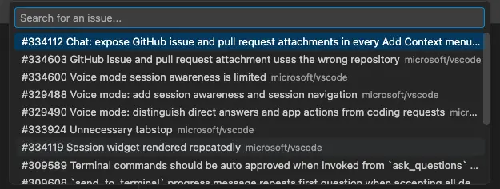
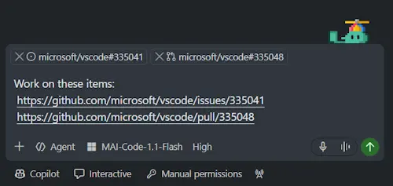
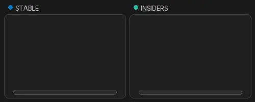
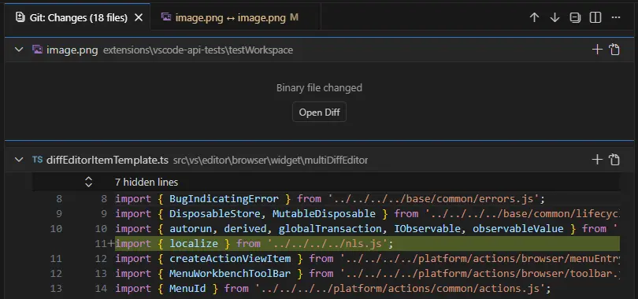
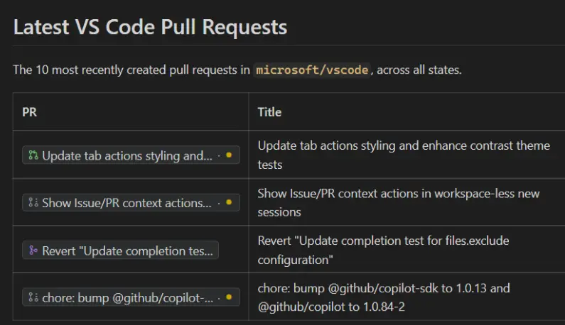

# Visual Studio Code 1.137

Follow us on [LinkedIn](https://www.linkedin.com/showcase/vs-code), [X](https://go.microsoft.com/fwlink/?LinkID=533687), [Bluesky](https://bsky.app/profile/vscode.dev), [Instagram](https://www.instagram.com/vscode.ig) <!-- %IF INSIDERS % | Follow Insiders Changelog on [X](https://x.com/VSCodeChangelog) or [Bluesky](https://bsky.app/profile/vscodechangelog.bsky.social) %ENDIF % --> <!-- %IF IN_PRODUCT % | [View online](https://code.visualstudio.com/updates)%ENDIF % -->

---

_Release date: September 9, 2026_

<!-- DOWNLOAD_LINKS_PLACEHOLDER -->

---

Welcome to the 1.137 release of Visual Studio Code. This release helps you automate recurring work, continue quick chats in a workspace, talk with agents by voice, and work with GitHub issues and pull requests without leaving the Agents window.

* [The Story of VS Code](#the-story-of-vs-code): Watch the VS Code documentary and discover how the editor and its community evolved.

* [Automations (Preview)](#automations-preview): Schedule recurring agent tasks to run hourly, daily, or weekly, or run them on demand.

* [Voice Mode (Experimental)](#voice-mode-experimental): Talk with an agent and interrupt or redirect it while it works on your code.

* [Continue quick chats in a workspace](#continue-quick-chats-in-a-workspace): Attach a project to an existing quick chat without losing the conversation history or current request.

* [GitHub issues and pull requests (Experimental)](#open-github-issues-and-pr-details-experimental): Review issue and pull request details directly in the Agents window, even when the repository is not open.

* [Contest: Name the VS Code pet](#help-name-the-vs-code-pet-experimental): Meet the VS Code pet and enter the contest to choose its name.

> **Don't forget to join the [GitHub Copilot Day](https://gh.io/githubcopilotday) live on September 10, 2026.** Learn the most effective ways to use Copilot, from agents and model choice to working across GitHub, Copilot app, Copilot CLI, and Visual Studio Code.

Happy Coding!

---

<!-- %IF STABLE %
VS Code is rolling out gradually to all users. Use **Check for Updates** in VS Code to get the latest version immediately.

To try new features as soon as possible, [**download the nightly Insiders build**](https://code.visualstudio.com/insiders), which includes the latest updates as soon as they are available.

---
%ENDIF % -->

<!-- TOC

  <nav id="toc-nav">
    
In this update

    <ul>
      <li><a href="#the-story-of-vs-code">The Story of VS Code</a></li>
      <li><a href="#agents">Agents</a></li>
      <li><a href="#chat">Chat</a></li>
      <li><a href="#code-editing">Code Editing</a></li>
      <li><a href="#languages">Languages</a></li>
      <li><a href="#contributions-to-extensions">Contributions to extensions</a></li>
      <li><a href="#deprecated-features-and-settings">Deprecated features and settings</a></li>
      <li><a href="#thank-you">Thank you</a></li>
    </ul>
  </nav>
  

Navigation End -->

## The Story of VS Code

Discover the story behind VS Code, from its early beginnings to the platform millions of developers use today, and the community that helped shape it along the way.

## Agents

### Enterprise managed agent permissions

If you administer GitHub Copilot Business or GitHub Copilot Enterprise, you can now centrally block, require approval for, or allow shell commands, file operations, and network access. These granular managed permissions provide guardrails for sensitive operations without disabling agent workflows.

The controls are available for Copilot sessions that use Agent Host. Learn more about [enterprise managed permissions](https://docs.github.com/copilot/reference/enterprise-administrators/enterprise-managed-settings#permissions).

### Automations (Preview)

**Setting**: `setting(chat.automations.enabled)`

Automations run recurring agent tasks on a schedule, so routine work does not have to be started manually. Start with a template for catching up on changes, triaging issues, or finding bugs, or define your own prompt and schedule.

To try automations, enable `setting(chat.automations.enabled)`, open the Agents window, and select **Automations** in the sidebar. You can run an automation on demand or schedule it to run hourly, daily, or weekly. Learn more about [automations](https://code.visualstudio.com/docs/agents/run/automations) in the documentation.

<video src="images/1_137/automations.mp4" title="Video showing an automation created from a starter template and scheduled in the Agents window." autoplay loop controls muted></video>

Automations is in Preview and is rolling out gradually to all users.

### Open GitHub issues and PR details (Experimental)

**Setting**: `setting(extensions.experimental.enableAgentsWindowCapability)`

When a chat conversation references work on GitHub, the Agents window can provide direct integration with the GitHub Pull Requests extension. Select a `github.com` issue or pull request link to open its details directly in the Agents window, without switching to a browser. This also works when you don't have a workspace for that repository open.

To try this initial integration, install the [GitHub Pull Requests extension](https://marketplace.visualstudio.com/items?itemName=GitHub.vscode-pull-request-github) in your default VS Code profile and enable `setting(extensions.experimental.enableAgentsWindowCapability)`.

### Attach GitHub issues and pull requests in any chat

Add a GitHub issue or pull request as context from the **Add Context...** menu in any chat input, including the Chat view, Chat editor, and Agents window. This makes the issue description, comments, or pull request changes available to the agent without copying them into your prompt.

You can also paste a GitHub issue or pull request URL into the new-session input. The URL remains in your prompt and a context attachment is added automatically.

### Help name the VS Code pet (Experimental)

The experimental VS Code pet is an interactive companion that reacts as you work with agents. Enter `/vscode-pet` in chat to meet it, then help choose its name.

From September 10 through September 17, 2026, [submit a name for the VS Code pet](https://forms.cloud.microsoft/r/4iFTRDnvaY). Review the [contest terms and conditions](https://code.visualstudio.com/docs/agents/reference/chat-pet#_contest-terms-and-conditions).

### Continue quick chats in a workspace

You can start a quick chat in the Agents window without associating it with a workspace, for example, to discuss general questions or ideas. If the conversation later becomes project-specific, ask the Copilot agent to attach a local folder and continue the same chat.

After you confirm the workspace and choose whether to use the folder directly or create an isolated worktree, the chat becomes a workspace session. The session retains its title, conversation history, and current request, and the agent automatically continues with access to the project files when workspace setup finishes.

<video src="images/1_137/existing-chat-workspace-session.mp4" title="Video showing an existing chat becoming a workspace session and continuing the conversation." autoplay loop controls muted></video>

Alternatively, you can start the project work in a new workspace session.

<video src="images/1_137/new-chat-workspace-session.mp4" title="Video showing a chat starting project work in a new workspace session." autoplay loop controls muted></video>

> **Note**: Continuing a chat conversation in a workspace session is currently available only in the Copilot harness.

### Agent-queued messages

Keep agents working in parallel without interrupting a chat that is already processing a request. When an agent uses the `send_message` session-management tool to contact a busy chat, VS Code queues the message and starts it after the active turn completes successfully.

An agent can queue multiple messages for chats in the same session or another session. VS Code processes queued messages in the order they were sent, making multi-chat workflows more predictable.

### Agent host

The agent host lets you connect to the same agent session from multiple VS Code windows. It runs agent harnesses in a dedicated process based on the [Agent Host Protocol](https://microsoft.github.io/agent-host-protocol/) (AHP). The agent host's Copilot agent is powered by the [Copilot SDK](https://www.npmjs.com/package/@github/copilot-sdk), which aligns the agent's behavior and functionality with the Copilot CLI, the standalone GitHub Copilot app, and other Copilot products.

We're actively developing the agent host. Learn more in the [agent host documentation](https://code.visualstudio.com/docs/agents/concepts/agent-host) and our [agent host blog post](https://code.visualstudio.com/blogs/2026/08/26/agent-host-architecture), where we share why we built the agent host, what it enables in VS Code, how the architecture and open protocol work, and workflows you can try yourself.

If you have any feedback or requests, please let us know by [filing an issue](https://github.com/microsoft/vscode/issues).

## Chat

### Voice Mode (Experimental)

**Settings**: `setting(agents.voice.enabled)`, `setting(agents.voice.showTranscript)`, `setting(agents.voice.voice)`

Voice Mode enables you to have a natural, spoken conversation with an agent while it works on your code.

> **Note**: Voice Mode is rolling out gradually and might not be available to every eligible account immediately. It requires an eligible individual GitHub Copilot plan and is not available with GitHub Copilot Business or GitHub Copilot Enterprise. Organizations can also turn off Copilot preview features by policy.

To try it, enable `setting(agents.voice.enabled)` and select the **Voice Mode** button in the chat input.

While the agent is speaking, start speaking or use the push-to-talk shortcut to interrupt the response and continue the conversation.

Voice Mode is aware of your active session and can answer questions about running sessions, the selected model, and attached files. You can also ask Voice Mode to start a new session. When a request is routed, Voice Mode announces whether it is sending the request to an existing session or starting a new one.

<video src="images/1_137/voice-mode-demo.mp4" title="Video showing a spoken conversation with Voice Mode." autoplay loop controls muted></video>

You can customize Voice Mode in the following ways:

* Enable `setting(agents.voice.showTranscript)` to show the conversation transcript in the chat input while Voice Mode is active. Use the Voice Mode controls to show or hide the transcript and mute or unmute your microphone without ending the voice session.
* Run **Chat: Dictate: Select Microphone** from the Command Palette to choose the input device used by both dictation and Voice Mode.
* Use `setting(agents.voice.voice)` to select the voice that reads responses aloud.
* Run **Voice Mode: Show Introduction** from the Command Palette to reopen the introduction, where you can select a microphone and preview the available voices.

You can also right-click the **Voice Mode** button in the chat input to quickly access its configuration, instructions, introduction, microphone selection, and transcript controls. Learn more about [using Voice Mode](https://code.visualstudio.com/docs/configure/accessibility/voice#use-voice-mode).

## Code Editing

### Smart diff editor layout

Choose a diff layout in the same way across regular diffs, multi-file diffs, and the Agents window **Changes** editor. Open **More Actions** (**...**) > **Diff View**, and then select **Inline**, **Side by Side**, or **Automatic**.

The **Automatic** option shows which layout is active and adapts as the editor width changes. If you deliberately widen an inline diff by dragging a sash, the diff remains inline while you resize so the content doesn't shift unexpectedly.

<video src="images/1_137/smart-diff-layout.mp4" title="Video showing the diff editor preserving its inline layout during a deliberate resize." autoplay loop controls muted></video>

### Binary files in multi-file diffs

Changed binary files, such as images, remain visible in multi-file diffs instead of being omitted. The diff shows a **Binary file changed** placeholder in the file's original position. Select **Open Diff** to review the file in the standard diff experience, such as an image diff or applicable custom editor.

Multi-file diffs in editor windows also use the same visual design as multi-file diffs in the Agents window.

## Languages

### GitHub links in the Markdown editor (Experimental)

**Settings**: `setting(markdown.experimental.richLinks.enabled)`, `setting(chat.experimental.richLinks.enabled)`

GitHub issue and pull request links in the Markdown editor show the current title and state, so you can understand each reference without opening it first. The link updates when its issue or pull request state changes, including CI updates.

To use the same link rendering in chat, set `setting(chat.experimental.richLinks.enabled)` to `true`.

## Contributions to extensions

### GitHub Pull Requests

There has been more progress on the [GitHub Pull Requests](https://marketplace.visualstudio.com/items?itemName=GitHub.vscode-pull-request-github) extension, which enables you to work on, create, and manage pull requests and issues. New features include:

* Faster opening of the pull request webview
* All github.com links in VS Code will be opened with the extension (can be disabled with `githubPullRequests.openPullLinks`)

Review the [changelog for the 0.166.0](https://github.com/microsoft/vscode-pull-request-github/blob/main/CHANGELOG.md#01660) release of the extension to learn about everything in the release.

## Deprecated features and settings

None

## Thank you

Contributions to `vscode`:

* [@accnops (Arthur Cnops)](https://github.com/accnops): Use dedicated MAI transcription for dictation [PR #334042](https://github.com/microsoft/vscode/pull/334042)
* [@arpankanwer (Birarpanjot Singh Kanwer)](https://github.com/arpankanwer): fix(copilot): don't auto-retry expired vision attachments, show actionable error [PR #334129](https://github.com/microsoft/vscode/pull/334129)
* [@bstee615 (Benjamin Steenhoek)](https://github.com/bstee615)
  * Recognize eagerness option in PatchBased02Unified [PR #333606](https://github.com/microsoft/vscode/pull/333606)
  * Add PatchBased02UnifiedEagerness prompt strategy [PR #333302](https://github.com/microsoft/vscode/pull/333302)
* [@hadley (Hadley Wickham)](https://github.com/hadley): Fix webview view badge not clearing when set to undefined [PR #331019](https://github.com/microsoft/vscode/pull/331019)
* [@jmymay (Jeremy Majewski)](https://github.com/jmymay): Add isChromeOS to platforms.ts and context. [PR #309097](https://github.com/microsoft/vscode/pull/309097)
* [@joshspicer](https://github.com/joshspicer)
  * agentHost: managed permission fixes for shell paths and read prompts [PR #333249](https://github.com/microsoft/vscode/pull/333249)
  * Managed settings: reuse cached policy more often [PR #333697](https://github.com/microsoft/vscode/pull/333697)
  * Improve mock policy server troubleshooting [PR #333930](https://github.com/microsoft/vscode/pull/333930)
  * Ensure managed settings stability with regression tests [PR #334056](https://github.com/microsoft/vscode/pull/334056)
  * Polish mock policy server UI [PR #334122](https://github.com/microsoft/vscode/pull/334122)
  * remove old tool-rename-deprecation skill [PR #334279](https://github.com/microsoft/vscode/pull/334279)
  * remove example from mock-policy-server [PR #334361](https://github.com/microsoft/vscode/pull/334361)
* [@kondv](https://github.com/kondv): mcp: Avoid stopping servers for equivalent URI definitions [PR #333443](https://github.com/microsoft/vscode/pull/333443)
* [@leep-frog](https://github.com/leep-frog): add args to `editor.action.formatDocument.multiple` [PR #245743](https://github.com/microsoft/vscode/pull/245743)
* [@mcumming (Michael Cummings (MSFT))](https://github.com/mcumming)
  * Enable Microsoft Entra ID sign-in for Private Marketplace access [PR #325331](https://github.com/microsoft/vscode/pull/325331)
  * Make extensions.gallery.authProvider policy-controlled [PR #333837](https://github.com/microsoft/vscode/pull/333837)
* [@mst-mkt (keito)](https://github.com/mst-mkt): Fix surrounding a selection with brackets after arrow functions (#225916) [PR #321210](https://github.com/microsoft/vscode/pull/321210)
* [@piyushmadan (Piyush Madan)](https://github.com/piyushmadan): Show remaining turns to execution subagents [PR #332704](https://github.com/microsoft/vscode/pull/332704)
* [@RajeshKumar11](https://github.com/RajeshKumar11): Fix extensions.allowed schema flagging valid version arrays as invalid [PR #329744](https://github.com/microsoft/vscode/pull/329744)
* [@rohit489 (Rohit Agrawal - MSFT)](https://github.com/rohit489): Record CAPI X-Copilot-Service-Request-Id on chat telemetry events [PR #334638](https://github.com/microsoft/vscode/pull/334638)
* [@RyanEwen (Ryan Ewen)](https://github.com/RyanEwen): Report a browser tool failure with an empty message as a failure [PR #334311](https://github.com/microsoft/vscode/pull/334311)
* [@SimonSiefke (Simon Siefke)](https://github.com/SimonSiefke)
  * fix: memory leak in git branch protection provider [PR #333381](https://github.com/microsoft/vscode/pull/333381)
  * fix: memory leak in extension host pseudoterminals [PR #333397](https://github.com/microsoft/vscode/pull/333397)
  * fix: memory leak in accessible view toolbar [PR #333183](https://github.com/microsoft/vscode/pull/333183)
  * fix: memory leak in test results [PR #333244](https://github.com/microsoft/vscode/pull/333244)
  * fix: memory leak in extension host comments [PR #334095](https://github.com/microsoft/vscode/pull/334095)
  * fix: memory leak in mainThreadNotebook [PR #334189](https://github.com/microsoft/vscode/pull/334189)
  * fix: memory leak in terminal profile service [PR #334100](https://github.com/microsoft/vscode/pull/334100)
* [@vscodebot-pr (VS Code PR Bot)](https://github.com/vscodebot-pr)
  * fix: clamp inverted visible range in ListView to prevent RangeError (fixes #333230) [PR #333236](https://github.com/microsoft/vscode/pull/333236)
  * fix: cancel pending single-pane docked-tab reconciles on dispose (fixes #333537) [PR #333541](https://github.com/microsoft/vscode/pull/333541)
  * fix: guard null diagnostic code in copilotcli diagnostics push (fixes #333772) [PR #333781](https://github.com/microsoft/vscode/pull/333781)
  * fix: skip real AudioContext in Voice Mode onboarding preview under tests (build fix for vscode-engineering#3742) [PR #333858](https://github.com/microsoft/vscode/pull/333858)
* [@wibaek (Wibaek Park)](https://github.com/wibaek): fix: avoid refocusing find input during IME composition [PR #320898](https://github.com/microsoft/vscode/pull/320898)
* [@YOSHII-Hiroto (吉井　啓人（YOSHII, Hiroto）)](https://github.com/YOSHII-Hiroto): Support opening MHTML files in integrated browser [PR #333307](https://github.com/microsoft/vscode/pull/333307)

Contributions to `vscode-pull-request-github`:

* [@jameswilmiller (James Miller)](https://github.com/jameswilmiller): Always show commit SHA in tree [PR #8840](https://github.com/microsoft/vscode-pull-request-github/pull/8840)
* [@tamird (Tamir Duberstein)](https://github.com/tamird)
  * Require variables for legacy GraphQL queries [PR #8889](https://github.com/microsoft/vscode-pull-request-github/pull/8889)
  * Retry review comments with smaller pages [PR #8890](https://github.com/microsoft/vscode-pull-request-github/pull/8890)

### Issue tracking

Contributions to our issue tracking:

* [@gjsjohnmurray (John Murray)](https://github.com/gjsjohnmurray)
* [@RedCMD (RedCMD)](https://github.com/RedCMD)
* [@IllusionMH (Andrii Dieiev)](https://github.com/IllusionMH)
* [@albertosantini (Alberto Santini)](https://github.com/albertosantini)

---

We really appreciate people trying our new features as soon as they are ready, so check back here often and learn what's new.

>If you'd like to read release notes for previous VS Code versions, go to [Updates](https://code.visualstudio.com/updates) on [code.visualstudio.com](https://code.visualstudio.com).

<a id="scroll-to-top" role="button" title="Scroll to top" aria-label="scroll to top" href="#"></a>
<link rel="stylesheet" type="text/css" href="css/inproduct_releasenotes.css"/>
