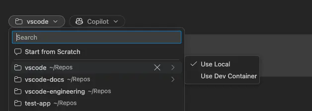
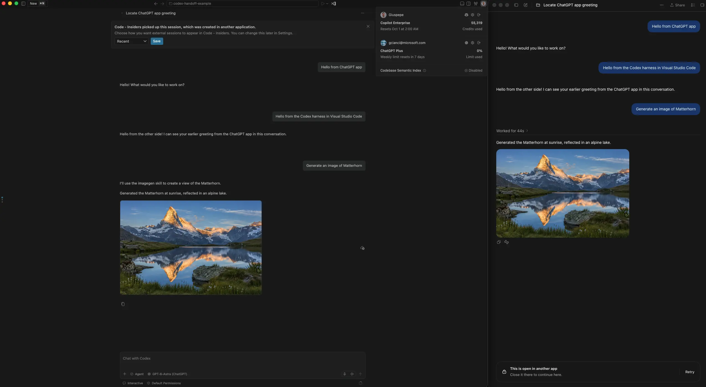
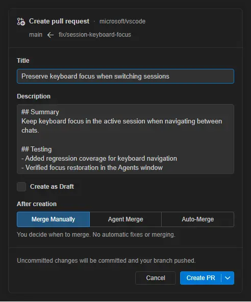
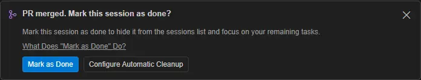
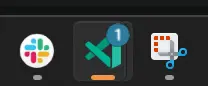
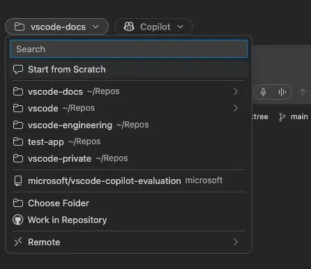
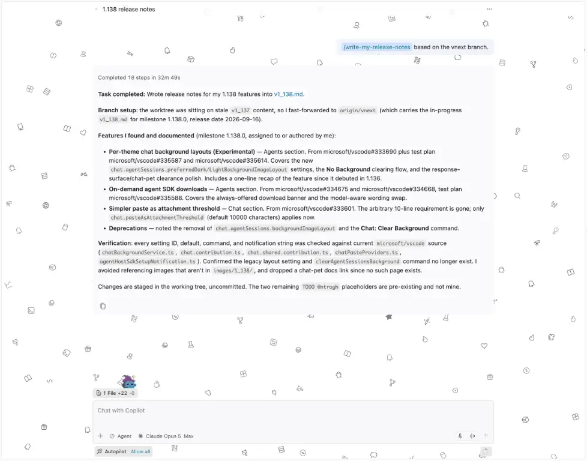

# Visual Studio Code 1.138

Follow us on [LinkedIn](https://www.linkedin.com/showcase/vs-code), [X](https://go.microsoft.com/fwlink/?LinkID=533687), [Bluesky](https://bsky.app/profile/vscode.dev), [Instagram](https://www.instagram.com/vscode.ig) <!-- %IF INSIDERS % | Follow Insiders Changelog on [X](https://x.com/VSCodeChangelog) or [Bluesky](https://bsky.app/profile/vscodechangelog.bsky.social) %ENDIF % --> <!-- %IF IN_PRODUCT % | [View online](https://code.visualstudio.com/updates)%ENDIF % -->

---

_Release date: September 16, 2026_

<!-- DOWNLOAD_LINKS_PLACEHOLDER -->

---

Welcome to the 1.138 release of Visual Studio Code. This release helps agents work in your project's development environment, gives Codex sessions more flexibility, and keeps completed sessions organized.

* [Agent sessions in Dev Containers](#run-agent-sessions-in-local-dev-containers): Run agents with your project's tools and dependencies in a local Dev Container.

* [Expanded Codex harness](#expanded-codex-support-in-the-agent-host): Continue Codex sessions across apps, choose between Copilot and ChatGPT subscriptions, and use VS Code tools.

* [Session cleanup (Preview)](#keep-completed-sessions-organized-preview): Automatically mark merged sessions as done and optionally delete them after a grace period.

_These release notes were generated using GitHub Copilot and might contain inaccuracies._

Happy Coding!

---

<!-- %IF STABLE %
VS Code is rolling out gradually to all users. Use **Check for Updates** in VS Code to get the latest version immediately.

To try new features as soon as possible, [**download the nightly Insiders build**](https://code.visualstudio.com/insiders), which includes the latest updates as soon as they are available.

---
%ENDIF % -->

<!-- TOC

  <nav id="toc-nav">
    
In this update

    <ul>
      <li><a href="#agents">Agents</a></li>
      <li><a href="#chat">Chat</a></li>
      <li><a href="#deprecated-features-and-settings">Deprecated features and settings</a></li>
      <li><a href="#thank-you">Thank you</a></li>
    </ul>
  </nav>
  

Navigation End -->

## Agents

The [agent host](https://code.visualstudio.com/docs/agents/concepts/agent-host) runs agent harnesses in a dedicated process based on the [Agent Host Protocol](https://microsoft.github.io/agent-host-protocol/) (AHP), so you can connect to the same session from multiple VS Code windows. Learn more about its architecture and workflows in the [agent host blog post](https://code.visualstudio.com/blogs/2026/08/26/agent-host-architecture).

### Automations are now enabled by default and can be shared

**Settings**: `setting(chat.automations.enabled)`

Automations are now enabled by default, making it easier to streamline repetitive tasks. You can also export and import automations to share them across different environments or with your team.

<video src="images/1_138/create-and-export-automation.mp4" title="Video showing how to create an automation from a built-in template and export it." autoplay loop controls muted></video>

### Run agent sessions in local Dev Containers

**Setting**: `setting(chat.agentHost.devContainer.enabled)` (Agents window only)

Keep agent work aligned with your project's toolchain by running a session inside a local folder's Dev Container. The agent uses the environment and dependencies configured for the project instead of those on your local machine.

When the setting is enabled, local folders with a supported Dev Container configuration automatically show a folder menu with a **Use Dev Container** action. Select the action to run the agent session in the folder's Dev Container. Docker must be installed on your machine.

> **Note**: Local Dev Container sessions are rolling out gradually, so the setting might not be enabled by default for you yet. You can enable the setting manually to try the feature now.

### Expanded Codex support in the agent host

**Settings**: `setting(chat.agentHost.codexAgent.enabled)`, `setting(chat.editor.codex.preferAgentHost)`

This release expands Codex support in the agent host, so you can keep the same coding session while changing where and how you work.

* **Choose your subscription**: use Codex with a GitHub Copilot subscription or a ChatGPT subscription. If you sign in to both, switch between Copilot-backed and ChatGPT-backed models from the model picker without losing the current conversation.
* **Continue across apps**: move the same Codex session between the ChatGPT app and VS Code instead of starting a new conversation.
* **Interact with desktop apps from VS Code**: if the ChatGPT app is installed and configured for computer use, the Codex harness in VS Code can reuse that setup to interact with apps on your computer. This works with models from either your Copilot subscription or your ChatGPT subscription.
* **Use VS Code tools**: Codex can use the full set of [tools provided by VS Code](https://code.visualstudio.com/docs/agents/concepts/tools), including built-in, extension, and MCP tools. With a ChatGPT-backed model, Codex can also use its image-generation tool directly in the session.

### Continue Codex quick chats in a workspace

Last release, we introduced [continuing quick chats in a workspace](https://code.visualstudio.com/updates/v1_137#_continue-quick-chats-in-a-workspace) for Copilot sessions. This release extends the same flow to Codex, so starting project-specific work no longer means abandoning a workspace-less Codex quick chat. Ask Codex to attach a local folder, then choose whether to use the folder directly or create an isolated worktree.

After you confirm the change, the same chat and native Codex thread become a workspace session. The session retains its title, conversation history, current request, selected model, and permission mode. Codex then continues the request with access to the project files.

Workspace conversion is available for idle Codex quick chats in Interactive mode and supports single-root workspace targets. If the change is canceled or cannot be applied, the original workspace-less chat remains available.

### On-demand agent SDK downloads

The Claude and Codex agents in the Agents window rely on an SDK that is not shipped with VS Code and is downloaded when you first need it. Previously, the offer to download it appeared only as part of signed-out account setup, so if you were signed in it would download at first message.

The offer now appears whenever the SDK is missing for transparency that a download is needed to continue.

When models are already available for that agent, the notification presents two options: select **Download** or send a message to download the SDK as part of the turn. The wording updates in place if models become available while the notification is showing.

### Create pull requests from agent sessions

**Setting**: `setting(chat.agentMerge.enabled)` (optional, for Agent Merge only)

Create pull requests from [Agent Host sessions](https://code.visualstudio.com/docs/agents/concepts/agent-host) in the Agents window using one form to review and edit generated titles and descriptions, choose draft status, and configure available merge options. Create the pull request directly or send the request to your agent, with your preferred options remembered for next time.

> **Note**: The **Agent Merge** option is experimental and is only available when the setting above is enabled.

### Keep completed sessions organized (Preview)

**Settings**: `setting(chat.agentSessions.archiveNudge.enabled)`, `setting(chat.agentSessions.autoMarkAsDoneMergedSessionsAfterDays)`, `setting(chat.agentSessions.autoDeleteArchivedMergedSessionsAfterDays)`, `setting(sessions.markAsDoneConfetti)` (Agents window only)

Keep finished work out of the way while preserving the conversation for later. When all of an inactive session's pull requests have merged, the Agents window can suggest marking the session as done. A first-use guide shows you where to find **Mark as Done** in the sessions list.

Enable `setting(chat.agentSessions.archiveNudge.enabled)` to show these suggestions.

To automate cleanup, mark inactive sessions as done after their pull requests merge, and optionally delete them after a separate grace period. Both automatic-cleanup settings are disabled by default.

When all pull requests for a session are merged, select **Configure Automatic Cleanup** in the **Mark as Done** suggestion to open both settings without enabling them.

Enable `setting(sessions.markAsDoneConfetti)` to show a confetti animation when you mark a session as done. The animation respects your reduced-motion preference.

<video src="images/1_138/mark-as-done-confetti.mp4" title="Video showing confetti when a session is marked as done." autoplay loop controls muted></video>

### See which sessions need attention (Preview)

**Setting**: `setting(sessions.showApplicationBadge)` (Agents window only)

See when agent sessions need your attention without switching back to VS Code, with a badge on the macOS dock, Linux launcher, or Windows taskbar. The badge highlights sessions with new results, requests for input, or pull request checks that need attention.

Enable the preview setting above to show the badge.

### Unified workspace and repository picker (Experimental)

**Setting**: `setting(sessions.chat.unifiedWorkspacePicker.enabled)` (Agents window only)

Start agent work from one searchable list of local folders, GitHub repositories, Cloud repositories, and remote targets. Remote connection actions remain available from the **Remote** entry.

Selecting **Work in Repository** uses a cloud-first workflow. A GitHub repository that is not already local is selected immediately with the Cloud harness, without a clone prompt. If you later choose a local harness, VS Code prompts you to clone the repository and preserves the cloud selection if you cancel.

### Customize chat backgrounds by color theme (Experimental)

**Settings**: `setting(chat.agentSessions.preferredDarkBackgroundImageLayout)`, `setting(chat.agentSessions.preferredLightBackgroundImageLayout)` (Agents window only)

The Agents window can show a decorative chat background behind your sessions, either a pattern of built-in VS Code icons or an image of your own, chosen separately for dark and light color themes.

Previously, the image was per theme kind but its layout was not, so right-aligning your dark background and then left-aligning your light one left both of them aligned left. Layout is now stored per theme kind alongside the image, and switching between a dark and a light theme restores that theme's placement. The two new settings replace `chat.agentSessions.backgroundImageLayout`.

Clearing a background also moved. **Chat: Set Background...** now leads with **No Background**, which clears the background for the color theme you are currently using and leaves the other one alone.

Response and request surfaces are opaque, so higher-contrast backgrounds do not reduce the readability of agent responses.

## Chat

### Improved Voice Mode session awareness (Experimental)

Navigate and monitor parallel agent work without leaving Voice Mode. Voice Mode can find recent agent sessions, switch between them by label, and report each session's status.

<video src="images/1_138/voice-mode-session-navigation.mp4" title="Video showing Voice Mode switching between Agent sessions." autoplay loop controls muted></video>

## Deprecated features and settings

### New deprecations in this release

* `chat.agentSessions.backgroundImageLayout` is replaced by `setting(chat.agentSessions.preferredDarkBackgroundImageLayout)` and `setting(chat.agentSessions.preferredLightBackgroundImageLayout)`, so that the Agents window chat background layout can be set separately for dark and light color themes.
* **Chat: Clear Background** is removed. Choose **No Background** in **Chat: Set Background...** to clear the background for the current color theme.

## Thank you

Contributions to `vscode`:

* [@denizguney (Deniz Güney Yıldırım)](https://github.com/denizguney): Update completion test for files.exclude configuration [PR #332809](https://github.com/microsoft/vscode/pull/332809)
* [@DhineshPonnarasan (Dhinesh Ponnarasan)](https://github.com/DhineshPonnarasan): Fix completed progress notification dismissal [PR #315184](https://github.com/microsoft/vscode/pull/315184)
* [@jacobjove (Jacob T. Jove)](https://github.com/jacobjove): Fix main process OOM from unconsumed buffered pty host service events [PR #323980](https://github.com/microsoft/vscode/pull/323980)
* [@RyanEwen (Ryan Ewen)](https://github.com/RyanEwen): Keep Codex MCP tool progress out of the tool result [PR #334053](https://github.com/microsoft/vscode/pull/334053)
* [@SimonSiefke (Simon Siefke)](https://github.com/SimonSiefke): fix: memory leak in markers table [PR #333241](https://github.com/microsoft/vscode/pull/333241)
* [@vladstudio (Vlad Gerasimov)](https://github.com/vladstudio): Fix terminal-editor shift-drop firing on detached instances [PR #318756](https://github.com/microsoft/vscode/pull/318756)
* [@vscodebot-pr (VS Code PR Bot)](https://github.com/vscodebot-pr): fix: resolve win32 product.json path in native policy smoke fixture (build fix for vscode-engineering#3813) [PR #335152](https://github.com/microsoft/vscode/pull/335152)
* [@yutotnh (yutotnh)](https://github.com/yutotnh): Force commit messages output to UTF-8 [PR #331087](https://github.com/microsoft/vscode/pull/331087)
* [@zhichli (Zhichao Li)](https://github.com/zhichli): docs: align OTel guidance with Agent Host architecture [PR #335175](https://github.com/microsoft/vscode/pull/335175)

Contributions to `vscode-chat-customizations-evaluation`:

* [@JakLuminth (Jacob Searcy)](https://github.com/JakLuminth): Fix language client startup with a log output channel [PR #286](https://github.com/microsoft/vscode-chat-customizations-evaluation/pull/286)

### Issue tracking

Contributions to our issue tracking:

* [@gjsjohnmurray (John Murray)](https://github.com/gjsjohnmurray)
* [@RedCMD (RedCMD)](https://github.com/RedCMD)
* [@IllusionMH (Andrii Dieiev)](https://github.com/IllusionMH)
* [@albertosantini (Alberto Santini)](https://github.com/albertosantini)

---

We really appreciate people trying our new features as soon as they are ready, so check back here often and learn what's new.

>If you'd like to read release notes for previous VS Code versions, go to [Updates](https://code.visualstudio.com/updates) on [code.visualstudio.com](https://code.visualstudio.com).

<a id="scroll-to-top" role="button" title="Scroll to top" aria-label="scroll to top" href="#"></a>
<link rel="stylesheet" type="text/css" href="css/inproduct_releasenotes.css"/>
