# June 2017 (version 1.14)

**Update 1.14.1**: The update addresses these [issues](https://github.com/Microsoft/vscode/milestone/47?closed=1).

* The refactoring to convert a JavaScript ES5-style function class to an ES6 class is disabled.

**Update 1.14.2**: This update addresses these [issues](https://github.com/Microsoft/vscode/milestone/49?closed=1).

Downloads: [Windows](https://vscode-update.azurewebsites.net/1.14.2/win32/stable) | [Mac](https://vscode-update.azurewebsites.net/1.14.2/darwin/stable) | Linux 64-bit: [.tar.gz](https://vscode-update.azurewebsites.net/1.14.2/linux-x64/stable) [.deb](https://vscode-update.azurewebsites.net/1.14.2/linux-deb-x64/stable) [.rpm](https://vscode-update.azurewebsites.net/1.14.2/linux-rpm-x64/stable) | Linux 32-bit: [.tar.gz](https://vscode-update.azurewebsites.net/1.14.2/linux-ia32/stable) [.deb](https://vscode-update.azurewebsites.net/1.14.2/linux-deb-ia32/stable) [.rpm](https://vscode-update.azurewebsites.net/1.14.2/linux-rpm-ia32/stable)

---

Welcome to the June 2017 release of Visual Studio Code. There are a number of significant updates in this version that we hope you will like, some of the key highlights include:

* **[Integrated Terminal improvements](#integrated-terminal)** - Find support, select/copy multiple pages.
* **[Command Palette MRU list](#command-palette-improvements)** - Quickly find and run your recently used commands.
* **[New Tasks menu](#tasks)** - Top-level **Tasks** menu for running builds and configuring the task runner.
* **[Automatic indentation](#auto-indent-on-type-move-lines-and-paste)** - Auto indent while typing, moving, and pasting source code.
* **[Emmet abbreviation enhancements](#emmet-abbreviation-improvements)** - Add Emmet to any language. Multi-cursor support.
* **[New Diff review pane](#diff-editor-review-pane)** - Navigate Diff editor changes quickly with `F7`, displayed in patch format.
* **[Angular debugging recipe](#recipe-for-angular-debugging)** - Debug your Angular client in VS Code.
* **[Better screen reader support](#lists-and-quick-pick-leverage-aria-properties)** - Aria properties to better present list and drop-down items.
* **[Preview: 64-bit Windows build](#windows-64-bit-insiders)** - Try out the Windows 64-bit version (Insiders build).
* **[Preview: Multi-root workspaces](#preview-multi-root-workspaces)** - Open multiple projects in the same editor (Insiders build).

>If you'd like to read these release notes online, you can go to [Updates](https://code.visualstudio.com/updates) on [code.visualstudio.com](https://code.visualstudio.com).

The release notes are arranged in the following sections related to VS Code focus areas. Here are some further updates:

* **[Workbench](#workbench)** - Restore loose files, quickly switch running windows (instances).
* **[Languages](#languages)** - TypeScript 2.4, more relevant suggestions in JavaScript files.
* **[Debugging](#debugging)** - Simplifications for Node.js debug configurations.
* **[Tasks](#tasks)** - Auto-detect and customize npm scripts and TypeScript compiler to run in VS Code.
* **[Extension Authoring](#extension-authoring)** - SVG rendering constraints, custom views visibility, new Debug API.

**Insiders:** Want to see new features as soon as possible? You can download the nightly Insiders [build](https://code.visualstudio.com/insiders) and try the latest updates as soon as they are available.

## Workbench

### Lighter update experience

We're working on toning down the update experience. The consensus was that the popup message to update VS Code was disruptive and we are experimenting with other UI affordances. This month, you'll notice a little indicator in the bottom-left corner of the workbench when an update is available:

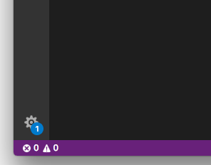

Clicking on this indicator will let you apply the update as well as access other global actions (**Command Palette**, **Settings**).

Don't worry about losing sight of this notification. macOS users will have the update automatically applied as soon as they restart VS Code, and Windows and Linux users will get the old pop-up message if they don't accept the notification after a few days.

### Command Palette improvements

We improved the **Command Palette** drop-down (`kb(workbench.action.showCommands)`) to make it more useful.

One popular request was to always restore the last typed input when reopening the **Command Palette**. Enable this behavior with the new setting `workbench.commandPalette.preserveInput`.

We also added a most recently used (MRU) list of commands that is persisted between restarts. The most recent commands executed will always show to the top. A new setting `workbench.commandPalette.history` allows you to control the number of entries to show (set it to 0 to disable this feature). With the MRU enabled, you do not need to enable `workbench.commandPalette.preserveInput` because the history will always have the last executed command selected by default when you open the **Command Palette**.

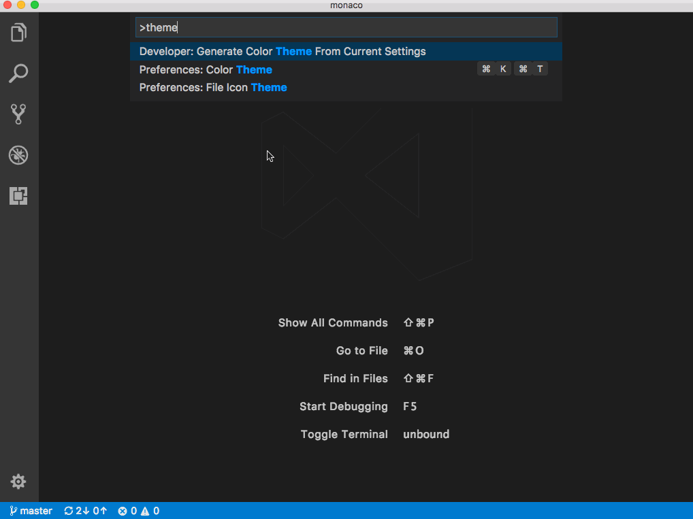

A new command **Clear Commands History** was added to quickly dismiss all the entries from the commands history.

Finally, keyboard shortcuts in the drop-down are presented in the same visual form as in the **Keyboard Shortcuts** editor.

### Restore empty workspaces

In VS Code, you can work with workspaces that have folders opened as well as empty workspaces. An empty workspace is not opened to a specific folder but can show files from disk. Up to now, we would never restore the UI state of empty workspaces and you would lose your carefully selected layout of opened files (even on window reload).

With this release, we will restore the UI state for empty workspaces in the same way we do for workspaces with opened folders.

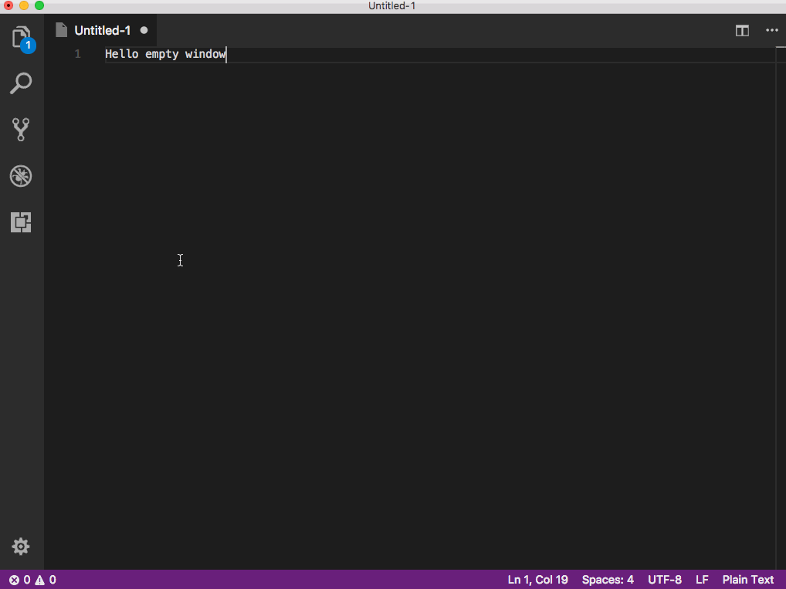

A new setting `window.restoreWindows` configures this behavior. The possible values are:

* `none` - Never restore any workspaces
* `one` - Restore the last active workspace (default)
* `folders` - Only restore opened folders
* `all` - Restore all workspaces.

With the new setting `window.restoreWindows`, we deprecated the previous setting `window.reopenFolders` and ask you to switch to the new setting. We will still support the old setting for a couple of releases.

### Close unmodified files

A new command was introduced to close unmodified editors of the currently active editor group. This makes it easy to quickly dismiss tabs of editors that are not dirty (no unsaved changes). The action can be triggered not only via a keybinding (`kb(workbench.action.closeUnmodifiedEditors)`) but also from the context menus of the tabs (headers) as well as the **OPEN EDITORS** view in the Explorer.

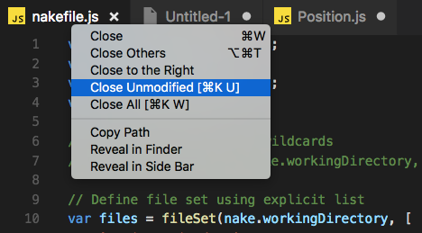

Thanks to [Soney Mathew (@soneymathew)](https://github.com/soneymathew) for providing the pull request for this feature!

### Switch window improvements

In a previous release, we added a quick picker for switching between the opened windows (via the `workbench.action.switchWindow` command). In this release, we did some tweaks to make the experience better.

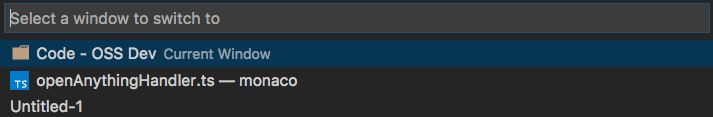

You will now see icons for the currently active file or folder in the window, provided that you have enabled one of the File Icon themes.

In addition, a new command `workbench.action.quickSwitchWindow` was added to quickly switch between opened windows. Press and hold the modifier key to cycle through the list of windows and release all keys to open it.

As an example, to use this feature with the `Ctrl+R` keyboard shortcut, configure the following rule in the keybindings editor:

```json
{
    "key": "ctrl+r",
    "command": "workbench.action.quickSwitchWindow"
},
{
    "key": "ctrl+r",
    "command": "workbench.action.quickOpenNavigateNext",
    "when": "inWindowsPicker"
}
```

Press `Ctrl+R` and leave the `Ctrl` key pressed. As long as you now press the `R` key, you can navigate through the list of windows. Release all keys to focus it.

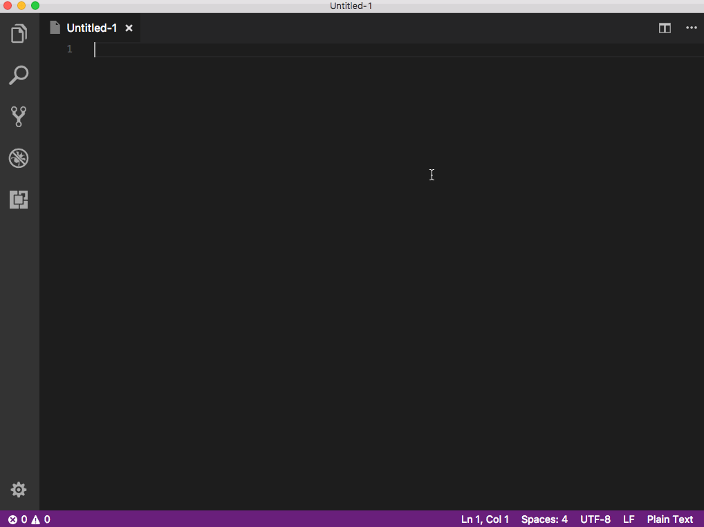

### New keybindings context per quick picker

Related to the improvements around the window picker, it is now easier and better to configure a picker with quick-pick functionality. Each time a picker opens, a specific keybinding context becomes active that you can use to assign keybindings to. For example, the window picker enables a context key `inWindowsPicker` when opened. Not only does it make quick navigate in pickers more powerful, it also fixes some annoying bugs. You can now bring up any quick picker, even if the quick picker is already showing (for example, opening the **Quick Open** file picker while the **Command Palette** is already open).

The following example demonstrates how to configure quick navigate keybindings to switch between the most recently opened folders:

As an example, to use this feature with the `Ctr+J` keyboard shortcut, configure the following rule in the keybindings editor:

```json
{
    "key": "ctrl+j",
    "command": "workbench.action.quickOpenRecent"
},
{
    "key": "ctrl+j",
    "command": "workbench.action.quickOpenNavigateNext",
    "when": "inRecentFilesPicker"
}
```

Press `Ctrl+J` and leave the `Ctrl` key pressed. As long as you now press the `J` key, you can navigate through the list of recently opened folders and files. Release all keys to open it.

### Extensions Installed / Recommended sections

To make recommended extensions more visible, **Extensions** view now shows **INSTALLED** and **RECOMMENDED** extensions in two sections.

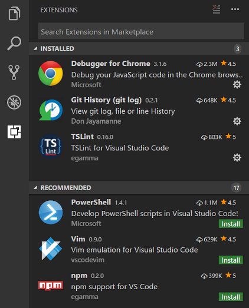

### Lists and quick pick leverage aria properties

Lists such as the suggestion widget, exception list and the **Quick Open** drop-down now set `aria-setsize` and `aria-posinset`. These lists are virtualized and so without these [aria](http://www.w3.org/TR/wai-aria/) properties, screen readers could not correctly determine the number of entries.

## Integrated Terminal

### Selection re-implemented

The way selection works in the Integrated Terminal has been completely re-implemented by moving away from regular web selection to a model where it's managed and rendered by the terminal itself. This fixes [a lot of issues](https://github.com/sourcelair/xterm.js/pull/670) and here are the major call outs:

- You can now select and copy text from more than one page of the terminal.
- There is a new **Select All** command.
- Copying wrapped lines will no longer add line breaks where they wrap.


- Double click word selection is improved, it will now select URLs and paths, rather than just fragments

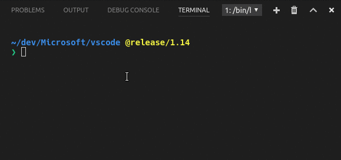

- Selection in `tmux` with mouse mode on should now work correctly

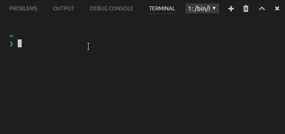

### Find in the terminal

The Integrated Terminal now has basic find functionality which can be triggered with `kb(workbench.action.terminal.focusFindWidget)`.

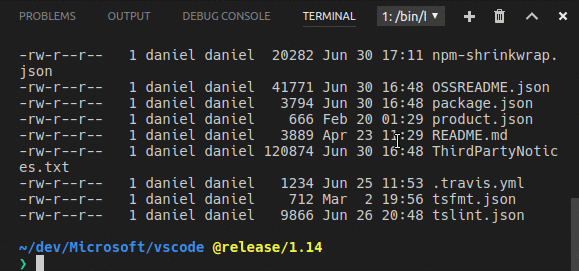

If you want `Ctrl+F` to go to the shell instead of launching the Find widget on Linux and Windows, you will need to remove the keybinding like so:

```js
{ "key": "ctrl+f", "command": "-workbench.action.terminal.focusFindWidget",
                      "when": "terminalFocus" },
```

### Rename terminal sessions

Integrated Terminal sessions can now be renamed using the `workbench.action.terminal.rename` command. The new name will be displayed in the terminal selection drop-down.

## Git

### Pull from specific remote

Thanks to [@BugraC](https://github.com/BugraC), [@matthewshirley](https://github.com/matthewshirley), [@Krzysztof-Cieslak](https://github.com/Krzysztof-Cieslak), it's now possible to pull changes from a specific branch in a remote repository with the **Pull from...** command.

### Manage your .gitignore file

[@BugraC](https://github.com/BugraC) also provided a change so that you can now add files to your `.gitignore` right from the context menu of the Source Control view or via the global **Git: Add File to .gitignore** command.

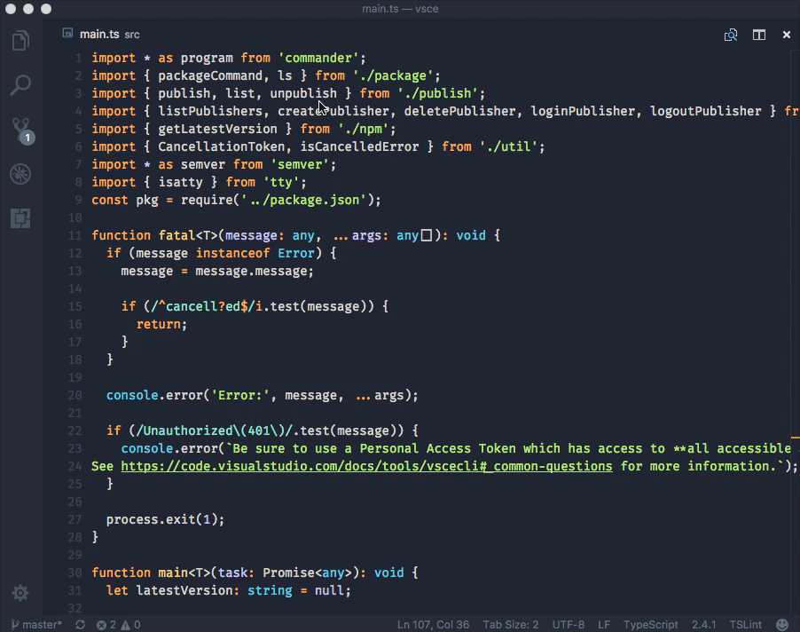

## Tasks

To make tasks more convenient to use, we added a **Tasks** menu to the top-level menu bar:

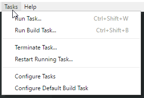

The **Tasks** menu offers a new action **Configure Default Build Task** which when used with the `0.1.0` version of a `tasks.json` file, just opens the `tasks.json` file. The full power of the **Tasks** menu comes when using it with the `2.0.0` version of the `tasks.json`, which is now the default if no `tasks.json` file is present.

Many cool features come with the new task format:

* The `Run Task` command now shows most recently used tasks first, then custom defined tasks, and last, auto-detected tasks.
* Tasks are executed in the Integrated Terminal. This improves output encoding, brings full support for ANSI control sequences (for example, colors), and supports providing input to a task.
* Task auto-detection for TypeScript, Gulp, Jake, Grunt and npm:

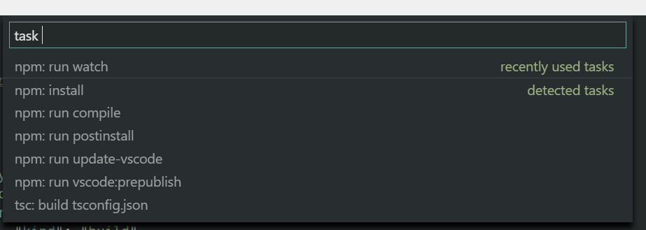

* We are working with extension providers to add dotnet, Maven and others in the future.

*  As you can see from the image above, auto-detected tasks are prefixed with the type of task ('npm:', 'gulp:', 'grunt:', 'tsc:', or 'jake:'). If you are referencing an auto-detected task in another file, for example as a `preLaunchTask` in `launch.json`, you will need to update that task reference with the prefix. Assuming you have the following `launch.json` and the "build" task comes from a gulp file,

```json
{
    "version": "0.1.0",
    "configurations": [
        {
            ...
            "preLaunchTask": "build"
        }
    ]
}
```

you now need to change this to:

```json
{
    "version": "0.1.0",
    "configurations": [
        {
            ...
            "preLaunchTask": "gulp: build"
        }
    ]
}
```

* Guided problem matcher selection when executing a task without one:

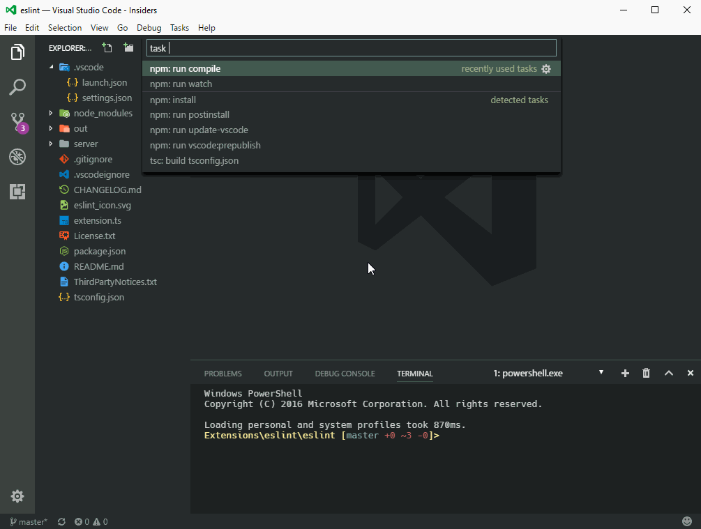

* Guided default build task selection. Simple run `Configure Default Build Task` from the global menu bar.
* And of course you can still define your own custom tasks in the `tasks.json` file with full control over how they are executed in the terminal. For example, the tasks below executes a test script in the terminal and uses a new terminal for every test run:

  ```json
  {
    "version": "2.0.0",
    "tasks": [
        {
            "taskName": "Run tests",
            "type": "shell",
            "command": "./scripts/test.sh",
            "windows": {
                "command": ".\\scripts\\test.bat"
            },
            "group": "test",
            "presentation": {
                "reveal": "always",
                "panel": "new"
            }
        }
    ]
  }
  ```

Consult the [tasks documentation](https://code.visualstudio.com/docs/editor/tasks) for a detailed list of new features and how to use them as well as instructions on how to best convert a `0.1.0` version `tasks.json` file to a `2.0.0`.

Since we are now auto detecting all Gulp, Grunt, Jake and npm tasks available in a workspace you need to qualify the task name with the task runner when referencing it from a launch.json file. Assuming you have the following launch.json
```json
{
    "version": "0.1.0",
    "configurations": [
        {
            ...
            "preLaunchTask": "build"
        }
    ]
}
```
and the `"build"` task comes from a gulp file you now need to change this to:
```json
{
    "version": "0.1.0",
    "configurations": [
        {
            ...
            "preLaunchTask": "gulp: build"
        }
    ]
}
```
If you are unsure how the task name looks like execute **Run Task...** from the global **Tasks** menu and use the label presented in the list of tasks.

We also released the tasks API. If you want to provide task detection for your programming language, you should have a look at the [API](https://github.com/Microsoft/vscode/blob/master/src/vs/vscode.d.ts#L4790-L4791) and at one of the VS Code task detection extensions like [npm scripts autodetect](https://github.com/Microsoft/vscode/blob/master/extensions/npm/src/main.ts).

## Debugging

### Recipe for Angular debugging

Setting up Node.js debugging can be challenging for some non-standard or complex scenarios. In May, we started to collect recipes for these scenarios in a [recipe repository](https://github.com/Microsoft/vscode-recipes).

This release adds a new recipe by [Tony Sneed (@tonysneed)](https://github.com/tonysneed) for [Chrome Debugging with Angular CLI](https://github.com/Microsoft/vscode-recipes/blob/master/Angular-CLI).

### Debug hover has scroll bar for long values

Thanks to a community [pull request](https://github.com/Microsoft/vscode/pull/23211), a debug hover now displays long string values using a scroll bar.

## Node Debugging

### Windows executables are found even if no extension is specified

On Windows, it was previously necessary to include the correct file extension in the `runtimeExecutable` path, leading to complicated cross platform configurations:

```json
    "runtimeExecutable": "${workspaceRoot}/node_modules/.bin/nodemon",
    "windows": {
        "runtimeExecutable": "${workspaceRoot}/node_modules/.bin/nodemon.cmd"
    }
```

With this release, it is no longer necessary to include the file extension which makes the path portable across all platforms:

```json
    "runtimeExecutable": "${workspaceRoot}/node_modules/.bin/nodemon"
```

### Simplified setup for "Restart debug session"

VS Code Node.js debugging always supported restarting a debugging session automatically. This is useful if you use a file watching tool like **nodemon** to restart Node.js on file changes. Setting the launch configuration attribute `restart` to true makes the node debugger automatically try to re-attach to the Node.js runtime after Node.js has terminated. See the [Node.js Debugging](https://code.visualstudio.com/docs/nodejs/nodejs-debugging#_restarting-debug-sessions-automatically-when-source-is-edited) documentation for details.

In this release, we have simplified this feature by eliminating the need to set the debug flags and the port attribute explicitly. Depending on the protocol ("legacy" or "inspector"), VS Code will pass the correct `--debug`, `--debug-brk`, `--inspect`, `--inspect-brk` argument and a random port to the program specified as the `runtimeExecutable` and this port will be used for subsequent _restarted_ sessions.

With this feature, the debug configuration for globally installed **nodemon** simplifies to:

```json
{
    "name": "Launch server.js via nodemon",
    "type": "node",
    "request": "launch",
    "runtimeExecutable": "nodemon",
    "program": "${workspaceRoot}/server.js",
    "restart": true,
    "console": "integratedTerminal"
}
```

### "Attach by process ID" support for all Node.js versions

VS Code Node.js debugging always supported debugging a Node.js process even if it was not launched in debug mode. For this, the debug configuration of type "attach" has to specify a `processId` attribute. With this release, we support this feature for all versions of Node.js (and not only for versions < 8.0 as before).

### Node.js v8.0 related changes

Different versions of Node.js support different debugging protocols. The VS Code Node.js debugger tries to determine automatically which protocol to use. If this is not possible, it defaults to the "legacy" protocol which is supported by all Node.js versions < 8.0. For details, see the [Node.js Debugging documentation](https://code.visualstudio.com/docs/nodejs/nodejs-debugging#_supported-nodelike-runtimes). Since the adoption of Node.js v8.x is steadily increasing, we are in the process of changing the default protocol for specific scenarios from "legacy" to "inspector".

In this release, Node.js debugging will assume the "inspector" protocol whenever the `runtimeExecutable` attribute of a launch configuration is set. If you see your debug configurations failing, this change could be the reason. To fix this, you can either upgrade Node.js to version 8.x or you can explicitly force the use of the "legacy" protocol by adding `"protocol": "legacy"` to your launch configuration.

## Languages

### TypeScript 2.4

VS Code now ships with [TypeScript 2.4.1](https://blogs.msdn.microsoft.com/typescript/2017/06/27/announcing-typescript-2-4/). This release includes a number of new language features, bug fixes, and editor improvements. Some highlights include:

**Dynamic Import Expressions**

Support for the new ECMAScript `import` expression for lazily loading modules:

```ts
async function getZipFile(name: string, files: File[]): Promise<File> {
    const zipUtil = await import('./utils/create-zip-file');
    const zipContents = await zipUtil.getContentAsBlob(files);
    return new File(zipContents, name);
}
```

**Parent method suggestions in subclasses**

IntelliSense now displays interface and parent methods class methods in subclasses:

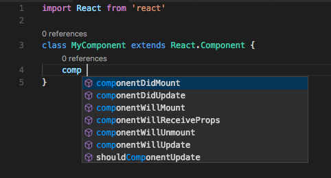

This is helpful for overriding parent methods or implementing interfaces.

**More relevant suggestions in JavaScript files**

In VS Code 1.13, suggestions in JavaScript files include suggestions for types:

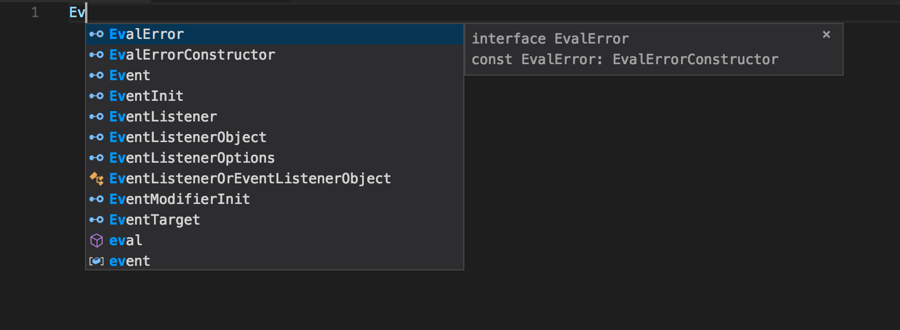

This meant that many suggestions that are generally not useful in JavaScript were shown, such as `EvalErrorConstructor` or `EventInit`.

VS Code 1.14 better filters JavaScript suggestions to only include those you typically care about while working in plain old JavaScript:

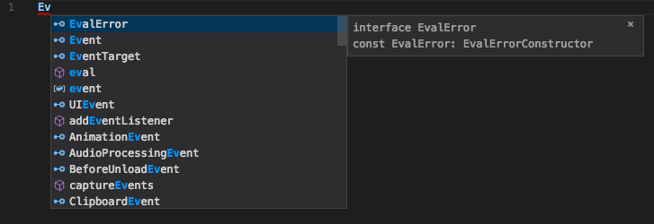

### Simpler building TypeScript using Tasks

You can now build TypeScript projects using `kb(workbench.action.tasks.build)` without having to configure a `tasks.json` file, all you need is a `tsconfig.json` file:

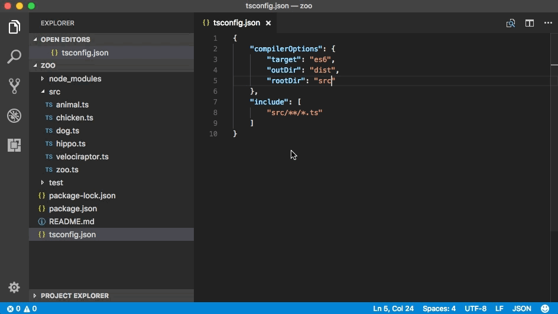

TypeScript will pick up all `tsconfig.json` projects in your workspace for building.

### Formatting option for spaces after TypeScript type assertions

The new `typescript.format.insertSpaceAfterTypeAssertion` setting allows you to control the placement of spaces after a type assertion in TypeScript.

```ts
// Default formatting
<Foo>{ abc: 123, ... };

// With "typescript.format.insertSpaceAfterTypeAssertion":true
<Foo> { abc: 123, ... };
```

### Refactoring support for JavaScript and TypeScript

>**Note:** Due to performance issues in some scenarios, this refactoring is disabled in 1.14.1.

VS Code 1.14 includes initial support for refactoring JavaScript and TypeScript code. The first supported refactoring converts a JavaScript ES5-style function class to an ES6 class:

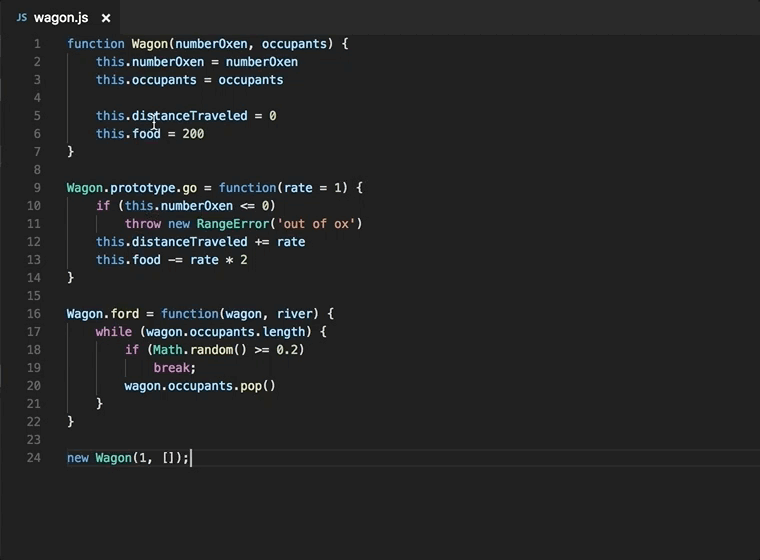

We plan to add additional refactorings in the future.

### Control handling of line breaks in the Markdown preview

The new `markdown.preview.breaks` setting controls the rendering of line breaks in Markdown preview. By default, single line breaks in Markdown paragraphs are ignored. For example in the Markdown below:

```markdown
# Hello world

This is the first sentence.
This is the second sentence.

This is the third sentence.
```

The Markdown preview would show:

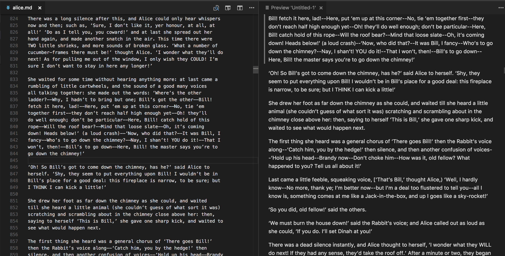

When `"markdown.preview.breaks": true` is set, all new lines in paragraphs are converted into `<br>` tags in the output HTML:

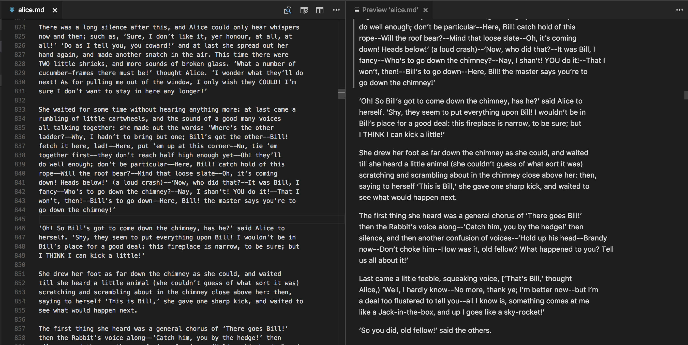

## Editor

### Emmet abbreviation improvements

In the previous release, we introduced a new model for Emmet features which you can enable by setting `emmet.useNewEmmet` to `true`. Below are the improvements to this new model in the current release:

**Multi cursor support in Emmet**

Try out the multi cursor support for many of the Emmet commands after setting `emmet.useNewEmmet` to `true` and don't forget to log issues if you find anything not working as expected.

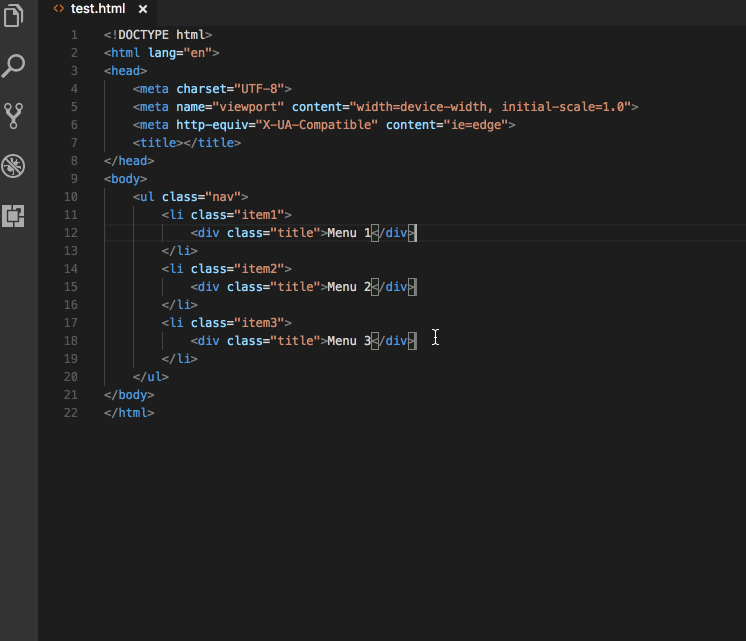

**Emmet customizations in the new Emmet model**

The new Emmet model supports the following Emmet settings:

* `emmet.includeLanguages`

    Add **Emmet: Expand Abbreviation** and **Emmet: Wrap with Abbreviation** support to the language of your choice by providing a mapping to an existing Emmet supported language. The new language goes on the left and the Emmet supported language on the right. Use language ids for both sides of the mapping.
    For example:
    ```json
    "emmet.includeLanguages": {
        "javascript": "javascriptreact",
        "vue-html": "html",
        "plaintext": "jade"
    }
    ```

* `emmet.excludeLanguages`

    If there is any language where you do not want to see Emmet expansions, add it in this setting which takes an array of language id strings.

* `emmet.syntaxProfiles`

    See [Emmet Customization of output profile](https://docs.emmet.io/customization/syntax-profiles/#create-your-own-profile) to learn how you can customize the output of your HTML abbreviations.
    For example:
    ```json
    "emmet.syntaxProfiles": {
        "html": {
            "attr_quotes": "single"
        },
        "jsx": {
            "self_closing_tag": true
        }
    }
    ```

* `emmet.variables`

    Customize variables used by Emmet snippets.
    For example:
    ```json
    "emmet.variables": {
        "lang": "de",
        "charset": "UTF-16"
    }
    ```

* `emmet.showExpandedAbbreviation`

    Controls the Emmet suggestions that show up in the suggestion/completion list.

    * `never` - Never show Emmet abbreviations in the suggestion list for any language.
    * `inMarkupAndStylesheetFilesOnly` - Emmet abbreviations in the suggestion list for languages that are markup and stylesheet based ('html','pug','slim','haml','xml','xsl','css','scss','sass','less','stylus') (default).
    * `always` - Emmet abbreviations in the suggestion list in languages that are markup and stylesheet based as well as `javascriptreact`, `typescriptreact` and any other language that has been mapped in the new setting `emmet.includeLanguages`.

    **Note:** In the `always` mode, the new Emmet implementation is not context aware. For example, if you are editing a JavaScript React file, you will get Emmet suggestions not only when writing markup but also while writing JavaScript.

**Enable language extensions to provide Emmet suggestions**

To get around the issue of having Emmet suggestions show up in the non-markup and non-stylesheet sections of your source code, we have pulled out the Emmet completion provider to a module of its own. This enables language extensions to use the npm module [vscode-emmet-helper](https://www.npmjs.com/package/vscode-emmet-helper) and provide Emmet suggestions in the right context as they are more aware of the language structure than the Emmet extension.

### Auto indent on type, move lines and paste

With this release, you can have auto indentation adjustment while typing, moving lines and pasting content in TypeScript, JavaScript, HTML, CSS, JSON or languages that have indentation rules. To enable this feature, set `editor.autoIndent` to `true`. The indentation rules are still under development so let us know if you run into any issues.

**Indentation rules**

We made some earlier improvements to the indentation rules in the 1.9 release. With this release, language extension authors can declare the indentation rules in a `language-configuration.json` file instead of registering them in the extension activation phase.

```json
{
  "indentationRules": {
    "increaseIndentPattern": "^\\s*((begin|class|def|else|elsif|ensure|for|if|module|rescue|unless|until|when|while)|(.*\\sdo\\b))\\b[^\\{;]*$",
    "decreaseIndentPattern": "^\\s*([}\\]]([,)]?\\s*(#|$)|\\.[a-zA-Z_]\\w*\\b)|(end|rescue|ensure|else|elsif|when)\\b)"
  }
}
```

TypeScript, JavaScript, CSS, HTML and JSON have built-in indentation rules. We don't ship indentation rules for other languages yet but if you use an extension which defines rules for another language, you will see the `editor.autoIndent` feature working.

**Typing**

For C-like languages, we already handle brackets nicely. We indent the next line when the user types an open bracket and adjust the indentation when the user types a matching close bracket. However we don't have support for languages that use keywords to wrap blocks. With the new auto indent feature, it is now possible by creating indentation rules for that language.

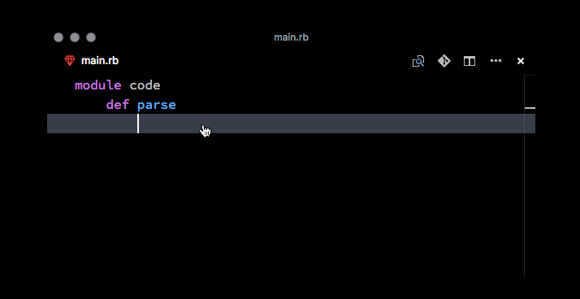

**Moving lines**

When you move source code out of a nested block or move code from one block to another, the editor will adjust the indentation level automatically.

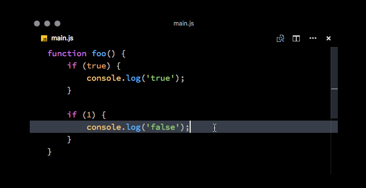

**Paste**

Pasting is similar to moving lines, VS Code will adjust the indentation for you based on the lines before the pasted area.

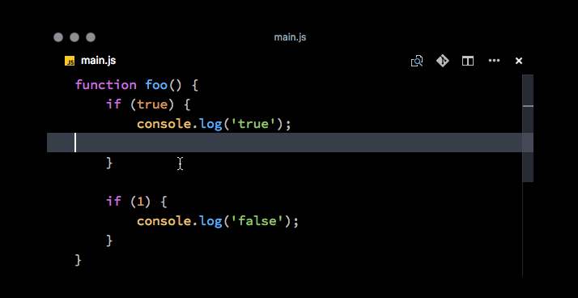

### Minimap

The new `"editor.minimap.showSlider"` setting can be configured to `"always"` to always render the minimap (outline view) slider. There is now also a subtle indicator of the horizontal scroll position within the slider. The slider geometry computations received a lot of improvements too (see the Notable Changes section):

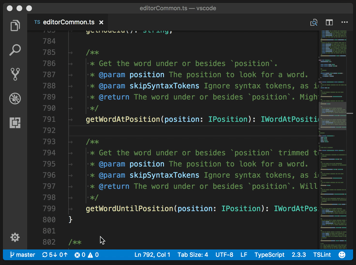

### Diff editor review pane

We've added a review pane to the Diff editor, an experience especially designed for users of screen readers. Our diff editor is implemented as a composition of two editors, and each side is exposed as a regular code editor to screen readers. It is not clear (if possible) how we could automatically announce entering a diff region or the actual diff to a screen reader from the context of a code editor.

We therefore added `F7` and `Shift+F7` which will navigate through diffs and present them in a unified patch format. Lines can be navigated with arrow keys and pressing `Enter` will jump back in the diff editor and the selected line.


## Extension Authoring

### Constraints for rendering SVG images

Due to security concerns, we don't want to render user provided SVG images within VS Code. We added constraints for extensions to make it safer for users when they browse the extension Marketplace within VS Code:

- The icon provided in `package.json` may not be an SVG.
- The badges provided in the `package.json` may not be SVGs unless they are from [approved badge providers](https://code.visualstudio.com/docs/extensionAPI/extension-manifest#_approved-badges).
- Image URLs in `README.md` and `CHANGELOG.md` need to resolve to `https` URLs.
- Images in `README.md` and `CHANGELOG.md` may not be SVGs unless they are from [approved badge providers](https://code.visualstudio.com/docs/extensionAPI/extension-manifest#_approved-badges).
- Images in `README.md` and `CHANGELOG.md` may not use data URIs.

To help you adopt these constraints, VS Code shows linting errors in your extension's `package.json`, `README.md`, and `CHANGELOG.md` files if they are not yet compliant. Also, the `vsce` publishing tool performs compliance checks and prevents you from uploading a new version of your extensions if there are problems.

### Custom views

You can now control the visibility of a custom view by providing the `when` context value while defining it in `views` contribution section in `package.json`.

Example:

```json
"views": {
    "explorer": [
        {
            "id": "extension.node-debug.loadedScriptsExplorer",
            "name": "Loaded Scripts",
            "when": "inDebugMode && debugType == 'node'"
        }
    ]
}
```

### New Debug API

In this release, we've started to provide a [Debug API](https://github.com/Microsoft/vscode/issues/28500) for extensions.

The [initial API](https://github.com/Microsoft/vscode/issues/28234) covers the life-cycle of debug sessions:

* `createDebugSession` for starting a debug session based on an in-memory launch configuration.
* An `onDidTerminateDebugSession` event which indicates that a debug session has terminated.

> **Note:** Currently this API is proposed, so in order to use it you must opt into it by adding a `"enableProposedApi": true` to `package.json` and you'll have to copy the [`vscode.proposed.d.ts`](https://github.com/Microsoft/vscode/blob/master/src/vs/vscode.proposed.d.ts) into your extension project. Also be aware that you cannot publish an extension to the Marketplace that uses the `enableProposedApi` attribute.

### New Task API

If you want to provide task detection for your programming language, you can now use the official task API. Have a look at the [API](https://github.com/Microsoft/vscode/blob/master/src/vs/vscode.d.ts#L4790-L4791) and at one of the VS Code task detection extensions like [npm scripts autodetect](https://github.com/Microsoft/vscode/blob/master/extensions/npm/src/main.ts).

### Debug Adapter Protocol

**New capability `supportsDelayedStackTraceLoading`**

In the May release, we improved stepping performance by fetching parts of the call stack and the corresponding variables lazily. Later we learned that not all debug extensions were prepared to return the stack in chunks which could result in a [duplicated top stack frame](https://github.com/Microsoft/vscode/issues/28808). We weren't able to fix this problem in a robust way, so we decided that debug adapters should opt-in to the delayed loading of stack frames explicitly and a new capability `supportsDelayedStackTraceLoading` was introduced in the debug protocol. So if the lazy loading of stack frames was working fine in your debug extension and if you know that your debug adapter already supports both the `startFrame` and the `levels` attribute of the `stackTrace` request, you should return `true` for the `supportsDelayedStackTraceLoading` capability. This ensures that you'll continue to see the improved stepping performance delivered in the June release.

**New optional attribute `includeAll` for type `StackFrameFormat`**

With this new option, the `StackTraceRequest` can be parameterized to include all stack frames, including those the debug adapter might otherwise hide.

## Engineering

### Windows 64 bit Insiders

Visual Studio Code 64-bit builds are now available on Windows for the Insiders build. They come in the usual [Installer](https://go.microsoft.com/fwlink/?linkid=852155) format as well as a [ZIP archive](https://go.microsoft.com/fwlink/?linkid=850640). Make sure to uninstall the 32-bit version before you install the 64-bit one.

You should expect 64-bit builds of our Stable version next month.

### Issue management automation

The [Probot](https://github.com/probot/probot) we deployed to assist in our issue management now uses a machine learning algorithm to guess the feature area of new issues. When the algorithm estimates a sufficiently high probability of being correct, the bot adds the area label and (in some cases) directly assigns the issue to a developer on the team:

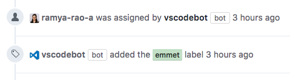

For a few days after a new release, the bot labels new issues filed for that release with the `new release` label. This helps us quickly spot regressions introduced in the release. We remove the label after a few days:

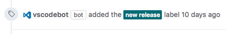

We are looking for feedback from the community and plan to add more automation.

### Monaco Editor

We published a new version of the [Monaco Editor](https://microsoft.github.io/monaco-editor/), bringing it up to date with VS Code and making numerous accessibility improvements.

## Preview: Multi Root Workspaces

We have been busy this milestone on the development of "[Multi-Root Workspaces](https://github.com/Microsoft/vscode/issues/396)" in VS Code (refer to our [previous release notes](https://code.visualstudio.com/updates/v1_13#_multiroot-workspaces) for the design decisions we made last sprint). The outcome of this work is what we call a "Minimum Viable Product" (MVP) to enable testing on multiple root folder workspaces. The features outlined below are currently only available from our [Insiders](https://code.visualstudio.com/insiders) build and not Stable. More work is needed before we can make this feature available for all users. To try it out, grab our Insiders build from [https://code.visualstudio.com/insiders](https://code.visualstudio.com/insiders).

### File Explorer

The File Explorer can now show multiple root folders in one tree. You can easily add root folders from the **File** menu or context menu:

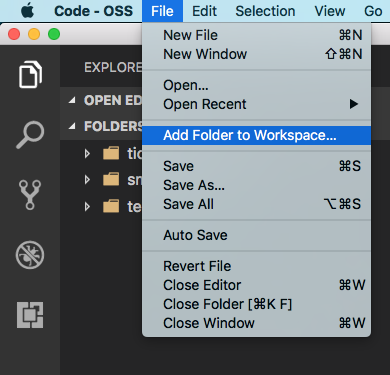

Once a root folder is added, the Explorer will show the new folder as root in the files tree. You can right click on any of the root folders to add more root folders or to remove it.

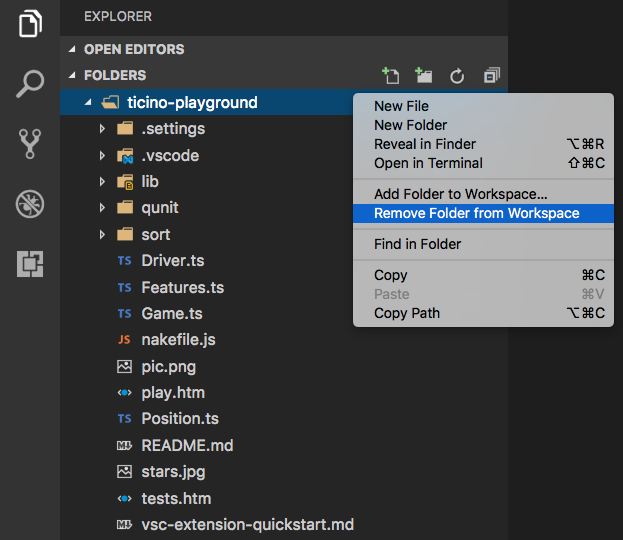

The File Explorer should work and behave as before. You can move files between root folders and use any of the typical file operation actions provided in the context menu and the Explorer view. Settings like `files.exclude` are supported for each root folder if configured and across all folders if configured as global user setting.

### Search

Full text search and the **Quick Open** file picker take the additional root folders into account. When searching, results from all of the root folders will show up in the search results view:

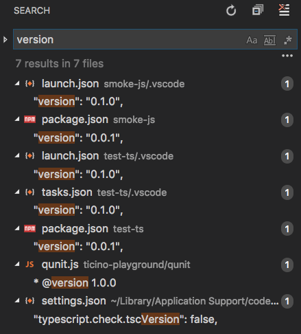

To distinguish results with the same file name across root folders, the name of the root folder is used as a prefix to the relative path in the results list. Settings like `search.exclude` are supported for each root folder if configured and across all folders if configured as global user setting.

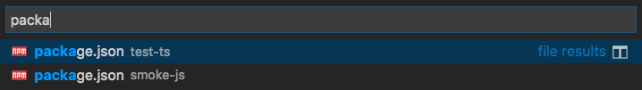

### Settings

With multiple root folders in one workspace, it is possible to have a `.vscode` folder in each root folder defining the settings that should apply for that folder. We classified settings into Workspace and Folder scoped to determine which setting can be applied at Workspace and Folder level.

A subset of settings is supported at a Folder level in this environment, specifically:

* `editor.*`
* `files.exclude`
* `files.trimTrailingWhitespace`
* `files.insertFinalNewLine`
* `files.encoding`
* `files.autoGuessEncoding`
* `files.watcherExclude`
* `search.exclude`

Other settings are currently not supported on a per-folder basis and we will add more to the above list in the future.

Refer to the [issue](https://github.com/Microsoft/vscode/issues/28538#issuecomment-310613318) to get more information about how settings are applied in a multi-root workspace.

### Proposed multi-root API

Having multiple folders open in the editor requires a more powerful API. From when only a single root was supported, there is the `rootPath` API and for compatibility that will remain. We have a new and more powerful API in the pipeline. The current *proposed* API is shown below and enables you to inspect all workspace folders and sends an event when those change. It also gives you access to the new configuration model.

```ts
export namespace workspace {
    /**
    * List of workspace folders or `undefined` when no folder is open. The *first*
    * element in the array is equal to the [`rootPath`](#workspace.rootPath)
    */
    export let workspaceFolders: Uri[] | undefined
    /**
     * An event that is emitted when a workspace folder is added or removed.
     */
    export const onDidChangeWorkspaceFolders: Event<WorkspaceFoldersChangeEvent>;
    /**
    * Get a configuration object.
    *
    * @param section A dot-separated identifier.
    * @param resource A resource for which configuration is asked
    * @return The full workspace configuration or a subset.
    */
    export function getConfiguration2(section?: string, resource?: Uri): WorkspaceConfiguration2;
}

export interface WorkspaceFoldersChangeEvent {
    readonly addedFolders: Uri[];
    readonly removedFolders: Uri[];
}

export interface WorkspaceConfiguration2 extends WorkspaceConfiguration {

    /**
    * Retrieve all information about a configuration setting. A configuration value
    * often consists of a *default* value, a global or installation-wide value,
    * a workspace-specific value and a folder-specific value.
    *
    * The *effective* value (returned by [`get`](#WorkspaceConfiguration.get))
    * is computed like this: `defaultValue` overwritten by `globalValue`,
    * `globalValue` overwritten by `workspaceValue`. `workspaceValue` overwritten by `folderValue`.
    *
    * *Note:* The configuration name must denote a leaf in the configuration tree
    * (`editor.fontSize` vs `editor`) otherwise no result is returned.
    *
    * @param section Configuration name, supports _dotted_ names.
    * @return Information about a configuration setting or `undefined`.
    */
    inspect<T>(section: string): { key: string; defaultValue?: T; globalValue?: T; workspaceValue?: T, folderValue?: T } | undefined;

}

```

**Note:** The API is still proposed and you will need to enable it per extension. In the `package.json` file of your extension, add the following line:

```json
"enableProposedApi": true
```

Also, copy the [`vscode.proposed.d.ts`](https://github.com/Microsoft/vscode/blob/master/src/vs/vscode.proposed.d.ts) file from our repository to your project. Including this file in your project enables type-checking and IntelliSense.

As the API is in the proposed state, it is still being refined and breaking changes are likely to happen. For that reason, we don't support publishing extensions that use proposed APIs. However we do want extension writers, the clients of the extension API, to help us define how the final API should look and what it should support. Don't be shy with feedback!

### Upcoming features

There is still a lot of work ahead of us to make the multi-root experience great.

These areas will get special attention in the next milestone:

* Source Control UI for multiple root folders
* Task and Debug support
* Rich languages support across root folders

## New Commands

Key|Command|Command id
---|-------|----------
`kb(workbench.action.closeUnmodifiedEditors)`|Close unmodified editors of the currently active editor group|`workbench.action.closeUnmodifiedEditors`
`kb(workbench.action.quickSwitchWindow)`|Quickly switch between opened windows (instances)|`workbench.action.quickSwitchWindow`
`kb(workbench.action.quickOpenRecent)`|Quickly switch between recently opened folders and files|`workbench.action.quickOpenRecent`
`kb(workbench.action.terminal.focusFindWidget)`|Integrated Terminal Find|`workbench.action.terminal.focusFindWidget`
`kb(workbench.action.terminal.selectAll)`|Integrated Terminal Select All|`workbench.action.terminal.selectAll`
`kb(workbench.action.terminal.rename)`|Integrated Terminal Rename|`workbench.action.terminal.rename`
`kb(editor.action.diffReview.next)`|Diff Editor Next Change|`editor.action.diffReview.next`
`kb(editor.action.diffReview.prev)`|Diff Editor Previous Change|`editor.action.diffReview.prev`

## Notable Changes

* Now using `will-change:transform` instead of `transform:translate3d(...)` to hint editor browser layers. The "hidden" editor option `editor.disableTranslate3d` is replaced by `editor.disableLayerHinting`. See [monaco-editor#426](https://github.com/Microsoft/monaco-editor/issues/426).
* Replaced a bad usage of `Array.splice` in a loop, which makes large pastes significantly faster. See [monaco-editor#351](https://github.com/Microsoft/monaco-editor/issues/351).
* Reimplemented the scrollbar's slider geometry computations, to take into account artificial slider size inflation at an earlier stage, which results in correct mouse control in large files. See [6710](https://github.com/Microsoft/vscode/issues/6710).
* Reimplemented the minimap's slider geometry in a similar spirit: [21346](https://github.com/Microsoft/vscode/issues/21346), [29326](https://github.com/Microsoft/vscode/issues/29326), [28944](https://github.com/Microsoft/vscode/issues/28944).
* Found (with help from [@fj128](https://github.com/fj128)) and implemented a workaround for thin lines rendering when the CSS <-> screen pixel ratio is not an integer: [9634](https://github.com/Microsoft/vscode/issues/9634), [28542](https://github.com/Microsoft/vscode/issues/28542).

These are the [closed bugs](https://github.com/Microsoft/vscode/issues?q=is%3Aissue+label%3Abug+milestone%3A%22June+2017%22+is%3Aclosed) and these are the [closed feature requests](https://github.com/Microsoft/vscode/issues?q=is%3Aissue+milestone%3A%22June+2017%22+is%3Aclosed+label%3Afeature-request) for the 1.14 update.

## Contributions to Extensions

* [PHP language server](https://github.com/felixfbecker/php-language-server): We completed a [pull request](https://github.com/felixfbecker/php-language-server/pull/357) to adopt the [Tolerant PHP Parser](https://github.com/Microsoft/tolerant-php-parser). Try it out in the [PHP IntelliSense](https://marketplace.visualstudio.com/items?itemName=felixfbecker.php-intellisense) extension.

* [GitHub Issues and PRs](https://marketplace.visualstudio.com/items?itemName=ms-vscode.github-issues-prs): We have published an extension showing issues and PRs assigned to the current user and milestones.

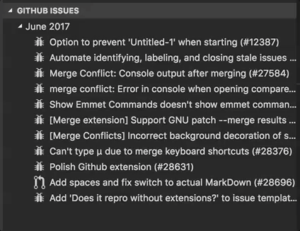

* [Git Lens](https://marketplace.visualstudio.com/items?itemName=eamodio.gitlens): We added a stash explorer (Pull requests: [#94](https://github.com/eamodio/vscode-gitlens/pull/94), [#102](https://github.com/eamodio/vscode-gitlens/pull/102)) to Git Lens, which allows you to see the content change of local stashes in VS Code Diff Editor.

* [VSTS Build Status](https://marketplace.visualstudio.com/items?itemName=jeppeandersen.vstsbuildstatus): We added the ability to group several build definitions into a single build Status Bar indicator (pull request [#12](https://github.com/jlandersen/vscode-vsts-build-status/pull/12)).

## Thank You

Last but certainly not least, a big *__Thank You!__* to the following folks that helped to make VS Code even better:

Contributions to `vscode`:

* [Brandon Ruggles (@brandonrninefive)](https://github.com/brandonrninefive): QuickOpen looks misaligned in monokai theme. [PR #29860](https://github.com/Microsoft/vscode/pull/29860)
* [Bugra Cuhadaroglu (@BugraC)](https://github.com/BugraC)
  *  Git: Pull from specific branch adds feature to #26738 [PR #26979](https://github.com/Microsoft/vscode/pull/26979)
  *  #23797 git manage ignore files [PR #29243](https://github.com/Microsoft/vscode/pull/29243)
* [@campersau](https://github.com/campersau):  cleanup duplicate semicolons in minimapCharRenderer [PR #28106](https://github.com/Microsoft/vscode/pull/28106)
* [Ernest Wong (@chewong)](https://github.com/chewong):  Added setting to enable/disable clickable URL [PR #28160](https://github.com/Microsoft/vscode/pull/28160)
* [Christopher Leidigh (@cleidigh)](https://github.com/cleidigh)
  *  Fix current output drop-down selected Issue #27643 [PR #27645](https://github.com/Microsoft/vscode/pull/27645)
  *  Add Debug Output Copy All command : Fixes #27079 [PR #28197](https://github.com/Microsoft/vscode/pull/28197)
* [@cristianhosu](https://github.com/cristianhosu):  #22622 [PR #23211](https://github.com/Microsoft/vscode/pull/23211)
* [traBpUkciP (@Duroktar)](https://github.com/Duroktar):  Open old version of file in Git side bar. [PR #26629](https://github.com/Microsoft/vscode/pull/26629)
* [Dustin Campbell (@DustinCampbell)](https://github.com/DustinCampbell):  Update C# grammar with fixes from csharp-tmLanguage [PR #28120](https://github.com/Microsoft/vscode/pull/28120)
* [Dmitry Zabello (@foreverest)](https://github.com/foreverest):  Multi root folders name not updated on removing … [PR #29596](https://github.com/Microsoft/vscode/pull/29596)
* [Georgios Andreadis (@gandreadis)](https://github.com/gandreadis):  Improve grammar of config setting description [PR #28957](https://github.com/Microsoft/vscode/pull/28957)
* [Rokas (@gecharo)](https://github.com/gecharo): Ability to merge local git branches [PR #25731](https://github.com/Microsoft/vscode/pull/25731)
* [Hasan Ali (@hasali19)](https://github.com/hasali19):  Add options to theme notification buttons and badges [PR #28471](https://github.com/Microsoft/vscode/pull/28471)
* [Anton Vildyaev (@hun1ahpu)](https://github.com/hun1ahpu)
  *  Fix funny dot bug [PR #27966](https://github.com/Microsoft/vscode/pull/27966)
  *  Next group action should not create new group [PR #27967](https://github.com/Microsoft/vscode/pull/27967)
* [Ishan Arora (@ishanarora)](https://github.com/ishanarora):  fixes #22593 [PR #28816](https://github.com/Microsoft/vscode/pull/28816)
* [Jammerware (@jammerware)](https://github.com/jammerware):  Implement terminal rename action [PR #28464](https://github.com/Microsoft/vscode/pull/28464)
* [Jens Hausdorf (@jens1o)](https://github.com/jens1o)
  *  fix casing [PR #28087](https://github.com/Microsoft/vscode/pull/28087)
  *  add more settings to gear menu [PR #28303](https://github.com/Microsoft/vscode/pull/28303)
  *  Add `.rhtml` to html extension [PR #28028](https://github.com/Microsoft/vscode/pull/28028)
  *  fix some typos [PR #28101](https://github.com/Microsoft/vscode/pull/28101)
  *  remove double semicolons [PR #28110](https://github.com/Microsoft/vscode/pull/28110)
  *  update php grammar [PR #29130](https://github.com/Microsoft/vscode/pull/29130)
* [Jeremy Loy (@JeremyLoy)](https://github.com/JeremyLoy):  Added darwinHelpBook, darwinHelpName to macOS build  [PR #28654](https://github.com/Microsoft/vscode/pull/28654)
* [Kate Miháliková (@katemihalikova)](https://github.com/katemihalikova):  Handle diff3-style merge correctly [PR #27405](https://github.com/Microsoft/vscode/pull/27405)
* [Keegan Carruthers-Smith (@keegancsmith)](https://github.com/keegancsmith):  Filter settings from no search results link [PR #29261](https://github.com/Microsoft/vscode/pull/29261)
* [Krzysztof Cieślak (@Krzysztof-Cieslak)](https://github.com/Krzysztof-Cieslak)
  *  Add debugger type in extension view [PR #29214](https://github.com/Microsoft/vscode/pull/29214)
  *  Add `Git: Pull From` command [PR #29308](https://github.com/Microsoft/vscode/pull/29308)
  *  Add Support [line, col] in terminal links [PR #29212](https://github.com/Microsoft/vscode/pull/29212)
* [Matthew Shirley (@matthewshirley)](https://github.com/matthewshirley):  Add "pullFrom" git command [PR #26981](https://github.com/Microsoft/vscode/pull/26981)
* [@mbeatrizmagalhaes](https://github.com/mbeatrizmagalhaes):  Correct misspelled occurrences and occurred  [PR #28569](https://github.com/Microsoft/vscode/pull/28569)
* [Sam El-Husseini (@microsoftsam)](https://github.com/microsoftsam):  Turn autocomplete off on Mobile device keyboards [PR #27778](https://github.com/Microsoft/vscode/pull/27778)
* [Yu Zhang (@neilsustc)](https://github.com/neilsustc)
  *  Spaces in block comment. #28169 [PR #28238](https://github.com/Microsoft/vscode/pull/28238)
  *  Default Markdown language configuration [PR #28172](https://github.com/Microsoft/vscode/pull/28172)
* [Nick Snyder (@nicksnyder)](https://github.com/nicksnyder)
  *  Explicit return type on openResources [PR #28148](https://github.com/Microsoft/vscode/pull/28148)
  *  Only update viewlet switcher if it has already been rendered [PR #28568](https://github.com/Microsoft/vscode/pull/28568)
  *  Don't hardcode number of result providers [PR #28115](https://github.com/Microsoft/vscode/pull/28115)
* [@PeteX](https://github.com/PeteX):  Don't split words at U+2019, the right single quotation mark. [PR #28903](https://github.com/Microsoft/vscode/pull/28903)
* [Rohith Reddy Kumbharkar (@RohithKumbharkar)](https://github.com/RohithKumbharkar):  Fixes issue with tooltips in Activity Bar [PR #28783](https://github.com/Microsoft/vscode/pull/28783)
* [Soney Mathew (@soneymathew)](https://github.com/soneymathew):  Provide a command to close all unchanged files [PR #25692](https://github.com/Microsoft/vscode/pull/25692)
* [Tomáš Hübelbauer (@TomasHubelbauer)](https://github.com/TomasHubelbauer):  Add spaces and fix switch to actual MarkDown [PR #28696](https://github.com/Microsoft/vscode/pull/28696)
* [@WaiSiuKei](https://github.com/WaiSiuKei):  Add entry file of oniguruma when packing [PR #27123](https://github.com/Microsoft/vscode/pull/27123)

Contributions to `vscode-node-debug2`:
* [@rianadon](https://github.com/rianadon):  Stop debugging on program end [PR #112](https://github.com/Microsoft/vscode-node-debug2/pull/112)

Contributions to `vscode-languageserver-node`:

* [Sven Efftinge (@svenefftinge)](https://github.com/svenefftinge): Only convert `undefined` argument to null [PR #216](https://github.com/Microsoft/vscode-languageserver-node/pull/216)
* [Remy Suen (@rcjsuen)](https://github.com/rcjsuen): Fix typo in README.md [PR #219](https://github.com/Microsoft/vscode-languageserver-node/pull/219)

Contributions to `vscode-recipes`:

* [Tony Sneed (@tonysneed)](https://github.com/tonysneed): Add recipe for Chrome Debugging with Angular CLI [PR #2](https://github.com/weinand/vscode-recipes/pull/2)

Contributions to `vscode-extension-vscode`:

* [Brian Vandre (@bvandre)](https://github.com/bvandre): Honor npm config proxy settings [PR #67](https://github.com/Microsoft/vscode-extension-vscode/pull/67)
* [Nick Chen (@vazexqi)](https://github.com/vazexqi): Add CODE_EXTENSIONS_PATH env var [PR #71](https://github.com/Microsoft/vscode-extension-vscode/pull/71)

Contributions to `localization`:

This is the third month since we opened community localization in Transifex. We now have more 270 members in the Transifex [VS Code project](https://aka.ms/vscodeloc) team. We appreciate your contributions, either by providing new translations, voting on translations, or suggesting process improvements.

Here is a snapshot of top contributors for this release. For details about the project including the contributor name list, visit the project site at [https://aka.ms/vscodeloc.](https://aka.ms/vscodeloc)

* **French:** Antoine Griffard, Julien Brochet, JP Gouigoux.
* **Italian:** Aldo Donetti, Steve Roger.
* **German:** Jonas Thelemann, Levin Rickert, Christian Gräfe.
* **Spanish:** Raúl Rama, Alberto Poblacion, José M. Aguilar, Andy Gonzalez.
* **Russian:** sberbanker, Nikita Gryzlov, Friedrich von Never.
* **Japanese:** Yuichi Nukiyama, EbXpJ6bp, Yosuke Sano, Yuki Ueda, tempura.sukiyaki.
* **Korean:** Ian Y. Choi.
* **Chinese (Simplified):** Joel Yang, 陈嘉恺, 王韦煊, Zijian Zhou, lychichem, YF.
* **Chinese (Traditional):** Duran Hsieh, jasperjn, Alan Liu, balduran, Wei-Ting(DM), Will 保哥, Alan Tsai, Terry Sheng.

Following on the success of the Brazilian Portuguese translations last month, Hungarian and Turkish started this month. Congratulations and thanks to the Hungarian, Turkish, and Brazilian Portuguese community localization teams! Special thanks to Tar Dániel and Adem Coşkuner who localized the majority of the 3500 strings of their language. Due to the efforts of community members, localization is now completed in Transifex and the translations have been integrated into the [Insiders](https://code.visualstudio.com/insiders) build for testing. Depending on validation progress, we hope to soon integrate the translations into the stable builds.

* **Portuguese (Brazil):** Bruno Sonnino, Roberto Fonseca, Douglas Eccker, Miguel de Mousa, Fabio Oliveira.
* **Hungarian:** Tar Dániel, Milán Boleradszki, Béla Kovács.
* **Turkish:** Adem Coşkuner, Ata Binen, Meriç Bağlayan, Mehmet Kut, Sertac Ozercan, Serkan Inci, Ramis Eren.

<!-- In-product release notes styles.  Do not modify without also modifying regex in gulpfile.common.js -->
<a id="scroll-to-top" role="button" aria-label="scroll to top" href="#"><span class="icon"></span></a>
<link rel="stylesheet" type="text/css" href="css/inproduct_releasenotes.css"/>
