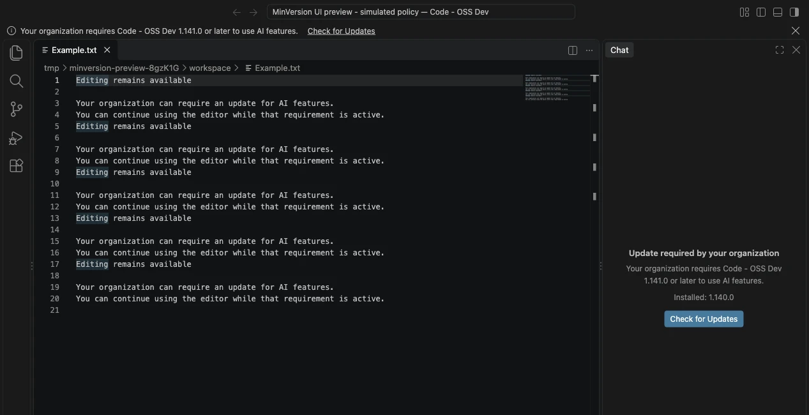
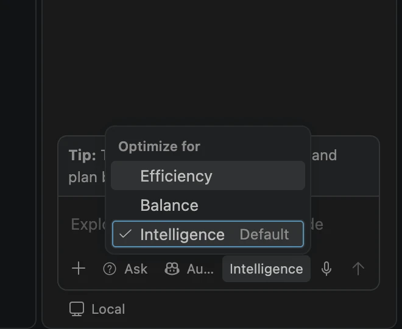

# Visual Studio Code 1.140 <!-- %IF INSIDERS % (Insiders) %ENDIF % -->

Follow us on [LinkedIn](https://www.linkedin.com/showcase/vs-code), [X](https://go.microsoft.com/fwlink/?LinkID=533687), [Bluesky](https://bsky.app/profile/vscode.dev), [Instagram](https://www.instagram.com/vscode.ig) <!-- %IF INSIDERS % | Follow Insiders Changelog on [X](https://x.com/VSCodeChangelog) or [Bluesky](https://bsky.app/profile/vscodechangelog.bsky.social) %ENDIF % --> <!-- %IF IN_PRODUCT % | [View online](https://code.visualstudio.com/updates)%ENDIF % -->

---

_Last updated: September 22, 2026_

Welcome to the 1.140 <!-- %IF INSIDERS % Insiders %ENDIF % --> release of Visual Studio Code.

<!-- %IF INSIDERS %
These release notes cover the Insiders build of VS Code and continue to evolve as new features are added.

You can still track our progress in the [Commit log](https://github.com/Microsoft/vscode/commits/main) and our list of [Closed issues](https://github.com/Microsoft/vscode/issues?q=is%3Aissue%20is%3Aclosed%20milestone%3A1.140.0).
%ENDIF % -->

Happy Coding!

---

<!-- %IF STABLE %
To try new features as soon as possible, [**download the nightly Insiders build**](https://code.visualstudio.com/insiders), which includes the latest updates as soon as they are available.

---
%ENDIF % -->

<!-- TOC
<div class="toc-nav-layout">
  <nav id="toc-nav">
    <div>In this update</div>
    <ul>
      <li><a href="#september-23-2026">September 23, 2026</a></li>
      <li><a href="#september-22-2026">September 22, 2026</a></li>
      <li><a href="#september-21-2026">September 21, 2026</a></li>
      <li><a href="#agents">Agents</a></li>
      <li><a href="#enterprise">Enterprise</a></li>
    </ul>
  </nav>
  <div class="notes-main">
Navigation End -->

## September 23, 2026

* Add opt-in, enterprise-governed identity capture (`user.name`, `process.user.name`, `host.name`) to Copilot OpenTelemetry for Local chat sessions. See [Capture user identity in OpenTelemetry](#capture-user-identity-in-opentelemetry). _[#302930: Opt-in only open telemetry should include some PII data](https://github.com/microsoft/vscode/issues/302930)_

## September 22, 2026

* When the Enterprise `minVersion` managed setting blocks AI features, Chat, the editor window, and the Agents window now explain the required update and how to get it. See [Explain minimum version requirements](#explain-minimum-version-requirements). _[#337086: Explain enterprise minVersion restrictions in Chat, the Agents window, and a window-level banner](https://github.com/microsoft/vscode/issues/337086)_
* Administrators can set the default Auto tier for new chats in the Local harness and the local Copilot agent host with the `autoTier` managed setting. See [Set a default Auto tier](#set-a-default-auto-tier). _[#336829: Add Auto Tier Managed Setting](https://github.com/microsoft/vscode/issues/336829)_

## September 21, 2026

* Add support for starting a chat on an eligible remote agent host without selecting a folder in the desktop Agents Window. _[#336544: Cannot create a workspace-less chat session for a remote agent host](https://github.com/microsoft/vscode/issues/336544)_

## Agents

### Delegate tasks to remote agent hosts (Experimental)

**Setting**: `setting(chat.remoteSessions.tools.enabled)`

Your agent can delegate work to connected [remote agent hosts](https://code.visualstudio.com/docs/agents/run/remote-agent-sessions) from the , without you selecting a host in a picker for each task.

The new built-in tools let your agent:

* Discover hosts, models, resource capacities, and session load with `list_agent_hosts`.
* Start a session with `create_remote_session`. Specify a host or let automatic placement match an operating system (Windows, Linux, or macOS), minimum memory capacity, logical CPU count, and optional model. Among matching hosts, placement favors the host with the fewest running sessions and pending creations.
* Check a remote session's status and latest response with `get_remote_session`.
* Send follow-up work or report results and questions back to the originating chat with `send_remote_message`.

The tools are off by default. Enable this setting along with `setting(chat.remoteAgentHostsEnabled)` and connect the hosts you want to use. From a chat running on an agent host, ask:

```prompt
Start a remote session on a connected Linux host with at least 16 GiB of memory and eight logical CPUs. Check the installed Node.js and Python versions and report back to this chat.
```

Sessions have no workspace unless you specify one. For repository work, use an existing trusted folder on the target host, either directly or in a new Git worktree. The tools do not clone or copy the originating workspace, and normal approvals still apply.

Keep the coordinating  open and connected for messages to flow. Remote agents report back through `send_remote_message`; their final answers are not automatically forwarded.

## Enterprise

### Explain minimum version requirements

Administrators can use the `minVersion` managed setting to block AI features on older VS Code versions until developers update, for example to require newer sandboxing protections. Instead of an **Update Required** dialog, VS Code now explains the requirement wherever AI features are unavailable:

* **Chat** shows the required and installed versions, with an update action.
* **The editor window** shows a banner even when Chat is closed. Other editor features stay available.
* **The Agents window** shows a blocking overlay, with an **Open Editor Window** action.

When an update is available, VS Code offers the matching **Check for Updates**, **Download Update**, **Install Update**, or **Restart to Update** action. If your organization disables built-in updates by policy, VS Code instead asks you to contact your administrator. The notices clear once the requirement is met. How VS Code enforces the requirement is unchanged.



### Set a default Auto tier

Administrators can set the default **Optimize for** tier for the Auto model with the `autoTier` managed setting. Accepted values are `efficiency`, `balance`, and `intelligence`. The tier applies to new chats in the Local harness and the Copilot agent host on the same machine. The managed tier appears as **Default** in the model picker.

The managed tier is a starting point, not a restriction. Developers can still choose a different tier. VS Code keeps explicit and restored choices when the managed tier changes or is removed.



### Capture user identity in OpenTelemetry

**Setting**: `setting(github.copilot.chat.otel.captureIdentity)`

Organizations can attribute [Copilot OpenTelemetry](https://code.visualstudio.com/docs/enterprise/ai-settings#_configure-telemetry-export-with-opentelemetry) data to individual developers. When identity capture is enabled, Local chat sessions add the following attributes:

* `user.name` on agent invocation spans, including subagents and inline chat.
* `process.user.name` and `host.name` as resource attributes.

Identity capture is off by default and independent of content capture. Administrators control identity capture with the `telemetry.capture.identity` managed setting (`CopilotOtelCaptureIdentity` policy). A managed value takes precedence over `COPILOT_OTEL_CAPTURE_IDENTITY` and user settings. When a policy denies capture, VS Code removes identity from later exports without a reload, including identity attributes that are set explicitly as resource attributes.

This release also changes how managed telemetry settings are resolved:

* VS Code applies the `telemetry` block from only the highest-priority delivery channel: native MDM, then server, then file. Fields that the selected block omits are no longer filled in from lower-priority channels.
* Managed `telemetry.resourceAttributes` now take precedence over `OTEL_RESOURCE_ATTRIBUTES`.

> **Note**: Identity capture currently applies only to the Local harness. Support for the agent host is tracked in [#337413](https://github.com/microsoft/vscode/issues/337413).

---

We really appreciate people trying our new features as soon as they are ready, so check back here often and learn what's new.

<a id="scroll-to-top" role="button" title="Scroll to top" aria-label="scroll to top" href="#"><span class="icon"></span></a>
<link rel="stylesheet" type="text/css" href="css/inproduct_releasenotes.css"/>
