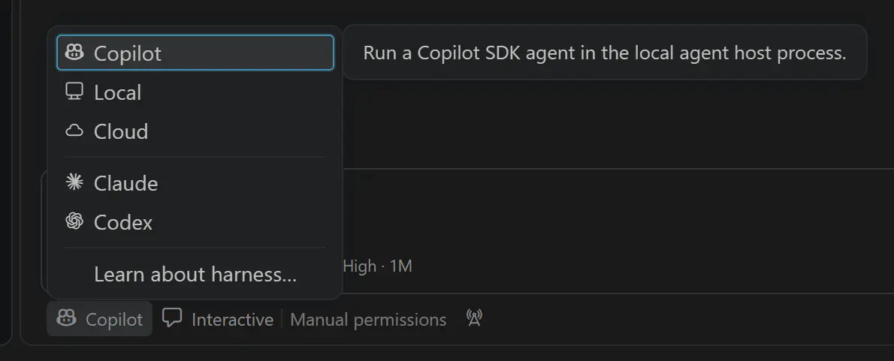
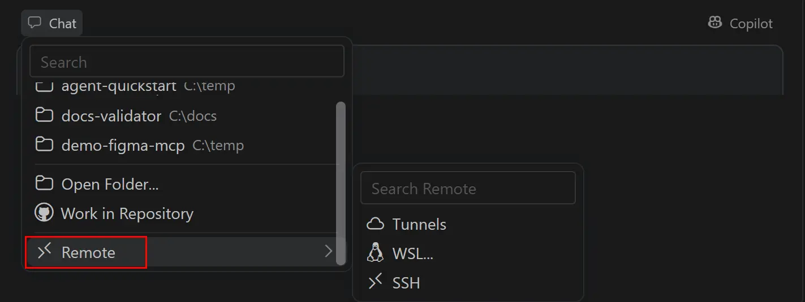
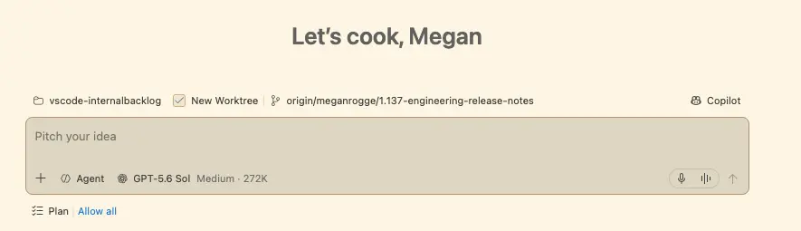
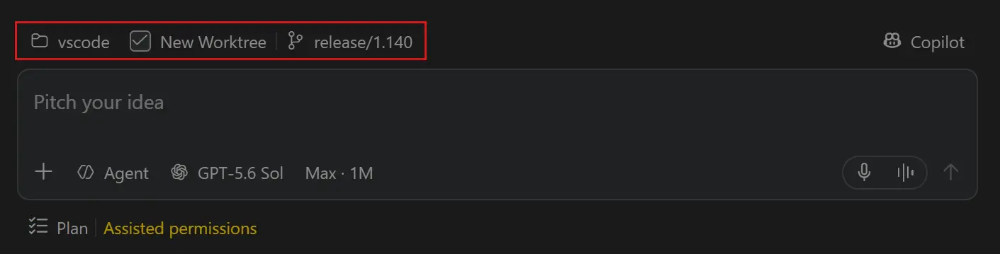
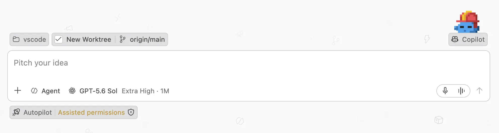
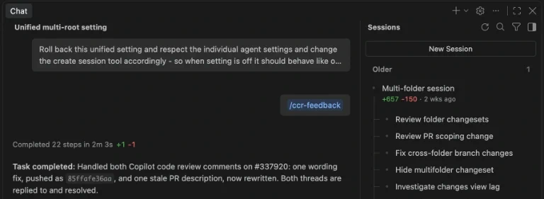
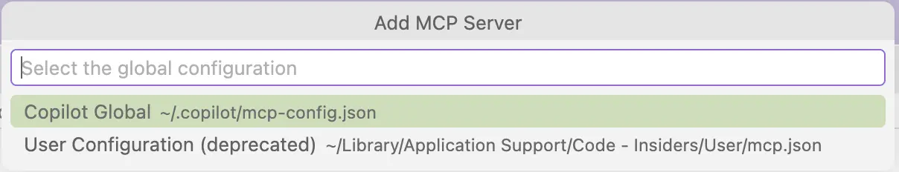
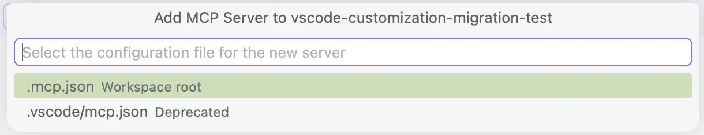

# Visual Studio Code 1.140

<!-- %IF IN_PRODUCT %
Follow us on [LinkedIn](https://www.linkedin.com/showcase/vs-code), [X](https://go.microsoft.com/fwlink/?LinkID=533687), [Bluesky](https://bsky.app/profile/vscode.dev), [Instagram](https://www.instagram.com/vscode.ig) | [View online](https://code.visualstudio.com/updates)
%ENDIF % -->
<!-- %IF IN_WEB %
<p class="release-metadata"><span>Released September 30, 2026</span> <span class="release-channel">Stable</span></p>
%ENDIF % -->
<!-- %IF IN_PRODUCT %
_Release date: September 30, 2026_
%ENDIF % -->

<!-- DOWNLOAD_LINKS_PLACEHOLDER -->

<!-- %IF STABLE %
<p class="release-update-guidance">Already installed? Use <strong>Check for Updates</strong> in VS Code. For upcoming features, use the <a href="https://code.visualstudio.com/insiders">Insiders build</a>.</p>
%ENDIF % -->

<!-- RELEASE_HIGHLIGHTS_START -->
## Release highlights

This release expands agent workflows, improves worktree reuse, and adds enterprise AI controls.

* [Copilot harness](#copilot-harness): Use the Copilot harness and get consistent agent behavior across Copilot products.

* [Multi-folder sessions (Experimental)](#multi-folder-sessions-experimental): Work on tasks across multiple folders within a single agent session.

* [Remote delegation (Experimental)](#delegate-tasks-to-remote-agent-hosts-experimental): Delegate tasks to connected remote agent hosts.

* [HydraFusion (Research Preview)](#hydrafusion-model-orchestration-research-preview): Let multiple models draft, critique, and revise coding tasks without coordinating them yourself.

* [Shared worktree folders (Experimental)](#reuse-ignored-folders-across-worktrees-experimental): Avoid repeated dependency installs and duplicated artifacts by reusing ignored folders across worktrees.

* [Enterprise controls](#enterprise): Ensure everyone in your org follows AI version requirements and defaults.
<!-- RELEASE_HIGHLIGHTS_END -->

<!-- %IF IN_PRODUCT %
Happy Coding!

---
%ENDIF % -->

<!-- TOC
<div class="toc-nav-layout">
  <nav id="toc-nav">
    <div>In this update</div>
    <ul>
      <li><a href="#release-highlights">Release highlights</a></li>
      <li><a href="#agents">Agents</a></li>
      <li><a href="#chat">Chat</a></li>
      <li><a href="#mcp">MCP</a></li>
      <li><a href="#accessibility">Accessibility</a></li>
      <li><a href="#source-control">Source Control</a></li>
      <li><a href="#code-editing">Code Editing</a></li>
      <li><a href="#terminal">Terminal</a></li>
      <li><a href="#enterprise">Enterprise</a></li>
      <li><a href="#social-media">Social media</a></li>
      <li><a href="#proposed-apis">Proposed APIs</a></li>
      <li><a href="#deprecated-features-and-settings">Deprecated features and settings</a></li>
      <li><a href="#thank-you">Thank you</a></li>
    </ul>
  </nav>
  <div class="notes-main">
Navigation End -->

## Agents

### Copilot harness

The Copilot harness adds exciting new agent functionality to VS Code while keeping the way you work familiar. It's powered by the Copilot SDK, so its behavior and capabilities are consistent with other Copilot products, including the standalone GitHub Copilot app and the Copilot CLI.

To start using the Copilot harness, select it from the harness picker in the chat input. In this release, it might already be the default selection for you. You can continue working as you normally do.



The harness runs in a dedicated [agent host](https://code.visualstudio.com/docs/agents/concepts/agent-host) process based on the Agent Host Protocol (AHP), so you can connect to the same agent session from multiple VS Code windows.

Learn how to [work with the Copilot harness](https://code.visualstudio.com/docs/agents/run/agent-harnesses#use-the-copilot-harness), or explore the architecture and workflows in the [agent host blog post](https://code.visualstudio.com/blogs/2026/08/26/agent-host-architecture). If you have feedback or requests, [please file an issue](https://github.com/microsoft/vscode/issues).

### HydraFusion model orchestration (Research Preview)

[HydraFusion](https://github.blog/ai-and-ml/github-copilot/project-hydrafusion-frontier-quality-via-multi-model-orchestration/) is an adaptive model orchestration system that chooses the models and workflow for each coding task. It can solve a task with one model, escalate to a stronger model, or have another model critique and revise the result. This approach aims to improve result quality while balancing speed and cost, without requiring you to coordinate models yourself.

Eligible users with preview features enabled can select HydraFusion in the model picker.

<video src="images/1_140/hydrafusion-short-demo.mp4" title="Video showing HydraFusion orchestrating multiple models to complete a coding task." autoplay loop controls muted></video>

### Multi-folder sessions (Experimental)

Multi-folder sessions let you coordinate related work across repositories or isolated worktrees in one session. Previously, every chat in a [multi-chat session](https://code.visualstudio.com/docs/agents/run/sessions/manage-sessions#_run-multiple-chats-in-a-session) shared the same folder and checkout. In this release, each chat can use its own folder or worktree without changes leaking between chats.

Each chat uses its folder for its terminal, tasks, changes, pull request, and Agent merge state. Chats that use the same folder share that state. In the sessions list, hover over a session to see a summary across all its folders, or hover over a nested chat to see details for only its folder.


Example use cases include:

* **Implement a feature across repositories**: Ask the main chat to work in one repository and create a peer chat for a second repository.

    <video src="images/1_140/multi-folder-sessions-cross-repo.mp4" title="Video showing one agent session that adds a field in one repository and shows it in a second repository, and then hovers the pull request in each chat and opens each chat's changes." autoplay loop controls muted></video>

* **Compare approaches in separate worktrees**: Ask the main chat to create peer chats that each use a fresh worktree of the same repository. Each approach gets its own branch, changes, and pull request.

    <video src="images/1_140/multi-folder-sessions-worktrees.mp4" title="Video showing one agent session that creates two peer chats in separate worktrees of the same repository, and then opens each chat's changes and draft pull request." autoplay loop controls muted></video>

Multi-folder sessions are experimental and disabled by default. The settings are not shown in the Settings editor. In your user-scoped `settings.json` file, set the setting for your harness to `true`, and then create a session:

* Copilot: `setting(chat.agentHost.copilotAgent.multiRootEnabled)`
* Claude: `setting(chat.agentHost.claudeAgent.multiRootEnabled)`
* Codex: `setting(chat.agentHost.codexAgent.multiRootEnabled)`

New sessions pick up setting changes without restarting the Agent Host. There is no UI for adding a folder or choosing the folder of a peer chat, so ask the main chat to create the peer chat and describe the repository or worktree it should use.

### Archive chats in a session

Keep the rest of a session active when one chat finishes its work. Because sessions can contain multiple chats, select **Mark as Done** to archive only the finished peer chat, not the entire session. To restore it with its title and transcript intact, select the **Done** filter in the sessions list.

<video src="images/1_140/archive-chat.mp4" title="Video showing a peer chat marked as done from the sessions list, and then shown and restored with the Done filter." autoplay loop controls muted></video>

### Choose the session relationship and workspace for delegated work

Make two separate decisions when you ask an agent to delegate work. First, decide whether the task belongs to the current session's plan or deliverable. Then specify a workspace only if the task needs repository files, and request a worktree only if file changes need isolation. Related work can still use a different workspace.

* **Create a peer chat for related work**: Ask the agent to create a peer chat in the current session. To reuse the current workspace and checkout, say so in your prompt. Because the peer chat shares the checkout, use this option for research, planning, or related work that doesn't need isolated file changes.

    ```prompt
    Create a peer chat in this session that reuses the current workspace and checkout to review the authentication flow. Do not modify files.
    ```

* **Create an independent session for unrelated work**: Ask the agent to create an independent session with no workspace when a separate deliverable doesn't need repository files. The new session doesn't inherit the source folder. If the work does need a repository, name the project or folder and explicitly request a worktree when its changes need isolation.

    ```prompt
    Create an independent session with no workspace to research licensing options for a separate project.
    ```

Learn more about [orchestrating chats and sessions](https://code.visualstudio.com/docs/agents/run/sessions/manage-sessions#_orchestrate-sessions-from-agent-host-sessions).

### Create workspace-less chats on remote agent hosts

**Setting**: `setting(sessions.chat.unifiedWorkspacePicker.enabled)` (Agents window only)

[Agent Host](https://code.visualstudio.com/docs/agents/run/remote-agent-sessions) lets you run and track agent sessions on a remote host. This release adds support for running workspace-less chats on a remote host.

Select a connected host from the unified workspace picker without choosing a workspace. The **Chat** entry identifies the selected host, so you can confirm where the session runs before you start.



Remote folders also appear alongside local folders in the main picker. This makes frequently used remote workspaces easier to select without opening the **Remote** submenu.

### Delegate tasks to remote agent hosts (Experimental)

**Settings**: `setting(chat.remoteAgentHostsEnabled)`, `setting(chat.remoteSessions.tools.enabled)` (Agents window only)

Your agent can delegate work to connected [remote agent hosts](https://code.visualstudio.com/docs/agents/run/remote-agent-sessions) from the Agents window, without you selecting a host in a picker for each task.

The new built-in tools let your agent:

* Discover hosts, models, resource capacities, and session load with `list_agent_hosts`.
* Start a session with `create_remote_session`. Specify a host, or let automatic placement match an operating system (Windows, Linux, or macOS), minimum memory capacity, logical CPU count, and optional model. Among matching hosts, placement favors the host with the fewest running sessions and pending creations.
* Check a remote session's status and latest response with `get_remote_session`.
* Send follow-up work or report results and questions back to the originating chat with `send_remote_message`.

The tools are off by default. Enable this setting along with `setting(chat.remoteAgentHostsEnabled)` and connect the hosts you want to use. From a chat running on an agent host, ask:

```prompt
Start a remote session on a connected Linux host with at least 16 GiB of memory and eight logical CPUs. Check the installed Node.js and Python versions and report back to this chat.
```

Sessions have no workspace unless you specify one. For repository work, use an existing trusted folder on the target host, either directly or in a new Git worktree. The tools do not clone or copy the originating workspace, and normal approvals still apply.

Keep the coordinating Agents window open and connected for messages to flow. Remote agents report back through `send_remote_message`; their final answers are not automatically forwarded.

### Personalize new-session welcome phrases (Experimental)

**Settings**: `setting(sessions.chat.experimental.welcomePhrases)`, `setting(sessions.chat.experimental.welcomeName)`, `setting(accessibility.verbosity.newSessionWelcome)` (Agents window only)

Add some personality to the Agents window with an optional welcome heading when you create a new session in the Agents window. The heading shows one of five phrases, such as **What are we building?** or **Let's ship something**, and can append your first name from your GitHub profile.



Welcome phrases are off by default. When enabled, you can use **Set Welcome Name** from the heading, its context menu, or the Command Palette to choose a different name. The name syncs across devices. Clear it to use your GitHub first name when available, or a generic phrase when your profile has no name.

When screen reader optimized mode is active, VS Code announces the heading once when the composer appears. Disable `setting(accessibility.verbosity.newSessionWelcome)` if you prefer not to hear the announcement.

### Improved session composer controls (Experimental)

**Settings**: `setting(sessions.chat.experimental.newSessionComposerLayout)`, `setting(sessions.chat.unifiedWorkspacePicker.enabled)` (Agents window only)

The experimental session composer layout reduces the need to move between separate parts of the Agents window. In a new session, the workspace, branch, worktree, and harness controls are grouped above the chat input.



Enable both settings to use the layout.

The unified workspace picker also has commands for moving directly to its controls. Use `kb(sessions.focusNewSessionWorkspacePicker)` to focus the workspace picker or `kb(sessions.focusNewSessionHarnessPicker)` to focus the harness picker. Hovers show your configured keybindings, and each picker's context menu provides a **Configure Keybinding** action. These keyboard improvements require only the unified workspace picker, not the experimental composer layout.

Starting with this milestone, when you create a new worktree session, the branch picker defaults to the upstream branch of your current branch, such as `origin/main`. Before creating the worktree, VS Code automatically attempts to fetch the selected remote branch so the session starts from the latest available remote state.

The picker also loads branches once per workspace and filters them locally, which significantly reduces search latency, especially in large repositories.



### See recently completed sessions first

The **Done** section in the Agents window now sorts sessions by when you marked them as done, with the most recently completed session listed first. This order stays the same when you switch between **Created** and **Updated** sorting and after you reload VS Code.

### More reliable agent orchestration (Experimental)

**Setting**: `setting(chat.agentHost.agentOrchestrationLimits)`

Coordination-heavy agent workflows are less likely to stop before the work is complete. This release raises the process-wide limits for agent-created sessions, chats, inter-session messages, and recursive session creation.

For example, an agent can classify CI failures, delegate each fix to a separate session, and coordinate those sessions without exhausting the message limit before the work is complete. Reaching a limit blocks new orchestration actions but does not interrupt work that is already running.

The setting defaults to `on`, and changes apply without restarting the Agent Host. Set it to `off` to remove the orchestration limits. Confirmation requirements and input validation continue to apply.

### Open a new session in the Agents window from a URL

Open the Agents window from another tool or webpage with a workspace and an editable prompt ready for review. Use a URL with the `agents/new` path and the optional `prompt` and `workspace` query parameters.

For example, this URL opens a new session with no workspace and the prompt already entered:

```text
vscode://agents/new?prompt=Explain%20how%20this%20project%20runs%20its%20tests.%20Do%20not%20run%20anything%20yet.
```

VS Code places the decoded prompt in the **New Session** composer without sending it. To select a workspace, add the `workspace` parameter with a URL-encoded folder URI. If the URL omits `workspace`, the draft uses **No Workspace**. An existing occupied composer remains unchanged, so opening a link does not overwrite work in progress.

Learn more about [opening VS Code with URLs](https://code.visualstudio.com/docs/configure/command-line#_opening-vs-code-with-urls).

> **Note:** Use `vscode-insiders://` instead of `vscode://` for VS Code Insiders.

## Chat

### Persistent progress for agent responses (Experimental)

**Settings**: `setting(chat.experimental.persistentProgress)`, `setting(chat.experimental.persistentProgressVerbosity)`

Long-running agent responses are easier to follow with persistent progress. When enabled, chat keeps a progress indicator visible at the bottom until the response finishes.

Enabling persistent progress also improves the rendering and visibility of in-progress responses. Reasoning appears in separate collapsible previews, and tool calls remain visible while they run. With **Compact** verbosity, completed tool groups collapse into expandable summaries when response text resumes or the response finishes. Select **Verbose** to keep the full tool-call details visible.

Use `setting(chat.experimental.persistentProgress)` to turn the indicator off or choose a colored or monochrome Draw animation. The setting defaults to **Draw** in VS Code Insiders and is rolling out gradually to Stable.

<video src="images/1_140/persistent-progress.mp4" title="Video showing persistent progress for an agent response." autoplay loop controls muted></video>

### Terminal output reflow

**Setting**: `setting(chat.tools.terminal.outputReflow)`

Since [VS Code 1.132](https://code.visualstudio.com/updates/v1_132#_terminal-output-reflow), terminal output in chat reflows to fit the width of the output preview.

The new `setting(chat.tools.terminal.outputReflow)` setting lets you control this behavior. If you prefer output to keep a fixed width instead, disable the setting and scroll horizontally to read long lines. Reflow remains enabled by default.

### Use multiple chats in the editor window

A session can contain multiple chats. Until now, the main chat with its nested peer chats appeared only in the Agents window. The editor window also shows them: the **Sessions** view lists the main chat with its peer chats nested underneath, next to the **Chat** view. Select any row to open that chat in the **Chat** view.



## MCP

### Add MCP servers to portable configuration files

You can add MCP servers to portable configuration files from the **MCP: Add Server** flow, so you can use the same server configuration across compatible Copilot tools without editing JSON manually.

For global servers, choose **Copilot Global** to save the server to `$COPILOT_HOME/mcp-config.json`, or `~/.copilot/mcp-config.json` when `COPILOT_HOME` is not set.



For workspace servers, choose `.mcp.json` to save the server at the workspace root.



## Accessibility

### Hear when confetti appears

**Setting**: `setting(accessibility.signals.confetti)`

The new **Confetti** accessibility signal provides the same celebratory feedback when you cannot see the animation. The joyful sound plays when chat thumbs-up confetti appears and when you successfully mark a session as done in the Agents window.

<video src="images/1_140/accessible-confetti.mp4" title="Video showing the Confetti accessibility signal playing when the Mark as Done action displays confetti." autoplay loop controls muted></video>

## Source Control

### Reuse ignored folders across worktrees (Experimental)

**Setting**: `setting(git.worktreeSymlinkFolders)`

Avoid reinstalling dependencies or duplicating large build artifacts in each [Git worktree](https://code.visualstudio.com/docs/sourcecontrol/branches-worktrees#_understanding-worktrees). Configure `setting(git.worktreeSymlinkFolders)` with `.gitignore`-style patterns for ignored folders, such as `node_modules`. When VS Code creates a new worktree, including for an agent session, it creates symlinks to matching folders in the current checkout.

## Code Editing

### New option to control selection text matching case sensitivity

**Setting**: `setting(editor.selectedTextMatchMode)`

We have added a new setting `setting(editor.selectedTextMatchMode)` to control the case sensitivity of selection matching.

The default value, `findOptions`, means selection matching sensitivity is tied to the Find widget, as was previously the case. There are two other values `caseSensitive` and `caseInsensitive`, which match case-sensitive and case-insensitive selections respectively.

## Terminal

### Sharper terminal text on macOS (Experimental)

**Setting**: `setting(terminal.integrated.fontRendering)`

On macOS high-DPI displays, terminal text can look softer than the same font in other terminals. Set `setting(terminal.integrated.fontRendering)` to `grayscale` to make terminal text look sharper.

## Enterprise

### Explain minimum version requirements

Administrators can require developers to update VS Code before using AI features, for example, to adopt newer sandboxing protections. Instead of an **Update Required** dialog, VS Code now explains the requirement wherever AI features are unavailable:

* **Chat**: shows the required and installed versions, with an update action.
* **Editor window**: shows a banner even when Chat is closed. Other editor features stay available.
* **Agents window**: shows a blocking overlay, with an **Open Editor Window** action.

When an update is available, VS Code offers the matching **Check for Updates**, **Download Update**, **Install Update**, or **Restart to Update** action. If your organization disables built-in updates by policy, VS Code instead asks you to contact your administrator. The notices clear once the requirement is met. How VS Code enforces the requirement is unchanged.


### Set a default Auto tier

The Auto model in VS Code can operate in different tiers, optimizing for efficiency, balance, or intelligence. Administrators can align the Auto model's default behavior with organizational priorities without preventing developers from choosing another tier.

Administrators can set the default tier for the Auto model with the `autoTier` managed setting. Accepted values are `efficiency`, `balance`, and `intelligence`.

The tier applies to new chats in the Local harness and the Copilot agent host on the same machine. The managed tier appears as **Default** in the model picker.

The managed tier is a starting point, not a restriction. Developers can still choose a different tier. VS Code keeps explicit and restored choices when the managed tier changes or is removed.


### Capture user identity in OpenTelemetry

**Setting**: `setting(github.copilot.chat.otel.captureIdentity)`

Organizations can attribute [Copilot OpenTelemetry](https://code.visualstudio.com/docs/enterprise/ai-settings#_configure-telemetry-export-with-opentelemetry) data to individual developers. When identity capture is enabled, Local chat sessions add the following attributes:

* `user.name` on agent invocation spans, including subagents and inline chat.
* `process.user.name` and `host.name` as resource attributes.

Identity capture is off by default and independent of content capture. Administrators control identity capture with the `telemetry.capture.identity` managed setting (`CopilotOtelCaptureIdentity` policy). A managed value takes precedence over `COPILOT_OTEL_CAPTURE_IDENTITY` and user settings. When a policy denies capture, VS Code removes identity from later exports without a reload, including identity attributes that are set explicitly as resource attributes.

This release also changes how managed telemetry settings are resolved:

* VS Code applies the `telemetry` block from only the highest-priority delivery channel: native MDM, then server, then file. Fields that the selected block omits are no longer filled in from lower-priority channels.
* Managed `telemetry.resourceAttributes` now take precedence over `OTEL_RESOURCE_ATTRIBUTES`.

> **Note**: Identity capture currently applies only to the Local harness. Support for the agent host is tracked in [#337413](https://github.com/microsoft/vscode/issues/337413).

## Social media

VS Code is now on Instagram! Follow [@vscode.ig](https://www.instagram.com/vscode.ig) for VS Code updates, new features, tips, and more.

<video src="images/1_140/vscodeig.mp4" title="Video showing all VS Code social channels and the new Instagram account." autoplay loop controls muted></video>

## Proposed APIs

### Authorization server on authentication sessions

The `authIssuers` proposal lets an extension name the OAuth authorization server it wants to authenticate against, which VS Code introduced for MCP in the [1.101 release notes](https://code.visualstudio.com/updates/v1_101#_authentication-providers-supported-authorization-servers-for-mcp). This release adds the opposite direction, so a session can tell you which authorization server issued it.

```ts
export interface AuthenticationSession {
  /**
   * The authorization server that issued this session, when provided by the authentication provider.
   * This identifies the OAuth server, not a REST API endpoint or resource audience.
   */
  readonly authorizationServer?: Uri;
}
```

If your extension talks to more than one deployment of a service, such as public GitHub and a GitHub Enterprise host, you can pair each credential with the destination it was issued for instead of reading a separate setting that the user can change independently. This prevents a valid token from being sent to the wrong host.

Keep in mind two things. The value identifies an OAuth issuer rather than an API endpoint, so map it to your own endpoints. The built-in GitHub provider populates it for public GitHub sessions as well as enterprise ones, so its presence alone does not make a session an enterprise session.

Try it out and let us know what you think in [the API proposal issue](https://github.com/microsoft/vscode/issues/248775). To learn how to build against a proposal, see [using proposed APIs](https://code.visualstudio.com/api/advanced-topics/using-proposed-api).

## Deprecated features and settings

None

<!-- RELEASE_THANK_YOU_START -->
## Thank you

Contributions to `vscode`:

* [@na2co3-ftw (na2co3)](https://github.com/na2co3-ftw): Modern UI: Fix redundant tab action fading in connected editor tabs [PR #336871](https://github.com/microsoft/vscode/pull/336871)
* [@SimonSiefke (Simon Siefke)](https://github.com/SimonSiefke)
  * fix: memory leak in terminal replay [PR #338252](https://github.com/microsoft/vscode/pull/338252)
  * fix: memory leak in semantic tokens [PR #336024](https://github.com/microsoft/vscode/pull/336024)
  * fix: memory leak in search editor [PR #331014](https://github.com/microsoft/vscode/pull/331014)
  * terminal: cancel unnecessary telemetry timeout on disposal [PR #333963](https://github.com/microsoft/vscode/pull/333963)
  * fix: memory leak in animation frame window disposal [PR #338263](https://github.com/microsoft/vscode/pull/338263)
  * fix: memory leak in chat participant disposal [PR #338230](https://github.com/microsoft/vscode/pull/338230)
  * fix: memory leak in custom document disposal [PR #338250](https://github.com/microsoft/vscode/pull/338250)
  * fix: memory leak in mapped edit provider disposal [PR #338245](https://github.com/microsoft/vscode/pull/338245)
  * fix: memory leak in extension host telemetry [PR #334096](https://github.com/microsoft/vscode/pull/334096)
  * fix: memory leak in auxiliary window font measurements [PR #338255](https://github.com/microsoft/vscode/pull/338255)
  * fix: memory leak in SCM artifact commands [PR #338251](https://github.com/microsoft/vscode/pull/338251)
  * fix: memory leak in pixel ratio window disposal [PR #338257](https://github.com/microsoft/vscode/pull/338257)
  * fix: memory leak in integrated browser element handles [PR #338247](https://github.com/microsoft/vscode/pull/338247)
  * fix: memory leak in terminal horizontal scrollbars [PR #338241](https://github.com/microsoft/vscode/pull/338241)
  * fix: memory leak in extension host tree view disposal [PR #338235](https://github.com/microsoft/vscode/pull/338235)
  * fix: memory leak in composite drag and drop registrations [PR #338215](https://github.com/microsoft/vscode/pull/338215)
  * fix: memory leak in integrated browser inspector sessions [PR #338228](https://github.com/microsoft/vscode/pull/338228)
  * fix: memory leak in chatInputPart [PR #327157](https://github.com/microsoft/vscode/pull/327157)
  * fix: memory leak in terminal shell execution streams [PR #338243](https://github.com/microsoft/vscode/pull/338243)
  * fix: memory leak in notebook cell status bar commands [PR #336028](https://github.com/microsoft/vscode/pull/336028)
  * fix: memory leak in issueReporterModel [PR #335098](https://github.com/microsoft/vscode/pull/335098)
  * fix: memory leak in image carousel editor [PR #333981](https://github.com/microsoft/vscode/pull/333981)
  * fix: memory leak in notebook serializer disposal [PR #338212](https://github.com/microsoft/vscode/pull/338212)
  * fix: memory leak in MainThreadShare [PR #334110](https://github.com/microsoft/vscode/pull/334110)
  * fix: memory leak in multi diff editor tabs [PR #333186](https://github.com/microsoft/vscode/pull/333186)
  * fix: memory leak in test observer disposal [PR #338213](https://github.com/microsoft/vscode/pull/338213)
  * fix: memory leak in modalEditorPart [PR #326885](https://github.com/microsoft/vscode/pull/326885)
  * fix: memory leak in comment thread disposal [PR #338216](https://github.com/microsoft/vscode/pull/338216)
  * fix: memory leak in line data event addon [PR #332139](https://github.com/microsoft/vscode/pull/332139)

### Issue tracking

Contributions to our issue tracking:

* [@gjsjohnmurray (John Murray)](https://github.com/gjsjohnmurray)
* [@RedCMD (RedCMD)](https://github.com/RedCMD)
* [@IllusionMH (Andrii Dieiev)](https://github.com/IllusionMH)
* [@albertosantini (Alberto Santini)](https://github.com/albertosantini)

<!-- RELEASE_THANK_YOU_END -->
---

We really appreciate people trying our new features as soon as they are ready, so check back here often and learn what's new.

>If you'd like to read release notes for previous VS Code versions, go to [Updates](https://code.visualstudio.com/updates) on [code.visualstudio.com](https://code.visualstudio.com).

<a id="scroll-to-top" role="button" title="Scroll to top" aria-label="scroll to top" href="#"><span class="icon"></span></a>
<link rel="stylesheet" type="text/css" href="css/inproduct_releasenotes.css"/>
