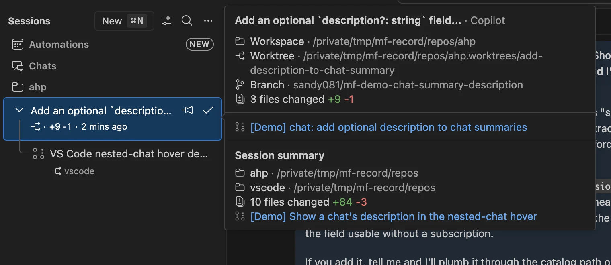
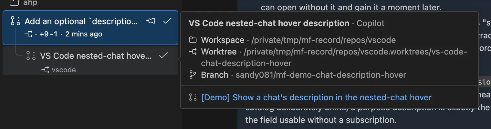
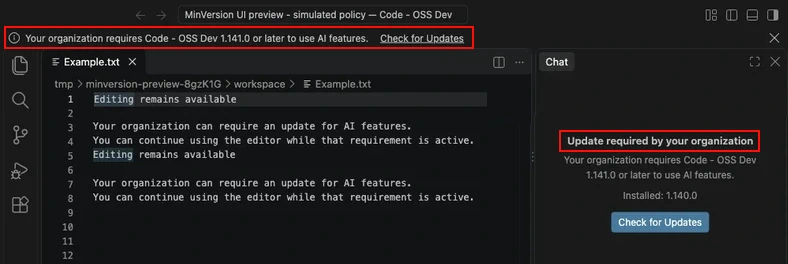
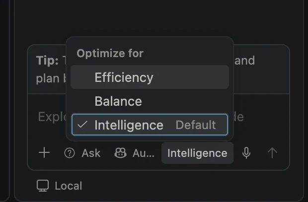

# Visual Studio Code 1.140

<!-- %IF IN_PRODUCT %
Follow us on [LinkedIn](https://www.linkedin.com/showcase/vs-code), [X](https://go.microsoft.com/fwlink/?LinkID=533687), [Bluesky](https://bsky.app/profile/vscode.dev), [Instagram](https://www.instagram.com/vscode.ig) | [View online](https://code.visualstudio.com/updates)
%ENDIF % -->
<!-- %IF IN_WEB %
<p class="release-metadata"><span>Released September 30, 2026</span> <span class="release-channel">Stable</span></p>
%ENDIF % -->
<!-- %IF IN_PRODUCT %
_Release date: September 30, 2026_
%ENDIF % -->

<!-- DOWNLOAD_LINKS_PLACEHOLDER -->

<!-- %IF STABLE %
<p class="release-update-guidance">Already installed? Use <strong>Check for Updates</strong> in VS Code. For upcoming features, use the <a href="https://code.visualstudio.com/insiders">Insiders build</a>.</p>
%ENDIF % -->

<!-- RELEASE_HIGHLIGHTS_START -->
## Release highlights

This release ... <TODO @ntrogh>

* [highlight](#bookmark): <highlight description, including availability or requirements when relevant>
<!-- RELEASE_HIGHLIGHTS_END -->

<!-- %IF IN_PRODUCT %
Happy Coding!

---
%ENDIF % -->

<!-- TOC
<div class="toc-nav-layout">
  <nav id="toc-nav">
    <div>In this update</div>
    <ul>
      <li><a href="#release-highlights">Release highlights</a></li>
      <li><a href="#agents">Agents</a></li>
      <li><a href="#chat">Chat</a></li>
      <li><a href="#mcp">MCP</a></li>
      <li><a href="#accessibility">Accessibility</a></li>
      <li><a href="#editor-experience">Editor Experience</a></li>
      <li><a href="#code-editing">Code Editing</a></li>
      <li><a href="#notebooks">Notebooks</a></li>
      <li><a href="#source-control">Source Control</a></li>
      <li><a href="#debugging">Debugging</a></li>
      <li><a href="#tasks">Tasks</a></li>
      <li><a href="#terminal">Terminal</a></li>
      <li><a href="#authentication">Authentication</a></li>
      <li><a href="#languages">Languages</a></li>
      <li><a href="#enterprise">Enterprise</a></li>
      <li><a href="#contributions-to-extensions">Contributions to extensions</a></li>
      <li><a href="#extension-authoring">Extension Authoring</a></li>
      <li><a href="#proposed-apis">Proposed APIs</a></li>
      <li><a href="#engineering">Engineering</a></li>
      <li><a href="#deprecated-features-and-settings">Deprecated features and settings</a></li>
      <li><a href="#notable-fixes">Notable fixes</a></li>
      <li><a href="#thank-you">Thank you</a></li>
    </ul>
  </nav>
  <div class="notes-main">
Navigation End -->

## Agents

### Copilot harness

The Copilot harness adds exciting new agent functionality to VS Code while keeping the way you work familiar. It's powered by the [Copilot SDK](https://www.npmjs.com/package/@github/copilot-sdk), so its behavior and capabilities are consistent with other Copilot products, including the standalone GitHub Copilot app and the Copilot CLI.

To start using the Copilot harness, select it from the harness picker in the chat input. In this release, it might already be the default selection for you. You can continue working as you normally do.


The harness runs in a dedicated [agent host](https://code.visualstudio.com/docs/agents/concepts/agent-host) process based on the [Agent Host Protocol](https://microsoft.github.io/agent-host-protocol/) (AHP), so you can connect to the same agent session from multiple VS Code windows.

Learn more about the architecture and workflows in the [agent host blog post](https://code.visualstudio.com/blogs/2026/08/26/agent-host-architecture). If you have feedback or requests, [please file an issue](https://github.com/microsoft/vscode/issues).

Eligible users with preview features enabled can select [HydraFusion](https://github.blog/ai-and-ml/github-copilot/project-hydrafusion-frontier-quality-via-multi-model-orchestration/) in the model picker to use a research preview that orchestrates multiple models to plan, draft, critique, and revise coding tasks.

### Multi-folder sessions (Experimental)

An agent session can contain [multiple chats](https://code.visualstudio.com/docs/agents/run/sessions/manage-sessions#_run-multiple-chats-in-a-session), but until now every chat shared the session's single folder and checkout. With multi-folder sessions, each chat can work in its own folder or worktree, so one session can span repositories or compare approaches without changes leaking between chats. What a chat shows and does, such as its changes, terminal, tasks, and pull request, is scoped to its folder.

Multi-folder sessions are experimental and off by default. Enable the setting for the harness you use, and then create a new session. Newly created sessions pick up the change without restarting the Agent Host.

* Copilot: `setting(chat.agentHost.copilotAgent.multiRootEnabled)`
* Claude: `setting(chat.agentHost.claudeAgent.multiRootEnabled)`
* Codex: `setting(chat.agentHost.codexAgent.multiRootEnabled)`

These settings are not shown in the Settings editor. Add the setting for your harness to your user `settings.json` file:

```json
{
  "chat.agentHost.copilotAgent.multiRootEnabled": true
}
```

> **Note**: There is no UI for adding a folder to a session or choosing the folder of a new peer chat. Ask the main chat to create a peer chat in the current session and describe the repository or worktree it should use. If you turn the setting off, new sessions share one folder across all chats again.

#### Implement a feature across repositories

Ask the main chat to work in one repository and to create a peer chat in the current session for a second repository. Each chat shows its own folder, changes, and pull request.

<video src="images/1_140/multi-folder-sessions-cross-repo.mp4" title="Video showing one agent session that adds a field in one repository and shows it in a second repository, and then opens each chat's changes and draft pull request." autoplay loop controls muted></video>

#### Compare approaches in separate worktrees

Ask the main chat to create peer chats that each use a fresh worktree of the same repository. Each chat gets its own worktree, branch, changes, and pull request, so the approaches stay isolated.

<video src="images/1_140/multi-folder-sessions-worktrees.mp4" title="Video showing one agent session that creates two peer chats in separate worktrees of the same repository, and then opens each chat's changes and draft pull request." autoplay loop controls muted></video>

#### What each chat is scoped to

Each chat works with the state of its own folder:

* **Change sets**: **Branch Changes** and **Uncommitted Changes** show only the changes from the chat's folder. **Last Turn Changes** shows the latest turn in that chat. **Session Changes** is hidden in a multi-folder session.
* **Pull requests**: A pull request appears on the chat whose folder it belongs to, including pull requests created outside the Agents window, for example with `gh pr create`. The main chat's hover summarizes the pull requests of all folders.
* **Agent Merge**: Agent Merge runs separately for each folder, with its own settings, pull request, and repair turns. Turning it on or off in one folder doesn't affect the others.

Chats that share a folder share its **Branch Changes**, **Uncommitted Changes**, pull request, and Agent Merge state.

#### Session and chat hovers

Hover over a session in the sessions list to see where its chats work. The top of the hover shows the main chat's own workspace, worktree, branch, changes, and pull request. The **Session summary** at the bottom lists every folder in the session, the combined changes, and each pull request once.



Hover over a nested chat to see only that chat's own folder, worktree, branch, and pull request.



### Archive chats in a session

Finish one part of a multi-chat workflow without hiding the entire session. You can archive an ordinary peer chat independently with **Mark as Done**, while its owning session and sibling chats remain active. To find and restore an archived chat, use the top-level **Done** filter in the sessions list. Restoring returns the chat with its title and transcript intact.

Nested chat rows also provide status hovers, so you can inspect their workspace and progress without opening each chat. In the chat context menu, **Copy Link** appears in the final action group below **Delete**.

Only ordinary peer chats support this action.

### Keep Single presentation predictable

**Setting**: `setting(sessions.showChatTabs)`

In **Single** chat presentation, selecting another peer chat replaces the ordinary unpinned pane instead of leaving hidden chats behind it. A chat that you explicitly open to the side stays visible while you switch the main pane, and closing the last peer-chat pane does not unexpectedly reopen the session's main chat.

### Choose workspace isolation for delegated chats

Agents can create lightweight delegated chats without unnecessary workspace setup:

* A peer chat created for research can reuse the current session's workspace and checkout without creating another worktree.
* An independent session can start without a workspace, even when the source session uses one. The new session does not inherit the source folder.

These options help agents separate planning or research from implementation while preserving the workspace and worktree isolation you choose. Learn more about [orchestrating chats and sessions](https://code.visualstudio.com/docs/agents/run/sessions/manage-sessions#_orchestrate-sessions-from-agent-host-sessions).

### Open a prepared new-session draft from a URL

Open the Agents window from another tool or webpage with a workspace and an editable prompt ready for review. Use a URL with the `agents/new` path and the optional `prompt` and `workspace` query parameters. Use `vscode-insiders://` instead of `vscode://` for VS Code Insiders.

For example, this URL opens a new session with no workspace and the prompt already entered:

```text
vscode://agents/new?prompt=Explain%20how%20this%20project%20runs%20its%20tests.%20Do%20not%20run%20anything%20yet.
```

VS Code places the decoded prompt in the **New Session** composer without sending it. To select a workspace, add the `workspace` parameter with a URL-encoded folder URI. If the URL omits `workspace`, the draft uses **No Workspace**. An existing occupied composer remains unchanged, so opening a link does not overwrite work in progress.

Learn more about [opening VS Code with URLs](https://code.visualstudio.com/docs/configure/command-line#_opening-vs-code-with-urls).

### Higher orchestration limits

**Setting**: `setting(chat.agentHost.agentOrchestrationLimits)`

Coordination-heavy workflows are less likely to stop before the work is complete. The Agent Host uses higher process-wide limits for agent-created sessions, chats, and inter-session messages. Reaching a limit does not interrupt work that is already running.

The setting defaults to `on` and applies changes without an Agent Host restart. Set it to `off` to remove the limits completely.

### Branch picker improvements for worktree sessions

Starting with this milestone, when creating a new worktree session, the branch picker will default to the upstream branch of your current branch, such as `origin/main`. Before creating the worktree, VS Code automatically attempts to fetch the selected remote branch so the session starts from the latest available remote state. The picker also loads branches once per workspace and filters them locally, which significantly reduces search latency, especially in large repositories.


### Create workspace-less chats on remote agent hosts

**Setting**: `setting(sessions.chat.unifiedWorkspacePicker.enabled)` (Agents window only)

[Agent Host](https://code.visualstudio.com/docs/agents/run/remote-agent-sessions) lets you run and track agent sessions on a remote host. This release adds support for running workspace-less chats on a remote host.

Select a connected host from the unified workspace picker without choosing a workspace. The **Chat** entry identifies the selected host, so you can confirm where the session runs before you start.


Remote folders also appear alongside local folders in the main picker. This makes frequently used remote workspaces easier to select without opening the **Remote** submenu.

### Delegate tasks to remote agent hosts (Experimental)

**Settings**: `setting(chat.remoteAgentHostsEnabled)`, `setting(chat.remoteSessions.tools.enabled)` (Agents window only)

Your agent can delegate work to connected [remote agent hosts](https://code.visualstudio.com/docs/agents/run/remote-agent-sessions) from the Agents window, without you selecting a host in a picker for each task.

The new built-in tools let your agent:

* Discover hosts, models, resource capacities, and session load with `list_agent_hosts`.
* Start a session with `create_remote_session`. Specify a host or let automatic placement match an operating system (Windows, Linux, or macOS), minimum memory capacity, logical CPU count, and optional model. Among matching hosts, placement favors the host with the fewest running sessions and pending creations.
* Check a remote session's status and latest response with `get_remote_session`.
* Send follow-up work or report results and questions back to the originating chat with `send_remote_message`.

The tools are off by default. Enable this setting along with `setting(chat.remoteAgentHostsEnabled)` and connect the hosts you want to use. From a chat running on an agent host, ask:

```prompt
Start a remote session on a connected Linux host with at least 16 GiB of memory and eight logical CPUs. Check the installed Node.js and Python versions and report back to this chat.
```

Sessions have no workspace unless you specify one. For repository work, use an existing trusted folder on the target host, either directly or in a new Git worktree. The tools do not clone or copy the originating workspace, and normal approvals still apply.

Keep the coordinating Agents window open and connected for messages to flow. Remote agents report back through `send_remote_message`; their final answers are not automatically forwarded.

### Personalize new-session welcome phrases (Experimental)

**Settings**: `setting(sessions.chat.experimental.welcomePhrases)`, `setting(sessions.chat.experimental.welcomeName)`, `setting(accessibility.verbosity.newSessionWelcome)` (Agents window only)

Add some personality to the Agents window with an optional welcome heading when you create a new session in the Agents window. The heading shows one of five phrases, such as **What are we building?** or **Let's ship something**, and can append your first name from your GitHub profile.


Welcome phrases are off by default. When enabled, you can use **Set Welcome Name** from the heading, its context menu, or the Command Palette to choose a different name. The name syncs across devices. Clear it to use your GitHub first name when available, or a generic phrase when your profile has no name.

When screen reader optimized mode is active, VS Code announces the heading once when the composer appears. Disable `setting(accessibility.verbosity.newSessionWelcome)` if you prefer not to hear the announcement.

### Keep session composer controls together (Experimental)

**Settings**: `setting(sessions.chat.experimental.newSessionComposerLayout)`, `setting(sessions.chat.unifiedWorkspacePicker.enabled)` (Agents window only)

The experimental session composer layout reduces the need to move between separate parts of the Agents window. In a new session, the workspace, branch, worktree, and harness controls are grouped above the chat input.


Enable both settings to use the layout.

The unified workspace picker also has commands for moving directly to its controls. Use `kb(sessions.focusNewSessionWorkspacePicker)` to focus the workspace picker or `kb(sessions.focusNewSessionHarnessPicker)` to focus the harness picker. Hovers show your configured keybindings, and each picker's context menu provides a **Configure Keybinding** action. These keyboard improvements require only the unified workspace picker, not the experimental composer layout.

### See recently completed sessions first

The **Done** section in the Agents window now sorts sessions by when you marked them as done, with the most recently completed session listed first. This order stays the same when you switch between **Created** and **Updated** sorting and after you reload VS Code.

## Chat

### Persistent progress for agent responses (Experimental)

**Settings**: `setting(chat.experimental.persistentProgress)`, `setting(chat.experimental.persistentProgressVerbosity)`

Long-running agent responses are easier to follow with persistent progress. When enabled, chat keeps a progress indicator visible at the bottom until the response finishes.

Enabling persistent progress also improves the rendering and visibility of in-progress responses. Reasoning appears in separate collapsible previews, and tool calls remain visible while they run. With **Compact** verbosity, completed tool groups collapse into expandable summaries when response text resumes or the response finishes. Select **Verbose** to keep the full tool-call details visible.

Use `setting(chat.experimental.persistentProgress)` to turn the indicator off or choose a colored or monochrome Draw animation. The setting defaults to **Draw** in VS Code Insiders and is rolling out gradually to Stable.

<video src="images/1_140/persistent-progress.mp4" title="Video showing persistent progress for an agent response." autoplay loop controls muted></video>

### Terminal output reflow

**Setting**: `setting(chat.tools.terminal.outputReflow)`

Since [VS Code 1.132](https://code.visualstudio.com/updates/v1_132#_terminal-output-reflow), terminal output in chat reflows to fit the width of the output preview.

The new `setting(chat.tools.terminal.outputReflow)` setting lets you control this behavior. If you prefer output to keep a fixed width instead, disable the setting and scroll horizontally to read long lines. Reflow remains enabled by default.

## MCP

### Add MCP servers to portable configuration files

You can add MCP servers to portable configuration files from the **MCP: Add Server** flow, so you can use the same server configuration across compatible Copilot tools without editing JSON manually.

For global servers, choose **Copilot Global** to save the server to `$COPILOT_HOME/mcp-config.json`, or `~/.copilot/mcp-config.json` when `COPILOT_HOME` is not set.


For workspace servers, choose `.mcp.json` to save the server at the workspace root.


### Review MCP server compatibility before migration

Migration warnings identify the MCP servers that need attention instead of leaving you to inspect every configuration. The Agent Customizations editor labels servers that are partially supported or unsupported by the active harness and separates servers that can be migrated from those that can't.

For each affected server, you can review compatibility details, open its source configuration, or select **Edit Configuration** to jump to the relevant JSON. The migration view also preserves disabled server state and explains compatibility limits for an explicit working directory, SSE transport, or version metadata.

Learn more about [migrating Agent Host customizations](https://code.visualstudio.com/docs/agent-customization/overview).


## Accessibility

### Hear when confetti appears

**Setting**: `setting(accessibility.signals.confetti)`

The new **Confetti** accessibility signal provides the same celebratory feedback when you cannot see the animation. The joyful sound plays for chat thumbs-up confetti and when you successfully mark a session as done in the Agents window.

<video src="images/1_140/accessible-confetti.mp4" title="Video showing the Confetti accessibility signal playing when the Mark as Done action displays confetti." autoplay loop controls muted></video>

## Editor Experience


## Code Editing


## Notebooks


## Source Control

### Reuse ignored folders across worktrees (Experimental)

**Setting**: `setting(git.worktreeSymlinkFolders)`

Avoid reinstalling dependencies or duplicating large build artifacts in each [Git worktree](https://code.visualstudio.com/docs/sourcecontrol/branches-worktrees#_understanding-worktrees). Configure `setting(git.worktreeSymlinkFolders)` with `.gitignore`-style patterns for ignored folders, such as `node_modules`. When VS Code creates a new worktree, including for an agent session, it creates symlinks to matching folders in the current checkout.


## Debugging


## Tasks


## Terminal

### Sharper terminal text on macOS (Experimental)

**Setting**: `setting(terminal.integrated.fontRendering)`

On macOS high-DPI displays, terminal text can look softer than the same font in other terminals. Set `setting(terminal.integrated.fontRendering)` to `grayscale` to make terminal text look sharper.

## Authentication


## Languages


## Enterprise

### Explain minimum version requirements

Administrators can require developers to update VS Code before using AI features, for example, to adopt newer sandboxing protections. Instead of an **Update Required** dialog, VS Code now explains the requirement wherever AI features are unavailable:

* **Chat** shows the required and installed versions, with an update action.
* **The editor window** shows a banner even when Chat is closed. Other editor features stay available.
* **The Agents window** shows a blocking overlay, with an **Open Editor Window** action.

When an update is available, VS Code offers the matching **Check for Updates**, **Download Update**, **Install Update**, or **Restart to Update** action. If your organization disables built-in updates by policy, VS Code instead asks you to contact your administrator. The notices clear once the requirement is met. How VS Code enforces the requirement is unchanged.



### Set a default Auto tier

The Auto model in VS Code can operate in different tiers, optimizing for efficiency, balance, or intelligence. Administrators can align the Auto model's default behavior with organizational priorities without preventing developers from choosing another tier.

Administrators can set the default tier for the Auto model with the `autoTier` managed setting. Accepted values are `efficiency`, `balance`, and `intelligence`.

The tier applies to new chats in the Local harness and the Copilot agent host on the same machine. The managed tier appears as **Default** in the model picker.

The managed tier is a starting point, not a restriction. Developers can still choose a different tier. VS Code keeps explicit and restored choices when the managed tier changes or is removed.



### Capture user identity in OpenTelemetry

**Setting**: `setting(github.copilot.chat.otel.captureIdentity)`

Organizations can attribute [Copilot OpenTelemetry](https://code.visualstudio.com/docs/enterprise/ai-settings#_configure-telemetry-export-with-opentelemetry) data to individual developers. When identity capture is enabled, Local chat sessions add the following attributes:

* `user.name` on agent invocation spans, including subagents and inline chat.
* `process.user.name` and `host.name` as resource attributes.

Identity capture is off by default and independent of content capture. Administrators control identity capture with the `telemetry.capture.identity` managed setting (`CopilotOtelCaptureIdentity` policy). A managed value takes precedence over `COPILOT_OTEL_CAPTURE_IDENTITY` and user settings. When a policy denies capture, VS Code removes identity from later exports without a reload, including identity attributes that are set explicitly as resource attributes.

This release also changes how managed telemetry settings are resolved:

* VS Code applies the `telemetry` block from only the highest-priority delivery channel: native MDM, then server, then file. Fields that the selected block omits are no longer filled in from lower-priority channels.
* Managed `telemetry.resourceAttributes` now take precedence over `OTEL_RESOURCE_ATTRIBUTES`.

> **Note**: Identity capture currently applies only to the Local harness. Support for the agent host is tracked in [#337413](https://github.com/microsoft/vscode/issues/337413).

## Contributions to extensions


## Extension Authoring


## Proposed APIs

### Authorization server on authentication sessions

The `authIssuers` proposal lets an extension name the OAuth authorization server it wants to authenticate against, which VS Code introduced for MCP in the [1.101 release notes](https://code.visualstudio.com/updates/v1_101#_authentication-providers-supported-authorization-servers-for-mcp). This release adds the opposite direction, so a session can tell you which authorization server issued it.

```ts
export interface AuthenticationSession {
  /**
   * The authorization server that issued this session, when provided by the authentication provider.
   * This identifies the OAuth server, not a REST API endpoint or resource audience.
   */
  readonly authorizationServer?: Uri;
}
```

If your extension talks to more than one deployment of a service, such as public GitHub and a GitHub Enterprise host, you can pair each credential with the destination it was issued for instead of reading a separate setting that the user can change independently. That removes a class of failure where a valid token is sent to the wrong host.

Two things to keep in mind. The value identifies an OAuth issuer rather than an API endpoint, so map it to your own endpoints. The built-in GitHub provider populates it for public GitHub sessions as well as enterprise ones, so its presence alone does not make a session an enterprise session.

Try it out and let us know what you think in [the API proposal issue](https://github.com/microsoft/vscode/issues/248775). To learn how to build against a proposal, see [using proposed APIs](https://code.visualstudio.com/api/advanced-topics/using-proposed-api).

## Engineering


## Deprecated features and settings

### New deprecations in this release

### Upcoming deprecations


## Notable fixes


<!-- RELEASE_THANK_YOU_START -->
## Thank you

<!-- RELEASE_THANK_YOU_END -->
---

We really appreciate people trying our new features as soon as they are ready, so check back here often and learn what's new.

>If you'd like to read release notes for previous VS Code versions, go to [Updates](https://code.visualstudio.com/updates) on [code.visualstudio.com](https://code.visualstudio.com).

<a id="scroll-to-top" role="button" title="Scroll to top" aria-label="scroll to top" href="#"><span class="icon"></span></a>
<link rel="stylesheet" type="text/css" href="css/inproduct_releasenotes.css"/>
