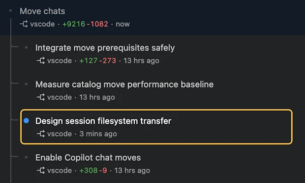

****---
Order: 151
TOCTitle: "1.141"
PageTitle: Visual Studio Code 1.141
MetaDescription: Learn what's new in Visual Studio Code 1.141
MetaSocialImage: 1_141/release-highlights.webp
Date: 2026-10-07
DownloadVersion: 1.141.0
Milestone: 1.141.0
ProductEdition: Stable
---
# Visual Studio Code 1.141

<!-- %IF IN_PRODUCT %
Follow us on [LinkedIn](https://www.linkedin.com/showcase/vs-code), [X](https://go.microsoft.com/fwlink/?LinkID=533687), [Bluesky](https://bsky.app/profile/vscode.dev), [Instagram](https://www.instagram.com/vscode.ig) | [View online](https://code.visualstudio.com/updates)
%ENDIF % -->
<!-- %IF IN_WEB %
<p class="release-metadata"><span>Released October 7, 2026</span> <span class="release-channel">Stable</span></p>
%ENDIF % -->
<!-- %IF IN_PRODUCT %
_Release date: October 7, 2026_
%ENDIF % -->

<!-- DOWNLOAD_LINKS_PLACEHOLDER -->

<!-- %IF STABLE %
<p class="release-update-guidance">Already installed? Use <strong>Check for Updates</strong> in VS Code. For upcoming features, use the <a href="https://code.visualstudio.com/insiders">Insiders build</a>.</p>
%ENDIF % -->

<!-- RELEASE_HIGHLIGHTS_START -->
## Release highlights

This release ... <TODO @ntrogh>

* [highlight](#bookmark): <highlight description, including availability or requirements when relevant>
<!-- RELEASE_HIGHLIGHTS_END -->

<!-- %IF IN_PRODUCT %
Happy Coding!

---
%ENDIF % -->

<!-- TOC
<div class="toc-nav-layout">
  <nav id="toc-nav">
    <div>In this update</div>
    <ul>
      <li><a href="#release-highlights">Release highlights</a></li>
      <li><a href="#agent-loop">Agent loop</a></li>
      <li><a href="#agent-ux">Agent UX</a></li>
      <li><a href="#agent-environments">Agent environments</a></li>
      <li><a href="#agent-security">Agent security</a></li>
      <li><a href="#chat-experience">Chat experience</a></li>
      <li><a href="#mcp">MCP</a></li>
      <li><a href="#editor-experience">Editor experience</a></li>
      <li><a href="#authentication">Authentication</a></li>
      <li><a href="#enterprise">Enterprise</a></li>
      <li><a href="#engineering">Engineering</a></li>
      <li><a href="#deprecated-features-and-settings">Deprecated features and settings</a></li>
      <li><a href="#thank-you">Thank you</a></li>
    </ul>
  </nav>
  <div class="notes-main">
Navigation End -->

## Agent loop

### Copilot harness

The Copilot harness adds exciting new agent functionality to VS Code. It's powered by the Copilot SDK, so its behavior and capabilities are consistent with other Copilot products, including the standalone GitHub Copilot app and the Copilot CLI.

To start using the Copilot harness, select it from the harness picker in the chat input. In this release, it might already be the default selection for you. You can continue working as you normally do.


The harness runs in a dedicated [agent host](https://code.visualstudio.com/docs/agents/concepts/agent-host) process based on the Agent Host Protocol (AHP), so you can connect to the same agent session from multiple VS Code windows.

Learn how to [work with the Copilot harness](https://code.visualstudio.com/docs/agents/run/agent-harnesses#use-the-copilot-harness), or explore the architecture and workflows in the [agent host blog post](https://code.visualstudio.com/blogs/2026/08/26/agent-host-architecture). If you have feedback or requests, [please file an issue](https://github.com/microsoft/vscode/issues).

### Keep track of background shells

When the agent runs a command in the background, it keeps working on other steps while the command runs. In [Copilot harness](#copilot-harness) sessions, a **Background Shells** pill above the chat input lists the shells that are still running, in both the Agents window and the editor window.

Select the pill to see each shell's command and how long it has been running, and select a shell to watch its output stream in as the command runs, if output is available. A shell leaves the list when its command finishes.


### More control for agent-triggered messages

When agents delegate work across conversations, they can adjust the delegated task as requirements change instead of waiting for the other session to finish. The `send_message` tool supports these actions between sessions and nested sessions on the same agent host:

* Steer an active conversation with a correction.
* Queue a follow-up as a separate turn.
* Replace a queued message while preserving its place in the queue.
* Cancel a queued message before processing begins.

Queued messages run in order. After a message starts processing, it can no longer be replaced or cancelled.

## Agent UX

### Arrange sessions in a grid

Compare results, monitor long-running tasks, or work across related conversations without repeatedly switching between sessions. Like in the editor window, the two-dimensional session grid in the Agents window lets you drag sessions into horizontal or vertical splits and resize the panes.

Maximize a session when you need to focus, then return to the grid to continue working across conversations.

<video src="images/1_141/sessions-grid.mp4" title="Video showing multiple agent sessions arranged in a grid in the Agents window." autoplay loop controls muted></video>

### Compact layout density

**Setting**: `setting(window.density.layout)`

Fit more content in the Agents window with the Compact layout density. Compact density uses a shorter title bar, removes the gaps between workbench parts, and reduces pane spacing.

By default, the Agents window follows the user-level `setting(window.density.layout)` setting, which also applies to editor windows. To set a different density for the Agents window only, open it and choose **View > Layout Density**. The density of editor windows remains unchanged.

<video src="images/1_141/agents-compact-mode.mp4" title="Video showing the Agents window in compact layout density." autoplay loop controls muted></video>

### Additional session-filtering options

Focus your sessions list on the work you care about. Open **Filter Sessions** to filter independently by:

* **Environment**: Where the session runs, such as locally, in the cloud, or on a remote host.
* **Harness**: Which agent harness the session uses.
* **Created In**: Which application created the session, such as VS Code, Copilot CLI, or the Copilot app.

The menu also brings together ordering, grouping, **Show Done**, and **Created Externally** controls.


### Track activity across nested sessions

[Nested sessions](https://code.visualstudio.com/docs/agents/run/sessions/manage-sessions#_run-multiple-chats-in-a-session) let you split related work across separate conversations. In the Agents window, each nested session shows its unread status and last-modified time, helping you find recent activity and conversations that need your attention without opening them individually.



Status is tracked independently for each conversation:

* Opening a nested session marks only that conversation as read. An unread nested session does not make the main session appear unread.
* The last-modified time reflects activity in that conversation, not activity in the main session or another nested session.

Read status and last-modified times persist when you reload the window or restart VS Code.

To clear unread status for an entire session tree, right-click the main session and select **Mark as Read**. Unrelated sessions are not affected.

### Simplified new-session controls (Experimental)

**Settings**: `setting(sessions.chat.experimental.newSessionComposerLayout)`, `setting(sessions.chat.unifiedWorkspacePicker.enabled)` (Agents window only)

The experimental new-session composer keeps your prompt at the center while making session choices easier to review. Workspace, repository, and harness controls now appear in a collapsible **Session Options** tray above the chat input.

<video src="images/1_141/new-session-composer-options.mp4" title="Video showing the new-session composer expanding and collapsing workspace, worktree, branch, and harness controls." autoplay loop controls muted></video>

Getting-started tips now appear in a rounded notice below the chat input, so they no longer separate the session controls from your prompt.


Collapse the tray to reduce visual clutter without changing your selections. The composer remembers your choice, adapts labels as the window narrows, and keeps the options expanded when screen reader optimized mode is active. When you use a custom chat background, the tray has an opaque surface to keep its controls readable.

### Add Context opens beside your prompt

The **Add Context** picker now opens next to the button that invoked it and closes when you select the button again. This keeps the picker visually connected to the chat input in the editor and Agents windows.


### Agent picker in Add Context (Experimental)

**Setting**: `setting(sessions.chat.experimental.agentsPickerInAttachContextMenu)` (Agents window only)

Reduce the number of persistent controls around the chat input by initially placing the **Agent** picker in **Add Context**. The agent selection remains easy to discover alongside the other context actions.

<video src="images/1_141/agent-picker-in-add-context.mp4" title="Video showing the Agent picker moving from Add Context to the chat toolbar after an agent is selected." autoplay loop controls muted></video>

After you select an agent, including the current default, its picker returns to the chat toolbar for that session.

### Customize new-session welcome messages (Experimental)

**Settings**: `setting(sessions.chat.experimental.welcomePhrases)`, `setting(sessions.chat.experimental.welcomeMessages)` (Agents window only)

New-session welcome messages add personality to the Agents window. In this release, you can add your own phrases to the defaults or replace the default phrases. Use the `{name}` placeholder to position your welcome name anywhere in a phrase.

<video src="images/1_141/customize-welcome-phrases.mp4" title="Video showing a personalized new-session welcome phrase and the welcome name editor." autoplay loop controls muted></video>

Select **Customize Welcome Message** beside the heading to change your name or open the phrase setting. You can also right-click the heading and select **Hide Welcome Message** to turn welcome phrases off.

### Reclaim storage from inactive worktrees

Run **Chat: Open Worktree Cleanup** to see how much disk space inactive agent session worktrees use and remove the ones you no longer need. Filter sessions by how long they have been inactive, review each worktree's size, and select the worktrees to clean up.

The cleanup editor also lets you configure automatic cleanup for sessions with merged pull requests and control whether VS Code suggests cleanup when session storage grows large.


When `setting(chat.agentSessions.sessionStorageCleanupSuggestion.enabled)` is enabled, the Agents window notifies you when enough inactive worktrees accumulate or they use enough disk space to make cleanup worthwhile.


Cleaning up marks the selected sessions as done and deletes their worktrees. You can restore a session later to recreate its worktree. Active, running, needs-input, and pinned sessions are protected from cleanup.

## Agent environments

### Continue external Copilot sessions without reloading

New conversations from the Copilot CLI and GitHub Copilot app are now picked up automatically as external sessions as soon as you send the first request, even when the Agents window is already open. You can open and continue these conversations directly from the Agents window.

<video src="images/1_141/copilot-sessions-live.mp4" title="Video showing a new Copilot conversation appearing as an external session in the Agents window without reloading." autoplay loop controls muted></video>

Use the **Created In** and **Created Externally** filters to choose which conversations appear in the sessions list.

### Codex chat handoff between apps

Pick up a Codex chat started in the ChatGPT app or Codex CLI and continue it in VS Code's Agents window on the same machine, with your conversation history intact. You can switch back to the ChatGPT app or Codex CLI later and continue the same chat.

To use your GitHub Copilot subscription in VS Code, choose a Copilot model in the model picker. For example, you can keep working with Copilot after reaching your ChatGPT usage limit.

With [Codex enabled](https://code.visualstudio.com/docs/agents/run/agent-harnesses#codex) and **Created Externally** sessions visible, chats created or updated in ChatGPT or Codex CLI appear within a few seconds without reloading VS Code.

Only one application can send messages to the chat at a time. If ChatGPT or Codex CLI still has the chat open, a **This chat is open in another app** banner in VS Code explains why sending is unavailable. Fully quit ChatGPT or exit the Codex CLI session, then select **Retry**. Your draft and attachments stay in place, and **Retry** checks access without sending your message.

<video src="images/1_141/chatgpt-codex-handoff.mp4" title="Video showing a Codex chat started in ChatGPT continuing in VS Code with a GitHub Copilot subscription, including the lock banner and Retry action." autoplay loop controls muted></video>

### Download remote files from the editor

Save an open remote file locally without finding it again in the Files explorer. In the Agents window, open the editor's **More Actions** menu and select **Download...** to choose a local destination.

### Dev Container samples (Experimental)

**Setting**: `setting(chat.agentHost.devContainer.samples.enabled)` (Agents window only)

Try an agent with a ready-to-use development environment without first cloning a repository or installing its language tools locally. The Agents window now offers Dev Container samples for Go, .NET, Node.js, PHP, Python, and Rust.


With [Docker installed and running](https://code.visualstudio.com/docs/devcontainers/containers#installation), enable the setting, open a new session in the desktop Agents window, and select **Dev Container Sample** from the workspace picker and send a prompt. This also requires `setting(chat.agentHost.devContainer.enabled)` and `setting(chat.remoteAgentHostsEnabled)` to be enabled.

### Use plugin-relative paths for MCP servers and hooks

[Agent plugins](https://code.visualstudio.com/docs/agent-customization/agent-plugins) bundle skills, tools, and other customizations into a shared workflow. Plugins can reference bundled scripts and servers without requiring you to replace those references with machine-specific installation paths.

For plugins in the Agent Plugins 1.0 format, VS Code expands `${PLUGIN_ROOT}` to the installed plugin directory in stdio MCP server arguments, environment values, and working directories. It also sets the `PLUGIN_ROOT` environment variable and uses the plugin directory as the default working directory. Server commands that start with `./` resolve relative to that directory.

In the **Local** harness, plugin hooks and hooks contributed by plugin-provided custom agents also receive the plugin root. `${PLUGIN_ROOT}` references in hook commands resolve to the contributing plugin's directory.

These changes address bundled servers and hooks that previously failed because they received a literal `${PLUGIN_ROOT}` reference. Runtime-owned placeholders such as `${PLUGIN_DATA}` remain unchanged.

## Agent security

### Sandboxing in the Copilot agent host

**Settings**: `setting(chat.agent.sandbox.enabled)`, `setting(chat.agent.sandbox.network.allowNetwork)`, `setting(chat.agent.sandbox.network.allowLocalNetwork)`, `setting(chat.agent.sandbox.allowUnsandboxedCommands)`, `setting(chat.agent.sandbox.mcpServers)`, `setting(chat.agent.sandbox.lspServers)`, `setting(chat.agent.sandbox.credentials.authenticategit)`, `setting(chat.agent.sandbox.credentials.authenticategh)`, `setting(chat.agent.sandbox.fileSystem.allowDevToolAccess)`, `setting(chat.agent.sandbox.fileSystem.userConfiguredPaths)`

Sandboxing gives you more control over what Copilot can access while working on a task. It limits supported agent operations' access to files and network resources, helping reduce the impact of model mistakes, prompt injection, untrusted dependencies, and locally launched tool servers.

Depending on the operation and platform, these restrictions use operating-system protections or checks within the agent host process. Sandboxing adds a layer of protection, but does not replace endpoint security or provide a standalone security boundary.

Sandboxing is available on **Windows, macOS, and Linux**. On Windows, required operating-system updates must be installed. *[Insert link to the Windows sandboxing prerequisites.]*

#### Local and remote sessions

Sandboxing works with both local and connected remote agent hosts. For local sessions, restrictions apply on your machine. For remote sessions, they apply on the remote host where Copilot's tools and commands execute. Filesystem permissions refer to paths on the machine running the agent.

#### Enable sandboxing

In Settings, set **Chat › Agent › Sandbox: Enabled** to **On**, or add:

```json
{
  "chat.agent.sandbox.enabled": "on"
}
```

You can customize filesystem permissions and network access in Settings. Locally launched MCP and language servers are sandboxed by default when sandboxing is enabled.

Sandboxing can also be controlled at the session level using the **Sandboxing for terminal** toggle in the **Permissions** menu, as shown below.


## Chat experience

### Persistent progress in chat

**Settings**: `setting(chat.experimental.persistentProgress)`, `setting(chat.experimental.persistentProgressVerbosity)`

Last week, we introduced a new way of showing progress in VS Code Copilot Chat. This week, we're rolling this out to all users! Enabling persistent progress improves the rendering and visibility of in-progress responses, while still allowing for select chat pieces to be more or less visible.

There are 3 variants of persistent progress via `setting(chat.experimental.persistentProgress)`, allowing for options to see the icon in monochrome, or to hide the icon entirely.

### Introducing: Blobby!

We received thousands of name suggestions for the `/vscode-pet` and finally decided on Blobby! You can find him in any chat across the editor window and the Agents window in VS Code by typing `/vscode-pet`.

Try summoning him with his name `/blobby` to customize Blobby even further! Unlock more customizations as you explore the chat to unlock new achievements.

To learn more about Blobby, check out our [docs!](https://code.visualstudio.com/docs/agents/reference/chat-pet)


## MCP

### See discovered MCP servers in Customizations editor (Preview)

Find MCP servers supplied by plugins, extensions, and built-in integrations alongside your configured servers in the **MCP Servers** section of the Agent Customizations editor. Servers discovered outside your workspace's `mcp.json` are visible in the UI, so you don't have to use **MCP: List Servers** to find them.

Run **Chat: Open Customizations** from the Command Palette and select **MCP Servers** to inspect the available integrations. Learn more about [adding and managing MCP servers](https://code.visualstudio.com/docs/agent-customization/mcp-servers).

## Editor experience

### Frosted glass overlays and menus

**Settings**: `setting(workbench.modernUIFrostedGlass)`, `setting(workbench.modernUIFrostedGlassOpacity)`

Menus, the Command Palette, and other pop-ups now use softly blurred, frosted glass backgrounds in the desktop Agents window. Frosted glass is also available in editor windows when the modernized UI is enabled with `setting(workbench.experimental.modernUI)`.

Use `setting(workbench.modernUIFrostedGlassOpacity)` to control how much of the blurred content shows through. Lower values make the background more transparent, while higher values make it more solid.

Frosted glass respects reduced-transparency preferences in VS Code and your operating system, and uses solid backgrounds with high contrast themes or when the effect isn't supported. Disable `setting(workbench.modernUIFrostedGlass)` if you notice display or performance issues.

<video src="images/1_141/frosted-glass.mp4" title="Video showing the frosted glass effect in the editor with the modernized UI enabled." autoplay loop controls muted></video>

### Choose your tab style (Experimental)

**Setting**: `setting(workbench.experimental.modernUIEditorTabStyle)`

When the modernized UI is enabled (`setting(workbench.experimental.modernUI)`), you can choose between two tab styles:

* `connected`: visually connect the active tab to its content.
* `pill`: display tabs as separate rounded pills.


### Spreading block pasting

**Setting**: `setting(editor.multiCursorPaste)`

This iteration, we added support for spreading a copied block with `kbstyle(Shift+Option+Click)` into one cursor, so that each copied row is pasted into successive destination lines. This behavior is enabled by default, with `setting(editor.multiCursorPaste)` configured to `spread`. You can turn off this behavior by changing the value to `full`.

<video src="images/1_141/block-pasting.mp4" title="Video showing the new behavior of block pasting." autoplay loop controls muted></video>

## Authentication

### Sign in to multiple GitHub Enterprise instances

Many organizations use GitHub Copilot through a GHE.com account but keep their code on GitHub Enterprise Server (GHES). The `github-enterprise.uri` setting held a single instance, so you couldn't be signed in to both at once. For example, you couldn't use Copilot with your GHE.com account and review pull requests on GHES in the same VS Code window.

The new `setting(github-enterprise.uris)` setting takes a list of GHE.com and GHES instances:

```json
"github-enterprise.uris": [
  "https://octocat.ghe.com",
  "https://github.contoso.com"
]
```

The GitHub Enterprise authentication provider holds accounts from every instance in the list. Each account is labeled with its host, such as `monalisa - octocat.ghe.com`, so you can tell them apart in the Accounts menu. When more than one instance is configured, signing in asks which instance to use. The order of the entries doesn't select a default instance.

To check or change which account an extension uses, select **Manage Extension Account Preferences...** in the Accounts menu, or run **Accounts: Manage Extension Account Preferences...** from the Command Palette.

These extensions support multiple instances:

* **GitHub Copilot** works with GHE.com instances. When you sign in with **Continue with GHE.com**, you can enter an instance name, such as `octocat`, or its full URL. VS Code adds the instance to `setting(github-enterprise.uris)` without removing your other instances, and if an existing entry isn't a valid URL, it offers to fix that entry.
* **GitHub Pull Requests** offers to add the host to `setting(github-enterprise.uris)` when you open a repository from an enterprise instance that isn't configured yet. It uses one GitHub Enterprise account at a time, so repositories on your other instances are available after you switch accounts. Using several enterprise instances at the same time is tracked in [microsoft/vscode-pull-request-github#9004](https://github.com/microsoft/vscode-pull-request-github/issues/9004).
* **GitHub Repositories** opens repositories from several GHE.com instances side by side. It doesn't support GHES repositories.

If you already use `github-enterprise.uri`, you stay signed in. The first time you launch this release, VS Code moves your stored credentials to work with the new setting. `github-enterprise.uri` is deprecated. When both settings are set, `setting(github-enterprise.uris)` takes precedence, and an empty list (`[]`) turns off GitHub Enterprise sign-in.

## Enterprise

### Migration of legacy VS Code policies to Agent Host managed settings

In this release, we're gradually rolling out the [Copilot harness](https://code.visualstudio.com/docs/agents/run/agent-harnesses#use-the-copilot-harness), powered by the Copilot SDK and running in VS Code's Agent Host, as the default for enterprise users with VS Code experiments enabled.

To help preserve existing enterprise controls during this transition, VS Code translates supported legacy policies into unified managed settings on a best-effort basis at run-time for sessions on the same machine. This does not migrate your policy configuration.

Enterprises should still migrate to [unified managed settings](https://docs.github.com/en/copilot/how-tos/administer-copilot/manage-for-enterprise/use-managed-settings/get-started) where applicable for consistent policy management across VS Code, the GitHub Copilot app, and Copilot CLI.

### Use managed settings to require sandboxing (Preview)

To require sandboxing in Copilot Agent Host and prevent bypass, use these [unified managed settings](https://docs.github.com/en/copilot/how-tos/administer-copilot/manage-for-enterprise/use-managed-settings/get-started):

```json
{
    "sandbox": {
        "enabled": true,
        "allowBypass": false
    }
}
```

Legacy VS Code sandbox settings and device policies are deprecated. `ChatAgentSandboxEnabled` now supplies an overridable default rather than a mandatory requirement in Agent Host; Local behavior is unchanged.

### Attribute Agent Host sessions to users and machines

Administrators can more easily attribute Agent Host sessions to users and machines by including operating system usernames and hostnames in VS Code's Agent Host telemetry. Merge this example into your [unified managed settings](https://docs.github.com/en/copilot/how-tos/administer-copilot/manage-for-enterprise/use-managed-settings/get-started), alongside your existing telemetry exporter configuration:

```json
{
    "telemetry": {
        "enabled": true,
        "capture": {
            "identity": true
        }
    }
}
```

For example, captured identity attributes can include (illustrative values):

```json
{
    "user.name": "octokit",
    "process.user.name": "devuser",
    "host.name": "dev-workstation"
}
```

The OS username (`process.user.name`) and hostname (`host.name`) are resource attributes. The signed-in GitHub username (`user.name`) appears on runtime spans when supported by the bundled Copilot runtime.

Identity capture is off by default, and the managed value overrides personal preferences. It is independent of content capture. VS Code's host-side control does not govern a runtime's direct exports.

### Keep your selected agent through policy checks

When your enterprise requires a fresh policy check with [`forceRemoteSettingsRefresh`](https://github.com/github/docs/blob/main/content/copilot/reference/copilot-cli-reference/cli-config-dir-reference.md#supported-keys), chat preserves your selected agent during policy checks instead of switching to **Ask** or **Edit**. Routine background refreshes also keep the last accepted policy active while loading. Startup, account changes, and failed refreshes still block submissions until policy checks succeed, and newly accepted restrictions still apply.

## Engineering


## Deprecated features and settings

### GitHub Enterprise URI setting

The `github-enterprise.uri` setting is deprecated in favor of `setting(github-enterprise.uris)`, which accepts multiple GHE.com and GitHub Enterprise Server instances. VS Code still reads `github-enterprise.uri` when `setting(github-enterprise.uris)` isn't configured.

<!-- RELEASE_THANK_YOU_START -->
## Thank you

Contributions to `vscode`:

* [@dzamoshchin (Daniel Zamoshchin)](https://github.com/dzamoshchin): Mark virtual tool groups as used when they are activated [PR #338812](https://github.com/microsoft/vscode/pull/338812)
* [@jimmylewis (Jimmy Lewis)](https://github.com/jimmylewis): extensions: keep update checks on polling cadence [PR #339365](https://github.com/microsoft/vscode/pull/339365)
* [@na2co3-ftw (na2co3)](https://github.com/na2co3-ftw): Modern UI: Fix redundant tab action fading in connected editor tabs [PR #336871](https://github.com/microsoft/vscode/pull/336871)
* [@rohit489 (Rohit Agrawal - MSFT)](https://github.com/rohit489): Record CAPI X-GitHub-Copilot-Request-Te on GitHub telemetry events [PR #339087](https://github.com/microsoft/vscode/pull/339087)
* [@shoemoney (Jeremy Schoemaker)](https://github.com/shoemoney): fix(markdown): preserve non-line fragments in preview links [PR #332661](https://github.com/microsoft/vscode/pull/332661)
* [@SimonSiefke (Simon Siefke)](https://github.com/SimonSiefke)
  * fix: memory leak in terminal replay [PR #338252](https://github.com/microsoft/vscode/pull/338252)
  * fix: memory leak in semantic tokens [PR #336024](https://github.com/microsoft/vscode/pull/336024)
  * fix: memory leak in search editor [PR #331014](https://github.com/microsoft/vscode/pull/331014)
  * terminal: cancel unnecessary telemetry timeout on disposal [PR #333963](https://github.com/microsoft/vscode/pull/333963)
  * fix: memory leak in animation frame window disposal [PR #338263](https://github.com/microsoft/vscode/pull/338263)
  * fix: memory leak in chat participant disposal [PR #338230](https://github.com/microsoft/vscode/pull/338230)
  * fix: memory leak in custom document disposal [PR #338250](https://github.com/microsoft/vscode/pull/338250)
  * fix: memory leak in mapped edit provider disposal [PR #338245](https://github.com/microsoft/vscode/pull/338245)
  * fix: memory leak in extension host telemetry [PR #334096](https://github.com/microsoft/vscode/pull/334096)
  * fix: memory leak in auxiliary window font measurements [PR #338255](https://github.com/microsoft/vscode/pull/338255)
  * fix: memory leak in SCM artifact commands [PR #338251](https://github.com/microsoft/vscode/pull/338251)
  * fix: memory leak in pixel ratio window disposal [PR #338257](https://github.com/microsoft/vscode/pull/338257)
  * fix: memory leak in integrated browser element handles [PR #338247](https://github.com/microsoft/vscode/pull/338247)
  * fix: memory leak in terminal horizontal scrollbars [PR #338241](https://github.com/microsoft/vscode/pull/338241)
  * fix: memory leak in extension host tree view disposal [PR #338235](https://github.com/microsoft/vscode/pull/338235)
  * fix: memory leak in composite drag and drop registrations [PR #338215](https://github.com/microsoft/vscode/pull/338215)
  * fix: memory leak in integrated browser inspector sessions [PR #338228](https://github.com/microsoft/vscode/pull/338228)
  * fix: memory leak in chatInputPart [PR #327157](https://github.com/microsoft/vscode/pull/327157)
  * fix: memory leak in terminal shell execution streams [PR #338243](https://github.com/microsoft/vscode/pull/338243)
  * fix: memory leak in notebook cell status bar commands [PR #336028](https://github.com/microsoft/vscode/pull/336028)
  * fix: memory leak in issueReporterModel [PR #335098](https://github.com/microsoft/vscode/pull/335098)
  * fix: memory leak in image carousel editor [PR #333981](https://github.com/microsoft/vscode/pull/333981)
  * fix: memory leak in notebook serializer disposal [PR #338212](https://github.com/microsoft/vscode/pull/338212)
  * fix: memory leak in MainThreadShare [PR #334110](https://github.com/microsoft/vscode/pull/334110)
  * fix: memory leak in multi diff editor tabs [PR #333186](https://github.com/microsoft/vscode/pull/333186)
  * fix: memory leak in test observer disposal [PR #338213](https://github.com/microsoft/vscode/pull/338213)
  * fix: memory leak in modalEditorPart [PR #326885](https://github.com/microsoft/vscode/pull/326885)
  * fix: memory leak in comment thread disposal [PR #338216](https://github.com/microsoft/vscode/pull/338216)
  * fix: memory leak in line data event addon [PR #332139](https://github.com/microsoft/vscode/pull/332139)
  * fix: memory leak in notebook kernel source menus [PR #338218](https://github.com/microsoft/vscode/pull/338218)
* [@soreavis](https://github.com/soreavis): JSON - support ${workspaceFolder} in json.schemas fileMatch patterns [PR #326706](https://github.com/microsoft/vscode/pull/326706)
* [@yuezhang030](https://github.com/yuezhang030): Add vscModelF prompt [PR #338809](https://github.com/microsoft/vscode/pull/338809)

### Issue tracking

Contributions to our issue tracking:

* [@gjsjohnmurray (John Murray)](https://github.com/gjsjohnmurray)
* [@RedCMD (RedCMD)](https://github.com/RedCMD)
* [@IllusionMH (Andrii Dieiev)](https://github.com/IllusionMH)
* [@albertosantini (Alberto Santini)](https://github.com/albertosantini)

<!-- RELEASE_THANK_YOU_END -->
---

We really appreciate people trying our new features as soon as they are ready, so check back here often and learn what's new.

>If you'd like to read release notes for previous VS Code versions, go to [Updates](https://code.visualstudio.com/updates) on [code.visualstudio.com](https://code.visualstudio.com).

<a id="scroll-to-top" role="button" title="Scroll to top" aria-label="scroll to top" href="#"><span class="icon"></span></a>
<link rel="stylesheet" type="text/css" href="css/inproduct_releasenotes.css"/>
