# July 2017 (version 1.15)

**Update 1.15.1**: The update addresses these [issues](https://github.com/Microsoft/vscode/milestone/51?closed=1).

Downloads: [Windows](https://vscode-update.azurewebsites.net/1.15.1/win32-x64/stable) | [Mac](https://vscode-update.azurewebsites.net/1.15.1/darwin/stable) | Linux 64-bit: [.tar.gz](https://vscode-update.azurewebsites.net/1.15.1/linux-x64/stable) [.deb](https://vscode-update.azurewebsites.net/1.15.1/linux-deb-x64/stable) [.rpm](https://vscode-update.azurewebsites.net/1.15.1/linux-rpm-x64/stable) | Linux 32-bit: [.tar.gz](https://vscode-update.azurewebsites.net/1.15.1/linux-ia32/stable) [.deb](https://vscode-update.azurewebsites.net/1.15.1/linux-deb-ia32/stable) [.rpm](https://vscode-update.azurewebsites.net/1.15.1/linux-rpm-ia32/stable)

---

Welcome to the July 2017 release of Visual Studio Code. There are a number of significant updates in this version that we hope you will like, some of the key highlights include:

* **[Large file support](#large-file-support)** - Improved performance for large files, no size limit on 64-bit machines.
* **[64-bit Windows builds](#windows-64-bit)** - Use your computer's full address space with the 64-bit builds.
* **[Find in Markdown preview](#search-in-markdown-preview)** - Full search for Release Notes, Markdown preview, and Extensions.
* **[Auto-indent, Emmet 2.0 on by default](#auto-indentation)** - Source code auto-indenting and new Emmet support.
* **[Custom syntax highlighting](#user-definable-syntax-highlighting-colors)** - Easily adjust editor colors to your liking.
* **[Terminal environment variables](#configure-environment-of-terminal-sessions)** - Preconfigure the Integrated Terminal environment.
* **[Color picker UI](#color-picker)** - Quickly create colors in your CSS, SASS, and Less files.
* **[Loaded Scripts Explorer](#loaded-scripts-explorer)** - Easily review and step through loaded scripts during Node.js debugging.
* **[Markdown preview plugins](#support-for-markdown-preview-plugins)** - Add styles, scripts or plug-ins to Markdown previews.
* **[code.visualstudio.com updates](#new-documentation)** - Tutorials for React, Angular and deploying Node.js to Azure.
* **[Preview: Multi-root workspaces](#preview-multi-root-workspaces)** - Settings and debug configurations across multiple projects (Insiders build).

>If you'd like to read these release notes online, you can go to [Updates](https://code.visualstudio.com/updates) on [code.visualstudio.com](https://code.visualstudio.com).

The release notes are arranged in the following sections related to VS Code focus areas. Here are some further updates:

* **[Editor](#editor)** - Predefined snippet choices, improved auto-indenting and diff editor.
* **[Workbench](#workbench)** - Customizable Explorer sort order and view layout, prefilled Quick Open actions.
* **[Integrated Terminal](#integrated-terminal)** - Improved switching, delete word keyboard shortcuts.
* **[Tasks](#tasks)** - Less and Sass compiler output parsing, new Status Bar display.
* **[Extension Authoring](#extension-authoring)** - Multi-root support for debugging and settings, new Markdown Preview API.

**Insiders:** Want to see new features as soon as possible? You can download the nightly Insiders [build](https://code.visualstudio.com/insiders) and try the latest updates as soon as they are available.

## Editor

### Large file support

Large files are always a great way to stress-test an editor. We currently use a line based representation of the text buffer, which has some serious advantages, but also disadvantages, especially in terms of memory consumption (for example, a file with very many short lines).

Any file that is over 30MB or over 300K lines will now be considered a large file and will be handled specially in some circumstances. By disabling certain features for large files, for example tokenization, line guides, and wrapping or folding, we were able to optimize memory usage, in some cases, by as much as 50%. Additionally, large files will never travel to our web worker, which computes diff information, link detection, or word based completions. This helps in reducing the memory pressure on the operating system.

Some of the optimizations will impact all files, although the effects should not be noticeable for small files. We decided to remove the hard-coded file size limit of 50MB on 64-bit installations and enforce a 300MB file size limit on 32-bit installations. Refer to [#30180](https://github.com/Microsoft/vscode/issues/30180) for more information about the different optimizations.

### Color Picker

We've introduced a color picker for color customizations in this release. It supports configuration of hue, saturation and opacity for the color that is picked up from the editor. It also provides the ability to trigger between different color modes by clicking on the color string at the top of the picker. The picker appears on a hover when you are over the color definition in a document.

​

For the preview, we enabled it for CSS, Sass and LESS files, supporting RGBA, HSLA and Hex color modes. We plan to extend the picker with more functionality as well as to enable extension authors to contribute their own color modes together with color definitions for their languages in future releases.

### Auto indentation

In this milestone, we've turned on auto-indenting by default (`"editor.autoIndent": true`). If the language you are working with has proper indentation rules (for example, TypeScript, JSON, CSS), the indentation will be adjusted when you type, move lines and paste blocks of code.

### Emmet 2.0

Two releases ago, we introduced a new Emmet implementation ("Emmet 2.0"). During it's preview, users could opt-in and try new features such as showing Emmet abbreviations in the suggestion/auto-completion list and multi-cursor support for most of the [Emmet actions](https://docs.emmet.io/actions/). In this release, Emmet 2.0 and these features are enabled by default.

Now that Emmet abbreviations are displayed in the suggestion/auto-completion list, VS Code no longer triggers Emmet abbreviations with the `kbstyle(Tab)` key by default. This solves 2 major issues:

* Unexpected Emmet expansions occurring when the user wanted to just add an indent using the `kbstyle(Tab)` key.
* Items from the suggestion list getting inserted when the user actually wanted to expand an Emmet abbreviation.

You can still bind any keyboard shortcut (other than `kbstyle(Tab)` key) to the `editor.emmet.action.expandAbbreviation` command or use **Emmet: Expand Abbreviation** from the **Command Palette**.

>**Note**: To continue to expand Emmet abbreviations and snippets using the `kbstyle(Tab)` key, set `emmet.triggerExpansionOnTab` to `true`.

#### Custom Emmet Snippets

If you use custom Emmet snippets, you will have to modify them slightly to make them work in the new Emmet.

* HTML: Custom Emmet snippets in HTML should be a valid abbreviation. For example: use `ul>li` instead of `<ul><li></li></ul>`.
* CSS: Name the custom Emmet snippets in CSS such that they only contain letters from the snippet value in the order that they appear in the latter, so that the fuzzy matching algorithm of the suggestion list can make the right match. For example, don't use `bc` or `darkc` as the name for `color: black`. Use `cb` or `cob` instead.

Read more about the new Emmet in [Emmet 2.0 blog post](https://code.visualstudio.com/blogs/2017/08/07/emmet-2.0).

### Support for snippet choices

With snippet choices, a placeholder can be prefilled with a set of values. The syntax is `${<number>|option_1,...,option_n|}`.

Below is a working sample specifying a fixed set of color choices:

```json
"color": {
  "prefix": "color",
  "body": "> Pick your favorite color ${1|red,green,blue,pink|}.\n< He likes $1."
}
```

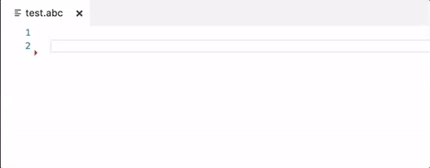

Last but not least, when inserting snippets via IntelliSense a preview is now shown.

### Improved diff editor results

In this release, we made some changes to our diff algorithm to adjust the differences (which are found with the help of a Longest-Common-Substring algorithm) in such a way that they are more pleasing to the human eye.

In some cases, this means we will be more aligned with the output of `git diff` (which also incorporates some of these heuristics), but in other cases (like when only trim whitespace has changed), our result will no longer contain the LCS, so it will be different than `git diff`, but in our opinion it will also be more pleasing.

## Workbench

### User definable syntax highlighting colors

Thanks to [Cody Hoover (@hoovercj)](https://github.com/hoovercj), you can now customize the editor syntax highlighting colors in user settings. This is a great way to easily adjust your editor colors without creating a full color theme.


The new color will be applied on top of the current theme. It will applied live and no reloading of VS Code is required.

A pre-configured list of syntax tokens ('comments', 'strings', ...) is available for the most common constructs. If you want more, you can do so by directly specifying TextMate theme color rules.


Check out the [theme section](https://code.visualstudio.com/docs/getstarted/themes#_customize-a-color-theme) in our docs for more details.

### File Explorer sort order

Thanks to [Dmitry Zabello (@foreverest)](https://github.com/foreverest), a new setting `explorer.sortOrder` configures how files and folders are sorted in the File Explorer. You can choose between:

* `filesFirst` - Sort files before folders
* `mixed` - Sort files and folders without separation
* `modified` - Sort by last modified time
* `type` - Sort by file type

This is how the Explorer looks like with `explorer.sortOrder: mixed`

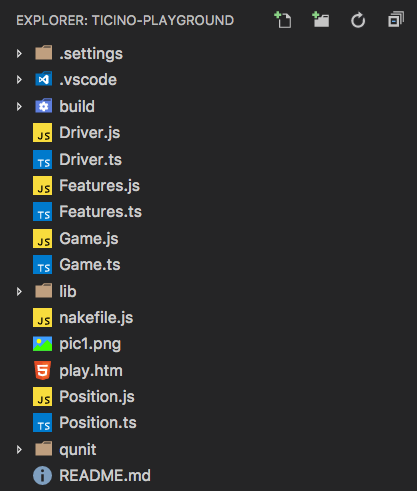

### Launch Integrated Terminal from the File Explorer

The context menu item to open a folder in a terminal (**Open in Terminal**) now defaults to open the folder in the Integrated Terminal. You can configure this to point at the external terminal using the `terminal.explorerKind` setting.

### Managing views

Now that VS Code supports custom views in the Explorer, it is useful to be able to customize their layout. With this release, you can now change the order and the visibility of the views in the:

* Explorer view
* Debug view
* Extensions view

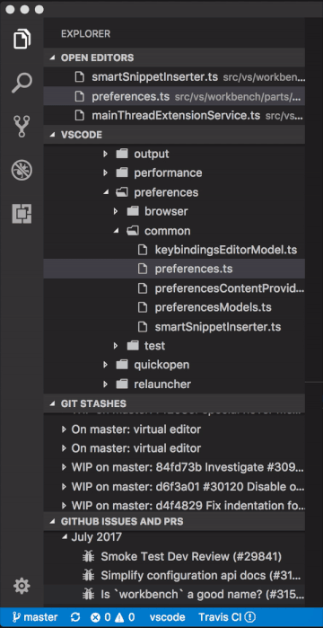

You can drag and drop sections reorder and context menus allow you to hide and display sections. Changes to views are persisted across VS Code restarts.

### New setting to close window when last editor closes

There is a new setting `window.closeWhenEmpty` to control if the window (instance) should close when the last editor is closed. On macOS, it is typical application behavior that the instance should close when the last document is closed. If you want this behavior, you can enable the setting.

**Note**: The setting only has an impact for windows that have no folders opened.

### Improved --wait support

VS Code can be configured as the editor for external programs such as Git (see our [documentation](https://code.visualstudio.com/docs/editor/versioncontrol#_git-patchdiff-mode) ). For that purpose, the `--wait` command line argument is used to keep the VS Code instance open until the external program is closed. In this release, we re-implemented this feature to work around some known issues.

First of all, we will now remember which instance was opened with `--wait` and properly wait for that instance to close. This fixes annoying issues when `--wait` is used while VS Code is already running as well as when you open a first instance and then more windows afterwards without closing the first window. In addition, on macOS where closing a window typically does not quit the application, we are now also returning control to the process that started the instance once it gets closed.

Second, when you close the last editor of the instance that was opened with `--wait`, we will now close the window automatically. With that, you can just hit `kb(workbench.action.closeActiveEditor)` to close the window.

**Note**: If you always want to close the window when the last editor closes, check out the new `window.closeWhenEmpty` setting for empty windows.

### New theme color for title bar border

If you are on macOS, we show a custom title bar at the top. A new color `titleBar.border` can now be defined in themes or settings to draw a border separating the title bar from the rest of the editor.

### Compare dirty file with version on disk

Thanks to [Tobias Friemel (@tfriem)](https://github.com/tfriem), a new action compares a dirty (unsaved) file to its version on disk to quickly see the recent changes:

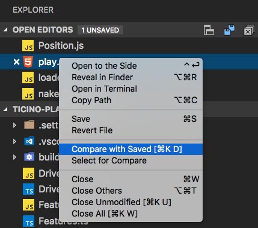

You can find the action from the context menu of dirty files within the **OPEN EDITORS** view of the Explorer and also as global command **Files: Compare Active File with Saved** (`kb(workbench.files.action.compareWithSaved)`).

### Font aliasing (macOS only)

A new setting `workbench.fontAliasing` was added (macOS) to control the font smoothing within the workbench and editor. By default, fonts are subpixel anti-aliased. Change the setting to `antialiased` to smooth the font on the level of the pixel, as opposed to the subpixel (this can make the font appear lighter overall). You can disable font smoothing if you set it to `none` (text will show with jagged sharp edges).

### Remove entries from recently opened

A new action (X) now shows up next to each entry of the recently opened picker (`kb(workbench.action.openRecent)`) to remove that entry from the list.

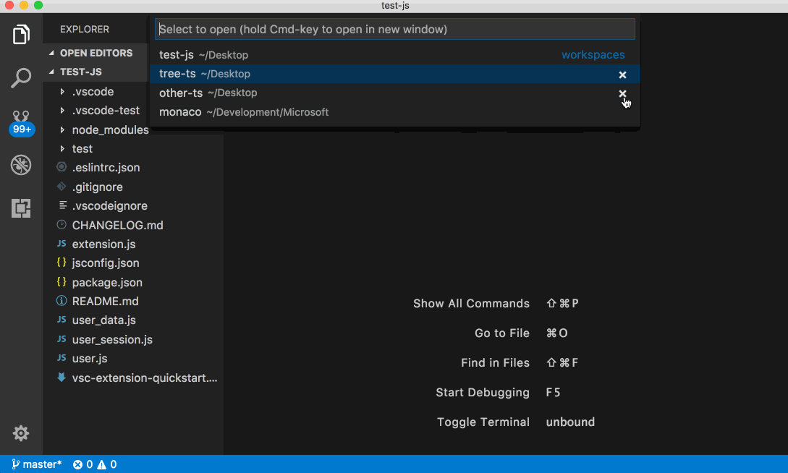

### Quick Open command with prefix

The existing command `workbench.action.quickOpen` can now receive a prefix as an argument to open the **Quick Open** picker with any text prefilled.

For example, you can configure a keybinding to bring up **Quick Open** with text prefilled like this:

```json
{ "key": "cmd+o", "command": "workbench.action.quickOpen", "args": "my-prefix" }
```

As an extension author, you can programmatically execute the command and pass in arguments:

```typescript
vscode.commands.executeCommand('workbench.action.quickOpen', 'my-prefix');
```

Thanks to [cristianhosu (@cristianhosu)](https://github.com/cristianhosu) for helping out with this.

### Search changes

We made a couple changes to the Search view that you should be aware of. If you have a single folder open, `./example` will match the directory `example/` at the top level of the open folder. And if you enter `example`, that will match every folder and file named `example` in the workspace. This is different from the previous default, which would have matched any file named `example`, but only a top-level folder named `example`.

You may also notice that we've removed the **Use glob patterns** buttons in the pattern include/exclude boxes. With the new `./` syntax, we think they were no longer necessary. See [our search documentation](https://code.visualstudio.com/docs/editor/codebasics#_search-across-files) for more details on searching with globs.

## Integrated Terminal

### Configure environment of terminal sessions

A new setting for each platform `terminal.integrated.env.<platform>` allows adding additional environment variables to new terminals:

```js
"terminal.integrated.env.linux": {
  "PYTHONPATH": "~/packages"
}
```

### Terminal switching

You can now quickly switch active terminals and rename them using the quick picker. Either use the command `Terminal: Switch Active Terminal` or type in `term ` (with a space) in Quick Open.


### Better terminal session names on Windows

We've cleaned up the default terminal names on Windows when launching a process from the initial shell. For example, running `powershell.exe` or `cmd.exe` in the terminal will now display the name as simply 'powershell' or 'cmd'.

### Additional delete word keybindings in the terminal

The Integrated Terminal now has default keys for deleting words:

Linux/Windows:

* Ctrl+Backspace: Delete word before cursor
* Ctrl+Delete: Delete word after cursor

macOS:

* Alt+Backspace: Delete word before cursor
* Alt+Delete: Delete word after cursor

These work by sending keystrokes to the shell and as a result, they don't work on some Windows shells.

### Force selection using Alt on macOS

Running programs in mouse mode within the terminal (like tmux) will intercept the mouse and therefore not allow you to make a selection. You can now hold the `Alt` key to force the mouse event to perform a selection rather than be sent to the terminal.

## Tasks

### Less and Sass compiler problem matchers

We added two new problem matchers to parse the output of the [less](https://www.npmjs.com/package/less) and [node-sass](https://www.npmjs.com/package/node-sass) compilers to detect and display problems from within VS Code. They are named `$lessc` and `$node-sass`.

### Tasks Status Bar display

We also added a Status Bar item for tasks which becomes visible as soon as a task is executed. Clicking on the tasks Status Bar display guides you to the output of an executed task.

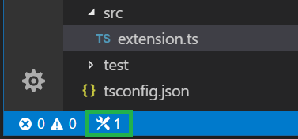

## Node Debugging

### Loaded Scripts Explorer

For the last few VS Code releases, it has been possible to search and open loaded scripts via the **Open Loaded Script** command, which used a simple [Quick Pick UI](https://code.visualstudio.com/updates/v1_11#_access-loaded-scripts).

In this release, we've added an Explorer to the Debug view that provides direct access to all scripts and updates automatically as more scripts are loaded by the runtime:


In contrast to the limited Quick Pick UI, the Explorer supports concurrent debug sessions and the scripts are grouped according to folders if used in a multi-root workspace.

A second advantage of the Loaded Scripts Explorer is that it was implemented as an extension and shows a real world example of the new debug API and how to contribute to a tree view. You can find the implementation [here](https://github.com/Microsoft/vscode-node-debug/blob/master/src/node/extension/loadedScripts.ts).

## Languages

### Search in Markdown preview

A PR from [Cody Hoover (@hoovercj)](https://github.com/hoovercj) brings search to webview contents, including the Release Notes, Markdown preview, and extension README pages:


### Linkifying in the Markdown preview

The Markdown preview will now automatically convert URL-like text into clickable links. This feature can be disabled by setting `"markdown.preview.linkify": false`.

### Support for Markdown preview plugins

We added support for Markdown preview plugins for styles, scripts and Markdown it extensions.

**Preview styles**

Extensions can contribute CSS to customize the look or layout of the Markdown preview:

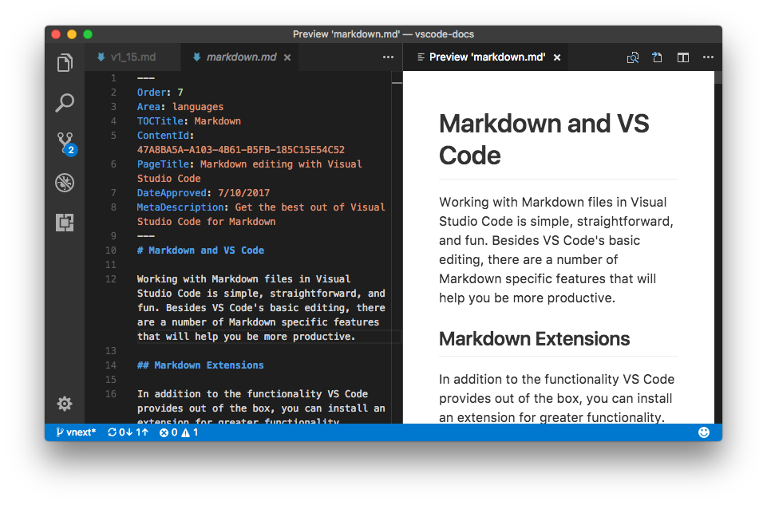

The [VS Code Github Style extension](https://github.com/mjbvz/vscode-github-markdown-preview-style) is a good example that demonstrates using a stylesheet to make the Markdown preview look like Github's rendered Markdown.

**Markdown it plugins**

Extensions can add support for additional Markdown syntax by contributing a [markdown-it plugin.](https://github.com/markdown-it/markdown-it#syntax-extensions):

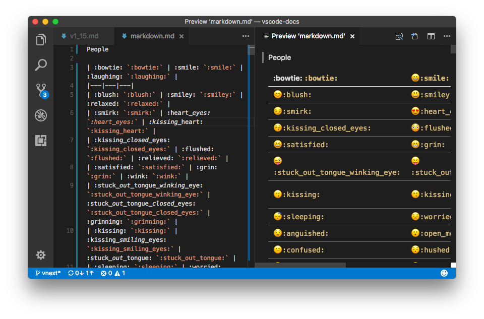

You can see this in action with the [VS Code Markdown Emoji extension](https://github.com/mjbvz/vscode-markdown-emoji) which uses a markdown-it plugin to add emoji support.

**Preview scripts**

Finally, for advanced functionality, extensions may contribute scripts that are executed inside of the Markdown preview:

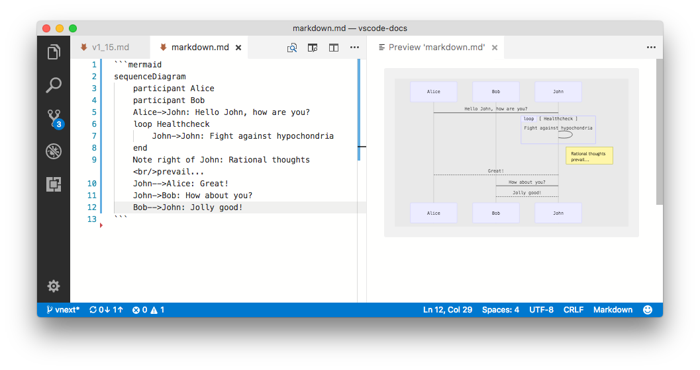

Above you can see the [VS Code Markdown Mermaid extension](https://github.com/mjbvz/vscode-markdown-mermaid) adding scripts to create [mermaid](https://knsv.github.io/mermaid/index.html) diagrams and flowcharts.

### New Markdown Preview Security Settings

The Markdown preview now blocks HTTP images by default. A popup is shown in the preview window when content has been blocked. You can change the security settings of Markdown previews in the current workspace by clicking on this popup or using the **Markdown: Change Preview Security Settings** command.


You can find more information about the new Markdown preview security levels in the VS Code [Markdown documentation](https://code.visualstudio.com/docs/languages/markdown#_markdown-preview-security).

## Extension Authoring

### New API to extend the Markdown preview

Extension authors can now extend the Markdown preview. The new API offers [three new contribution points](https://code.visualstudio.com/docs/extensionAPI/api-markdown) for styles, scripts and markdown-it extensions.

### Proposed API for storing credentials

There is a proposed (subject to change, behind a command-line flag) API for storing credentials in `vscode.credentials`. Basic read/write/delete operations are available that forward to the [keytar](https://github.com/atom/node-keytar) node module that uses the different credential stores of the different operating systems as its backing store. Join the [discussion](https://github.com/Microsoft/vscode/issues/31131) on GitHub.

### New API to open an editor or diff editor with a specific selection

We enriched the existing `TextDocumentShowOptions` with a new property `selection: Range` that can be used from the `showTextDocument` method as well as the `vscode.diff` command. When provided, the editor will reveal and select the provided range.

### Debug API updates

The proposed Debug API from last release (`vscode.debug.*`) has been slightly modified and extended.

Debugging can be started with the `startDebugging` function which takes either a named debug or compound configuration, or an in-memory configuration. Since named configurations or variables are only defined in the scope of a folder, we had to add a folder argument. A new `onDidStartDebugSession` event indicates that a debug session has been started.

The currently active debug session is available as the variable `activeDebugSession` and changes are reported through the `onDidChangeActiveDebugSession` event.

Custom Debug Adapter Protocol requests can be sent to a debug session with `DebugSession.customRequest` and corresponding custom events are reported through the `onDidReceiveDebugSessionCustomEvent` event.

### Debug Contributions

**Contributing views to the Debug Side Bar**

You can now contribute views to the Debug Side Bar.

```json
"contributes": {
  "views": {
    "debug": [
      {
        "id": "extension.node-debug.loadedScriptsExplorer",
        "name": "Loaded Scripts",
        "when": "inDebugMode && debugType == 'node'"
      }
    ]
  }
}
```

**Variable substitution in _package.json_ will no longer be supported**

We are planning to stop support for variable substitution in the `program` and `runtime` attributes of the `debuggers` contribution in `package.json`. The reason for this is twofold: first, it is hard to explain that variable substitution only works for two attributes and not for all attributes in `package.json`. Second, with multi-root folders, it is difficult to support this feature in a useful way.

We will deprecate variable substitution in this release and plan to drop the feature in August. If it is difficult for you to move off this feature, please speak up by commenting [here](https://github.com/Microsoft/vscode/issues/31675).

### Debug Adapter Protocol

**New `process` event**

A new `process` event has been added that conveys the process ID and other information about the process being debugged.

**New enum value `normal` for `presentationHint` attribute**

For completeness, the default value `normal` was added to the value set for the `presentationHint` attribute of type `Source`.

### New API for multi-root workspaces

New APIs have been added for multi-root workspaces. The "single root workspace" `workspace.rootPath` variable is now deprecated. Extension authors should use `workspace.workspaceFolders` which is a `WorkspaceFolder` array representing the current list of folders opened in the editor. There is a new event that fires when a folder is added or removed and a function `getWorkspaceFolder` to find a workspace folder for a given resource.

### Icon for root folders

Icon theme authors, please get ready for multi-root support: We added two new icon categories for VS Code: `rootFolder` and `rootFolderExpanded` that can be used to show root folders in a different way compared to other folders. For example, the File Explorer will use this icon as well as the list of recently opened workspaces.

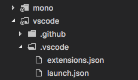

### Configuration scopes

You can now classify the settings you contribute to `configuration` extension points into following scopes:

* `window`: Window specific configuration which can be applied to the VS Code window and can be configured in the User and Workspace settings.
* `resource`: Resource specific configuration, which can be applied to the resources like files and folders and can be configured in the User, Workspace and Folder settings.

```json
"configuration": {
  "type": "object",
  "title": "MyLint",
  "properties": {
    "mylint.enable": {
      "type": "boolean",
      "default": true,
      "description": "Control whether mylint is enabled for files or not.",
      "scope": "resource"
    }
  }
}
```

This classification is needed to configure settings impacting resources in a multi-root workspace through **[Configuration API](#configuration-api)**.

### Configuration API

The Configuration API is enhanced to support configuring settings at Global, Workspace and Folder levels in a multi-root workspace. Now you can ask for the configuration of a resource and inspect and update it in User, Workspace and Folder settings.

Here is an example of reading and writing the configuration of a resource in Folder settings in a multi-root workspace:

```typescript
const uri = vscode.window.activeTextEditor.document.uri;
const configuration = vscode.workspace.getConfiguration('mylint', uri);
// Let value of `mylint.enable` is `false` in the settings of root folder containing `uri`.
let value = configuration.get('enable'); // value is `false`
await configuration.update('enable', !value, vscode.ConfigurationTarget.WorkspaceFolder)
value = configuration.get('enable'); // value is `true`
```

**Note:** There are no breaking changes to the existing Configuration API.

## Preview: Multi Root Workspaces

>**Note:** Multi-root functionality is only available in the Insiders build until we are confident enough that we can make it available in Stable. To try it out, grab our Insiders build from [https://code.visualstudio.com/insiders](https://code.visualstudio.com/insiders).

We continued working on support for opening multiple folders in a single VS Code window (instance) ([issue #396](https://github.com/Microsoft/vscode/issues/396)). There was a preview of this feature in our last release (see [1.14.0 release notes](https://code.visualstudio.com/updates/v1_14#_preview-multi-root-workspaces)).

During this sprint, we focused on making multi-root workspaces a first class concept.

### Introducing "Workspaces"

A Workspace is a new concept that surfaces in the UI whenever you want to have multiple folders opened in a single window (instance). A workspace is a simple configuration file that describes the folders you want to have open in a window. For example, for VS Code development we typically use three folders very frequently:

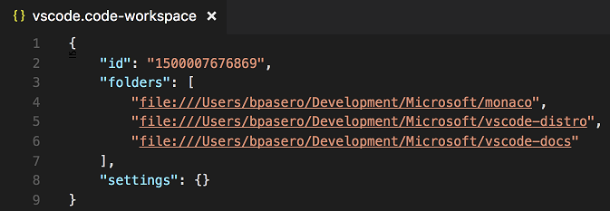

As you can see from the screenshot above, the workspace configuration file also contains a section for settings. Any **Workspace Setting** that you configure will end up in this file too (see below for more details around Workspace Settings).

Once you add additional folders to an empty window or a single-folder window, we make this window into an "Untitled Workspace". A window reload is currently required for this transition (see video below). In the future, we think that we can make this transition even smoother without a window reload.

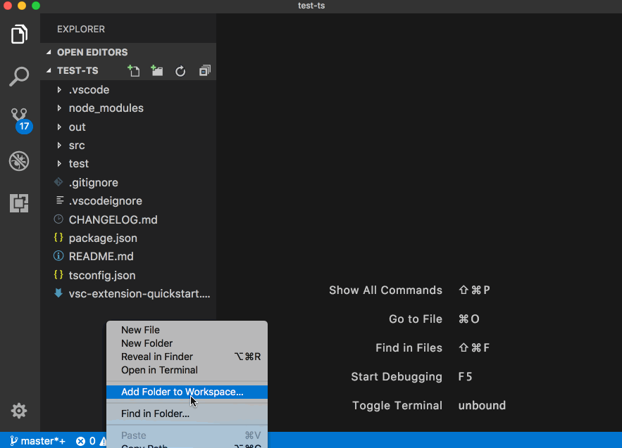

### Untitled Workspace

As long as you do not save a workspace, it will appear as an "Untitled Workspace". We do not force you to save a workspace until you want to have it in a permanent location, for example, on your Desktop. Untitled workspaces are present as long as the window they are using is open. Once you close a window with an untitled workspace, we will ask you to save it if you plan to open it again in the future:

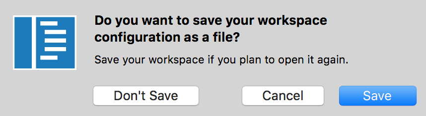

### Saved Workspaces

Saved Workspaces can be opened by double clicking the `.code-workspace` file or via the new **Open Workspace...** command under the **File** menu:

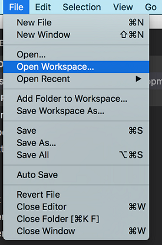

You will also see a new action **Save Workspace As...** that allows you to save the workspace to any location on your disk. The file extension of a VS Code workspace is `.code-workspace` and in the future, we plan to make it easier to share these files by allowing relative paths for folders.

Workspaces show up in a similar way as folders. You can open them from the list of recently opened workspaces:

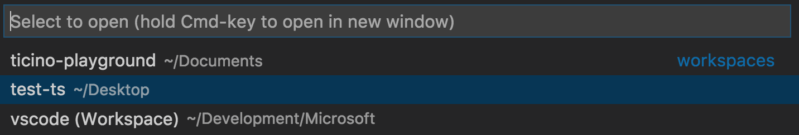

Any workspace will have an extra `(Workspace)` suffix appended to the name.

### Workspace Settings

As mentioned above, the new Workspace concept introduces a workspace configuration file that contains a section to configure your workspace settings. In a multi-root workspace, when you open workspace settings, we now show this file. This file also contains other sections which are not related to workspace settings. To make them less prominent, we dim them in the editor. In future, we would improve the experience by showing only the settings section just like in User settings.

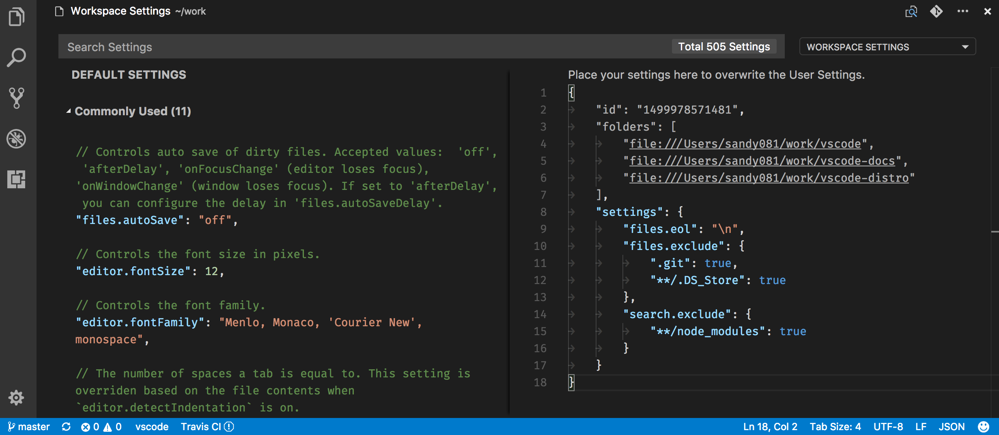

### Folder Settings

With multiple root folders in one workspace, it is possible to have a `.vscode` folder in each root folder defining the settings that should apply for that folder. You can open the folder settings in the Settings editor from the drop-down.

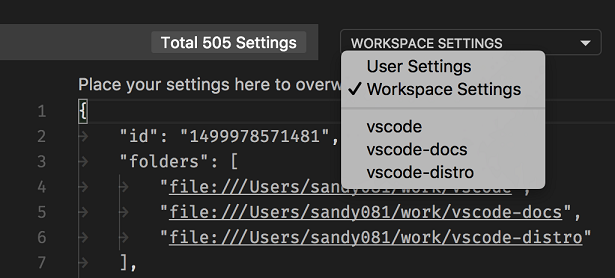

Selecting the folder, opens the settings for that folder.

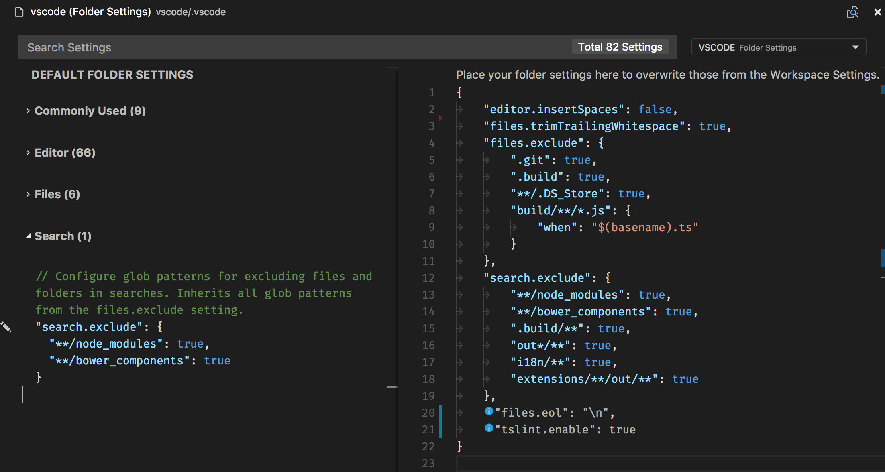

Only `resource` specific settings are applied at Folder level and `window` specific settings are not. Default settings editor on the left shows only those settings that can be applied at Folder level. If `window` specific settings exist in Folder settings, then they are shown dimmed with an info icon.

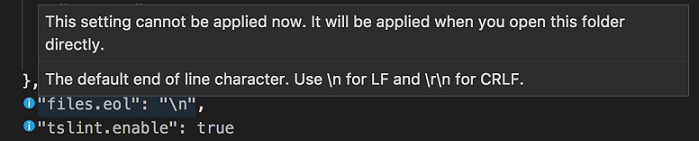

Refer to **[Configuration scopes](#configuration-scopes)** to know about `window` and `resource` specific settings.

### Multi-root debugging

When opening a multi-root workspace with multiple `launch.json` files, the Debug drop-down shows all configurations (with the originating folder in parentheses):

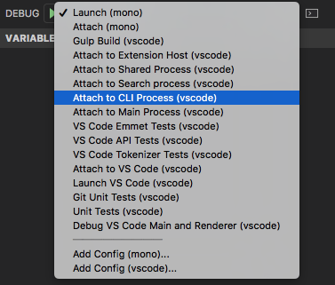

Variables used in a configuration (for example `${workspaceRoot}`) are resolved relative to the folder they belongs to.

### Multi-root Search

Thanks to a [PR](https://github.com/Microsoft/vscode/pull/29964) from [Keegan Carruthers-Smith](https://github.com/keegancsmith), search results in a multi-root workspace are now grouped by folder.


When you have a multi-root workspace open, you can choose to search in a single root folder by using the `./` syntax in the "files to include" box. For example, if you enter `./project1/**/*.txt`, that will search for all `.txt` files under the `project1/` root folder.

## Windows 64 bit

Visual Studio Code 64-bit builds are now available on Windows for the Stable release! They come in the usual Setup Installer format as well as a ZIP archive. We will show a message box to guide you to install the 64-bit version on Windows. Below are the download links:

Stable Windows 64-bit: [Installer](https://go.microsoft.com/fwlink/?linkid=852157) | [ZIP archive](https://go.microsoft.com/fwlink/?linkid=850641)

Insiders Windows 64-bit: [Installer](https://go.microsoft.com/fwlink/?linkid=852155) | [ZIP archive](https://go.microsoft.com/fwlink/?linkid=850640)

**Note:** If you are using the Setup Installer, you'll need to uninstall the 32-bit version before you install the 64-bit build.

**Note:** All your settings and extensions will be preserved when you upgrade to the 64-bit version.

## Proxy server authentication

Authenticated proxies should work seamlessly within VS Code with the addition of [PR #22369](https://github.com/Microsoft/vscode/pull/22369).

The authentication methods supported are:

* Basic
* Digest
* NTLM
* Negotiate

When using VS Code behind an authenticated HTTP proxy, the following authentication popup will appear:


Note that SOCKS5 proxy authentication support isn't implemented yet; you can follow the [issue in Chromium's issue tracker](https://bugs.chromium.org/p/chromium/issues/detail?id=256785).

You can learn more about proxy server support and how VS Code uses the Chromium network stack in the new [Network Connections in VS Code](https://code.visualstudio.com/docs/setup/network) topic.

## New commands

Key|Command|Command id
---|-------|----------
`kb(workbench.files.action.compareWithSaved)`|Compare a dirty file with the version on disk|`workbench.files.action.compareWithSaved`
`kb(workbench.action.terminal.deleteWordLeft)`|Delete word left in terminal|`workbench.action.terminal.deleteWordLeft`
`kb(workbench.action.terminal.deleteWordRight)`|Delete word right in terminal|`workbench.action.terminal.deleteWordRight`

## New documentation

We update the [https://code.visualstudio.com](https://code.visualstudio.com) website at a different cadence than the product release, so you might have missed some of the recent additions.

### Community

We've added a [Community](https://code.visualstudio.com/community) page to let you quickly engage through Twitter, Stack Overflow, and GitHub. There are also links to community created content about VS Code hosted on such sites as [PluralSight](https://www.pluralsight.com/), [Scotch.io](https://scotch.io/), and [LinkedIn Learning](https://www.linkedin.com/learning/).

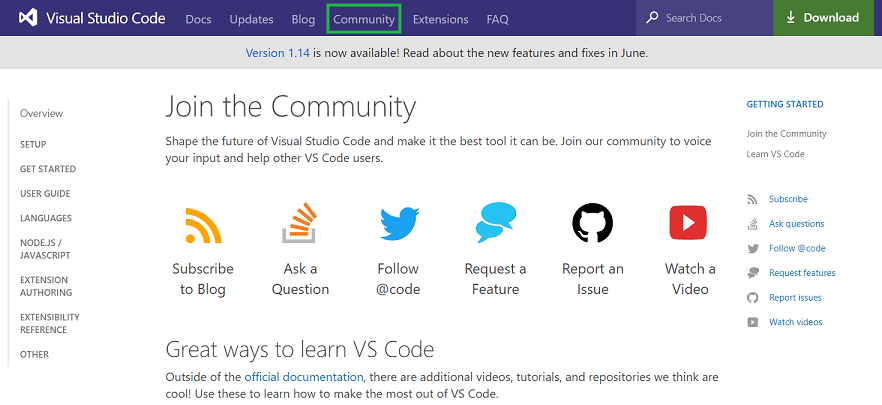

### Tutorials

We've created tutorials for [React](https://code.visualstudio.com/docs/nodejs/reactjs-tutorial), [Angular](https://code.visualstudio.com/docs/nodejs/angular-tutorial), and [Node.js Deployment to Azure](https://code.visualstudio.com/docs/nodejs/nodejs-deployment). These tutorials walk you through creating sample projects and using VS Code for smart code editing and debugging.


## Thank You

Last but certainly not least, a big *__Thank You!__* to the following folks that helped to make VS Code even better:

Contributions to `vscode`:

* [Andrew Arnott (@AArnott)](https://github.com/AArnott):  Add *.props as a recognized file extension for XML [PR #30052](https://github.com/Microsoft/vscode/pull/30052)
* [Igor Polishchuk (@amadare42)](https://github.com/amadare42):  QuickPickOptions typings fix [PR #30819](https://github.com/Microsoft/vscode/pull/30819)
* [Bugra Cuhadaroglu (@BugraC)](https://github.com/BugraC):  Added Enabled View to Extension Viewlet [PR #30367](https://github.com/Microsoft/vscode/pull/30367)
* [Christopher Leidigh (@cleidigh)](https://github.com/cleidigh)
  *  Queue data during pty launch delay Fixes: #29184 [PR #30106](https://github.com/Microsoft/vscode/pull/30106)
  *  Add bottom padding to integrated terminal. Fixes #30626 [PR #30728](https://github.com/Microsoft/vscode/pull/30728)
  *  Handle Alt+Click for terminal links. Fixes #30761 [PR #31263](https://github.com/Microsoft/vscode/pull/31263)
  *  Remove inner whitespace on Toggle Block Comment. Fixes #30656 & #30729 [PR #30818](https://github.com/Microsoft/vscode/pull/30818)
* [@cristianhosu](https://github.com/cristianhosu): Add prefix argument to QuickOpen command (CTRL+P) [PR #28952](https://github.com/Microsoft/vscode/pull/28952)
* [Eric Amodio (@eamodio)](https://github.com/eamodio):  Use configuration for pinned default (Fixes #26184) [PR #27357](https://github.com/Microsoft/vscode/pull/27357)
* [Felix Becker (@felixfbecker)](https://github.com/felixfbecker): Switch to npm5 [PR #29576](https://github.com/Microsoft/vscode/pull/29576)
* [Dmitry Zabello (@foreverest)](https://github.com/foreverest)
  *  Sort by `type` doesn't affect folders [PR #30572](https://github.com/Microsoft/vscode/pull/30572)
  *  Various kinds of sorting in explorer [PR #29509](https://github.com/Microsoft/vscode/pull/29509)
* [Matt Fehskens (@gonzofish)](https://github.com/gonzofish):  Added Enabled View to Extension Viewlet [PR #25974](https://github.com/Microsoft/vscode/pull/25974)
* [Cody Hoover (@hoovercj)](https://github.com/hoovercj)
  * Make token colors user customizable [PR #29393](https://github.com/Microsoft/vscode/pull/29393)
  *  Find in webview based views (html preview, release notes, extension editor) [PR #30016](https://github.com/Microsoft/vscode/pull/30016)
* [@lslv1243](https://github.com/lslv1243):  Fix typo [PR #30653](https://github.com/Microsoft/vscode/pull/30653)
* [@mihailik](https://github.com/mihailik):  Ctrl-T to use word under cursor or current selection [PR #30021](https://github.com/Microsoft/vscode/pull/30021)
* [Nick Snyder (@nicksnyder)](https://github.com/nicksnyder):  Remove unnecessary Math.min [PR #29902](https://github.com/Microsoft/vscode/pull/29902)
* [Praveen Puglia (@praveenpuglia)](https://github.com/praveenpuglia):  Fix "No Results" error message color in find widget [PR #30746](https://github.com/Microsoft/vscode/pull/30746)
* [Priit Haamer (@priithaamer)](https://github.com/priithaamer):  Add workbench.fontAliasing configuration option [PR #30628](https://github.com/Microsoft/vscode/pull/30628)
* [@rianadon](https://github.com/rianadon):  Properly format file path on when dragging and dropping a tab into the integrated terminal in Windows [PR #30070](https://github.com/Microsoft/vscode/pull/30070)
* [Rohith Reddy Kumbharkar (@RohithKumbharkar)](https://github.com/RohithKumbharkar):  Add functionality to toggle break rendering mode for Markdown preview [PR #28713](https://github.com/Microsoft/vscode/pull/28713)
* [Vincent Sisk (@sappharx)](https://github.com/sappharx):  Fix typo in src/vs/base/common/arrays.ts [PR #30949](https://github.com/Microsoft/vscode/pull/30949)
* [Ryan Stringham (@stringham)](https://github.com/stringham):  Add history navigation for file include/exclude patterns in the search pane. Remember history between sessions. [PR #27476](https://github.com/Microsoft/vscode/pull/27476)
* [Tobias Friemel (@tfriem)](https://github.com/tfriem):  Show unsaved file modifications by opening a diff view [PR #30210](https://github.com/Microsoft/vscode/pull/30210)

These are the [closed bugs](https://github.com/Microsoft/vscode/issues?q=is%3Aissue+label%3Abug+milestone%3A%22July+2017%22+is%3Aclosed) and these are the [closed feature requests](https://github.com/Microsoft/vscode/issues?q=is%3Aissue+milestone%3A%22July+2017%22+is%3Aclosed+label%3Afeature-request) for the 1.15 update.

Contributions to `vscode-node-debug`:

* [Gary Ewan Park (@gep13)](https://github.com/gep13): (typo) Minor correction [PR #154](https://github.com/Microsoft/vscode-node-debug/pull/154)

Contributions to `vscode-chrome-debug`:

* [Matt Jimison @mjimison](https://github.com/mjimison): Update README.md [PR #472](https://github.com/Microsoft/vscode-chrome-debug/pull/472)

Contributions to `vscode-json-languageservice`:

* [Adam Voss (@adamvoss)](https://github.com/adamvoss):  Add null check to prevent service from crashing [PR #7](https://github.com/Microsoft/vscode-json-languageservice/pull/7)

Contributions to `vscode-css-languageservice`:

* [Praveen Puglia (@praveenpuglia)](https://github.com/praveenpuglia)
  *  CSS Colors Level 4 - 4 & 8 digit hex values [PR #38](https://github.com/Microsoft/vscode-css-languageservice/pull/38)
  *  add system font stack in font-family autocomplete list [PR #37](https://github.com/Microsoft/vscode-css-languageservice/pull/37)
  *  grid-row-start property browser support info [PR #35](https://github.com/Microsoft/vscode-css-languageservice/pull/35)
  *  add: flow-root for display property completion [PR #29](https://github.com/Microsoft/vscode-css-languageservice/pull/29)
* [Yuval Greenfield (@ubershmekel)](https://github.com/ubershmekel):  text-decoration-color update [PR #30](https://github.com/Microsoft/vscode-css-languageservice/pull/30)

Contributions to `vscode-tslint`:

* [David Valachovic (@AdenFlorian)](https://github.com/AdenFlorian)
  * When autoFixOnSave is array, items must be strings [PR #232](https://github.com/Microsoft/vscode-tslint/pull/232)
  * Allows naming which quick fixes should be run on save [PR #231](https://github.com/Microsoft/vscode-tslint/pull/231)

Contributions to `vscode-debugadapter-node`:

* [Holger Benl (@hbenl)](https://github.com/hbenl): testsupport: add missing requests to DebugClient [PR #120](https://github.com/Microsoft/vscode-debugadapter-node/pull/120)

Contributions to `vscode-recipes`:

* [Cyril DURAND (@cyrildurand)](https://github.com/cyrildurand): Update README.md [PR #13](https://github.com/weinand/vscode-recipes/pull/13)

Contributions to `vscode-github-issues-prs`:

* [Jens Hausdorf (@jens1o)](https://github.com/jens1o): Add action for creating issues [PR #8](https://github.com/Microsoft/vscode-github-issues-prs/pull/8)
* [道化師 (@wraith13)](https://github.com/wraith13): Fix parsing of repository names with dots [PR #17](https://github.com/Microsoft/vscode-github-issues-prs/pull/17)

Contributions to `localization`:

This is the fourth month since we opened community localization in Transifex. We now have more 300 members in the Transifex [VS Code project](https://aka.ms/vscodeloc) team. We appreciate your contributions, either by providing new translations, voting on translations, or suggesting process improvements.

Here is a snapshot of top contributors for this release. For details about the project including the contributor name list, visit the project site at [https://aka.ms/vscodeloc.](https://aka.ms/vscodeloc)

* **French:** Jonathan Menzel, Antoine Griffard.
* **Italian:** Aldo Donetti, Luca Nardi.
* **German:** Carsten Kneip.
* **Spanish:** Roberto Fonseca, David Triana, Jorge Serrano Pérez, Alberto Poblacion, Christian Eduardo Palomares Peralta, Andy Gonzalez.
* **Russian:** Valeriy Schepak, Nikita Gryzlov.
* **Japanese:** Tomoaki Yoshizawa, EbXpJ6bp, Yosuke Sano, Yuichi Nukiyama, Yuki Ueda, Tempura sukiyaki.
* **Chinese (Simplified):** Aifen Qin, 林昊, YF, Joel Yang, Zijian Zhou, Alan Tsai, Zijian Zhou, 陈嘉恺, Ricky Wang.
* **Chinese (Traditional):** Alan Liu, Alan Tsai, Duran Hsieh, Ke-Hsu Chen,  Wei-Ting(DM), Ricky Wang.
* **Portuguese (Brazil):** Bruno Sonnino, Roberto Fonseca, Frederico Oliveira, Luan Moreno Medeiros Maciel, Rodrigo Crespi, Lucas Miranda.
* **Hungarian:** Tar Dániel.
* **Turkish:** Adem Coşkuner, Ata Binen, Ali Oğuzhan Yıldız.
* **Dutch:** Gerald Versluis, Jeroen Hermans, Sander van de Velde, Jasper van Merle.
* **Indonesian:** eka priya.
* **Polish:** Patryk Adamczyk, Patryk Zawadzki, Albert, Mateusz Wyczawski, KarbonKitty.
* **Portuguese (Portugal):** Mike C.

<!-- In-product release notes styles.  Do not modify without also modifying regex in gulpfile.common.js -->
<a id="scroll-to-top" role="button" aria-label="scroll to top" href="#"><span class="icon"></span></a>
<link rel="stylesheet" type="text/css" href="css/inproduct_releasenotes.css"/>
