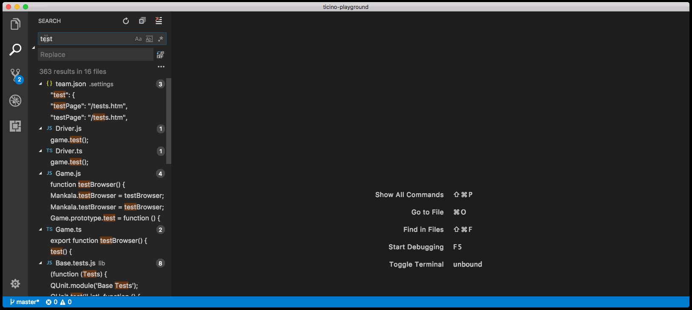
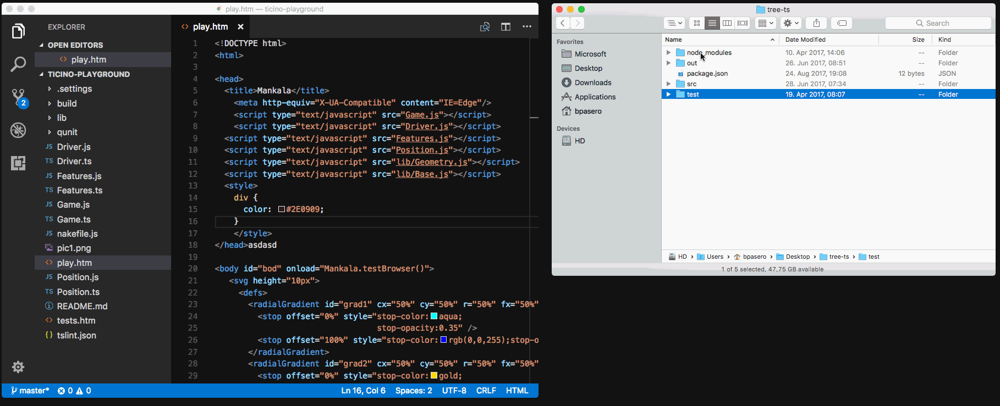
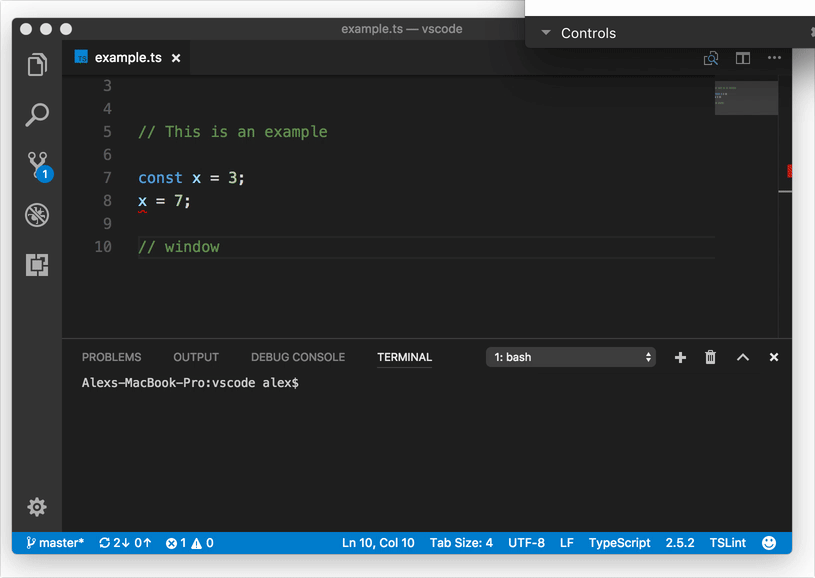
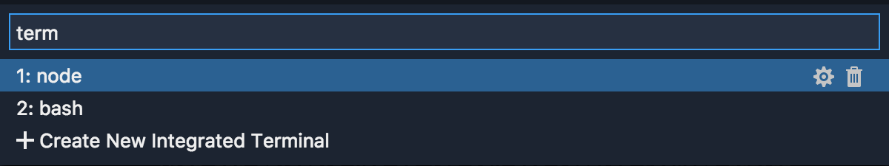
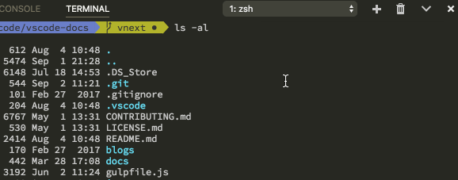
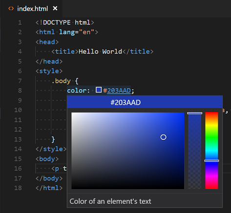
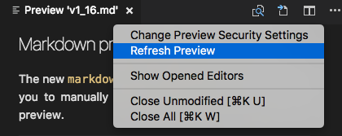
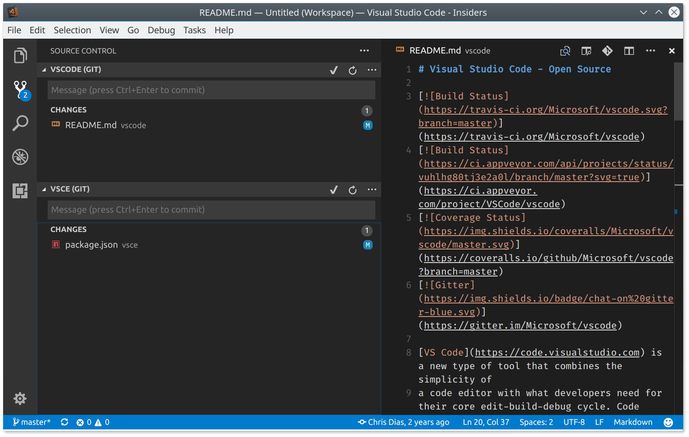
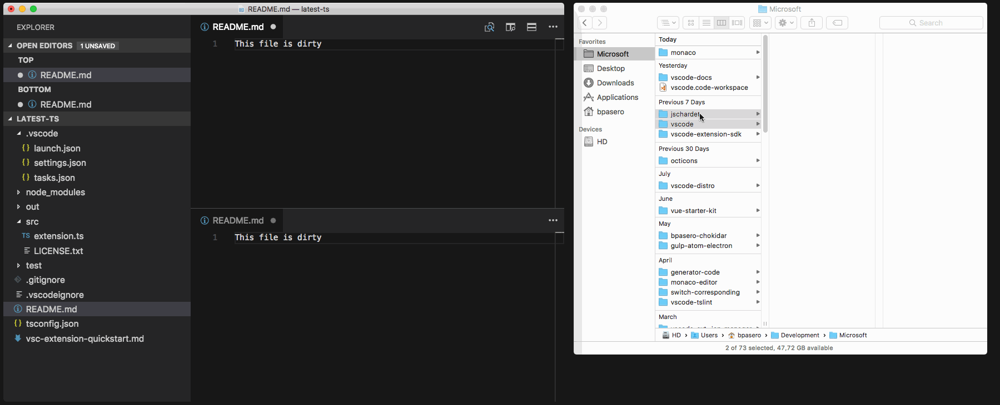
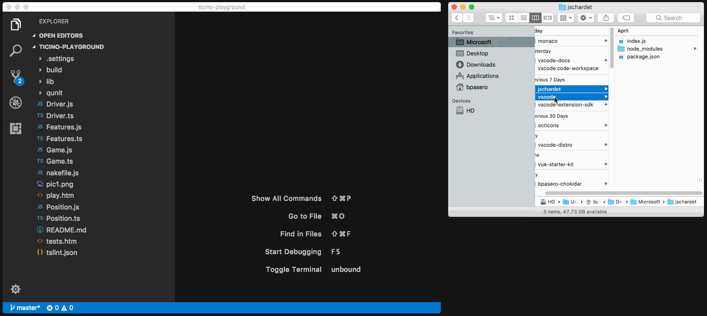

# August 2017 (version 1.16)

**Update 1.16.1**: The update addresses these [issues](https://github.com/Microsoft/vscode/milestone/53?closed=1).

Downloads: [Windows](https://vscode-update.azurewebsites.net/1.16.1/win32-x64/stable) | [Mac](https://vscode-update.azurewebsites.net/1.16.1/darwin/stable) | Linux 64-bit: [.tar.gz](https://vscode-update.azurewebsites.net/1.16.1/linux-x64/stable) [.deb](https://vscode-update.azurewebsites.net/1.16.1/linux-deb-x64/stable) [.rpm](https://vscode-update.azurewebsites.net/1.16.1/linux-rpm-x64/stable) | Linux 32-bit: [.tar.gz](https://vscode-update.azurewebsites.net/1.16.1/linux-ia32/stable) [.deb](https://vscode-update.azurewebsites.net/1.16.1/linux-deb-ia32/stable) [.rpm](https://vscode-update.azurewebsites.net/1.16.1/linux-rpm-ia32/stable)

---

Welcome to the August 2017 release of Visual Studio Code. There are a number of significant updates in this version that we hope you will like, some of the key highlights include:

* **[JavaScript/TypeScript refactoring](#javascript-and-typescript-refactorings)** - Easily extract source code into methods and functions.
* **[HTML tag auto close](#html-close-tags)** - Improved editor productivity with automatic close tags.
* **[Color picker in HTML](#color-picker-in-html)** - You can now use the VS Code color picker in HTML files.
* **[Integrated Terminal quick open](#terminal-quick-open-improvements)** - Create or jump to terminals from VS Code Quick Open.
* **[Drag and drop from search](#drag-and-drop-from-search-results-and-problems-panel)** - Quickly open files from Search and also the Problems panel.
* **[Multiple SCM providers](#source-control)** - You can now have multiple active source control providers.
* **[New online documentation](#new-documentation)** - New Emmet topic and updates to the Node.js Deployment tutorial.
* **[VS Code "recipes" repository](#vs-code-recipes)** - Examples using React, Angular and Docker in VS Code.
* **[Preview: Multi-root workspaces](#preview-multi-root-workspaces)** - Smoother UI when adding folders and creating a Workspace (Insiders build).
* **[Multi-root tips for extension authors](#multi-root-workspace-tips-for-extension-authors)** - Update your extension to work seamlessly with multi-root workspaces.

>If you'd like to read these release notes online, go to [Updates](https://code.visualstudio.com/updates) on [code.visualstudio.com](https://code.visualstudio.com).<br>
>You can also check out this 1.16 release [highlights video](https://www.youtube.com/watch?v=PBQADy63a3s) from [Brian Clark](https://twitter.com/_clarkio).

The release notes are arranged in the following sections related to VS Code focus areas. Here are some further updates:

* **[Workbench](#workbench)** - Improved Extension sandboxing, more theme colors.
* **[Editor](#editor)** - Undo stack detects file changes, smooth scrolling, Braille support
* **[Integrated Terminal](#integrated-terminal)** - Better text selection on Linux and Windows, search history support.
* **[Languages](#languages)** - TypeScript 2.5, JSDoc type assertions, Markdown Preview refresh command.
* **[Extension Authoring](#extension-authoring)** - API updates and guidelines to support multi-root workspaces.

**Insiders:** Want to see new features as soon as possible? You can download the nightly Insiders [build](https://code.visualstudio.com/insiders) and try the latest updates as soon as they are available.

## Workbench

### Drag and drop from Search results and Problems panel

You can now drag files from the Search results and Problems panel over the editor area to control where these should open. The File Explorer always supported this and we have now expanded that feature to other regions of the UI.



### Open a folder via drag and drop

VS Code has always supported dragging a folder from outside VS Code into it to open the folder. VS Code stills support this, but the visual feedback is changed a little bit. Previously you could drop the folder anywhere in VS Code to open it. With this release, you need to drop the folder over the editor area to open it. This change is due to both a technical reason (an Electron update) as well as an explicit decision to make the multi-root experience better. If you are using VS Code Insiders with multi-root support, you will be happy to hear that you can now drop a folder into the File Explorer to add it to the workspace.



### Extension Host

VS Code uses a multi-process architecture, where extensions are executed in a separate extension host process. The workbench can now recover gracefully from an unexpected termination of the extension host process. All UI elements and state driven from extensions will be removed (for example, squiggles and Status Bar items), and, if the extension host is restarted, everything will return to normal.

In the following short video, the extension host process is terminated. When the extension host terminates, basic editing still works, word completions are presented, and once the extension host is restarted, real TypeScript powered completions return:



### Theming improvements

Several new theming color keys were introduced. These colors can be set by themes or directly by the user with the `workbench.colorCustomizations` setting:

- `tab.activeBorder`: A border drawn to the bottom of the active tab.
- `tab.unfocusedActiveBorder`: A border drawn to the bottom of the active tab in an editor group that is not focused.
- `editorOverviewRuler.border`: Color of the overview ruler border.
- `editorOverviewRuler.findMatchForeground`: Overview ruler marker color for find matches.
- `editorOverviewRuler.rangeHighlightForeground`: Overview ruler marker color for range highlights.
- `editorOverviewRuler.selectionHighlightForeground`: Overview ruler marker color for selection highlights.
- `editorOverviewRuler.wordHighlightForeground`: Overview ruler marker color for symbol highlights.
- `editorOverviewRuler.wordHighlightStrongForeground`: Overview ruler marker color for write-access symbol highlights.
- `editorOverviewRuler.modifiedForeground`: Overview ruler marker color for modified content.
- `editorOverviewRuler.addedForeground`: Overview ruler marker color for added content.
- `editorOverviewRuler.deletedForeground`: Overview ruler marker color for deleted content.
- `editorOverviewRuler.errorForeground`: Overview ruler marker color for errors.
- `editorOverviewRuler.warningForeground`: Overview ruler marker color for warnings.
- `editorOverviewRuler.infoForeground`: Overview ruler marker color for information messages.

See [Theme Color Reference](https://code.visualstudio.com/docs/getstarted/theme-color-reference) for a complete list of colors.

## Editor

### Undo stack preserved when file changes on disk

Thanks to the work of [Ryan Stringham](https://github.com/stringham) in [PR #29655](https://github.com/Microsoft/vscode/pull/29655), VS Code will now preserve the undo stack associated with a open file when it is reloaded due to a change on disk.

### Smooth scrolling

Thanks to the work of [@JD342](https://github.com/JD342) in [PR #25286](https://github.com/Microsoft/vscode/pull/25286), the editor now has a new option, `editor.smoothScrolling`, that will make the editor scroll with an animation. Once enabled, scrolling between different locations when using `Page Up` or `Page Down`, when cycling through find matches, when jumping to a definition in the same file, and when using the mouse wheel will be animated.

> Note: Our platform currently does not support differentiating between scrolling initiated by a touchpad or a physical mouse wheel, and we currently use a heuristic to determine if smooth scrolling should be applied.


### Emmet suggestions as snippets

Emmet in suggestions/auto-completion list is most helpful when it is in the top few choices. There are two scenarios where Emmet suggestions can get pushed down the list:

* You have set `editor.snippetSuggestions` to `top` and so default/user/extension snippets are on top of your suggestion list.
* When working on stylesheets, Emmet suggestions get sorted alphabetically among other CSS suggestions.

To ensure Emmet suggestions stay on top of the suggestion list, set the new `emmet.showSuggestionsAsSnippets` to `true` and `editor.snippetSuggestions` to `top`.

### Emmet preferences

The setting `emmet.preferences` as documented in [Emmet Preferences](https://docs.emmet.io/customization/preferences/) was discontinued in the last release as the new modular approach in [Emmet 2.0](https://code.visualstudio.com/blogs/2017/08/07/emmet-2.0) did not support them.

We are bringing back support for a few of these preferences via the setting `emmet.preferences`:

* `css.propertyEnd`
* `css.valueSeparator`
* `sass.propertyEnd`
* `sass.valueSeparator`
* `stylus.propertyEnd`
* `stylus.valueSeparator`
* `css.unitAliases`
* `css.intUnit`
* `css.floatUnit`

 If you want support for any of the other preferences, please log a [feature request](https://github.com/Microsoft/vscode/issues/new) for the same.

### Snippets

There is a new snippet variable: `$TM_FILENAME_BASE`. It resolves to the filename without extension, so from `/my/super/file.ts` it resolves to `file`.

### Braille support

It is now possible to change the cursor position in VS Code using Braille routing keys on a connected Braille display when using NVDA on Windows. Many thanks to [James Teh](https://github.com/jcsteh), who helped emulate the behavior of a Braille display in [issue #27216](https://github.com/Microsoft/vscode/issues/27216).

## Integrated Terminal

### Terminal quick open improvements

The Integrated Terminal can now be launched via the **Terminal: Switch Active Terminal** command or by typing "term " (with a trailing space) in **Quick Open**. When using the Integrated Terminal **Quick Open** drop-down, you can also create new terminals or delete existing terminals.



### Force selection using Shift on Linux and Windows

Running programs in mouse mode within the terminal (like tmux) will intercept the mouse and therefore not allow you to make a selection. You can now hold the `Shift` key to force the mouse event to perform a selection rather than be sent to the terminal. This functionality was added for `Alt` on macOS in 1.15.

### Terminal Find widget improvements

The terminal Find widget now supports find history. You can use `kb(history.showNext)` and  `kb(history.showPrevious)` to show the next or previous find term in the Find widget. Many thanks to [Christopher Leidigh](https://github.com/cleidigh), who has helped with both code refactoring and feature implementation in [PR #32113](https://github.com/Microsoft/vscode/pull/32113).



## Languages

### HTML close tags

Tag elements are now automatically closed when `>` of the opening tag is typed:


The matching closing tag is inserted when `/` of the closing tag is entered:


The new behavior is enabled by default and can be turned off with the setting `html.autoClosingTags`

Thanks to [Jun Han](https://github.com/formulahendry) for leading the way with his [Auto Close Tag](https://marketplace.visualstudio.com/items?itemName=formulahendry.auto-close-tag). Note that the Auto Close Tag extension has more features, in particular, it can be enabled for languages other than HTML as well.

### Color picker in HTML

The new VS Code color picker UI is now available in HTML style sections.



### TypeScript 2.5

VS Code now includes TypeScript 2.5.2, which brings some exciting new editor features and fixes a number of bugs. You can read more about TypeScript 2.5 [here](https://devblogs.microsoft.com/typescript/announcing-typescript-2-5/). Below are details about several of the new features.

### JavaScript and TypeScript refactorings

The new **Extract method** and **Extract function** code actions allow you to quickly refactor complex JavaScript or TypeScript code into new methods or functions:


Simply select some code, then click on the lightbulb in the gutter or press (`kb(editor.action.quickFix)`) to see available refactorings. Source code fragments can be extracted into a new method, or into a new function at various different scopes.

### JSDoc type assertions

You can now use write JSDoc type assertions in JavaScript files:

```js
// @ts-check

const img = /** @type {HTMLImageElement} */ (document.getElementById('#cat'))
img.src = './cat.gif'
```

This is particularly useful when using `@ts-check` to enable [type checking in your JavaScript code](https://code.visualstudio.com/Docs/languages/javascript#_type-checking).

### Better loose JavaScript/TypeScript file isolation

Loose JavaScript and TypeScript files that are not part of a `jsconfig.json` or `tsconfig.json` project are now split into an implicit project per root folder. Previously, loose files across all root folders in the workspace were grouped into the same implicit project. The change means that you should no longer see suggestions from files in one JavaScript folder showing up in JavaScript files in a different folder.

### Markdown preview refresh command

The new **Markdown: Refresh Preview** command allows you to manually refresh the contents of a Markdown preview.



This can be used to reload images that have been modified on the file system.

### CSS/JSON color preview

We moved the inline color preview rendering from the CSS/JSON extensions to the VS Code core and in the process deprecated four configuration settings: `css.colorDecorators.enable`, `sass.colorDecorators.enable`, `scss.colorDecorators.enable` and `json.colorDecorators.enable`. There is a new general setting `editor.colorDecorators` to control if the inline color box should be rendered.

## Source control

There is now support for having multiple source control providers simultaneously. This feature aligns with the work for  multi-root workspaces as multiple projects may have different SCM providers.



You can now work on multiple Git repositories at once or even mix and match with other [source control providers](https://marketplace.visualstudio.com/search?target=VSCode&category=SCM%20Providers&sortBy=Downloads), all in a single workbench window.

## New Documentation

### Updated Node.js Deployment tutorial

We continue to refine the [Node.js Deployment to Azure](https://code.visualstudio.com/docs/nodejs/nodejs-deployment) tutorial so you can get your application running quickly in the Cloud.

### New Emmet topic

We added a new [Emmet topic](https://code.visualstudio.com/docs/editor/emmet) describing VS Code's Emmet support. Learn about using Emmet abbreviations during your editing sessions, how to customize your Emmet experience, and even create custom Emmet snippets.

### VS Code recipes

In May, we've started to collect recipes for some non-standard or complex debugging setups in a [VS Code Recipe](https://github.com/Microsoft/vscode-recipes) repository. This repository has now moved to the new location [https://github.com/Microsoft/vscode-recipes](https://github.com/Microsoft/vscode-recipes). Here you can find working examples using [React](https://github.com/Microsoft/vscode-recipes/tree/master/MERN-Starter), [Angular](https://github.com/Microsoft/vscode-recipes/tree/master/Angular-CLI) and [Docker](https://github.com/Microsoft/vscode-recipes/tree/master/Docker-TypeScript) in VS Code.

## Extension Authoring

### Upgraded Electron only supports "inspector" protocol

With the upgrade to Electron 1.7, the built-in Node.js version only supports the "inspector" protocol (instead of "legacy"). This change has benefits for both [extension debugging](#extension-debugging) and [profiling](#profile-your-extension) as described below.

#### Extension debugging

Extension Host debugging (implemented by VS Code's built-in Node Debugger) has been switched to always use the "inspector" protocol which results in the following behavioral difference:

With the "inspector" protocol, the Node.js debugger does not mark breakpoints as "verified" until they are bound to a real script location loaded by the runtime. This means that if your extension is not yet activated, breakpoints will appear gray (unverified). But don't worry, they will turn red (verified) as soon as the extension is activated.


#### Profile your extension

Since the upgraded version of Electron supports the more powerful "inspector" protocol, you can now profile extensions using Chrome DevTools. Do the following:

1. Start VS Code from the command line the with `--inspect-extensions=<port>`-flag, for example `code --inspect-extensions=9333`.
2. In VS Code, from the **Command Palette** (`F1`), select **Developer: Toggle Developer Tools**, hit `Enter`.
3. Select the **Console** tab and find a message that starts with `"Debugger listening on port 9333"` and that ends with a `chrome-devtools`-link.
4. Open that link in Chrome for dedicated DevTools for the extension host.
5. Use the Memory and CPU profiler to understand how memory and compute resource are being used.

### Handling uncaught errors

The extension host process is now looking at the stack-traces of uncaught errors to know what extension is throwing them. For now, we only prefix those errors with the respective extension ids. In the future we have more plans, for example an extension runtime view or the ability to create an issue against extensions.

### Themable colors in extensions

Extension can now contribute new themable colors. These colors can be used in decorators and in the Status Bar.

```json
  "colors": [{
      "id": "superstatus.error",
      "description": "Color for error message in the status bar.",
      "defaults": {
          "dark": "errorForeground",
          "light": "errorForeground",
          "highContrast": "errorForeground"
      }
  }]
```

Once defined, user can customize the color in the `workspace.colorCustomization` setting. User themes can set the color value.

### Source control API updates

The way of accessing the Source Control view's input box via `scm.inputBox` is now deprecated in favor of using `SourceControl.inputBox`. This is related to the multi-root feature, in which each source control provider can have its own input box.

The global `scmProvider` context key is now never set, since many source control providers can be active simultaneously.

Thanks to [@marckassay](https://github.com/marckassay), you can now have [tooltips on source control resource decorations](https://github.com/Microsoft/vscode/pull/29644).

### Debug API updates

**new `DebugConfigurationProvider` replaces `initialConfigurations` and `startSession` commands**

Currently a debugger extension can contribute the "hook"-like commands `initialConfigurations` and `startSession` to participate in the generation of an initial launch configuration and the start of a debug session. In this milestone, we are proposing a "real" API that will replace the more-or-less untyped command based mechanism with a typed solution. At the same time we are deprecating the `initialConfigurations` and `startSession` commands (and we will remove them in the October release).

The new API centers around a `DebugConfigurationProvider` which is registered for a specifc debug type (which itself is contributed via a `debuggers` contribution as before). Whenever VS Code needs the initial debug configurations for a newly created launch.json it calls `provideDebugConfigurations` on the registered `DebugConfigurationProvider`s. A method `resolveDebugConfiguration` is called by VS Code when a new debug session is started. The implementation of `resolveDebugConfiguration` can "massage" the passed debug configuration by filling in missing values or by adding/changing/removing attributes.

> **Note:** Currently this API is proposed, so in order to use it you must opt into it by adding a `"enableProposedApi": true` to `package.json` and you'll have to copy the [`vscode.proposed.d.ts`](https://github.com/Microsoft/vscode/blob/master/src/vs/vscode.proposed.d.ts) into your extension project. Also be aware that you cannot publish an extension to the Marketplace that uses the `enableProposedApi` attribute.

**Command `vscode.startDebug` is deprecated**

With the introduction of a proper `vscode.debug.startDebugging(...)` API in the July release, it is no longer necessary to use the `vscode.startDebug` command to start a debug session. Therefore we are deprecating the `vscode.startDebug` command in the August release and plan to drop it in October. If it is difficult for you to move off this feature, please speak up by commenting [here](https://github.com/Microsoft/vscode/issues/33795).

**Command `vscode.workbench.customDebugRequest` is deprecated**

With the introduction of a proper `DebugSession.customRequest(...)` API in the July release, it is no longer necessary to use the `vscode.workbench.customDebugRequest` command to send a custom request to the debug adapter. Therefore we are deprecating the `vscode.workbench.customDebugRequest` command in the August release and plan to drop it in October. If it is difficult for you to move off this feature, please speak up by commenting [here](https://github.com/Microsoft/vscode/issues/33796).

### Debug contributions in package.json

**Variable substitution in `program` and `runtime` attributes in _package.json_ is no longer supported**

In the [July milestone](https://code.visualstudio.com/updates/v1_15#_debug-contributions), we had deprecated variable substitution in the `program` and `runtime` attributes of the `debuggers` contribution in `package.json`. In August, we have removed this functionality.

**Using `debuggers.startSessionCommand` in _package.json_ is deprecated**

With the introduction of the `resolveDebugConfiguration` method on type `DebugConfigurationProvider`, it is no longer necessary to contribute a `startSessionCommand` on the `debuggers` contribution point. Therefore we are deprecating the `startSessionCommand` in this milestone and plan to drop it in October. If it is difficult for you to move off this feature, please speak up by commenting [here](https://github.com/Microsoft/vscode/issues/33791).

**Using command with `debuggers.initialConfigurations` in _package.json_ is deprecated**

With the introduction of the `provideDebugConfigurations` method on type `DebugConfigurationProvider`, it is no longer necessary to contribute a command for the `debuggers.initialConfigurations` contribution point. Therefore we are deprecating the ability to specify a command ID in this milestone and plan to drop it in October (but we will continue the support for contributing a JSON object literal). If it is difficult for you to move off this feature, please speak up by commenting [here](https://github.com/Microsoft/vscode/issues/33794).

### Debug Adapter Protocol

**Source link attributes added to output event**

We've added a `source`, `line`, and `column` attribute to the `Output` event type . With this a frontend can show a link to the source where the output was generated. **Please note**: VS Code does not yet support this feature in the UI.

**Loaded scripts support**

We've added support for retrieving loaded scripts (`LoadedSourcesRequest`) and receiving loaded script events (`LoadedSourceEvent`).
**Please note**: VS Code does not yet support this feature in the UI. The newly introduced Loaded Scripts Explorer for JavaScript debugging does not yet use this protocol but we are planning to migrate it to the new protocol.

**Display hints for variables and evaluation results**

We've added display hints for variables and evaluation results (type `VariablePresentationHint`). A frontend can use these hints when rendering variables or evaluation results, for example for selecting specific icons that reflect their visibility.
**Please note**: VS Code does not yet make use of these hints in the UI.

### Updated Marketplace extension README rendering

The Visual Studio [Marketplace](https://marketplace.visualstudio.com/) is now using the [markdown-it](https://github.com/markdown-it/markdown-it) library to render the extension README. This is the same Markdown library used by VS Code's Extensions view README rendering and it is unlikely to affect your extension README online display.

### Multi Root Workspace tips for extension authors

We've created a guide for how to make your extension ready for multi-root workspaces. See the [Adopting Multi Root Workspace APIs](https://github.com/Microsoft/vscode/wiki/Adopting-Multi-Root-Workspace-APIs) guide for more information. All the APIs discussed are considered stable and currently available. Note however that multi-root workspaces are only enabled in VS Code Insiders release.

The extension authors guide covers:

* Basic APIs
* Settings
* Impact on extensions that have a language client/server model

In addition to the guide, there are new samples on our [samples repository](https://github.com/Microsoft/vscode-extension-samples) that exercise the new APIs. Look for samples with 'multi' in their folder name (for example, [basic-multi-root-sample](https://github.com/Microsoft/vscode-extension-samples/tree/master/basic-multi-root-sample).

## Preview: Multi Root Workspaces

>**Note:** Multi-root functionality is only available in the Insiders build until we are confident enough that we can make it available in Stable. To try it out, grab our Insiders build from [https://code.visualstudio.com/insiders](https://code.visualstudio.com/insiders).

We continued working on support for opening multiple folders in a single VS Code window (instance) ([issue #396](https://github.com/Microsoft/vscode/issues/396)). There was a preview of this feature in our last releases (see [1.14.0 release notes](https://code.visualstudio.com/updates/v1_14#_preview-multi-root-workspaces) and [1.15.0 release notes](https://code.visualstudio.com/updates/v1_14#_preview-multi-root-workspaces)).

During this milestone, we focused on updating extensions to be ready for multi-root workspaces and adding source control support. We also revisited the workspace file format and made the UI transition into multi-root workspaces more pleasant.

### Smooth transition into multi-root workspaces

There are several ways to turn an empty workspace or single-folder workspace into a multi-root workspace. The transition used to be a bit rough, for example, it was not possible transition with unsaved files. In addition, all the UI state was lost when you created a multi-root workspace. In this milestone, we made the behavior a lot smoother. We still require a window reload, but we have plans to get rid of that step to make the transition fast.

In the animation below you can see how a single-folder window turns into a multi-root workspace. A couple of things happen:

* All UI state is migrated into the workspace and restored (vertical editor layout and opened editors).
* All dirty (unsaved) files are properly restored and you are not prompted to save.
* Workspace settings are copied over into the multi-root workspace (hidden Status Bar, hidden Activity Bar)



### Creating a multi-root workspace

We expanded the ways to create a multi-root workspace in VS Code.

**Command line**

There is a new command-line argument `--add`. Use it to add folders on the command line to the currently active window. The new folder argument should be provided as a path. This works for an empty workspace, a single-folder workspace, as well as an existing multi-root workspace.

If you provide multiple folders to open from the command line, we used to open each folder in a separate window. Now, we automatically create a workspace for you and open all folders into a single window.

**Drag and drop**

If you drop folders into VS Code, we used to open each folder into a separate window. With multi-root support, we now open all folders into one window by creating a workspace for you automatically. In addition, you can now drop folders into the File Explorer to add them to the workspace.



**Native platform File dialogs**

Finally, when you pick multiple folders from the native file dialog (via **File** > **Open**), we will open all folders at once into a workspace. The same is true when you drop multiple folders onto the application icon in the dock on macOS.

### New workspace file format

The contents of the workspace file (`*.code-workspace`) was changed during this sprint. You do not have to worry about existing workspace files, they will be migrated to the new format automatically!

A new workspace file now looks like this:

```json
{
  "folders": [
    {
      "path": "monaco"
    },
    {
      "path": "Projects/vscode-distro"
    },
    {
      "path": "vscode-docs"
    },
    {
      "path": "/Users/bpasero/Development/Microsoft/vscode-extension-sdk"
    }
  ]
}
```

As you can see, the `id` property is no longer part of the file. Instead, the location of the workspace file on disk is used to derive an identifier for the workspace. We use this identifier to associate various items with the workspace:

* All UI state (for example, opened editors)
* Dirty (unsaved) files (for Hot Exit)
* Extension storage

One advantage of this change is that you can now simply copy the workspace file on disk to open the same workspace into multiple windows.

Another change was done on the `folders` property: each entry is now an object which gives us the possibility of adding additional metadata to folders in the future. We also went away from using file resources as the format for the folder paths and now simply use paths.

Finally, we support relative paths in the workspace file! A relative folder path will be resolved against the folder where the workspace file is stored. We automatically store a path as relative if we detect that the location of the workspace file is a parent of the folder. Otherwise the absolute path will be used.

### Updates for multi-root workspaces

The following built-in languages have been updated to support folder specific settings when working with multi-root workspaces:

* CSS
* Sass (SCSS)
* Less
* JSON
* HTML

In addition, the following Microsoft extensions have been updated:

* [ESLint](https://marketplace.visualstudio.com/items?itemName=dbaeumer.vscode-eslint)
* [TSLint](https://marketplace.visualstudio.com/items?itemName=eg2.tslint)
* [Go](https://marketplace.visualstudio.com/items?itemName=ms-vscode.Go)

As mentioned [above](#multi-root-workspace-tips-for-extension-authors), there is an multi-root workspace [guide](https://github.com/Microsoft/vscode/wiki/Adopting-Multi-Root-Workspace-APIs) to help you update your own extensions.

### Multi-root and the Language Server Protocol

Proposed protocol has been added to the LSP to support multi-root workspaces. Both the [VS Code language client](https://www.npmjs.com/package/vscode-languageclient) and the [VS Code language server](https://www.npmjs.com/package/vscode-languageserver) have been updated to support the proposed protocol. In addition, VS Code's language client has been enhanced to support a server per workspace folder. A corresponding example can be found [here](https://github.com/Microsoft/vscode-extension-samples/tree/master/lsp-multi-server-sample).

## Miscellaneous

### Electron update

In this release, we updated from Electron 1.6.6 to 1.7.3. This brings a Chrome update from version 56 to 58 and Node.js from 7.4 to 7.9.

## Notable Changes

* [931](https://github.com/Microsoft/vscode/issues/931): Windows: Cannot save hidden files
* [32550](https://github.com/Microsoft/vscode/issues/32550): Explorer: allow to collapse a sub-tree fully via Alt-click
* [6196](https://github.com/Microsoft/vscode/issues/6196): VSCode is not per monitor DPI aware
* [29119](https://github.com/Microsoft/vscode/issues/29119): Support files.eol as multi root folder setting
* [24795](https://github.com/Microsoft/vscode/issues/24795): Using integrated terminal to cat file with lots of unicode hangs terminal
- [24820](https://github.com/Microsoft/vscode/issues/24820): Icon shapes broken with rendering artifacts
- [24981](https://github.com/Microsoft/vscode/issues/24981): Backspace can not erase the last one character during Chinese/Japanese IME conversion (macOS)
* [32336](https://github.com/Microsoft/vscode/issues/32336): terminal.integrated.rightClickCopyPaste isn't working on x64 build

## Thank You

Last but certainly not least, a big *__Thank You!__* to the following folks that helped to make VS Code even better:

Contributions to `vscode`:

* [BrokenBacon (@brokenbacon)](https://github.com/brokenbacon):  Fix comment in User Settings for the Minimap [PR #33199](https://github.com/Microsoft/vscode/pull/33199)
* [Christopher Leidigh (@cleidigh)](https://github.com/cleidigh)
  *  Bug: Exclude active file from compare list (Cannot compare with self) Fixes: #31853 [PR #32803](https://github.com/Microsoft/vscode/pull/32803)
  *  Replace all instances off "Focussed" with "Focused" except ContextKey [PR #32904](https://github.com/Microsoft/vscode/pull/32904)
* [Hearstzhang (@Coresi7)](https://github.com/Coresi7):  Fix #33155: treat .pac file as javascript file [PR #33245](https://github.com/Microsoft/vscode/pull/33245)
* [David Lechner (@dlech)](https://github.com/dlech):  Fix spelling in TaskDefinition doc comment [PR #32104](https://github.com/Microsoft/vscode/pull/32104)
* [Dustin Campbell (@DustinCampbell)](https://github.com/DustinCampbell)
  *  Add .cake file extension for C# language [PR #32253](https://github.com/Microsoft/vscode/pull/32253)
  *  Update C# TextMate grammar with support for #r and #load directives [PR #31405](https://github.com/Microsoft/vscode/pull/31405)
* [Eric Amodio (@eamodio)](https://github.com/eamodio)
  *  Allow links in hover decorations to be inside a &lt;code> tag [PR #29082](https://github.com/Microsoft/vscode/pull/29082)
  *  Support multi-select on open file/changes commands [PR #27411](https://github.com/Microsoft/vscode/pull/27411)
* [Alexander Fadeev (@fadeevab)](https://github.com/fadeevab):  Makefile colorizing improvement: beginning of line, handling the '\' symbol and other. [PR #27293](https://github.com/Microsoft/vscode/pull/27293)
* [hikerpig (@hikerpig)](https://github.com/hikerpig):  fix spelling of 'iff' and 'idenifier' [PR #32401](https://github.com/Microsoft/vscode/pull/32401)
* [Carlo Bottiglieri (@inverno)](https://github.com/inverno):  Use 'modifiedStop' instead of 'modifiedStart' in line 863 of diff.ts [PR #33015](https://github.com/Microsoft/vscode/pull/33015)
* [@JD342](https://github.com/JD342):  Implement smooth scrolling feature [PR #25286](https://github.com/Microsoft/vscode/pull/25286)
* [Keegan Carruthers-Smith (@keegancsmith)](https://github.com/keegancsmith):  Add remove action for FolderMatch [PR #32483](https://github.com/Microsoft/vscode/pull/32483)
* [Krzysztof Cieślak (@Krzysztof-Cieslak)](https://github.com/Krzysztof-Cieslak): Add git stashing [PR #29138](https://github.com/Microsoft/vscode/pull/29138)
* [Marc Kassay (@marckassay)](https://github.com/marckassay):  Tooltips available for SCM diff decorations [PR #29644](https://github.com/Microsoft/vscode/pull/29644)
* [Andrii Melekhovskiy (@morkot)](https://github.com/morkot):  Fix typo in Markdown Preview security warning message [PR #32989](https://github.com/Microsoft/vscode/pull/32989)
* [Nick Allred (@NAllred91)](https://github.com/NAllred91):  Added support for recursively collapsing directory using alt-click [PR #32475](https://github.com/Microsoft/vscode/pull/32475)
* [Yu Zhang (@neilsustc)](https://github.com/neilsustc):  🐛 include setext heading levels (Markdown) [PR #32987](https://github.com/Microsoft/vscode/pull/32987)
* [Fu** Yeah (@ownagedj)](https://github.com/ownagedj):  Fix Typo: langauge to language [PR #32077](https://github.com/Microsoft/vscode/pull/32077)
* [Simon Friis Vindum (@paldepind)](https://github.com/paldepind):  Include command id in error message [PR #33064](https://github.com/Microsoft/vscode/pull/33064)
* [David McKay (@rawkode)](https://github.com/rawkode):  Added oxford comma and fixed macOS spelling [PR #30912](https://github.com/Microsoft/vscode/pull/30912)
* [Ron Buckton (@rbuckton)](https://github.com/rbuckton):  Update Promise definition  [PR #30268](https://github.com/Microsoft/vscode/pull/30268)
* [Robert Pethick (@RobPethick)](https://github.com/RobPethick):  Add publishsettings to list of xml file types [PR #32641](https://github.com/Microsoft/vscode/pull/32641)
* [Adrian (@Sakerdot)](https://github.com/Sakerdot):  Modifying report issues url to include command-line options and smarter extensions table [PR #33225](https://github.com/Microsoft/vscode/pull/33225)
* [Nikolai Vavilov (@seishun)](https://github.com/seishun):  Use r+ with truncation when saving existing files [PR #31733](https://github.com/Microsoft/vscode/pull/31733)
* [Ryan Stringham (@stringham)](https://github.com/stringham):  Keep undo history even when file changes outside Code. [PR #29655](https://github.com/Microsoft/vscode/pull/29655)
* [J.R. Maingat (@tagniam)](https://github.com/tagniam):  Fix grammar for update alert [PR #32814](https://github.com/Microsoft/vscode/pull/32814)
* [YFdyh000 (@yfdyh000)](https://github.com/yfdyh000):  Fixes some extensions strings missing for i18n [PR #31253](https://github.com/Microsoft/vscode/pull/31253)
* [Simon Chan (@yume-chan)](https://github.com/yume-chan):  Automatically restart ts server after disableAutomaticTypeAcquisition config changed [PR #32412](https://github.com/Microsoft/vscode/pull/32412)

Contributions to `vscode-css-languageservice`:

* [Praveen Puglia (@praveenpuglia)](https://github.com/praveenpuglia):  browser support updates to some properties [PR #41](https://github.com/Microsoft/vscode-css-languageservice/pull/41)

Contributions to `vscode-tslint`:

* [Quinn Slack (@sqs)](https://github.com/sqs):  bump tslint extension vscode engine [PR #243](https://github.com/Microsoft/vscode-tslint/pull/243)

Contributions to `node-native-keymap`:

* [Gabriel Ebner (@gebner)](https://github.com/gebner): Use pkg-config for libx11 and libxkbfile on Linux [PR #9](https://github.com/Microsoft/node-native-keymap/pull/9)

Contributions to `localization`:

This is the fifth month since we opened community localization in Transifex. We now have near 400 members in the Transifex [VS Code project](https://aka.ms/vscodeloc) team. We appreciate your contributions, either by providing new translations, voting on translations, or suggesting process improvements.

Here is a snapshot of top contributors for this release. For details about the project including the contributor name list, visit the project site at [https://aka.ms/vscodeloc.](https://aka.ms/vscodeloc)

* **Spanish:** Alberto Poblacion, Roberto Fonseca, José M. Aguilar.
* **Japanese:** Yuichi Nukiyama, Shunya Tajima, yoshioms, Yuki Ueda.
* **Chinese (Simplified):** Joel Yang, 陈嘉恺.
* **Chinese (Traditional):** Duran Hsieh.
* **Portuguese (Brazil):** Roberto Fonseca, Marcondes Alexandre, Luan Moreno Medeiros Maciel, Frederico Oliveira.
* **Hungarian:** Tar Dániel, Milán Boleradszki.
* **Turkish:** Adem Coşkuner.
* **Dutch:** Sander van de Velde, Gerald Versluis, Maarten van Stam, Armand Duijn, Splinter Suidman, Dean Wyns, Geert Van der Cruijsen, Gerjan, Jeroen Hermans.
* **Polish:** KarbonKitty, Patryk Adamczyk, Marek Kurdej, Muchtrix, Mateusz Wyczawski, Patryk Zawadzki, Paweł Sołtysiak, Albert.

<!-- In-product release notes styles.  Do not modify without also modifying regex in gulpfile.common.js -->
<a id="scroll-to-top" role="button" aria-label="scroll to top" href="#"><span class="icon"></span></a>
<link rel="stylesheet" type="text/css" href="css/inproduct_releasenotes.css"/>
