---
Order:
TOCTitle: September 2017
PageTitle: Visual Studio Code September 2017
MetaDescription: See what is new in the Visual Studio Code September 2017 Release (1.17)
MetaSocialImage: 1_17/release-highlights.png
---
# September 2017 (version 1.17)

**Update 1.17.2**: The update addresses these [issues](https://github.com/microsoft/vscode/milestone/56?closed=1).

**Update 1.17.1**: The update addresses these [issues](https://github.com/microsoft/vscode/milestone/55?closed=1).

Downloads: [Windows](https://vscode-update.azurewebsites.net/1.17.2/win32-x64/stable) | [Mac](https://vscode-update.azurewebsites.net/1.17.2/darwin/stable) | Linux 64-bit: [.tar.gz](https://vscode-update.azurewebsites.net/1.17.2/linux-x64/stable) [.deb](https://vscode-update.azurewebsites.net/1.17.2/linux-deb-x64/stable) [.rpm](https://vscode-update.azurewebsites.net/1.17.2/linux-rpm-x64/stable) | Linux 32-bit: [.tar.gz](https://vscode-update.azurewebsites.net/1.17.2/linux-ia32/stable) [.deb](https://vscode-update.azurewebsites.net/1.17.2/linux-deb-ia32/stable) [.rpm](https://vscode-update.azurewebsites.net/1.17.2/linux-rpm-ia32/stable)

---

Welcome to the September 2017 release of Visual Studio Code. There are a number of significant updates in this version that we hope you will like, some of the key highlights include:

* **[macOS Touch Bar support](#macos-touch-bar-support)** - Touch Bar actions for navigation and debugging.
* **[Source code folding improvements](#folding-regions)** - Collapse region markers and off-side language blocks.
* **[Integrated Terminal performance](#integrated-terminal)** - Terminal rendering is up to 45 times faster.
* **[Automatic import suggestions](#import-path-quick-suggestions-in-javascript-and-typescript)** - See module and path import suggestions while coding.
* **[Debugging shows source location](#debug-console-messages-show-source-location)** - Easily navigate from the Debug Console to source code.
* **[Better colorization of regex and format strings](#improved-colorization-in-dark-and-light-themes)** - Helps with parsing and identifying errors.
* **[Improved multiple SCM support](#source-control)** - New UI to view changes in multiple source control repositories.
* **[New online documentation](#new-documentation)** - Java language, 'Tips and Tricks', and Debugging Recipes topics.
* **[Preview: Multi-root workspaces](#preview-multi-root-workspaces)** - No reload on workspace updates, combined view of available tasks.
* **[Multi-root guide for extension authors](#multi-root-guide-for-extension-authors)** - To help extenders be ready for multi-root workspaces.

>If you'd like to read these release notes online, go to [Updates](https://code.visualstudio.com/updates) on [code.visualstudio.com](https://code.visualstudio.com).<br>
>You can also check out this 1.17 release [highlights video](https://youtu.be/dQmtzf65jY8) from Cloud Developer Advocate [Brian Clark](https://twitter.com/_clarkio).

The release notes are arranged in the following sections related to VS Code focus areas. Here are some further updates:

* **[Workbench](#workbench)** - Better macOS native tabs support, new editor label formats.
* **[Editor](#editor)** - Snippet transforms, more Emmet preferences, optimized history navigation.
* **[Languages](#languages)** - TypeScript 2.5.3, Extract Method triggers rename, language support in Markdown code blocks.
* **[Extension Authoring](#extension-authoring)** - macOS Touch Bar support, styled completions and signature help text.

**Insiders:** Want to see new features as soon as possible? You can download the nightly [Insiders](https://code.visualstudio.com/insiders) build and try the latest updates as soon as they are available.

## Workbench

### macOS Touch Bar support

There is now support for showing actions in the macOS Touch Bar. Out of the box we add actions to navigate in editor history as well as the full debug tool bar to control the debugger:

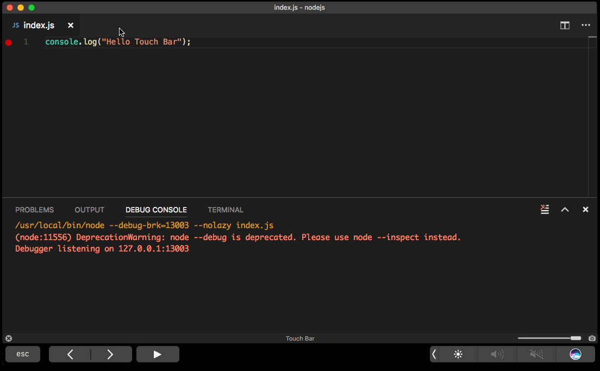

Extensions can add commands to the Touch Bar as well via the new `touchBar` menu identifier. See below under [Extension Authoring](#extension-authoring) for more details.

### Better macOS native window tabs support

You can enable native window tabs on macOS (Sierra) with the `"window.nativeTabs": true` setting. In this milestone, we made working with native tabs easier.

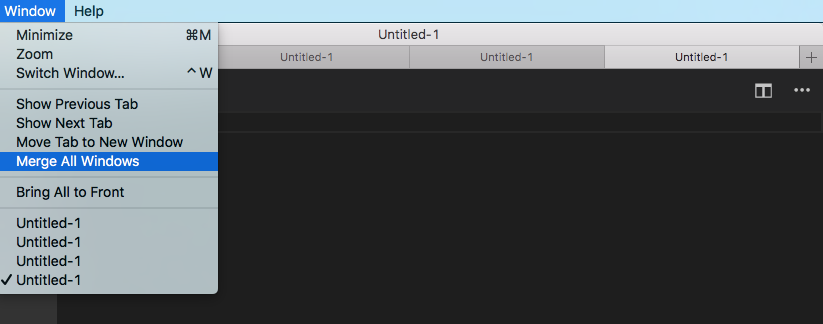

For one, you will now find a "+" action next to the last tab to open a new window as tab. We also added the typical actions to the window menu for managing tabs.

**Note**: Native tabs on macOS High Sierra (10.13) are currently only partially supported. We are working on a fix, stay tuned!

### New Visual Studio Code logo

We've updated the VS Code logo and colors, orange for the stable release and green for Insiders.

Release | Stable | Insiders
--- | --- | ---
**macOS / Linux** | 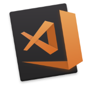 | 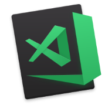
**Windows** |  | 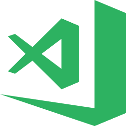

Note: Depending on your platform, you may still see the earlier logo due to operating system caching of the application icon.

### Better --wait support

VS Code can be started with the `--wait` argument from the command line to wait until the instance that opens is closed. In this milestone, we made this feature more powerful by also terminating the calling process when all of the editors are closed that got opened. As a consequence, you can now use `--wait` with instances that are already opened, making this a much faster experience.

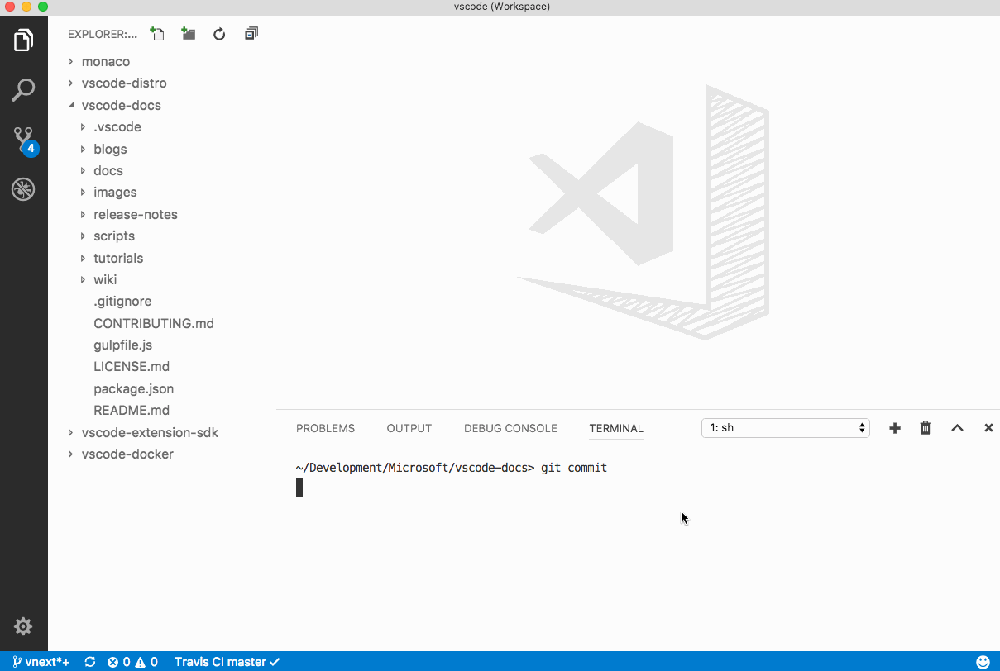

**Note**: By default, we will now reuse any opened instance. To avoid that, add the `-n` argument to the command line.

### New features around file encoding

It is now possible to configure the `files.encoding` as well as `files.autoGuessEncoding` setting per language. VS Code also now supports CP 850 and CP 865 encoding.

### New setting to control editor labels

A new setting, `workbench.editor.labelFormat`, adjusts the default label for editors. Possible values are `short`, `medium`, `long` and `default`. By default, editors will only show information about the file path when multiple editors with the same name are opened. If any of the other options is used, the editor label will always show path information.

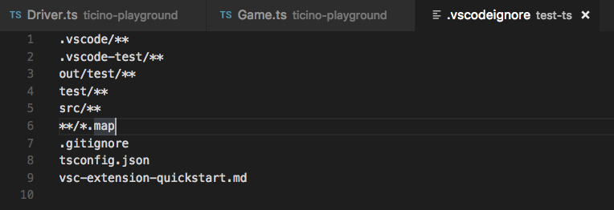

### ${workspaceFolder} in launch.json and tasks.json

We have introduced a new substitution variable `${workspaceFolder}`. This variable will get substituted to the absolute path of the workspace folder containing the appropriate `launch.json` or `tasks.json`. This has the same effect as the previous `${workspaceRoot}`, however we felt like the old name was not specific enough for the upcoming multi-root workspace scenarios. We are deprecating `${workspaceRoot}`, though we will still support substituting it for backwards compatibility. More about variable substitution can be found [here](https://code.visualstudio.com/docs/editor/debugging#_variable-substitution).

### QuickOpen uses ripgrep

QuickOpen (`kb(workbench.action.quickOpen)`) now uses [ripgrep](https://github.com/BurntSushi/ripgrep) to retrieve the full list of file names before applying the user's input filter. Windows users should see improved performance on large folders getting them on par with Linux and macOS which were previously using `find` to boost listing file names.

## Editor

### Folding regions

Folding now supports region markers. Markers are defined by the language in the language configuration.

The following languages currently have markers defined:

* TypeScript/JavaScript:  `//#region` and `//#endregion`  and `//region` and `//endregion`
* C#: `#region` and `#endregion`
* C/C++: `#pragma region` and `#pragma endregion`
* F#: `//#region` and `//#endregion`
* PowerShell: `#region` and `#endregion`
* VB: `#Region` and `#End Region`

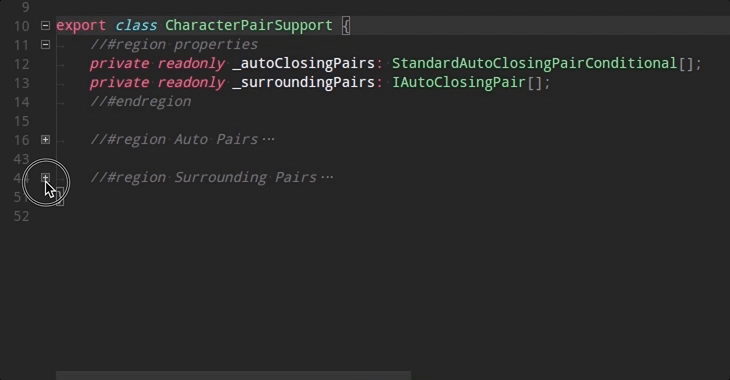

Each language also has snippets available for the markers. Type '#' and invoke code completion to see them.

To have region markers configured for your language, contact the language extension provider.

### Folding in off-side languages

In languages that follow the [off-side rule](https://en.wikipedia.org/wiki/Off-side_rule) for code blocks, empty lines belong to the next folding region.

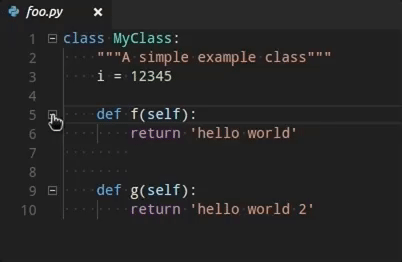

The setting is configured in the language configuration and is enabled for the following languages:

Python, Yaml, Pug, Markdown, Clojure, CoffeeScript, FSharp.

### Snippet selector

The snippet picker dropdown shown by the **Insert Snippet** command now displays snippets in two groups, **User Snippets** and **Extension Snippets**. User-defined snippets are listed on top to give you quick access to your favorite snippets.

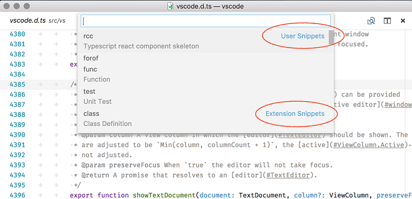

### Snippet transforms

The VS Code snippet engine now supports variable transformations. Transformations can change the value of a variable before inserting it. The format is `var_name/regular_expression/format_string/options`. The sample below is a snippet that creates a public Java class whose name is derived from the filename.

```json
  "Public Class": {
    "prefix": "pclass",
    "body": [
      "public class ${1:${TM_FILENAME/(.*)\\.java/${1:/capitalize}/}} {",
      "\tpublic $1 (${2:params}) {",
      "\t\t$0",
      "\t}",
      "}"
    ],
    "description": "New public class"
  }
```

The new part is this: `${TM_FILENAME/(.*)\\.java/${1:/capitalize}/}` and this is what it does:

1. Resolve the value for `TM_FILENAME`, for example `myClass.java`.
2. Use the regular expression `/(.*)\\.java` to create a matching group for everything that precedes the `.java` ending, for example `myClass`.
3. Take the value of the first matching group, ensure it start with capital letters (`/capitalize`), and insert it (`MyClass`).

To learn more, check out our [snippet grammar](https://code.visualstudio.com/docs/editor/userdefinedsnippets#_snippet-syntax) to see what you can do and then get creative.

### Lightbulb improvements

* The new `editor.lightbulb.enabled` setting enables or disables the Code Action light bulb in the editor. The default value is `true`.
* The Code Action menu now selects the first entry by default making it easier to run.

### Improved history navigation

VS Code has commands to navigate within the editor history (`workbench.action.navigateBack`, `workbench.action.navigateForward`), either across or within files. During this milestone, we tweaked the experience to produce less unwanted stops in history:

* We now require a minimum distance of 10 lines from one selection to another to add a new entry to history (previously we required a distance of 5 lines).
* Navigating less than 10 lines replaces the last history stop within the file with that location and thus avoids introducing unwanted stops.

In addition, we no longer center the selection vertically when navigating unless the selection is outside of the view. This makes it easier to stay in context while navigating around.

### Coloring of warning squiggles

You can now use a different color for warning squiggles to differentiate them from information:

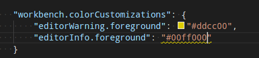

### Emmet preferences

We're continuing to add support for more [Emmet Preferences](https://docs.emmet.io/customization/preferences/) in [Emmet 2.0](https://code.visualstudio.com/blogs/2017/08/07/emmet-2.0). In addition to the preferences we added in the [last release](https://code.visualstudio.com/updates/v1_16#_emmet-preferences), we now have:

* `bem.elementSeparator`
* `bem.modifierSeparator`
* `filter.commentBefore`
* `filter.commentTrigger`
* `filter.commentAfter`

The format for the `filter.commentAfter` preference is different and simpler in Emmet 2.0.

For example, instead of the older format

```json
"emmet.preferences": {
    "filter.commentAfter": "\n<!-- /<%= attr('id', '#') %><%= attr('class', '.') %> -->"
}
```

you would use

```json
"emmet.preferences": {
    "filter.commentAfter": "\n<!-- /[#ID][.CLASS] -->"
}
```

## Integrated Terminal

### New rendering engine

The integrated terminal is now using a new canvas-based rendering engine which renders approximately 5 to 45 times faster, depending on the situation. This change reduces the input latency, power usage, and increases the frame rate of the terminal significantly.

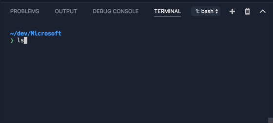

You can read about this in more detail in [our recent blog post](https://code.visualstudio.com/blogs/2017/10/03/terminal-renderer).

## Debugging

### Debug Console messages show source location

Output messages in the Debug Console now optionally show the originating source location on the right hand side:

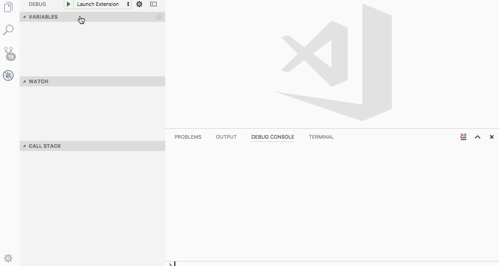

Clicking on this origin opens the source file in the editor.

**Note**: The following debuggers already support this feature:

* Node.js - "inspector" protocol only
* Extension Host debugging
* [Debugger for Chrome](https://marketplace.visualstudio.com/items?itemName=msjsdiag.debugger-for-chrome) extension

We expect more debug extensions to adopt this feature soon.

## Node Debugging

### First steps towards WSL support

Thanks to a [feature](https://github.com/microsoft/vscode-node-debug/pull/158) contributed by [Bartosz Sosnowski (@bzoz)](https://github.com/bzoz), the Node.js debugger (for this milestone "legacy" protocol only), supports launching and debugging Node.js applications in the [Windows Subsystem for Linux](https://msdn.microsoft.com/commandline/wsl/about) (WSL).

With this feature, you can add a `useWSL` flag to a debug configuration to make it run in the Linux subsystem on Windows. The flag configures the debugger not only to launch the Node.js runtime in WSL but it also maps paths correctly between WSL and Windows.

Here is the simplest debug configuration for debugging `hello.js` in WSL:

```json
{
    "type": "node",
    "request": "launch",
    "name": "Launch in WSL",
    "useWSL": true,
    "program": "${workspaceFolder}/hello.js"
}
```

### Viewing output from direct stdout/stderr writes

There are a number of Node.js logging libraries that write directly to the stdout stream, with `process.stdout.write`, rather than `console.log`. This is faster, but it isn't sent through Node's debug socket, so these messages were previously not shown in the Debug Console when debugging with the new 'inspector' protocol.

A [PR #138](https://github.com/microsoft/vscode-node-debug2/pull/138) from [Vakhurin Sergey (@igelbox)](https://github.com/igelbox) adds a new launch config option, `"outputCapture": "std"` which will tell the debug adapter to show stdout/stderr output in the Debug Console.

## Tasks

We added multi folder support to tasks. If you have created a workspace with multiple folders, tasks from all workspace folders using task version "2.0.0" are collected and presented in the corresponding **Run** commands. Launch configuration can also reference tasks as preLaunch tasks from the same workspace folder.

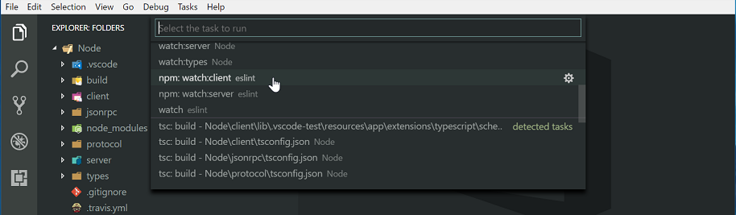

Tasks auto detection for Gulp, Grunt, Jake and npm now also support multi-root workspaces. In addition, the [task contribution API](#tasks-contribution-api) was enhanced to support contributing tasks for different workspace folders.

Please note that multi folder support still requires the [Insiders](https://code.visualstudio.com/insiders) build.

## Languages

### TypeScript 2.5.3

VS Code now includes TypeScript 2.5.3. This updates brings a few important fixes and improvements, with a focus on the extract method refactoring.

### Import path quick suggestions in JavaScript and TypeScript

JavaScript and TypeScript have provided IntelliSense for import paths ever since VS Code 1.9. However, you may not have known about this feature because it required manually triggering IntelliSense while typing the import. With VS Code 1.17, we now automatically show module and path suggestions as soon as you start typing an `import` or `require` path:

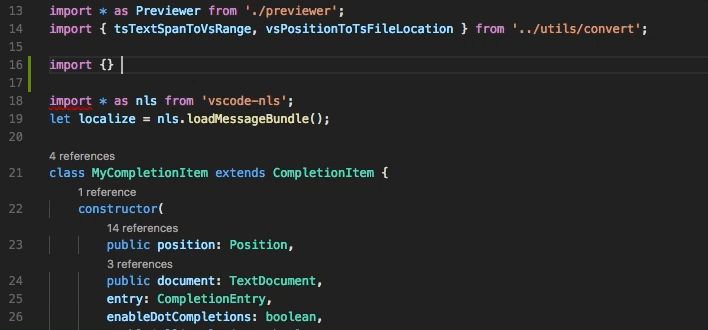

### Improved colorization in Dark+ and Light+ themes

VS Code's built-in Dark+ and Light+ themes now highlight regular expression components so that they can be more easily identified:

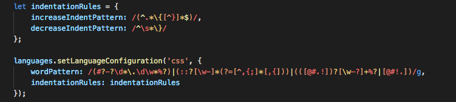

Colorization of format strings and string interpolation has also been improved for a few languages.

Python:


Ruby:

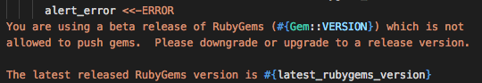

### Extract method now triggers rename

The extract method and extract function refactoring for JavaScript and TypeScript will now automatically trigger a rename on the extracted method or function.

### Auto detection of TypeScript watch build tasks

TypeScript now automatically creates watch tasks for `tsconfig.json` files in a project, along with the normal build tasks:

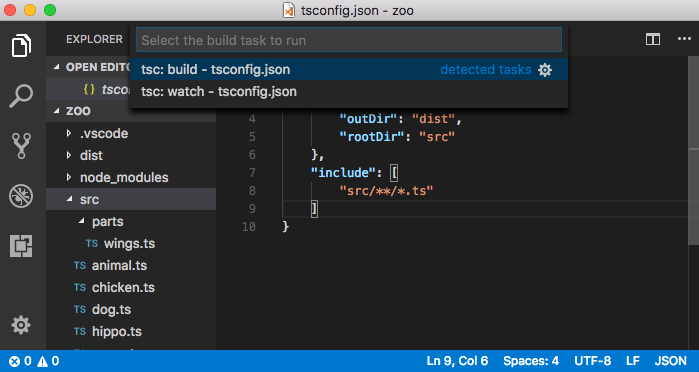

### JavaScript and TypeScript IntelliSense now supports Markdown

Suggestions and parameter hints for JavaScript and TypeScript can now render Markdown content.

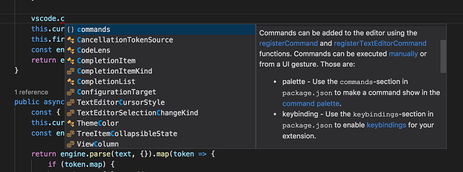

### Improvements to JSX language scoping

JavaScript expressions inside of JSX tags now are correctly marked as being of the JavaScript language. This fixes a number of bugs around basic language features such as bracket matching and code commenting.

### Language support in Markdown code blocks

Fenced code blocks in Markdown files now set the language mode for their contents. This means that basic language features such as bracket matching and code commenting now use the settings for the fenced code block's language rather than the generic Markdown language settings:

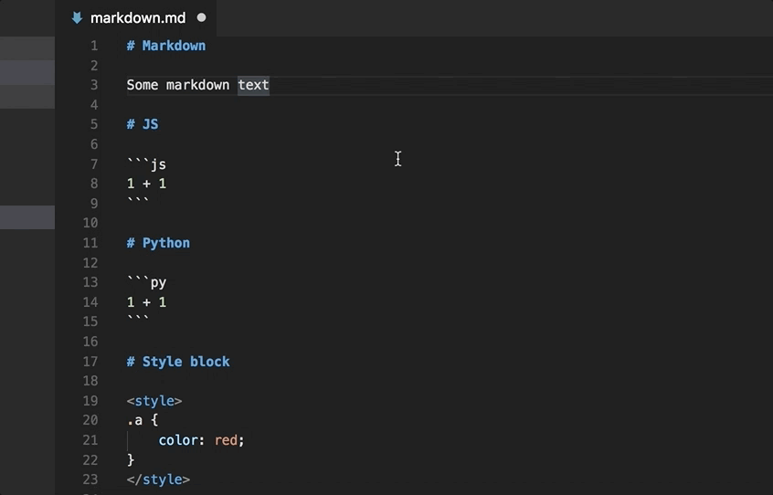

### Detection of Markdown reference links

Reference links and reference link definitions are now detected as links in the editor:

```markdown
Some text with a [link][link definition] in it

[link definition]: /path/to/link
```

Clicking on `link definition` will jump to `[link definition]:`. `/path/to/link` is now also detected as a link.

### CSS language improvements

The built-in CSS/LESS/SCSS language server was updated and now supports the following features:

* Validation and completion for the `@supports` rule.
* Support for `@import` with queries.
* Support for `contain` and various flex properties.

### R language improvements

R has improved syntax highlighting based on the grammar published [here](https://github.com/randy3k/R-Box).

## Source Control

### Improved multiple SCM support

Continuous iteration on the multiple source control provider support UX has led us to a master-detail implementation.

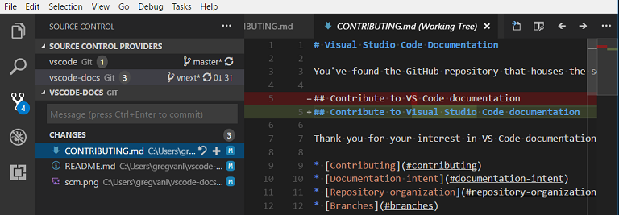

There is a new **SOURCE CONTROL PROVIDERS** section which gives you an overview when you have multiple active repositories. These can be contributed by several SCM providers; for example, you can have Git repositories side-by-side with Azure DevOps Server workspaces. As you select repositories in this view, they get highlighted underneath. You can use <kbd>ctrl+click</kbd> or <kbd>shift+click</kbd> to select multiple repositories. They will appear as split views underneath.

### Increased Performance

We did quite a bit of performance work around the Source Control extension API and UI. Overall, the experience should be much smoother especially in repositories with a large number of objects.

### Git stash commands

You might have missed this in the last release, but thanks to a PR from [Krzysztof Cieślak (@Krzysztof-Cieslak)](https://github.com/Krzysztof-Cieslak), VS Code has Git `stash` commands in the **Source Control** view **More Actions** (...) dropdown.

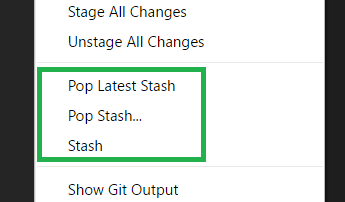

## New Documentation

### Java language support

A new [Java](https://code.visualstudio.com/docs/languages/java) language topic describes how to install and use the [Java Extension Pack](https://marketplace.visualstudio.com/items?itemName=vscjava.vscode-java-pack) for great Java code intelligence and debugging support in VS Code.

### Tips and Tricks

We've added a [Tips and Tricks](https://code.visualstudio.com/docs/getstarted/tips-and-tricks) topic to help you quickly become productive with VS Code. It includes the VS Code team's favorite features and keyboard shortcuts which they use on a daily basis.

### Debugging Recipes

We've been working on [recipes](https://github.com/microsoft/vscode-recipes) for various debugging scenarios and added a new topic outlining these guides and providing links to helpful blog posts. See [Debugging Recipes](https://code.visualstudio.com/docs/nodejs/debugging-recipes) for help on debugging frameworks such as React and Angular and runtimes like Electron and Docker.

### Updated keyboard shortcut cheat sheets

We refreshed the keyboard shortcut PDFs and added the keybindings for useful commands such as **Open User Settings** (`kb(workbench.action.openSettings)`) and **Open Keyboard Shortcuts** (`kb(workbench.action.openGlobalKeybindings)`).

* [Windows](https://go.microsoft.com/fwlink/?linkid=832145)
* [macOS](https://go.microsoft.com/fwlink/?linkid=832143)
* [Linux](https://go.microsoft.com/fwlink/?linkid=832144)

## Extension Authoring

### Multi root guide for extension authors

We are very close to shipping multi-root support for all users.  All of the VS Code core features [SCM, Settings, Debug, Tasks, ...] and extensions [HTML, JS/TS, ESLint, Docker, ...] now support multi-root concepts.

We've created a guide for how to make your extension ready for multi-root workspaces. See the [Adopting Multi Root Workspace APIs](https://github.com/microsoft/vscode/wiki/Adopting-Multi-Root-Workspace-APIs) guide for more information. All the APIs discussed are considered stable and currently available. Note however that multi-root workspaces are only enabled in VS Code Insiders release.

The extension authors guide covers:

* Basic APIs
* Settings
* Impact on extensions that have a language client/server model

In addition to the guide, there are new samples on our [samples repository](https://github.com/microsoft/vscode-extension-samples) that exercise the new APIs. Look for samples with 'multi' in their folder name (for example, [basic-multi-root-sample](https://github.com/microsoft/vscode-extension-samples/tree/main/basic-multi-root-sample)).


### File Save & File Open dialogs

The extension API has two new functions that allow extensions to show dialogs for saving and opening files or folders. The snippet below will show an open dialog to select image files.

```ts
vscode.window.showOpenDialog({
    canSelectMany: true,
    filters: { 'Images': ['png', 'jpg'] }
}).then(result => {
    if (result) {
        console.log(`${result.length} files have been selected`);
    }
});
```

### Styled completions and signature help

We have extended the API for `CompletionItems` and `SignatureHelp` such that documentation can be provided as `MarkdownString`. This allows for fancy rendering, embedded code snippets, and links to further documentation. Our own TypeScript and JavaScript extension is already using `MarkdownString`.

```ts
const item = new vscode.CompletionItem('Pretty');
item.documentation = new vscode.MarkdownString('*Hello*, `World`');
```

### CompletionContext

`CompletionItemProvider.provideCompletionItems` now is provided with a new `CompletionContext` parameter. This context contains information about how the completion provider was triggered:

```ts
interface CompletionContext {
  /**
    * How the completion was triggered.
    */
  readonly triggerKind: CompletionTriggerKind;

  /**
    * Character that triggered the completion item provider.
    * `undefined` if provider was not triggered by a character.
    * The trigger character is already in the document when the completion provider is triggered.
    */
  readonly triggerCharacter?: string;
}
```

### Touch Bar support

Extensions can now contribute commands to the touch bar on macOS. A new menu identifier `touchBar` was added for this purpose:

```json
{
  "contributes": {
    "menus": {
      "touchBar": [
        {
          "command": "markdown.showPreview",
          "when": "editorLangId == markdown",
          "group": "navigation"
        }
      ]
     }
  }
}
```

The command context is always the currently active file making it possible to show and hide the command dynamically based on the `when` condition. It can either have a label or an icon. If the command provides an icon, the label will not be shown because the space is very limited in the touch bar.

**Note**: We currently require the commands icon to be of PNG file type. SVG is not supported.

### Refer to the 'active' view column

The editor layout works with columns 1, 2, and 3 and when using the `showTextDocument` function, you can set a column. However, often you simply want to refer to the currently active column. To make that easy, we have added a new symbolic column: `ViewColumn.Active`. It will always show a document in the currently active column and saves you from figuring out what column that is.

Thanks to [Eric Amodio (@eamodio)](https://github.com/eamodio) for this contribution.

### MarkedString vs MarkdownString

Note that with this release, you cannot use command links in `MarkedStrings` anymore. If this affects your extension, we have likely already contacted you. In short, use the new `MarkdownString` and make sure to mark it as trusted. All the details and background can be found [here](https://github.com/microsoft/vscode/issues/33577).

### New Source Control menu

You can now use the `scm/sourceControl` menu id to contribute commands to the inline source control provider rows in the new **SOURCE CONTROL PROVIDERS** section of the **Source Control** view. Only context menu commands are supported for now.

### Tasks contribution API

The tasks API was enhanced to support contributing tasks for different workspace folders. The constructor to create tasks in an extension has an additional argument to specific whether the task is global, user local, or belongs to a workspace folder. The constructor signature looks like this:

```ts
export class Task {
    /**
        * Creates a new task.
        *
        * @param definition The task definition as defined in the taskDefinitions extension point.
        * @param target Specifies the task's target. It is either a global or a workspace task
        *  or a task for a specific workspace folder.
        * @param name The task's name. Is presented in the user interface.
        * @param source The task's source (e.g. 'gulp', 'npm', ...) presented in the user interface.
        * @param execution The process or shell execution.
        * @param problemMatchers the names of problem matchers to use, like '$tsc'
        *  or '$eslint'. Problem matchers can be contributed by an extension using
        *  the `problemMatchers` extension point.
        */
    constructor(taskDefinition: TaskDefinition, target: WorkspaceFolder | TaskScope.Global | TaskScope.Workspace, name: string, source: string, execution?: ProcessExecution | ShellExecution, problemMatchers?: string | string[]);
}
```

### Debug API updates

**Command `vscode.startDebug` is deprecated**

With the introduction of a proper `vscode.debug.startDebugging(...)` API in the July release, it is no longer necessary to use the `vscode.startDebug` command to start a debug session. We've deprecating the `vscode.startDebug` command in August and still plan to drop it in October. If it is difficult for you to move off this feature, please speak up by commenting [here](https://github.com/microsoft/vscode/issues/33795).

**Command `vscode.workbench.customDebugRequest` is deprecated**

With the introduction of a proper `DebugSession.customRequest(...)` API in the July release, it is no longer necessary to use the `vscode.workbench.customDebugRequest` command to send a custom request to the debug adapter. We've deprecated the `vscode.workbench.customDebugRequest` command in August and still plan to drop it in October. If it is difficult for you to move off this feature, please speak up by commenting [here](https://github.com/microsoft/vscode/issues/33796).

### Debug contributions in package.json

**New Activation event `onDebug`**

With the new debug API, extensions need a way to register their `DebugConfigurationProvider` early enough so that VS Code has them available when it needs them. Since `DebugConfigurationProvider` are typically registered in the `activate` function of an extension, we've introduced a new activation event `onDebug` which is fired just in time before any debugging activity starts (for example, configuring launch configurations or launching a debug session).

If your extension registers a `DebugConfigurationProvider`, make sure that your `activationEvents` contribution in the package.json has an `onDebug` entry.

**Activation event `onDebug:type` is deprecated**

With the introduction of the `DebugConfigurationProvider` API, it has become difficult to correctly support the activation event `onDebug:type` (where 'type' is a debug type). We recommend using the newly introduced activation event `onDebug` instead.

We are deprecating the `onDebug:type` activation event in the September milestone and plan to drop it in October. If it is difficult for you to move off this feature, please speak up by commenting [here](https://github.com/microsoft/vscode/issues/33803).

**Using `debuggers.startSessionCommand` in _package.json_ is deprecated**

With the introduction of the `resolveDebugConfiguration` method on type `DebugConfigurationProvider`, it is no longer necessary to contribute a `startSessionCommand` on the `debuggers` contribution point. Therefore we are deprecating the `startSessionCommand` in this milestone and plan to drop it in October. If it is difficult for you to move off this feature, please speak up by commenting [here](https://github.com/microsoft/vscode/issues/33791).

**Using command with `debuggers.initialConfigurations` in _package.json_ is deprecated**

With the introduction of the `provideDebugConfigurations` method on type `DebugConfigurationProvider`, it is no longer necessary to contribute a command for the `debuggers.initialConfigurations` contribution point. Therefore we are deprecating the ability to specify a command ID in this milestone and plan to drop it in October (but we will continue the support for contributing a JSON object literal). If it is difficult for you to move off this feature, please speak up by commenting [here](https://github.com/microsoft/vscode/issues/33794).

### Debug Adapter Protocol

**`BreakpointEvent` now supports a `removed` reason**

A `removed` reason has been added to the value set of the `reason` attribute of `BreakpointEvent`. With this addition, a debug adapter can notify its client (frontend) that a breakpoint has been removed.

**Please note**: With this release, VS Code now fully supports the `new`, `changed`, and `removed` reasons of the breakpoint. Previously VS Code only supported a `changed` (or `updated`) breakpoint event. Please make sure that your breakpoint event uses the correct value for `reason`.

**Locale can be passed to debug adapter**

Optionally a client (frontend) of the debug adapter protocol can pass the current locale to the debug adapter so that it can choose the correct translation for any user visible information passed back to the client (for example, error messages). There is now an optional `locale` attribute on the `initialize` request.

### Preview: Remote File System API

We are exploring support for "remote file systems". New APIs will allow extensions to contribute files and folders to the Explorer, allow to create, delete, move, and copy them, as well as to read and write files. The goal is that items from remote sources appear and behave just like files from your local disk.

The screen-capture below shows the files of an Azure function being edited like a file on disk.

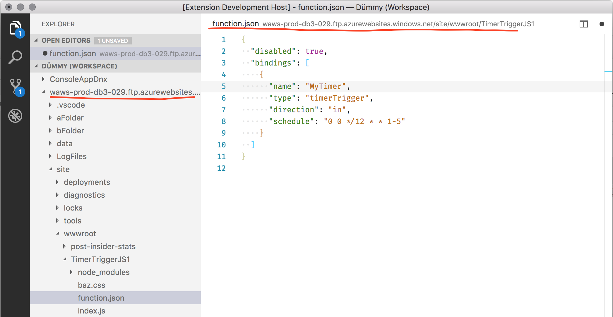

To familiarize yourself with this, see the [proposed-apis](https://github.com/microsoft/vscode/blob/38779c0593c7604136c584060ea18212d8a00b4f/src/vs/vscode.proposed.d.ts#L116) and more importantly check out our [ftp-sample](https://github.com/jrieken/ftp-sample). As we make progress and refinements on the API, we will make sure to keep this sample up to date.

## Preview: Multi Root Workspaces

>**Note:** Multi-root functionality is only available in the Insiders build until we are confident enough that we can make it available in Stable. To try it out, grab our Insiders build from [https://code.visualstudio.com/insiders](https://code.visualstudio.com/insiders).

We continued working on support for opening multiple folders in a single VS Code window (instance) ([issue #396](https://github.com/microsoft/vscode/issues/396)). There was a preview of this feature in our last releases (see [1.14.0 release notes](https://code.visualstudio.com/updates/v1_14#_preview-multi-root-workspaces), [1.15.0 release notes](https://code.visualstudio.com/updates/v1_15#_preview-multi-root-workspaces) and [1.16.0 release notes](https://code.visualstudio.com/updates/v1_16#_preview-multi-root-workspaces)).

During this milestone, we focused on making the transition into a workspace work without a window reload and introduced more APIs for extensions to better support multi-root workspaces.

### Enter a workspace without window reload

Previously we required a full window reload when creating or saving workspaces or when adding folders to a workspace. We no longer require this window reload making the multi-root experience a lot smoother.

### Extension recommendations

We extended the support of extension recommendations to multi-root workspaces. Extension recommendations from all root folders are consolidated and shown. You can also configure recommendations for the multi-root workspace itself using the command **Extensions: Configure Recommended Extensions (Workspace Folder)**. This will open the workspace configuration file and you can enter the recommendations under a `extensions/recommendations` section.

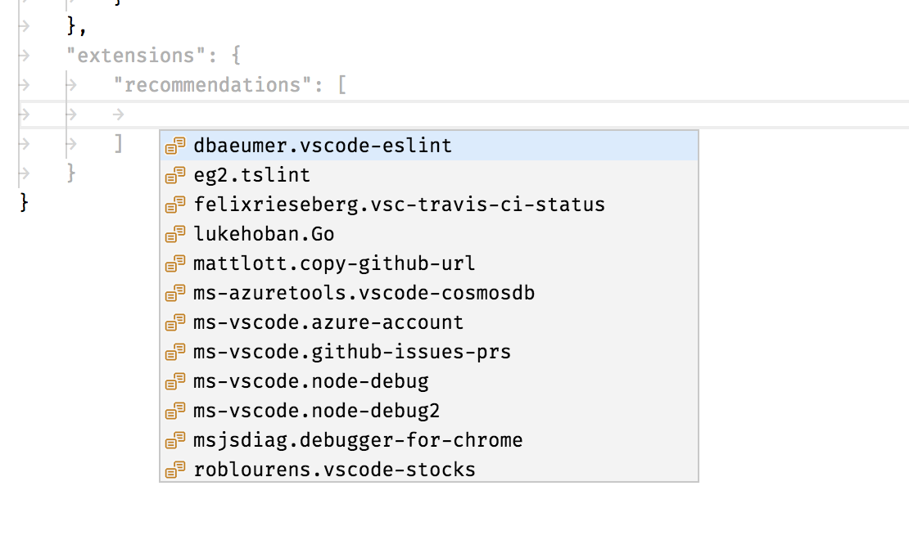

### New API: Workspace Folder Picker

With the advent of multi-root support in VS Code, we noticed that often an extension wants to ask the user for a specific `WorkspaceFolder`. The new proposed API method `showWorkspaceFolderPick` opens a picker and returns the result.

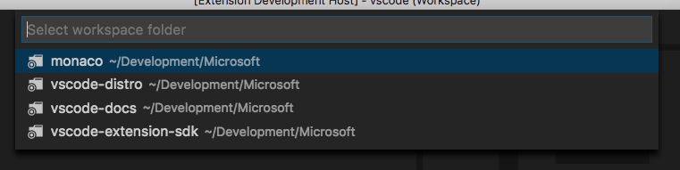

### New API: RelativePattern

To make it easier to filter file paths to a specific `WorkspaceFolder`, we added a new type `RelativePattern` and support it in the following places:

* `workspace.createFileSystemWatcher`
* `workspace.findFiles(include, exclude)`
* `DocumentFilter#pattern`

The type is a class as follows:

```typescript
/**
 * A relative pattern is a helper to construct glob patterns that are matched
 * relatively to a base path. The base path can either be an absolute file path
 * or a [workspace folder](#WorkspaceFolder).
 */
class RelativePattern {

  /**
   * A base file path to which this pattern will be matched against relatively.
   */
  base: string;

  /**
   * A file glob pattern like `*.{ts,js}` that will be matched on file paths
   * relative to the base path.
   *
   * Example: Given a base of `/home/work/folder` and a file path of `/home/work/folder/index.js`,
   * the file glob pattern will match on `index.js`.
   */
  pattern: string;

  /**
   * Creates a new relative pattern object with a base path and pattern to match. This pattern
   * will be matched on file paths relative to the base path.
   *
   * @param base A base file path to which this pattern will be matched against relatively.
   * @param pattern A file glob pattern like `*.{ts,js}` that will be matched on file paths
   * relative to the base path.
   */
  constructor(base: WorkspaceFolder | string, pattern: string)
}
```

You can create a relative pattern via the following call:

```typescript
// Construct a relative pattern for the first root folder
const relativePattern = new vscode.RelativePattern(vscode.workspace.workspaceFolders[0], '*.ts');
```

When a `RelativePattern` is used, file paths will be matched relative to the base path of the pattern. For example, given a base path of `/home/work/folder` and a file path of `/home/work/folder/index.ts`, the pattern within `RelativePattern` will match on `index.ts`.

### Smarter workspace file format saving

When saving the workspace file back to disk upon changes, we will now prefer to use forward slashes for paths on Windows in case the file is already using slashes. This should make it easier to share workspace files between Windows and other platforms.

In addition, we now preserve any comments within the workspace file. Even though JSON does not allow for comments inside the file, we now use the same JSON parser that we use for VS Code settings which allows for comments and is also more error tolerant. For example, trailing commas will not render the workspace file as invalid anymore.

### Workspace folder name

You can now assign a `name` property to each of the folders within the configuration file. The name will be picked up in the Explorer and can be used to distinguish multiple workspace folders that have the same basename.

## Engineering

### Issue management automation

We have extended the use of our [Probot](https://github.com/probot/probot) instance beyond our main repository and now use it for automatic issue assignment and closing of stale "needs more info" issues in our extension and other repositories.

## Notable Changes

* [27285](https://github.com/microsoft/vscode/issues/27285): Cannot open a folder under my OneDrive folder
* [25934](https://github.com/microsoft/vscode/issues/25934): VS Code flickers when running on a high DPI external monitor
* [35148](https://github.com/microsoft/vscode/issues/35148): VS Code opens off-screen
* [22696](https://github.com/microsoft/vscode/issues/22696): Cmd-A doesn't select all text in the save dialog save-as field

## Thank You

Last but certainly not least, a big *__Thank You!__* to the following folks that helped to make VS Code even better:

Contributions to `vscode`:

* [Arthur Ozga (@aozgaa)](https://github.com/aozgaa):  report tsserver response error as telemetry [PR #34860](https://github.com/microsoft/vscode/pull/34860)
* [Brandon Bloom (@brandonbloom)](https://github.com/brandonbloom):  Implement "Go Last" [PR #33715](https://github.com/microsoft/vscode/pull/33715)
* [@DatGuyJonathan](https://github.com/DatGuyJonathan):  Maintain focus on stopped thread when stepping a multithreaded session [PR #34401](https://github.com/microsoft/vscode/pull/34401)
* [Dustin Campbell (@DustinCampbell)](https://github.com/DustinCampbell):  Fix C# TextMate grammar to properly highlight statement-level await expressions [PR #33687](https://github.com/microsoft/vscode/pull/33687)
* [Eric Amodio (@eamodio)](https://github.com/eamodio):  Closes #27408 - Adds ViewColumn.Active [PR #34649](https://github.com/microsoft/vscode/pull/34649)
* [Putta Khunchalee (@ExUltima)](https://github.com/ExUltima):  Replace bash shebang with '#!/usr/bin/env bash" for portability [PR #34543](https://github.com/microsoft/vscode/pull/34543)
* [Alexander Fadeev (@fadeevab)](https://github.com/fadeevab): Makefile colorization: fix old issues and improvement (~4 changes) [PR #33327](https://github.com/microsoft/vscode/pull/33327)
* [Faustino Aguilar (@faustinoaq)](https://github.com/faustinoaq):  Fix #33939 [PR #34795](https://github.com/microsoft/vscode/pull/34795)
* [Felix Becker (@felixfbecker)](https://github.com/felixfbecker): Make ExtensionTipsService multi-root aware [PR #32106](https://github.com/microsoft/vscode/pull/32106)
* [Emily Marigold Klassen (@forivall)](https://github.com/forivall):  Actually don't sort folders when they are all root folders [PR #34052](https://github.com/microsoft/vscode/pull/34052)
* [Ilie Halip (@ihalip)](https://github.com/ihalip):  fixed the terminal and find widget key presses [PR #33935](https://github.com/microsoft/vscode/pull/33935)
* [Yuki Ueda (@Ikuyadeu)](https://github.com/Ikuyadeu):  Fix word highlighting Solarized Dark theme #28343 [PR #33820](https://github.com/microsoft/vscode/pull/33820)
* [Jep (@jep-a)](https://github.com/jep-a):  Add "indentationRules" for Lua [PR #31696](https://github.com/microsoft/vscode/pull/31696)
* [Keegan Carruthers-Smith (@keegancsmith)](https://github.com/keegancsmith)
  *  Fix tests and out of bounds in scorer [PR #34576](https://github.com/microsoft/vscode/pull/34576)
  *  Handle user information in URI [PR #34051](https://github.com/microsoft/vscode/pull/34051)
* [Alex Cao (@KuromiAK)](https://github.com/KuromiAK):  Improve search aria label generation performance [PR #34491](https://github.com/microsoft/vscode/pull/34491)
* [showmeear (@mazamachi)](https://github.com/mazamachi):  Fix #32822. Stop propagation keydown event when keybinding. [PR #32826](https://github.com/microsoft/vscode/pull/32826)
* [Tony Zhang (@neutrinonerd3333)](https://github.com/neutrinonerd3333):  Support commands for standalone language completion items [PR #32738](https://github.com/microsoft/vscode/pull/32738)
* [Nick Snyder (@nicksnyder)](https://github.com/nicksnyder)
  *  Use unused param [PR #33981](https://github.com/microsoft/vscode/pull/33981)
  *  Remove duplicate event firing of onDidClose [PR #34255](https://github.com/microsoft/vscode/pull/34255)
* [Oliver Joseph Ash (@OliverJAsh)](https://github.com/OliverJAsh)
  *  Add import statement snippet to .js(x) files [PR #34682](https://github.com/microsoft/vscode/pull/34682)
  *  Update .tsx import statement snippet to be consistent with .ts [PR #34653](https://github.com/microsoft/vscode/pull/34653)
* [Dániel Tar (@qcz)](https://github.com/qcz)
  *  Fix duplicated {0} placeholders in new snippetsService messages [PR #34196](https://github.com/microsoft/vscode/pull/34196)
  *  Clarify parameters with backticks in error messages [PR #35238](https://github.com/microsoft/vscode/pull/35238)
* [@rinqu-eu](https://github.com/rinqu-eu):  Add indentationRules to lua [PR #34303](https://github.com/microsoft/vscode/pull/34303)
* [Greg Zimmerman (@thezim)](https://github.com/thezim):  Fix Select-Object highlighting issue. [PR #34701](https://github.com/microsoft/vscode/pull/34701)
* [Nguyen Long Nhat (@torn4dom4n)](https://github.com/torn4dom4n):  Updated the license to MIT [PR #34486](https://github.com/microsoft/vscode/pull/34486)
* [Tony Valderrama (@tvald)](https://github.com/tvald):  Add settings to control the tab subtitle style (#12965) [PR #33815](https://github.com/microsoft/vscode/pull/33815)
* [Simon Chan (@yume-chan)](https://github.com/yume-chan):  Scroll to selection after cursorUndo command [PR #34933](https://github.com/microsoft/vscode/pull/34933)
* [Yuki Ueda (@Ikuyadeu)](https://github.com/Ikuyadeu):  Richer R syntax definition by R-Box [PR #28982](https://github.com/microsoft/vscode/pull/28982)

Contributions to `vscode-eslint`:

* [陈三 (@chenxsan)](https://github.com/chenxsan): Update sourceMaps launch option to true [PR #294](https://github.com/microsoft/vscode-eslint/pull/294)

Contributions to `language-server-protocol`:

* [Paul Brousseau (@object88)](https://github.com/object88): Fixing 'paramters' and 'reponse' typos  [PR #295](https://github.com/microsoft/language-server-protocol/pull/295)

Contributions to `vscode-node-debug`:

* [Bartosz Sosnowski (@bzoz)](https://github.com/bzoz):  Add support for Windows Subsystem Linux [PR #158](https://github.com/microsoft/vscode-node-debug/pull/158)

Contributions to `vscode-node-debug2`:

* [Vakhurin Sergey (@igelbox)](https://github.com/igelbox):  Add a launch.json option to capture output from stdoutput and stderr streams [PR #138](https://github.com/microsoft/vscode-node-debug2/pull/138)
* [Nguyen Long Nhat (@torn4dom4n)](https://github.com/torn4dom4n):  Ignore Travis and Appveyor [PR #141](https://github.com/microsoft/vscode-node-debug2/pull/141)

Contributions to `vscode-generator-code`:

* [Jiri Spac (@capaj)](https://github.com/capaj):  couple of style fixes, var->const [PR #57](https://github.com/microsoft/vscode-generator-code/pull/57)
* [Christopher Roach (@croach)](https://github.com/croach):  Fixing 'no such file or directory' error when using `workspaceFolder` [PR #89](https://github.com/microsoft/vscode-generator-code/pull/89)
* [Markus Eliasson (@eliasson)](https://github.com/eliasson):  Update gitignore to include `.vscode-test` [PR #90](https://github.com/microsoft/vscode-generator-code/pull/90)
* [Gilmore Davidson (@gilmoreorless)](https://github.com/gilmoreorless):  Typo and formatting nitpicks [PR #85](https://github.com/microsoft/vscode-generator-code/pull/85)

Contributions to `vscode-github-issues-prs`:

* [Yuki Ueda (@Ikuyadeu)](https://github.com/Ikuyadeu)
  * Add Copy Url command [PR #24](https://github.com/microsoft/vscode-github-issues-prs/pull/24)
  * Fix tslint semicolon setting [PR #23](https://github.com/microsoft/vscode-github-issues-prs/pull/23)

Contributions to `vscode-recipes`:

* [ElAndyG (@andyg8180)](https://github.com/andyg8180): removed "Launch with" to reflect the json [PR #25](https://github.com/microsoft/vscode-recipes/pull/25)
* [Anthony Sneed (@tonysneed)](https://github.com/tonysneed): Update Minimum Angular CLI Version [PR #22](https://github.com/microsoft/vscode-recipes/pull/22)

Contributions to `localization`:

This is the sixth month since we opened community localization in Transifex. We now have over 400 members in the Transifex [VS Code project](https://aka.ms/vscodeloc) team. We appreciate your contributions, either by providing new translations, voting on translations, or suggesting process improvements.

Here is a snapshot of top contributors for this release. For details about the project including the contributor name list, visit the project site at [https://aka.ms/vscodeloc.](https://aka.ms/vscodeloc)

* **French:** Antoine Griffard.
* **Italian:** Aldo Donetti, Piero Azi, Giuliano Latini.
* **German:** LosSandreas, Carsten Kneip, Christian Gräfe, Dejan Dinic, Levin Rickert.
* **Spanish:** Raul Rama, Carlos Mendible, Roberto Fonseca, Jorge Serrano Pérez, David Triana, José M. Aguilar, Andy Gonzalez.
* **Japanese:** EbXpJ6bp, Yuichi Nukiyama, Yuki Ueda, tanaka_733, Kyohei MORIYAMA, Yosuke Sano.
* **Chinese (Simplified):** Joel Yang, YingFeng, pluwen, Shawn Dai, Wang Weixuan, 林昊.
* **Chinese (Traditional):** Winnie Lin, Duran Hsieh, Ke-Hsu Chen, Poy Chang.
* **Korean:** HANSEULMARO KIM.
* **Portuguese (Brazil):** Roberto Fonseca, Bruno Sonnino, Danilo Dantas, Alessandro Fragnani, Andy Gonzalez.
* **Hungarian:** Tar Dániel, Attila Csaba Kiss.
* **Turkish:** Adem Coşkuner.
* **Czech:** Vojtěch Habarta, Frantisek Veris, Vít Staniček.
* **Dutch:** Gerald Versluis, Maarten van Stam, Sander van de Velde, Armand Duijn, Splinter Suidman, Geert van der Cruijsen, Peter Hut.
* **Indonesian:** Joseph Aditya P G, Herman Prawiro.
* **Polish:** Wojciech Maj, Patryk Adamczyk.
* **Swedish:** Joakim Olsson, Christian Svensson.
* **Bengali:** Ferdous Ahmed, Reaz Patwary.
* **Vietnamese:** Thanh Phu.

<!-- In-product release notes styles.  Do not modify without also modifying regex in gulpfile.common.js -->
<a id="scroll-to-top" role="button" aria-label="scroll to top" href="#"><span class="icon"></span></a>
<link rel="stylesheet" type="text/css" href="css/inproduct_releasenotes.css"/>
