# October 2017 (version 1.18)

**Update 1.18.1**: The update addresses these [issues](https://github.com/Microsoft/vscode/milestone/57?closed=1).

---

Welcome to the October 2017 release of Visual Studio Code. There are a number of significant updates in this release and we completed several popular outstanding feature requests. We hope you like it and the highlights include:

* **[Multi-root workspaces released to Stable](#support-for-multi-root-workspaces)** - Group a logical set of folders into a single workspace.
* **[Vertical panels](#vertical-panels)** - Dock panels (Terminal, Output, or Debug Console) to the right of your editor.
* **[Git indicators in the Explorer](#git-status-in-file-explorer)** - See pending file changes in the File Explorer.
* **[Inline pending change review](#inline-change-review)** - View pending changes and perform partial commits in the editor.
* **[Several performance improvements](#performance-improvements)** - Faster Windows start-up and editor performance tuning.
* **[Auto imports for JS/TS](#auto-import-for-javascript-and-typescript)** - Relevant imports are added as you call local symbols.
* **[Extract local variable for JS/TS](#extract-local-refactoring-for-javascript-and-typescript)** - Refactor a new local variable based on your selection.
* **[Install @types for TypeScript](#install-types-quick-fix-for-typescript)** - A new Quick Fix adds missing @types files to your project.
* **[Improved extension recommendations](#recommended-extensions-badge)** - Recommendations are highlighted in extension searches.

>If you'd like to read these release notes online, go to [Updates](https://code.visualstudio.com/updates) on [code.visualstudio.com](https://code.visualstudio.com).<br>
>You can also check out this 1.18 release [highlights video](https://youtu.be/onIsJLkcMVY) from Cloud Developer Advocate [Brian Clark](https://twitter.com/_clarkio).

The release notes are arranged in the following sections related to VS Code focus areas. Here are some further updates:

* **[Workbench](#workbench)** - Blue product logo, panels overflow support, file move confirmation.
* **[Integrated Terminal](#integrated-terminal)** - Better Windows support, show faint text, unset environment keys.
* **[Source Control](#source-control)** - Inline pending change view, File Explorer indicators.
* **[Languages](#languages)** - TypeScript 2.6.1, localized JS/TS messages, IntelliSense inside strings and comments.
* **[Debugging](#debugging)** - Debug configuration in the Status Bar, Debug view focus commands, console coloring.
* **[Extension Authoring](#extension-authoring)** - ConfigurationChangeEvent, async Input Box validation, folder open/closed icons.

**Insiders:** Want to see new features as soon as possible? You can download the nightly [Insiders](https://code.visualstudio.com/insiders) build and try the latest updates as soon as they are available.

## Workbench

### Support for Multi Root Workspaces

Support for multi-root workspaces is now enabled by default in the Stable release.  This was our [#1 feature request](https://github.com/Microsoft/vscode/issues/396) - it's been a while coming but it's here now.

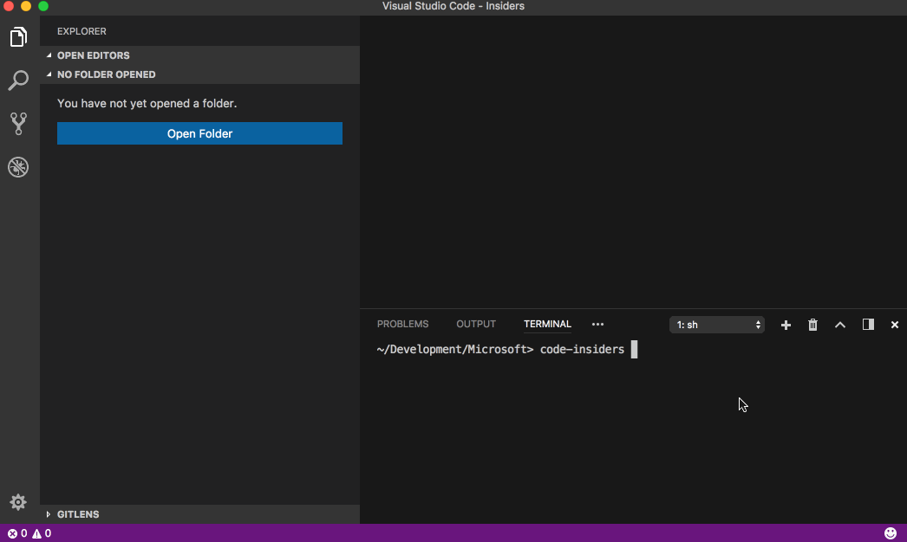

Please refer to our [documentation](https://code.visualstudio.com/docs/editor/multi-root-workspaces) for a full explanation of all of the multiple folder features: improvements to settings, our SCM experience, Tasks, Debugging and more.

> **NOTE:** Extension authors should refer to our [wiki](https://github.com/Microsoft/vscode/wiki/Extension-Authoring:-Adopting-Multi-Root-Workspace-APIs) that explains the new extension APIs to make your extension fully leverage multi-root workspaces.

### Git status in File Explorer

To satisfy another [very popular feature request](https://github.com/Microsoft/vscode/issues/178), we added support to the File Explorer to show modified, added, conflicting, and ignored files in a different color and with a badge.

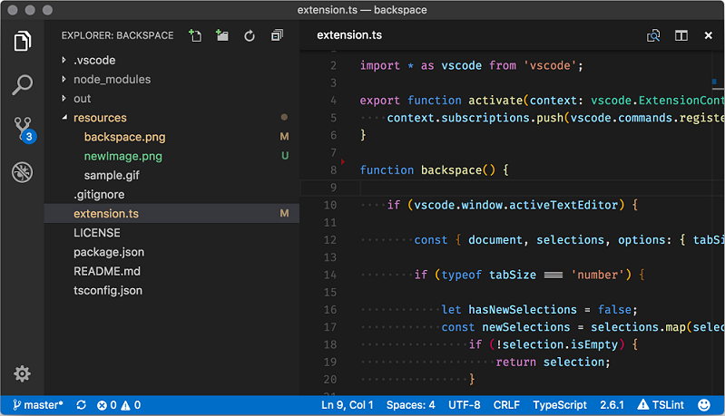

The Git file decorations can be customized in many ways. You can hide the decorations entirely with the `git.decorations.enabled` setting and configure to only show colors `explorer.decorations.colors` or badges `explorer.decorations.badges`. There are new colors for theme authors which are prefixed with `gitDecoration`.

There is also a *proposed* API to allow extension authors to add color decorations to arbitrary resources. We haven't finalized on anything yet but are eager to learn how you would use decorations.

### Vertical panels

Per popular [user request](https://github.com/Microsoft/vscode/issues/2806), we now support a vertical panel layout. Using the actions **Move to Right** and **Move to Bottom** in the panel title bar, panels can switch between being displayed on the bottom or the right side.

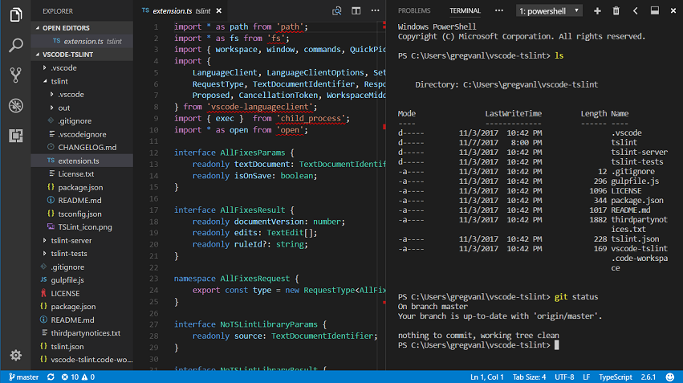

### Panel title bar improvements

We have improved the panel title bar such that it is now possible to rearrange and hide panels as well as added overflow support. Overflow with the **Additional Views** dropdown is particularly useful when the panels are docked vertically and have limited horizontal space.

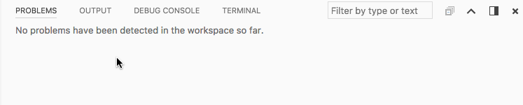

### Blue logo for Stable

The VS Code logo for Stable releases is now blue again. You can read all about our icon journey in this [blog post](https://code.visualstudio.com/blogs/2017/10/24/theicon).

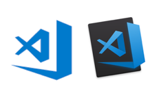

**Note**: Depending on your platform, you may still see the earlier logo due to operating system caching of the application icon.

### Confirmations in File Explorer

We now present a confirmation dialog when moving files or folders in the File Explorer via drag and drop. This should prevent accidentally performing a move when not desired. If you don't want to see the confirmation dialog, you can configure `explorer.confirmDragAndDrop` to `false`.

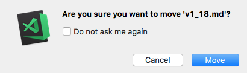

We also added a new setting, `explorer.confirmDelete`, to optionally hide our existing delete confirmation dialog.

**Note**: We will always show a confirmation dialog when deleting a file or folder will bypass your platform's trash bin.

### Quick Open applies .gitignore exclusions

**Quick Open** (`kb(workbench.action.quickOpen)`) applies the exclusions from `.gitignore` files when enabled with the `"search.useIgnoreFiles"` setting.

## Editor

### Ctrl+D / Cmd+D improvements

Due to [popular demand](https://github.com/Microsoft/vscode/issues/8869), the **Add Selection to Next Find Match** (`kb(editor.action.addSelectionToNextFindMatch)`) action has been modified to behave differently when you start adding multiple cursors with no selected text. In this case, the action will temporarily ignore the Find widget search options and will always search for whole words and case sensitive matches.

### Navigate to next / previous symbolic highlight

Thanks to [PR #35740](https://github.com/Microsoft/vscode/pull/35740) from [Krzysztof Cieślak](https://github.com/Krzysztof-Cieslak), it is now possible to navigate between highlighted symbols using `kbstyle(F7)` or `kbstyle(Shift+F7)` in languages where there is a semantic highlight provider. When you have a symbol selected, you can now quickly move to other instances of that symbol in your file.

## Integrated Terminal

### Faint text support

The terminal now supports the escape sequence for faint text:

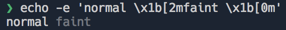

### Unset environment keys

You can already set custom environment variables for Integrated Terminal sessions but now you can also clear existing variables by assigning them to null in the `terminal.integrated.env.<platform>` settings:

```json
"terminal.integrated.env.linux": {
  "HOME": null
}
```

### Improved Windows support

Windows support in the Integrated Terminal has been improved:

* Deeply nested processes are now properly cleaned up after exiting the terminal session. This happened most frequently with servers launched from Node.js.
* On Windows, the terminal received lines already wrapped so we don't know which lines are wrapped and which are separated by new lines. We now guess where lines are wrapped by checking the last character of the previous line and flag them as such. This fixes a [problem with tasks](https://github.com/Microsoft/vscode/issues/32042) where problem matchers would break on Windows and is also one of the prerequisites to get [multi-line links](https://github.com/xtermjs/xterm.js/issues/649) working on Windows.

## Languages

### TypeScript 2.6.1

VS Code 1.18 ships with TypeScript 2.6.1. This update provides VS Code with several exciting tooling improvements and also fixes a few bugs. You can read more about TypeScript 2.6 [here](https://blogs.msdn.microsoft.com/typescript/2017/10/31/announcing-typescript-2-6/).

### Auto Import for JavaScript and TypeScript

Speed up your coding with auto imports for JavaScript and TypeScript. The suggestion list now includes all exported symbols in the current project. Just start typing:

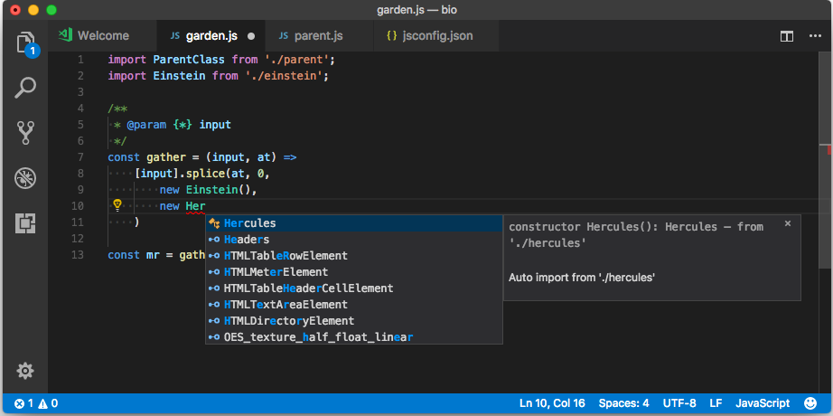

If you choose one of the suggestion from another file or module, VS Code will automatically add an import for it. In this example, VS Code adds an import for `Hercules` to the top of the file:

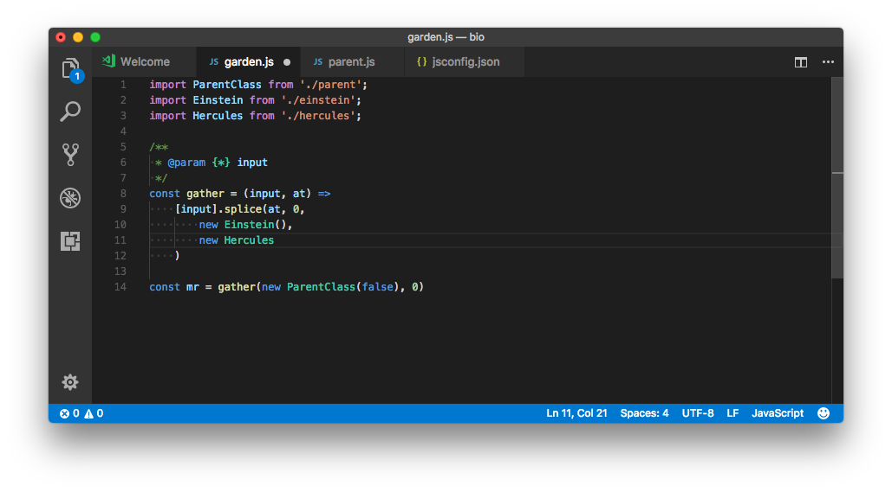

Auto imports requires TypeScript 2.6+. You can disable auto imports by setting `"typescript.autoImportSuggestions.enabled": false`.

### Localizable error messages and Quick Fix descriptions for JavaScript and TypeScript

JavaScript and TypeScript error messages and Quick Fix descriptions are now displayed in your current [display language](https://code.visualstudio.com/docs/getstarted/locales):

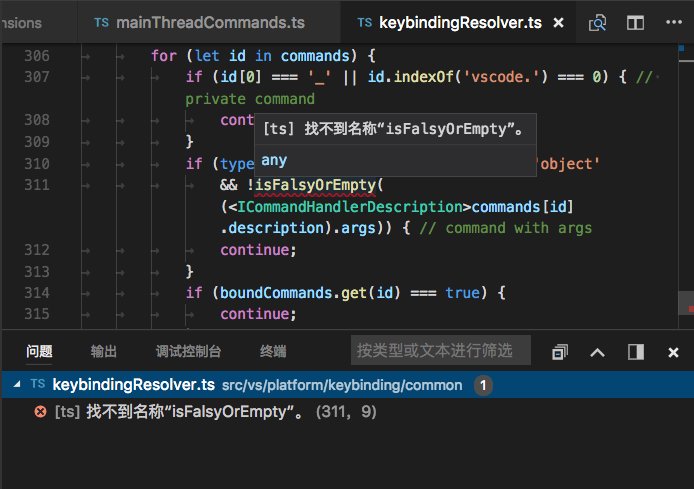

The `"typescript.locale"` setting lets you configure which language is used separately from your editor's display language. To revert to VS Code's 1.17 English only error messages, set `"typescript.locale": "en"`.

### Extract local refactoring for JavaScript and TypeScript

VS Code 1.18 adds several new JavaScript and TypeScript refactorings in addition to the extract method refactoring added in VS Code 1.16. The extract constant refactoring creates a new local variable for the currently selected expression:


When working with classes, you can also extract a value to a new property.

### Install @types Quick Fix for TypeScript

TypeScript now offers a Quick Fix to `npm install` missing `@types` definitions for a given module:

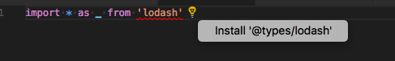

This Quick Fix will install the `@types` definition locally and add it to the `devDependencies` in your `package.json`.

### Additional `typescript.tsc.autoDetect` settings

VS Code automatically generates both build and build+watch tasks for all `tsconfig.json` files in your workspace. In VS Code 1.18, the `typescript.tsc.autoDetect` setting now lets you control which kinds of tasks are generated:

```json
"typescript.tsc.autoDetect": "build" // only generate build tasks
"typescript.tsc.autoDetect": "watch" // only generate build+watch tasks
"typescript.tsc.autoDetect": "on"    // Generate both (default)
"typescript.tsc.autoDetect": "off"   // Don't generate tsconfig build tasks
```

### Support for selectively enabling quick suggestions inside of strings and comments

Quick suggestions are disabled inside of strings and comments by default. In some cases, such as in JavaScript template strings, a string or comment may contain blocks of code where quick suggestions should be enabled. Grammars can now hint that VS Code should re-enable quick suggestions by adding a `meta.embedded` scope on tokens inside of a string or comment:


### JSON

JSON now supports JSON Schema Draft 06. The most notable additions are the `const`, `contains` and `propertyNames` properties. Read [here](http://json-schema.org/draft-06/json-schema-migration-faq.html) for a more detailed overview of changes from draft 04.

## Source Control

### Inline change review

You can now review source code changes right within the standard editor. This feature depends on whether it is supported by the source code provider but it is already enabled for Git repositories out of the box.


With this new UI, you can not only review your code changes but also navigate, stage or revert them inline.

### Git: Conflict marker detection

When staging a file which is flagged as having conflicts due to a merge or rebase, VS Code will check for the standard merge markers (for example `<<<<<<<`) and alert you if you forget to delete them when you are about to stage the file.

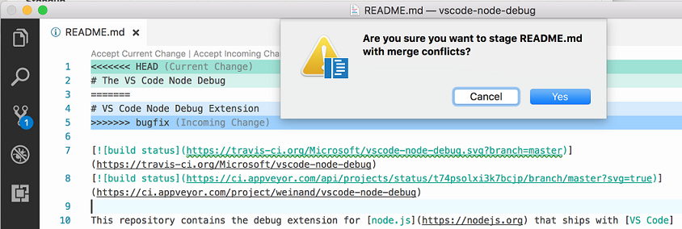

### Git: Improved integration

Recently, there was a [patch to Git](https://public-inbox.org/git/20170921043214.pyhdsrpy4omy54rm@sigill.intra.peff.net/) which enables tools like VS Code to use `git status` without interfering with other concurrent Git commands. VS Code is now prepared for that upcoming Git change by using the right environment context (`GIT_OPTIONAL_LOCKS`) when spawning Git.

## Extensions

### Recommended extensions badge

Recommended extensions now display a badge to easily distinguish them from other extensions in a list. Hover on the badge or click the list item to learn why the extension was recommended to you.

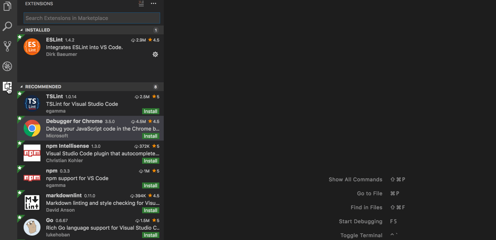

### Single view combining workspace and general recommendations

The two views for [workspace recommended extensions](https://code.visualstudio.com/docs/editor/extension-gallery#_workspace-recommended-extensions) and general recommended extensions are now combined into a single view with the two kinds of recommendations showing up in a split view. Use the command **Extensions: Show Recommended Extensions** to see this view.

There is also a handy **Install All Workspace Recommendations** command on the **WORKSPACE RECOMMENDATIONS** title bar to install all the extensions that are recommended by other users of your workspace.

You can edit workspace recommendations via the **Configure Recommended Extensions (Workspace Folder)** command in the same title bar.

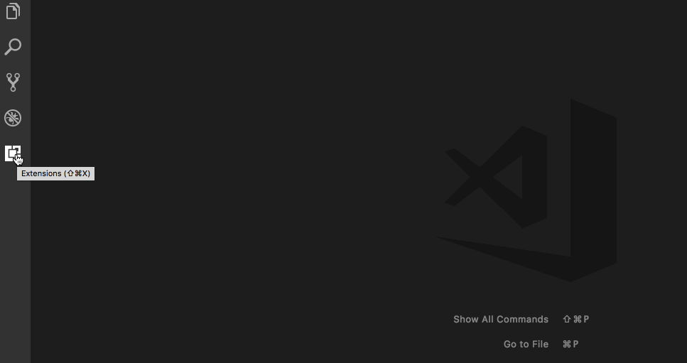

## Debugging

### Debug in Status Bar

VS Code now shows the active debug launch configuration in the Status Bar. By clicking on the debug status, a user can change the active launch configuration and then start debugging without the need to open the Debug view.


### Focus actions

We have introduced new actions to easily move keyboard focus to the various Debug sections. This should make it easier for keyboard centric users to navigate while debugging.

These actions are:

* Focus Variables: `workbench.debug.action.focusVariablesView`
* Focus Watch: `workbench.debug.action.focusWatchView`
* Focus CallStack: `workbench.debug.action.focusCallStackView`
* Focus Breakpoints: `workbench.debug.action.focusBreakpointsView`

### Start without debugging shortcut

The default keyboard shortcut on macOS for **Debug: Start Without Debugging** changed to `kbstyle(Ctrl+F5)` to avoid a collision with an existing macOS keyboard shortcut.

### Coloring of Debug Console evaluation results based on type

Debug console expressions are now colored based on the `type` property returned from the debug extension. This is currently supported by the Node.js debug extension.

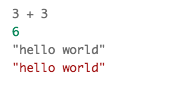

### More WSL support for Node.js

A [first glimpse](https://code.visualstudio.com/updates/v1_17#_first-steps-towards-wsl-support) of support for Node.js debugging in the _Windows Subsystem for Linux (WSL)_ was already available in the previous milestone (but only for older versions of Node.js that still support the "legacy" protocol). In this milestone, another [pull request](https://github.com/Microsoft/vscode-node-debug2/pull/142) by [Bartosz Sosnowski (@bzoz)](https://github.com/bzoz) was integrated that adds support for the "inspector" protocol that is used by more recent versions of Node.js. With this update, it is now possible to run Node.js v8 in WSL.

## Tasks

### Schema improvements

The schema for the `tasks.json` file version `2.0.0` was updated. The `taskName` property is deprecated in favor of the `label` property to make it more consistent with contributed tasks. In addition, there is now a snippet for new tasks. By default, it creates a task of type `shell` to execute commands in the Integrated Terminal.

### `workspaceFolder` replaces `workspaceRoot`

Last release, we deprecated the `${workspaceRoot}` variable in favor of `${workspaceFolder}` to make this consistent with multi-root workspace support. For the same reason, we are deprecating `${workspaceRootFolderName}`. Please use `${workspaceFolderBasename}` instead. This deprecation applies to debug launch configurations as well.

## Performance improvements

### Faster editor decorations

Decorations are a fundamental editor concept on which numerous features are built; for example: find matches highlights, diff annotations, word highlights, selection highlights, breakpoints, folding markers, and inline colors. Moreover, numerous extensions make use of decorations to customize the rendering of VS Code's editor. Below is a screenshot with various editor decorations highlighted:

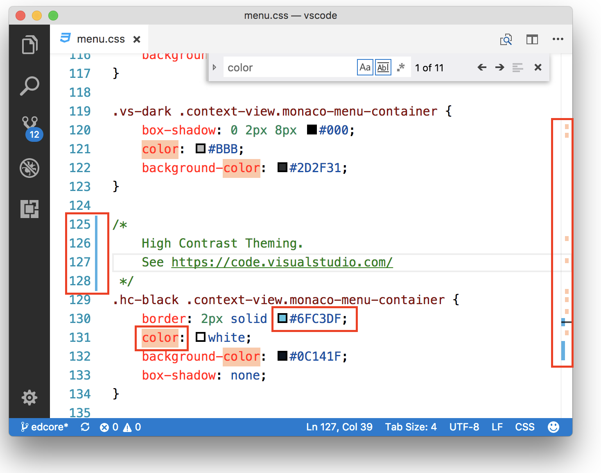

[PR #36410](https://github.com/Microsoft/vscode/pull/36410) reimplements editor decorations as a delta-encoded [Interval Tree](https://en.wikipedia.org/wiki/Interval_tree) (an augmented Red-Black tree). Besides reducing the time spent in all operations related to decorations (creating, updating, deleting or querying), the change also brings in some impressive memory usage savings. As an immediate result of these optimizations, we have increased the in-file on type find limit from 1,000 matches to 20,000 matches.

### Windows start-up

We are always on the lookout for ways to improve VS Code start-up time. During the last month, we made a variety of improvements that significantly decreased the time of the initial (cold) launch of VS Code.

## Extension Authoring

### Configuration: Listen to specific changes

Now Configuration change event provides a `ConfigurationChangeEvent` object that has a method `affectsConfiguration` to check about configuration changes. You can also check if a configuration has changed for a resource.

```typescript
/**
 * An event describing the change in Configuration
 */
export interface ConfigurationChangeEvent {

    /**
     * Returns `true` if the given section for the given resource (if provided) is affected.
     *
     * @param section Configuration name, supports _dotted_ names.
     * @param resource A resource Uri.
     * @return `true` if the given section for the given resource (if provided) is affected.
     */
    affectsConfiguration(section: string, resource?: Uri): boolean;
}
```

### Async Input Box validation

The `showInputBox` function now supports asynchronous validation. Call `showInputBox` like so:

```ts
vscode.window.showInputBox({
  async validateInput(value) {
    return await someLongRunningOperation(value);
  }
});
```

### Folder icons in File Icon Themes

File Icon themes can now disable the default folder icon (the rotating triangle) in tree views and use the folder icons to indicate the expansion state:

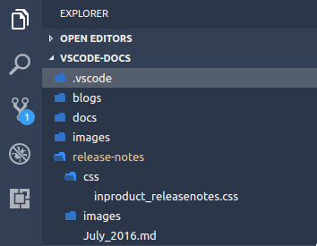

To do so, File Icon themes must specify `"hidesExplorerArrows":true` in the File Icon theme definition file.
Thanks to [Ari](https://github.com/tam5) for the [PR](https://github.com/Microsoft/vscode/pull/35856).

### New Context: resourceExtname

There is a new context key to control keybindings and menu items. Its name is `resourceExtname` and its value will be the extension of the file in question.

### New workspace.name property

A new `workspace.name` property was added that provides (readonly) access to the name of the workspace. The name will be `undefined` if no workspace is opened.

### SCM: New menu: `scm/change/title`

Along with the new SCM inline change review, a new contributable menu context is now available: `scm/change/title`. It allows you to contribute commands to the header of an inline change review view.

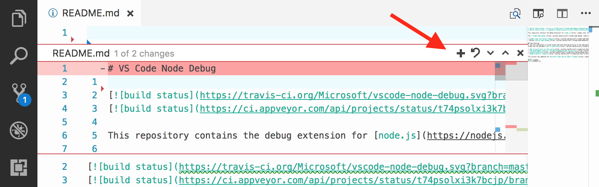

### Terminal: Setting environment

You can now set the environment of terminal instances launched via the extension API:

```ts
window.createTerminal({
  name: 'My session',
  shell: 'zsh',
  env: {
    JAVA_HOME: '<path>'
  }
});
```

### Debug API updates

**Command `debug.logToDebugConsole` is deprecated**

With the introduction of a proper `vscode.debug.console.append(...)` API in the October release, it is no longer necessary to use the `debug.logToDebugConsole` command to append text to the debug console. Due to that we are deprecating the `debug.logToDebugConsole` command and plan to drop support for it in the future. If it is difficult for you to move off this feature, please speak up by commenting [here](https://github.com/Microsoft/vscode/issues/34700).

> **Note:** Currently this API is proposed, so in order to use it you must opt into it by adding a `"enableProposedApi": true` to `package.json` and you'll have to copy the [`vscode.proposed.d.ts`](https://github.com/Microsoft/vscode/blob/master/src/vs/vscode.proposed.d.ts) into your extension project. Also be aware that you cannot publish an extension to the Marketplace that uses the `enableProposedApi` attribute.

**Command `vscode.startDebug` has been removed**

As [announced](https://code.visualstudio.com/updates/v1_17#_debug-api-updates) in the previous release, we have finally removed support for the `vscode.startDebug` command.

**Command `vscode.workbench.customDebugRequest` has been removed**

As [announced](https://code.visualstudio.com/updates/v1_17#_debug-api-updates) in the previous release, we have finally removed support for the `vscode.workbench.customDebugRequest` command.

### Debug contributions in package.json

**Activation event `onDebug:type` has been removed**

As [announced](https://code.visualstudio.com/updates/v1_17#_debug-contributions-in-packagejson) in the previous release, we have finally removed support for the `onDebug:type` activation event.

**Using `debuggers.startSessionCommand` in package.json has been removed**

As [announced](https://code.visualstudio.com/updates/v1_17#_debug-contributions-in-packagejson) in the previous release, we have finally removed support for the `startSessionCommand` command.

**Using command with `debuggers.initialConfigurations` in package.json is deprecated**

As [announced](https://code.visualstudio.com/updates/v1_17#_debug-contributions-in-packagejson) in the previous release, we have finally removed support for the `initialConfigurations` command.

**Updated documentation and mock-debug example**

With this release, most of the command based debug API has been replaced by the [proper API](https://github.com/Microsoft/vscode/blob/86e057cd25756811781237b5d84b8228f99e59ab/src/vs/vscode.d.ts#L5989-L6145) available through `vscode.d.ts`. Consequently, we have updated both the [documentation for debug extensions](https://code.visualstudio.com/docs/extensions/example-debuggers) and the underlying [mock-debug example](https://github.com/Microsoft/vscode-mock-debug) for the new APIs.

## New commands

Key|Command|Command id
---|-------|----------
`kb(workbench.action.quickOpenPreviousEditor)`|Open quick file picker with the second entry selected by default|`workbench.action.quickOpenPreviousEditor`
`kb(workbench.action.openFolderAsWorkspaceInNewWindow)`|Open a folder as workspace in a new window|`workbench.action.openFolderAsWorkspaceInNewWindow`
`kb(workbench.action.removeRootFolder)`|Remove a root folder from the workspace|`workbench.action.removeRootFolder`
`kb(workbench.action.problems.focus)`|Focus Problems|`workbench.action.problems.focus`
`kb(workbench.debug.action.focusVariablesView)`|Focus Variables|`workbench.debug.action.focusVariablesView`
`kb(workbench.debug.action.focusWatchView)`|Focus Watch|`workbench.debug.action.focusWatchView`
`kb(workbench.debug.action.focusCallStackView)`|Focus CallStack|`workbench.debug.action.focusCallStackView`
`kb(workbench.debug.action.focusBreakpointsView)`|Focus Breakpoints|`workbench.debug.action.focusBreakpointsView`

## Notable Changes

* [22523](https://github.com/Microsoft/vscode/issues/22523): Touch support in editor tabs (scrolling, open, context menu)
* [35527](https://github.com/Microsoft/vscode/issues/35527): macOS High Sierra: parts of the UI not rendering
* [36122](https://github.com/Microsoft/vscode/issues/36122): Windows: window on secondary monitor does not restore at exact position
* [36695](https://github.com/Microsoft/vscode/issues/36695): Workspace doesn't restores itself on re-opening Code in Ubuntu 17.10 GNOME

## Thank You

Last but certainly not least, a big *__Thank You!__* to the following folks that helped to make VS Code even better:

* [@284km](https://github.com/284km):  Fix a typo [PR #36702](https://github.com/Microsoft/vscode/pull/36702)
* [Fares Rihani (@anchepiece)](https://github.com/anchepiece):  Update code.iss to associate `.bib` files [PR #36509](https://github.com/Microsoft/vscode/pull/36509)
* [Andy Li (@andyli)](https://github.com/andyli):  replace 'Courier New' with 'monospace' in Linux font list [PR #34947](https://github.com/Microsoft/vscode/pull/34947)
* [Arthur Ozga (@aozgaa)](https://github.com/aozgaa):  add tsserver version property to every event [PR #37066](https://github.com/Microsoft/vscode/pull/37066)
* [Beyang Liu (@beyang)](https://github.com/beyang):  Remove kludge that adds history item when new input is set on an editor [PR #35682](https://github.com/Microsoft/vscode/pull/35682)
* [Brandon Bloom (@brandonbloom)](https://github.com/brandonbloom):  Fixes #36544. [PR #36578](https://github.com/Microsoft/vscode/pull/36578)
* [Dan Adler (@dadlerj)](https://github.com/dadlerj):  Don't re-render hovers if nothing has changed; Add telemetry on hovers [PR #29387](https://github.com/Microsoft/vscode/pull/29387)
* [David Gileadi (@dgileadi)](https://github.com/dgileadi):  Support the "reason" arg for trimming trailing whitespace [PR #35778](https://github.com/Microsoft/vscode/pull/35778)
* [Dominik Kundel (@dkundel)](https://github.com/dkundel):  Playground improvements as suggested in #35328 [PR #36681](https://github.com/Microsoft/vscode/pull/36681)
* [Don Jayamanne (@DonJayamanne)](https://github.com/DonJayamanne):  fixes #36854 folder picker api [PR #36855](https://github.com/Microsoft/vscode/pull/36855)
* [Eli Barzilay (@elibarzilay)](https://github.com/elibarzilay):  Fix small typo [PR #35531](https://github.com/Microsoft/vscode/pull/35531)
* [Felix Becker (@felixfbecker)](https://github.com/felixfbecker)
  * Use local gulp in CI [PR #35474](https://github.com/Microsoft/vscode/pull/35474)
  * Cache npm cache in CI [PR #35473](https://github.com/Microsoft/vscode/pull/35473)
* [Felix Krull (@fkrull)](https://github.com/fkrull):  Fix misspelt hc-black class. [PR #37008](https://github.com/Microsoft/vscode/pull/37008)
* [Gunnar Wagenknecht (@guw)](https://github.com/guw):  Only restore expansion state when there are items. [PR #36539](https://github.com/Microsoft/vscode/pull/36539)
* [lizz (@innerlee)](https://github.com/innerlee):  Region fold in python [PR #35830](https://github.com/Microsoft/vscode/pull/35830)
* [Julian Andres Klode (@julian-klode)](https://github.com/julian-klode):  Correctly get apt dirs in debian postinst [PR #35535](https://github.com/Microsoft/vscode/pull/35535)
* [Keegan Carruthers-Smith (@keegancsmith)](https://github.com/keegancsmith)
  * git: Include GitErrorData in GitError.toString [PR #36971](https://github.com/Microsoft/vscode/pull/36971)
  * git: Throw fetch error [PR #36974](https://github.com/Microsoft/vscode/pull/36974)
* [Markus Wolf (@KnisterPeter)](https://github.com/KnisterPeter):  feat(git): allow url to be given to git.clone [PR #34006](https://github.com/Microsoft/vscode/pull/34006)
* [Krzysztof Cieślak (@Krzysztof-Cieslak)](https://github.com/Krzysztof-Cieslak)
  * Navigate to next/previous symbolic match in file [PR #35740](https://github.com/Microsoft/vscode/pull/35740)
  * Add `editorFileExtension` when clause context [PR #34889](https://github.com/Microsoft/vscode/pull/34889)
* [猫科龙 (@maokelong)](https://github.com/maokelong):  Correct the EBNF for snippets [PR #36067](https://github.com/Microsoft/vscode/pull/36067)
* [Max Schmitt (@maxibanki)](https://github.com/maxibanki)
  * Fixed typo [PR #36800](https://github.com/Microsoft/vscode/pull/36800)
  * Fixed typos [PR #36804](https://github.com/Microsoft/vscode/pull/36804)
  * Updated coffeescript tmLanguage file [PR #37035](https://github.com/Microsoft/vscode/pull/37035)
* [@MichielVanderlee](https://github.com/MichielVanderlee):  #3422 Add Region folding for bat [PR #36911](https://github.com/Microsoft/vscode/pull/36911)
* [Soo Jae Hwang (@misoguy)](https://github.com/misoguy)
  * Enable click and open mailto links in Markdown preview [PR #36795](https://github.com/Microsoft/vscode/pull/36795)
  * Fix windowOpenNoOpener not opening new window [PR #36857](https://github.com/Microsoft/vscode/pull/36857)
* [Nick Snyder (@nicksnyder)](https://github.com/nicksnyder):  add missing awaits [PR #36265](https://github.com/Microsoft/vscode/pull/36265)
* [Peter Wong (@peterwmwong)](https://github.com/peterwmwong):  Fix moveSelectionToPreviousFindMatch accidentally mapped to addSelectionToPreviousFindMatch [PR #37088](https://github.com/Microsoft/vscode/pull/37088)
* [Yemi Bedu @ P&R (@pr-yemibedu)](https://github.com/pr-yemibedu):  expand editor code region styles - fsharp [PR #35919](https://github.com/Microsoft/vscode/pull/35919)
* [Raj (@prog-rajkamal)](https://github.com/prog-rajkamal):  Fix #35322: Modernize javascript snippets [PR #35444](https://github.com/Microsoft/vscode/pull/35444)
* [jmdowns2 (@jmdowns2)](https://github.com/jmdowns2): Fix overlapping of emmet expansions in multi cursor mode [PR #35463](https://github.com/Microsoft/vscode/pull/35463)
* [Dániel Tar (@qcz)](https://github.com/qcz)
  * Fix wrong placement of 'e.g.'s in the description of `window.title` setting [PR #35986](https://github.com/Microsoft/vscode/pull/35986)
  * Fix different error message in source and package.nls for npm package [PR 37096](https://github.com/Microsoft/vscode/pull/37096)
  * Clarify debugRequestNotSupported message in debugService.ts [PR #35387](https://github.com/Microsoft/vscode/pull/35387)
  * Improve consistency of Emmet messages [PR #36251](https://github.com/Microsoft/vscode/pull/36251)
* [Robert Sesek (@rsesek)](https://github.com/rsesek):  Specify the UTI types for files in the Info.plist [PR #37106](https://github.com/Microsoft/vscode/pull/37106)
* [Brendan Forster (@shiftkey)](https://github.com/shiftkey):  disable lookup for GitHub's version of Git [PR #35965](https://github.com/Microsoft/vscode/pull/35965)
* [Shreya Dahal (@squgeim)](https://github.com/squgeim):  Fixed a typo in the comments [PR #35833](https://github.com/Microsoft/vscode/pull/35833)
* [Steve Desmond (@stevedesmond-ca)](https://github.com/stevedesmond-ca):  update keytar to 4.0.5 [PR #36849](https://github.com/Microsoft/vscode/pull/36849)
* [Ari Miller (@tam5)](https://github.com/tam5):  allow hiding explorer arrows via icon theme [PR #35856](https://github.com/Microsoft/vscode/pull/35856)
* [Thomas Rayner (@ThmsRynr)](https://github.com/ThmsRynr):  Fix #36924. PowerShell Extension Comment Highlighting Error [PR #36926](https://github.com/Microsoft/vscode/pull/36926)
* [Vinaya (@vnbhattarai)](https://github.com/vnbhattarai):  Fix grammar: Current => Currently [PR #36694](https://github.com/Microsoft/vscode/pull/36694)
* [Winsky (@wenshiqi0)](https://github.com/wenshiqi0):  global is undefined while polyfilling the native promise [PR #37017](https://github.com/Microsoft/vscode/pull/37017)
* [Guangcong Luo (@Zarel)](https://github.com/Zarel):  Fix stray space in editor config [PR #37010](https://github.com/Microsoft/vscode/pull/37010)

Contributions to `language-server-protocol`:

* [Paul Brousseau (@object88)](https://github.com/object88): Typo: 'notificatins' [PR #301](https://github.com/Microsoft/vscode-languageserver-node/pull/301)
* [Remy Suen (@rcjsuen)](https://github.com/rcjsuen): Grammar fixes [PR #319](https://github.com/Microsoft/language-server-protocol/pull/319)

Contributions to `vscode-languageserver-node`:

* [Remy Suen (@rcjsuen)](https://github.com/rcjsuen): Specify that the workspace.applyEdit feature is enabled in the client [PR #264](https://github.com/Microsoft/vscode-languageserver-node/pull/264)
* [Paul Brousseau (@object88)](https://github.com/object88): Renaming ProtocolConnetion to ProtocolConnection [PR #265](https://github.com/Microsoft/vscode-languageserver-node/pull/265)

Contributions to `vscode-node-debug2`:

* [Bartosz Sosnowski (@bzoz)](https://github.com/bzoz): Add support for Windows Subsystem Linux - refactored [PR #142](https://github.com/Microsoft/vscode-node-debug2/pull/142)
* [Sindre Svendby (@SindreSvendby)](https://github.com/SindreSvendby):  Accept .mjs as a valid file ending [PR #147](https://github.com/Microsoft/vscode-node-debug2/pull/147)

Contributes to `vscode-chrome-debug`:

* [John Papandriopoulos (@jpap)](https://github.com/jpap): Support for env and cwd options. [PR #520](https://github.com/Microsoft/vscode-chrome-debug/pull/520)

Contributes to `vscode-chrome-debug-core`:

* [@digeff](https://github.com/digeff): Fix site.js appearing in the call stack instead of site.ts [PR #246](https://github.com/Microsoft/vscode-chrome-debug-core/pull/246)

Contributes to `vscode-extension-samples`:

* [Thomas Reggi (@reggi)](https://github.com/reggi): isWatching deprecated use isBackground [PR #26](https://github.com/Microsoft/vscode-extension-samples/pull/26)
* [Nick Chen (@vazexqi)](https://github.com/vazexqi): Add sample on how to localize in VS Code [PR #21](https://github.com/Microsoft/vscode-extension-samples/pull/21)

Contributes to `vscode-recipes`:

* [MOrlassino (@MOrlassino)](https://github.com/MOrlassino): Update README.md [PR #26](https://github.com/Microsoft/vscode-recipes/pull/26)
* [Tom Fenech (@fenech)](https://github.com/fenech): Fix typo in filename [PR #30](https://github.com/Microsoft/vscode-recipes/pull/30)

Contributes to `vscode-extension-vscode`:

* [Jimi (Dimitris) Charalampidis (@JimiC)](https://github.com/JimiC)
  * Cleanup and add more files/folders to be ignored [PR #80](https://github.com/Microsoft/vscode-extension-vscode/pull/80)
  * Update all dependencies [PR #79](https://github.com/Microsoft/vscode-extension-vscode/pull/79)
  * added bin [PR #75](https://github.com/Microsoft/vscode-extension-vscode/pull/75)

Contributions to `localization`:

This is the seventh month since we opened community localization in Transifex. We now have nearly 500 members in the Transifex [VS Code project](https://aka.ms/vscodeloc) team. We appreciate your contributions, either by providing new translations, voting on translations, or suggesting process improvements.

Here is a snapshot of top contributors for this release. For details about the project including the contributor name list, visit the project site at [https://aka.ms/vscodeloc.](https://aka.ms/vscodeloc)

* **French:** Antoine Griffard.
* **Italian:** Aldo Donetti, Piero Azi, Alessandro Alpi.
* **German:** Carsten Kneip, Volkmar Rigo, Dejan Dinic, Jakob, Florian Seidl, Max Schmitt, Levin Rickert.
* **Spanish:** Andy Gonzalez, Alberto Poblacion, David Triana, Carlos Mendible, José M. Aguilar, Pablo Jiménez Pascual, Raul Rama, Jorge Serrano Pérez.
* **Japanese:** EbXpJ6bp, Yuichi Nukiyama, Tomoaki Yoshizawa, Takashi Takebayashi, Yuki Ueda, Yoshihisa Ozaki, Qp ringo, tanaka_733, Hiroyuki Mori, tempura.sukiyaki.
* **Chinese (Simplified):** Joel Yang, pluwen, Shawn Dai, Wang Weixuan, YF.
* **Chinese (Traditional):** Winnie Lin, Duran Hsieh, Wei-Ting(DM), Yuer Lee.
* **Korean:** partrita.
* **Hungarian:** Tar Dániel.
* **Portuguese (Brazil):** Roberto Fonseca, Danilo Dantas, Bruno Sonnino, SQLCrespi, Alessandro Fragnani.
* **Portuguese (Portugal):** António Lourenço, Miguel de Moura.
* **Turkish:** Adem Coşkuner.
* **Czech:** Sharp Mike, Leopold Podmolík.
* **Dutch:** Gerald Versluis, Tom Aerts.
* **Polish:** Sölve Svartskogen, KarbonKitty, Wojciech Maj, Mateusz Wyczawski, Marek Kurdej, Patryk Adamczyk, piotrsm7.
* **Swedish:** Johan Hedén, Joakim Olsson, Benny Skoog.
* **Tamil:** Avinash, Nadar Solomon Sunder, Praveen, Jeyanthinath Muthuram.
* **Vietnamese:** Thanh Phu.

<!-- In-product release notes styles.  Do not modify without also modifying regex in gulpfile.common.js -->
<a id="scroll-to-top" role="button" aria-label="scroll to top" href="#"><span class="icon"></span></a>
<link rel="stylesheet" type="text/css" href="css/inproduct_releasenotes.css"/>
