# November 2017 (version 1.19)

**Update 1.19.3**: The update addresses [issue 42144](https://github.com/Microsoft/vscode/issues/42144) where the Workbench failed to load when having the [Running Extensions](#running-extensions) view opened and profiling.

**Update 1.19.2**: The update addresses these [issues](https://github.com/Microsoft/vscode/milestone/61?closed=1). This update also includes a fix for an Electron [security vulnerability](https://cve.mitre.org/cgi-bin/cvename.cgi?name=CVE-2018-1000006). To learn more details about the applied mitigation, see this [blog post](https://electronjs.org/blog/protocol-handler-fix).

**Update 1.19.1**: The update addresses these [issues](https://github.com/Microsoft/vscode/milestone/60?closed=1).

> Note: As a result of fixing [issue 40351](https://github.com/Microsoft/vscode/issues/40351), we now **require** you to pass "`-`" as an argument to explicitly signal that the output of a piped command is coming in through `stdin`. For example: `echo Hello World | code -` (Windows) and `ps aux | grep code | code -` (macOS, Linux). This is a breaking change from `1.19.0`, please update any scripts that make use of this functionality.

Downloads: [Windows](https://vscode-update.azurewebsites.net/1.19.3/win32-x64/stable) | [Mac](https://vscode-update.azurewebsites.net/1.19.3/darwin/stable) | Linux 64-bit: [.tar.gz](https://vscode-update.azurewebsites.net/1.19.3/linux-x64/stable) [.deb](https://vscode-update.azurewebsites.net/1.19.3/linux-deb-x64/stable) [.rpm](https://vscode-update.azurewebsites.net/1.19.3/linux-rpm-x64/stable) | Linux 32-bit: [.tar.gz](https://vscode-update.azurewebsites.net/1.19.3/linux-ia32/stable) [.deb](https://vscode-update.azurewebsites.net/1.19.3/linux-deb-ia32/stable) [.rpm](https://vscode-update.azurewebsites.net/1.19.3/linux-rpm-ia32/stable)

---

Welcome to the November 2017 release of Visual Studio Code. As announced in the [November iteration plan](https://github.com/Microsoft/vscode/issues/38268), the focus this month was on GitHub issue clean-up, product performance, and data collection tools for better issue reporting.

During this iteration, we closed **4400** issues (either triaged or fixed) across all our VS Code repositories. As we busily closed issues, you did not stop filing new ones and you created around **2700** new issues. This resulted in a net reduction of around **1700** issues of which **1400** were in the main [vscode repository](https://github.com/Microsoft/vscode/issues).

Bug fixes as well as community PRs still resulted in a great list of updates. Here are some of the release highlights:

* **[Performance](#performance)** - Faster startup and other performance improvements.
* **[Serviceability/Diagnostics](#serviceability)** - New VS Code diagnostics, logging, and extension monitoring.
* **[Smarter IntelliSense](#smarter-intellisense)** - IntelliSense remembers your previous suggestion choices.
* **[Better Tab layout](#new-editor-tabs-layout-option)** - Tabbed headers can scale to fit the available space.
* **[Git side-by-side image diff](#image-diffing)** - Git source control provider can display image changes side by side.
* **[Pipe output into VS Code](#pipe-output-directly-into-vs-code)** - Easily view terminal output in a VS Code editor.
* **[New debugging recipes](#debugging-recipes)** - Learn how to debug Next.js, Meteor projects and applications using the nodemon utility.

>If you'd like to read these release notes online, go to [Updates](https://code.visualstudio.com/updates) on [code.visualstudio.com](https://code.visualstudio.com).<br>
>You can also check out this 1.19 release [highlights video](https://youtu.be/p6-7GLHWdac) from Cloud Developer Advocate [Brian Clark](https://twitter.com/_clarkio).

The release notes are arranged in the following sections related to VS Code focus areas. Here are some further updates:

* **[Workbench](#workbench)** - Compare your active file to the Clipboard contents.
* **[Editor](#editor)** - Folding improvements, interval line numbers, support macOS global Clipboard.
* **[Languages](#languages)** - TypeScript 2.6.2, JSX fragment syntax, new JSON with comments mode.
* **[Debugging](#debugging)** - Undefine env variables per session, better VARIABLES rendering.
* **[Extensions](#extensions)** - Choose which extensions are active in your workspaces.
* **[Extension Authoring](#extension-authoring)** - Pre-release extension support, yo code can enable TSLint and checkJS.

**Insiders:** Want to see new features as soon as possible? You can download the nightly [Insiders](https://code.visualstudio.com/insiders) build and try the latest updates as soon as they are available.

## Performance

Performance is key to an editor and during November we fixed almost 50 performance-related issues. We spent significant time in the profiler and revisited the initialization phase of VS Code. Improving performance is not just about optimizing algorithms but also about improving perceived performance for the user. We began thinking about the startup life-cycle phases ([#38080](https://github.com/Microsoft/vscode/issues/38080)) to better order the creation of our components for faster perceived startup (for instance, always try to show a blinking cursor in the editor). To learn more about our performance work, you can review our issues labeled with [perf-startup](https://github.com/Microsoft/vscode/issues?q=is%3Aissue+label%3Aperf-startup+milestone%3A%22November+2017%22+is%3Aclosed), [perf-bloat](https://github.com/Microsoft/vscode/issues?utf8=✓&q=is%3Aissue+milestone%3A%22November+2017%22+is%3Aclosed+label%3Aperf-bloat) (source code reduction), or [perf](https://github.com/Microsoft/vscode/issues?q=is%3Aissue+milestone%3A%22November+2017%22+is%3Aclosed+label%3Aperf).

Finally here are some noteworthy optimizations we'd like to mention:

* Improve startup and overall performance with an improved configuration-model [#37426](https://github.com/Microsoft/vscode/issues/37426), [#37539](https://github.com/Microsoft/vscode/issues/37539).
* Improve startup by caching extension information from `package.json` files [#28331](https://github.com/Microsoft/vscode/issues/28331).
* Improve startup by delaying the creation of helper processes, like file watcher [#38230](https://github.com/Microsoft/vscode/issues/38230), search app [#38235](https://github.com/Microsoft/vscode/issues/38235), and extensions process [#38323](https://github.com/Microsoft/vscode/issues/38323).
* Improve file loading for better startup performance [#37541](https://github.com/Microsoft/vscode/issues/37541).
* Use the faster list widget instead of the tree when possible [#38638](https://github.com/Microsoft/vscode/issues/38638). Rework the BREAKPOINTS view and the OPEN EDITORS Explorer section.
* Optimize the handling of touch events for improved performance [#37917](https://github.com/Microsoft/vscode/issues/37917).
* Improve the overall workbench performance by skipping unnecessary layouts and computations [39699](https://github.com/Microsoft/vscode/issues/), [#39185](https://github.com/Microsoft/vscode/issues/), [#38966](https://github.com/Microsoft/vscode/issues/), [#38963](https://github.com/Microsoft/vscode/issues/), [#38962](https://github.com/Microsoft/vscode/issues/), [#38960](https://github.com/Microsoft/vscode/issues/).
* Improve startup by removing unused code [#38414](https://github.com/Microsoft/vscode/issues/38414).

And we are not done. Performance is a constant theme of the whole development team. Track our work with the perf-labels and don't be shy in filing performance related issues.

## Serviceability

This release we also focused on VS Code serviceability in order to make it easier for you to provide us with the information we need to track down issues. We worked on logging, diagnostics, and extension monitoring to help you help us to make VS Code even better. Some of these features are still under development but we wanted to get these tools in your hands early.

### Logging

VS Code now creates activity log files which can help diagnose unexpected issues like crashes, delays, etc.. When running, VS Code creates four primary processes, `main`, `shared`, `renderer` and `extension-host`, and each process logs into its own log file. You can open each log file using the command **Developer: Show Logs...** which will open a process picker to select the specific process log file.

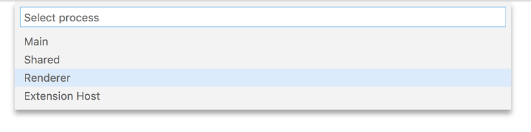

VS Code supports following log levels:

* `critical`
* `error`
* `warn`
* `info`
* `debug`
* `trace`
* `off`

By default, VS Code is configured with `info` level and logs `info` and the levels above (`warn`, `error`, `critical`). You can change the log level using the command line argument `--log`.

```bash
--log <level>
    Log level to use. Default is 'info'. Allowed values are 'critical', 'error', 'warn', 'info', 'debug', 'trace', 'off'.
```

You can also turn off logging using the option `--log off`.

### --status command line option

A new command line argument was added which prints some useful VS Code diagnostics information to the terminal. You can share this information with us in GitHub issues and we will have a better understanding of the state of VS Code at the time of the issue.

Run `code --status` from the command line while another instance of VS Code is running and, after collecting status, you will see a display like this:

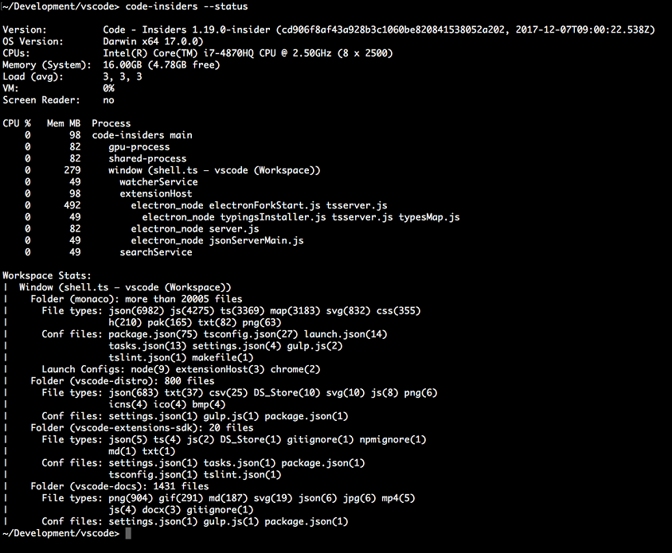

The output includes information about the environment, all running processes, and the counts of some common file types in the workspace.

### VS Code process view

As a by-product of the new VS Code command line option `--status`, we created an experimental extension [vscode-processes](https://github.com/weinand/vscode-processes) that shows all child processes of VS Code in a custom view and dynamically updates as processes come and go. To better understand the role of those processes, the extension analyses the process arguments and labels the processes accordingly. The extension's CPU load and memory consumption is also shown in parentheses.

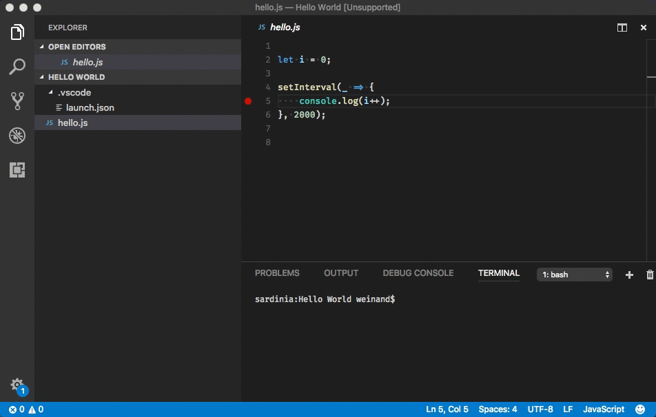

In addition, the extension tries to identify processes that can be debugged by VS Code itself and offers a debug action for those in the context menu. All processes can be terminated or killed from the menu as well.

This extension is still a prototype and so it is not yet available on the Marketplace but you can easily build the extension VSIX by running the following  commands:

```bash
  git clone https://github.com/weinand/vscode-processes
  cd vscode-processes
  npm install
  npm run package
```

Once the extension VSIX is created, use VS Code's **Install from VSIX...** command to install the extension.

### Running extensions

To make it easier for users to detect faulty or poorly performing extensions, we added a **Running Extensions** view. This view shows all the extensions which are currently running along with useful performance information. With this view, users can also profile VS Code in order to detect which extensions take the most time and are a likely cause of performance issues. Run the **Developers: Show Running Extensions** command from the **Command Palette** to see this view.

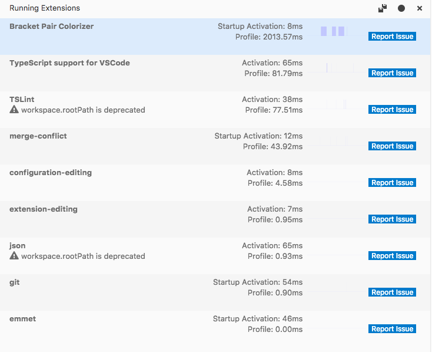

**Note**: The **Running Extensions** view is still under development so expect to see updates in future releases. We'd also appreciate your feedback.

### How to file performance and native crash issues

We have created guides for:

* [Performance Issues](https://github.com/Microsoft/vscode/wiki/Performance-Issues) - tracking down and filing performance issues

* [Native Crash Issues](https://github.com/Microsoft/vscode/wiki/Native-Crash-Issues) - data collection techniques for native crashes

## Workbench

### New editor tabs layout option

A new setting, `workbench.editor.tabSizing`, was added to control how tabs should size depending on the space available in the outer container. The default (`fit`) works as before and will always ensure that the tab shows the entire name of the file. If space gets too little, a scroll bar will appear.

You can change this behavior by setting this new option to `shrink`. When there is little space available, the tabbed headers will shrink up to a minimum and thus make it less likely that a scroll bar appears.

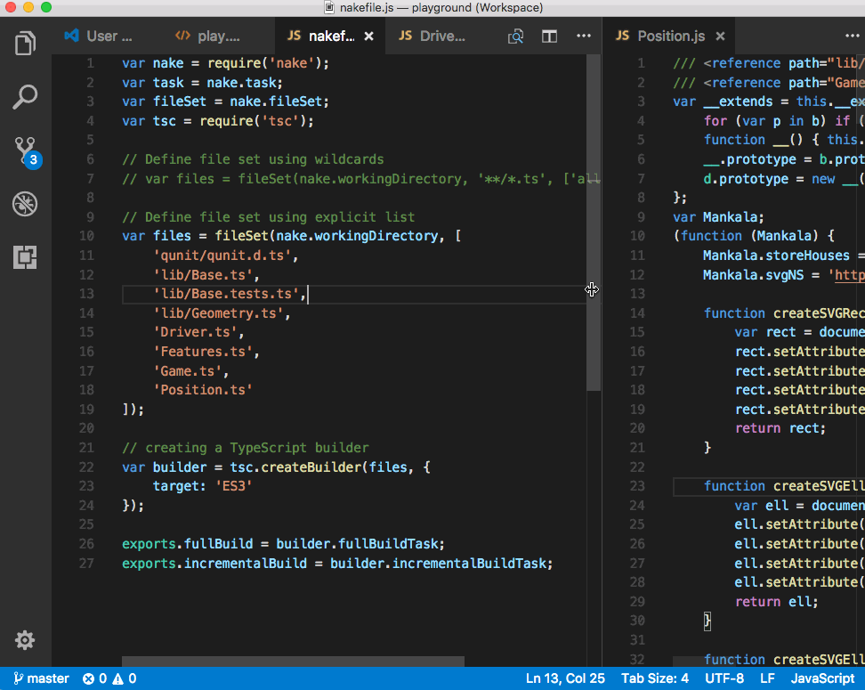

### Pipe output directly into VS Code

We added support to pipe the output of a terminal command directly into VS Code and have it open in an editor:

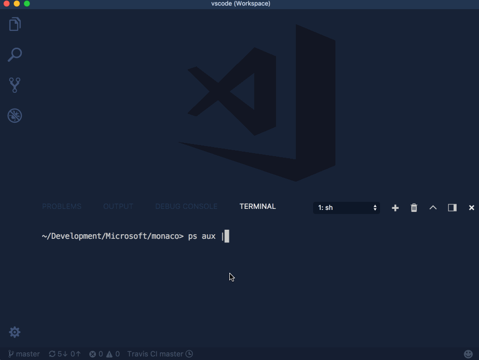

The encoding of the terminal will be determined by running the command `locale charmap` on Linux/macOS and `chcp` on Windows. You can also set a `VSCODE_CLI_ENCODING` environment variable to specify the encoding manually.

**Note:** We will now open a temporary file for reading from stdin as soon as we detect that stdin is not connected to a terminal. If you are in a setup where you start VS Code via the shell script (`code.sh` or `code.cmd`) from an application that is not a terminal, please change that to start our executable directly instead.

### Compare open file to Clipboard

Thanks to [PR #37841](https://github.com/Microsoft/vscode/pull/37841) from [Max Furman (@maxfurman)](https://github.com/maxfurman), you can now compare the contents of the currently opened file with the contents of the Clipboard. The command is **Compare Active File with Clipboard** (command id `workbench.files.action.compareWithClipboard`).

### workbench.panel.location is deprecated

We have removed the `workbench.panel.location` from settings and are now saving this in storage. All the previous functionality for moving the panel to the side is retained. More details about this change can be found [here](https://github.com/Microsoft/vscode/issues/37351).

## Editor

### Smarter IntelliSense

VS Code IntelliSense re-sorts suggestions as you type. This ensures that the most relevant suggestions are near the top. However, there are cases in which multiple suggestions match equally well, for example `con` matches on `confirm`, `console`, `const`, and `constructor` equally well and lexicographic sort decides which suggestion is pre-selected.

In this release, we've updated IntelliSense to remember what you have selected in such cases. Select `const` for the `con` prefix once and it will be the top match in the future.

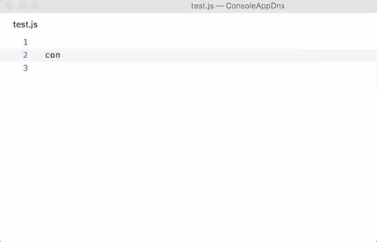

Sometimes when you are typing, you may accidentally mix up neighboring characters, for instance instead of `console`, you might type `cnosole`, or `resutl` instead of `result`. We have made IntelliSense more relaxed and it will now try a few permutation when scoring suggestions.

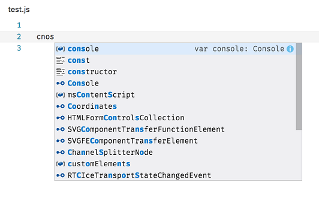

In the sample above, IntelliSense favors the `console` suggestion by changing `cnos` to `cons` as that match is stronger than the match of `cnos` on `RTCIceTransportStateChangedEvent`.

### Folding improvements

We have changed `Shift + Click` on the folding icons to not only fold/unfold the corresponding section but also all its children.

New folding regions have been added for the following languages:

* CSS/Less/SCSS: `/*#region*/` and `/*#endregion*/`
* Coffeescript: `#region` and `#endregion`
* PHP: `#region` and `#endregion`
* Bat: `::#region` and `::#endregion`

Note: If you don't remember a folding marker, type `#` at the beginning of a line and you will get IntelliSense suggestions. Each language proposes completion proposals or snippets.

New folding commands have been added:

* **Fold All Regions** (`kb(editor.foldAllMarkerRegions)`) folds all regions from markers (for example `#region`).
* **Unfold All Regions** (`kb(editor.unfoldAllMarkerRegions)`) unfolds all regions from markers.
* **Fold All Block Comments** (`kb(editor.foldAllBlockComments)`) folds all regions that start with a block comment token (for example `/*`).

### Interval line numbers

Thanks to [PR #37120](https://github.com/Microsoft/vscode/pull/37120) from [David Weber](https://github.com/DdWr), the setting `editor.lineNumbers` can now be configured with the value `interval`, which will cause VS Code to render the line numbers every 10th line.

### Global find Clipboard on macOS

Thanks to [PR #35956](https://github.com/Microsoft/vscode/pull/35956) from [Melvin](https://github.com/melvin0008), the editor now integrates with the macOS global find Clipboard. If you search for something in VS Code or another native macOS applications and then switch to another, the find widget will contain the same text. This feature is turned on by default on macOS and you can disable it by setting `editor.find.globalFindClipboard` to `false`.

## Languages

### HTML

HTML now offers code completion for character entities, such as `&gt;`, `&amp`. To see the proposals, type `&` in a element content or attribute value and invoke IntelliSense.

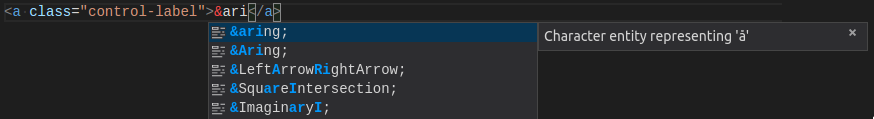

### JSON with comments

A new mode **JSON with Comments** (jsonc) has been added to distinguish between JSON-like files that allow comments and JSON files that follow the standard JSON specification. All VS Code configuration files use the new mode and allow comments, while `.json` files default to the standard JSON mode that will report comments as errors.

### TypeScript 2.6.2

VS Code now includes TypeScript 2.6.2. This minor update fixes a [few important bug fixes and tooling improvements](https://github.com/Microsoft/TypeScript/issues?q=is%3Aissue+milestone%3A%22TypeScript+2.6.2%22+is%3Aclosed).

### JSX fragment syntax

TypeScript 2.6.2 also brings support for React 16.2's [new JSX fragment syntax](https://reactjs.org/blog/2017/11/28/react-v16.2.0-fragment-support.html#jsx-fragment-syntax).


### Typescript reportStyleChecksAsWarnings

VS Code now displays TypeScript code style issues as warnings instead of errors. This applies to:

* Variable is declared but never used
* Property is declared but its value is never read
* Unreachable code detected
* Unused label
* Fall through case in switch
* Not all code paths return a value

Treating these as warnings is consistent with other tools, such as TSLint. These will still be displayed as errors when you run `tsc` from the command line.

You can disable this behavior by setting: `"typescript.reportStyleChecksAsWarnings": false`.

### Language Server Protocol

The language server protocol was extended with the following new feature: a completion context given access to the trigger character, more completion item and symbol kinds as well as markdown support for completion items and signature help. The protocol additions are available in the `4.0.0-next.x` version of the client and server npm modules.

## Git

### Image diffing

You can now view changes in your images, side by side, directly from your Git repository:

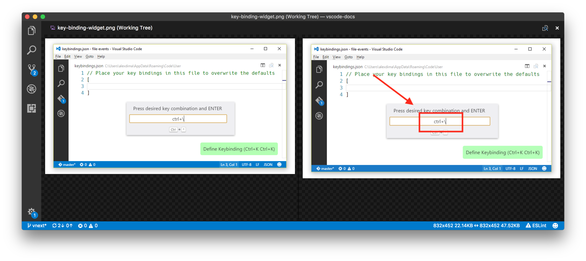

## Debugging

### Edit Breakpoint command

We have added a new **Edit Breakpoint...** command to the **BREAKPOINTS** context menu. This will make it easier for users to edit the condition or hit count of breakpoints.

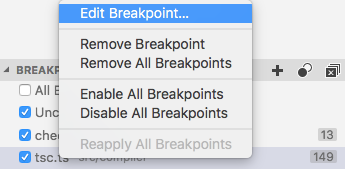

### Undefining environment variables

Many debug extensions provide support for adding (or overriding) environment variables that are passed to the debug target. With this release, it is now possible to un-define (remove) a variable from the environment as well.

If an environment variable is set to `null`, this variable will be removed from the environment before the debug target is launched. This makes it much easier to test and debug code that relies on a variable **not** being defined.

Please note that in this release, only the Node.js debugger supports this.

### New rendering style for synthetic elements in VARIABLES

In the debugger's **VARIABLES** view, we now show "synthetic" elements in a subdued style to distinguish them from the real "data" received from the debugger or runtime. In this release, only the "range" nodes of big arrays are considered "synthetic" and are rendered in the subdued style. We expect that more debug extensions will opt into this feature in the future.


### New debug settings

* A new setting `debug.showInStatusBar` controls the visibility of the debug Status Bar item. Possible values are: `never`, `always` and the default `onFirstSessionStart`.
* A new setting `debug.openDebug` controls the visibility of the Debug view. Possible values are: `neverOpen`, `openOnSessionStart` and the default `openOnFirstSessionStart`.

## Extensions

### Enable extensions per workspace

VS Code has had support for disabling extensions globally or per workspace. However, there was also demand for enabling extensions per workspace. With this release, you can configure extensions to run only for specific workspaces.

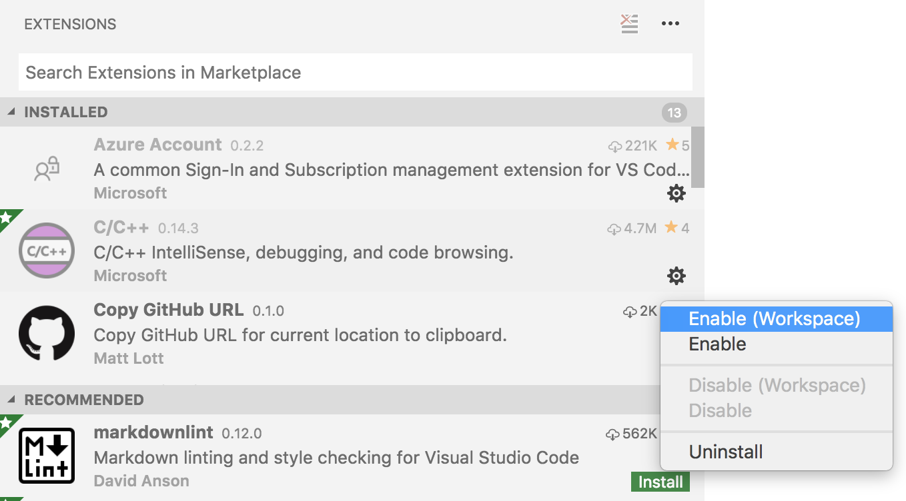

## New Documentation

### Java topics

There is new set of [Java](https://code.visualstudio.com/docs/java/java-tutorial) topics showing how to use the [Java Extension Pack](https://marketplace.visualstudio.com/items?itemName=vscjava.vscode-java-pack) for debugging, cloud deployment, and Azure Functions development.

### Python topics

[Python](https://code.visualstudio.com/docs/python/python-tutorial) also has its own section where you can find tutorials for the [Microsoft Python](https://marketplace.visualstudio.com/items?itemName=ms-python.python) extension. There are topics starting with 'Hello World', moving on to debugging, linting, and unit testing.

### Debugging Recipes

We've added several new debugging [recipes](https://github.com/Microsoft/vscode-recipes):

* [Next.js](https://github.com/Microsoft/vscode-recipes/tree/master/Next-js)
* [Meteor](https://github.com/Microsoft/vscode-recipes/tree/master/meteor)
* [AspNetCore.SpaTemplates](https://github.com/Microsoft/vscode-recipes/tree/master/Angular-SpaTemplates)
* [Node.js with nodemon](https://github.com/Microsoft/vscode-recipes/tree/master/nodemon)

See [Debugging Recipes](https://code.visualstudio.com/docs/nodejs/debugging-recipes) to learn more about these guides and find helpful blog posts.

## Extension Authoring

### Pre-release versions

You can now distribute extension VSIXs with [pre-release versions](https://semver.org/) like `x.y.z-alpha`, `x.y.z-beta` and VS Code will detect them and provide updates according to their version increments as defined [here](https://semver.org/). Refer to this [issue](https://github.com/Microsoft/vscode/issues/39024) to learn more.

### Extension generator - `yo code`

The yeoman generators for TypeScript and JavaScript extensions now provide additional options to enable more checking of your extensions. For TypeScript extensions the generator provides options to setup [TSLint](https://palantir.github.io/tslint/) and to enable the `strict` TypeScript [compiler options](https://www.typescriptlang.org/docs/handbook/compiler-options.html).

For JavaScript, there is a prompt to enable the [`checkJS`](https://github.com/Microsoft/TypeScript/wiki/Type-Checking-JavaScript-Files) option which enables type checking in JavaScript files.

### Debug API updates

**Preview: Breakpoints API**

In this milestone, we've continued work on the Debug API related to breakpoints. It is now possible to access the set of all breakpoints of a workspace (`vscode.debug.breakpoints`) and register for notification about added, removed, or changed breakpoints (`vscode.debug.onDidChangeBreakpoints`).

Please note that accessing breakpoints initially returns an empty array but triggers a subsequent `BreakpointsChangeEvent` event that updates `vscode.debug.breakpoints` to the correct set. So if your code relies on the correct set of breakpoints, don't forget to register for `BreakpointsChangeEvent`s.

The different types of breakpoints are represented as different subclasses of `Breakpoint`. Currently supported are `SourceBreakpoint` and `FunctionBreakpoint`. Use an `instanceof` check to determine the concrete type.

> **Note:** Currently this API is proposed, so in order to use it, you must opt into it by adding a `"enableProposedApi": true` to `package.json` and you'll have to copy the [`vscode.proposed.d.ts`](https://github.com/Microsoft/vscode/blob/master/src/vs/vscode.proposed.d.ts) into your extension project. Also be aware that you cannot publish an extension to the Marketplace that uses the `enableProposedApi` attribute.

**Output text on Debug Console**

The proposed Debug Console API from last month has been slightly modified and moved from "proposed" to "official". An extension can append text to the Debug Console with `vscode.debug.activeDebugConsole.append(text)` or `vscode.debug.activeDebugConsole.appendLine(text)`. The deprecated `debug.logToDebugConsole` will be dropped as soon as it is no longer used in any extension on the Marketplace.

### Debug contributions in package.json

**More fine-grained debugger activation events**

If a debug extension uses a `DebugConfigurationProvider`, it is important that the extension is activated early enough so that the `DebugConfigurationProvider` can be registered before first being used.

The foolproof way to achieve this is by adding the `onDebug` activation event to the `activationEvents` section of the extension's `package.json`. This works fine as long as the extension does not spend a lot of time in its startup sequence. If it does,for instance starting a language server, early activation must be avoided because it could negatively affect other debug extensions.

To simplify startup, we have introduced two more fine-grained activation events:

* `onDebugInitialConfigurations` is fired just before the `provideDebugConfigurations` method of the `DebugConfigurationProvider` is called.
* `onDebugResolve:type` is fired just before the `resolveDebugConfiguration` method of the `DebugConfigurationProvider` for the specified type is called.

**Rule of thumb:** If activation of a debug extensions is lightweight, use `onDebug`. If it is heavyweight, use `onDebugInitialConfigurations` and/or `onDebugResolve` depending on whether the `DebugConfigurationProvider` implements the corresponding methods `provideDebugConfigurations` and/or `resolveDebugConfiguration`.

### Debug Adapter Protocol

**New enum value `virtual` for the `presentationHint.kind` attribute of type `Variable`**

The new enum value `virtual` indicates that the variable is a synthetic object introduced by the debugger for rendering or user interaction purposes. The client is expected to render this element in a different way then regular variables.

**Support for removing variables from the environment**

The `runInTerminal` request is used by a debug adapter to launch a debug target in an integrated or external terminal. One parameter to the request is the set of environment variables to pass to the debug target. In this release, `null` has been added to the environment variable's value type with the semantics "remove the environment variable from the environment before launching the target".

## Engineering

### Yarn

We now use [Yarn](https://yarnpkg.com/en/) to manage our production and development dependencies. This has greatly reduced the setup time to prepare a VS Code repository, both for development and build. More details are in this [Pull Request](https://github.com/Microsoft/vscode/pull/38481).

## New commands

Key|Command|Command id
---|-------|----------
`kb(workbench.action.openRawDefaultSettings)`|Open Raw Default Settings|`workbench.action.openRawDefaultSettings`
`kb(workbench.action.toggleTabsVisibility)`|View: Toggle Tab Visibility|`workbench.action.toggleTabsVisibility`
`kb(workbench.action.lastEditorInGroup)`|View: Open Last Editor in Group|`workbench.action.lastEditorInGroup`
`kb(workbench.files.action.compareWithClipboard)`|Compare Active File with Clipboard|`workbench.files.action.compareWithClipboard`
`kb(search.action.refreshSearchResults)`|Refresh Search results|`search.action.refreshSearchResults`
`kb(search.action.collapseSearchResults)`|Collapse Search results|`search.action.collapseSearchResults`
`kb(search.action.clearSearchResults)`|Clear Search results|`search.action.clearSearchResults`

## Notable Changes

* [36491](https://github.com/Microsoft/vscode/issues/36491): Backspace should not always cancel code completion
* [39594](https://github.com/Microsoft/vscode/issues/39594): Problems with nested snippet insertion
* [11928](https://github.com/Microsoft/vscode/issues/11928): Possible to bring up multiple dialogs on same dirty file when closing
* [31667](https://github.com/Microsoft/vscode/issues/31667): Configuration values are missing from files on remote network drives
* [18733](https://github.com/Microsoft/vscode/issues/18733): Dragging a tab can show visual glitch when tab not fully visible
* [16690](https://github.com/Microsoft/vscode/issues/16690): Closing tabs using mouse wheel click turns cursor into auto scroll
* [30530](https://github.com/Microsoft/vscode/issues/30530): Keyboard Shortcut to Skip Preview Using Quick Open
* [17552](https://github.com/Microsoft/vscode/issues/17552): Switch to Unsaved Tab When Prompting to Save
* [15477](https://github.com/Microsoft/vscode/issues/15477): Support dependencies for VSIX extensions
* [26871](https://github.com/Microsoft/vscode/issues/26871): Show a count badge for Problems panel
* [35580](https://github.com/Microsoft/vscode/issues/35580): Make "Workspace" and "Folder" settings more discoverable
* [38609](https://github.com/Microsoft/vscode/issues/38609): Install older version of an extension using VSIX
* [28331](https://github.com/Microsoft/vscode/issues/28331): Cache extension manifest files
* [38481](https://github.com/Microsoft/vscode/pull/38481): Use Yarn to manage dependencies
* [35749](https://github.com/Microsoft/vscode/issues/35749): Improve image view in working tree

## Thank You

Last but certainly not least, a big *__Thank You!__* to the following folks that helped to make VS Code even better:

* [Abinav Seelan (@abinavseelan)](https://github.com/abinavseelan):  Add logging snippets for Javascript & typescript [PR #37889](https://github.com/Microsoft/vscode/pull/37889)
* [David Valachovic (@AdenFlorian)](https://github.com/AdenFlorian):  Support middle mouse click on folding decorator to recursively toggle folding [PR #38727](https://github.com/Microsoft/vscode/pull/38727)
* [Ajit Singh (@ajitid)](https://github.com/ajitid):  Update Quiet Light theme's JSX [PR #39451](https://github.com/Microsoft/vscode/pull/39451)
* [Alberto Cortés (@alcortesm)](https://github.com/alcortesm):  fix Keyboard dispatch help message typos [PR #36866](https://github.com/Microsoft/vscode/pull/36866)
* [Brook Riggio           (@brookr)](https://github.com/brookr):  Update CONTRIBUTING.md [PR #36673](https://github.com/Microsoft/vscode/pull/36673)
* [Dan Bovey (@danbovey)](https://github.com/danbovey):  Update NumberBadge to show hundreds in full, thousands with k [PR #38605](https://github.com/Microsoft/vscode/pull/38605)
* [Hannu Hartikainen (@dancek)](https://github.com/dancek):  Call shellscript files just "Shell Script" [PR #36889](https://github.com/Microsoft/vscode/pull/36889)
* [David Weber (@DdWr)](https://github.com/DdWr):  Add line number interval setting [PR #37120](https://github.com/Microsoft/vscode/pull/37120)
* [Deric Cain (@dericcain)](https://github.com/dericcain):  Added ability to use tilde as home dir in config for cloning repos [PR #32222](https://github.com/Microsoft/vscode/pull/32222)
* [David Lechner (@dlech)](https://github.com/dlech):  Add firstline match for Makefile [PR #38126](https://github.com/Microsoft/vscode/pull/38126)
* [Francisco Moreira (@Dozed12)](https://github.com/Dozed12):  Size down SCM discard icon [PR #39135](https://github.com/Microsoft/vscode/pull/39135)
* [Ryan Lee (@drdgvhbh)](https://github.com/drdgvhbh):  add split pane to preferences editor [PR #38000](https://github.com/Microsoft/vscode/pull/38000)
* [Carson McManus (@dyc3)](https://github.com/dyc3):  fix debug console to handle more than one graphics mode in a single escape sequence [PR #38981](https://github.com/Microsoft/vscode/pull/38981)
* [Louis MacFhionnlaigh (@ethernetcable)](https://github.com/ethernetcable):  Change Twitter character limit [PR #39109](https://github.com/Microsoft/vscode/pull/39109)
* [Harjyot Singh (@excerebrose)](https://github.com/excerebrose)
  * Sync (Rebase) Command added [PR #31416](https://github.com/Microsoft/vscode/pull/31416)
  * Displaying Repository URL (Git Link) on Extensions Page. [PR #31487](https://github.com/Microsoft/vscode/pull/31487)
* [Fabio Spampinato (@fabiospampinato)](https://github.com/fabiospampinato): Uninstall extensions given paths to their .vsix files [PR #34042](https://github.com/Microsoft/vscode/pull/34042)
* [Felix Becker (@felixfbecker)](https://github.com/felixfbecker)
  * Fix OSX builds [PR #37564](https://github.com/Microsoft/vscode/pull/37564)
  * Make npm logs less verbose in CI [PR #37566](https://github.com/Microsoft/vscode/pull/37566)
* [Joel Kuntz (@Frozenfire92)](https://github.com/Frozenfire92):  Fix #39867 fix git popStash type check [PR #39868](https://github.com/Microsoft/vscode/pull/39868)
* [Sanders Lauture (@golf1052)](https://github.com/golf1052):  Show preview tag on extension page if extension is in preview [PR #36261](https://github.com/Microsoft/vscode/pull/36261)
* [HUI ZHOU (@huizhougit)](https://github.com/huizhougit):  Set placeholder text in SourceControlInputBox [PR #29822](https://github.com/Microsoft/vscode/pull/29822)
* [Anton Vildyaev (@hun1ahpu)](https://github.com/hun1ahpu):  Fix 37385 by introducing addition configuration setting [PR #37704](https://github.com/Microsoft/vscode/pull/37704)
* [Ignacio Nicolás Rodríguez (@ignacionr)](https://github.com/ignacionr):  Update taskTemplates.ts [PR #37905](https://github.com/Microsoft/vscode/pull/37905)
* [Yuki Ueda (@Ikuyadeu)](https://github.com/Ikuyadeu):  Fix Markdown quote syntax highlight(fix #38523) [PR #39487](https://github.com/Microsoft/vscode/pull/39487)
* [Itamar (@itamark)](https://github.com/itamark):  Capitalizing Contains in Contains changes [PR #37980](https://github.com/Microsoft/vscode/pull/37980)
* [Justin Horner (@justinhhorner)](https://github.com/justinhhorner):  Add Rename Branch to Git Extension [PR #32244](https://github.com/Microsoft/vscode/pull/32244)
* [Karthik Iyengar (@karthikiyengar)](https://github.com/karthikiyengar):  Allow user to cancel cloning a git repo #30057 - WIP [PR #32119](https://github.com/Microsoft/vscode/pull/32119)
* [MXI (@KillyMXI)](https://github.com/KillyMXI):  Add Region folding for CSS (#3422) [PR #37789](https://github.com/Microsoft/vscode/pull/37789)
* [Markus Igeland (@Markussss)](https://github.com/Markussss):  Added support for sorting multiple selections [PR #36652](https://github.com/Microsoft/vscode/pull/36652)
* [Joe Martella (@martellaj)](https://github.com/martellaj):  Adds "Accept All Current" to command palette [PR #38582](https://github.com/Microsoft/vscode/pull/38582)
* [Max Furman (@maxfurman)](https://github.com/maxfurman)
  * Compare with Clipboard [PR #37841](https://github.com/Microsoft/vscode/pull/37841)
  * Toggle Tab Visibility [PR #37735](https://github.com/Microsoft/vscode/pull/37735)
* [Max Schmitt (@maxibanki)](https://github.com/maxibanki):  "Cannot read property 'filter' of undefined" in extensionGalleryService [PR #38642](https://github.com/Microsoft/vscode/pull/38642)
* [Melvin (@melvin0008)](https://github.com/melvin0008):  Add support for macOS globalFindClipboard #11233 #28896 [PR #35956](https://github.com/Microsoft/vscode/pull/35956)
* [Jared Moore (@moorejs)](https://github.com/moorejs):  Open File Handler now untildifies. Fixes #32736 [PR #39122](https://github.com/Microsoft/vscode/pull/39122)
* [Nehal J Wani (@nehaljwani)](https://github.com/nehaljwani):  Make v8-profiler, css-parser URI http-proxy friendly [PR #38181](https://github.com/Microsoft/vscode/pull/38181)
* [Zanidd (@ninijay)](https://github.com/ninijay):  Add platform info in code --version #37793 Done [PR #37824](https://github.com/Microsoft/vscode/pull/37824)
* [@nkofl](https://github.com/nkofl):  Add code folding #region support in coffeescript [PR #39334](https://github.com/Microsoft/vscode/pull/39334)
* [Tomer Ohana (@ohana54)](https://github.com/ohana54):  Add .nvmrc file [PR #39814](https://github.com/Microsoft/vscode/pull/39814)
* [Manuel Sommerhalder (@oncode)](https://github.com/oncode):  Trim whitespace from command.stash [PR #39264](https://github.com/Microsoft/vscode/pull/39264)
* [Nathan Shively-Sanders (@sandersn)](https://github.com/sandersn):  Fix array syntax in debugViewer.ts [PR #37542](https://github.com/Microsoft/vscode/pull/37542)
* [Shivam Mittal (@shivammittal99)](https://github.com/shivammittal99)
  * Fixes markdown link syntax highlighting bug [PR #38328](https://github.com/Microsoft/vscode/pull/38328)
  * Correct spelling of Message in reloadMessaage in extensionsActions.ts and extensionsActions.test.ts [PR #38698](https://github.com/Microsoft/vscode/pull/38698)
* [Shobhit Chittora (@shobhitchittora)](https://github.com/shobhitchittora)
  * Removing Disabled Extensions while Issue Reporting [PR #37705](https://github.com/Microsoft/vscode/pull/37705)
  * Fixing integrated terminal font-size overflow [PR #37636](https://github.com/Microsoft/vscode/pull/37636)
* [Suhas (@suhasdeshpande)](https://github.com/suhasdeshpande):  Update monaco-editor-setup.js [PR #38130](https://github.com/Microsoft/vscode/pull/38130)
* [Sye van der Veen (@Syeberman)](https://github.com/Syeberman):  Auto-closing quotes in Python raw string literals [PR #35636](https://github.com/Microsoft/vscode/pull/35636)
* [Ethan Woodward (@Takadimi)](https://github.com/Takadimi):  #36562 Sort multiple selections [PR #37196](https://github.com/Microsoft/vscode/pull/37196)
* [Martin Thierer (@thierer)](https://github.com/thierer):  Compare to correct Ressource-URI when fetching content [PR #34690](https://github.com/Microsoft/vscode/pull/34690)
* [Thomas Struller-Baumann (@Thomas-S-B)](https://github.com/Thomas-S-B):  Removed unnecessary comma. [PR #38104](https://github.com/Microsoft/vscode/pull/38104)
* [@tsalinger](https://github.com/tsalinger):  Reuse last commit message for amend [PR #38865](https://github.com/Microsoft/vscode/pull/38865)
* [Alexander (@usernamehw)](https://github.com/usernamehw):  Fixes #38691 [PR #38692](https://github.com/Microsoft/vscode/pull/38692)
* [Yang Liu (@zesik)](https://github.com/zesik):  Ensure Replace box's width when showing [PR #36902](https://github.com/Microsoft/vscode/pull/36902)

Contributions to `language-server-protocol`:

* [Remy Suen (@rcjsuen)](https://github.com/rcjsuen):
  * Fix a small typo in protocol.md [PR #263](https://github.com/Microsoft/language-server-protocol/pull/263)
  * Fix the grammar [PR #322](https://github.com/Microsoft/language-server-protocol/pull/322)
  * Fix a small typo [PR #332](https://github.com/Microsoft/language-server-protocol/pull/332)
* [Brett Cannon (@brettcannon)](https://github.com/brettcannon):
  * Grammar tweaks for initialize request [PR #269](https://github.com/Microsoft/language-server-protocol/pull/269)
  * Fix a spelling mistake [PR #270](https://github.com/Microsoft/language-server-protocol/pull/270)
* [Maxim Reznik (@reznikmm)](https://github.com/reznikmm): Formating is done by server, not by client [PR #316](https://github.com/Microsoft/language-server-protocol/pull/316)
* [Sven-Hendrik Haase (@svenstaro)](https://github.com/svenstaro): Some grammar and consistency fixes [PR #311](https://github.com/Microsoft/language-server-protocol/pull/311)
* [Vlad Dumitrescu (@vladdu)](https://github.com/vladdu): Specify response from client/unregisterCapability [PR #331](https://github.com/Microsoft/language-server-protocol/pull/331)
* [Waleed Khan (@arxanas)](https://github.com/arxanas): Clarify response ordering (#306) [PR #333](https://github.com/Microsoft/language-server-protocol/pull/333)

Contributions to `vscode-languageserver-node`:

* [Darin Morrison (@freebroccolo)](https://github.com/freebroccolo) Fix docs for TextDocumentItem.create [PR #269](https://github.com/Microsoft/vscode-languageserver-node/pull/269)
* [Mickael Istria @(mickaelistria)](https://github.com/mickaelistria):
  * Multi-root declared as ServerCapability (#298) [PR #272](https://github.com/Microsoft/vscode-languageserver-node/pull/272)
  * workspaceFolders isn't a model element [PR #273](https://github.com/Microsoft/vscode-languageserver-node/pull/273)
* [@amiramw](https://github.com/amiramw) typo fix [PR #339](https://github.com/Microsoft/language-server-protocol/pull/339)
* [Peter Burns (@rictic)](https://github.com/rictic): Document that onWillSave handler capabilities reqs [PR #275](https://github.com/Microsoft/vscode-languageserver-node/pull/275)
* [@danixeee](https://github.com/danixeee): Return value after executing command request [PR #284](https://github.com/Microsoft/vscode-languageserver-node/pull/284)

Contributions to `vscode-extension-vscode`:

* [Gunnar Wagenknecht (@guw)](https://github.com/guw): Allow testing against latest Insiders app (#89) [PR #89](https://github.com/Microsoft/vscode-extension-vscode/pull/89)
* [kimushu (@kimushu)](https://github.com/kimushu): Fix invalid permission on Linux (#84) [PR #84](https://github.com/Microsoft/vscode-extension-vscode/pull/84)

Contributions to `vscode-css-languageservice`:

* [Adam Miller (@amiller-gh)](https://github.com/amiller-gh):  Add attrib namespace to parser [PR #50](https://github.com/Microsoft/vscode-css-languageservice/pull/50)

Contributions to `vscode-html-languageservice`:

* [Ludovic Oger (@garconvacher)](https://github.com/garconvacher):  Add DPub-ARIA roles (Digital Publishing WAI-ARIA Module 1.0) [PR #14](https://github.com/Microsoft/vscode-html-languageservice/pull/14)

Contributions to `vscode-node-debug`:

* [Sindre Svendby (@SindreSvendby)](https://github.com/SindreSvendby): Accept .mjs as a valid fileending [PR #161](https://github.com/Microsoft/vscode-node-debug/pull/161)

Contributions to `vsce`:

* [Morten N.O. Nørgaard Henriksen (@raix)](https://github.com/raix)
  * fix show: add icon fallback on win32 [PR #226](https://github.com/Microsoft/vscode-vsce/pull/226)
  * fix "show" to be case insensitive [PR #225](https://github.com/Microsoft/vscode-vsce/pull/225)
  * feature/issue-216-add-search-command [PR #218](https://github.com/Microsoft/vscode-vsce/pull/218)
  * Feature/issue 214 add show command [PR #215](https://github.com/Microsoft/vscode-vsce/pull/215)

Contributions to `vscode-tslint`:

* [Sebastian Silbermann (@eps1lon)](https://github.com/eps1lon):  Fixed link anchor [PR #301](https://github.com/Microsoft/vscode-tslint/pull/301)
* [Joachim Seminck (@jseminck)](https://github.com/jseminck):  Fix typo: Rename udpate* to update* [PR #293](https://github.com/Microsoft/vscode-tslint/pull/293)
* [Seth (@osdavison)](https://github.com/osdavison):  Fix incorrect link [PR #291](https://github.com/Microsoft/vscode-tslint/pull/291)

Contributions to `vscode-recipes`:

* [Maximiliano Céspedes (@neomaxzero)](https://github.com/neomaxzero): update Next-Js link [PR #42](https://github.com/Microsoft/vscode-recipes/pull/42)
* [John Pankowicz (@johnpankowicz)](https://github.com/johnpankowicz): Added recipe for AspNetCore.SpaTemplates [PR #41](https://github.com/Microsoft/vscode-recipes/pull/41)
* [Cengiz Ilerler (@cilerler)](https://github.com/cilerler): updated deprecated command [PR #32](https://github.com/Microsoft/vscode-recipes/pull/32)

Contributions to `localization`:

This is the eighth month since we opened community localization in Transifex. We now have nearly 600 members in the Transifex [VS Code project](https://aka.ms/vscodeloc) team. We appreciate your contributions, either by providing new translations, voting on translations, or suggesting process improvements.

Here is a snapshot of top contributors for this release. For details about the project including the contributor name list, visit the project site at [https://aka.ms/vscodeloc.](https://aka.ms/vscodeloc)

* **French:** Antoine Griffard, Bruno Lewin, Maxime COQUEREL.
* **Italian:** Alessandro Alpi, Piero Azi, Aldo Donetti.
* **German:** thefreshman89, Carsten Kneip, Dejan Dinic, Volkmar Rigo, Max Schmitt.
* **Spanish:** Roberto Fonseca, Raul Rama, Alberto Poblacion, Carlos Mendible, Thierry DEMAN-BARCELO, Andy Gonzalez, Juan Ramón Rodríguez, David Triana, Pedro Sánchez, Jorge Serrano Pérez.
* **Japanese:** EbXpJ6bp, Tomoaki Yoshizawa, Yuichi Nukiyama, tanaka_733, 杉田 寿憲, Yoshihisa Ozaki, Hiroyuki Mori, Miho Yamamoto, Yuki Ueda.
* **Chinese (Simplified):** Joel Yang, 王东程, Wang Weixuan, 陈嘉恺, bingzheyuan, YF.
* **Chinese (Traditional):** Duran Hsieh, Winnie Lin, Kirk Chen, Ke-Hsu Chen.
* **Korean:** Ian Y. Choi.
* **Hungarian:** Tar Dániel.
* **Portuguese (Brazil):** Roberto Fonseca, Bruno Sonnino, Lucas Miranda, SQLCrespi, Alefe Souza, Felipe Caputo, Danilo Dantas, João Holanda, .
* **Portuguese (Portugal):** BlueKore, António Campos, Ruben Mateus.
* **Turkish:** Adem Coşkuner.
* **Bulgarian:** Любомир Василев, Didi Milikina, Bozhidar Gevechanov, Ilia Iliev.
* **Dutch:** Maarten van Stam, Armand Duijn, Senno Kaasjager, Elmar Jansen, Gerjan, Gerald Versluis, Peter Hut.
* **Indonesian:** Joseph Aditya P G, Hendra Setiawan, Febrian Setianto (Feber), simplyeazy, Septian Primadewa, Riwut Libinuko, Alfa Phi.
* **Polish:** Wojciech Maj, Patryk Adamczyk, Patryk Zawadzki, Sölve Svartskogen, Mateusz Wyczawski, KarbonKitty, Marek Kurdej, Adam Borowski, Paweł Sołtysiak, Jakub Drozdek.
* **Serbian:** Darko Puflović, Марко М. Костић, Nikola Radovanović.
* **Swedish:** Joakim Olsson.
* **Tamil:** rajakvk, Praveen, Karunakaran Samayan, Nadar Solomon Sunder.
* **Thai:** Sirisak Lueangsaksri, Yuttana Buasen.
* **Ukrainian:** R.M., Oleksandr, Bogdan Surai, Borys Lebeda, Yevhen Kuzminov.
* **Vietnamese:** Thanh Phu, Khoi Pham, Hung Nguyen, Vuong, Trung Đào.

<!-- In-product release notes styles.  Do not modify without also modifying regex in gulpfile.common.js -->
<a id="scroll-to-top" role="button" aria-label="scroll to top" href="#"><span class="icon"></span></a>
<link rel="stylesheet" type="text/css" href="css/inproduct_releasenotes.css"/>
