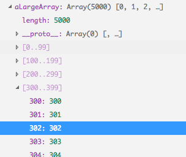

# November 2017 (version 1.19)

## Insiders Release

Welcome to the Insiders build. These are the preliminary notes for the November 1.19 release of Visual Studio Code. As we get closer to the release date, you'll see details below about new features and important fixes.

Until the November release notes are available, you can still track our progress:

* **[Commit Log](https://github.com/Microsoft/vscode/commits/master)** - GitHub commits to the vscode open source repository.
* **[Closed issues](https://github.com/Microsoft/vscode/milestone/54?closed=1)** - Resolved bugs and implemented feature requests in the November milestone.

We really appreciate people taking a look at our new features as soon as they are ready so check back here often and learn what's new to try out.

If you find issues or have suggestions, you can enter them in the VS Code repository on [GitHub](https://github.com/Microsoft/vscode/issues).

## Workbench

### Pipe output directly into VS Code

We added support to pipe the output of a command directly into VS Code and have it open in an editor:

**Note:** The terminal command will wait until the editor is closed to make sure that all output is piped into the editor, even if it is received after the editor was already opened. This is the equivalent of running with `--wait`.

### New editor tabs layout option

A new setting, `workbench.editor.tabSizing`, was added to control how tabs should size depending on the space available in the outer container. The default (`fit`) works as before and will always ensure that the tab shows the entire name of the file. If space gets too little, a scroll bar will appear.

You can change this behavior by setting this new option to `shrink`. When space is little, tabs will shrink up to a minimum and thus make it less likely that a scroll bar appears.

### `workbench.panel.location` is deprecated
We have removed the `workbench.panel.location` from settings and are now saving this in storage. All the previous functionality about moving the panel to the side is retained, however we have just decided for this to no longer be stored in settings. More details around this can be found [here](https://github.com/Microsoft/vscode/issues/37351)

### Open Editors View Improved Performance

Open editors view has been reimplemented to use the list widget instead of the tree for improved performance.

### Touch Events

We have refactored our handling of touch events for improved performance. More details can be found [here](https://github.com/Microsoft/vscode/issues/37917).

### Layout Improved Performance

We have improved our workbench layouting in general for better performance. Improvements are mostly around skipping layouts for hidden views and doing better caching of expensive computations.

### Compare file to Clipboard

You can now compare the contents of the currently opened file with the contents of the Clipboard. The command is **Compare Active File with Clipboard** (command id `workbench.files.action.compareWithClipboard`).

### --status command line option

A new command line argument was added which prints some useful VS Code diagnostics information to the terminal. You can share this information with us in GitHub issues and we will have a better understanding of the state of VS Code at the time of the issue.

Run `code --status` from the command line while another instance of VS Code is running and, after collecting status, you will see a display like this:

The output includes information about the environment, all running processes, and the counts of some typical files in the workspace.

## Extensions

### Enable extensions per workspace

Even though there was a support to disable extensions globally or per workspace, there is a big demand to enable extensions per workspace. With this release, you can configure extensions to run only for those workspaces for which you want them to.

### Running extensions

In order to make it easier for users to detect erronious and bad performing extensions we have added a running extensions view. This view shows all the extensions which are currently running with useful extension performance information. Using this view users can also profile VSCode in order to detect which extension performs slowly. Use `Developers: Show Running Extensions` action from the command palette to see this view.

TODO add image

## Editor

### Smarter IntelliSense

VS Code IntelliSense re-sorts suggestions as you type. This ensures that the most relevant suggestions are near the top. However, there are cases in which multiple suggestions match equally well, for example `con` matches on `confirm`, `console`, `const`, and `constructor` equally well and lexicographic sort decides which suggestion is pre-selected.

In this release, we've updated IntelliSense to remember what you have selected in such cases. Select `const` for the `con` prefix once and it will be the top match in the future.

Sometimes when you are typing, you may accidentally mix up neighboring characters, for instance instead of `console`, you might type `cnosole`, or `resutl` instead of `result`. We have made IntelliSense more relaxed and it will now try a few permutation when scoring suggestions.

In the sample above, IntelliSense favors the `console` suggestion by changing `cnos` to `cons` as that match is stronger than the match of `cnos` on `RTCIceTransportStateChangedEvent`.

### Folding improvements

`Shift + Click` on the folding icons not only folds/unfolds the corresponding section but also all its children.

New folding regions have been added for the following languages:

* CSS/Less/SCSS: `/*#region*/` and `/*#endregion*/`
* Coffeescript: `#region` and `#endregion`
* PHP: `#region` and `#endregion`
* Bat: `::#region` and `::#endregion`

Note: If you don't remember a folding marker, type `#` at the beginning of a line and do code completion. Each language proposes completion proposals or snippets.

New folding commands have been added:

* Fold Regions (`kb(editor.foldAllMarkerRegions)`) folds all regions from markers (for example `#region`).
* Unfold Regions (`kb(editor.unfoldAllMarkerRegions)`) unfolds all regions from markers.
* Fold All Block Comments (`kb(editor.foldAllBlockComments)`) folds all regions that start with a block comment token (for example `/*`).

### Interval line numbes

Thanks to [PR #37120](https://github.com/DdWr) from [David Weber](https://github.com/DdWr), the setting `editor.lineNumbers` can now be configured with the value `interval`, which will cause VS Code to render the line numbers every 10th line.

## Languages

### HTML

HTML now offers code completion for character entities, such as `&gt;`, `&amp`. To see the proposals, type `&` in a element content or attribute value and invoke IntelliSense.

### JSON

A new mode *JSON with Comments* has been added to distinguish between JSON-like files that allow comments and JSON files that follow the standard JSON specification. All VS Code configuration files use the new mode and allow comments, while `.json` files default to the standard JSON mode that will report comments as errors.

### TypeScript 2.6.2

VS Code now includes TypeScript 2.6.2. This minor update fixes a [few important bug fixes and tooling improvements](https://github.com/Microsoft/TypeScript/issues?q=is%3Aissue+milestone%3A%22TypeScript+2.6.2%22+is%3Aclosed).

### JSX fragment syntax

TypeScript 2.6.2 also brings support for React 16.2's [new JSX fragment syntax](https://reactjs.org/blog/2017/11/28/react-v16.2.0-fragment-support.html#jsx-fragment-syntax).

## Debugging

**New "Edit Breakpoint "action**

We have added a new "Edit Breakpoint "action to the breakpoints context menu. This will make it easier for users to edit the condition or hit count of breakpoints.

**New rendering style for synthetic elements in VARIABLES**

In the debugger's VARIABLES view we now show "synthetic" elements in a subdued style to distinguish them from the real "data" received from the debugger or runtime. In this release only the "range" nodes of big arrays are considered "synthetic" and are rendered in the subdued style. We expect that more debug extension will opt into this feature in the future.

**Undefining environment variables**

Many debug extensions provide support for adding (or overriding) environment variables that are passed to the debug target. With this release it is now possible to un-define (remove) a variable from the environment as well.

If an environment variable is set to `null`, this variable will be removed from the environment before the debug target is launched. This makes it much easier to test and debug code that relies on a variable **not** being defined.

Please note that in this release only the Node.js debugger supports this.

**Rewritten BREAKPOINTS view**

The BREAKPOINTS view has been rewritten to use the VS Code list widget instead of the tree for better performance.

### New Debug Settings

* A new setting `debug.showInStatusBar` controls the visibility of the debug status bar item. Possible values are: `never`, `always` and the default `onFirstSessionStart`.
* A new setting `debug.openDebug` controls the visibility of the debug view. Possible values are: `neverOpen`, `openOnSessionStart` and the default `openOnFirstSessionStart`.

## Extension Authoring

### Pre-release versions

You can now distribute VSIXs with [pre-release versions](https://semver.org/) like `x.y.z-alpha`, `x.y.z-beta` and VS Code will detect them and provide updates according to their version increments as defined [here](https://semver.org/). Refer to this [issue](https://github.com/Microsoft/vscode/issues/39024) to know more.

### Debug API updates

**Preview: Breakpoints API**

In this milestone we've continued work on the Debug API in the area of breakpoints. It is now possible to access the set of all breakpoints of a workspace (`vscode.debug.breakpoints`) and register for notification about added, removed, or changed breakpoints (`vscode.debug.onDidChangeBreakpoints`).

Please note that accessing breakpoints initially returns an empty array but triggers a subsequent `BreakpointsChangeEvent` event that has the full set of breakpoints in its `added` property.

The different types of breakpoints are represented as different subclasses of `Breakpoint`. Currently supported are `SourceBreakpoint` and `FunctionBreakpoint`. Use an `instanceof`-check to determine the concrete type.

> **Note:** Currently this API is proposed, so in order to use it you must opt into it by adding a `"enableProposedApi": true` to `package.json` and you'll have to copy the [`vscode.proposed.d.ts`](https://github.com/Microsoft/vscode/blob/master/src/vs/vscode.proposed.d.ts) into your extension project. Also be aware that you cannot publish an extension to the Marketplace that uses the `enableProposedApi` attribute.

**Output text on Debug Console**

The proposed Debug Console API from last month has been slightly modified and moved from "proposed" to "official". An extension can append text to the Debug Console with `vscode.debug.activeDebugConsole.append(text)` or `vscode.debug.activeDebugConsole.appendLine(text)`. The deprecated `debug.logToDebugConsole` will be dropped as soon as it is no longer used in any extension on the marketplace.

### Debug contributions in package.json

**More finegrained debugger activation events**

If a debug extension uses a `DebugConfigurationProvider` it is important that the extension is activated early enough so that the `DebugConfigurationProvider` can be registered before being used.

The foolproof way to achieve this is by adding the `onDebug` activation event to the `activationEvents` section of the package.json. This works fine as long as the extension does not spend a lot of time in its startup code. If it does - for instance starting a language server - early activation must be avoided at all costs because it could negatively affect other debug extensions.

For simplify this we have introduced two more fine-grained activation events:
- `onDebugInitialConfigurations` is fired just before the `provideDebugConfigurations` method of the `DebugConfigurationProvider` is called.
- `onDebugResolve:type` is fired just before the `resolveDebugConfiguration` method of the `DebugConfigurationProvider` for the specified type is called.

Rule of thumb: If activation of a debug extensions is lightweight use `onDebug`. If it is heavyweight use `onDebugInitialConfigurations` and/or `onDebugResolve` dependent on whether the  `DebugConfigurationProvider` implements the corresponding methods `provideDebugConfigurations` and/or `resolveDebugConfiguration`.

### Debug Adapter Protocol

**New enum value `virtual` for the `presentationHint.kind` attribute of type `Variable`**

The new enum value `virtual` indicates that the variable is a synthetic object introduced by the debugger for rendering or user interaction purposes. The client is expected to render this element in a different way then regular variables.

**Support for removing variables from the environment**

The `runInTerminal` request is used by a debug adapter to launch a debug target in an integrated or external terminal. One parameter to the request is the set of environment variables to pass to the debug target.
In this release `null` has been added to the environment variable value type with the semantics "remove the environment variable from the environment before launching the target".

## Serviceability

### Logs

VS Code now logs its activity into log files which will help to diagnose any unexpected issues like crash, slowness etc., VS Code runs four processes primarily `main`, `shared`, `renderer` and `extension-host`. Each process logs into its own log file. You can open and see each log file using the command `Developer: Show Logs...` which will open a process picker to select the process for which the log file has to be shown.

VS Code supports following log levels:

* `critical`
* `error`
* `warn`
* `info`
* `debug`
* `trace`
* `off`

By default, VS Code is configured with `info` level and logs `info` and above levels (`warn`, `error`, `critical`). You can change it using the command line argument `--log`.

`--log <level> Log level to use. Default is 'info'. Allowed values are 'critical', 'error', 'warn', 'info', 'debug', 'trace', 'off'.`

You can also turn off logging using the option `-log off`.

### VS Code Process View

TODO@Andre TBD

## New commands

Key|Command|Command id
---|-------|----------
`kb(workbench.action.openRawDefaultSettings)`|Open Raw Default Settings|`workbench.action.openRawDefaultSettings`
`kb(workbench.action.toggleTabsVisibility)`|View: Toggle Tab Visibility|`workbench.action.toggleTabsVisibility`
`kb(workbench.action.lastEditorInGroup)`|View: Open Last Editor in Group|`workbench.action.lastEditorInGroup`
`kb(workbench.files.action.compareWithClipboard)`|Compare Active File with Clipboard|`workbench.files.action.compareWithClipboard`
`kb(search.action.refreshSearchResults)`|Refresh Search results|`search.action.refreshSearchResults`
`kb(search.action.collapseSearchResults)`|Collapse Search results|`search.action.collapseSearchResults`
`kb(search.action.clearSearchResults)`|Clear Search results|`search.action.clearSearchResults`

## Notable Changes

* [36491](https://github.com/Microsoft/vscode/issues/36491): Backspace should not always cancel code completion
* [37541](https://github.com/Microsoft/vscode/issues/37541): Editor model is set very late
* [37539](https://github.com/Microsoft/vscode/issues/37539): ConfigAwareContext is slow
* [37426](https://github.com/Microsoft/vscode/issues/37426): ConfigurationModel is slow
* [39594](https://github.com/Microsoft/vscode/issues/39594): Problems with nested snippet insertion
* [11928](https://github.com/Microsoft/vscode/issues/11928): Possible to bring up multiple dialogs on same dirty file when closing
* [31667](https://github.com/Microsoft/vscode/issues/31667): Configuration values are missing from files on remote network drives
* [18733](https://github.com/Microsoft/vscode/issues/18733): Dragging a tab can show visual glitch when tab not fully visible
* [16690](https://github.com/Microsoft/vscode/issues/16690): Closing tabs using mouse wheel click turns cursor into auto scroll
* [30530](https://github.com/Microsoft/vscode/issues/30530): Keyboard Shortcut to Skip Preview Using Quick Open
* [11233](https://github.com/Microsoft/vscode/issues/11233): Add support for macOS NSFindPboard as an action
* [17552](https://github.com/Microsoft/vscode/issues/17552): Switch to Unsaved Tab When Prompting to Save
* [15477](https://github.com/Microsoft/vscode/issues/15477): Support dependencies for VSIX extensions
* [26871](https://github.com/Microsoft/vscode/issues/26871): Show a count badge for Problems panel
* [35580](https://github.com/Microsoft/vscode/issues/35580): Make "Workspace" and "Folder" settings more discoverable
* [38609](https://github.com/Microsoft/vscode/issues/38609): Install older version of an extension using VSIX
* [28331](https://github.com/Microsoft/vscode/issues/28331): Cache extension manifest files

## Thank You

Last but certainly not least, a big *__Thank You!__* to the following folks that helped to make VS Code even better:

* [Abinav Seelan (@abinavseelan)](https://github.com/abinavseelan):  Add logging snippets for Javascript & typescript [PR #37889](https://github.com/Microsoft/vscode/pull/37889)
* [David Valachovic (@AdenFlorian)](https://github.com/AdenFlorian):  Support middle mouse click on folding decorator to recursively toggle folding [PR #38727](https://github.com/Microsoft/vscode/pull/38727)
* [Ajit Singh (@ajitid)](https://github.com/ajitid):  Update Quiet Light theme's JSX [PR #39451](https://github.com/Microsoft/vscode/pull/39451)
* [Alberto Cortés (@alcortesm)](https://github.com/alcortesm):  fix Keyboard dispatch help message typos [PR #36866](https://github.com/Microsoft/vscode/pull/36866)
* [Brook Riggio           (@brookr)](https://github.com/brookr):  Update CONTRIBUTING.md [PR #36673](https://github.com/Microsoft/vscode/pull/36673)
* [Dan Bovey (@danbovey)](https://github.com/danbovey):  Update NumberBadge to show hundreds in full, show thousands with k [PR #38605](https://github.com/Microsoft/vscode/pull/38605)
* [Hannu Hartikainen (@dancek)](https://github.com/dancek):  Call shellscript files just "Shell Script" [PR #36889](https://github.com/Microsoft/vscode/pull/36889)
* [David Weber (@DdWr)](https://github.com/DdWr):  Add line number interval setting [PR #37120](https://github.com/Microsoft/vscode/pull/37120)
* [Deric Cain (@dericcain)](https://github.com/dericcain):  Added ability to use tilde as home dir in config for cloning repos [PR #32222](https://github.com/Microsoft/vscode/pull/32222)
* [David Lechner (@dlech)](https://github.com/dlech):  Add firstline match for Makefile [PR #38126](https://github.com/Microsoft/vscode/pull/38126)
* [Francisco Moreira (@Dozed12)](https://github.com/Dozed12):  Size down SCM discard icon [PR #39135](https://github.com/Microsoft/vscode/pull/39135)
* [Ryan Lee (@drdgvhbh)](https://github.com/drdgvhbh):  add split pane to preferences editor [PR #38000](https://github.com/Microsoft/vscode/pull/38000)
* [Carson McManus (@dyc3)](https://github.com/dyc3):  fix debug console to handle more than one graphics mode in a single escape sequence [PR #38981](https://github.com/Microsoft/vscode/pull/38981)
* [Louis MacFhionnlaigh (@ethernetcable)](https://github.com/ethernetcable):  Change Twitter character limit [PR #39109](https://github.com/Microsoft/vscode/pull/39109)
* [Harjyot Singh (@excerebrose)](https://github.com/excerebrose)
  *  Sync (Rebase) Command added [PR #31416](https://github.com/Microsoft/vscode/pull/31416)
  *  Displaying Repository URL (Git Link) on Extensions Page. [PR #31487](https://github.com/Microsoft/vscode/pull/31487)
* [Fabio Spampinato (@fabiospampinato)](https://github.com/fabiospampinato):  Support for uninstalling extensions given paths to their .vsix files [PR #34042](https://github.com/Microsoft/vscode/pull/34042)
* [Felix Becker (@felixfbecker)](https://github.com/felixfbecker)
  *  Fix OSX builds [PR #37564](https://github.com/Microsoft/vscode/pull/37564)
  *  Make npm logs less verbose in CI [PR #37566](https://github.com/Microsoft/vscode/pull/37566)
* [Joel Kuntz (@Frozenfire92)](https://github.com/Frozenfire92):  Fix #39867 fix git popStash type check [PR #39868](https://github.com/Microsoft/vscode/pull/39868)
* [Sanders Lauture (@golf1052)](https://github.com/golf1052):  Show preview tag on extention page if extension is in preview [PR #36261](https://github.com/Microsoft/vscode/pull/36261)
* [HUI ZHOU (@huizhougit)](https://github.com/huizhougit):  Set placeholder text in SourceControlInputBox [PR #29822](https://github.com/Microsoft/vscode/pull/29822)
* [Anton Vildyaev (@hun1ahpu)](https://github.com/hun1ahpu):  Fix 37385 by introducing addition configuration setting [PR #37704](https://github.com/Microsoft/vscode/pull/37704)
* [Ignacio Nicolás Rodríguez (@ignacionr)](https://github.com/ignacionr):  Update taskTemplates.ts [PR #37905](https://github.com/Microsoft/vscode/pull/37905)
* [Yuki Ueda (@Ikuyadeu)](https://github.com/Ikuyadeu):  Fix Markdown quote syntax highlight(fix #38523) [PR #39487](https://github.com/Microsoft/vscode/pull/39487)
* [Itamar (@itamark)](https://github.com/itamark):  Capitalizing Contains in Contains changes [PR #37980](https://github.com/Microsoft/vscode/pull/37980)
* [Justin Horner (@justinhhorner)](https://github.com/justinhhorner):  Add Rename Branch to Git Extension [PR #32244](https://github.com/Microsoft/vscode/pull/32244)
* [Karthik Iyengar (@karthikiyengar)](https://github.com/karthikiyengar):  Allow user to cancel cloning a git repo #30057 - WIP [PR #32119](https://github.com/Microsoft/vscode/pull/32119)
* [MXI (@KillyMXI)](https://github.com/KillyMXI):  Add Region folding for CSS (#3422) [PR #37789](https://github.com/Microsoft/vscode/pull/37789)
* [Markus Igeland (@Markussss)](https://github.com/Markussss):  Added support for sorting multiple selections [PR #36652](https://github.com/Microsoft/vscode/pull/36652)
* [Joe Martella (@martellaj)](https://github.com/martellaj):  Adds "Accept All Current" to command palette [PR #38582](https://github.com/Microsoft/vscode/pull/38582)
* [Max Furman (@maxfurman)](https://github.com/maxfurman)
  *  Compare with Clipboard [PR #37841](https://github.com/Microsoft/vscode/pull/37841)
  *  Toggle Tab Visibility [PR #37735](https://github.com/Microsoft/vscode/pull/37735)
* [Max Schmitt (@maxibanki)](https://github.com/maxibanki):  Fix of "Cannot read property 'filter' of undefined" in extensionGalleryService [PR #38642](https://github.com/Microsoft/vscode/pull/38642)
* [Melvin (@melvin0008)](https://github.com/melvin0008):  Add support for macOS globalFindClipboard #11233 #28896 [PR #35956](https://github.com/Microsoft/vscode/pull/35956)
* [Jared Moore (@moorejs)](https://github.com/moorejs):  Open File Handler now untildifies. Fixes #32736 [PR #39122](https://github.com/Microsoft/vscode/pull/39122)
* [Nehal J Wani (@nehaljwani)](https://github.com/nehaljwani):  Make v8-profiler, css-parser URI http-proxy friendly [PR #38181](https://github.com/Microsoft/vscode/pull/38181)
* [Zanidd (@ninijay)](https://github.com/ninijay):  Add platform info in code --version #37793 Done [PR #37824](https://github.com/Microsoft/vscode/pull/37824)
* [@nkofl](https://github.com/nkofl):  Add code folding #region support in coffeescript [PR #39334](https://github.com/Microsoft/vscode/pull/39334)
* [Tomer Ohana (@ohana54)](https://github.com/ohana54):  Add .nvmrc file [PR #39814](https://github.com/Microsoft/vscode/pull/39814)
* [Manuel Sommerhalder (@oncode)](https://github.com/oncode):  Trim whitespace from command.stash [PR #39264](https://github.com/Microsoft/vscode/pull/39264)
* [Nathan Shively-Sanders (@sandersn)](https://github.com/sandersn):  Fix array syntax in debug/electron-browser/debugViewer.ts [PR #37542](https://github.com/Microsoft/vscode/pull/37542)
* [Shivam Mittal (@shivammittal99)](https://github.com/shivammittal99)
  *  Fixes markdown link syntax highlighting bug [PR #38328](https://github.com/Microsoft/vscode/pull/38328)
  *  Correct spelling of Message in reloadMessaage in extensionsActions.ts and extensionsActions.test.ts [PR #38698](https://github.com/Microsoft/vscode/pull/38698)
* [Shobhit Chittora (@shobhitchittora)](https://github.com/shobhitchittora)
  *  Removing Disabled Extensions while Issue Reporting [PR #37705](https://github.com/Microsoft/vscode/pull/37705)
  *  Fixing integrated terminal font-size overflow [PR #37636](https://github.com/Microsoft/vscode/pull/37636)
* [Suhas (@suhasdeshpande)](https://github.com/suhasdeshpande):  Update monaco-editor-setup.js [PR #38130](https://github.com/Microsoft/vscode/pull/38130)
* [Sye van der Veen (@Syeberman)](https://github.com/Syeberman):  Support auto-closing quotes in Python raw string literals, etc [PR #35636](https://github.com/Microsoft/vscode/pull/35636)
* [Ethan Woodward (@Takadimi)](https://github.com/Takadimi):  #36562 Sort multiple selections [PR #37196](https://github.com/Microsoft/vscode/pull/37196)
* [Martin Thierer (@thierer)](https://github.com/thierer):  Compare to correct Ressource-URI when fetching content [PR #34690](https://github.com/Microsoft/vscode/pull/34690)
* [Thomas Struller-Baumann (@Thomas-S-B)](https://github.com/Thomas-S-B):  Removed unnecessary comma. [PR #38104](https://github.com/Microsoft/vscode/pull/38104)
* [@tsalinger](https://github.com/tsalinger):  Reuse last commit message for amend [PR #38865](https://github.com/Microsoft/vscode/pull/38865)
* [Alexander (@usernamehw)](https://github.com/usernamehw):  Fixes #38691 [PR #38692](https://github.com/Microsoft/vscode/pull/38692)
* [Yang Liu (@zesik)](https://github.com/zesik):  Ensure Replace box's width when showing [PR #36902](https://github.com/Microsoft/vscode/pull/36902)

Contributions to `language-server-protocol`:

* [Remy Suen (@rcjsuen)](https://github.com/rcjsuen):
  * Fix a small typo in protocol.md [PR #263](https://github.com/Microsoft/language-server-protocol/pull/263)
  * Fix the grammar [PR #322](https://github.com/Microsoft/language-server-protocol/pull/322)
  * Fix a small typo [PR #332](https://github.com/Microsoft/language-server-protocol/pull/332)
* [Brett Cannon (@brettcannon)](https://github.com/brettcannon):
  * Grammar tweaks for initialize request [PR #269](https://github.com/Microsoft/language-server-protocol/pull/269)
  * Fix a spelling mistake [PR #270](https://github.com/Microsoft/language-server-protocol/pull/270)
* [Maxim Reznik (@reznikmm)](https://github.com/reznikmm): Formating is done by server, not by client [PR #316](https://github.com/Microsoft/language-server-protocol/pull/316)
* [Sven-Hendrik Haase (@svenstaro)](https://github.com/svenstaro): Some grammar and consistency fixes [PR #311](https://github.com/Microsoft/language-server-protocol/pull/311)
* [Vlad Dumitrescu (@vladdu)](https://github.com/vladdu): Specify response from client/unregisterCapability [PR #331](https://github.com/Microsoft/language-server-protocol/pull/331)
* [Waleed Khan (@arxanas)](https://github.com/arxanas): Clarify response ordering (#306) [PR #333](https://github.com/Microsoft/language-server-protocol/pull/333)

Contributions to `vscode-languageserver-node`:

* [Darin Morrison (@freebroccolo)](https://github.com/freebroccolo) Fix docs for TextDocumentItem.create [PR #269](https://github.com/Microsoft/vscode-languageserver-node/pull/269)
* [Mickael Istria @(mickaelistria)](https://github.com/mickaelistria):
  * Multi-root declared as ServerCapability (#298) [PR #272](https://github.com/Microsoft/vscode-languageserver-node/pull/272)
  * workspaceFolders isn't a model element [PR #273](https://github.com/Microsoft/vscode-languageserver-node/pull/273)
* [@amiramw](https://github.com/amiramw) typo fix [PR #339](https://github.com/Microsoft/language-server-protocol/pull/339)
* [Peter Burns (@rictic)](https://github.com/rictic): Document that onWillSave handler capabilities reqs [PR #275](https://github.com/Microsoft/vscode-languageserver-node/pull/275)
* [@danixeee](https://github.com/danixeee): Return value after executing command request [PR #284](https://github.com/Microsoft/vscode-languageserver-node/pull/284)

Contributions to `vscode-extension-vscode`:

* [Gunnar Wagenknecht (@guw)](https://github.com/guw): Allow testing against latest Insiders app (#89) [PR #89](https://github.com/Microsoft/vscode-extension-vscode/pull/89)
* [kimushu (@kimushu)](https://github.com/kimushu): Fix invalid permission on Linux (#84) [PR #84](https://github.com/Microsoft/vscode-extension-vscode/pull/84)

Contributions to `vscode-css-languageservice`:

* [Adam Miller (@amiller-gh)](https://github.com/amiller-gh):  Add attrib namespace to parser [PR #50](https://github.com/Microsoft/vscode-css-languageservice/pull/50)

Contributions to `vscode-html-languageservice`:

* [Ludovic Oger (@garconvacher)](https://github.com/garconvacher):  Add DPub-ARIA roles (Digital Publishing WAI-ARIA Module 1.0) [PR #14](https://github.com/Microsoft/vscode-html-languageservice/pull/14)

Contributions to `vscode-node-debug`:

* [Sindre Svendby (@SindreSvendby)](https://github.com/SindreSvendby): Accept .mjs as a valid fileending [PR #161](https://github.com/Microsoft/vscode-node-debug/pull/161)

<!-- In-product release notes styles.  Do not modify without also modifying regex in gulpfile.common.js -->
<a id="scroll-to-top" role="button" aria-label="scroll to top" href="#"></a>
<link rel="stylesheet" type="text/css" href="css/inproduct_releasenotes.css"/>

Contributions to `vsce`:

* [Morten N.O. Nørgaard Henriksen (@raix)](https://github.com/raix)
  *  fix show: add icon fallback on win32 [PR #226](https://github.com/Microsoft/vscode-vsce/pull/226)
  *  fix "show" to be case insensitive [PR #225](https://github.com/Microsoft/vscode-vsce/pull/225)
  *  feature/issue-216-add-search-command [PR #218](https://github.com/Microsoft/vscode-vsce/pull/218)
  *  Feature/issue 214 add show command [PR #215](https://github.com/Microsoft/vscode-vsce/pull/215)
