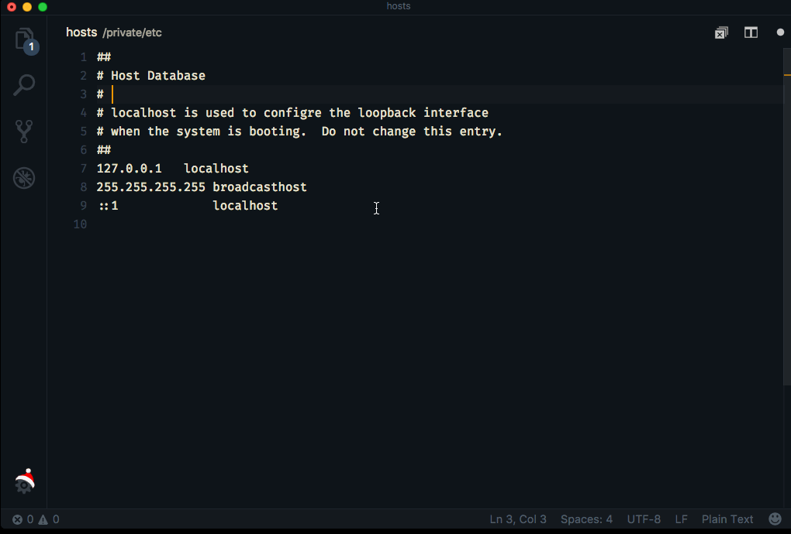
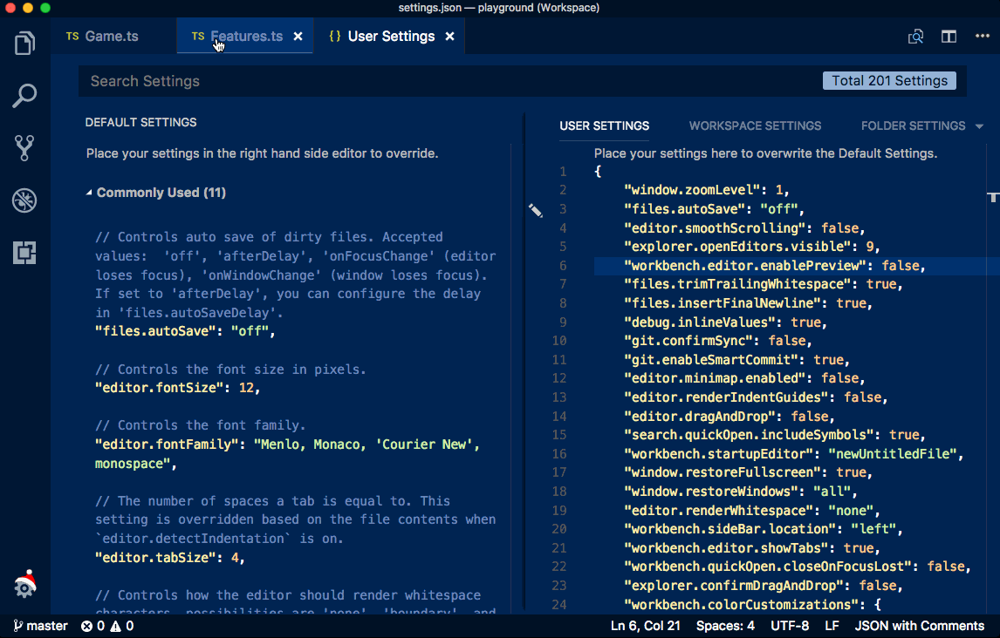

# January 2018 (version 1.20)

## Insiders Release

Welcome to the Insiders build. These are the preliminary notes for the January 1.20 release of Visual Studio Code. As we get closer to the release date, you'll see details below about new features and important fixes.

Until the January release notes are available, you can still track our progress:

* **[Commit Log](https://github.com/Microsoft/vscode/commits/master)** - GitHub commits to the vscode open source repository.
* **[Closed issues](https://github.com/Microsoft/vscode/milestone/58?closed=1)** - Resolved bugs and implemented feature requests in the December/January milestone.

We really appreciate people taking a look at our new features as soon as they are ready so check back here often and learn what's new to try out.

If you find issues or have suggestions, you can enter them in the VS Code repository on [GitHub](https://github.com/Microsoft/vscode/issues).

## Workbench

### Save files that need admin privileges

It is now possible to save files that require admin privileges. A popular example is e.g. making changes to `/etc/hosts`. If the file exists on disk and requires elevated permissions, a new action "Retry as Admin..." will show up from the error message:

Saving as admin is supported on all platforms. Depending on the platform, the prompt to authenticate as administrator will look differently.

### More themable colors for editor tabs

With this release, new themable colors are added for editor tabs:
* `tab.hoverBackground`: Tab background color when hovering
* `tab.unfocusedHoverBackground`: Tab background color in an unfocused group when hovering
* `tab.hoverBorder`: Border to highlight tabs when hovering
* `tab.unfocusedHoverBorder`: Border to highlight tabs in an unfocused group when hovering

You can configure these colors also from the `workbench.colorCustomizations` setting.

### Custom dropdown (Windows, Linux)

On Windows and Linux dropdowns are now using a custom widget instead of the HTML control that was used previously. The dropdown leverages the same colors as the tree/list widget in other parts:

This fixes a couple of issues that we have seen where the HTML dropdown was not showing up properly in some cases.

## Notable Changes

* [19707](https://github.com/Microsoft/vscode/issues/19707): Add "(Administrator)" suffix to window title when running as administrator in Windows
* [39536](https://github.com/Microsoft/vscode/issues/39536): Change to use async API for modal dialogs

<!-- In-product release notes styles.  Do not modify without also modifying regex in gulpfile.common.js -->
<a id="scroll-to-top" role="button" aria-label="scroll to top" href="#"></a>
<link rel="stylesheet" type="text/css" href="css/inproduct_releasenotes.css"/>
