# January 2018 (version 1.20)

**Update 1.20.1**: The update addresses these [issues](https://github.com/Microsoft/vscode/milestone/63?closed=1).

Downloads: [Windows](https://vscode-update.azurewebsites.net/1.20.1/win32-x64/stable) | [Mac](https://vscode-update.azurewebsites.net/1.20.1/darwin/stable) | Linux 64-bit: [.tar.gz](https://vscode-update.azurewebsites.net/1.20.1/linux-x64/stable) [.deb](https://vscode-update.azurewebsites.net/1.20.1/linux-deb-x64/stable) [.rpm](https://vscode-update.azurewebsites.net/1.20.1/linux-rpm-x64/stable) | Linux 32-bit: [.tar.gz](https://vscode-update.azurewebsites.net/1.20.1/linux-ia32/stable) [.deb](https://vscode-update.azurewebsites.net/1.20.1/linux-deb-ia32/stable) [.rpm](https://vscode-update.azurewebsites.net/1.20.1/linux-rpm-ia32/stable)

---

Welcome to the January 2018 release of Visual Studio Code. This release includes the VS Code team's work during the January milestone as well as the [community PRs](#thank-you) contributed in December and January which means there are a lot of great updates. Here are some of the release highlights:

* **[Explorer multi-selection](#multi-select-in-the-explorer)** - Perform actions on multiple files at once.
* **[Improved Settings search](#settings-search)** - Easily find the right setting with natural language search.
* **[Errors & warnings in Explorer](#error-indicators-in-the-explorer)** - Quickly navigate to errors in your code base.
* **[Save large and protected files](#save-files-that-need-admin-privileges)** - Save Admin protected and >256M files within VS Code.
* **[Git submodule support](#git-submodules)** - Perform Git operations on nested Git repositories.
* **[Global snippets](#global-snippets)** - Create snippets you can use across all file types.
* **[Image preview zoom](#image-preview-zooming)** - Zoom in and out of images with your mouse, scroll wheel or track pad.
* **[Terminal screen reader support](#screen-reader-support)** - Integrated Terminal now has "Screen Reader Optimized" mode.
* **[Debugging support for multi-root workspaces](#improved-debugging-support-for-multi-root-workspaces)** - Manage configurations across multiple projects.
* **[Quick Fix all for JavaScript/TypeScript](#quick-fix-all-for-javascript-and-typescript)** - Apply the same Quick Fix to all occurrences in a file.
* **[New Node.js deployment tutorials](#new-documentation)** - Deploy your Node.js app with Docker or Azure App Service.

>If you'd like to read these release notes online, go to [Updates](https://code.visualstudio.com/updates) on [code.visualstudio.com](https://code.visualstudio.com).<br>
>You can also check out this 1.20 release [highlights video](https://youtu.be/MWz8y1D3PMQ) from Cloud Developer Advocate [Brian Clark](https://twitter.com/_clarkio).

The release notes are arranged in the following sections related to VS Code focus areas. Here are some further updates:

* **[Workbench](#workbench)** - "Smart case" search, theme specific color customization.
* **[Editor](#editor)** - New snippet variables, Emmet improvements, minimap on the right or left.
* **[Languages](#languages)** - TypeScript automatic bracket and member property suggestions.
* **[Debugging](#debugging)** - Automatically detect Node.js subprocesses, nvm support.
* **[Extensions](#extensions)** - Extension recommendations for new file types.
* **[Extension Authoring](#extension-authoring)** - Custom view support, new menu groupings.

**Insiders:** Want to see new features as soon as possible? You can download the nightly [Insiders](https://code.visualstudio.com/insiders) build and try the latest updates as soon as they are available.

## Workbench

### Multi select in the Explorer

You can now select multiple files in the **File Explorer** and **OPEN EDITORS** view to run actions (Delete, Drag and Drop, Open to the Side) on multiple items. Uses the `Ctrl/Cmd` key with `click` to select individual files and `Shift` + `click` to select a range. If you select two items, you can now use the **Compare Selected** command to quickly diff two files.


Clicking with the `Ctrl/Cmd` key pressed will no longer open an editor to the side because this key is now used to add more items to the multi-selection. A new setting, `workbench.list.multiSelectModifier`, allows you to change back to the old behavior by setting it to `"workbench.list.multiSelectModifier": "alt"`. With this setting, you use the `Alt` key to add items to the selection.

### Error indicators in the Explorer

We now show files with errors or warnings in the **File Explorer** and the **OPEN EDITORS** view.

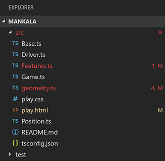

The number of errors/warnings is shown in the decoration. The setting `problems.decorations.enabled` allows you to enable/disable the error/warning decorations.

### Settings search

VS Code provides many settings to customize the editor, and it can be hard to find the setting you're looking for when you don't know which terms to use. We have improved the search functionality in the Settings editor to go beyond simple filtering with literal word matches. The Settings editor will now search with an awareness of alternate wordings, typos, stemmings ("saving" -> "save") and should provide a more natural language search experience.

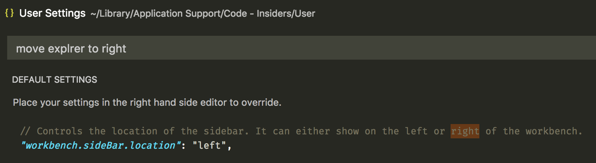

If you prefer the old style of search, you can disable this feature with `"workbench.settings.enableNaturalLanguageSearch": false`.

### Save files that need admin privileges

It is now possible to save files that require administrator privileges. One example is making changes to `/etc/hosts`. If the file exists on disk and requires elevated permissions, a new action **Retry as Admin...** will show up on an error message. Saving as admin is supported on all platforms. Depending on the platform, the prompt to authenticate as administrator will look different.

### Save large files >256 MB

It is now possible to save files >256 MB where previously an error was reported. This was achieved by changing the implementation of how VS Code stores the contents of the editor to disk. Instead of loading the entire file contents into memory, we leverage a snapshot of the content and stream it into the file in chunks of 64KB.

### "Smart Case" search

You can now set `"search.smartCase": true` to enable "smart case" mode for global search. When enabled, VS Code will automatically do a case-sensitive search when you search for a query that contains an uppercase character. If your search query is all lowercase, then the search will be case-insensitive.

For example, searching "code" will match "code" or "Code". Searching "Code" will only match "Code".

### Double-click to open in list/tree

A new setting, `workbench.list.openMode`, was added that controls if items in trees and lists should open on single or double mouse-click. This setting applies both to opening items as well as expanding/collapsing items if they have children.

**Note:** The setting is supported for most trees/lists in VS Code, but in some case we left the default behavior when we thought single-click still makes the most sense. We are happy to hear your feedback!

### Image preview zooming

You can now zoom image previews:


Zoom in and out by clicking, using the scroll wheel (with `Ctrl` on Windows/Linux or `Alt` on macOS), or pinching on a track pad. The current zoom level is shown in the Status Bar. Click on the zoom Status Bar item to quickly switch zoom levels or reset the view.

### Theme specific color customizations

You can now fine tune a specific color theme in your user settings:

```json
"editor.tokenColorCustomizations": {
    "[Monokai]": {
        "comments": "#229977"
    }
},
"workbench.colorCustomizations": {
    "[Monokai]": {
        "sideBar.background": "#347890"
    }
}
```

This example changes just the **Monokai** theme. See the [Customize a Color Theme](https://code.visualstudio.com/docs/getstarted/themes#_customize-a-color-theme) documentation for a more information on themes.

### More themable colors for editor tabs

With this release, new themable colors are added for editor tabs:

* `tab.hoverBackground`: Tab background color when hovering
* `tab.unfocusedHoverBackground`: Tab background color in an unfocused group when hovering
* `tab.hoverBorder`: Border to highlight tabs when hovering
* `tab.unfocusedHoverBorder`: Border to highlight tabs in an unfocused group when hovering

You can configure these colors also from the `workbench.colorCustomizations` setting.

### Custom drop-down (Windows, Linux)

On Windows and Linux, drop-downs now use a custom widget instead of the HTML control. The drop-down leverages the same colors as the tree/list widget in other parts:

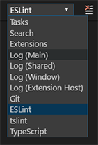

This fixes a couple of issues where the HTML drop-down was not showing up properly in some cases.

### OPEN EDITORS updates

* The **OPEN EDITORS** view can now be resized once it reaches the maximum size specified by `explorer.openEditors.visible`. Due to this change, the setting `explorer.openEditors.dynamicHeight` is no longer supported.
* The ability to set `explorer.openEditors.visible` to 0 to hide the **OPEN EDITORS** view is being deprecated in the January release and we plan to drop it in February. To hide the **OPEN EDITORS** view, use the context menu in the Explorer title area to control the visibility of views.

### Disable macOS Touch Bar entries

A new setting `keyboard.touchbar.enabled` disables the macOS Touch Bar entries that VS Code is providing.

### workbench.fontAliasing setting

You can now set `"workbench.fontAliasing": "auto"` on macOS to control font aliasing depending on the DPI of the monitor that VS Code is showing on. If set to `auto`, VS Code will apply `default` or `antialiased` automatically based on the DPI of the display.

### Output panel

Now you can see VS Code logs with syntax highlighting in the Output panel. Thanks to [emilast](https://github.com/emilast) for providing the grammar for syntax highlighting log files.

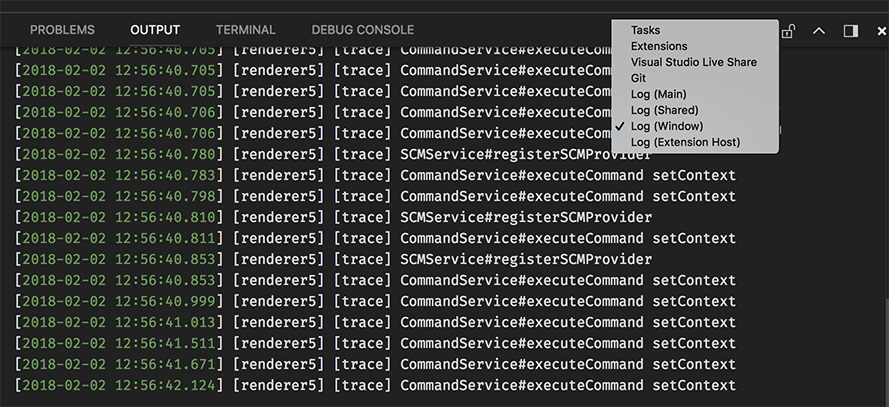

The Output panel also now consumes less memory resources with our new implementation. Memory resources of an output channel are released when not shown.

## Editor

### Global snippets

VS Code now supports global snippets meaning snippets that aren't scoped to a single language but can target any kind of files. Using the  **Preferences: Configure User Snippets** command, select the **New Global Snippets file...** option which will open a `.code-snippets` file for new snippets.  Use the `scope` attribute to list the languages that are targeted by a snippet. For instance, the snippet below can add a copyright header for JavaScript and TypeScript files:

```json
"JS & TS Stub": {
  "scope": "javascript,typescript",
  "prefix": "stub",
  "body": [
    "/*--------------------------------------------------------------",
    " *  Copyright (c) Your Corporation. All rights reserved.",
    " *  Licensed under the MIT License.",
    " *-------------------------------------------------------------*/",
    "",
    "'use strict';",
    "",
    "$0"
  ],
  "description": "Insert Copyright Statement"
}
```

Extension authors can also contribute global snippets. Include a `code-snippets` file in your extension and omit the language property in the `contributes.snippets` section of your `package.json`.

### More snippet variables

We have added new snippet variables to read your clipboard, `CLIPBOARD`, and to insert the current date and time. For date and time,
 combine any of these variables:

* `CURRENT_YEAR`
* `CURRENT_YEAR_SHORT`
* `CURRENT_MONTH`
* `CURRENT_DATE`
* `CURRENT_HOUR`
* `CURRENT_MINUTE`
* `CURRENT_SECOND`

### Keybindings for Quick Fixes and Code Actions

The new `editor.action.codeAction` command lets you configure keybindings for specific Code Actions. This keybinding for example triggers the Extract function refactoring Code Actions:

```json
{
  "key": "ctrl+shift+r ctrl+e",
  "command": "editor.action.codeAction",
  "args": {
    "kind": "refactor.extract.function"
  }
}
```

Code Action kinds are specified by extensions using the enhanced `CodeActionProvided` API. Kinds are hierarchical, so `"kind": "refactor"` will show all refactoring Code Actions, whereas `"kind": "refactor.extract.function"` will only show Extract function refactorings.

Using the above keybinding, if only a single `"refactor.extract.function"` Code Action is available, it will be automatically applied. If multiple Extract function Code Actions are available, we bring up a context menu to select them:

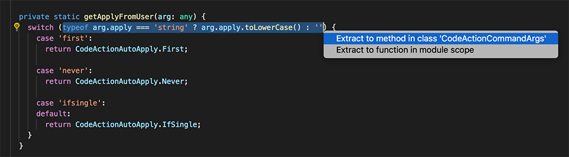

You can also control how/when Code Actions are automatically applied using the `apply` argument:

```json
{
  "key": "ctrl+shift+r ctrl+e",
  "command": "editor.action.codeAction",
  "args": {
    "kind": "refactor.extract.function",
    "apply": "first"
  }
}
```

Valid values for `"apply"`:

* `"first"` - Always automatically apply the first available Code Action.
* `"ifSingle"` - Default. Automatically apply the Code Action if only one is available. Otherwise, show the context menu.
* `"never"` - Always show the Code Action context menu, even if only a single Code Action is available.

### Suggestion improvements

We have refined how suggestions are prioritized and we have added a new setting, `editor.suggestSelection`, to control how suggestions are selected in the UI. You can make sure the top item is always selected (`first`), you can make it select the previously used item (`recentlyUsed`), or you can selected items based on prefixes you have used (`recentlyUsedByPrefix`). A more complete explanation with screenshots is in this GitHub [issue](https://github.com/Microsoft/vscode/issues/41060#issuecomment-360529596).

### Emmet improvements

You can now prefix your CSS abbreviations with `-` to get all applicable vendor prefixes included in the expanded abbreviation.


Read more on [how to control vendor prefix in Emmet](https://code.visualstudio.com/docs/editor/emmet#_include-vendor-prefixes).

Other notable bug fixes in Emmet:

* Use of `@-` to get numbering in descending order in repeaters not working. [#35296](https://github.com/Microsoft/vscode/issues/35296)
* The `snippets.json` file for custom Emmet snippets fails to get parsed in the presence of comments. [#33818](https://github.com/Microsoft/vscode/issues/33818)
* When using `bem` style, part of class names that appear after `-` get cut. [#38768](https://github.com/Microsoft/vscode/issues/38768)
* **Emmet: Wrap with Abbreviation** command should wrap the entire HTML element when cursor is in either open or close tag. [#41516](https://github.com/Microsoft/vscode/issues/41516)
* **Emmet: Wrap with Abbreviation** command should support `|c` and `|bem` filters. [#40471](https://github.com/Microsoft/vscode/issues/40471)
* **Emmet: Update Tag** and **Emmet: Remove Tag** commands matches wrong pair in the presence of self closing tags. [#39789](https://github.com/Microsoft/vscode/issues/39789)
* **Emmet: Expand Abbreviation** command doesn't expand abbreviation that contains unescaped single quotes. [#38807](https://github.com/Microsoft/vscode/issues/38807)
* Emmet expansion gets triggered when editing the value of a CSS property. [#34162](https://github.com/Microsoft/vscode/issues/34162)

### Control cursor width

Use the new setting `editor.cursorWidth` to control the width of the cursor in pixels. This is only applicable when the `editor.cursorStyle` is set to `line`. The cursor stops growing wider after reaching the character width.

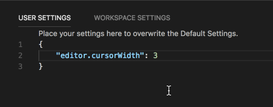

### Global macOS find clipboard

In the 1.19 release, we integrated with the macOS [global find clipboard](https://code.visualstudio.com/updates/v1_19#_global-find-clipboard-on-macos) which makes it easier to share search text across applications. This is now disabled by default, but can be enabled with the `"editor.find.globalFindClipboard"` setting. It's also now supported by the Search view (also disabled by default) and can be enabled with the `"search.globalFindClipboard"` setting.

### Select text while jumping between brackets

There is a new command, **Select to Bracket**, that will select the text between two matching brackets (as opposed to the already existing command, **Go to Bracket**, which only moves the cursor to the matching bracket).

### Display minimap to the left

There is a new setting, `editor.minimap.side`, which can be configured to render the minimap (code outline) on the left:

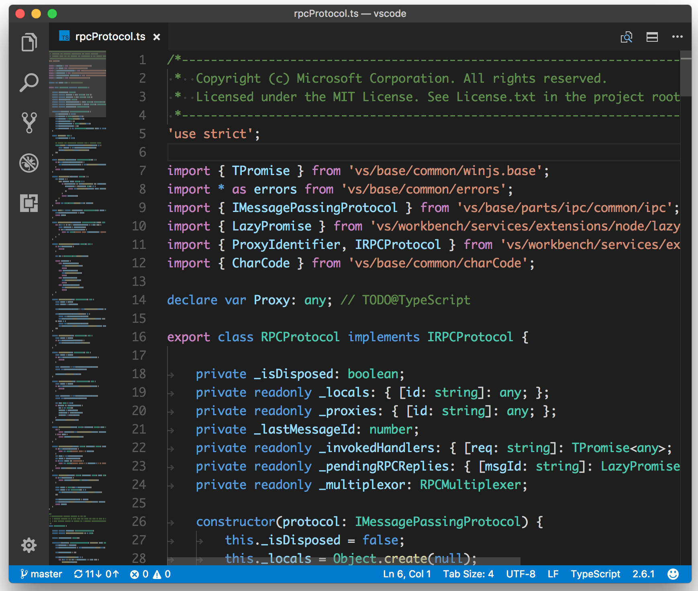

### Toggle for Ignore Trim Whitespace in the Diff Editor

There is now a new action in the Diff Editor title area to quickly toggle the ignore trim whitespace setting:


## Source Control

### Git submodules

This release introduces Git submodule support. Since submodules are Git repositories themselves, they appear in the repositories list. There is basic support in place which lets you stage, unstage or discard submodule changes in the outer repository. You can disable automatic submodule detection with the `git.detectSubmodules` setting.

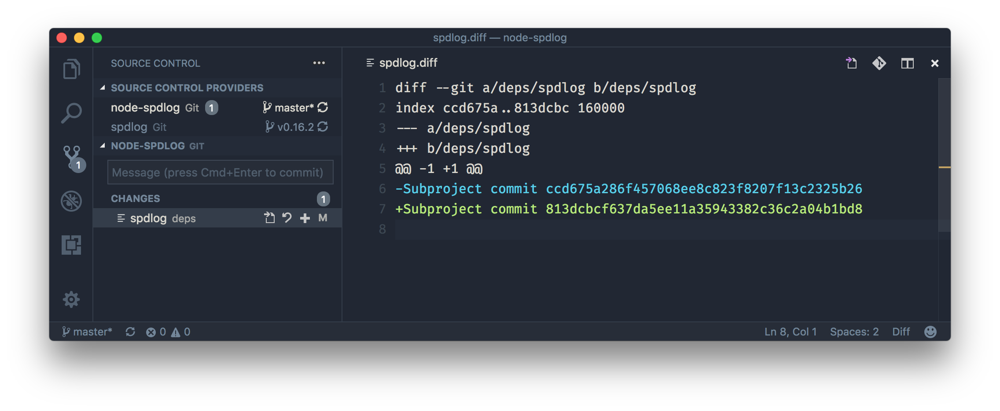

### Git: Prompt to save files before committing

You can enable Git to prompt you to save unsaved files before committing. You can enable this with the `git.promptToSaveFilesBeforeCommit` setting.

### Git: Commit input validation

The Git extension now provides commit message length validation:

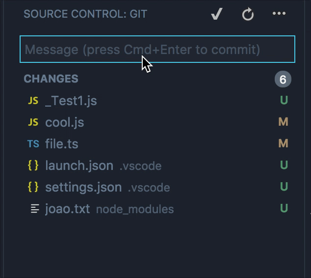

You can configure the validation's behavior using the `git.inputValidation` setting, which has the following possible values: `always`, `warn` and `none`. The previous screenshot showcases the `always` option, while the default is `warn`.

### Setting for editor diff decorations

Control when and how inline diff decorations show up in the editor using the `scm.diffDecorations` setting. Possible values are `all`, `gutter`, `overview` and `none`.

## Integrated Terminal

### Screen reader support

Screen reader support was added to the terminal. In order to enable this, VS Code needs to be in "Screen Reader Optimized" mode which is typically auto-detected but can also be manually toggled by opening up editor accessibility help `kb(editor.action.showAccessibilityHelp)`.

We consider this a first step and are actively looking into ways to make using the terminal easier for those with vision issues.

### Mouse wheel now works as expected in terminal applications

Applications such as `vim` and `tmux` which are hosted in the terminal's *alt* buffer now have mouse wheel events translated to arrow events which enabled scrolling. Thanks to [Manoj Patel](https://github.com/nojvek) for helping define the correct behavior here.

### Option as meta on macOS

The option key can now be used as the meta key in the terminal, allowing the use of typical shell shortcuts like `option+B` to jump back a word and `option+F` to jump forward a word.

```js
"terminal.integrated.macOptionIsMeta": true
```

### Copy on selection

You can now automatically copy whenever you select text in the terminal:

```js
"terminal.integrated.copyOnSelection": true
```

This is disabled by default.

### Variables resolved in env setting

Variables are now resolved in `terminal.integrated.env.*` settings. This uses the standard [variable format](https://code.visualstudio.com/docs/editor/variables-reference) used in other settings:

```js
"terminal.integrated.env.linux": {
  "FOO": "${workspaceRoot}",
  "BAR": "${env:PATH}"
},
```

## Debugging

### Improved debugging support for multi root workspaces

A multi-root workspace can be used to work on related projects (for example "Server" and "Client") in a single workspace. Each of these folders have their own launch configurations (for example "Launch Server" and "Launch Client") but until now it was not possible to combine launch configurations from different folders into a "compound" launch configuration (because there was no mechanism to reference launch configurations across folders).

In this milestone, we have addressed this limitation: first we've added support for "workspace" scoped launch configurations, and second we've introduced a syntax for referencing launch configurations across folders.
With this compound launch configs that reach into different folders can be kept where they belong: at the workspace level.

Workspace scoped launch configurations live in the `"launch"` section of the workspace configuration file which can be easily edited via **Workspaces: Open Workspace Configuration File** in the **Command Palette**:

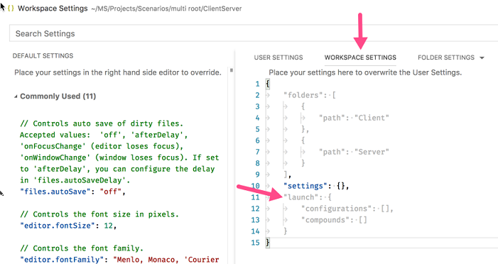

Alternatively new launch configurations can be added via the **Add Config (workspace)** entry of the Launch Configuration drop-down menu:

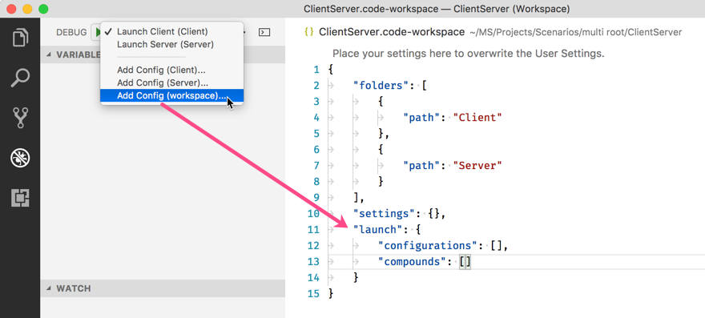

A compound launch configuration can reference the individual launch configurations by name as long as the names are unique within the workspace, for example:

```json
  "compounds": [{
      "name": "Launch Server & Client",
      "configurations": [
        "Launch Server",
        "Launch Client"
      ]
  }]
```

If the individual launch configuration names are not unique, the qualifying folder can be specified with a more verbose "folder" syntax:

```json
  "compounds": [{
      "name": "Launch Server & Client",
      "configurations": [
        "Launch Server",
        {
          "folder": "Web Client",
          "name": "Launch Client"
        },
        {
          "folder": "Desktop Client",
          "name": "Launch Client"
        }
      ]
  }]
```

In addition to `compounds` the `launch` section of the workspace configuration file can contain regular launch configurations too. Just make sure that all used variables are explicitly scoped to a specific folder because otherwise they are not valid for the workspace. You can find more details about explicitly scoped variables in the section [below](#scoped-configuration-variables).

Here is an example for a launch configuration where the program lives in a folder "Program" and where all files from a folder "Library" should be skipped when stepping:

```json
"launch": {
  "configurations": [{
      "type": "node",
      "request": "launch",
      "name": "Launch test",
      "program": "${workspaceFolder:Program}/test.js",
      "skipFiles": [
        "${workspaceFolder:Library}/out/**/*.js"
      ]
  }]
}
```

### Scoped configuration variables

We've introduced a new variable syntax to scope configuration variables in `launch.json` and `tasks.json` files to a specific workspace folder. By appending the root folder's name to a variable (separated by a colon), it is possible to reach into sibling root folders of a workspace. Without the root folder name, the variable is scoped to the same folder where it is used.

For example, in a multi-root workspace with folders `Server` and `Client`, a `${workspaceFolder:Client}` refers to the path of the `Client` root. For a more involved example see section [Improved debugging support for multi-root workspaces](#improved-debugging-support-for-multi-root-workspaces).

> More about variable substitution can be found [here](https://code.visualstudio.com/docs/editor/variables-reference)

### Node debugging

**Automatically attach debugger to Node.js subprocesses**

For node-debug we've added a mechanism that tracks all subprocesses of a debuggee and tries to automatically attach to those processes that are launched in debug mode. This feature simplifies debugging of programs that fork or spawn Node.js processes like programs based on the "cluster" node module:


The feature is enabled by setting the launch config attribute `autoAttachChildProcesses` to true:

```json
{
  "type": "node",
  "request": "launch",
  "name": "Cluster",
  "program": "${workspaceFolder}/cluster.js",
  "autoAttachChildProcesses": true
}
```

**Please note:** In order to be able to track the subprocesses, we need the process ID of the parent. For this we require that the main debuggee launched from the launch config is a Node.js process and we use an "evaluate" to find its process ID.

Whether a process is in debug mode is guessed by analyzing the program arguments. Currently we detect the patterns `--inspect`, `--inspect-brk`, `--inspect-port`, `--debug`, `--debug-brk`, `--debug-port` (all optionally followed by a `=` and a port number).

**"nvm" support**

If you are using "nvm" (or "nvm-windows") to manage your Node.js versions it is now possible to specify a `runtimeVersion` attribute in a launch configuration for selecting a specific version of Node.js.

Here is an example launch config:

```json
{
  "type": "node",
  "request": "launch",
  "name": "Launch test",
  "runtimeVersion": "7.10.1",
  "program": "${workspaceFolder}/test.js"
}
```

**Please note**: Make sure to have those Node.js versions installed that you want to use with the `runtimeVersion` attribute as the feature will not download and install the version itself. So you will have to run something like `nvm install 7.10.1` from the integrated terminal if you plan to add `"runtimeVersion": "7.10.1"` to your launch configuration.

## Extensions

### Extension recommendations

When you are working on file types not supported out-of-the-box by VS Code or by any installed extension, you may not see syntax highlighting. If there are extensions in the Marketplace that can support such files, you will now be notified.

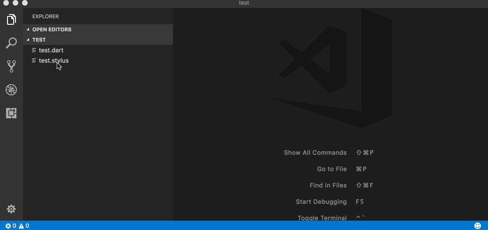

The extension recommendation list will now include extensions that are popular among other users who work on the same repository as you.

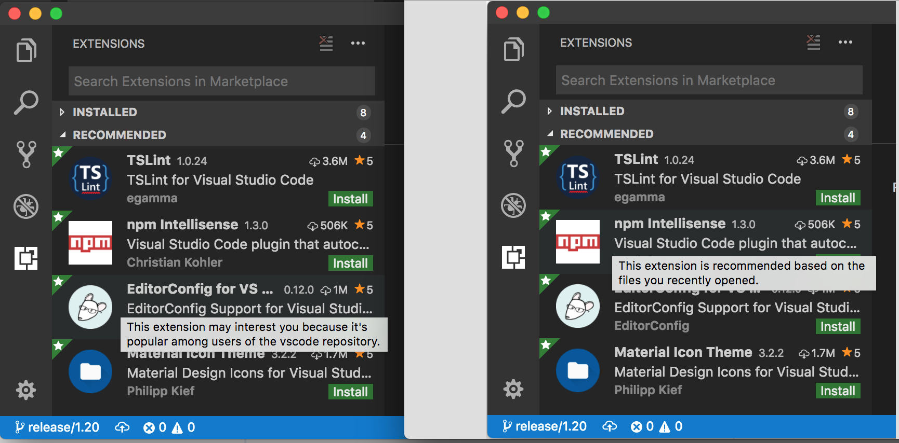

## Languages

### TypeScript 2.7.1

VS Code now ships with [TypeScript 2.7.1](https://devblogs.microsoft.com/typescript/announcing-typescript-2-7/). This update brings a number of new features and bug fixes.

### Quick Fix all for JavaScript and TypeScript

Fix errors in a flash with new Quick Fix all for JavaScript and TypeScript. Move your cursor to a fixable error such as an unused variable, and trigger Quick Fixes using the lightbulb or by pressing `kb(editor.action.quickFix)`. If one of the available Quick Fixes can be applied to multiple errors in the current file, you'll see a new **Fix all in file** Code Action.

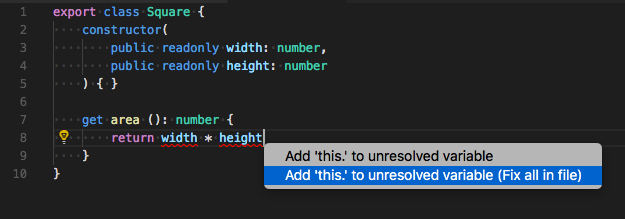

Accept and all errors will disappear:

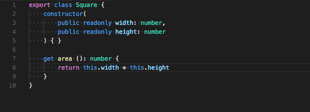

### Bracket property suggestions

Spaces got you down? When you type `.`, VS Code now shows all known properties for JavaScript and TypeScript, even if a property name contain whitespaces or other non-identifier characters.

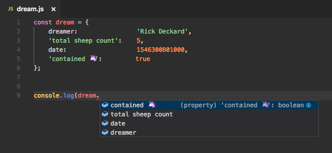

Accepting one of these suggestions automatically converts to bracket accessor notation.

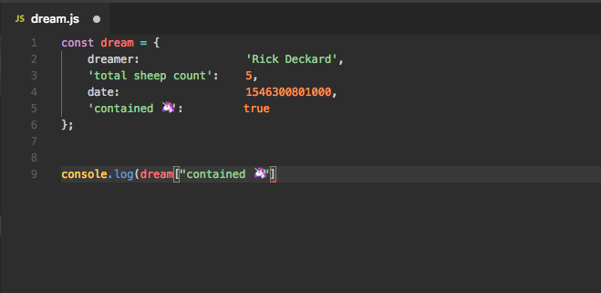

### Automatic member property suggestions

Tired of typing `this.` to access class properties in JavaScript and TypeScript? Now you can just start typing to see available members.

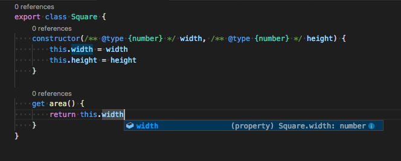

Accept a member property suggestion, and VS Code automatically inserts the require `this.`.

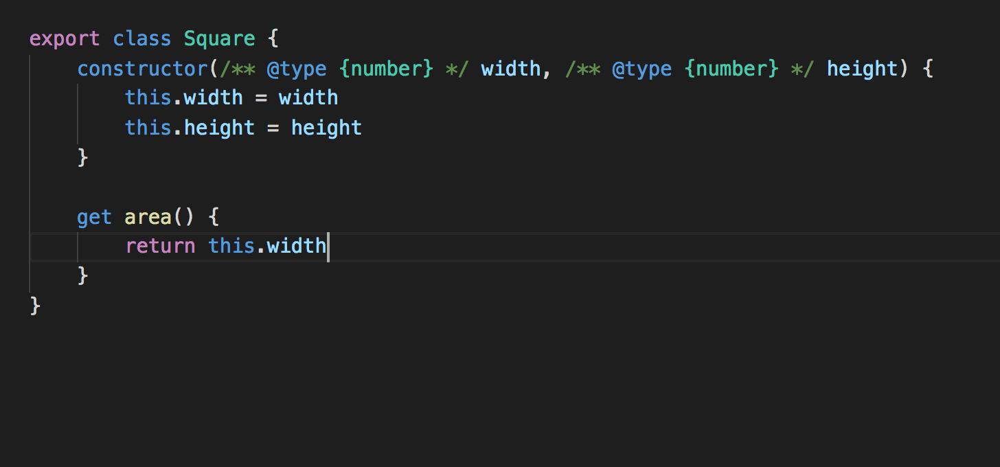

### Marking of optional property in suggestions

Suggestions for optional TypeScript properties are now suffixed with a `?`:

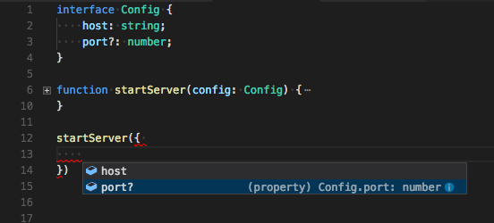

JavaScript users will also see `?` for completions that come from `*.d.ts` Type Declaration (typings) packages.

### Auto-imports based on filename

Auto-imports for JavaScript and TypeScript now support importing default exported objects based on filename:


### Extension contributed TypeScript plugins

[TypeScript plugins](https://github.com/Microsoft/TypeScript/wiki/Writing-a-Language-Service-Plugin) let developers extend VS Code's JavaScript and TypeScript language support. For example, a TypeScript plugin might add additional linting to a file or add IntelliSense when working within JavaScript template strings.

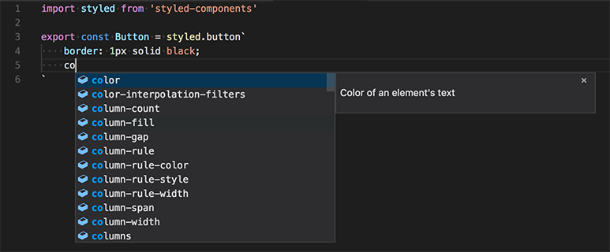

TypeScript plugins were first introduced in TypeScript 2.3, but they previously required installing plugins into your workspace with `npm` and then configuring a `jsconfig.json` or `tsconfig.json` file to load them. VS Code 1.20 simplifies this by allowing extensions to contribute a set of global TypeScript plugins that are automatically activated without any configuration. All you need to do is install the extension.

A few extensions are already making use of this:

* [vscode-styled-components](https://marketplace.visualstudio.com/items?itemName=jpoissonnier.vscode-styled-components) - Syntax highlighting, IntelliSense, and error reporting for [styled-component](https://github.com/styled-components/styled-components) CSS strings.
* [lit-html](https://marketplace.visualstudio.com/items?itemName=bierner.lit-html) - Syntax highlighting, IntelliSense, and formatting for [lit-html](https://github.com/Polymer/lit-html) template strings.

Extension contributed plugins are automatically activated for VS Code's version of TypeScript. If you are using a workspace version of TypeScript, you must still install the TypeScript plugins in your workspace.

Our extension authoring documentation has more information about the new [TypeScript Plugin contribution point](https://code.visualstudio.com/docs/extensionAPI/extension-points#_contributestypescriptserverplugins). We're very excited to see how extension authors leverage this!

## Serviceability

Reporting an issue through the **Help: Report Issue** or **Help: Report Performance Issue** commands now opens a separate window.

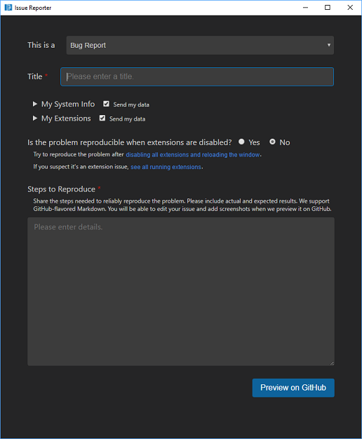

This window can collect information based on the type of issue you want to report. This includes basic information about your system, your active extensions, the running VS Code processes, and the types of files in your workspace. You choose which information to send and the reporter will open a browser window to preview the issue on GitHub.

## Extension Authoring

### Custom views

Custom views will become better and better with following additions to the API:

**Inline actions**

Extension authors can now contribute inline actions to tree items using `inline` group in `view/item/context` menu contribution. For example:

```json
"contributes": {
  "commands": [
    {
      "command": "jsonOutline.refreshNode",
      "title": "Refresh",
      "icon": {
        "light": "resources/light/refresh.svg",
        "dark": "resources/dark/refresh.svg"
      }
    }
  ],
  "menus": {
    "view/item/context": [
      {
        "command": "jsonOutline.refreshNode",
        "when": "view == jsonOutline",
        "group": "inline"
      }
    ]
  }
}
```

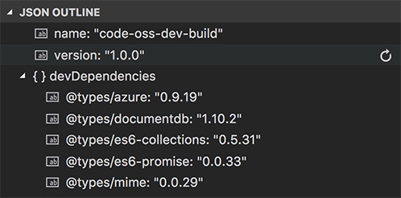

**Resource URI**

If the custom tree view is based on file resources, then extension authors can provide the resource URI in the `TreeItem` representing it. This will adopt your view to the user configured File Icon theme and make it look similar to the File Explorer view in the Explorer.

```typescript
/**
 * The [uri](#Uri) of the resource representing this item.
 *
 * Will be used to derive the [label](#TreeItem.label), when it is not provided.
 * Will be used to derive the icon from current file icon theme, when [iconPath](#TreeItem.iconPath) is not provided.
 */
resourceUri?: Uri;
```

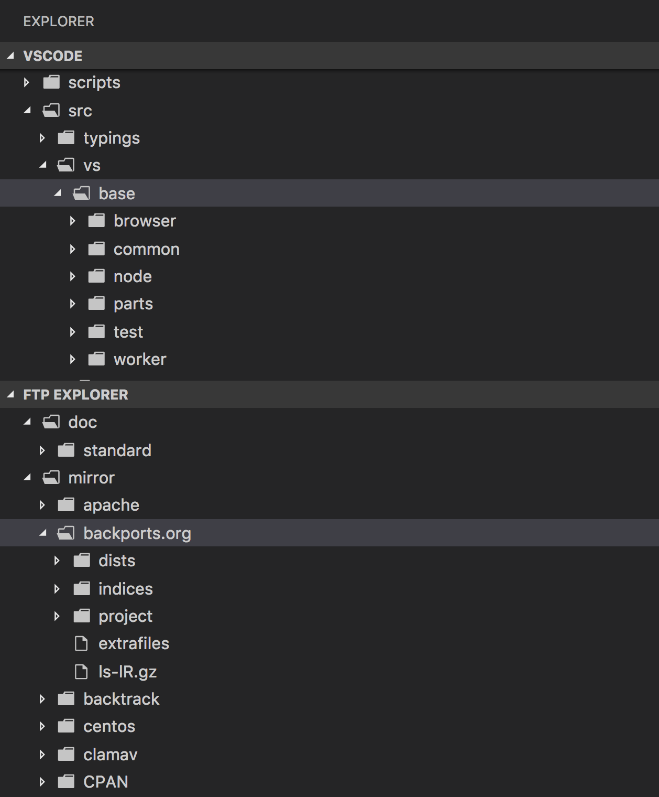

**Id property**

Extension authors can provide an `id` to the `TreeItem` so that its selection and expansion state can be retained reliably when it gets changed.

```typescript
/**
 * Optional id for the tree item that has to be unique across tree. The id is used to preserve the selection and expansion state of the tree item.
 *
 * If not provided, an id is generated using the tree item's label. **Note** that when labels change, ids will change and that selection and expansion state cannot be kept stable anymore.
 */
id?: string;
```

### Multi selection context for Explorer commands

This milestone we have introduced multi-selection in the Explorer as mentioned [above](#workbench). Extensions that contribute commands to the Explorer can respond to multi selection in the Explorer by respecting the new arguments passed to their commands.

As before VS Code tries to infer the currently selected resource in the Explorer and passes that as a parameter when invoking the command. However if multi selection is enabled, VS Code will pass an additional second argument to the command, an array of resources which are selected. This array always contains the first resource argument.

### New menu group identifiers

Several menus now have new group identifiers for finer control on command placement:

**Explorer context menu**

* `navigation`:  Commands related to navigation across VS Code. As before this is the primary group of the Explorer context menu.
* `2_workspace`: Commands related to workspace manipulation.
* `3_compare`: Commands related to comparing files in the diff editor.
* `4_search`: Commands related to searching in the search view.
* `5_cutcopypaste`: Commands related to cutting, copying and pasting of files.
* `7_modification`: Commands related to the modification of a files.

**Editor Tab context menu**

* `1_close`: Commands related to closing editors.
* `3_preview`: Commands related to pinning editors.

**Editor Title menu**

* `1_diff`: Commands related to working with diff editors.
* `3_open`: Commands related to opening editors.
* `5_close`: Commands related to closing editors.

### New keyboard shortcut context operator

Keyboard shortcut contexts allow users to control when keybindings are active. They are also referred to as [when](https://code.visualstudio.com/docs/getstarted/keybindings#_when-clause-contexts) clauses because they define *when* a keybinding is active or enabled. In this release, there is a new key-value pair operator for `when` clauses. The expression `key =~ value` treats the right hand side as a regular expression to match against the left hand side. For example, to contribute context menu items for all Docker files, one could use:

```json
   "when": "resourceFilename =~ /docker/"
```

### CodeActionProvider improvements

A `CodeActionProvider` can now return objects of the new `CodeAction` class. `CodeAction` adds additional metadata and functionality over `Command`, and better captures what Code Actions are and how they are used in VS Code's UI.

A `CodeAction` primarily consists of a `title`, `kind`, and at least a `Command` or (new in VS Code 1.20) a `WorkspaceEdit`.

```ts
import * as vscode from 'vscode'

/**
 * Quick fix provider that converts :) to 😀
 */
export class Emojizer implements vscode.CodeActionProvider {
    provideCodeActions(document: vscode.TextDocument, range: vscode.Range) {
        const pos = range.start;
        const line = document.lineAt(pos.line);

        // Check if we are at a :)
        if (line.text[pos.character] === ':' && line.text[pos.character + 1] === ')') {
            const fix = new vscode.CodeAction('Convert to 😀', vscode.CodeActionKind.QuickFix);
            fix.edit = new vscode.WorkspaceEdit();
            fix.edit.replace(document.uri, new vscode.Range(pos, pos.translate(0, 2)), '😀');
            return [fix];
        }
        return undefined;
    }
}
```

`CodeAction` also adds metadata about Code Actions, including the Code Action's kind (`vscode.CodeActionKind.QuickFix` in the example above) and the set of diagnostics that the Code Action addresses. We use this metadata to implement features such as the `Refactor` command and `vscode.action.codeAction` keybindings, and plan to build additional features using it in the future.

### Remove files from the Open Recent list

A new command `vscode.removeFromRecentlyOpened` removes entries from the **Open Recent** list in the **File** menu.

### Specify current directory when creating terminals

There is a new `cwd` property to set the current working directory when calling `createTerminal`:

```ts
vscode.window.createTerminal({
  name: 'My Ext Terminal',
  cwd: process.env.HOME
});
```

### Debug API

**Adding and removing breakpoints**

In this milestone, we've continued work on the breakpoints debug API. It is now possible to [add and remove](https://github.com/Microsoft/vscode/blob/7636a7d6f7d2749833f783e94fd3d48d6a1791cb/src/vs/vscode.proposed.d.ts#L282-L292) `SourceBreakpoints` and `FunctionBreakpoints`.

> **Note:** The breakpoints API is still proposed, so in order to use it, you must opt into it by adding a `"enableProposedApi": true` to `package.json` and you'll have to copy the [`vscode.proposed.d.ts`](https://github.com/Microsoft/vscode/blob/master/src/vs/vscode.proposed.d.ts) into your extension project. Also be aware that you cannot publish an extension to the Marketplace that uses the `enableProposedApi` attribute.

**new `DebugConfigurationProvider.debugAdapterExecutable` replaces `adapterExecutableCommand` commands**

Currently a debugger extension can contribute the "hook"-like command `adapterExecutableCommand` to return a dynamically calculated path (and corresponding program arguments) of the debug adapter about to be launched by VS Code.
In this milestone, we are proposing "real" API that replaces the untyped command based mechanism with a typed solution. At the same time we are deprecating the `adapterExecutableCommand` command (and we will remove support for it as soon it is no longer used).

The new API is an optional method [`debugAdapterExecutable`](https://github.com/Microsoft/vscode/blob/7636a7d6f7d2749833f783e94fd3d48d6a1791cb/src/vs/vscode.proposed.d.ts#L388-L395) on the `DebugConfigurationProvider` that returns the path and arguments wrapped as an `DebugAdapterExecutable` object.

**Command `vscode.logToDebugConsole` will be removed**

As [announced](https://code.visualstudio.com/updates/v1_18#_debug-api-updates) in the previous release, we have deprecated the  `vscode.logToDebugConsole` command in favor of real debug API. We plan to remove support for the `vscode.logToDebugConsole` command in the February milestone.

**Run a debug adapter inside the debug extension**

Developing a debugger extension typically involves debugging both the extension and the debug adapter in two parallel sessions. VS Code supports this nicely but development could be easier if both the extension and the debug adapter would be one program that could be debugged in one session.

In this milestone we've explored a way to run the debug adapter inside the extension. The basic idea is to intercept the launch of a debug session in the `resolveDebugConfiguration` method of a `DebugConfigurationProvider` and starting to listen for connect requests and creating a new debug adapter session for every request. To make VS Code use connect requests (instead of always launching new debug adapter), the launch configuration is modified by adding the `debugServer` attribute to it.

These [lines of code](https://github.com/Microsoft/vscode-mock-debug/blob/042d19a27a8e3a08f27a24110506b53fbecc75ce/src/extension.ts#L61-L71) implement this approach for the "Mock Debug" extension (enable this feature by setting the compile time flag `EMBED_DEBUG_ADAPTER` to true).

## Proposed Extension APIs

This milestone we added new proposed extension APIs for two areas. We plan to add these APIs to stable in a future milestone once we are confident enough with them. We welcome any feedback on how they work for your extension.

> **Note:** These APIs are still proposed, so in order to use it, you must opt into it by adding a `"enableProposedApi": true` to `package.json` and you'll have to copy the [`vscode.proposed.d.ts`](https://github.com/Microsoft/vscode/blob/master/src/vs/vscode.proposed.d.ts) into your extension project. Also be aware that you cannot publish an extension to the Marketplace that uses the `enableProposedApi` attribute.

### Extension logging

Extensions are now able to write logs to their own folder inside VS Code's log folder.

```typescript
/**
 * The severity level of a log message
 */
export enum LogLevel {
  Trace = 1,
  Debug = 2,
  Info = 3,
  Warning = 4,
  Error = 5,
  Critical = 6,
  Off = 7
}

/**
 * A logger for writing to an extension's log file, and accessing its dedicated log directory.
 */
export interface Logger {
  readonly onDidChangeLogLevel: Event<LogLevel>;
  readonly currentLevel: LogLevel;
  readonly logDirectory: Thenable<string>;

  trace(message: string, ...args: any[]): void;
  debug(message: string, ...args: any[]): void;
  info(message: string, ...args: any[]): void;
  warn(message: string, ...args: any[]): void;
  error(message: string | Error, ...args: any[]): void;
  critical(message: string | Error, ...args: any[]): void;
}

export interface ExtensionContext {
  /**
   * This extension's logger
   */
  logger: Logger;
}
```

Your extension can use the methods on `Logger` to write log messages with some log level, and the user can use the **Developer: Set Log Level** command to specify at which minimum level should log messages be recorded.

You can find the log files by running the **Developer: Open Logs Folder** command. That folder will contain a folder for each running instance of an extension that has written logs.

### Add, remove and change workspace folders

A new proposed API was added to change workspace folders in the currently opened workspace:

```typescript
updateWorkspaceFolders(
  start: number,
  deleteCount: number,
  ...workspaceFoldersToAdd: { uri: Uri, name?: string }[]
): boolean
```

This method can:

* Remove existing workspace folders (by providing the index of the folder to delete via `start` and the number of folders to remove via `deleteCount`).
* Add new workspace folders to a specific index (by providing the index where to add to via `start`, leaving `deleteCount` as `0` and providing the workspace folders to add as arguments).
* Update existing folders, for example, move them or rename them (by removing existing folders first and then adding them back again).

### RenameProvider2

The proposed `RenameProvider2` extension to `RenameProvider` allows extensions to provide additional rename information, including range of the symbol to rename and the initial name shown when a user triggers rename:

```ts
export interface RenameInitialValue {
  range: Range;
  text?: string;
}

export interface RenameProvider2 extends RenameProvider {
  resolveInitialRenameValue?(document: TextDocument, position: Position, token: CancellationToken): ProviderResult<RenameInitialValue>;
}
```

## Preview Features

This milestone we worked on several features which are not ready to be released but we would like your feedback.

### Language packs

We added support for language packs which will allow adding additional translations to VS Code using an extension. The screen shot below shows VS Code running using a Bulgarian language pack generated from VS Code's [Transifex](https://www.transifex.com/microsoft-oss/) project:

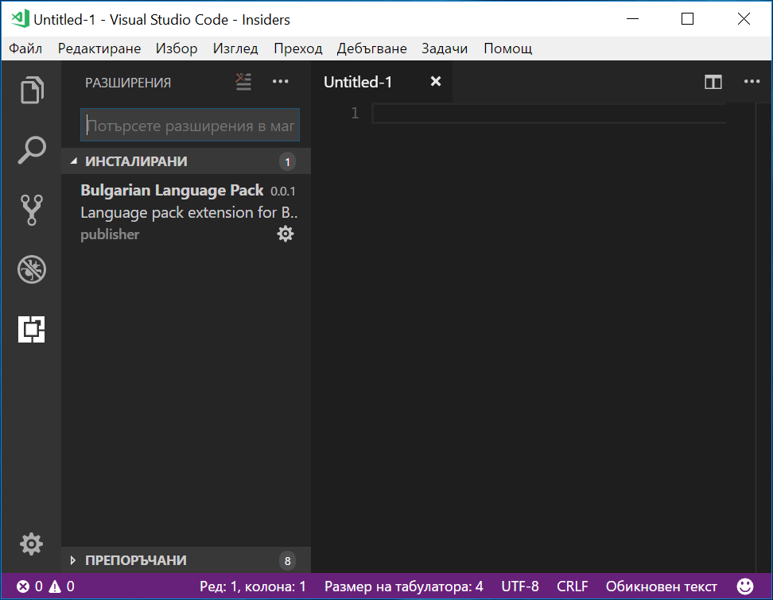

In the next months we will work with the translators in Transifex to establish a process on how to best publish their translations as language pack extensions in the [Marketplace](https://marketplace.visualstudio.com/).

### UX designs for notifications

During this milestone, the UX (User Experience) team worked on redesigning the notifications display in VS Code. We plan to start development work on these designs in the February milestone. More details about the design can be found in this [GitHub issue](https://github.com/Microsoft/vscode/issues/22388#issuecomment-361915332) and we are happy for your feedback.

## New Documentation

### Node.js deployment tutorials for Docker and Azure App Service

We have two new tutorials for [deploying Node.js applications](https://code.visualstudio.com/docs/nodejs/nodejs-deployment?utm_source=VsCode&utm_medium=ReleaseNotes) to Azure.

Tutorial | Description
--- | ---
[Deploy using Azure App Service](https://code.visualstudio.com/tutorials/app-service-extension/getting-started?utm_source=VsCode&utm_medium=ReleaseNotes) | Manage Azure resources directly in VS Code with the [Azure App Service](https://marketplace.visualstudio.com/items?itemName=ms-azuretools.vscode-azureappservice) extension.
[Deploy using Docker](https://code.visualstudio.com/tutorials/docker-extension/getting-started?utm_source=VsCode&utm_medium=ReleaseNotes) | Deploy your website using a Docker container with the [Docker](https://marketplace.visualstudio.com/items?itemName=ms-azuretools.vscode-docker) extension.

### Variable substitution reference

We added a [Variables Reference](https://code.visualstudio.com/docs/editor/variables-reference) describing VS Code's support for variable substitution (for example `${workspaceFolder}`, `${file}`) in your debugging and task configuration files.

### VS Code recipe for Vue.js

There is now a [Vue.js debugging recipe](https://github.com/Microsoft/vscode-recipes/tree/master/vuejs-cli) to help configure the [Chrome debugger](https://marketplace.visualstudio.com/items?itemName=msjsdiag.debugger-for-chrome) for applications which use the popular [Vue.js](https://vuejs.org/) framework.

### Language Server Protocol website

For extension authors, we've create a new Language Server Protocol [website](https://microsoft.github.io/language-server-protocol/) providing documentation, the LSP specification, and listing the current implementations.

## New Commands

Key|Command|Command id
---|-------|----------
`kb(editor.action.refactor)`|Open refactoring context menu at current position|`workbench.action.refactor`
`kb(workbench.action.moveEditorToFirstGroup)`|Move Editor into First Group|`workbench.action.moveEditorToFirstGroup`
`kb(workbench.action.moveEditorToSecondGroup)`|Move Editor into Second Group|`workbench.action.moveEditorToSecondGroup`
`kb(workbench.action.moveEditorToThirdGroup)`|Move Editor into Third Group|`workbench.action.moveEditorToThirdGroup`
`kb(list.expandSelectionDown)`|Multi-Select in lists/trees: expand selection down|`list.expandSelectionDown`
`kb(list.expandSelectionUp)`|Multi-Select in lists/trees: expand selection up|`list.expandSelectionUp`
`kb(workbench.action.openLogFile)`|Developer: Open Log File...|`workbench.action.openLogFile`
`kb(workbench.action.openLogsFolder)`|Developer: Open Logs Folder|`workbench.action.openLogsFolder`
`kb(workbench.action.showLogs)`|Developer: Show Logs...|`workbench.action.showLogs`
`kb(workbench.action.setLogLevel)`|Developer: Set Log Level|`workbench.action.setLogLevel`
`kb(settings.action.editFocusedSetting)`|Edit focused setting in the Settings editor|`settings.action.editFocusedSetting`

Command `workbench.action.files.revealActiveFileInWindows` is a duplication of an already available command `revealFileInOS`. Therefore we are deprecating the `workbench.action.files.revealActiveFileInWindows` command in the January release and plan to drop it in February.

Command `workbench.action.files.copyPathOfActiveFile` is a duplication of an already available command `copyFilePath`. Therefore we are deprecating the `workbench.action.files.copyPathOfActiveFile` command in the January release and plan to drop it in February.

## Notable Changes

* [7893](https://github.com/Microsoft/vscode/issues/7893): Tweet feedback button - make it hideable
* [16852](https://github.com/Microsoft/vscode/issues/16852): Allow to search commands related to problems view with "error" or "warning"
* [19707](https://github.com/Microsoft/vscode/issues/19707): Add "(Administrator)" suffix to window title when running as administrator in Windows
* [31988](https://github.com/Microsoft/vscode/issues/31988): Terminal processes exit too eagerly if window close is canceled
* [34320](https://github.com/Microsoft/vscode/issues/34320): Terminal font squished when changing monitors with varying DPIs
* [35462](https://github.com/Microsoft/vscode/issues/35462): Remember visibility of custom view globally for all windows
* [37589](https://github.com/Microsoft/vscode/issues/37589): Multiple Process Debugging not possible with integratedTerminal
* [39371](https://github.com/Microsoft/vscode/issues/39371): Call stack only shows top frame after restart
* [39536](https://github.com/Microsoft/vscode/issues/39536): Change to use async API for modal dialogs
* [39574](https://github.com/Microsoft/vscode/issues/39574): Allow to change the log level of all log services at runtime
* [39719](https://github.com/Microsoft/vscode/issues/39719): Double click in Debugger watch panel should trigger new watch UI
* [40088](https://github.com/Microsoft/vscode/issues/40088): Running Extensions - provide action to disable an extension
* [41071](https://github.com/Microsoft/vscode/issues/41071): Quick access to custom views
* [41759](https://github.com/Microsoft/vscode/issues/41759): Show installing status while installing a VSIX extension

## Thank You

Last but certainly not least, a big *__Thank You!__* to the following folks that helped to make VS Code even better:

* [BlueC0re(@bluec0re)](https://github.com/bluec0re): Pointed out a security vulnerability that we have addressed in version 1.19.3.

Contributions to `vscode`:

* [Afonso Pinto (@afonsobspinto)](https://github.com/afonsobspinto):  Select to bracket [PR #39066](https://github.com/Microsoft/vscode/pull/39066)
* [Anton Kosyakov (@akosyakov)](https://github.com/akosyakov)
  * [monaco] fix Microsoft/monaco-editor#642: sync CompletionItemProvider api [PR #41595](https://github.com/Microsoft/vscode/pull/41595)
  * [monaco] bind ILogService to NullLogService by default [PR #41927](https://github.com/Microsoft/vscode/pull/41927)
* [Aldo Donetti (@aldonetti)](https://github.com/aldonetti):  corrected typo [PR #42182](https://github.com/Microsoft/vscode/pull/42182)
* [@Ash258](https://github.com/Ash258):  Add region markers for Markdown [PR #40312](https://github.com/Microsoft/vscode/pull/40312)
* [Kirill Shaplyko (@Baltazore)](https://github.com/Baltazore):  Option to disable Touch Bar controls,  leave control strip [PR #40692](https://github.com/Microsoft/vscode/pull/40692)
* [Sebastian (@BattleBas)](https://github.com/BattleBas):  Added setting "git.autoRepositoryDetection" [PR #36183](https://github.com/Microsoft/vscode/pull/36183)
* [Pengcheng Bi (@bpceee)](https://github.com/bpceee)
  * add option to disable terminal exit alert [PR #40861](https://github.com/Microsoft/vscode/pull/40861)
  * Add tooltip on links in markdown preview #30201 [PR #40572](https://github.com/Microsoft/vscode/pull/40572)
* [Brian Schlenker (@bschlenk)](https://github.com/bschlenk):  Add ability to zoom in/out on all images [PR #38538](https://github.com/Microsoft/vscode/pull/38538)
* [Bura Chuhadar (@BuraChuhadar)](https://github.com/BuraChuhadar): Add option to disable git indicators in gutter [PR #29700](https://github.com/Microsoft/vscode/pull/29700)
* [@CoenraadS](https://github.com/CoenraadS):  Use keydown instead of keypress to close terminal [PR #38714](https://github.com/Microsoft/vscode/pull/38714)
* [@colinfang](https://github.com/colinfang):  Fix md block under a list is recognized as a paragraph [PR #39952](https://github.com/Microsoft/vscode/pull/39952)
* [Zhongliang Wang (@Cryrivers)](https://github.com/Cryrivers):  Add workbench.fontAliasing.auto option [PR #41895](https://github.com/Microsoft/vscode/pull/41895)
* [Daniel Pinho (@danrpinho)](https://github.com/danrpinho):  Adds bracket highlighting in scrollbar, fixes issue #16228 [PR #39501](https://github.com/Microsoft/vscode/pull/39501)
* [David Adams (@davidtadams)](https://github.com/davidtadams):  fix grammar in walkthrough [PR #41550](https://github.com/Microsoft/vscode/pull/41550)
* [Adam Skinner (@demoran23)](https://github.com/demoran23):  eslint-compact to use absolute pathnames [PR #39990](https://github.com/Microsoft/vscode/pull/39990)
* [Zuraiz Zafar (@Digized)](https://github.com/Digized):  Add copy command action to keybinding editor context menu [PR #41567](https://github.com/Microsoft/vscode/pull/41567)
* [Dmitrii Kabardinov (@dKab)](https://github.com/dKab)
  * Git - fix "there are no changes to stash" message issue  [PR #35710](https://github.com/Microsoft/vscode/pull/35710)
  * Commit unstaged files after pop-up confirmation (#35185) [PR #35700](https://github.com/Microsoft/vscode/pull/35700)
* [Sylvain Joyeux (@doudou)](https://github.com/doudou):  handle multiline messages in multiline patterns [PR #39935](https://github.com/Microsoft/vscode/pull/39935)
* [Francisco Moreira (@Dozed12)](https://github.com/Dozed12):  Show branches list in "git pull from" [PR #39216](https://github.com/Microsoft/vscode/pull/39216)
* [Dustin Campbell (@DustinCampbell)](https://github.com/DustinCampbell):  Update to latest C# TextMate grammar [PR #40125](https://github.com/Microsoft/vscode/pull/40125)
* [Pankaj Phartiyal (@electriccode)](https://github.com/electriccode):  #40483 Add user snippets line in the cog button [PR #41090](https://github.com/Microsoft/vscode/pull/41090)
* [Felix Becker (@felixfbecker)](https://github.com/felixfbecker):  Run hygiene in a dedicated Travis job [PR #41372](https://github.com/Microsoft/vscode/pull/41372)
* [Deleted user (@ghost)](https://github.com/ghost):  Revert - move striping logic back to javascript [PR #41905](https://github.com/Microsoft/vscode/pull/41905)
* [Sindre Tellevik (@graknol)](https://github.com/graknol):  Git branches sorted by committerdate, latest first. [PR #38563](https://github.com/Microsoft/vscode/pull/38563)
* [Heath Stewart (@heaths)](https://github.com/heaths):  Use case-insensitive environment vars on Windows [PR #40466](https://github.com/Microsoft/vscode/pull/40466)
* [@ironyman](https://github.com/ironyman):  Allow resizing of open editors pane [PR #39734](https://github.com/Microsoft/vscode/pull/39734)
* [Jacob Dufault (@jacobdufault)](https://github.com/jacobdufault):  Allow decorators to change font-weight and font-style. [PR #39701](https://github.com/Microsoft/vscode/pull/39701)
* [Tan Jay Jun (@jayjun)](https://github.com/jayjun):  Add character countdown to commit message input [PR #36890](https://github.com/Microsoft/vscode/pull/36890)
* [Jeyanthinath MuthuRam (@Jeyanthinath)](https://github.com/Jeyanthinath):  Fixed issue of Illegal git value for `line` [PR #34781](https://github.com/Microsoft/vscode/pull/34781)
* [Josh Unger (@joshunger)](https://github.com/joshunger):  fix spelling of issues to issue [PR #40808](https://github.com/Microsoft/vscode/pull/40808)
* [Kamil Szot (@KamilSzot)](https://github.com/KamilSzot):  Fix #41080 [PR #42003](https://github.com/Microsoft/vscode/pull/42003)
* [Keegan Carruthers-Smith (@keegancsmith)](https://github.com/keegancsmith): Sort RepositoryPicks to rank active repo first [PR #37030](https://github.com/Microsoft/vscode/pull/37030)
* [@keringar](https://github.com/keringar):  Update editor.lineNumbers description [PR #40388](https://github.com/Microsoft/vscode/pull/40388)
* [Miguel Carvajal (@krvajal)](https://github.com/krvajal):  [ext/yaml] add indentation rules configuration [PR #41378](https://github.com/Microsoft/vscode/pull/41378)
* [Krzysztof Cieślak (@Krzysztof-Cieslak)](https://github.com/Krzysztof-Cieslak):  Resolve initial rename value [PR #37691](https://github.com/Microsoft/vscode/pull/37691)
* [Manzur Khan Sarguru (@Manzurkds)](https://github.com/Manzurkds):  [fix] Wording issue #40064 [PR #40120](https://github.com/Microsoft/vscode/pull/40120)
* [Joe Martella (@martellaj)](https://github.com/martellaj):  Adds "copy on select" feature (with setting) [PR #38287](https://github.com/Microsoft/vscode/pull/38287)
* [Mathieu Bruguier (@mathieubruguier)](https://github.com/mathieubruguier):  Clarified documentation for Position functions [PR #41317](https://github.com/Microsoft/vscode/pull/41317)
* [Matthew Ferderber (@matthewferderber)](https://github.com/matthewferderber):  use previous commit msg for amend [PR #35403](https://github.com/Microsoft/vscode/pull/35403)
* [Mika Andrianarijaona (@mikaoelitiana)](https://github.com/mikaoelitiana):  Add word boundary to check markdown italic [PR #41466](https://github.com/Microsoft/vscode/pull/41466)
* [Marek Lewandowski (@mlewand)](https://github.com/mlewand):  Added support for multiple selections in Open Link [PR #41242](https://github.com/Microsoft/vscode/pull/41242)
* [Ng Yik Phang (@ngyikp)](https://github.com/ngyikp):  Use HTTPS for npm package.json auto-complete [PR #41512](https://github.com/Microsoft/vscode/pull/41512)
* [Nick Snyder (@nicksnyder)](https://github.com/nicksnyder)
  * ensure all switch cases are handled [PR #38361](https://github.com/Microsoft/vscode/pull/38361)
  * reset focus context key when the webview is disposed [PR #40130](https://github.com/Microsoft/vscode/pull/40130)
* [Nico (@njbmartin)](https://github.com/njbmartin):  Support current user install of Git Bash [PR #39674](https://github.com/Microsoft/vscode/pull/39674)
* [Adrian Lehmann (@ownadi)](https://github.com/ownadi):  Support Polish in terminal [PR #41862](https://github.com/Microsoft/vscode/pull/41862)
* [Peter Kahle (@petkahl)](https://github.com/petkahl):  Git submodules support. [PR #36313](https://github.com/Microsoft/vscode/pull/36313)
* [Pascal Fong Kye (@pfongkye)](https://github.com/pfongkye)
  * fix: #39738 [PR #39960](https://github.com/Microsoft/vscode/pull/39960)
  * issue: #40373 default setting for panel location [PR #40559](https://github.com/Microsoft/vscode/pull/40559)
  * fix: #41516 (wrap with abbrevation) [PR #41602](https://github.com/Microsoft/vscode/pull/41602)
* [Nelson Almeida (@PoiSoNz)](https://github.com/PoiSoNz):  Increase minimum limit for fontSize and lineHeight [PR #39314](https://github.com/Microsoft/vscode/pull/39314)
* [Pradeep Murugesan (@pradeepmurugesan)](https://github.com/pradeepmurugesan):  added a warning when user tries to commit, and there are unsaved files [PR #36364](https://github.com/Microsoft/vscode/pull/36364)
* [Ali (@Radon222)](https://github.com/Radon222) Tweak overflow behaviour when setting tab is narrow [PR #40462](https://github.com/Microsoft/vscode/pull/40462)
* [Royall Spence (@royallthefourth)](https://github.com/royallthefourth):  Fix typo [PR #42364](https://github.com/Microsoft/vscode/pull/42364)
* [saighost (@saighost)](https://github.com/saighost):  Add an option to display minimap to the left. [PR #40784](https://github.com/Microsoft/vscode/pull/40784)
* [Sam Ervin (@samervin)](https://github.com/samervin):  Correct "branchs" to "branches" typo [PR #41763](https://github.com/Microsoft/vscode/pull/41763)
* [SteVen Batten (@sbatten)](https://github.com/sbatten)
  * updating the typescript extension codelens to cache requests for the navtree [PR #40402](https://github.com/Microsoft/vscode/pull/40402)
  * updating the md scroll sync to use binary search over linear search [PR #40401](https://github.com/Microsoft/vscode/pull/40401)
  * Validate workspace recommended extensions against the marketplace [PR #40270](https://github.com/Microsoft/vscode/pull/40270)
  * adding suggestion to search for extension for files are of unknown mime type [PR #40269](https://github.com/Microsoft/vscode/pull/40269)
* [Sean Poulter (@seanpoulter)](https://github.com/seanpoulter):  Add note to differentiate btw TextDoc & TextEditor [PR #41307](https://github.com/Microsoft/vscode/pull/41307)
* [Sergey Kintsel (@sergey-kintsel)](https://github.com/sergey-kintsel):  Fix typo in MergeDecorator class name [PR #41131](https://github.com/Microsoft/vscode/pull/41131)
* [Shivam Mittal (@shivammittal99)](https://github.com/shivammittal99):  Setting to show Source Control Provider even for single repo [PR #39245](https://github.com/Microsoft/vscode/pull/39245)
* [Shobhit Chittora (@shobhitchittora)](https://github.com/shobhitchittora)
  * Adding test for integrated terminal font-size overflow [PR #40197](https://github.com/Microsoft/vscode/pull/40197)
  * workbench: Adds actions for moveEditorToFirstGroup, moveEditorToSecondGroup, moveEditorToThirdGroup [PR #40635](https://github.com/Microsoft/vscode/pull/40635)
  * [fix-panel-auto-maximize] removes condition which contraints panelHeight [PR #41800](https://github.com/Microsoft/vscode/pull/41800)
* [Stuart Baker (@smbkr)](https://github.com/smbkr):  Git - Ask to publish branch if there is no upstream [PR #36420](https://github.com/Microsoft/vscode/pull/36420)
* [Ryan Stringham (@stringham)](https://github.com/stringham):  Fix history navigator to change the position when adding an existing element. [PR #29763](https://github.com/Microsoft/vscode/pull/29763)
* [Steven Van Impe (@svanimpe)](https://github.com/svanimpe):  Update Swift snippets [PR #42048](https://github.com/Microsoft/vscode/pull/42048)
* [Benas Svipas (@svipben)](https://github.com/svipben):  "editor.suggestSelection" fix #42795 [PR #43017](https://github.com/Microsoft/vscode/pull/43017)
* [Svitlana Galianova (@svitlana-galianova)](https://github.com/svitlana-galianova):  Fix #41613 [PR #42259](https://github.com/Microsoft/vscode/pull/42259)
* [Charles Milette (@sylveon)](https://github.com/sylveon):  Fix some English issues in the interactive playground [PR #41310](https://github.com/Microsoft/vscode/pull/41310)
* [Alex (@TeeSeal)](https://github.com/TeeSeal):  Update Ruby indent pattern [PR #40292](https://github.com/Microsoft/vscode/pull/40292)
* [Naveen Kumar (@timbanaveen)](https://github.com/timbanaveen):  Fixes tests for line/column in terminal [PR #40370](https://github.com/Microsoft/vscode/pull/40370)
* [Tony Collen (@tonyc)](https://github.com/tonyc):  Switch all schemastore.org URLs to use SSL. [PR #40737](https://github.com/Microsoft/vscode/pull/40737)
* [Alexander (@usernamehw)](https://github.com/usernamehw)
  * Expose border style for debug toolbar. Fixes #39324 [PR #39976](https://github.com/Microsoft/vscode/pull/39976)
  * Add theme-specific color customizations. Fix #36860 [PR #40460](https://github.com/Microsoft/vscode/pull/40460)
  * Fix hr in github issues [PR #41313](https://github.com/Microsoft/vscode/pull/41313)
  * Allow alt+F4 to close window in integrated terminal on Windows Fixes #35646 [PR #40953](https://github.com/Microsoft/vscode/pull/40953)
  * Revert - move striping logic back to javascript for running extensions [PR #42022](https://github.com/Microsoft/vscode/pull/42022)
  * Add time variables for snippets [PR #41653](https://github.com/Microsoft/vscode/pull/41653)
  * Allow to copy from extension contributions [PR #42017](https://github.com/Microsoft/vscode/pull/42017)
  * Remove hard-coded zebra in running extensions Fixes #40432 [PR #41496](https://github.com/Microsoft/vscode/pull/41496)
* [Julien Bisconti (@veggiemonk)](https://github.com/veggiemonk):  Update issue_template.md [PR #39993](https://github.com/Microsoft/vscode/pull/39993)
* [Nicolas Ramz (@warpdesign)](https://github.com/warpdesign):
  * copy from terminal doesn't work #31902 [PR #37290](https://github.com/Microsoft/vscode/pull/37290)
  * issue window opened as modal/child, fixes #42024 [PR #42028](https://github.com/Microsoft/vscode/pull/42028)
* [Yannick Meeus (@YannickMeeus)](https://github.com/YannickMeeus):  Set the minimum height of the xterm scrollbar thumb to 35px [PR #41385](https://github.com/Microsoft/vscode/pull/41385)
* [Yitong Ding (@yitongding)](https://github.com/yitongding):  Add selected text to configuration variable #27466 [PR #39483](https://github.com/Microsoft/vscode/pull/39483)
* [Yuichi Nukiyama (@YuichiNukiyama)](https://github.com/YuichiNukiyama):  Fix typo [PR #41321](https://github.com/Microsoft/vscode/pull/41321)
* [José Azevedo (@zemafaz)](https://github.com/zemafaz):  terminal scroll cursor set to default [PR #39832](https://github.com/Microsoft/vscode/pull/39832)
* [Zac Bergquist (@zmb3)](https://github.com/zmb3):  Remove all PTYSHELLARGs from environment [PR #41059](https://github.com/Microsoft/vscode/pull/41059)

Contributions to `vscode-extension-samples`:

* [Nathan Boyd (@nathan-boyd)](https://github.com/nathan-boyd): Add build output directories to list of possible file exclusions [PR #46](https://github.com/Microsoft/vscode-extension-samples/pull/46)

Contributions to `language-server-protocol`:

* [Waleed Khan (@arxanas)](https://github.com/arxanas): Fix typo: 'lastet' -> 'latest' [PR #359](https://github.com/Microsoft/language-server-protocol/pull/359)
* [Sven Efftinge (@svenefftinge)](https://github.com/svenefftinge): Fixed a link [PR #361](https://github.com/Microsoft/language-server-protocol/pull/361)
* [Jens Hausdorf (@jens1o)](https://github.com/jens1o): fix Cancelparameters not being displayed right [PR #367](https://github.com/Microsoft/language-server-protocol/pull/367)

Contributions to `vscode-languageserver-node`:

* [Remy Suen (@rcjsuen)](https://github.com/rcjsuen):
  * Correct some grammar and typos [PR #292](https://github.com/Microsoft/vscode-languageserver-node/pull/292)
  * Fix a parameter typo [PR #294](https://github.com/Microsoft/vscode-languageserver-node/pull/294)
  * Fix a few small typos [PR #302](https://github.com/Microsoft/vscode-languageserver-node/pull/302)
  * Change TextDocument's getText to take an optional range [PR #298](https://github.com/Microsoft/vscode-languageserver-node/pull/298)

Contributions to `vscode-eslint`:

* [Josh Unger(@joshunger)](https://github.com/joshunger): update error message and add a hint to update yarn setting if using yarn [PR #390](https://github.com/Microsoft/vscode-eslint/pull/390)

Contributions to `vscode-github-issues-prs`:

* [Yuki Ueda (@Ikuyadeu)](https://github.com/Ikuyadeu): GitHub Enterprise support [PR #25](https://github.com/Microsoft/vscode-github-issues-prs/pull/25)

Contributions to `vscode-chrome-debug-core`:

* [Chance An (@changsi-an)](https://github.com/changsi-an)
  * Add a unit test for the overriding behavior of sendLoadedSourceEvent() [PR #271](https://github.com/Microsoft/vscode-chrome-debug-core/pull/271)
  * Make reporting loadedScource event customizable. [PR #269](https://github.com/Microsoft/vscode-chrome-debug-core/pull/269)
  * Expose the connection object, so the derivative class can revisit the… [PR #267](https://github.com/Microsoft/vscode-chrome-debug-core/pull/267)
  * Don't add the same breakpoint id to cache. [PR #264](https://github.com/Microsoft/vscode-chrome-debug-core/pull/264)
* [M.K. Safi (@msafi)](https://github.com/msafi):  Ignore some regex characters in sourcemap overrides pattern [PR #261](https://github.com/Microsoft/vscode-chrome-debug-core/pull/261)
* [Oguz Bastemur (@obastemur)](https://github.com/obastemur)
  * fix undefined variable exception [PR #265](https://github.com/Microsoft/vscode-chrome-debug-core/pull/265)
  * fix: handle is undefined [PR #263](https://github.com/Microsoft/vscode-chrome-debug-core/pull/263)

Contributions to `vscode-chrome-debug`:

* [Josh Unger (@joshunger)](https://github.com/joshunger):  Add install the extension to Getting Started [PR #572](https://github.com/Microsoft/vscode-chrome-debug/pull/572)

Contributions to `vscode-html-languageservice`

* [Pascal Fong Kye (@pfongkye)](https://github.com/pfongkye)
  * feat: add cursor positions for data attributes [PR #18](https://github.com/Microsoft/vscode-html-languageservice/pull/18)
  * Fix/40149: add data-* attributes autocomplete [PR #17](https://github.com/Microsoft/vscode-html-languageservice/pull/17)

Contributions to `vscode-json-languageservice`

* [@stepjanssen](https://github.com/stepjanssen):  Correct grammar to 'String is not a URI' [PR #13](https://github.com/Microsoft/vscode-json-languageservice/pull/13)

Contributions to `vscode-recipes`

* [@jagreehal](https://github.com/jagreehal):  Added recipe for debugging tests in VS Code [PR #53](https://github.com/Microsoft/vscode-recipes/pull/53)
* [Jc' (@jcdenaes)](https://github.com/jcdenaes):  Small typo [PR #61](https://github.com/Microsoft/vscode-recipes/pull/61)
* [@othke](https://github.com/othke):  Add missing clone argument to git command in nodemon recipe [PR #69](https://github.com/Microsoft/vscode-recipes/pull/69)
* [@tab00](https://github.com/tab00):  Changed simple-todos-react github URL [PR #65](https://github.com/Microsoft/vscode-recipes/pull/65)
* [@taoxm310](https://github.com/taoxm310):  Fix typo [PR #56](https://github.com/Microsoft/vscode-recipes/pull/56)

Contributions to `node-jsonc-parser`

* [@sqs](https://github.com/sqs): add JSON formatter and editor from VS Code [PR #5](https://github.com/Microsoft/node-jsonc-parser/pull/5)

Contributions to `localization`:

This is the tenth month since we opened community localization in Transifex. We now have nearly 700 members in the Transifex [VS Code project](https://aka.ms/vscodeloc) team. We appreciate your contributions, either by providing new translations, voting on translations, or suggesting process improvements.

Here is a snapshot of top contributors for this release. For details about the project including the contributor name list, visit the project site at [https://aka.ms/vscodeloc.](https://aka.ms/vscodeloc)

* **French:** Antoine Griffard, Adrien Clerbois, Thierry DEMAN-BARCELO.
* **Italian:** Alessandro Alpi, Piero Azi, Aldo Donetti, Michele Ferracin, Nicolò Carandini, Emilie Rollandin.
* **German:** Carsten Siemens, Jakob von der Haar, Carsten Kneip, Stephan, jublonet, thefreshman89, Levin Rickert, Ullmie02, Aldo Donetti, DSiekmeier, Dejan Dinic, Ettore Atalan.
* **Spanish:** Andy Gonzalez, Eickhel Mendoza, José M. Aguilar, Alberto Poblacion, Carlos Mendible, Carlos Herrera, Jorge Serrano Pérez, Thierry DEMAN-BARCELO.
* **Japanese:** EbXpJ6bp, Yuichi Nukiyama, Momoto.Seiji, Yoshihisa Ozaki, Hiroyuki Mori, tempura.sukiyaki.
* **Chinese (Simplified):** Joel Yang, pluwen, Bingxing Wang, joeqi, Ricky Wang, Simon Chan, Zhijian Zeng, Zou Jian, Ying Feng.
* **Chinese (Traditional):** Poy Chang, Winnie Lin, Ryan Tseng, duranHsieh, Han Lin, Alan Tsai, Ke-Hsu Chen.
* **Korean:** ChangJoon Lee, Ian Y. Choi, Sei Kwang Chung, Kyunghee Ko, Paul Lee.
* **Hungarian:** Tar Dániel.
* **Portuguese (Brazil):** Roberto Fonseca, Kayky de Brito dos Santos, Danilo Dantas, Alessandro Fragnani, Bruno Sonnino, Felipe Caputo, Thiago Franco, Leonardo Santos, Isaac Henrique.
* **Portuguese (Portugal):** BlueKore, António Campos, Gustavo Silva, José Luís, André Vala.
* **Turkish:** Adem Coşkuner, Burak Karahan, Volkan Nazmi Metin, Onat Yiğit Mercan, Türker YILDIRIM, Ata Binen, Mehmet Tolga Avcioglu, Volkan Nazmi Metin, Burak Karahan.
* **Bengali:** Mehedi Hassan.
* **Bosnian:** Bahrudin, Ismar Bašanović, Almir Vuk, Ahmet Novalić.
* **Bulgarian:** Любомир Василев, Didi Milikina, Ilia Iliev, Georgi Yanev.
* **Dutch:** Gerald Versluis, Jan Mulkens, Armand Duijn, Sander van de Velde, Maarten van Stam, Bram Lemenu, Gerjan.
* **Greek:** Deilv, Dimitris Trachiotis.
* **Indonesian:** Joseph Aditya P G, Wildan Mubarok, Aden Aziz, Riwut Libinuko, codenameupik, Febrian Setianto (Feber), Alfa Phi, simplyeazy, Herman Prawiro, Mulia Arifandi Nasution, Rizki Adiguno Wibowo, Septian Adi.
* **Lithuanian:** Martynas Jusys, Robertas Želvys, Emilis.
* **Polish:** Adam Borowski, Szymon Zak, Wojciech Maj.
* **Romanian:** Bogdan Mateescu, Schiriac Robert, ovisan.
* **Russian:** Svitlana Galianova, iVAN2002, Артём Давыдов, Alexander Filimonov, Aleksey Romanenko, Veronika Kolesnikova.
* **Serbian:** Марко М. Костић, Nikola Radovanović, Darko Puflović.
* **Tamil:** Karunakaran Samayan, Avinash, rajakvk.
* **Ukrainian:** Serhii Shulhin, R.M., Oleksandr, Borys Lebeda, Svitlana Galianova, Volodymyr Holovka, Yevhen Kuzminov, Bogdan Surai.
* **Vietnamese:** Vuong, Hung Nguyen, Trung Đào.

<!-- In-product release notes styles.  Do not modify without also modifying regex in gulpfile.common.js -->
<a id="scroll-to-top" role="button" aria-label="scroll to top" href="#"><span class="icon"></span></a>
<link rel="stylesheet" type="text/css" href="css/inproduct_releasenotes.css"/>
