# February 2018 (version 1.21)

**Update 1.21.1**: The update addresses these [issues](https://github.com/Microsoft/vscode/milestone/65?closed=1).

Downloads: [Windows](https://vscode-update.azurewebsites.net/1.21.1/win32-x64/stable) | [Mac](https://vscode-update.azurewebsites.net/1.21.1/darwin/stable) | Linux 64-bit: [.tar.gz](https://vscode-update.azurewebsites.net/1.21.1/linux-x64/stable) [.deb](https://vscode-update.azurewebsites.net/1.21.1/linux-deb-x64/stable) [.rpm](https://vscode-update.azurewebsites.net/1.21.1/linux-rpm-x64/stable) | Linux 32-bit: [.tar.gz](https://vscode-update.azurewebsites.net/1.21.1/linux-ia32/stable) [.deb](https://vscode-update.azurewebsites.net/1.21.1/linux-deb-ia32/stable) [.rpm](https://vscode-update.azurewebsites.net/1.21.1/linux-rpm-ia32/stable)

---

Welcome to the February 2018 release of Visual Studio Code. There are a number of significant updates in this version that we hope you will like, some of the key highlights include:

* **[New Notifications UI](#new-notifications-ui)** - Easily manage and review VS Code notifications.
* **[Integrated Terminal splitting](#split-terminals)** - Work with multiple open terminals at once.
* **[Markdown preview scrolling](#markdown-preview-bidirectional-scroll-synchronization)** - Markdown preview now supports bidirectional scrolling.
* **[Improved large file support](#text-buffer-improvements)** - Text buffer optimizations for large files.
* **[Centered editor layout](#centered-editor-layout)** - Maximize your code viewing screen real estate.
* **[Drag & drop, copy & paste across windows](#better-drag-and-drop-support)** - Move files across open VS Code windows.
* **[HTML path completion](#html-path-completion)** - IntelliSense for file paths in common HTML elements.
* **[Language Packs in the Marketplace](#language-packs)** - Install new display languages from the Marketplace.
* **[Deploy Azure Functions tutorial](#new-documentation)** - Learn how to create and deploy serverless Azure Functions.
* **[PREVIEW: Horizontal search results](#horizontal-search)** - You can now view search results in a horizontal panel.

>If you'd like to read these release notes online, go to [Updates](https://code.visualstudio.com/updates) on [code.visualstudio.com](https://code.visualstudio.com).<br>
>You can also check out this 1.21 release [highlights video](https://youtu.be/1hDFysLSVPo) from Cloud Developer Advocate [Brian Clark](https://twitter.com/_clarkio).

The release notes are arranged in the following sections related to VS Code focus areas. Here are some further updates:

* **[Workbench](#workbench)** - Automatically create subfolders, symbolic links displayed in Explorer.
* **[Editor](#editor)** - Emmet filter improvements, themable editor line numbers.
* **[Debugging](#debugging)** - Breakpoint icons show breakpoint type and status.
* **[Extensions](#extensions)** - Manage built-in extensions, show recommendations only on demand.
* **[Extension Authoring](#extension-authoring)** - Add/remove workspace folders, extension uninstall hook.
* **[Engineering](#engineering)** - Duplicate GitHub issue detection.

**Insiders:** Want to see new features as soon as possible? You can download the nightly [Insiders](https://code.visualstudio.com/insiders) build and try the latest updates as soon as they are available.

## Workbench

### New Notifications UI

We updated the look and feel of notifications in VS Code. Notifications now:

* Slide in from the bottom right (unless the new Notification Center is opened).
* Can be dismissed and then reviewed later through the Notification Center.
* Can be expanded to show the full contents of the message.

Each notification has the following structure:

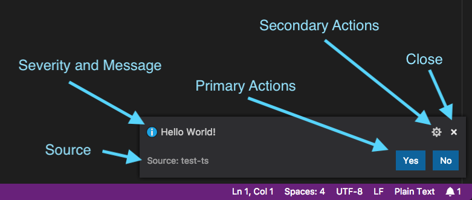

If a notification does not provide any source information or any action buttons, it will show only a severity and message. These types of notifications will hide automatically after a certain timeout.

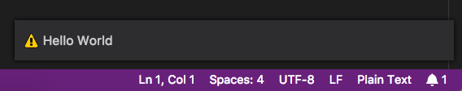

A new entry ("bell" icon) in the bottom right of the Status Bar indicates the number of new notifications. Once clicked, the Notification Center will open that shows all notifications that were not dismissed yet.

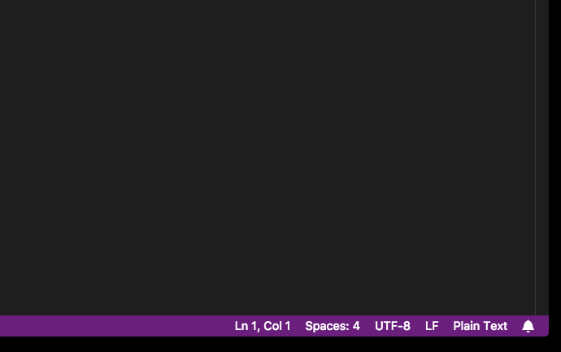

Each notification can be managed with new commands and configurable keybindings (see below in the [New Commands](#new-commands) section).

**Note for extension and theme authors:** With the new notification UI, we introduced new theming colors for theme authors to adopt (see below). There is also a soft deprecation of the `isCloseAffordance` attribute for extension authors which is no longer needed when showing these style of notifications.

### Centered editor layout

By popular request [#15684](https://github.com/Microsoft/vscode/issues/15684), we have added centered editor layout. This layout mode is designed to keep you deeply focused on your code by giving the editor most of the screen real estate.

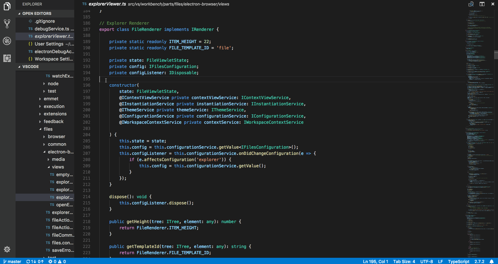

If you open another editor to the side, centered layout mode stops until there is only one editor group again. The left and right sash for resizing are coupled so the editor is always centered. Hold down the `Alt` key if you want to resize the sashes independently. Double click on a sash to bring them back to the default golden ratio size.

Zen mode will now automatically turn this mode on. Use the `"zenMode.centerLayout"` setting to control this behavior.

### Better drag and drop support

We revisited our support for drag and drop in the workbench and now support more drag and drop scenarios. Probably the most up-voted request was to drag files from one File Explorer to another VS Code instance:

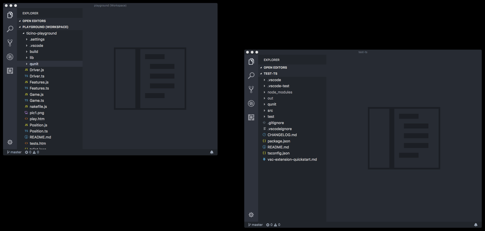

We now also support to drag and drop root folders in the File Explorer to rearrange their order as requested in issue [#29715](https://github.com/Microsoft/vscode/issues/29715).

Other improvements are to the **OPEN EDITORS** view. You can now:

* Drag files from the Explorer into a specific space of OPEN EDITORS.
* Drag files from the desktop into a specific space of OPEN EDITORS.
* Drag tabs into a specific space of OPEN EDITORS.

### Copy/Paste files across windows

We now allow you to copy and paste files between two VS Code File Explorers in different instances. This works for single or multi-selection of files as well as folders.

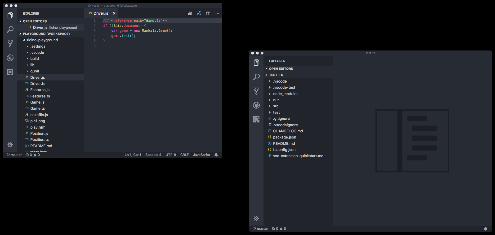

### Symbolic link indication in Explorer

We now indicate symbolic links in the File Explorer by an arrow decoration and additional hover text.

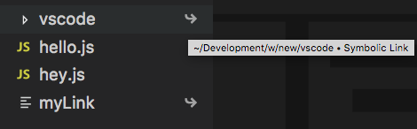

### Create multiple folders in the Explorer

When you create a path with subfolders, VS Code will create all the intermediate folders. This can also be used to create a new file:

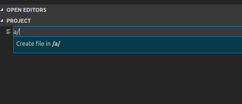

### NPM Script running

When running scripts in `package.json` files as [tasks](https://code.visualstudio.com/docs/editor/tasks#_task-autodetection) using **Terminal** > **Run Tasks**, scripts from `package.json` files in subfolders are now also detected. To exclude folders from script detection, use the `npm.exclude` setting.

## Editor

### Text buffer improvements

VS Code has been using a line based representation of the text buffer. It had a lot of advantages but there were also disadvantages, for example, large memory overhead when dealing with large files with many lines.

We introduced a new text buffer implementation in the Insider builds about two months ago. The new buffer implementation is inspired by the [piece table](https://en.wikipedia.org/wiki/Piece_table) data structure and is optimized for source code editing scenarios. It uses less memory to store document metadata making file opening easier and reduces the memory pressure on the operation system. Additionally, it has good editing performance for both small and large files.

The new text buffer performed well during the last two months of Insider testing so we are turning it on for all users in this milestone. It also gives us opportunities for further improvements, like searching in large files.

### Coloring of active line number

A new theme key `editorActiveLineNumber.foreground` can now be defined in themes or settings to customize the line number color of the current line in the editor.

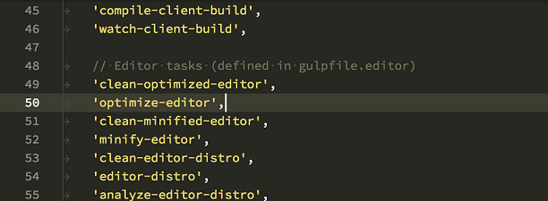

### Emmet

VS Code has had support for the `bem` and `comment` [filters](https://code.visualstudio.com/docs/editor/emmet#_using-filters) when expanding Emmet abbreviations, but never both at the same time until now.

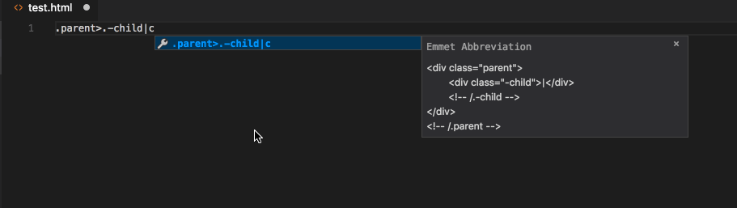

You can now get CSS Emmet completions in a style attribute in an HTML file when the completions are manually triggered via `kb(editor.action.triggerSuggest)`.

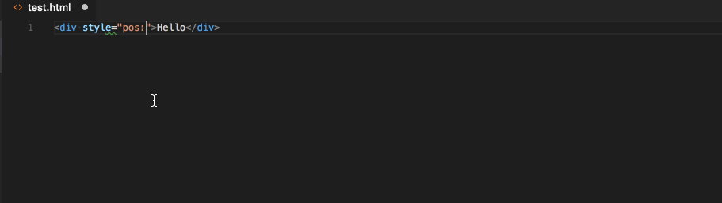

To get completions automatically without using the manual trigger, enable the quick suggestions feature for strings in HTML files by adding the following to your settings:

```json
"[html]": {
    "editor.quickSuggestions": {
        "other": true,
        "comments": false,
        "strings": true
    }
}
```

## Integrated Terminal

### Split terminals

The Integrated Terminal can now be split such that multiple are visible at once, which can enable much easier management of terminals when you need a watch and a run command for example:


Splitting can be done by clicking the split button in the panel, through the context menu or the command `kb(workbench.action.terminal.split)`.

Focus can be moved between split terminals using `kb(workbench.action.terminal.focusNextPane)` and `kb(workbench.action.terminal.focusPreviousPane)`. The active pane can be resized using the keyboard with:

* **Terminal: Resize Pane Down**: `kb(workbench.action.terminal.resizePaneDown)`
* **Terminal: Resize Pane Up**: `kb(workbench.action.terminal.resizePaneUp)`
* **Terminal: Resize Pane Left**: `kb(workbench.action.terminal.resizePaneLeft)`
* **Terminal: Resize Pane Right**: `kb(workbench.action.terminal.resizePaneRight)`

### Move cursor with Alt+Click

The cursor in the Integrated Terminal can now be moved with `Alt+Click`. This even works in applications like Vim or nano. Special thanks to [Nick Pezza](https://github.com/npezza93) for implementing the feature in the [xterm.js](https://github.com/xtermjs/xterm.js).

### Additional support for Alt sequences

Pressing `Alt+Shift+{key}` and `Alt+Ctrl+{key}` while the Integrated Terminal is focused now sends the keystrokes to be handled by the process running inside the terminal.

### Right click to select word

Right clicking in the Integrated Terminal will now select the word on macOS. This can be configured to work on other platforms by setting:

```js
"terminal.integrated.rightClickBehavior": "selectWord"
```

## Source Control

### Editor change navigation

Two new actions let you navigate between active changes in the current file:

* **Move to Next Change**: `kb(workbench.action.editor.nextChange)`
* **Move to Previous Change**: `kb(workbench.action.editor.previousChange)`

## Languages

### TypeScript 2.7.2

VS Code now includes TypeScript 2.7.2. This update includes a [few important bug fixes](https://github.com/Microsoft/TypeScript/milestone/63?closed=1).

### HTML path completion

Path completion has been added to make it easier to import various files in HTML.

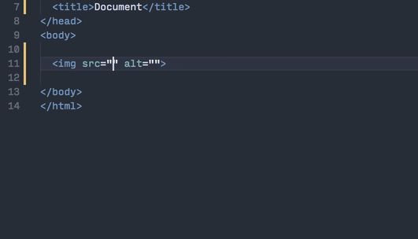

### Markdown preview bidirectional scroll synchronization

VS Code's Markdown previews now include bidirectional scroll synchronization. Scroll the editor and the corresponding preview automatically scrolls to match the editor's view. Scroll the preview, and the editor does the same.


You can enable or disable scroll synchronization using the  `"markdown.preview.scrollEditorWithPreview"` and `"markdown.preview.scrollPreviewWithEditor"` settings. The old `"markdown.preview.scrollPreviewWithEditorSelection"` setting is now deprecated.

### Markdown dynamic previews

VS Code's built-in Markdown preview now automatically changes to preview the active Markdown document. Previously, you had to open a new Markdown preview for every new Markdown file you opened.


If you'd like a dedicated preview pane for a specific Markdown file, you can "lock" the preview with the **Markdown: Toggle Preview Locking** command. The locked preview will not automatically switch to preview the active Markdown file. Locked previews are indicated by brackets in the title **[Preview]**.

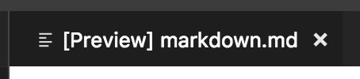

Markdown previews can be locked or unlocked using the **Markdown: Toggle Preview Locking** command. You can also open a locked preview of the current Markdown document using the **Markdown: Open Locked Preview to Side** command.

## Debugging

### Breakpoint icons in BREAKPOINTS view

To more easily distinguish between different breakpoints, we have added icons to the **BREAKPOINTS** view. The icons reflect the type and state of the breakpoint and are the same as in the editor glyph margin. Active breakpoints are red, disabled gray and unverified have a hollow structure. Conditional breakpoints have an equality sign, while function breakpoints are represented with a triangle.

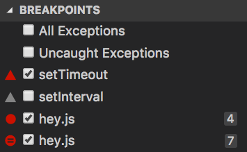

### Node debugging

**Node.js Version Switcher 'nvs' support**

Last milestone we've added support for the [Node Version Manager](https://github.com/creationix/nvm) ('nvm'). We now also support the [Node Version Switcher](https://github.com/jasongin/nvs) ('nvs'). Use the `runtimeVersion` attribute in a "node" launch configuration for selecting a specific version of Node.js.

**Note**: Make sure you have the Node.js version installed that you want to use with the `runtimeVersion` attribute as VS Code will not download and install the version automatically. For example, run something like `nvs add 7.10.1` from the Integrated Terminal if you plan to add `"runtimeVersion": "7.10.1"` to your launch configuration.

**Note**: If VS Code detects that 'nvs' is installed, it does **not** fall back to 'nvm' if a specific Node.js version cannot be found in 'nvs'. Using both 'nvs' and 'nvm' at the same time is not supported.

## Extensions

### Manage built-in extensions

With this release, you can now manage (disable/enable) the built-in extensions shipped with VS Code. There is an action **Show Built-in Extensions** in Extensions view that shows all built-in extensions and you can browse and manage them. The same action can be accessed via the **Command Palette** as well.

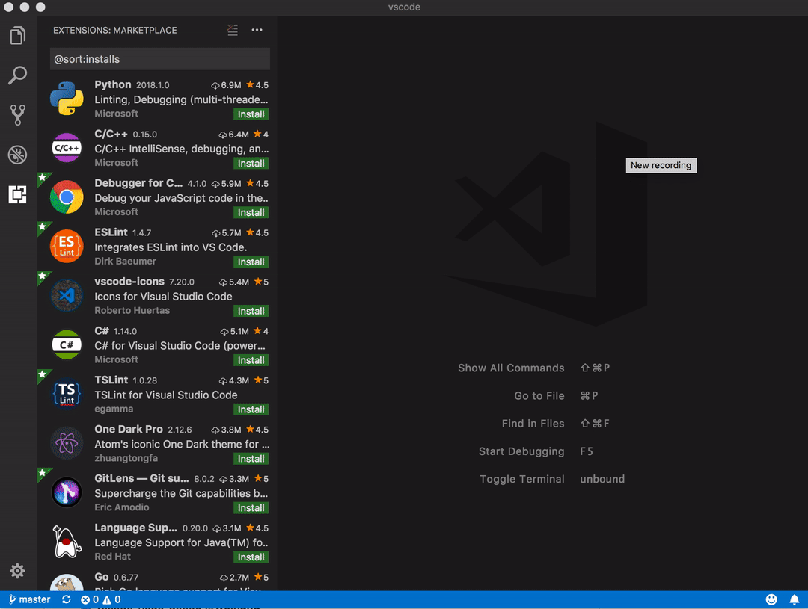

### Language Packs

In the 1.20 release, we added support for language packs and now the first language packs are available in the [Marketplace](https://marketplace.visualstudio.com/vscode).

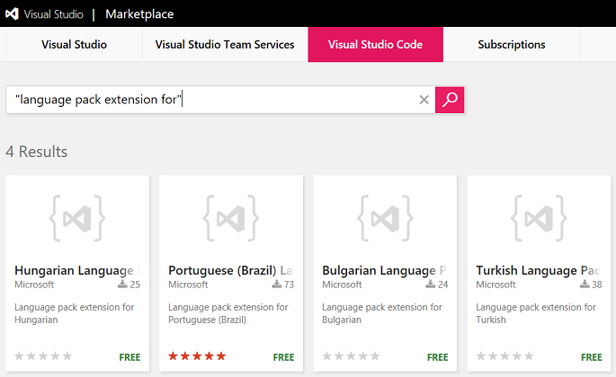

We will continue to work with the community to add more language packs.

### Extension Recommendations

You can now disable all extension recommendations by setting `"extensions.showRecommendationsOnlyOnDemand": true`. When this setting is enabled, you will still be able to see recommendations by using the **Show Recommended Extensions** command in Extensions view. The command can also be run via the **Command Palette**.

## Extension Authoring

### Add, remove and change workspace folders

The [previously proposed](https://code.visualstudio.com/updates/v1_20#_add-remove-and-change-workspace-folders) API for adding, removing and changing workspace folders has been promoted to Stable.

### Messages: `isCloseAffordance` no longer supported for non-modal messages

With the introduction of a new notification UI in this milestone, every notification message now provides a close button in the top-right corner. This change means that the close action is no longer mixed with other message actions and `isCloseAffordance` is no longer be needed for messages that are non-modal. Please look at your message usage and make sure that you are not adding an action to close the notification unless that action is doing something specific for your extension.

A message will still close automatically if any of the provided actions is clicked by the user.

### New theme colors and removal of old colors

With the new notifications UX, new colors were added that theme authors should adopt:

* `notificationCenter.border`: Notification Center border color.
* `notificationCenterHeader.foreground`: Notification Center header foreground color.
* `notificationCenterHeader.background`: Notification Center header background color.
* `notificationToast.border`: Notification toast border color.
* `notifications.foreground`: Notifications foreground color.
* `notifications.background`: Notifications background color.
* `notifications.border`: Notifications border color separating from other notifications in the Notification Center.
* `notificationLink.foreground`: Notification links foreground color.

All of the previously supported theme colors for notifications are no longer supported.

The border color of editor highlights can now also be freely chosen:

* `editor.selectionHighlightBorder`: Border color for regions with the same content as the selection.
* `editor.wordHighlightBorder`: Border color of a symbol during read-access, for example when reading a variable.
* `editor.wordHighlightStrongBorder`: Border color of a symbol during write-access, for example when writing to a variable.
* `editor.findMatchBorder`: Border color of the current search match.
* `editor.findMatchHighlightBorder`: Border color of the other search matches.
* `editor.findRangeHighlightBorder`: Border color the range limiting the search (Enable 'Find in Selection' in the find widget).
* `editor.rangeHighlightBorder`: Background color of the border around highlighted ranges.

These additional colors were also added

* `terminal.border`: The color of the border that separates split panes within the terminal. This defaults to panel.border.

### Custom views

**Themable item icons**

If you want your `TreeItem` to have a folder or file icon from the active File Icon theme, you can assign the `iconPath` property of `TreeIem` to the `ThemeIcon.Folder` or `ThemeIcon.File` constant.

**Tooltips**

You can provide a tooltip to an item in the view using the property `tooltip` in `TreeItem`.

### Extension uninstall hook

If your extension has some clean ups to be done when it is uninstalled from VS Code, you can now do that by registering a `node` script to the uninstall hook `vscode:uninstall` under `scripts` section in extension's `package.json`.

```json
{
  "scripts": {
    "vscode:uninstall": "node ./out/src/lifecycle"
  }
}
```

This script gets executed when the extension is completely uninstalled from VS Code which is when VS Code is restarted (shutdown and start) after the extension is uninstalled.

**Note:** Only Node.js scripts are supported.

### Active view context key

There's a new keybinding context key ('when' clause) available which uses the ID of the currently open view: `activeViewlet`. Example usage:

```json
  "when": "activeViewlet == workbench.view.scm"
```

### Debug Adapter Protocol

**New `CapabilitiesEvent`**

Sometimes it is difficult for a debug adapter to know and return all capabilities from the (very early) `Initialize` request because some might not be known until the runtime/debugger has started. The newly introduced `CapabilitiesEvent` can be used at a later time to announce that one or more capabilities have changed. Since the capabilities are dependent on the frontend and its UI, it might not be possible to change that at random times (or too late). Consequently, the `CapabilitiesEvent` has a hint characteristic: a frontend can only be expected to make a 'best effort' in honoring individual capabilities, but there are no guarantees.

### Language Server Protocol

Version 3.6.0 of the [protocol specification](https://microsoft.github.io/language-server-protocol/specification) is released. The version specifies the following new requests and notifications:

* [Get Workspace Folders](https://microsoft.github.io/language-server-protocol/specification#workspace_workspaceFolders)
* [DidChangeWorkspaceFolders Notification](https://microsoft.github.io/language-server-protocol/specification#workspace_didChangeWorkspaceFolders)
* [Get Configuration](https://microsoft.github.io/language-server-protocol/specification#workspace_configuration)
* [Goto Type Definition](https://microsoft.github.io/language-server-protocol/specification#textDocument_typeDefinition)
* [Goto Implementation](https://microsoft.github.io/language-server-protocol/specification#textDocument_implementation)
* [Document Color](https://microsoft.github.io/language-server-protocol/specification#textDocument_documentColor)
* [Color Presentation](https://microsoft.github.io/language-server-protocol/specification#textDocument_colorPresentation)

## Engineering

### Faster VS Code start-up by using asar

We are now packaging the core `node_modules` into an Electron Archive ([asar](https://github.com/electron/asar)) for faster start-ups by up to 5%. The file count on disk for a VS Code installation also gets reduced by approximately 25%.

### Duplicate issue detection

The issue bot and the Issue Reporter UI run the new issue through duplicate detection and suggest candidates of existing issues.


### Issue bot configuration by development phase

The issue bot changes its configuration depending on the current development phase (development, release, etc.). The change between development phases is set up ahead of time in the vscode repository at `.github/calendar.yml` ([example](https://github.com/Microsoft/vscode/blob/master/.github/calendar.yml)).

## Proposed Extension APIs

This milestone we added several new proposed extension APIs. We plan to add these APIs to stable in a future milestone once we are confident enough with them. We welcome any feedback on how they work for your extension.

> **Note:** These APIs are still proposed, so in order to use it, you must opt into it by adding a `"enableProposedApi": true` to `package.json` and you'll have to copy the [`vscode.proposed.d.ts`](https://github.com/Microsoft/vscode/blob/master/src/vs/vscode.proposed.d.ts) into your extension project. Also be aware that you cannot publish an extension to the Marketplace that uses the `enableProposedApi` attribute.

### Folding

New proposed API has been added to support language aware folding:

```ts
export namespace languages {

    /**
     * Register a folding provider.
     *
     * @param selector A selector that defines the documents this provider is applicable to.
     * @param provider A folding provider.
     * @return A [disposable](#Disposable) that unregisters this provider when being disposed.
     */
    export function registerFoldingProvider(selector: DocumentSelector, provider: FoldingProvider): Disposable;
```

This is still work in progress, but feedback is welcome.

### Editor Visible Ranges

New proposed API has been added to support reading an editor's visible ranges:

```ts
export interface TextEditor {
    /**
     * The current visible ranges in the editor (vertically).
     * This accounts only for vertical scrolling, and not for horizontal scrolling.
     */
    readonly visibleRanges: Range[];
}

export namespace window {
    /**
     * An [event](#Event) which fires when the selection in an editor has changed.
     */
    export const onDidChangeTextEditorVisibleRanges: Event<TextEditorVisibleRangesChangeEvent>;
}
```

### Custom views: Reveal

A new proposed API was added to reveal and select an item in the view. You can access this API from `TreeView` object that is returned when you register the `TreeDataProvider`.

```typescript
const customView = vscode.window.registerTreeDataProvider<string>('customView', new CustomViewDataProvider<string>());
customView.reveal('element');
```

By default the item to be revealed is selected. In order to not to select, set the option `select` to `false`. For example:

```js
  customView.reveal('element', {select: false});
```

More examples are [here](https://github.com/Microsoft/vscode-extension-samples/blob/master/tree-view-sample/src/ftpExplorer.fileSystemProvider.ts#L2).

**Note:** To access this API, the registered `TreeDataProvider` is required to implement the `getParent` method .

### Webview API

The new webview API proposal seeks to make it easier to create and manage webviews. It supersedes the `TextDocumentContentProvider` and `vscode.previewHtml` command approach currently supported. We're still working hard on this API and would love your feedback or suggestions.

The new webview API focuses on three areas:

* Make webviews first class.
* Enable persistence.
* Improve security.

**First class**

A `webview` is an editor that renders HTML content. It is conceptually similar to an iframe. You create a new webview using `createWebview`:

```ts
const webview = vscode.window.createWebview(
  vscode.Uri.parse('cat-counter-ext:webview1'), // Identifier
  'Cat Counter', // Title
  vscode.ViewColumn.One, // Column to show in
  {} // Webview options
);
```

This creates and shows the new webview in the given editor group. Set the contents of the webview using the `html` property:

```ts
webview.html = `<!DOCTYPE html>
<html lang="en">
<head>
    <meta charset="UTF-8">
</head>
<body>
    
</body>
</html>
`;
```

Passing messages between a webview and your extension is now also much simpler. To post a message to a webview, call `postMessage` in your extension:

```ts
webview.postMessage({
  type: 'change-cats',
  requestedBreed: 'siberian'
});
```

And add a `message` handler inside the webview itself:

```js
window.addEventListener('message', event => {
  switch (event.data.type) {
    case 'change-cats':
      doChangeCats(event.data.requestedBreed);
      break;
  }
});
```

To post a message from a webview to your extension, call `window.parent.postMessage` inside the webview:

```js
window.parent.postMessage({
  type: 'did-update-count',
  count: 9
}, '*');
```

And add a `onDidReceiveMessage` event handler on the webview object in your extension:

```ts
webview.onDidReceiveMessage(e => {
  switch (e.type) {
    case 'did-update-count':
      this.handleUpdateCatCount(e.count);
      break;
  }
}, null, disposables)
```

**Persistence**

By default, a webview's context is destroyed when it is no longer visible, such as when moved to a background tab. The context is automatically recreated once the webview is shown again. If your extension's webview content cannot be quickly persisted and recreated, you can set the `retainContextWhenHidden` option. This preserves the webview's context, even when the webview editor is in the background. This option should only be used when absolutely necessary as webviews have a high memory overhead.

Also, unlike the existing HTML previews, webviews do not reload when they are moved between editor groups.

**Improved security**

Webviews are also more secure than old HTML previews. By default, webviews do not allow scripts or command URIs, which can help protect your extension's users from content injection attacks. You can enable scripts by setting `enableScripts` and `enableCommandUris` in the `WebviewOptions` when the webview is created.

Also, webviews now run in their own origin so they can no longer access `file:` resources directly. To load an extension resource, the webview must use the new `vscode-extension-resource:` URI scheme:

```html
<link rel="stylesheet" type="text/css" href="vscode-extension-resource:/Users/alice/.vscode-insiders/extensions/bierner.cat-counter-0.1.0/base.css">
```

To load a resource from the user's workspace, use the `vscode-workspace-resource:` scheme:

```html

```

## Preview Features

Preview features are not ready for release but are functional enough to use. We welcome your early feedback while they are under development.

### Horizontal search

This milestone we have added a configuration, `"search.location"`, to control the position of the Search view. To have more horizontal search results space, set `"search.location": "panel"`.

This feature is currently in preview since we plan to further improve the layout within the Search view to take advantage of the additional horizontal space. The work planned is captured in this [issue](https://github.com/Microsoft/vscode/issues/45063) so feel free to provide feedback in the issue directly.

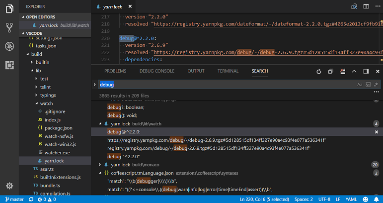

## New Documentation

### Node.js deployment tutorials for Azure Functions

We have a new [Deploy to Azure using Azure Functions](https://code.visualstudio.com/tutorials/functions-extension/getting-started?utm_source=VsCode&utm_medium=ReleaseNotes) tutorial for creating and deploying serverless [Azure Functions](https://azure.microsoft.com/en-us/services/functions/) using the [Azure Functions extension](https://marketplace.visualstudio.com/items?itemName=ms-azuretools.vscode-azurefunctions).

### Refactoring topic

We added a dedicated [Refactoring](https://code.visualstudio.com/docs/editor/refactoring) topic describing VS Code's support for refactorings such as **Extract Method**, **Extract Variable**, and **Rename Symbol**.

## New Commands

Key|Command|Command id
---|-------|----------
`kb(notifications.showList)`|Show the Notification Center|`notifications.showList`
`kb(notifications.hideList)`|Hide the Notification Center|`notifications.hideList`
`kb(notifications.toggleList)`|Toggle the visibility of the Notification Center|`notifications.toggleList`
`kb(notifications.hideToasts)`|Hide notification toasts|`notifications.hideToasts`
`kb(notifications.focusToasts)`|Focus first notification toast|`notifications.focusToasts`
`kb(notifications.focusNextToast)`|Focus next notification toast|`notifications.focusNextToast`
`kb(notifications.focusPreviousToast)`|Focus previous notification toast|`notifications.focusPreviousToast`
`kb(notifications.focusFirstToast)`|Focus first notification toast|`notifications.focusFirstToast`
`kb(notifications.focusLastToast)`|Focus last notification toast|`notifications.focusLastToast`
`kb(notification.collapse)`|Collapse notification if possible|`notification.collapse`
`kb(notification.expand)`|Expand notification if possible|`notification.expand`
`kb(notification.toggle)`|Toggle expansion state of notification if possible|`notification.toggle`
`kb(notification.clear)`|Clear notification|`notification.clear`
`kb(notifications.clearAll)`|Clear all notifications|`notifications.clearAll`
Integrated Terminal||
`kb(workbench.action.terminal.split)`|Split Terminal|`workbench.action.terminal.split`
`kb(workbench.action.terminal.focusNextPane)`|Focus Next Pane| `workbench.action.terminal.focusNextPane`
`kb(workbench.action.terminal.focusPreviousPane)`|Focus Previous Pane| `workbench.action.terminal.focusPreviousPane`
`kb(workbench.action.terminal.resizePaneDown)`|Resize Pane Down| `workbench.action.terminal.resizePaneDown)`
`kb(workbench.action.terminal.resizePaneUp)`|Resize Pane Up|`workbench.action.terminal.resizePaneUp`
`kb(workbench.action.terminal.resizePaneLeft)`|Resize Pane Left|`workbench.action.terminal.resizePaneLeft`
`kb(workbench.action.terminal.resizePaneRight)`|Resize Pane Right|`workbench.action.terminal.resizePaneRight`
Extensions||
`kb(workbench.extensions.action.reinstall)`|Reinstall Extension|`workbench.extensions.action.reinstall`
`kb(workbench.action.reloadWindowWithExtensionsDisabled)`|Reload with Extensions Disabled|`workbench.action.reloadWindowWithExtensionsDisabled`

With the new notification commands, there are also new contexts for keybindings:

* `notificationFocus`: when a notification has keyboard focus (either as toast or in the Notification Center)
* `notificationCenterVisible`: when the Notification Center is visible
* `notificationToastsVisible`: when a notification toast is visible

Note that notification toasts are never displayed when the notification Center is visible.

## Notable Changes

* [44036](https://github.com/Microsoft/vscode/issues/44036): Missing file events when entering multi-folder workspace
* [42621](https://github.com/Microsoft/vscode/issues/42621): Tree: allow to expand with single click when clicking on twistie
* [42714](https://github.com/Microsoft/vscode/issues/42714): Allow middle mouse click to open an entry in the background
* [42557](https://github.com/Microsoft/vscode/issues/42557): Open in terminal explorer context menu action is now respecting multi selection
* [43319](https://github.com/Microsoft/vscode/issues/43319): "listMultiSelection" when clause to determine multi select in lists
* [44136](https://github.com/Microsoft/vscode/issues/44136): Windows: alternative context menu commands also get triggered when holding the shift key
* [44656](https://github.com/Microsoft/vscode/issues/44656): `"launch"` section is now typed in user settings
* [42770](https://github.com/Microsoft/vscode/issues/42770): Always show list of views on right click on view header
* [22717](https://github.com/Microsoft/vscode/issues/22717): Moving text cursor cause an incorrect position in Chinese
* [22832](https://github.com/Microsoft/vscode/issues/22832): Consider fullwidth characters when rendering tabs

## Thank You

Last but certainly not least, a big *__Thank You!__* to the following folks that helped to make VS Code even better:

Contributions to `vscode`:

* [Aldo Donetti (@aldonetti)](https://github.com/aldonetti)
  * typo [PR #42809](https://github.com/Microsoft/vscode/pull/42809)
  * proper casing [PR #44189](https://github.com/Microsoft/vscode/pull/44189)
  * typos corrected [PR #42804](https://github.com/Microsoft/vscode/pull/42804)
* [Aleksi Juvani (@aleksijuvani)](https://github.com/aleksijuvani):  Use C++ for '.ipp' file extension [PR #43943](https://github.com/Microsoft/vscode/pull/43943)
* [Mikhail Bodrov (@Connormiha)](https://github.com/Connormiha):  Remove needless check for array in ContextKeyChangeEvent [PR #42914](https://github.com/Microsoft/vscode/pull/42914)
* [Darius Keeley (@Dari-K)](https://github.com/Dari-K):  Fade out tabs when sizing is set to shrink (fix #39417) [PR #39829](https://github.com/Microsoft/vscode/pull/39829)
* [Sylvain Joyeux (@doudou)](https://github.com/doudou):  allow for problem patterns without a line [PR #39936](https://github.com/Microsoft/vscode/pull/39936)
* [Ergün Erdoğmuş (@ergun1017)](https://github.com/ergun1017)
  * Adresses #27393 - Added margin-left: -1px to remove effect of the left border [PR #43443](https://github.com/Microsoft/vscode/pull/43443)
  * Fixes #19580; added copy property path action to debug viewlet [PR #43423](https://github.com/Microsoft/vscode/pull/43423)
* [Geoffrey Gilmore (@ggilmore)](https://github.com/ggilmore):  pass --no-use flag when sourcing nvm in build script  [PR #41479](https://github.com/Microsoft/vscode/pull/41479)
* [Greggman (@greggman)](https://github.com/greggman):  Remove magic number [PR #42871](https://github.com/Microsoft/vscode/pull/42871)
* [Matt Q (@irrationalRock)](https://github.com/irrationalRock):  fixed #38232 [PR #43950](https://github.com/Microsoft/vscode/pull/43950)
* [Itamar (@itamark)](https://github.com/itamark):  Renaming Close Unmodified to Close Unsaved [PR #44269](https://github.com/Microsoft/vscode/pull/44269)
* [Jackson Kearl (@JacksonKearl)](https://github.com/JacksonKearl):  Add option for always visible action buttons in side panels.  [PR #41414](https://github.com/Microsoft/vscode/pull/41414)
* [Joe Berria (@nexes)](https://github.com/nexes):  fix issue #40848 show extension tab if extension has previously been … [PR #42071](https://github.com/Microsoft/vscode/pull/42071)
* [Giannis Ntovas (@ntovas)](https://github.com/ntovas):  Keep item expanded after rename [PR #44362](https://github.com/Microsoft/vscode/pull/44362)
* [@peidaqi](https://github.com/peidaqi):  Making the script work with both Python2 and 3 [PR #43387](https://github.com/Microsoft/vscode/pull/43387)
* [Dániel Tar (@qcz)](https://github.com/qcz)
  * Remove extra 'preview' from a message in markdown/package.nls.json [PR #44705](https://github.com/Microsoft/vscode/pull/44705)
  * Stylistic and grammar fixes in Emmet messages [PR #42893](https://github.com/Microsoft/vscode/pull/42893)
* [Ray Gervais (@raygervais)](https://github.com/raygervais)
  * Monokai: Use new  dropdown.listBackground to correct contrast Fixes: #42480 [PR #42869](https://github.com/Microsoft/vscode/pull/42869)
  * Dropdown: Restore original selection on escape exit Fixes: #42487 [PR #43152](https://github.com/Microsoft/vscode/pull/43152)
* [Remy Suen (@rcjsuen)](https://github.com/rcjsuen):  Update typings in model.ts to allow nulls [PR #44353](https://github.com/Microsoft/vscode/pull/44353)
* [Shobhit Chittora (@shobhitchittora)](https://github.com/shobhitchittora):  workbench: Adds 'Show Code Version' Action [PR #40745](https://github.com/Microsoft/vscode/pull/40745)
* [Sriram (@sriram-dev)](https://github.com/sriram-dev):  #42557 fix - make open in command multiselect aware  [PR #43552](https://github.com/Microsoft/vscode/pull/43552)
* [Tobias Kahlert (@SrTobi)](https://github.com/SrTobi)
  * Setting to center the layout when turning on the zen mode [PR #44116](https://github.com/Microsoft/vscode/pull/44116)
  * added Center Mode (#15684) [PR #40757](https://github.com/Microsoft/vscode/pull/40757)
* [Alexander (@usernamehw)](https://github.com/usernamehw)
  * Allow middle mouse click to open file entry in the background [PR #42769](https://github.com/Microsoft/vscode/pull/42769)
  * Support theming of active line number [PR #42301](https://github.com/Microsoft/vscode/pull/42301)
  * Make diff gutter decorators width configurable [PR #43334](https://github.com/Microsoft/vscode/pull/43334)
* [Julien Roncaglia (@vbfox)](https://github.com/vbfox):  Allow extensions to specify custom tree view resoure type [PR #43261](https://github.com/Microsoft/vscode/pull/43261)
* [Yoshiharu Hirose (@yh1224)](https://github.com/yh1224):  Treat full-width character as two visible columns. [PR #44259](https://github.com/Microsoft/vscode/pull/44259)

Contributions to `vscode-eslint`:

* [Jacinto Ramirez Lahti (@jackrl)](https://github.com/jackrl): Create a task provider for linting the whole workspace [PR #410](https://github.com/Microsoft/vscode-eslint/pull/410)

Contributions to `language-server-protocol`:

* [Nate Bosch (@natebosch)](https://github.com/natebosch): Fix typos in `SymbolInformation` documentation [PR #388](https://github.com/Microsoft/language-server-protocol/pull/388)
* [Filipe Correia (@laginha87)](https://github.com/laginha87): Fix typo [PR #391](https://github.com/Microsoft/language-server-protocol/pull/391)
* [Martin Björkström (@mholo65)](https://github.com/mholo65): Fix code block formatting [PR #393](https://github.com/Microsoft/language-server-protocol/pull/393)
* [Remy Suen (@rcjsuen)](https://github.com/rcjsuen): Add a new CompletionTriggerKind.TriggerForIncompleteCompletions for re-triggers [PR #403](https://github.com/Microsoft/language-server-protocol/pull/403)
* [Lars Hvam (@larshp)](https://github.com/larshp): readme: fix broken link [PR #406](https://github.com/Microsoft/language-server-protocol/pull/406)
* [Remy Willems (@keyboardDrummer)](https://github.com/keyboardDrummer): Make the description of textDocument/didOpen less ambiguous [PR #408](https://github.com/Microsoft/language-server-protocol/pull/408)

Contributions to `vscode-languageserver-node`:

* [Remy Suen (@rcjsuen)](https://github.com/rcjsuen): Client does not declare that clientCapabilities.workspace.workspaceEdit.documentChanges is supported [PR #307](https://github.com/Microsoft/vscode-languageserver-node/pull/307)

Contributions to `vscode-node-debug`:

* [Alessandro Vergani (@loghorn)](https://github.com/loghorn): Add nvs support [PR #171](https://github.com/Microsoft/vscode-node-debug/pull/171)

Contributions to `vscode-node-debug2`:

* [@digeff](https://github.com/digeff): Added new integration test [PR #601](https://github.com/Microsoft/vscode-chrome-debug/pull/601)
* [Raghav Katyal (@rakatyal)](https://github.com/rakatyal): Changing overlay text based on clients [PR #599](https://github.com/Microsoft/vscode-chrome-debug/pull/599)

Contributions to `vscode-chrome-debug-core`:

* [Chance An (@changsi-an)](https://github.com/changsi-an)
  * Fallback to empty string if object.description is undefined. [PR #280](https://github.com/Microsoft/vscode-chrome-debug-core/pull/280)
  * Allow child-class to customize the creation of IVariableContainer . [PR #279](https://github.com/Microsoft/vscode-chrome-debug-core/pull/279)
* [@digeff](https://github.com/digeff)
  * Add an attach option to launch.json [PR #284](https://github.com/Microsoft/vscode-chrome-debug-core/pull/284)
  * Fix using deleted handles [PR #283](https://github.com/Microsoft/vscode-chrome-debug-core/pull/283)
  * Fix breakpoint not hitting in refresh because it's being set on a negative line [PR #282](https://github.com/Microsoft/vscode-chrome-debug-core/pull/282)
  * Now we send telemetry for each client request [PR #281](https://github.com/Microsoft/vscode-chrome-debug-core/pull/281)
  * Make sure to return 1 response for each breakpoint [PR #277](https://github.com/Microsoft/vscode-chrome-debug-core/pull/277)
  * Fix some breakpoints not hitting [PR #276](https://github.com/Microsoft/vscode-chrome-debug-core/pull/276)
  * Block while parsing scripts to prevent sending 'removes' before 'adds' [PR #274](https://github.com/Microsoft/vscode-chrome-debug-core/pull/274)

Contributions to `vscode-css-languageservice`:

* [Alexander (@usernamehw)](https://github.com/usernamehw):  Move cursor inside parenthesis for function-like values [PR #67](https://github.com/Microsoft/vscode-css-languageservice/pull/67)

Contributions to `vscode-generator-code`:

* [Mulia Nasution (@mul14)](https://github.com/mul14):  Change OSX to macOS [PR #107](https://github.com/Microsoft/vscode-generator-code/pull/107)
* [Max Schmitt (@mxschmitt)](https://github.com/mxschmitt)  Added file path space trimming [PR #97](https://github.com/Microsoft/vscode-generator-code/pull/97)
* [Stefan Janssen (@StefanJanssen95)](https://github.com/StefanJanssen95):  Add missing package to dependencies [PR #103](https://github.com/Microsoft/vscode-generator-code/pull/103)

Contributions to `localization`:

This is the eleventh month since we opened community localization in Transifex. We now have over 700 members in the Transifex [VS Code project](https://aka.ms/vscodeloc) team. We appreciate your contributions, either by providing new translations, voting on translations, or suggesting process improvements.

Here is a snapshot of top contributors for this release. For details about the project including the contributor name list, visit the project site at [https://aka.ms/vscodeloc](https://aka.ms/vscodeloc).

* **French:** Antoine Griffard, Adrien Clerbois, Thierry DEMAN-BARCELO, Jean-Paul Rouzé, Gabriel Dugny, Maxime COQUEREL.
* **Italian:** Alessandro Alpi, Riccardo Cappello, Simone Chiaretta, Francesco Mugnai, Steve Roger.
* **German:** Carsten Siemens, Dejan Dinic, Arne Lehmann.
* **Spanish:** Alberto Poblacion, Andy Gonzalez, Eickhel Mendoza, Jorge Serrano Pérez, Marcos de Lafuente, José M. Aguilar, Gabriel Peralta.
* **Japanese:** Shunya Tajima, Yuichi Nukiyama, Takayoshi Tanaka, Seiji Momoto, Yuki Ueda, Toshinori Sugita, yoshioms.
* **Chinese (Simplified):** Joel Yang, Simon Chan, Shawn Dai, Bingxing Wang, pluwen, Jason Zhang.
* **Chinese (Traditional):** Winnie Lin, Duran Hsieh, Ryan Tseng, Alan Tsai, Kuo-Chen Lien, Suki Huang.
* **Korean:** Ian Y. Choi, Sei Kwang Chung, ChangJoon Lee.
* **Russian:** Pavel Birukou, Ivan.
* **Bulgarian:** Любомир Василев.
* **Hungarian:** Tar Dániel.
* **Portuguese (Brazil):** Danilo Dantas, Roberto Fonseca, Rodrigo Crespi, Lucas Miranda, Frederico Oliveira.
* **Portuguese (Portugal):** Diogo Barros, António Lourenço, Tiago Soares, João Mata, Gustavo Silva.
* **Turkish:** Adem Coşkuner, Tuğrul Kaşıkcı, Volkan Nazmi Metin, Mustafa Turhan, Selim Ata.
* **Bosnian:** Ismar Bašanović, Bahrudin Hrnjica, Almir Vuk.
* **Czechia:** Vít Staniček, m_fr.
* **Dutch:** Marco van den Hout, Bram Lemenu, Maarten van Stam, Gerald Versluis, Christiaan Nieuwlaat, Jeroen Hermans, Geert van der Cruijsen, Patrick Kalkman, Maurits Kammer.
* **Finnish:** Feetu Nyrhinen, Make, Igetin.
* **Indonesian:** Najih Azkalhaq, G-RiNe Project, Joseph Aditya P G, Wildan Mubarok, Febrian Ramadhana, Riwut Libinuko, hilman firdaus.
* **Latvian:** Elina Dimante, Simone Chiaretta, Pēteris Kļaviņš, kozete.
* **Lithuanian:** Martynas Jusys.
* **Polish:** Mateusz Wyczawski, KarbonKitty, Wojciech Maj, Sölve Svartskogen, Adam Borowski, Patryk Adamczyk, Artur Mizera, Adrian Widerski, Patryk Zawadzki, Igor Śpiączka.
* **Romanian:** Bogdan Mateescu, Schiriac Robert.
* **Serbian:** Марко М. Костић, Nikola Radovanović, Pavle Rohalj.
* **Swedish:** A. Regnander, Joakim Olsson.
* **Tamil:** Karunakaran Samayan, rajakvk.
* **Thai:** Sirisak Lueangsaksri.
* **Ukrainian:** Volodymyr Holovka.
* **Vietnamese:** Vinh Pham, Vuong, Hung Nguyen, Brian Nguyen, Thanh Phu.

<!-- In-product release notes styles.  Do not modify without also modifying regex in gulpfile.common.js -->
<a id="scroll-to-top" role="button" aria-label="scroll to top" href="#"><span class="icon"></span></a>
<link rel="stylesheet" type="text/css" href="css/inproduct_releasenotes.css"/>
