# March 2018 (version 1.22)

**Update 1.22.2**: The update addresses these [issues](https://github.com/Microsoft/vscode/milestone/68?closed=1).

Downloads: [Windows](https://vscode-update.azurewebsites.net/1.22.2/win32-x64/stable) | [Mac](https://vscode-update.azurewebsites.net/1.22.2/darwin/stable) | Linux 64-bit: [.tar.gz](https://vscode-update.azurewebsites.net/1.22.2/linux-x64/stable) [.deb](https://vscode-update.azurewebsites.net/1.22.2/linux-deb-x64/stable) [.rpm](https://vscode-update.azurewebsites.net/1.22.2/linux-rpm-x64/stable) | Linux 32-bit: [.tar.gz](https://vscode-update.azurewebsites.net/1.22.2/linux-ia32/stable) [.deb](https://vscode-update.azurewebsites.net/1.22.2/linux-deb-ia32/stable) [.rpm](https://vscode-update.azurewebsites.net/1.22.2/linux-rpm-ia32/stable)

---

Welcome to the March 2018 release of Visual Studio Code. There are a number of significant updates in this version that we hope you will like, some of the key highlights include:

* **[Syntax aware code folding](#syntax-aware-folding)** - Adds improved folding for CSS, HTML, JSON, and Markdown files.
* **[Cross file error, warning and reference navigation](#error-and-reference-navigation-across-files)** - Move quickly around your workspace.
* **[New Hint suggestions](#hints-in-the-editor)** - Makes it easy to spot suggested fixes or refactorings in the editor.
* **[Convert to ES6 refactoring](#suggestion-code-actions-for-javascript-and-typescript)** - New Code Actions to convert to ES6 classes and modules.
* **[Auto attach to process](#node-debugging)** - Automatically attach the debugger to running Node.js processes.
* **[Logpoints](#logpoints)** - Inject logging without changing source code or restarting your debug session.
* **[Better large file support](#easier-way-to-open-large-files)** - Faster syntax highlighting and easily increase memory for very large files.
* **[Multiline links in the terminal](#better-support-for-multiline-links)** - Paths and URLs can span lines in the Integrated Terminal.
* **[Emmet wrap preview](#emmet)** - Live preview for Emmet's wrap with abbreviation functionality.
* **[Improved updates on Windows](#automatic-background-updates-on-windows)** - Automatically updates in the background for less downtime.
* **[Preview: Organize JS/TS imports](#organize-imports-for-javascript-and-typescript)** - Remove unused and sort remaining imports.

>If you'd like to read these release notes online, go to [Updates](https://code.visualstudio.com/updates) on [code.visualstudio.com](https://code.visualstudio.com).<br>
>You can also check out this 1.22 release [highlights video](https://youtu.be/PG2KFAGDxNc) from Cloud Developer Advocate [Brian Clark](https://twitter.com/_clarkio).

The release notes are arranged in the following sections related to VS Code focus areas. Here are some further updates:

* **[Editor](#editor)** - Emmet performance and smart matching improvements, new snippet Date variables.
* **[Workbench](#workbench)** - Smoother scrolling on Windows, automatic save during Search and Replace.
* **[Debugging](#debugging)** - Improved Node.js process picker, postDebugTask in launch.json.
* **[Tasks](#tasks)** - Better command and argument quoting and escaping support.
* **[Languages](#languages)** - Easier IntelliSense in JSDoc, CSS path completion.
* **[Extension Authoring](#extension-authoring)** - Long running operations with cancellation, add related information to diagnostics.

**Insiders:** Want to see new features as soon as possible? You can download the nightly [Insiders](https://code.visualstudio.com/insiders) build and try the latest updates as soon as they are available.

## Editor

### Syntax aware folding

Folding ranges in HTML, JSON, Markdown, CSS, LESS and SCSS are now, by default, computed based on the language's syntax and no longer rely on well-formed indentation.

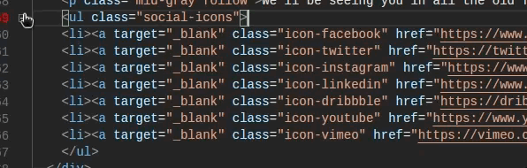

Support for TypeScript and JavaScript is also available, and can be enabled by the setting `"typescript.experimental.syntaxFolding": true`.

If you prefer to switch back to indentation based folding for one (or all) of the languages above, use:

```json
  "[html]": {
    "editor.foldingStrategy": "indentation"
  },
```

> **Tip**: See how this feature is used for [collapsing header regions in Markdown files](#fold-markdown-by-heading-level).

A new API for extensions is [proposed](#folding-provider-api) so that also other languages can provide their syntax aware folding providers.

### Error and reference navigation across files

With this release, navigating errors and warnings via `kb(editor.action.marker.nextInFiles)` (**Go to Next Problem**) takes all reported errors into account. Instead of looping inside just one file, it will take you to the next file with errors and back.

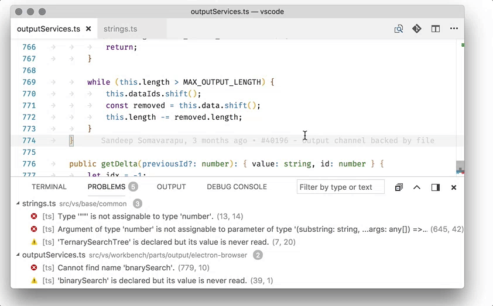

Similarly, there is a new command to navigate to reference search results. Trigger **Find All References** on a symbol and now use `kb(goToNextReference)` and `kb(goToPreviousReference)` to visit each reference. This is great to make edits in all places that reference a symbol because your fingers don't need to leave the keyboard.

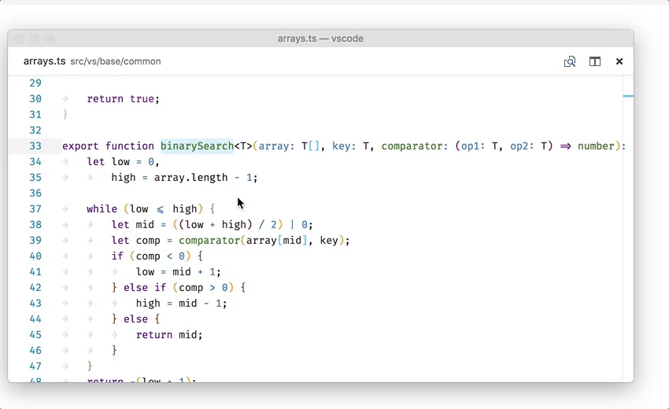

### Hints in the editor

The extension API now supports creating 'Hint' diagnostics. They aren't errors or warnings but suggestions how something could be made better, for example, by running a certain refactoring.

We render hint diagnostics with an ellipsis `...` under the start of the word in question.

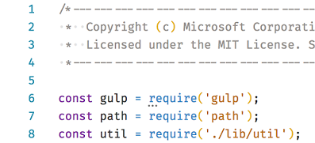

It is a good practice for extension authors to always include a hint with a Code Action as hint diagnostics can help advertise the Code Actions. However, some users might not want to display hints in the editor so also include support for disabling them.

> **Tip**: In this release, we have added several hints for JavaScript/TypeScript [refactorings](#suggestion-code-actions-for-javascript-and-typescript).

### Related information in errors and warnings

The extension API now supports adding [related information](#support-related-diagnostics-information) to diagnostics and this is shown in all places where diagnostics are shown: on hover, the error Peek window, and **Problems Panel**.

In the example below, you can see related information pointing out the first location where a twice assigned variable was used:

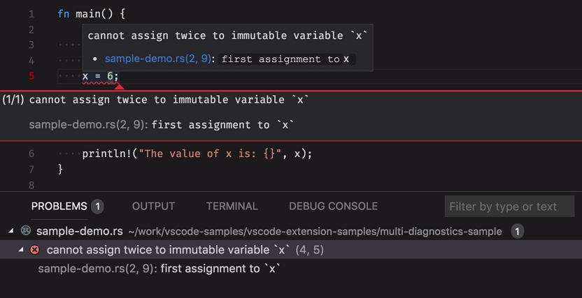

### Easier way to open large files

Previously, opening large files (~2GB+) in the editor would prompt you to relaunch from the command line with the flag `--max-memory=NEWSIZE`. To reduce this friction, when you try to open a file which requires more memory than the application is currently allowed to use, a new notification will appear that lets you quickly relaunch with more memory available to the application. The maximum memory available after relaunch is configurable with a new setting `files.maxMemoryForLargeFilesMB` and defaults to `4096` (4GB).

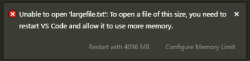

### Syntax highlighting optimization

With this release, we will do syntax highlighting for the viewport immediately after a file is opened, based on the scope of the content in the viewport. This results in much faster colorization as you can see below when the user opens a new file with the **Go to Definition** command.

**Left**: VS Code 1.21 **Right**: VS Code 1.22

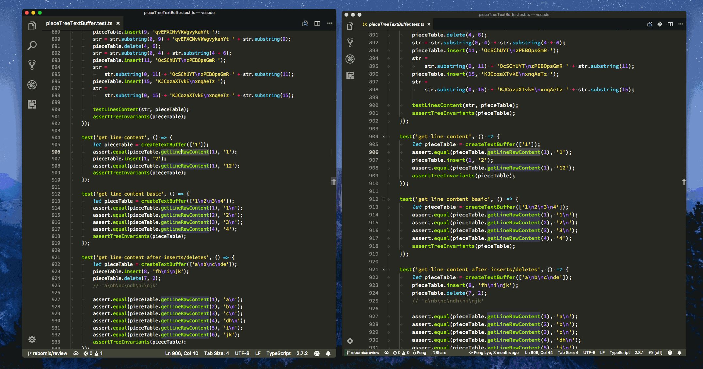

### Find and Replace improvements for large files

We shipped a new text buffer implementation in last release (read our [blog post](https://code.visualstudio.com/blogs/2018/03/23/text-buffer-reimplementation) for more information), and we continued the optimization for Find and Replace for large files.

### Configurable Format On Save timeout

VS Code can run formatters just before saving a file to disk and so speed matters because a slow extension could slow down saving. For that reason, VS Code is very strict about saving and cancels a format-on-save-request after 750ms. For some extensions, especially when dealing with large files, that's not enough time, and so we have added a new setting `"editor.formatOnSaveTimeout"` to configure the timeout. If a language extension knows that it will need more time for formatting, it can modify the timeout as a default [language specific setting](https://code.visualstudio.com/docs/getstarted/settings#_language-specific-editor-settings).

In order to monitor saving, there is now a progress indicator on the Status Bar.

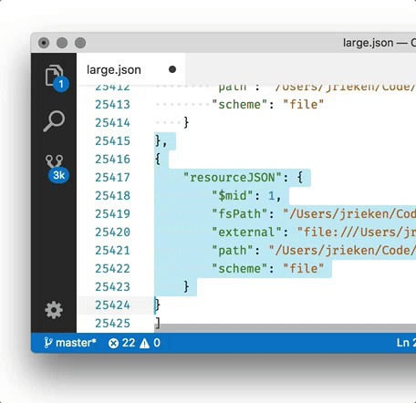

### More snippet variables

There are new snippet variables for referring to the current date and time. In addition to numbers, for example, 28/3/2018, you can now use names like '28 of March'. The new variables are:

* `${CURRENT_DAY_NAME}` - The name of the day ('Monday').
* `${CURRENT_DAY_NAME_SHORT}` - The short name of the day ('Mon').
* `${CURRENT_MONTH_NAME}` - The full name of the month ('July').
* `${CURRENT_MONTH_NAME_SHORT}` - The short name of the month ('Jul').

### Emmet

**Wrap with Abbreviation preview**

When using either the **Emmet: Wrap with Abbreviation** or **Emmet: Wrap Individual Lines with Abbreviation** commands, you can now see a preview of what the wrapped text will look like.

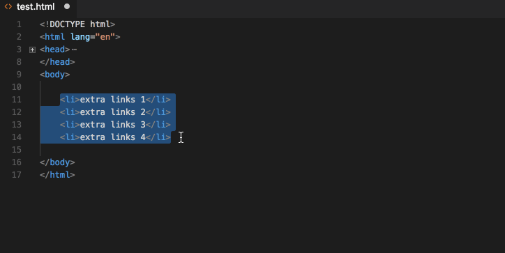

**Faster abbreviation expansion**

Expanding Emmet abbreviations in large CSS/SCSS/Less files is much faster now. This is achieved by parsing only a small region around the cursor instead of the complete file when trying to determine whether the current location is valid for expanding Emmet abbreviations.

**Smarter snippet matching**

Emmet abbreviations in stylesheets are fuzzy matched with [pre-defined snippets](https://github.com/emmetio/snippets/blob/v0.2.9/css.json) to give you the closest matched result. You can control the fuzzy matching accuracy by changing the `css.fuzzySearchMinScore` setting in `emmet.preferences`. `css.fuzzySearchMinScore` sets the minimum score a snippet needs to be considered a match. Increasing the score will result in fewer but more accurate matches. The default value is 0.3 and you can provide any value between 0 and 1.

```json
"emmet.preferences": {
    "css.fuzzySearchMinScore": 0.3
}
```

## Workbench

### Automatic background updates on Windows

We've been rolling out automatic background updates for our Insider users on Windows for quite some time now. We've decided to enable this for everyone for the March release.

The longest running update process is now able to run in the background, as you do your work. When it's ready, it should notify you in order to apply the final update, which is a much shorter step. This means you can keep working for longer, when updating to the latest VS Code!

You can disable this feature using the `update.enableWindowsBackgroundUpdates` configuration setting, in case you'd like the old behavior back or if the new update procedure is somehow problematic on your machine.

### Windows: Workaround for scroll lag

We have received reports that scrolling on Windows on certain devices is very laggy and does not move smoothly (see [issue 13612](https://github.com/Microsoft/vscode/issues/13612) for details). As a workaround for smooth scrolling, a new setting `window.smoothScrollingWorkaround` can be set to `true`. Since this is a workaround and can result in flicker whenever you restore the window from the taskbar, this setting is not enabled by default. You should see no other side effects if you enable the setting.

### Open empty window when launching VS Code without arguments

A new setting `window.openWithoutArgumentsInNewWindow` was introduced to control whether launching VS Code without arguments should focus the last active instance or open a new empty window. On Windows and Linux, this setting is enabled by default to better match platform behavior. When enabled, double clicking the VS Code icon from the desktop or running VS Code without arguments from the command line will open a new empty window. The same is true on Windows when middle-clicking or shift-clicking on the taskbar icon. Disable this behavior by explicitly setting `window.openWithoutArgumentsInNewWindow` to `off`.

### Save automatically when Search & Replace

You no longer need to **Save All** and **Close All** when replacing all search results. Replace actions will now replace and save the changes.

### Search include/exclude patterns

The boxes for include and exclude patterns in the Search view have been combined into a single box. The functionality is exactly the same, except that an exclude pattern must be prefixed with `!`. For example, `!*.js` will skip searching files that have a .js extension.

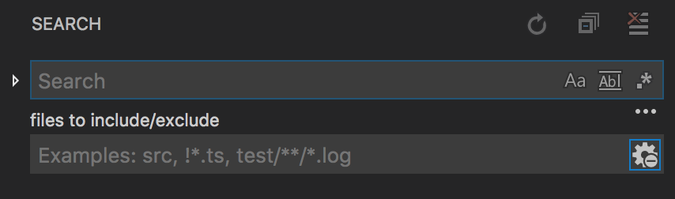

### Tree: Horizontal scrolling support

There's a new global setting, `workbench.tree.horizontalScrolling`, which enables horizontal scrolling for several tree widgets across the workbench. Use it to provide better readibility for wide tree elements such as deep file system hierarchies in the File Explorer.

## Integrated Terminal

### Better support for multiline links

Paths and URLs that span multiple lines will now work as links.


There are still a few issues with the implementation, particularly when you resize the window. These will get fixed when we implement [reflow](https://github.com/Microsoft/vscode/issues/23688).

### Command tracking

The terminal now features "command tracking", which attempts to guess when a command is run and allows easy navigation and selection between them.

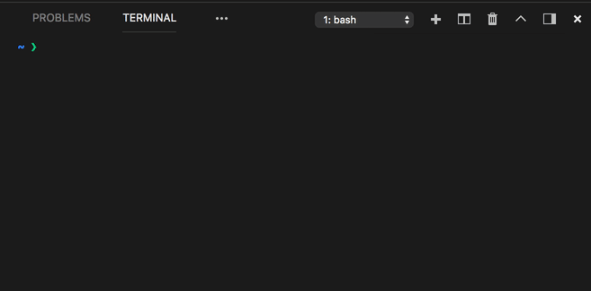

This feature has the following default keybindings on macOS:

* Scroll to previous command: `kbstyle(Cmd+Up)`\*
* Scroll to next command: `kbstyle(Cmd+Down)`\*
* Select to previous command: `kbstyle(Cmd+Shift+Up)`
* Select to next command: `kbstyle(Cmd+Shift+Down)`

\* **Note**: Scroll one line up/down was moved to `kbstyle(Cmd+Alt+PgUp)`/`kbstyle(Cmd+Alt+PgDown)`

On Windows and Linux, you can configure [custom keybindings](https://code.visualstudio.com/docs/getstarted/keybindings) for these commands by adding this to your `keybindings.json` file:

```js
{ "key": "ctrl+down",       "command": "workbench.action.terminal.scrollToNextCommand",
                               "when": "terminalFocus" },
{ "key": "ctrl+up",         "command": "workbench.action.terminal.scrollToPreviousCommand",
                               "when": "terminalFocus" },
{ "key": "ctrl+shift+down", "command": "workbench.action.terminal.selectToNextCommand",
                               "when": "terminalFocus" },
{ "key": "ctrl+shift+up",   "command": "workbench.action.terminal.selectToPreviousCommand",
                               "when": "terminalFocus" },
```

### More natural scrolling

Scrolling inside terminal applications will now feel more natural as OS scrolling settings which define whether to scroll by pixel, line or page, are now taken into account.

### Refocus terminal after using VS Code as a Git editor

When using VS Code as a Git editor and Git is triggered from the Integrated Terminal, after finishing the message, focus will now be returned to the terminal.

## Debugging

### Logpoints

This milestone includes our first work towards **Logpoints**. A Logpoint is a variant of a breakpoint that does not "break" into the debugger but instead logs a message to the console. Logpoints are especially useful for injecting logging while debugging production servers which cannot be stopped.

A Logpoint is represented by a "diamond" shaped icon. Log messages are plain text but can include expressions to be evaluated within curly braces ('{}').

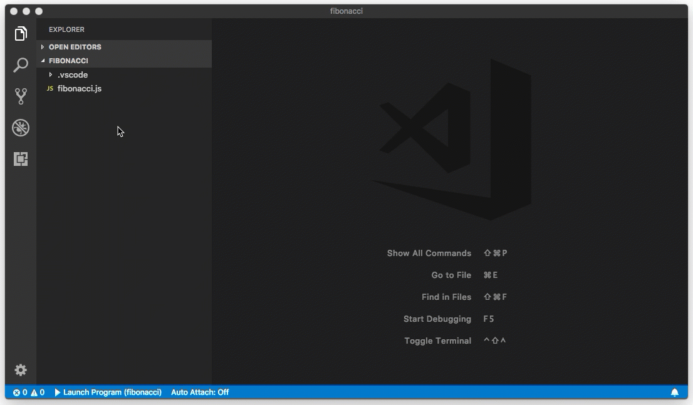

Just like regular breakpoints, Logpoints can be enabled or disabled and can also be controlled by a condition and/or hit count.

Logpoints are currently supported by VS Code's built-in Node.js debugger, but we expect that other debug extensions will follow soon.

### postDebugTask in launch.json

We have added `postDebugTask` support in `launch.json`. This task is run after a debug session finishes. Similar to `preLaunchTask`, you can reference tasks in your `tasks.json` by a name. Here's an example of a launch configuration using a `postDebugTask`:

```json
{
    "name": "Attach to node server",
    "type": "node",
    "request": "attach",
    "port": 8008,
    "preLaunchTask": "Start Server",
    "postDebugTask": "Stop Server"
}
```

### Node debugging

**Automatically Attach to Node.js processes**

A first version of a new **Auto Attach** feature has been added to VS Code's Node.js debugger. If enabled, the Node debugger automatically attaches to Node.js processes that have been launched in debug mode from VS Code's Integrated Terminal.

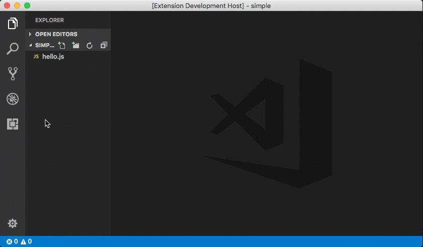

To enable the feature, either use the **Toggle Auto Attach** action or, if the Node debugger is already activated, use the **Auto Attach** Status Bar item.

Whether or not a process is in "debug mode" is determined by analyzing the program arguments. Currently, we detect the patterns `--inspect`, `--inspect-brk`, `--inspect-port`, `--debug`, `--debug-brk`, `--debug-port` (all optionally followed by a '=' and a port number).

Please note that this feature does not (yet) work for terminal multiplexers like 'tmux' (where launched processes are not children of VS Code's integrated terminal).

**Improved Process Picker**

In previous releases, a process picker for Node.js processes was only available as an "interactive variable" that could be used from within a launch configuration.

In this release, we've made the picker available as an **Attach to Node Process** action that can be used without a launch configuration.

To make the picker and the new action more useful, we now support attaching to Node.js processes via a debug port (in addition to attaching via the process id).

In addition to Node.js processes, the picker now shows all programs that were launched with one of the various forms of `--debug` or `--inspect` arguments. This makes it possible to attach to Electron's or VS Code's helper processes.


The individual process items listed in the picker show the debug port and the detected protocol in addition to the process id.

## Tasks

### Improved argument quoting

Tasks have been updated to give users better control over how arguments and the command itself are quoted when executed in a shell like bash or PowerShell. Tasks of type `shell` now support providing the command and its argument separately. Below is an example of a task that list the directory of a folder named `folder with spaces` (observe the space in the name).

```json
{
  "label": "dir",
  "type": "shell",
  "command": "dir",
  "args": [
    "folder with spaces"
  ]
}
```

Since the shell tasks specifies the argument separately, VS Code knows that it should be passed as one argument to the 'dir' command and quotes the argument based on the shell used. For `cmd.exe`, VS Code uses `"`, for PowerShell `'`, and for shells under Linux and macOS `'` as well. If you want to control how the argument is quoted, the argument can be a literal specifying the value and a quoting style. For example:

```json
{
  "label": "dir",
  "type": "shell",
  "command": "dir",
  "args": [
    {
      "value": "folder with spaces",
      "quoting": "escape"
    }
  ]
}
```

This will escape the spaces in the argument using the shell's escape character which is backtick under PowerShell and `\`under bash. If the shell used doesn't support character escaping, the strong quotes are used.

Besides escaping the following values are supported:

* **strong**: Uses the shell's strong quoting mechanism which suppresses all evaluations inside the string. Under PowerShell and for shells under Linux and macOS, single quotes are used (`'`). For cmd.exe, `"` is used.
* **weak**: Uses the shell's weak quoting mechanism which still evaluates expression inside the string (for example, environment variables). Under PowerShell and for shells under Linux and macOS, double quotes are used (`"`). cmd.exe doesn't support weak quoting so VS Code uses `"` as well.

If the command itself contains spaces, VS Code will by default strong quote the command as well. As with arguments, the user can control the quoting of the command using the same literal style.

Note that the old style of having the whole command line in the `command` property is still supported.

The same support has been added to the task API so task providers also have full control over quoting and escaping.

## Languages

### Fold Markdown by heading level

You can now fold Markdown documents by heading:

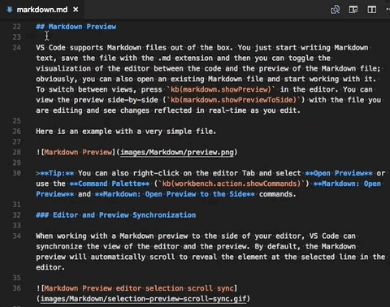

Folding a header collapses all content and subheadings under that header.

### TypeScript 2.8

VS Code now ships with TypeScript 2.8. This update brings support for some cool [new language features](https://github.com/Microsoft/TypeScript/wiki/What%27s-new-in-TypeScript#typescript-28), as well as many important bug fixes and tooling improvements.

### Improved quick suggestions in JSDoc

Did you know that VS Code provides IntelliSense for JSDoc types? This feature was added a number of releases ago but you may not have realized it because the IntelliSense only showed up if you manually invoked it. In VS Code 1.22, quick suggestions are now enabled by default in JSDoc types. Just start typing for IntelliSense to kick in:

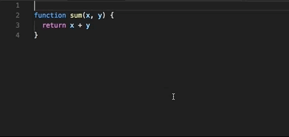

### Suggestion Code Actions for JavaScript and TypeScript

We've also improved discoverability of JavaScript and TypeScript suggestion Code Actions. These are proposed changes that can help you quickly improve or clean up your source code. They are shown using the lightbulb widget but unlike Quick Fixes, they do not address a specific error or warning in your source code. Example suggestion Code Actions include: convert ES5 class to ES6 class and convert commonjs module to ES6 module.

Suggestion Code Action are now indicated by a `...` in the editor:

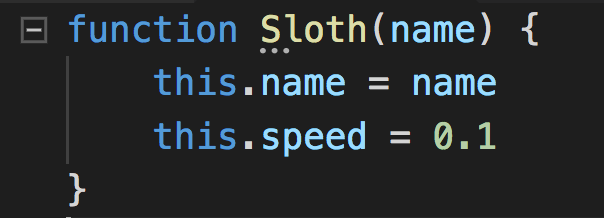

Move the cursor over the `...` and click on the lightbulb or press `kb(editor.action.quickFix)` to display available Code Actions:

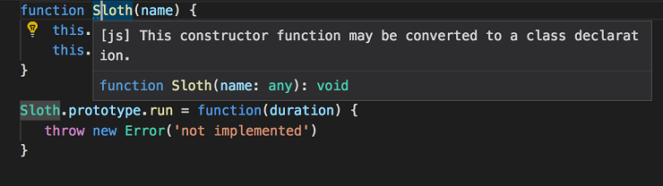

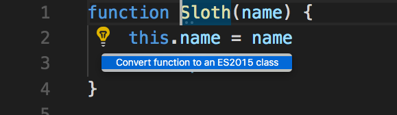

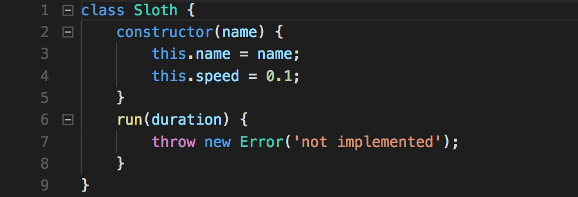

We plan to continue adding additional suggestions. Let us know if you have any that you would like to see.

Suggestion Code Actions are enabled by default in JavaScript and TypeScript. You can disable them by setting: `"typescript.suggestionActions.enabled": false` or `"javascript.suggestionActions.enabled": false`

### CSS path completion

In addition to HTML, path completion is now available for CSS too:

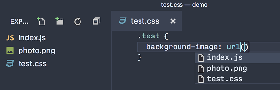

## Extension Authoring

### Show long running operations as notifications with cancellation support

We added a new API to show long running operations in the Notification Center with optional cancellation support. The benefits of showing long running operations here are:

* Multiple operations can report progress at the same time.
* You can show operation progress.
* The user has the option to cancel the operation.


Call `window.withProgress` with the new progress location `ProgressLocation.Notification`. Set `cancellable` to `true` to show a cancel button and check for cancellation on the provided `CancellationToken` in the callback. To display progress, leverage the `increment` value when reporting progress. See the [progress sample](https://github.com/Microsoft/vscode-extension-samples/tree/master/progress-sample) for an extension using this new API.

### Support related diagnostics information

We added an API to provide related information for diagnostics - [`DiagnosticRelatedInformation`](https://github.com/Microsoft/vscode/blob/b3200907913bea2b65a25b5e19b037739ca00119/src/vs/vscode.d.ts#L3710). Imagine the case of a compiler error because a variable name is re-used within a scope. The actual error could be "Duplicate definition of symbol 'Foo' not allowed" and it would point to the illegal declaration. By including related information with the diagnostic, you could also point to the first declaration of the symbol 'Foo', making the error is easier to understand and fix.

### Disposing a CancellationTokenSource no longer sets the token to cancelled state

Calling `dispose()` on a `CancellationTokenSource` previously would set the token to be cancelled and trigger the cancellation event. We changed the behavior in order to be able to dispose of tokens without cancelling them. If you rely on the cancellation of the token, call the `cancel()` method.

### Simple editors are not passed to extensions

Inputs that use the editor like the debug REPL input are no longer passed to extensions as editors. This means that both the `onDidChangeActiveTextEditor` will not trigger when user focuses the debug REPL, and that the `onDidChangeTextDocument` will also not fire. The reason behind this change is that the REPL input uses the editor as an implementation detail and extension should not be notified of this since it is not a "real editor".

### Custom views

**TreeView**

You can now perform operations on your custom view using the new `TreeView` API. This can be accessed using the new API `createTreeView` by providing the `viewId` and `TreeDataProvider`.

```typescript
const customView = vscode.window.createTreeView<string>('customView', { treeDataProvider: new CustomViewDataProvider<string>() });
```

**Note:** The existing `registerTreeDataProvider` API is still supported to contribute data to the view. You can use either `registerTreeDataProvider` or `createTreeView` to contribute `TreeDataProvider` but not both.

**Reveal**

At present, `TreeView` exposes a `reveal` method to reveal and select an item in the view.

```typescript
customView.reveal('element');
```

By default, the item to be revealed is selected. In order to not select the item, set the `select` option to `false`. For example:

```typescript
  customView.reveal('element', { select: false });
```

You can find more `TreeView` examples [here](https://github.com/Microsoft/vscode-extension-samples/blob/master/tree-view-sample/src/ftpExplorer.fileSystemProvider.ts#L254).

**Note:** To enable the `reveal` API, the contributed `TreeDataProvider` must implement the `getParent` method.

### New Theme Colors

There are two colors for new 'Hint' diagnostics:

* `editorHint.foreground`: Foreground color of hints in the editor.
* `editorHint.border`: Border color of hints in the editor.

### Editor visible ranges

The editor visible ranges API is now promoted to Stable.

```ts
export interface TextEditor {
    /**
     * The current visible ranges in the editor (vertically).
     * This accounts only for vertical scrolling, and not for horizontal scrolling.
     */
    readonly visibleRanges: Range[];
}

export namespace window {
    /**
     * An [event](#Event) which fires when the selection in an editor has changed.
     */
    export const onDidChangeTextEditorVisibleRanges: Event<TextEditorVisibleRangesChangeEvent>;
}
```

### Debug Adapter Protocol

**Logpoint support**

The newly introduced Logpoints are surfaced in the Debug Adapter Protocol as a new attribute `logMessage` on the `SourceBreakpoint` and as a new capability `supportsLogPoints`. A debug adapter that supports Logpoints returns `true` for the `supportsLogPoints` capability and does not 'break' (stop) for a non-empty `logMessage` attribute but logs the message instead. Expressions within curly braces ('{...}') are evaluated and the result replaces the '{...}' in the log message.

**New `clientName` attribute for `initialize` request**

The frontend can use a new optional attribute `clientName` on the `initialize` request to pass the human readable name of the frontend to the debug adapter.

**New `terminateThreads` request**

A new `terminateThreads` request can be used by front ends to terminate one or more threads. A corresponding `supportsTerminateThreadsRequest` capability signifies that the debug adapter supports the request.

**New `setExpression`request**

The new `setExpression` request can be used to assign a value to an assignable expression (aka "l-value"). A corresponding `supportsSetExpression` capability signifies that the debug adapter supports the request.

**New `preserveFocusHint`on `stopped` event**

A true-ish `preserveFocusHint` on the `stopped` event suggests to the front end that the stopped event should not change the focus.

### Multi-Select QuickPick

We have added an option to the QuickPick API that makes return a list of picked items with a new UI that allows the user to pick any number of items:

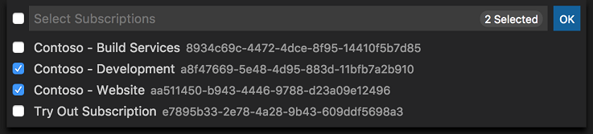

See the `QuickPickOptions.canPickMany` option and the `QuickPickItem.picked` flag on how to use these with the existing `window.showQuickPick` API function.

## Proposed Extension APIs

This milestone we added several new proposed extension APIs. We plan to add these APIs to stable in a future milestone once we are confident enough with them. We welcome any feedback on how they work for your extension.

> **Note:** These APIs are still proposed, so in order to use it, you must opt into it by adding a `"enableProposedApi": true` to `package.json` and you'll have to copy the [`vscode.proposed.d.ts`](https://github.com/Microsoft/vscode/blob/master/src/vs/vscode.proposed.d.ts) into your extension project. Also be aware that you cannot publish an extension to the Marketplace that uses the `enableProposedApi` attribute.

### Folding Provider API

To enable extensions to provide language aware folding ranges, a new provider API is proposed:

```ts
export namespace languages {

  /**
    * Register a folding provider.
    *
    * Multiple folding can be registered for a language. In that case providers are sorted
    * by their [score](#languages.match) and the best-matching provider is used. Failure
    * of the selected provider will cause a failure of the whole operation.
    *
    * @param selector A selector that defines the documents this provider is applicable to.
    * @param provider A folding provider.
    * @return A [disposable](#Disposable) that unregisters this provider when being disposed.
    */
  export function registerFoldingProvider(selector: DocumentSelector, provider: FoldingProvider): Disposable;
}
```

See the full APIs [here]( https://github.com/Microsoft/vscode/blob/21bfdd43b16707a07961f6d2b9d7782e5ea28d27/src/vs/vscode.proposed.d.ts#L42).

The equivalent APIs are proposed [here](https://www.npmjs.com/package/vscode-languageserver-protocol-foldingprovider) as protocol extensions to the language server protocol. Feedback is welcome!

### Task API

There is now a new task API which supports:

* Querying for all existing tasks in the system.
* Executing tasks programmatically.
* Terminate a running task.
* Listen on task start and end events.

The proposed API can be found [here](https://github.com/Microsoft/vscode/blob/master/src/vs/vscode.proposed.d.ts#L653)

The new API also supports executing tasks without previously returning them via a task provider. The example below executes a simple `echo` task.

```typescript
let task = new vscode.Task(
    {
        type: "myCustomTask"
    },
    "echo",
    "myExtension",
    new vscode.ShellExecution('echo', ['Hello World'])
);
vscode.workspace.executeTask(task);
```

## Serviceability

You can now file issues on extensions from within VS Code. The issue reporter now includes a dropdown to choose whether you are reporting an issue on VS Code itself or an extension. If the extension has a repository on GitHub, the similar issue search and **Preview on GitHub** submission button will use that repository.

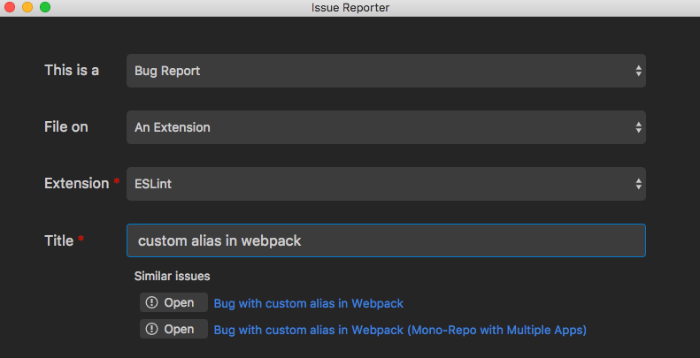

## Preview Features

Preview features are not ready for release but are functional enough to use. We welcome your early feedback while they are under development.

### Organize imports for JavaScript and TypeScript

The new **Organize Imports** command (`kb(typescript.organizeImports)`) removes unused imports and sorts the remaining imports:

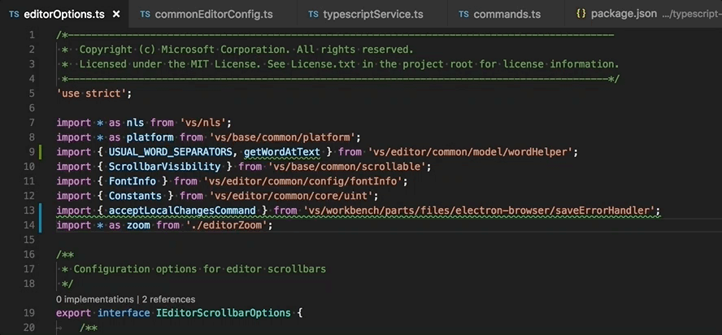

The command works in ES6 modules for both JavaScript and TypeScript.

### Electron 2.0 exploration

During this milestone, we explored bundling Electron 2.0.0 into VS Code. This is a major Electron release and comes with Chrome 61 and Node.js 8.x (a major leap forward compared to our current version that has Chrome 58 and Node.js 7.x). We plan to push out the update to our Insiders users early in April to gather additional feedback. If you are interested in helping out, make sure to install VS Code [Insiders](https://code.visualstudio.com/insiders).

## Notable Changes

* [13905](https://github.com/Microsoft/vscode/issues/13905): Windows: Middle mouse click on taskbar icon doesn't open a new window
* [35675](https://github.com/Microsoft/vscode/issues/35675): Font rendering looks ugly on Linux
* [36307](https://github.com/Microsoft/vscode/issues/36307): Experimental File Watcher - high CPU on "circular" symlinks
* [42401](https://github.com/Microsoft/vscode/issues/42401): Smarter grouping of output channels
* [42402](https://github.com/Microsoft/vscode/issues/42402): Add option to reveal logs from within a channel
* [43813](https://github.com/Microsoft/vscode/issues/43813): Extension incomplete after update
* [44411](https://github.com/Microsoft/vscode/issues/44411): Bail out from launch for unresolvable variables
* [44554](https://github.com/Microsoft/vscode/issues/44554): Allow to DND multiple root-folders
* [45872](https://github.com/Microsoft/vscode/issues/45872): Prompt user to change the language of the UI after the installation of a localization pack
* [45972](https://github.com/Microsoft/vscode/issues/45972): Explorer: Reduce call count of isEqualOrParent

## Thank You

Last but certainly not least, a big *__Thank You!__* to the following folks that helped to make VS Code even better:

Contributions to `vscode`:

* [Julian Tu (@AiryShift)](https://github.com/AiryShift):  Fixes #46075 [PR #46227](https://github.com/Microsoft/vscode/pull/46227)
* [@amalik12](https://github.com/amalik12):  Added Mac specific text for link follow tooltip [PR #44885](https://github.com/Microsoft/vscode/pull/44885)
* [朝歌 (@amtlib-dot-dll)](https://github.com/amtlib-dot-dll)
  * Wrong placeholder in the .desktop file [PR #44752](https://github.com/Microsoft/vscode/pull/44752)
  * Removing unnecessary lines in .travis.yml [PR #46044](https://github.com/Microsoft/vscode/pull/46044)
* [Andreas Offenhaeuser (@anoff)](https://github.com/anoff):  Markdown Security Policy to allow local HTTP content [PR #46473](https://github.com/Microsoft/vscode/pull/46473)
* [@Arnie97](https://github.com/Arnie97):  Update file extensions for the ini language [PR #45729](https://github.com/Microsoft/vscode/pull/45729)
* [Aliaksandr Ushakou (@aushakou)](https://github.com/aushakou):  Fix #43465 [PR #44006](https://github.com/Microsoft/vscode/pull/44006)
* [Robin Bartholdson (@buyology)](https://github.com/buyology):  make the timeout for formatOnSave configurable [PR #43702](https://github.com/Microsoft/vscode/pull/43702)
* [Juan Camilo Giraldo Chaverra (@camilogiraldo)](https://github.com/camilogiraldo):  Better uninstall dialog for extensions with dependencies. [PR #45929](https://github.com/Microsoft/vscode/pull/45929)
* [Cherry Wang (@chryw)](https://github.com/chryw)
  * Debug icons consistency and housekeeping work [PR #45253](https://github.com/Microsoft/vscode/pull/45253)
  * Adjusted icon size [PR #45608](https://github.com/Microsoft/vscode/pull/45608)
  * More tweaks for #45406 [PR #45691](https://github.com/Microsoft/vscode/pull/45691)
  * Conditional breakpoint icon polish for #45406 [PR #45935](https://github.com/Microsoft/vscode/pull/45935)
  * Debug icon consistensy pass [PR #45158](https://github.com/Microsoft/vscode/pull/45158)
* [Christian Oliff (@coliff)](https://github.com/coliff):  HTTPS link [PR #46849](https://github.com/Microsoft/vscode/pull/46849)
* [Mikhail Bodrov (@Connormiha)](https://github.com/Connormiha):  Simplify check lang.mimetypes [PR #42932](https://github.com/Microsoft/vscode/pull/42932)
* [Daniel Frankcom (@danielfrankcom)](https://github.com/danielfrankcom)
  * Add underline styling to debug console [PR #46042](https://github.com/Microsoft/vscode/pull/46042)
  * Add ANSI colour tokens as children of existing tokens [PR #45946](https://github.com/Microsoft/vscode/pull/45946)
* [Darius Keeley (@Dari-K)](https://github.com/Dari-K):  Hide tab fade until text overflows with sizing-shrink and close-button-left/off [PR #45815](https://github.com/Microsoft/vscode/pull/45815)
* [Dominik Ivosevic (@DominikDitoIvosevic)](https://github.com/DominikDitoIvosevic):  Add support for path links with spaces [PR #43733](https://github.com/Microsoft/vscode/pull/43733)
* [Fathy Boundjadj (@fathyb)](https://github.com/fathyb):  Add getWorker to MonacoEnvironment [PR #46032](https://github.com/Microsoft/vscode/pull/46032)
* [Mihai Balaceanu (@gizm0bill)](https://github.com/gizm0bill):  Fixes #46027 by using box-shadow CSS to render guides [PR #46029](https://github.com/Microsoft/vscode/pull/46029)
* [Jackson Kearl (@JacksonKearl)](https://github.com/JacksonKearl)
  * Use yarn rather than gulp for building tests [PR #45614](https://github.com/Microsoft/vscode/pull/45614)
  * Add basic support for transposing multibyte characters. [PR #45499](https://github.com/Microsoft/vscode/pull/45499)
* [Jean Pierre (@jeanp413)](https://github.com/jeanp413):  Fix for #46106 [PR #46309](https://github.com/Microsoft/vscode/pull/46309)
* [JYX (@jjyyxx)](https://github.com/jjyyxx):  Avoid accessing vsWorker of undefined / null value [PR #46012](https://github.com/Microsoft/vscode/pull/46012)
* [Ievgen Andrushchak (@killerDJO)](https://github.com/killerDJO): Search of local Typescript Language Service Plugins [PR #45858](https://github.com/Microsoft/vscode/pull/45858)
* [Dominic Valenciana (@Kiricon)](https://github.com/Kiricon):  Added focus to quick fix widget click [PR #44073](https://github.com/Microsoft/vscode/pull/44073)
* [Kumar Harsh (@kumarharsh)](https://github.com/kumarharsh):  fix(feedback): use the Button widget in Feedback form. Closes #46490 [PR #46503](https://github.com/Microsoft/vscode/pull/46503)
* [Matheus Salmi (@mathsalmi)](https://github.com/mathsalmi):  Fix php grammar update script [PR #44171](https://github.com/Microsoft/vscode/pull/44171)
* [Mika Andrianarijaona (@mikaoelitiana)](https://github.com/mikaoelitiana): Change default keybinding of cursorColumnSelectUp to ctrl+shift+… [PR #41471](https://github.com/Microsoft/vscode/pull/41471)
* [Mark Marron (@mrkmarron)](https://github.com/mrkmarron):  Change to prevent fakeFireContinued when initiating time-travel [PR #46441](https://github.com/Microsoft/vscode/pull/46441)
* [Bruno Ribeiro (@nikonso)](https://github.com/nikonso):  Add partial staging actions to diff editor context menu [PR #43941](https://github.com/Microsoft/vscode/pull/43941)
* [Ori Ashual (@oriash93)](https://github.com/oriash93)
  * Case insensitive comment string matching [PR #44998](https://github.com/Microsoft/vscode/pull/44998)
  * Enabled 'Open to the side' command only for files [PR #44968](https://github.com/Microsoft/vscode/pull/44968)
* [Pradeep Murugesan (@pradeepmurugesan)](https://github.com/pradeepmurugesan):  added the key bindings for first and last selection in suggestions. [PR #45881](https://github.com/Microsoft/vscode/pull/45881)
* [Roman Salvador (@rsalvador)](https://github.com/rsalvador)
  * Improve Call Stack performance with many threads, fixes #44248 [PR #44249](https://github.com/Microsoft/vscode/pull/44249)
  * Make problem counters consistent, fixes #45592 [PR #45593](https://github.com/Microsoft/vscode/pull/45593)
* [Shobhit Chittora (@shobhitchittora)](https://github.com/shobhitchittora)
  * Allow to filter keyBindings by 'Source'. [PR #43393](https://github.com/Microsoft/vscode/pull/43393)
  * Adds workspace config for submodules detection limit [PR #45727](https://github.com/Microsoft/vscode/pull/45727)
* [Tobias Kahlert (@SrTobi)](https://github.com/SrTobi):  Centered layout in horizontal mode [PR #45671](https://github.com/Microsoft/vscode/pull/45671)
* [Steve Desmond (@stevedesmond-ca)](https://github.com/stevedesmond-ca):  Properly set electron version in env scripts [PR #45696](https://github.com/Microsoft/vscode/pull/45696)
* [Alexander (@usernamehw)](https://github.com/usernamehw)
  * Add more time-based variables for snippets [PR #46049](https://github.com/Microsoft/vscode/pull/46049)
  * Focus terminal after toggling via `workbench.action.terminal.toggleTerminal` [PR #46272](https://github.com/Microsoft/vscode/pull/46272)
* [Waldir Pimenta (@waldyrious)](https://github.com/waldyrious):  Change label of indentation action in status bar [PR #37515](https://github.com/Microsoft/vscode/pull/37515)
* [Zim Kalinowski (@zikalino)](https://github.com/zikalino):  make sure yml extension is default for yaml files [PR #45756](https://github.com/Microsoft/vscode/pull/45756)

Contributions to `vscode-extension-vscode`:

* [Danny Tuppeny (@DanTup)](https://github.com/DanTup):
  * Check for presence of code executable instead of just folder (#95) [PR #95](https://github.com/Microsoft/vscode-extension-vscode/pull/95)
  * Place VS Code inside insiders/stable sub-folders of .vs-test (#97) [PR #97](https://github.com/Microsoft/vscode-extension-vscode/pull/97)
  * Don't download Code every time on Windows (#102) [PR #102](https://github.com/Microsoft/vscode-extension-vscode/pull/102)
  * Add support for Mocha's forbidOnly (#103) [PR #103](https://github.com/Microsoft/vscode-extension-vscode/pull/103)

Contributions to `vscode-nls`:

* [Ruben Bridgewater (@BridgeAR)](https://github.com/BridgeAR): Use sync fs.mkdir [PR #17](https://github.com/Microsoft/vscode-nls/pull/17)

Contributions to `language-server-protocol`:

* [Igor Matuszewski (@Xanewok)](https://github.com/Xanewok): Change message params types to match JSON-RPC spec [PR #373](https://github.com/Microsoft/language-server-protocol/pull/373)

Contributions to `vscode-css-languageservice`:

* [Avi Vahl (@AviVahl)](https://github.com/AviVahl):  Fix function calls in esm mode [PR #74](https://github.com/Microsoft/vscode-css-languageservice/pull/74)

Contributions to `vscode-html-languageservice`:

* [Sibiraj (@Sibiraj-S)](https://github.com/Sibiraj-S):  add AngularJS `ng-strict-di` tag [PR #25](https://github.com/Microsoft/vscode-html-languageservice/pull/25)

Contributions to `node-jsonc-parser`:

* [@sqs](https://github.com/sqs): Allow trailing commas in array [PR #6](https://github.com/Microsoft/node-jsonc-parser/pull/6)
* [Huachao Mao (@sqs)](https://github.com/Huachao):
  * Refactor computeIndentLevel method [PR #9](https://github.com/Microsoft/node-jsonc-parser/pull/9)
  * Fix typo of token [PR #8](https://github.com/Microsoft/node-jsonc-parser/pull/8)

Contributions to `vscode-generator-code`:

* [Alessandro Fragnani (@alefragnani)](https://github.com/alefragnani):  Add Keymap extension template [PR #110](https://github.com/Microsoft/vscode-generator-code/pull/110)
* [Nikita Shiryakov (@nikselite)](https://github.com/nikselite):  Remove unnecessary space [PR #106](https://github.com/Microsoft/vscode-generator-code/pull/106)

Contributions to `vscode-languageserver-node`:

* [Matt Acosta (@mattacosta)](https://github.com/mattacosta): Typo fixes [PR #327](https://github.com/Microsoft/vscode-languageserver-node/pull/327)

Contributions to `vscode-loader`:

* [Geoffrey Gilmore (@ggilmore)](https://github.com/ggilmore): support loading scoped modules at runtime [PR #10](https://github.com/Microsoft/vscode-loader/pull/10)

Contributions to `vscode-azurecli`:

* [Derek Bekoe (@derekbekoe)](https://github.com/derekbekoe): Fix for PYTHONPATH on Homebrew [PR #31](https://github.com/Microsoft/vscode-azurecli/pull/31)

Contributions to `vscode-azure-account`:

* [Sheng Chen (@jdneo)](https://github.com/jdneo): Add timeout in promise race [PR #46](https://github.com/Microsoft/vscode-azure-account/pull/46)

Contributions to `vscode-chrome-debug`:

* [AJ Richardson (@aj-r)](https://github.com/aj-r):  Fix chrome session restore prompt in Windows [PR #606](https://github.com/Microsoft/vscode-chrome-debug/pull/606)
* [Chance An (@changsi-an)](https://github.com/changsi-an)
  * Use the telemetry collector to append an additional telemetry property for launch request. [PR #631](https://github.com/Microsoft/vscode-chrome-debug/pull/631)
  * Implements setExpression request. [PR #612](https://github.com/Microsoft/vscode-chrome-debug/pull/612)
  * Launch Chrome in unelevated state on Windows using `wmic call create`. [PR #619](https://github.com/Microsoft/vscode-chrome-debug/pull/619)
* [@digeff](https://github.com/digeff)
  * Add browser version to telemetry [PR #621](https://github.com/Microsoft/vscode-chrome-debug/pull/621)
  * Now we provide a reason of why start-up failed [PR #630](https://github.com/Microsoft/vscode-chrome-debug/pull/630)
  * Add an event with the target's version information [PR #627](https://github.com/Microsoft/vscode-chrome-debug/pull/627)
  * Report times of different tasks that happen until we launch and show the user page [PR #610](https://github.com/Microsoft/vscode-chrome-debug/pull/610)
* [Chris Wells (@msft-cwells)](https://github.com/msft-cwells)
  * Changes to the msbuild signing project to remove unwanted files [PR #622](https://github.com/Microsoft/vscode-chrome-debug/pull/622)
  * Simplification of the msbuild signing projects [PR #624](https://github.com/Microsoft/vscode-chrome-debug/pull/624)
  * Adding LOC files to the signing microbuild project [PR #615](https://github.com/Microsoft/vscode-chrome-debug/pull/615)
  * Adding signing msbuild files [PR #614](https://github.com/Microsoft/vscode-chrome-debug/pull/614)
* [Raghav Katyal (@rakatyal)](https://github.com/rakatyal)
  * Use landing page even if breakonload is disabled [PR #613](https://github.com/Microsoft/vscode-chrome-debug/pull/613)
  * Respect locale passed on from Pinezorro [PR #616](https://github.com/Microsoft/vscode-chrome-debug/pull/616)

Contributions to `vscode-chrome-debug-core`:

* [Chance An (@changsi-an)](https://github.com/changsi-an)
  * Introduces a telemetry collector. [PR #314](https://github.com/Microsoft/vscode-chrome-debug-core/pull/314)
  * Introduces a mechanism to batch-sending telemetry events. [PR #292](https://github.com/Microsoft/vscode-chrome-debug-core/pull/292)
  * Change the way error message is surfaced up to the UI. [PR #303](https://github.com/Microsoft/vscode-chrome-debug-core/pull/303)
  * Batch sending telemetry for some of the event notifications. [PR #300](https://github.com/Microsoft/vscode-chrome-debug-core/pull/300)
* [@digeff](https://github.com/digeff)
  * Add missing await [PR #306](https://github.com/Microsoft/vscode-chrome-debug-core/pull/306)
  * Don't wait for global telemetry properties to be ready before sending telemetry [PR #310](https://github.com/Microsoft/vscode-chrome-debug-core/pull/310)
  * Add versions to telemetry [PR #307](https://github.com/Microsoft/vscode-chrome-debug-core/pull/307)
  * Now the start-up timings events can include a failure reason [PR #316](https://github.com/Microsoft/vscode-chrome-debug-core/pull/316)
  * Now we send more telemetry information for some errors [PR #319](https://github.com/Microsoft/vscode-chrome-debug-core/pull/319)
  * Report times the different tasks that happen until we launch and show the user page [PR #301](https://github.com/Microsoft/vscode-chrome-debug-core/pull/301)
  * Send all telemetry properties of the start-up timings event in sentence case [PR #313](https://github.com/Microsoft/vscode-chrome-debug-core/pull/313)
  * Fix some unexplained breakpoints behavior [PR #296](https://github.com/Microsoft/vscode-chrome-debug-core/pull/296)
  * Resolve pending breakpoints onScriptParsed instead onScriptPaused when using break on load [PR #290](https://github.com/Microsoft/vscode-chrome-debug-core/pull/290)
* [Raghav Katyal (@rakatyal)](https://github.com/rakatyal):  Clear context to avoid sending multiple remove eve… [PR #318](https://github.com/Microsoft/vscode-chrome-debug-core/pull/318)

Contributions to `vscode-node-debug2`:

* [@digeff](https://github.com/digeff)
  * Update FinishedStartingUpEventName to new signature [PR #184](https://github.com/Microsoft/vscode-node-debug2/pull/184)
  * Add version to all telemetry events, and properly trigger start-up telemetry [PR #183](https://github.com/Microsoft/vscode-node-debug2/pull/183)
* [Chris Wells (@msft-cwells)](https://github.com/msft-cwells)
  * Changes to the msbuild signing project to remove unwanted files [PR #181](https://github.com/Microsoft/vscode-node-debug2/pull/181)
  * Adding LOC files to the signing microbuild project [PR #179](https://github.com/Microsoft/vscode-node-debug2/pull/179)
  * Adding msbuild signing files [PR #178](https://github.com/Microsoft/vscode-node-debug2/pull/178)
* [Raghav Katyal (@rakatyal)](https://github.com/rakatyal):  Respect locale passed from Pinezorro [PR #180](https://github.com/Microsoft/vscode-node-debug2/pull/180)

Contributions to `vscode-recipes`:

* [@bladedeyna](https://github.com/bladedeyna):  Update README.md to match current launch.json [PR #90](https://github.com/Microsoft/vscode-recipes/pull/90)
* [@dvlsg](https://github.com/dvlsg):  docs: spelling in debugging section [PR #75](https://github.com/Microsoft/vscode-recipes/pull/75)
* [Liran Tal (@lirantal)](https://github.com/lirantal):  docs(README): fix spelling typo [PR #88](https://github.com/Microsoft/vscode-recipes/pull/88)
* [Marek Kaczkowski (@marekkaczkowski)](https://github.com/marekkaczkowski):  debugging-jest-tests "Jest Current File" on Windows [PR #89](https://github.com/Microsoft/vscode-recipes/pull/89)

Contributions to `localization`:

This month marks the one year anniversary since we opened VS Code community localization in Transifex on April 10, 2017.

* There are over 800 members in the Transifex [VS Code project](https://aka.ms/vscodeloc) team with about 100 active contributors every month.
* With community contributions, we have successfully released monthly updates for 9 core languages to international users.
* In addition, there are 4 languages fully localized by community members and released as Language Pack VS Code extensions. More languages coming soon.
* Kudos to VS Code community localization contributors!!!

Here is a snapshot of contributors for this release. For details about the project including the contributor name list, visit the project site at [https://aka.ms/vscodeloc](https://aka.ms/vscodeloc).

* **French:** Antoine Griffard, Adrien Clerbois, Smrman.
* **Italian:** Alessandro Alpi, Piero Azi, Aldo Donetti, Simone Chiaretta, Emilie Rollandin, Francesco Mugnai.
* **German:** Dejan Dinic, Jakob von der Haar, Carsten Kneip, Jakob, Ettore Atalan.
* **Spanish:** Alberto Poblacion, José M. Aguilar, David Silva, Alejandro M, Andy Gonzalez, AlanThinks, David Triana, Santiago Porras Rodríguez, Carlos Mendible, Jorge Serrano Pérez.
* **Japanese:** Shunya Tajima, Yuichi Nukiyama, Hiroyuki Mori, Takashi Takebayashi, Seiji Momoto, yoshioms, Yuki Ueda, 小島 富治雄, Satoshi Kajiura.
* **Chinese (Simplified):** Joel Yang.
* **Chinese (Traditional):** Duran Hsieh, Winnie Lin, Poy Chang, balduran, Will 保哥.
* **Korean:** ChangJoon Lee, Ian Y. Choi.
* **Russian:** Ivan, Andrei Makarov.
* **Bulgarian:** Любомир Василев.
* **Hungarian:** Tar Dániel.
* **Portuguese (Brazil):** Roberto Fonseca, Matheus Palu, Rodrigo Crespi, Danilo Dantas, Douglas Ivatiuk Martim, Alessandro Fragnani, Kayky de Brito dos Santos.
* **Portuguese (Portugal):** Diogo Barros, Ruben Mateus, António Lourenço, João Mata, Gustavo Silva.
* **Turkish:** Adem Coşkuner, Ömer Büyükçelik, Mustafa Turhan, Tuğrul Kaşıkcı.
* **Bosnian:** Bahrudin Hrnjica, Muharem Basanovic, Ismar Bašanović, Almir Vuk.
* **Czechia:** Michal Vondracek, Vít Staniček, Filip Vlček, Vojtěch Habarta, Ferdinand Prantl.
* **Dutch:** Maurits Kammer, Gerald Versluis, Marco van den Hout.
* **Finnish:** Feetu Nyrhinen, Petri Niinimäki.
* **Greek:** Dimitris Trachiotis.
* **Indonesian:** Joseph Aditya P G, Najih Azkalhaq, Adrian M. R., Wildan Mubarok, G-RiNe Project, Lundy Orlando, Azhe-kun, Febrian Setianto, Riwut Libinuko, Laurensius Dede Suhardiman, Mulia Arifandi Nasution, Herman Prawiro.
* **Latvian:** Pēteris Kļaviņš, Simone Chiaretta, kozete, Lafriks.
* **Lithuanian:** Martynas Jusys.
* **Polish:** Patryk Brejdak, Joanna Skurzyńska, Paweł Sołtysiak, KarbonKitty.
* **Serbian:** Марко М. Костић, Nikola Radovanović.
* **Swedish:** Joakim Olsson, Kalle Wallin, Johan Hedén.
* **Thai:** Sirisak Lueangsaksri, Phongphan Bunlom, ภูมิไผท จันทรศรีวงศ์.
* **Ukrainian:** Андрій Іванченко, R.M., Max Plotitsyn, Svitlana Galianova.
* **Vietnamese:** Hung Nguyen.

<!-- In-product release notes styles.  Do not modify without also modifying regex in gulpfile.common.js -->
<a id="scroll-to-top" role="button" aria-label="scroll to top" href="#"><span class="icon"></span></a>
<link rel="stylesheet" type="text/css" href="css/inproduct_releasenotes.css"/>
