---
Order:
TOCTitle: April 2018
PageTitle: Visual Studio Code April 2018
MetaDescription: See what is new in the Visual Studio Code April 2018 Release (1.23)
MetaSocialImage: 1_23/release-highlights.png
Date: 2018-05-03
DownloadVersion: 1.23.1
---
# April 2018 (version 1.23)

**Update 1.23.1**: The update addresses these [issues](https://github.com/microsoft/vscode/milestone/70?closed=1).

<!-- DOWNLOAD_LINKS_PLACEHOLDER -->

---

Welcome to the April 2018 release of Visual Studio Code. This milestone the VS Code team has been focused on API work to support extension authors, but there are still plenty of updates in this version that we hope you will like. Some of the key highlights include:

* **[Highlighted indent guides](#highlighted-indent-guides)** - Helps visualize source code indenting.
* **[Run Code Actions on save](#run-code-actions-on-save)** - Run actions like Organize Imports when you save.
* **[NPM script explorer](#npm-script-running)** - Quickly find, run, and debug NPM scripts in your project.
* **[Problems view filtering](#problems-view-filtering)** - Choose which files will display errors and warnings.
* **[Middle mouse button column selection](#column-selection-using-middle-mouse-button)** - Middle mouse button with drag for fast column selection.
* **[CSS region folding](#css-region-folding)** - Create regions in your CSS/SCSS/Less code for helpful code folding.
* **[Improved CSS new property support](#improved-css-support-for-new-properties)** - Smart suggestions for CSS experimental properties.
* **[Markdown header search](#markdown-workspace-symbol-search)** - Search for Markdown headers across your entire workspace.
* **[Custom Activity Bar views](#extension-authoring)** - Extension authors can create their own Activity Bar items.
* **[New deploy website tutorial](#new-documentation)** - Learn how to deploy a static website to Azure Storage.

>If you'd like to read these release notes online, go to [Updates](https://code.visualstudio.com/updates) on [code.visualstudio.com](https://code.visualstudio.com).<br>
>You can also check out this 1.23 release [highlights video](https://youtu.be/9WXqgggvmOs) from Cloud Developer Advocate [Brian Clark](https://twitter.com/_clarkio).

The release notes are arranged in the following sections related to VS Code focus areas. Here are some further updates:

* **[Editor](#editor)** - Better Unicode file support, more stable editor positioning.
* **[Workbench](#workbench)** - Copy search results, better Git clone workflow, VS Code process explorer.
* **[Debugging](#debugging)** - Logpoint expressions support smart completions and displaying structured objects.
* **[Languages](#languages)** - JavaScript/TypeScript Organize Imports action, persistent Markdown previews.
* **[Extension Authoring](#extension-authoring)** - New webview and FileSystem Provider APIs, 'Source' file level actions.

**Insiders:** Want to see new features as soon as possible? You can download the nightly [Insiders](https://code.visualstudio.com/insiders) build and try the latest updates as soon as they are available.

## Editor

### Highlighted indent guides

VS Code can now highlight the active indent guide, as you move your cursor between various source code blocks.

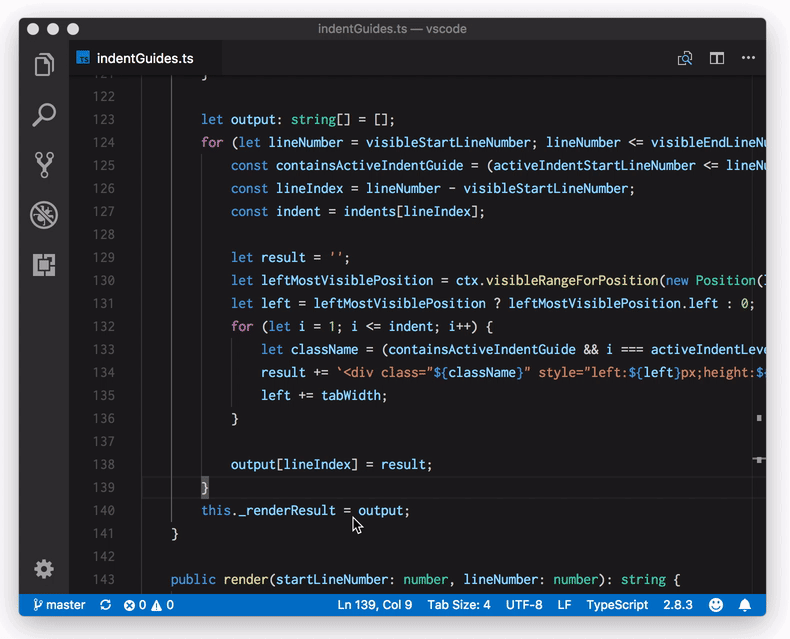

The highlight color name is `editorIndentGuide.activeBackground`, which you can modify in the `workbench.colorCustomizations` setting:

```json
"workbench.colorCustomizations": {
    "editorIndentGuide.activeBackground": "#ff0000"
}
```

### Run Code Actions on save

The new `editor.codeActionsOnSave` setting lets you configure a set of Code Actions that are run when a file is saved. For example, for JavaScript, TypeScript, and other extensions that contribute an organize imports Code Action, you can enable organize imports on save by [setting](https://code.visualstudio.com/docs/getstarted/settings):

```json
"editor.codeActionsOnSave": {
     "source.organizeImports": true
}
```

You can also enable or disable which Code Actions are run on save per language using a [language specific setting](https://code.visualstudio.com/docs/getstarted/settings#_language-specific-editor-settings). The following settings enable organize imports on save for TypeScript files only:

```json
"[typescript]": {
    "editor.codeActionsOnSave": {
        "source.organizeImports": true
    }
},
"[typescriptreact]": {
    "editor.codeActionsOnSave": {
        "source.organizeImports": true
    }
}
```

### Column selection using middle mouse button

In VS Code, column (box) selection can be added by holding `Shift` and `Alt` and then using the left mouse button. Now the middle mouse button can also be used to create a column selection:


> Note: When setting `editor.multiCursorModifier` to `ctrlCmd`, the modifiers are `Shift` and `Ctrl` on Windows and `Shift` and `Cmd` on macOS.

### Improved handling of UTF-16 encoded files

VS Code always supported the UTF-16 encoding for files but required a BOM (byte order mark) to properly detect this encoding. If VS Code didn't find a BOM, the file would not be opened and the user saw an information message.

With this release, we added a new action to this message to open the file as text in the editor:

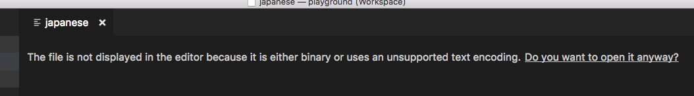

Once opened, you can then change the encoding to try to decode the text.

In addition, VS Code now uses a heuristic that tries to detect UTF-16 without a BOM automatically. This heuristic should work for all UTF-16 files that contain only ASCII characters.

### Improved editor positioning

In certain cases when changing the editor scroll height (such as resizing a wrapped editor, using mouse wheel zooming, or modifying a CodeLens), the editor would attempt to maintain the centered line in the viewport. VS Code now maintains the first line in the viewport, providing a more stable appearance.

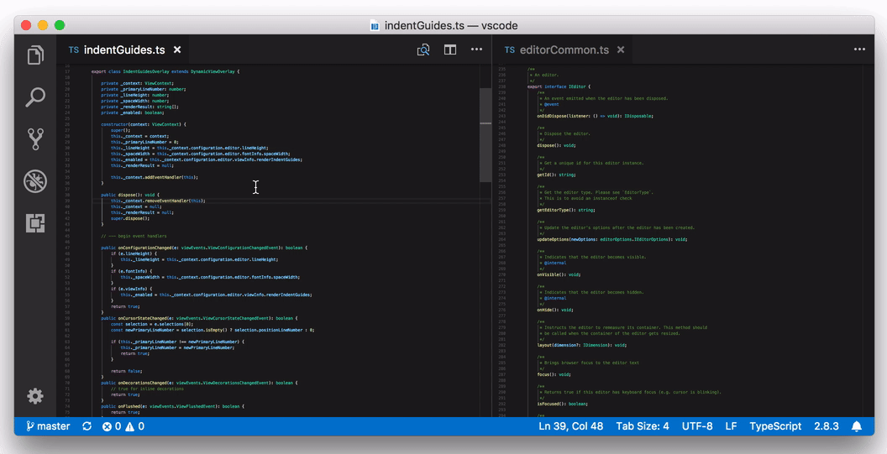

## Workbench

### Problems view filtering

You can now include or exclude files in the Problems view using filters.

* Use glob patterns in the filter input box to include/exclude files. An exclude pattern must be prefixed with `!`. For example, `!*.js` will remove all files that have a .js extension.
* There is a **Filter using Files Exclude Setting** button to remove all files matching your `files.exclude` setting.

The short video below shows filtering the project `out` directory based on the `files.exclude` setting and ignoring all `node_modules` by typing `!**/node_modules/**` in the filter input box:

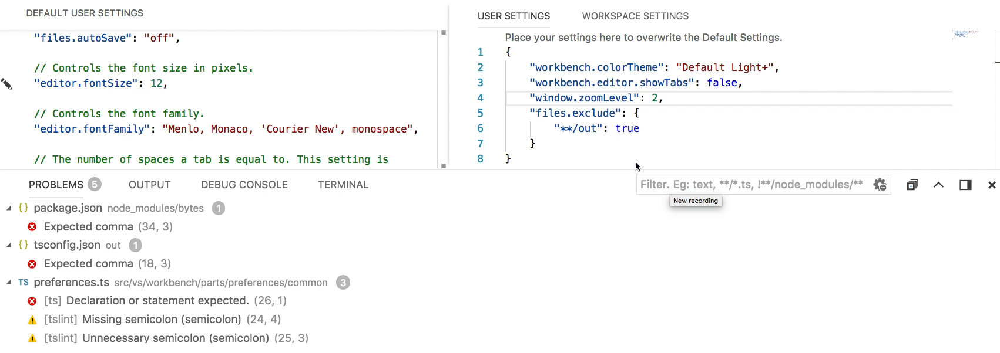

### NPM script running

With the setting `npm.enableScriptExplorer`, you can enable an explorer that shows the scripts defined in your workspace.

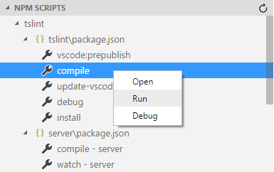

The explorer supports:

* Open a script inside a `package.json` file or the `scripts` section when the `package.json` file is selected. This is the default action when selecting a script.
* Run a script as a [task](https://code.visualstudio.com/docs/editor/tasks) with the output shown in the Integrated Terminal.
* Debug a script. To launch the node debugger, the script needs to define a node debug option like `--inspect-brk` ([see also](https://code.visualstudio.com/docs/nodejs/nodejs-debugging#_launch-configuration-support-for-npm-and-other-tools)).

Use the `npm.exclude` setting to exclude scripts in `package.json` files contained in particular folders.

### Git clone improvements

There have been several improvements to the Git clone workflow. When running the **Git: Clone** command:

* A native dialog is used to pick the repository location.
* The new notification progress API is used, improving the operation status reporting.
* VS Code will prompt you whether you'd like to add the cloned repository to your workspace or open it directly.

The Git extension also adopted the new proposed API to handle [system-wide URIs](#protocol-handler-api) and invokes Git clone on specific URIs. Here's an example URI which clones `https://github.com/microsoft/vscode-vsce.git`:

```bash
vscode://vscode.git/clone?url=https%3A%2F%2Fgithub.com%2FMicrosoft%2Fvscode-vsce.git
```

If you'd like to try this out:

* Windows: In a Command Prompt, type: `explorer "vscode://vscode.git/clone?url=https%3A%2F%2Fgithub.com%2FMicrosoft%2Fvscode-vsce.git"`.
* macOS: In a shell, type: `open vscode://vscode.git/clone?url=https%3A%2F%2Fgithub.com%2FMicrosoft%2Fvscode-vsce.git`.

### Copy results from search context menu

The search results tree context menu includes three new options: **Copy**, **Copy Path**, and **Copy All**. This was a highly 👍'd request which will make it easier to share or export your search results.

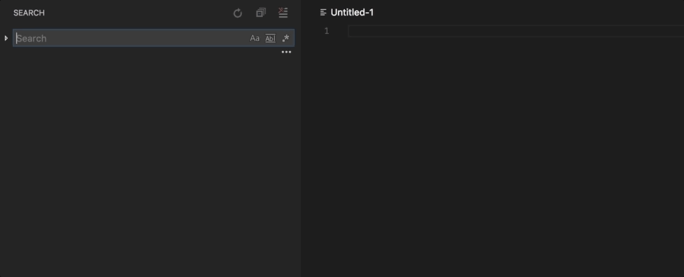

### Return of the separate search include and exclude input boxes

Last month, we merged the include and exclude input boxes in the Search view in an attempt to simplify and streamline it, while also saving a little vertical space. However, we heard from [many of you](https://github.com/microsoft/vscode/issues/46315) that this didn't fit with the way you were using the Search view. Eventually, we decided to simply revert the change and so with this release, we are back to having separate include/exclude boxes as we had before 1.22. Note that you **don't** need to use `!` on patterns in the exclude box.

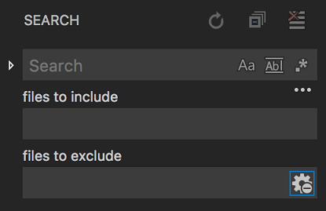

### Custom Activity Bar views

Extension authors can now add their own [view containers](#contributions-to-the-activity-bar) to the Activity Bar. Depending on your installed extensions, after an update you may see UI such as custom explorers move from the File Explorer to a new custom view container. For example, below you can see that the explorers from the [Azure App Service](https://marketplace.visualstudio.com/items?itemName=ms-azuretools.vscode-azureappservice) and [Azure Databases](https://marketplace.visualstudio.com/items?itemName=ms-azuretools.vscode-cosmosdb) extensions have moved to a dedicated Azure view.

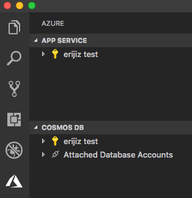

### See the running Visual Studio Code processes

Use the **Developer: Open Process Explorer** command or **Help** > **Open Process Explorer** menu item to open a new window that contains continuously updating information about running VS Code processes. Processes are listed with their CPU and memory usage, PID, and friendly name, and can be killed from a context menu that appears on right-clicking.


## Integrated Terminal

### Multi-root support for terminal splitting

You will now be able to select the folder to split the terminal into when inside a multi-root workspace. The old behavior can be reenabled by keybinding the `workbench.action.terminal.splitInActiveWorkspace` command.

## Languages

### CSS region folding

You can now use `/* #region */` and `/* #endregion */` to mark a region as foldable in CSS/SCSS/Less. In SCSS/Less, you can also use `// #region` and `// #endregion` as folding markers.

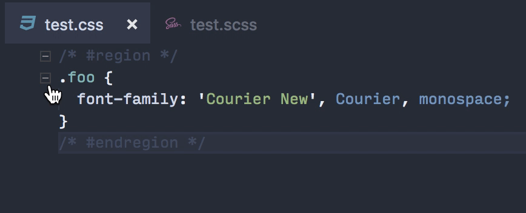

### Improved CSS support for new properties

Previously, VS Code would show an "Unknown Property" error for some experimental CSS properties, such as `backdrop-filter`:

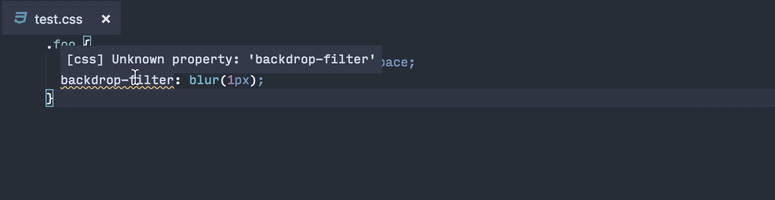

You would either have to turn off CSS linting completely or endure this error, even if you are using CSS frameworks such as [PostCSS](https://postcss.org) that allows you to use experimental CSS properties.

In this release, with data sourced from [Mozilla Developer Network](https://github.com/mdn/data), VS Code now identifies 87 new CSS properties. If you can find a CSS property on MDN, VS Code should recognize it.

Furthermore, with data from MDN, VS Code now provides enhanced completions in CSS/SCSS/Less, showing the syntax and status value of each CSS properties.

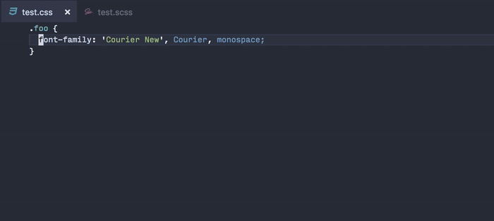

Although there is no built-in support for validating CSS property values yet, the [CSSTree validator](https://marketplace.visualstudio.com/items?itemName=smelukov.vscode-csstree) extension also uses data from MDN and offers linting for each property value based on its [value definition syntax](https://developer.mozilla.org/en-US/docs/Web/CSS/Value_definition_syntax):

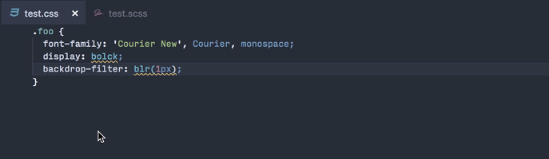

### Markdown workspace symbol search

Markdown now has support for workspace symbol search. After opening a Markdown file for the first time, you can use (`kb(workbench.action.showAllSymbols)`) to search through the headers of all Markdown files in the current workspace:

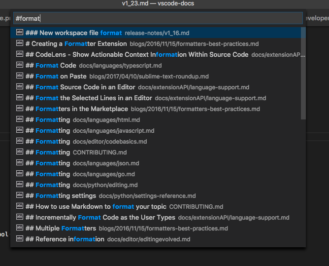

### Persistent Markdown previews

Markdown previews are now automatically restored when you reopen VS Code:

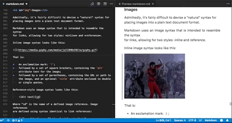

Previously previews had to be reopened whenever you restarted VS Code.

### TypeScript 2.8.3

VS Code now ships with TypeScript 2.8.3. This release fixes a [number of important bugs](https://github.com/microsoft/TypeScript/milestone/68?closed=1).

### JavaScript and TypeScript Organize Imports

The JavaScript and TypeScript organize imports feature is now out of preview. Run **Organize Imports** (`kb(editor.action.organizeImports)`) to quickly remove unused imports and sort the remaining imports in your JavaScript and TypeScript source code.

You can now also configure organize imports to be run on save using the new [`editor.codeActionsOnSave` setting](#run-code-actions-on-save). Here are the settings to enable organize imports on save for TypeScript files:

```json
"[typescript]": {
    "editor.codeActionsOnSave": {
        "source.organizeImports": true
    }
},
"[typescriptreact]": {
    "editor.codeActionsOnSave": {
        "source.organizeImports": true
    }
}
```

## Debugging

### Logpoint improvements

Logpoints were introduced in the last release and we've improved their ease of use and usefulness:

* IntelliSense (smart completion) has been added for expressions embedded in log messages and conditional breakpoints.
* When using Logpoints in Node.js debugging, structured objects embedded in the log message appear as expandable object in the Debug Console:

  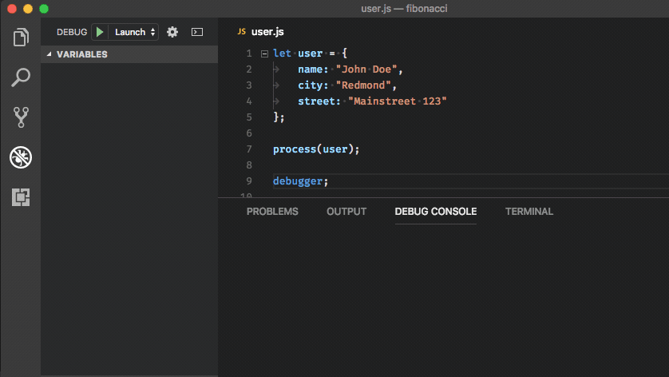

* Logpoints in Node.js debugging now show their source location in the Debug Console:

  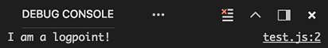

* Since Logpoints and breakpoints can be easily deleted by clicking on their icon in the editor's gutter, you can accidentally lose a log message or a breakpoint condition. To prevent this, VS Code now prompts when a breakpoint with a condition or log message is deleted by clicking in the gutter. The alert gives you the option to disable the breakpoint instead of deleting it.
* Last but not least, we've added a **New Breakpoint** > **Logpoint...** action to the **Debug** menu.

## Extension Authoring

### Contributions to the Activity Bar

As more and more extensions are creating custom views and the majority of them are contributed to the File Explorer, we noticed the Explorer was getting cluttered. To scale up, VS Code now provides a way to contribute to the Activity Bar. As an example, there is now a **Test** contribution to the Activity Bar. Extensions can now make their own contributions.

**Test view container**

A new Test contribution is now provided in the Activity Bar for the extensions to contribute Test related views. This Test contribution is empty and hidden by default and is shown whenever views are contributed to it. The example shows how the `mocha` custom view is contributed to the **Test** activity in the Activity Bar.

```json
"contributes": {
    "views": {
        "test": [
            {
                "id": "mocha",
                "name": "mocha"
            }
        ]
    }
}
```

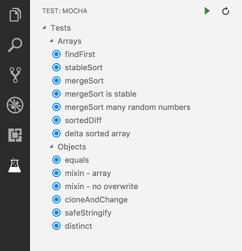

**Custom view containers**

An extension can now define additional activities in the Activity Bar using the contribution point `viewsContainers`.

```json
"contributes": {
        "viewsContainers": {
            "activitybar": [
                {
                    "id": "package-explorer",
                    "title": "Package Explorer",
                    "icon": "resources/package-explorer.svg"
                }
            ]
        },
        "views": {
            "package-explorer": [
                {
                    "id": "package-dependencies",
                    "name": "Dependencies"
                },
                {
                    "id": "package-outline",
                    "name": "Outline"
                }
            ]
        }
}
```

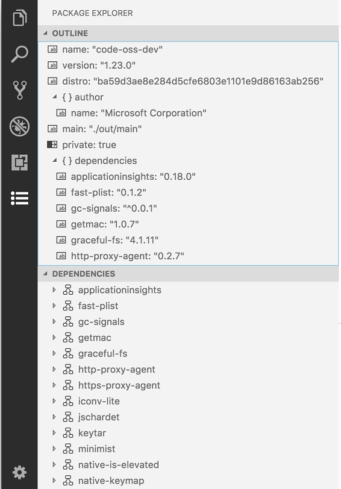

 **Icon specifications**

* `Size:` Icons are 24x24 centered on a 50x40 square.
* `Color:` Icons should use a single monochrome color.
* `Format:` It is recommended that icons be in SVG, though any image file type is accepted.
* `States:` All icons inherit the following state styles:

  |State|Opacity
  |-|-|
  |Default|60%
  |Hover|100%
  |Active|100%

A command is registered to show each registered view container. In the Package Explorer example above, it would be **View: Show Package Explorer**. You can also find all view containers listed when you run the command **View: Open View...**.

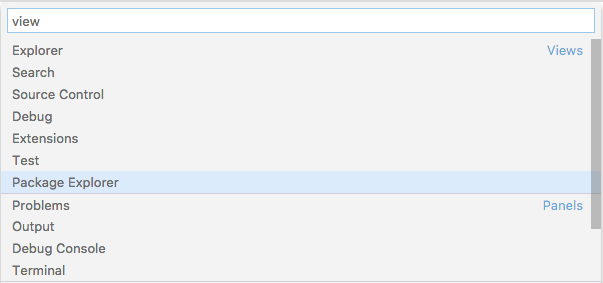

**NOTE:** It is recommended that you group related views into a single view container instead of creating a view container for each view.

### Custom views in Source Control

You can now contribute Source Control Management (SCM) related custom views into the Source Control view container in the Activity Bar. You can show, hide and re-order these views just like in the Explorer.

```json
"contributes": {
    "views": {
        "scm": [
            {
                "id": "git-compare",
                "name": "Compare"
            }
        ]
    }
}
```

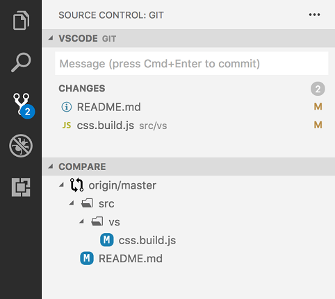

### FileSystem Providers

Extensions can now serve files and folders from arbitrary sources, like ftp-servers, and VS Code will handle them just like regular files. To do so, use the `FileSystemProvider` interface which an extension associates with a URI scheme, like `ftp`. With that interface, the editor can discover and manage files and folders (create, delete, read, and write).

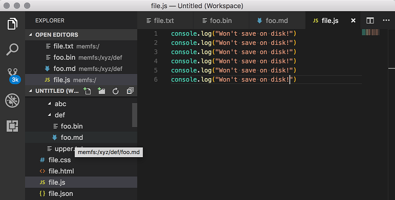

VS Code can also read and modify configuration files (`settings.json`, `tasks.json`, `launch.json`) served by FileSystem Providers.

**Language Identifiers and Document Selectors**

The addition of FileSystem Providers means that not all files live on disk and extensions should be aware of this. The short, but **important**, message is that not all documents live on disk and if your extension relies on disk-access, you **must** check the [scheme](https://github.com/microsoft/vscode/blob/470d92886a599302aa16e84ea8330817a7faef6f/src/vs/vscode.d.ts#L91) first.

To raise awareness, we have added an information message which shows when you register a language feature using just a language identifier, not a document filter. For more details, visit the [Document Selector](https://code.visualstudio.com/docs/extensionAPI/document-selectors) topic.

Last, there is a sample extension which you can use for testing. It implements a filesystem that keeps everything in memory, nothing is on disk, and you can test your language features against that. Get the extension [here](https://marketplace.visualstudio.com/items?itemName=jrieken.vscode-memfs).

**Watch out: TextDocument.isUntitled**

Due to the addition of FileSystem Providers, we have adjusted the semantics of `TextDocument.isUntitled` to be `true` only for newly created documents (using the `untitled` scheme). Before, all documents not from disk were treated as untitled. This change might alter the behavior of your extension, especially if it assumes that documents that aren't untitled are stored on disk.

### Reading Diagnostics

There is new API to read diagnostics and to be notified when diagnostics change, see `languages.getDiagnostics` and `languages.onDidChangeDiagnostics`. For instance, an SCM extension can now check that there are no errors before sharing changes with the team.

### Refined RenameProvider

We have refined the `RenameProvider` API and it can now, optionally, implement a new function called `prepareRename`. With that function, the provider can help VS Code resolve and validate the symbol to be renamed.

### Include offset based information in document change events

`TextDocumentContentChangeEvent` has a new property, `rangeOffset`, which, together with `rangeLength`, allows extensions to use `(offset,length)` coordinates to keep track of text document changes.

### Source Code Action kinds

`CodeActionKind.Source` identifies Code Actions that apply to the entire file. Organize imports is a good example of a `Source` Code Action since it can be triggered from any position in a file.

`Source` Code Actions do not show up in the normal Quick Fix lightbulb menu. They must be explicitly requested using the `editor.action.sourceAction` command. `Source` Code Actions also show up in the new **Source Actions** context menu.

### Organize imports Code Actions

Building on `Source` Code Actions, the newly added `CodeActionKind.SourceOrganizeImports` identifies an organize imports Code Action. These actions can be triggered using `editor.action.organizeImports` and have a standard keyboard shortcut: `kb(editor.action.organizeImports)`.

If your extension already implements organize imports, we highly recommend that you migrate it to use `CodeActionKind.SourceOrganizeImports` so that users have a more consistent experience across languages.

### CodeActionProviderMetadata

`registerCodeActionsProvider` now takes an optional `CodeActionProviderMetadata` argument which lets extensions tell VS Code about the kind of Code Actions that a `CodeActionProvider` will provide. This information is used by VS Code to enable the new **Refactor** and **Source Action** context menus. The **Refactor** context menu, for example, will only be enabled when a `CodeActionProvider` is registered with `CodeActionProviderMetadata` indicating that it that provide will return `refactor.*` Code Actions.

### Webview API

The webview API allows extensions to create fully customizable views within VS Code. For example, the built-in Markdown extension uses webviews to render Markdown previews. Webviews can also be used to build complex user interfaces beyond what VS Code's native APIs support.


A [new extension authoring page](https://code.visualstudio.com/docs/extensions/webview) covers the webview API. You can also find an example webview API extension [here](https://github.com/microsoft/vscode-extension-samples/tree/main/webview-sample). We look forward to see how extension authors put this powerful new API to use.

### Application scope settings

If you want your settings to be applied at application level and not get overridden at a window or resource level, you can do that now by using `application` scope.

```json
"configuration": {
    "properties": {
        "git.path": {
            "type": "string",
            "description": "Path to the git executable",
            "scope": "application"
        }
    }
}
```

**Note:** Deprecated `isExecutable` property in favor of using `application` scope since it was meant for the same purpose.

## Proposed Extension APIs

This milestone we added several new proposed extension APIs. We plan to add these APIs to stable in a future milestone once we are confident enough with them. We welcome any feedback on how they work for your extension.

> **Note:** These APIs are still proposed, so in order to use it, you must opt into it by adding a `"enableProposedApi": true` to `package.json` and you'll have to copy the [vscode.proposed.d.ts](https://github.com/microsoft/vscode/blob/main/src/vs/vscode.proposed.d.ts) into your extension project. Also be aware that you cannot publish an extension to the Marketplace that uses the `enableProposedApi` attribute.

### Integrated Terminal API

The Integrated Terminal API has several proposed features that can help extension authors access all terminals and also enables multiplexing of terminals across different machines. All terminals can now be accessed via the API, unlike before where an extension could only access terminal which it created:

```ts
console.log(window.terminals);
```

There's a matching event for this:

```ts
window.onDidOpenTerminal(terminal => {
    console.log('New terminal: ' + terminal.name);
});
```

You can also hook into the raw data stream coming from the terminal's process, including ANSI escape sequences:

```ts
const terminal = window.createTerminal();
terminal.onData(data => {
    console.log('Terminal data: ' + data);
});
```

### Task API

The task API received further polish around task querying and execution from an extension. The newly supported API is:

* `fetchTasks` takes a filter to only query for a subset of tasks.
* `taskExecutions` support fetching the execution objects for all running tasks.
* `TaskExecution` objects provided via `executeTask`, `taskExecutions` or one of the events can be compared using `===`.

The API is still in the proposed state.

### Protocol Handler API

The Protocol Handler API lets extensions handle system-wide URIs. This functionality is useful for cross-application integrations, since it lets other applications send URIs to specific extensions.

```ts
export interface ProtocolHandler {
  handleUri(uri: Uri): void;
}

export namespace window {

  /**
  * Registers a protocol handler capable of handling system-wide URIs.
  */
  export function registerProtocolHandler(handler: ProtocolHandler): Disposable;
}
```

Here's an example Protocol Handler registration:

```ts
function activate() {
    registerProtocolHandler({
        handleUri(uri: Uri) {
            console.log('Received URI', uri.toString());
        }
    });
}
```

For this API, there is a strict relationship between URI authorities and extensions which will handle them: the URI authority must be the extension's ID (`publisher.name`). Take the following URI, for example:

```
 vscode://vscode.git/clone?url=foobar
 \____/   \________/ \___/ \_________/
   |           |        |       |
scheme    authority    path   query
```

This URI's authority is `vscode.git`, so VS Code will forward it to the `vscode.git` extension, given that it has properly registered a Protocol Handler.

Since it can happen that URIs are open before extensions are even registered, a new `onUri` activation event was also introduced. This lets your extension be activated whenever a URI directed towards it is opened.

**Note:** URI handling is [not yet supported in Linux](https://github.com/microsoft/vscode/issues/48528).

### Folding Provider API

The folding range provider proposed in release 1.22 was updated and is now an official API. Language extensions can now provide syntax aware folding ranges.

```ts
   /**
    * Register a folding range provider.
    *
    * Multiple providers can be registered for a language. In that case providers are asked in
    * parallel and the results are merged.
    * If multiple folding ranges start at the same position, only the range of the first registered provider is used.
    * If a folding range overlaps with an other range that has a smaller position, it is also ignored.
    *
    * A failing provider (rejected promise or exception) will
    * not cause a failure of the whole operation.
    *
    * @param selector A selector that defines the documents this provider is applicable to.
    * @param provider A folding range provider.
    * @return A [disposable](#Disposable) that unregisters this provider when being disposed.
    */
   export function registerFoldingRangeProvider(selector: DocumentSelector, provider: FoldingRangeProvider): Disposable;
```

## Contributions to Extensions

Our team maintains or contributes to a number of VS Code extensions. Most notably this month:

### Sublime Text Keymap extension

[The Sublime Text Keymap extension](https://marketplace.visualstudio.com/items?itemName=ms-vscode.sublime-keybindings) is now able to import settings from Sublime.

The first time the extension is launched, a prompt is shown that displays all your importable Sublime settings. If you want to import your settings at a later time, use the **Sublime Text Keymap: Import Sublime Text Settings** command from the **Command Palette** (`kb(workbench.action.showCommands)`).

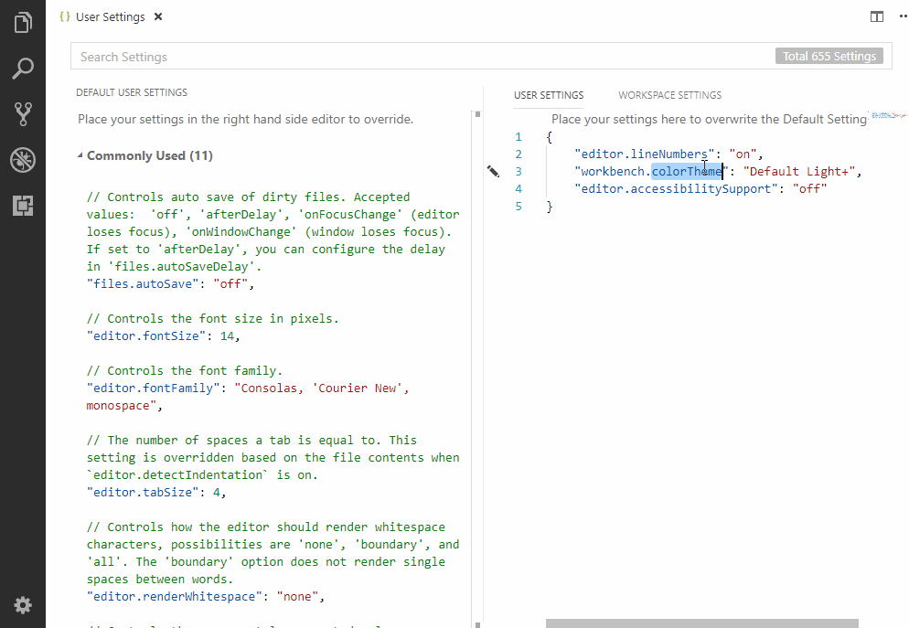

## Engineering

### Improved Smoke Test stability

VS Code has always had a smoke test, which is used to keep quality under strict control. We had automated the smoke test yet failed to make it stable. This milestone we worked on improving the stability and performance of the smoke test. More details can be found in [pull request #47471](https://github.com/microsoft/vscode/pull/47471).

## New Documentation

### Website deployment tutorial using Azure Storage

We have a new [Deploy static website to Azure](https://code.visualstudio.com/tutorials/static-website/getting-started?utm_source=VsCode&utm_medium=ReleaseNotes) tutorial for creating and deploying a static website using [Azure Storage](https://learn.microsoft.com/azure/storage/).

### VS Code blog posts

There were two recent posts on the VS Code [blog](https://code.visualstudio.com/blogs):

* [Bing-powered settings search in VS Code](https://code.visualstudio.com/blogs/2018/04/25/bing-settings-search) - Improving settings search by using Bing's natural language services.
* [Text Buffer Reimplementation](https://code.visualstudio.com/blogs/2018/03/23/text-buffer-reimplementation) - Read about the development of our optimized text buffer implementation.

## Notable Changes

* [10663](https://github.com/microsoft/vscode/issues/10663): Preserve view state when switching tabs on compare view
* [24634](https://github.com/microsoft/vscode/issues/24634): macOS: Add a setting to enable acceptsFirstMouse for window
* [29549](https://github.com/microsoft/vscode/issues/29549): Multi thread debugging should support stopping thread
* [46785](https://github.com/microsoft/vscode/issues/46785): With no file in focus, "Reveal in Finder" should open the workspace's folder
* [47274](https://github.com/microsoft/vscode/issues/47274): Node Logpoints shows up as the VM source in Debug Console
* [47478](https://github.com/microsoft/vscode/issues/47478): Detect incomplete installed extensions
* [48733](https://github.com/microsoft/vscode/issues/48733): Introduce an option debug.enableAllHovers to enable calls to hover providers while debugging
* [46414](https://github.com/microsoft/vscode/issues/46414): Debugging Node.js process in a terminal no longer shows output in the Debug Console

## Thank You

Last but certainly not least, a big *__Thank You!__* to the following folks that helped to make VS Code even better:

Contributions to `vscode`:

* [@alexglazkov9](https://github.com/alexglazkov9):  Integrated terminal doesn't open when window has no folders [PR #46518](https://github.com/microsoft/vscode/pull/46518)
* [Brett Cannon (@brettcannon)](https://github.com/brettcannon):  Allow space between # and `region` for folding in Python [PR #46885](https://github.com/microsoft/vscode/pull/46885)
* [@cody](https://github.com/cody):  Enable Clear Search even if there are no results found [PR #48324](https://github.com/microsoft/vscode/pull/48324)
* [@costincaraivan](https://github.com/costincaraivan):  Adding fold markers for region/endregion in YAML. [PR #47722](https://github.com/microsoft/vscode/pull/47722)
* [David  (@ddruker)](https://github.com/ddruker):  Clear selection by pressing escape key in integrated terminal [PR #47042](https://github.com/microsoft/vscode/pull/47042)
* [Dustin Campbell (@DustinCampbell)](https://github.com/DustinCampbell):  Update C# TextMate grammar with latest bug fixes [PR #47520](https://github.com/microsoft/vscode/pull/47520)
* [Florian Traber (@floriantraber)](https://github.com/floriantraber):  Make git delete popup modal [PR #47052](https://github.com/microsoft/vscode/pull/47052)
* [Filip Malinowski (@fmal)](https://github.com/fmal):  Set background-color explicitly instead of shorthand declaration [PR #47785](https://github.com/microsoft/vscode/pull/47785)
* [@ivorhuang](https://github.com/ivorhuang):  Start debugger on Restart if debugger is not started yet [PR #47219](https://github.com/microsoft/vscode/pull/47219)
* [Josh Goldberg (@JoshuaKGoldberg)](https://github.com/JoshuaKGoldberg):  Fix isInsalled typo in source [PR #47435](https://github.com/microsoft/vscode/pull/47435)
* [@KarelCasier](https://github.com/KarelCasier):  Add config parameter to disable collapsible cursors (#37967) [PR #38175](https://github.com/microsoft/vscode/pull/38175)
* [Kenny Le (@kennyle1412)](https://github.com/kennyle1412):  Split Terminal based on workspace path [PR #46461](https://github.com/microsoft/vscode/pull/46461)
* [Laurel Williams (@lwillia)](https://github.com/lwillia):  Fix triple click on extension id selecting extra info [PR #47921](https://github.com/microsoft/vscode/pull/47921)
* [Matt Acosta (@mattacosta)](https://github.com/mattacosta):  Regenerate php functions. [PR #47865](https://github.com/microsoft/vscode/pull/47865)
* [Dmitry Ignatovich (@mechatroner)](https://github.com/mechatroner):  Move huge file params to user config [PR #44988](https://github.com/microsoft/vscode/pull/44988)
* [Michael Klement (@mklement0)](https://github.com/mklement0):  Update package.json to support PowerShell Core shebang lines. [PR #44239](https://github.com/microsoft/vscode/pull/44239)
* [Niklas Mollenhauer (@nikeee)](https://github.com/nikeee):  Change Hover#range to be optional [PR #48004](https://github.com/microsoft/vscode/pull/48004)
* [Pascal Fong Kye (@pfongkye)](https://github.com/pfongkye):  Meaningful warning message when formatting [PR #47919](https://github.com/microsoft/vscode/pull/47919)
* [Yemi Bedu @ P&R (@pr-yemibedu)](https://github.com/pr-yemibedu):  Tiny typographic change [PR #47451](https://github.com/microsoft/vscode/pull/47451)
* [Pradeep Murugesan (@pradeepmurugesan)](https://github.com/pradeepmurugesan)
  * Deleting multiple directory message [PR #47956](https://github.com/microsoft/vscode/pull/47956)
  * Open root folder when no file is in focus and reveal in finder [PR #47090](https://github.com/microsoft/vscode/pull/47090)
  * Add the workspace symbol provider for markdown [PR #47610](https://github.com/microsoft/vscode/pull/47610)
* [Benas Svipas (@svipben)](https://github.com/svipben):  Different border styles for high contrast [PR #46956](https://github.com/microsoft/vscode/pull/46956)
* [vincentLiu (@vincentLiuxiang)](https://github.com/vincentLiuxiang):  Export SymbolEntry to reuse QuickOpen [PR #47544](https://github.com/microsoft/vscode/pull/47544)

Contributions to `vscode-extension-samples`:

* [Niklas Mollenhauer (@nikeee)](https://github.com/nikeee): Change `client` folder to `lsp-sample` [PR #59](https://github.com/microsoft/vscode-extension-samples/pull/59)

Contributions to `language-server-protocol`:

* [Simon Marchi (@simark)](https://github.com/simark): Change TextDocumentSyncKindIncremental -> TextDocumentSyncKind.Increm... [PR #419](https://github.com/microsoft/language-server-protocol/pull/419)
* [Adelar da Silva Queiróz (@adelarsq)](https://github.com/adelarsq): Sorting language servers by Language [PR #424](https://github.com/microsoft/language-server-protocol/pull/424/)
* [Geoffrey Gilmore (@ggilmore)](https://github.com/ggilmore): Clarify "textDocument/didOpen" requirement [PR #431](https://github.com/microsoft/language-server-protocol/pull/431)
* [Junfeng Li (@autozimu)](https://github.com/autozimu): Typo. [PR #434](https://github.com/microsoft/language-server-protocol/pull/434)
* [Niklas Mollenhauer (@nikeee)](https://github.com/nikeee): Add `undefined` to TextDocuments#get(uri: string) [PR #339](https://github.com/microsoft/vscode-languageserver-node/pull/339)
* [Caleb Lloyd (@caleblloyd)](https://github.com/caleblloyd): Fix for sticky sidebar going off page on Desktop [PR #444](https://github.com/microsoft/language-server-protocol/pull/444)
* [Diego Berrocal (@CestDiego)](https://github.com/CestDiego): [PR #450](https://github.com/microsoft/language-server-protocol/pull/450)
* [Remy Suen (@rcjsuen)](https://github.com/rcjsuen):
  * Escape pipe characters so that they get rendered in HTML [PR #435](https://github.com/microsoft/language-server-protocol/pull/435)
  * Change workspace/configuration's icon to be a request [PR #441](https://github.com/microsoft/language-server-protocol/pull/441)
  * Change workspace/workspaceFolder's icon to be a request [PR #442](https://github.com/microsoft/language-server-protocol/pull/442)
  * Clarify the default for TextDocumentSyncOptions's change [PR #448](https://github.com/microsoft/language-server-protocol/pull/448)

Contributions to `vscode-languageserver-node`:

* [Remy Suen (@rcjsuen)](https://github.com/rcjsuen):
  * Fix registration parameters for workspace/didChangeWatchedFiles [PR #320](https://github.com/microsoft/vscode-languageserver-node/pull/320)
  * Add middleware to intercept textDocument/publishDiagnostics [PR #322](https://github.com/microsoft/vscode-languageserver-node/pull/322)
  * Add deprecated boolean property to CompletionItem and SymbolInformation [PR #332](https://github.com/microsoft/vscode-languageserver-node/pull/332)
  * Fix documentLink/resolve by introducing a data field [PR #336](https://github.com/microsoft/vscode-languageserver-node/pull/336)
  * Replace symlinking in Travis build with npm scripts [PR #338](https://github.com/microsoft/vscode-languageserver-node/pull/338)
* [Niklas Mollenhauer (@nikeee)](https://github.com/nikeee): Resolve #340 [PR #341](https://github.com/microsoft/vscode-languageserver-node/pull/341)

Contributions to `vscode-chrome-debug`:

* [@digeff](https://github.com/digeff)
  * Update to -core 4.1.4 [PR #644](https://github.com/microsoft/vscode-chrome-debug/pull/644)
  * Error with stack trace [PR #637](https://github.com/microsoft/vscode-chrome-debug/pull/637)
* [Alexey Velikiy (@jonyrock)](https://github.com/jonyrock):  change format 'json' to 'javascript' in code [PR #640](https://github.com/microsoft/vscode-chrome-debug/pull/640)

Contributions to `vscode-chrome-debug`:

* [@digeff](https://github.com/digeff)
  * Ignore bp resolved for unknown script [PR #325](https://github.com/microsoft/vscode-chrome-debug-core/pull/325)
  * Sanitize stack traces so they don't contain full file paths [PR #322](https://github.com/microsoft/vscode-chrome-debug-core/pull/322)
  * Update notice to latest version [PR #320](https://github.com/microsoft/vscode-chrome-debug-core/pull/320)

Contributions to `vscode-node-debug2`:

* [@digeff](https://github.com/digeff)
  * Update to -core 4.1.4 [PR #187](https://github.com/microsoft/vscode-node-debug2/pull/187)
  * Now we reject with an error that has a stack trace [PR #185](https://github.com/microsoft/vscode-node-debug2/pull/185)

Contributions to `localization`:

There are over 800 members in the Transifex [VS Code project](https://aka.ms/vscodeloc) team with about 100 active contributors every month. We appreciate your contributions, either by providing new translations, voting on translations, or suggesting process improvements.

Here is a snapshot of contributors for this release. For details about the project including the contributor name list, visit the project site at [https://aka.ms/vscodeloc](https://aka.ms/vscodeloc).

* **French:** Antoine Griffard, Adrien Clerbois, Thierry DEMAN-BARCELO, Jean Cuteaux, Quentin BRETON.
* **Italian:** Alessandro Alpi, Andrea Dottor, Aldo Donetti, Marco Dal Pino, Riccardo Cappello.
* **German:** J.M., Levin Rickert.
* **Spanish:** Andy Gonzalez, Alejandro Medina, Alberto Poblacion, Thierry DEMAN-BARCELO, Eickhel Mendoza.
* **Japanese:** Shunya Tajima, Yuichi Nukiyama, Yosuke Sano, Seiji Momoto, Satoshi Kajiura, Toshinori Sugita.
* **Chinese (Simplified):** Joel Yang, YF, pluwen.
* **Chinese (Traditional):** Winnie Lin, Duran Hsieh, Ryan Tseng, Alan Tsai, alantea, Will 保哥.
* **Korean:** ChangJoon Lee, HANSEULMARO KIM.
* **Russian:** Michel Ace, Ivan.
* **Bulgarian:** Любомир Василев.
* **Hungarian:** Tar Dániel.
* **Portuguese (Brazil):** Alessandro Fragnani, Roberto Fonseca, Marcelo Fernandes, Rodrigo Crespi, Matheus Palu, Bruno Sonnino, Douglas Eccker, douglas.martim.
* **Portuguese (Portugal):** Hugo Martins, Daniel Correia, Isac Van Dunem, Tiago Costa, João Mata.
* **Turkish:** Adem Coşkuner, Burak Karahan, Özgür Öktem, Ömer Büyükçelik.
* **Bosnian:** Muharem Basanovic, Bahrudin Hrnjica, Ismar Bašanović, Almir Vuk.
* **Czechia:** Vít Staniček, Vojtěch Habarta, m_fr, Frantisek Veris, Jakub Skořepa, Michal Zobec, Ferdinand Prantl, Ľubomír Kováč, Jan Brudný.
* **Dutch:** Marco van den Hout, Maarten van Stam, Gerald Versluis.
* **Finnish:** Petri Niinimäki, Feetu Nyrhinen.
* **Hindi:** Brahma Dev.
* **Indonesian:** Febrian Setianto (Feber), Wildan Mubarok, Adrian M. R., G-RiNe Project, Joseph Aditya P G, Mulia Arifandi Nasution, Herman Prawiro.
* **Latvian:** kozete, Pēteris Kļaviņš, Edgars, Simone Chiaretta.
* **Polish:** Joanna Skurzyńska, Mateusz Wyczawski.
* **Romania:** Schiriac Robert.
* **Serbian:** Jean Cuteaux.
* **Thai:** ภูมิไผท จันทรศรีวงศ์.
* **Ukrainian:** Dmytro Kyrychuk, Borys Lebeda.
* **Esperanto:** Andy Hampton.

<!-- In-product release notes styles.  Do not modify without also modifying regex in gulpfile.common.js -->
<a id="scroll-to-top" role="button" aria-label="scroll to top" href="#"><span class="icon"></span></a>
<link rel="stylesheet" type="text/css" href="css/inproduct_releasenotes.css"/>
